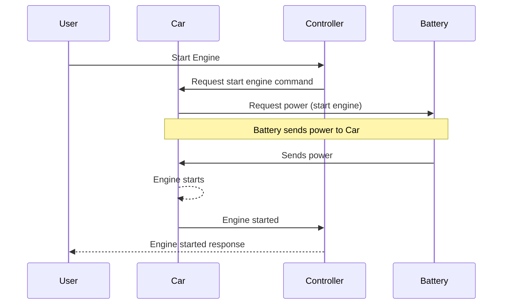

## Chapter 3: jumpstarter/examples/automotive/jumpstarter_example_automotive/__init__.py

 Title: Understanding `jumpstarter/examples/automotive/jumpstarter_example_automotive/__init__.py` in the JumpStarter Project

   In the context of the JumpStarter Project, the file `jumpstarter/examples/automotive/jumpstarter_example_automotive/__init__.py` serves as an entry point for demonstrating the usage and functionality of JumpStarter in the automotive domain. This file is part of a series of example projects provided within JumpStarter, designed to illustrate best practices and versatility across different use-cases.

   The main purpose of this file is to:

   1. Define necessary imports from the JumpStarter core library and other required modules.
   2. Create one or more example projects that demonstrate practical applications of JumpStarter in the automotive industry, such as a vehicle telematics system, an electric vehicle charging station management system, or a fleet management solution.

   Key elements within this file may include:

   - Classes and functions specific to the chosen automotive use-case, such as data models for vehicles, charging stations, or fleet management objects.
   - Implementations of JumpStarter's design patterns (e.g., factories, repositories, services) to organize and manage project components effectively.
   - Integration with third-party libraries and APIs where necessary, such as vehicle data providers, mapping services, or IoT platforms.

   This code fits into the broader JumpStarter Project by providing a concrete example of how to apply its principles in the automotive domain. By studying this example, developers can gain insights into best practices for organizing and implementing projects using JumpStarter, as well as learn about the unique challenges and solutions associated with automotive applications.

   Example use cases for the code in `jumpstarter/examples/automotive/jumpstarter_example_automotive/__init__.py` may include:

   1. Developing a real-time vehicle tracking system that uses GPS data to monitor the location and speed of vehicles in a fleet, helping fleet managers optimize routes and increase efficiency.
   2. Implementing an electric vehicle charging station network management system that allows drivers to locate available charging stations, start charging sessions, and pay for services using a mobile app.
   3. Creating a predictive maintenance solution that uses machine learning algorithms to analyze sensor data from vehicles in a fleet and provide alerts for potential issues before they become critical.

 I'm glad you asked! However, it's important to note that Mermaid is a text-based tool for generating diagrams and flowcharts from Markdown-like syntax. To create a sequence diagram for the given example, we need to identify the key functions and their interactions. Here's a simple sequence diagram using Mermaid syntax:

This diagram represents the following interactions:

1. User requests the engine start (`Start Engine`) through the Controller.
2. The Controller forwards this request to the Car.
3. The Car asks for power from the Battery.
4. The Battery sends power to the Car, which starts the engine.
5. The Car informs the Controller that the engine has started.
6. The Controller communicates back to the User that the engine start was successful.