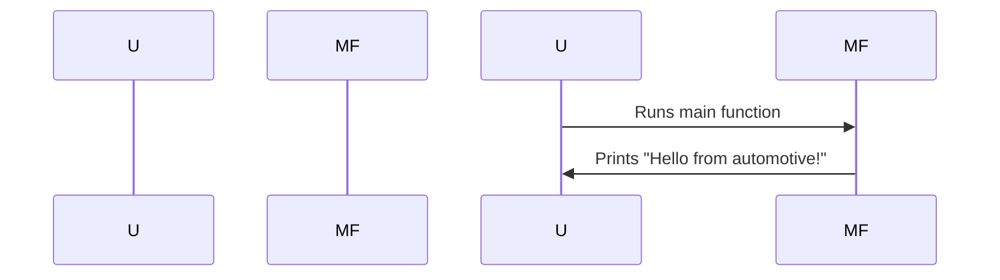

## Chapter 4: jumpstarter/examples/automotive/jumpstarter_example_automotive/hello.py

 In this chapter, we will delve into the `jumpstarter/examples/automotive/jumpstarter_example_automotive/hello.py` file, a simple Python script within the JumpStarter project's automotive examples folder. This file serves as an entry point for understanding how to create basic applications within the JumpStarter framework in the context of the automotive domain.

   The purpose of this file is primarily educational, providing a starting point for developers who are new to the JumpStarter project or the automotive application development within it. This script demonstrates the structure and functionality expected for Python scripts within the automotive examples directory.

   The key function in this script is the `main()` function. When called, this function simply prints "Hello from automotive!" to the console. It provides a simple example of how to organize your code, with the main entry point being a well-named and self-contained function.

   This script does not contain any classes or complex logic, as it is intended to be a straightforward introduction to the project structure. However, more advanced scripts within the JumpStarter automotive examples directory may include custom classes, functions, and complex logic for creating robust applications.

   The `if __name__ == "__main__":` statement at the end of the script ensures that when this file is run as a standalone Python script, it calls the `main()` function to execute its purpose. When this file is imported as a module by another script, the `main()` function is not executed.

   In terms of where this code fits in the project, this simple example demonstrates how other scripts within the automotive examples directory should be structured. As developers create more complex and domain-specific applications within the JumpStarter framework, they can follow the structure outlined in this file to ensure their code is well-organized, maintainable, and easy to understand.

   Example use cases for similar scripts could include initializing a simulation of an automotive system, interfacing with hardware components, or creating tests for automotive software modules within the JumpStarter framework. By following the structure demonstrated in this script, developers can create flexible, scalable, and easy-to-maintain applications tailored to their specific needs within the automotive domain.

 In this simple Python script, there is only one function `main()` that gets called when the script is run. So, a sequence diagram might not be the best way to visualize the interactions in this case. However, for the sake of understanding, let me provide a very basic mermaid sequence diagram to represent the flow:

In this diagram, the user represents anyone who runs the script (e.g., by typing `python hello.py`), and MainFunction is the function called when the script is run. The arrows represent the flow of control, moving from the user running the script to the main function executing its print statement.

In more complex programs with multiple interacting functions or classes, you can use mermaid sequence diagrams effectively to illustrate their interactions.