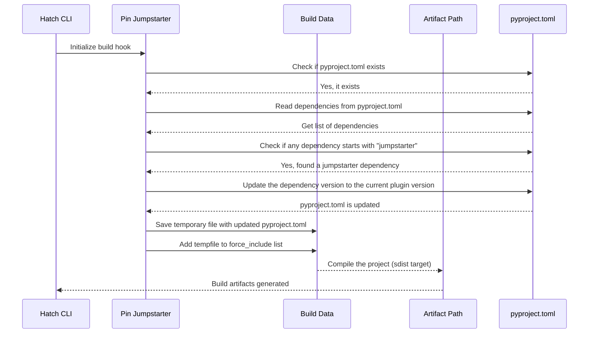

## Chapter 7: jumpstarter/packages/hatch-pin-jumpstarter/src/hatch_pin_jumpstarter/__init__.py

 The file `jumpstarter/packages/hatch-pin-jumpstarter/src/hatch_pin_jumpstarter/__init__.py` is a Python script that serves as the entry point for the 'PinJumpstarter' plugin within the Hatch project, an open-source build system and package manager for Python.

   The PinJumpstarter plugin functions as a build hook, which is an extension point in Hatch's build process. This plugin allows for modifying the dependencies of a specific package during the build phase, in this case, updating the version of jumpstarter packages to match the current project version.

   The `PinJumpstarter` class implements the `BuildHookInterface`, which is an interface that plugins must adhere to in order to be compatible with Hatch's build system. This class has two methods: `initialize()` and `finalize()`.

   - The `initialize()` method checks if the current build target is not 'sdist'. If it is, the script reads the project's pyproject.toml file, locates and updates the versions of any dependencies that start with 'jumpstarter' to match the current project version. A temporary file is created for the updated metadata, and its path is added to the build data so it can be included in the final package.

   - The `finalize()` method cleans up by removing the temporary file after the build process has completed.

   This plugin is useful when you have a jumpstarter project that relies on specific versions of other jumpstarter packages. By using PinJumpstarter, you can ensure that the correct version is included in your package during the build phase.

 Here is a simple Mermaid sequence diagram that illustrates the interaction between the `PinJumpstarter` class and its environment during the build process. Please note that this diagram only covers the high-level flow, and some details might be omitted or simplified for better readability.

This diagram shows that when Hatch initializes the build process, it calls the `initialize()` method of the `PinJumpstarter` class. The `PinJumpstarter` reads the dependencies from the pyproject.toml file, checks if any dependency starts with "jumpstarter", updates the version to match the current plugin version, saves the updated pyproject.toml as a temporary file, and adds it to the force_include list for compilation. Finally, the build artifacts are generated after compiling the project (sdist target).