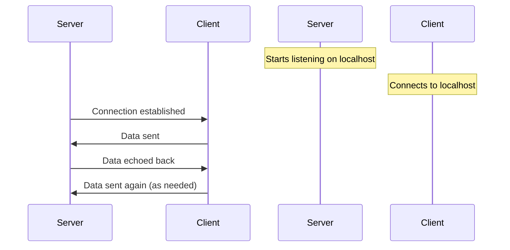

## Chapter 101: jumpstarter/packages/jumpstarter-driver-network/jumpstarter_driver_network/conftest.py

 In this chapter, we delve into the purpose and functionality of the file `jumpstarter/packages/jumpstarter-driver-network/jumpstarter_driver_network/conftest.py`. This file is an essential part of the test suite in the Jumpstarter project.

   The primary objective of this file is to set up a fixture for testing network communication-related components within the `jumpstarter-driver-network` package. In particular, it initializes a TCP echo server that can be utilized in test cases requiring network communication.

   The key function in this file is `echo_handler`, which serves as the callback function for handling incoming connections on the TCP server. This function reads data from an input stream and then writes the same data back to the stream. If any exceptions occur during the process, it catches them gracefully and continues execution without failure.

   The test fixture `tcp_echo_server` is defined using Pytest's built-in `@pytest.fixture` decorator. Within this function, a temporary TCP listener is created using the `TemporaryTcpListener` class from the `jumpstarter.common` module. This listener listens on localhost (127.0.0.1) and calls the `echo_handler` function for each incoming connection. The `yield addr` statement allows other test functions to access the server's address (addr), which can be used to connect to it during testing.

   This code fits into the overall project by providing a consistent and repeatable way of setting up network communication tests within the Jumpstarter-Driver-Network package. Example use cases for this fixture may include testing network drivers that require sending and receiving data over TCP connections.

   In summary, `jumpstarter/packages/jumpstarter-driver-network/jumpstarter_driver_network/conftest.py` sets up a TCP echo server for testing network communication-related components in the Jumpstarter project. This fixture simplifies and streamlines network testing by providing a consistent and repeatable setup for testing various network drivers.

 Here is a simple Mermaid sequence diagram representing the interaction between the `tcp_echo_server` fixture and its corresponding client. Please note that this is a simplified version, assuming a single client connects to the server and sends data.

This diagram shows that the `tcp_echo_server` starts listening for connections on localhost, and when a client connects, it sends data back to the client. The client continues sending data as needed, and the server continues echoing the received data back to the client.