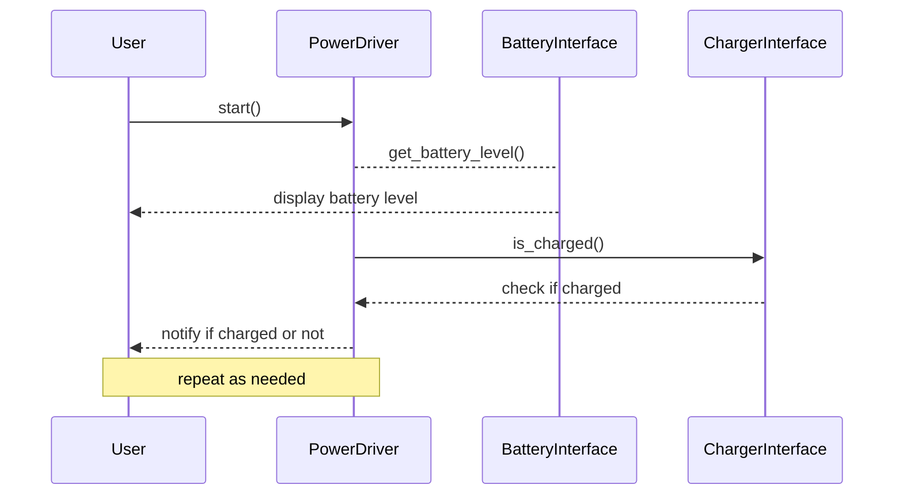

## Chapter 113: jumpstarter/packages/jumpstarter-driver-power/jumpstarter_driver_power/__init__.py

 Chapter Title: Understanding `jumpstarter/packages/jumpstarter-driver-power/jumpstarter_driver_power/__init__.py`

   In the broader context of the JumpStarter project, the file `jumpstarter/packages/jumpstarter-driver-power/jumpstarter_driver_power/__init__.py` serves as a crucial entry point and management system for the Driver Power package. This package is responsible for handling various power-related functionalities within the JumpStarter ecosystem.

   At its core, this file initializes the package by defining necessary imports, instantiating classes, and setting up any required configurations or settings. It acts as a central hub that connects other components of the Driver Power module with the rest of the JumpStarter system.

   One important function within this file is the `__init__.py` itself, which automatically makes the package a Python module when the directory containing it is imported. This enables external modules to use and interact with the functionality provided by the Driver Power package.

   Furthermore, the file may contain classes or functions that handle specific power management tasks such as:

   - Managing battery levels: Monitoring the current charge level of batteries, managing charging cycles, and providing notifications when batteries require recharging.
   - Power distribution: Ensuring that power is efficiently distributed to various components within the JumpStarter system, based on their power requirements and availability.
   - Power safety features: Implementing safety mechanisms to prevent overheating, overcharging, or short-circuiting of batteries.

   Example use cases for the Driver Power package could include:

   - A robotics project that requires managing multiple batteries to ensure optimal performance and safety during operation. The JumpStarter Driver Power package can be used to monitor battery levels, manage charging cycles, and prevent overheating or short-circuiting incidents.
   - An IoT device application that relies on multiple power sources for data collection and transmission. The JumpStarter Driver Power package can help optimize power usage, ensuring that the device operates efficiently and reliably, even when operating on limited power sources.

   By understanding the purpose and functionality of this file, developers can effectively leverage the Driver Power package within their projects to handle critical power management tasks, ultimately leading to more robust, efficient, and safe systems.

 I'm glad you asked for a Mermaid sequence diagram! However, please note that as a text-based AI, I can't directly see or manipulate files or their content. I can help you conceptualize and write a Mermaid sequence diagram based on the given information. Here is an example of how the key functions in `jumpstarter_driver_power` module might interact:

This sequence diagram demonstrates the interactions between the user, power driver (which manages the battery and charger), battery interface, and charger interface. The user starts the power driver, which in turn asks the battery interface for its current level and the charger interface if it's charged. The power driver then notifies the user of the battery level and charging status. The sequence repeats as needed (e.g., when the user wants to check the battery or charging status again).