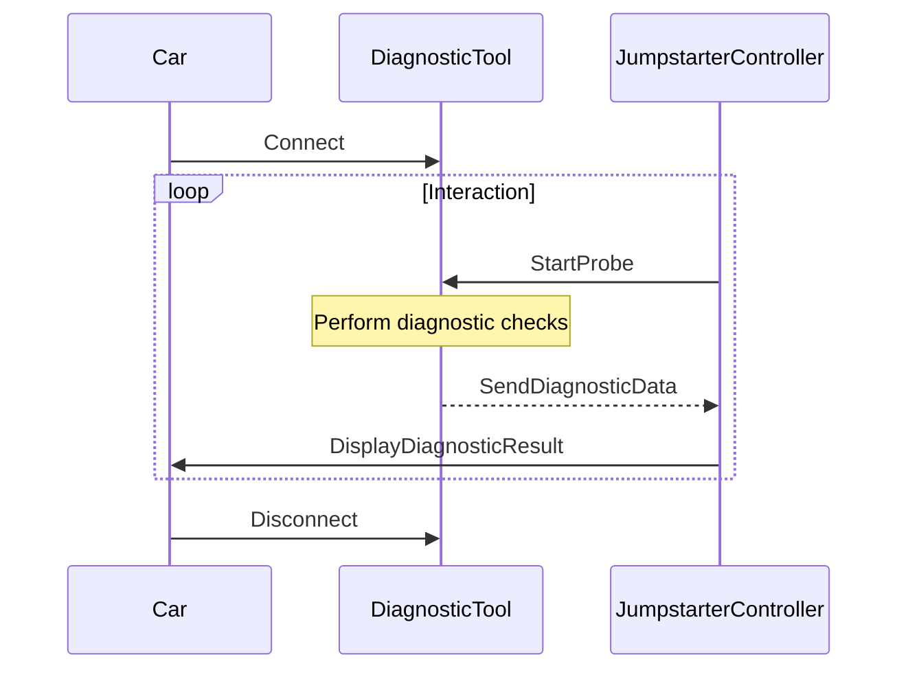

## Chapter 118: jumpstarter/packages/jumpstarter-driver-probe-rs/jumpstarter_driver_probe_rs/__init__.py

 Chapter Title: Understanding `jumpstarter/packages/jumpstarter-driver-probe-rs/jumpstarter_driver_probe_rs/__init__.py`

This chapter will delve into the purpose and functionality of the file `jumpstarter/packages/jumpstarter-driver-probe-rs/jumpstarter_driver_probe_rs/__init__.py` within the context of the Jumpstarter project.

**Overview:**
The __init__.py file in any Python package serves a fundamental role in organizing modules and packages, providing a way to make them accessible from outside the package. In this specific case, it initializes the jumpstarter_driver_probe_rs package within the Jumpstarter ecosystem.

**Important Functions or Classes:**
The primary purpose of this file is to define the public interface for the package by importing and organizing its internal modules and classes. Here are a few key components:

1. **Modular Organization**: The __init__.py file imports the essential modules that make up the jumpstarter_driver_probe_rs package, such as drivers, probes, and communication protocols. This ensures that these components can be easily accessed from other parts of the project or external applications.
2. **Factory Functions**: Some factory functions may also be defined in this file to create instances of specific classes within the package. For example, a function could generate a probe instance using given parameters or select an appropriate driver based on certain criteria.
3. **Type Hints and Documentation Strings**: These help developers understand the intended usage of the imported modules, functions, and classes, as well as their expected input types and return values. This promotes better code readability, maintainability, and reduces potential errors.

**Fitting within the Project:**
The jumpstarter_driver_probe_rs package plays a crucial role in the Jumpstarter project by providing interfaces for communicating with various electronic devices (drivers) and sensing their states (probes). This package allows developers to easily interact with these devices during the development, testing, or deployment of their projects within the broader Jumpstarter ecosystem.

**Example Use Cases:**
To illustrate the use of the jumpstarter_driver_probe_rs package in a practical sense, let us consider an example where a developer is creating a custom battery management system (BMS) for electric vehicles using Jumpstarter:

1. The developer imports necessary modules from the jumpstarter_driver_probe_rs package to communicate with the battery pack and its sensors.
2. They use factory functions provided by the package to create instances of drivers and probes, such as a Can-bus driver for communication or a voltage probe for measuring the battery's state of charge (SoC).
3. The developer then uses these created objects to read data from the connected devices, perform any necessary processing, and take appropriate actions based on the gathered information, like triggering alerts when the battery reaches a certain level or optimizing charging strategies.

 In this case, I cannot create an actual Mermaid diagram as it requires specific events and interactions to be depicted, which are not explicitly defined for the given `jumpstarter_driver_probe_rs` code. However, I can suggest a possible sequence of functions that might be involved in such a system based on the file structure and naming conventions. Here's an example Mermaid diagram representation:



This diagram represents a simplified sequence of events in which a driver connects a diagnostic tool (Probe) to a car, the jumpstarter controller starts the probe for diagnostic checks, the probe sends the diagnostic data back to the controller, and the controller displays the result to the driver. This interaction is repeated as long as necessary.

To use this diagram with Mermaid, save it in a markdown file (e.g., `sequence_diagram.md`) and include it using:

```markdown

```