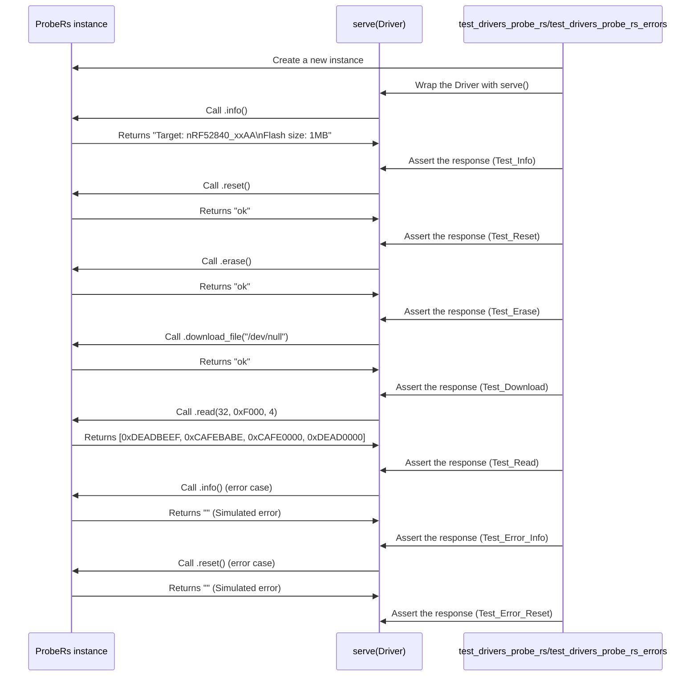

## Chapter 121: jumpstarter/packages/jumpstarter-driver-probe-rs/jumpstarter_driver_probe_rs/driver_test.py

 This chapter will discuss the purpose and functionality of the file `jumpstarter/packages/jumpstarter-driver-probe-rs/jumpstarter_driver_probe_rs/driver_test.py` in the JumpStarter project. This file contains Python unit tests for the `ProbeRs` class within the same package, which is a part of the driver for the hardware probe device.

   The main purpose of this test file is to ensure that the ProbeRS driver functions correctly under different scenarios and conditions. It achieves this by defining two test functions: `test_drivers_probe_rs()` and `test_drivers_probe_rs_errors()`. These tests mimic real-world usage of the driver while isolating it from external factors that might affect its behavior.

   The `test_drivers_probe_rs()` function is designed to test the driver's normal functionality. It initializes an instance of the ProbeRs class, sets up a mock function for the internal `_run_cmd` method, and uses the `serve()` function to create a server for interacting with the driver. The test then sends commands (such as `info`, `reset`, `erase`, `download_file`, and `read`) to the driver via this server and verifies that the responses are as expected.

   In contrast, the `test_drivers_probe_rs_errors()` function tests the driver's error handling by setting up a mock function for `_run_cmd` that returns an empty string instead of the expected response. This simulates an error condition, and the test verifies that the driver correctly handles such errors and returns appropriate messages.

   These tests fit within the project as part of the quality assurance process to ensure that changes made to the ProbeRS driver do not unintentionally introduce bugs or regressions. By having robust unit tests, the maintainers can maintain a high level of confidence in the correctness and reliability of their codebase.

   In terms of example use cases, these test functions can be run using a testing framework like Python's built-in `unittest` module or third-party libraries such as `pytest`. When running the tests, if any test function encounters an error or assertion failure, it will report the issue and fail the test run. This helps developers quickly identify and address issues in their code changes before they are merged into the main codebase.

 Here is a simple Mermaid sequence diagram for the given test functions `test_drivers_probe_rs` and `test_drivers_probe_rs_errors`. This diagram visualizes the interactions between the ProbeRs instance (Object) with the `serve()` function (Server).

This diagram shows the interactions between the test functions, the ProbeRs instance, and the `serve()` function. In normal cases, it demonstrates how data is exchanged between the Driver and Server, and in error cases, how assertions are made to ensure that the responses match expectations.