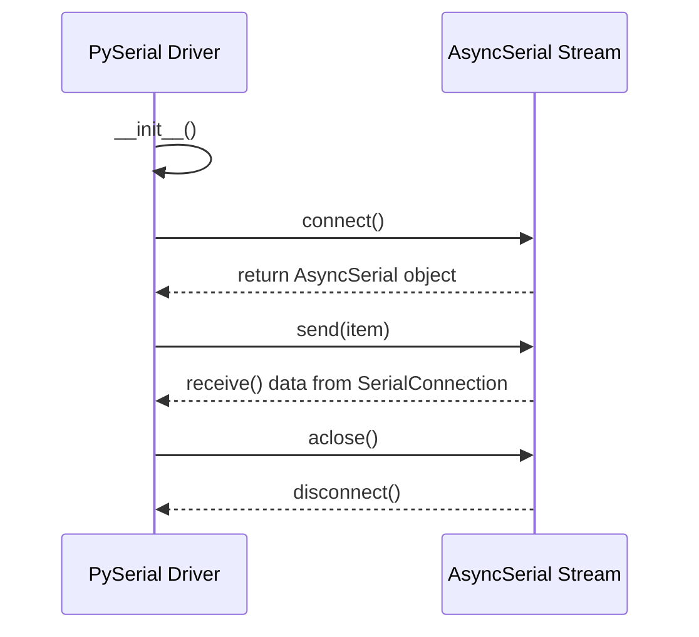

## Chapter 125: jumpstarter/packages/jumpstarter-driver-pyserial/jumpstarter_driver_pyserial/driver.py

 The `jumpstarter/packages/jumpstarter-driver-pyserial/jumpstarter_driver_pyserial/driver.py` file defines a custom serial driver for the Jumpstarter project using Python's `asyncio` library and PySerial, an asyncio compatible version of the popular serial library for Python.

   The primary purpose of this file is to provide a way to communicate with external hardware devices over a serial connection asynchronously in the Jumpstarter ecosystem. This driver serves as a replacement for synchronous serial communication, improving performance and scalability in certain use cases.

   The main classes defined in this file are `AsyncSerial` and `PySerial`.

   - The `AsyncSerial` class implements an object stream using anyio's `StreamReaderWrapper` and `StreamWriterWrapper`, allowing bidirectional communication over a serial connection. It includes methods for sending data (`send()`), receiving data (`receive()`), closing the connection (`aclose()`), and handling end-of-file events (`send_eof()`).

   - The `PySerial` class represents a serial driver instance that inherits from the base `Driver` class. It requires a URL for connecting to the device, an optional baud rate, and a flag to check whether the device is present before attempting connection (if not connecting to the loopback interface). During initialization, it ensures the specified serial port is available if necessary. The `client()` method returns the class name of the corresponding client for creating new instances of this driver.

   This custom driver can be used in conjunction with other components within the Jumpstarter project, such as sensors or actuators, to establish an asynchronous communication channel between them and the main application. For example, a sensor device could send its readings over the serial connection to the main application for processing, while the main application sends commands or settings to the actuator via the same connection.

   To use this driver in your code, you would first import it from the `jumpstarter.driver` module and create an instance of the `PySerial` class with the appropriate URL and baud rate. Then, you can utilize the asynchronous methods provided by the `AsyncSerial` object stream to send and receive data over the serial connection.

   Here's an example usage:

```python
from jumpstarter.driver import PySerial

# Create a new instance of the PySerial driver with a specified URL and baud rate
serial_driver = PySerial(url='COM1', baudrate=9600)

async def main():
    # Connect to the device asynchronously using the created driver instance
    async with serial_driver.connect() as stream:
        # Send some data over the connection
        await stream.send("Hello, world!")

        # Receive a response from the device and print it out
        response = await stream.receive()
        print(f'Received: {response}')

if __name__ == '__main__':
    anyio.run(main)
```

 Here is a simple mermaid sequence diagram that visualizes the interactions between the key functions in the given Python code. Note that this diagram represents a simplified version of the actual flow, assuming synchronous execution for clarity purposes.



This diagram shows that when the driver is initialized, it connects to the serial connection. Once connected, it can send and receive data through the stream. When the driver is done communicating, it closes the connection. Keep in mind that this diagram does not show any exceptions or error handling.