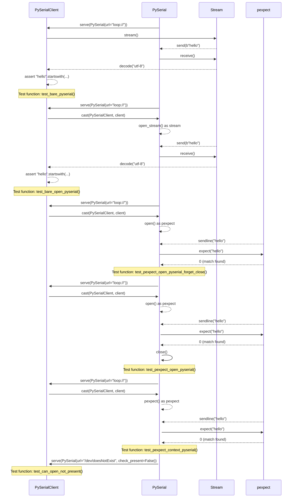

## Chapter 126: jumpstarter/packages/jumpstarter-driver-pyserial/jumpstarter_driver_pyserial/driver_test.py

 In this technical book chapter, we will discuss the purpose and functionality of the Python script `jumpstarter/packages/jumpstarter-driver-pyserial/jumpstarter_driver_pyserial/driver_test.py`. This file is a test suite for the PySerial driver in the JumpStarter project. The tests ensure that the driver functions as intended when interacting with hardware devices via serial communication.

   The primary objective of this test script is to validate the correct behavior of the `PySerial` class and its associated methods, such as opening a connection, sending data, receiving data, and closing the connection. The tests are designed to be flexible enough to accommodate different implementations of the PySerial library while verifying that the core functionality remains consistent.

   The test suite contains several functions for testing various scenarios involving the `PySerial` class:

   1. **test_bare_pyserial()**: Tests opening a bare serial connection using the `PySerial` class and sending/receiving data with an in-memory stream.
   2. **test_bare_open_pyserial()**: Similar to the previous test, but explicitly casting the returned client object to `PySerialClient`.
   3. **test_pexpect_open_pyserial_forget_close()** and **test_pexpect_open_pyserial()**: Demonstrate the usage of pexpect library for interactive communication with the serial device using the PySerial class. The former forgets to close the connection, while the latter ensures proper closure of the stream.
   4. **test_pexpect_context_pyserial()**: Uses a context manager to open, use and automatically close the serial connection via pexpect.
   5. **test_can_open_not_present()**: Verifies that when a device is not present at the specified URL (e.g., /dev/doesNotExist), the test does not raise an exception. This is achieved by setting `check_present=False` when serving the dummy PySerial instance.

   These tests fit into the larger context of the JumpStarter project, which aims to provide a modular and scalable platform for developing and deploying IoT applications. The test suite helps ensure that the project's core components operate as expected, promoting confidence in their functionality.

   In practical terms, these tests help developers verify the correctness of their serial communication implementations when working with JumpStarter's PySerial driver. This promotes best practices and enables consistent behavior across different use cases within the JumpStarter ecosystem.

 Here is a simple sequence diagram using mermaid to visualize the interactions between the key functions:

This diagram shows the interactions between the PySerialDriver, PySerialClient, Stream, and Pexpect when the different test functions are called.