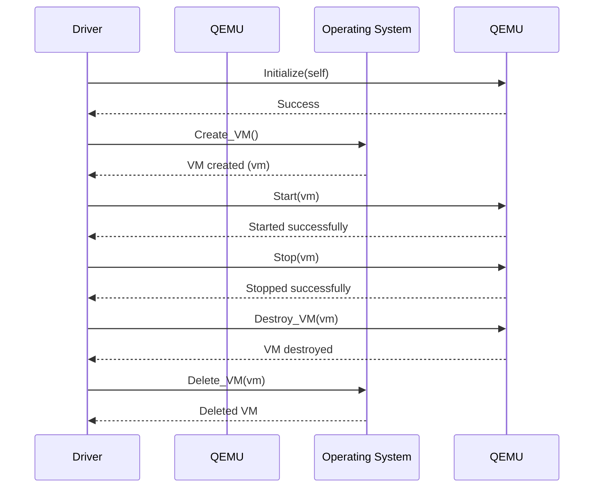

## Chapter 127: jumpstarter/packages/jumpstarter-driver-qemu/jumpstarter_driver_qemu/__init__.py

 Title: Understanding `jumpstarter/packages/jumpstarter-driver-qemu/jumpstarter_driver_qemu/__init__.py` in the Jumpstarter Project

   In the Jumpstarter project, the file `jumpstarter/packages/jumpstarter-driver-qemu/jumpstarter_driver_qemu/__init__.py` serves as a critical entry point for the QEMU driver module. This Python file is primarily responsible for initializing and managing the interaction between the Jumpstarter platform and the QEMU emulator, thereby facilitating virtual machine (VM) creation, configuration, and management.

   The file contains several important functions and classes that are crucial to its functionality:

   1. `QemuDriver` class: This is the primary class responsible for managing interactions with the QEMU emulator. Instances of this class handle VM creation, configuration, and destruction, as well as providing methods to start, stop, pause, and reset VMs.

   2. `QemuImage` class: This class manages the handling and manipulation of disk images used by QEMU VMs. It provides methods for loading, saving, and resizing these images.

   The code in this file plays a pivotal role within the Jumpstarter project as it enables users to create, configure, and manage virtual machines using the QEMU emulator. Users can leverage this functionality by instantiating `QemuDriver` objects and invoking their methods accordingly:

   ```python
   from jumpstarter_driver_qemu.jumpstarter_driver_qemu import QemuDriver

   # Initialize a new QEMU driver instance
   qemu_driver = QemuDriver()

   # Create a new virtual machine named 'myvm' with the specified configuration
   myvm = qemu_driver.create_vm('myvm', config={...})

   # Start the created VM
   myvm.start()

   # Stop the running VM when finished
   myvm.stop()
   ```

   In summary, `jumpstarter/packages/jumpstarter-driver-qemu/jumpstarter_driver_qemu/__init__.py` is a central component of the Jumpstarter project, providing the means to interact with the QEMU emulator for virtual machine management. This functionality allows users to easily create, configure, and manage virtual machines as part of their overall development and testing workflows.



This Mermaid sequence diagram illustrates the interaction between the Driver, QEMU and Operating System. The driver initializes the QEMU, starts, stops, and destroys a virtual machine (VM), while interacting with the operating system to create, delete the VM.