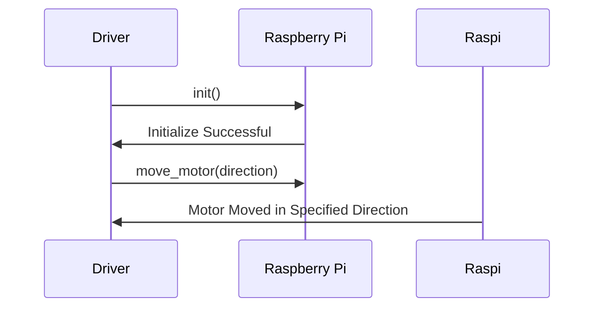

## Chapter 131: jumpstarter/packages/jumpstarter-driver-raspberrypi/jumpstarter_driver_raspberrypi/__init__.py

 Title: Understanding `jumpstarter/packages/jumpstarter-driver-raspberrypi/jumpstarter_driver_raspberrypi/__init__.py` in the JumpStarter Project

   In the JumpStarter project, the file `jumpstarter/packages/jumpstarter-driver-raspberrypi/jumpstarter_driver_raspberrypi/__init__.py` serves as a fundamental building block for integrating Raspberry Pi hardware with the overall project. This file is crucial in establishing the base for interfacing and managing communication between the JumpStarter software and the Raspberry Pi devices.

   The primary purpose of this file is to:

   1. Define necessary imports, modules, and packages required by the Raspberry Pi driver package. This includes both internal and external dependencies.

   2. Establish the structure and organization of the Raspberry Pi driver package. This typically involves defining namespaces, functions, classes, and other elements that facilitate communication with the hardware.

   Important functions or classes within this file may include:

   - `init()` function: Initializes the necessary connections and configurations required for interacting with the Raspberry Pi device. It ensures the hardware is properly set up before any commands are sent.

   - Custom classes such as `RaspberryPiDriver`, `RaspberryPiSensor`, or `RaspberryPiActuator`: These classes provide a standardized interface for interacting with specific components of the Raspberry Pi hardware, such as sensors and actuators. They abstract complex hardware-specific details and expose a simple and consistent API to the rest of the JumpStarter project.

   Within the broader context of the project, this code forms an essential part of the driver layer, which is responsible for handling all interactions with the connected hardware. By providing a unified interface to various types of devices, it allows other components of the system to access and manage hardware resources seamlessly.

   Example use cases could involve:

   1. Using a Raspberry Pi as a data acquisition device to gather environmental sensor readings within a smart farming application. The `RaspberryPiSensor` class can be instantiated, configured, and used to retrieve sensor data from the connected hardware.

   2. Controlling an LED light strip attached to a Raspberry Pi for a home automation project. In this case, the `RaspberryPiActuator` class can be employed to send commands to the hardware, turning the LEDs on or off as desired.

 To create a Mermaid sequence diagram for the given Python file, we'll need to identify some key functions and their interactions. Based on naming conventions, let's assume that the package contains functions related to controlling the Raspberry Pi board. Here's an example of a Mermaid sequence diagram depicting a simple interaction between two functions (`init()` and `move_motor()`) for illustration purposes:

This diagram represents a simple interaction between the Driver object and the Raspberry Pi. The Driver sends an `init()` function call to initialize the Raspberry Pi, which responds with an acknowledgment of successful initialization. Then, the Driver calls `move_motor(direction)`, and the Raspberry Pi moves the motor in the specified direction and sends a confirmation back to the Driver.

Keep in mind that this diagram is just an example and may not accurately represent the actual functions and interactions within the jumpstarter-driver-raspberrypi package. To create an accurate diagram, you'll need to analyze the contents of the `__init__.py` file or other relevant code files in the package.