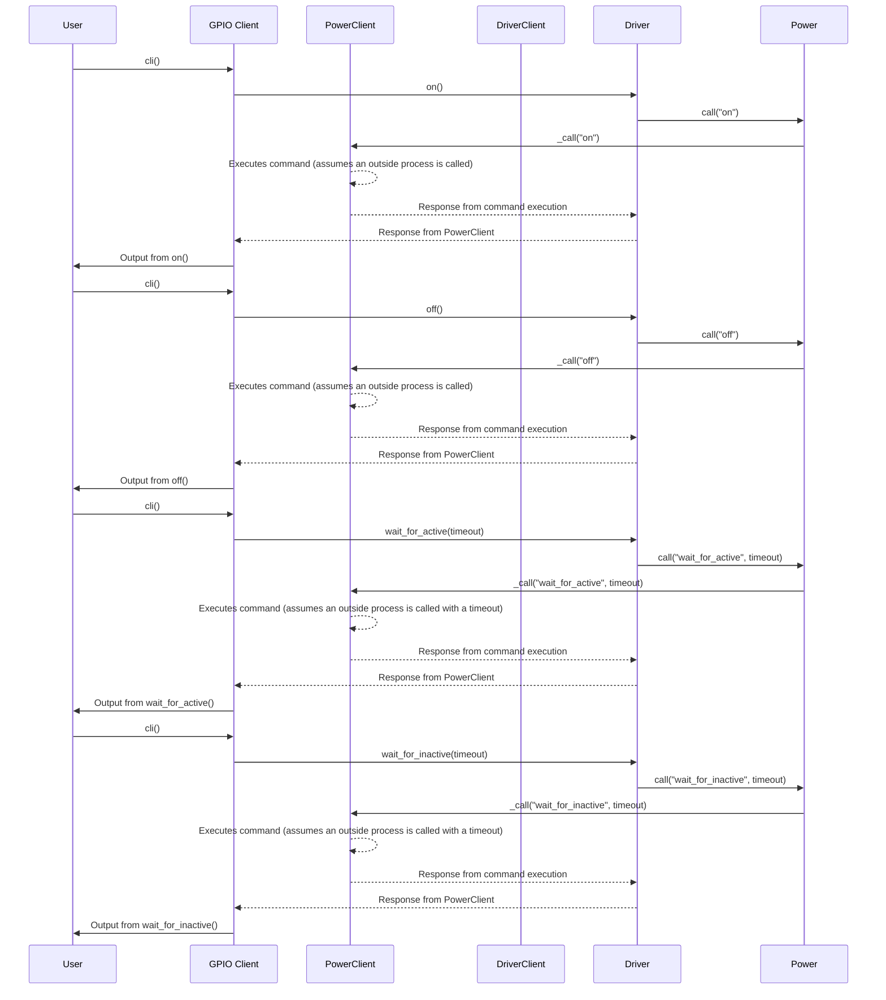

## Chapter 132: jumpstarter/packages/jumpstarter-driver-raspberrypi/jumpstarter_driver_raspberrypi/client.py

 In the `jumpstarter/packages/jumpstarter-driver-raspberrypi/jumpstarter_driver_raspberrypi/client.py` file, we have two classes: `DigitalOutputClient` and `DigitalInputClient`, both of which are designed for interacting with GPIO pins on a Raspberry Pi board within the broader Jumpstarter project.

1. **DigitalOutputClient**: This class inherits from the `PowerClient` class, providing methods to control the state of the connected GPIO pin as an output. The `on()` function sets the pin to a high state (powered on), while the `off()` function sets it to a low state (powered off). Additionally, this class provides a CLI (Command Line Interface) interface for these functions using the `cli()` method.

2. **DigitalInputClient**: This class inherits from the `DriverClient` class and is responsible for interacting with GPIO pins as inputs. The `wait_for_active(timeout: float | None = None)` function waits for the connected pin to go active (high state), optionally taking a timeout parameter. Similarly, the `wait_for_inactive(timeout: float | None = None)` function waits for the connected pin to become inactive (low state).

These classes are part of the driver package for Raspberry Pi devices within the Jumpstarter project. The primary purpose is to provide a simple, consistent interface for controlling GPIO pins on Raspberry Pi boards, abstracting away low-level details and simplifying interactions with the hardware. Example use cases include setting up input sensors, controlling LEDs or relays, or creating custom automation projects using the GPIO pins of a Raspberry Pi board.

For instance, one could create a simple script to turn an LED on and off using DigitalOutputClient as follows:

```python
from jumpstarter_driver_raspberrypi.client import DigitalOutputClient

# Initialize the client
gpio = DigitalOutputClient("gpio0")

# Turn the GPIO pin on
gpio.on()

# Wait for a second
import time
time.sleep(1)

# Turn the GPIO pin off
gpio.off()
```

 Here is a simple sequence diagram using mermaid that visualizes the interactions between the main functions in your code. This diagram assumes a user interacts with the DigitalInputClient and DigitalOutputClient through click commands.

