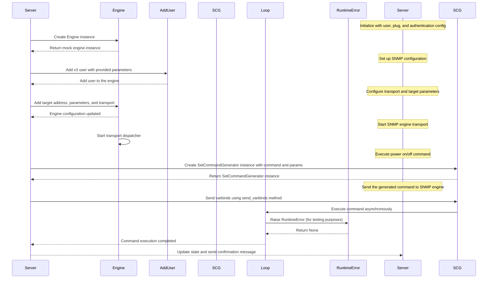

## Chapter 145: jumpstarter/packages/jumpstarter-driver-snmp/jumpstarter_driver_snmp/driver_test.py

 In the `jumpstarter/packages/jumpstarter-driver-snmp/jumpstarter_driver_snmp/driver_test.py` file, a series of tests are conducted to verify the functionality and behavior of the SNMPServer class in the JumpStarter-Driver-SNMP package.

   The primary purpose of this test script is to ensure that the SNMPServer can handle various authentication configurations (noAuth, MD5, SHA, or DES) when it is initialized with different parameters. Moreover, it checks whether the SNMPServer can execute power on and power off commands correctly.

   The following are the important functions and classes in this test script:

   - `setup_mock_snmp_engine()`: Creates a mock pysnmp engine object for testing purposes.

   - `MockMibObject`: A custom mock class that mocks the behavior of a SNMP MIB object, used to simulate instances of pysnmp's built-in classes in test scenarios.

   - Test functions like `test_snmp_auth_configurations`, `test_power_on_command`, and `test_power_off_command`: These functions create mock objects, initialize the SNMPServer with different parameter combinations, and verify that the server responds as expected according to its design.

   This test script fits within the larger project by ensuring that the SNMPServer component of the JumpStarter-Driver-SNMP package works as intended. It helps in maintaining the quality and reliability of the codebase by catching potential issues early during development.

   Example use cases for the tested functionality include setting up an SNMP server with specific authentication configurations, sending power on/off commands to managed devices using SNMP, and verifying that the communication between the SNMP server and devices is functioning properly.

 Here's a Mermaid sequence diagram to visualize the interaction between the key functions when running the tests:

