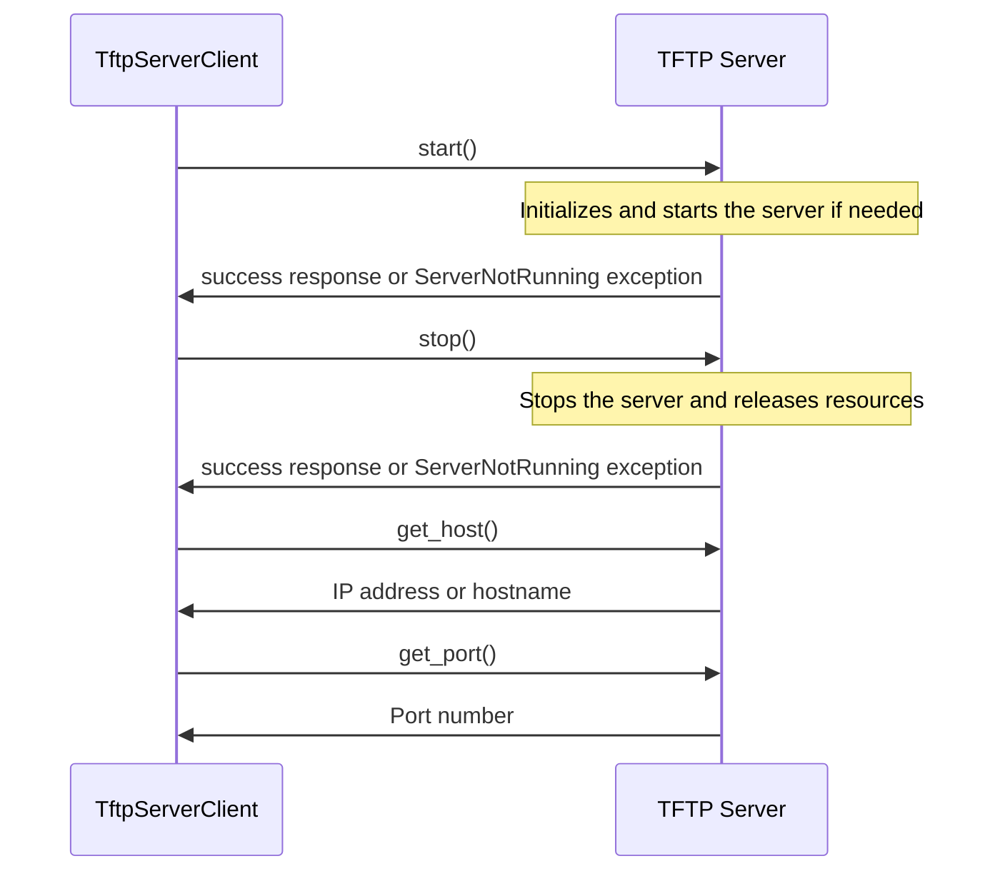

## Chapter 151: jumpstarter/packages/jumpstarter-driver-tftp/jumpstarter_driver_tftp/client.py

 In the `jumpstarter/packages/jumpstarter-driver-tftp/jumpstarter_driver_tftp/client.py` file, a custom client interface for a TFTP (Trivial File Transfer Protocol) server is defined as the `TftpServerClient` class. This class inherits from the more general `CompositeClient` class, which provides a set of common methods for managing various drivers.

   The `TftpServerClient` class offers methods to control the TFTP server and manage files on it. It supports file operations like uploading files from various storage backends through OpenDAL (Open Data Access Layer). This means that you can use this client to transfer data over a network using TFTP protocol, which is commonly used in bootstrapping processes for diskless workstations and other embedded devices.

   The main functions in the `TftpServerClient` class include:

   - `start()` : Initializes and starts the TFTP server if it's not already running. The server will listen on the configured host and port.
   - `stop()` : Stops the running TFTP server and releases associated resources. If the server is not currently running, it raises an exception called `ServerNotRunning`.
   - `get_host()` : Retrieves the IP address or hostname that the server is bound to.
   - `get_port()` : Returns the port number on which the server is listening. By default, it listens on port 69.

   The purpose of this code is to provide a user-friendly interface for controlling and interacting with the TFTP server in the larger context of the JumpStarter project, allowing developers and users to easily manipulate files on the server as needed.

   Example use cases:

   - Bootstrapping a diskless workstation: By using the `TftpServerClient`, you can upload the required operating system image and bootstrap configuration to the TFTP server, allowing the workstation to boot from the network and begin the installation process.
   - Managing embedded devices: You can use the client to transfer firmware updates or configuration files to an embedded device over the network using TFTP protocol.

 Here's a simple Mermaid sequence diagram for the `TftpServerClient` class. This diagram shows the interaction between the client and the server when starting, stopping, getting host, and port information from the TFTP server. Please note that this is a simplified representation and doesn't account for potential errors or edge cases.

