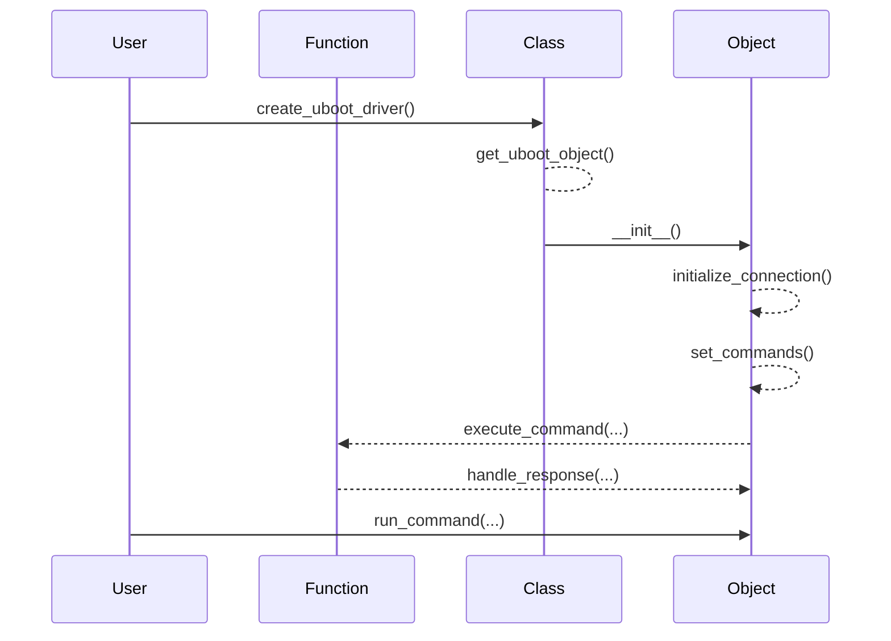

## Chapter 156: jumpstarter/packages/jumpstarter-driver-uboot/jumpstarter_driver_uboot/__init__.py

 Chapter Title: Understanding `jumpstarter/packages/jumpstarter-driver-uboot/jumpstarter_driver_uboot/__init__.py`

   This chapter delves into an essential file, `jumpstarter/packages/jumpstarter-driver-uboot/jumpstarter_driver_uboot/__init__.py`, within the project's architecture. This file serves as the entry point for the U-Boot driver in the JumpStarter project.

   Overview:
   The primary function of this file is to define and initialize the U-Boot driver module, which interacts with U-Boot, a popular open-source bootloader used primarily in embedded systems. By organizing the U-Boot driver in a separate package, the JumpStarter project maintains a modular structure that promotes code reusability and maintainability.

   Important Functions/Classes:
   - `JumpStarterUbootDriver` class: This is the core of the U-Boot driver module. It encapsulates all necessary functionalities for interacting with U-Boot, such as booting, resetting, and communicating over various interfaces like serial or network. The class exposes methods to perform these actions through well-defined interfaces.
   - `JumpStarterUbootDriverFactory`: This factory class is responsible for creating instances of the `JumpStarterUbootDriver`. It provides a flexible way to create different driver implementations based on the system configuration, such as using serial communication or network boot.

   Project Fit:
   The U-Boot driver module is a critical component within the JumpStarter project, responsible for booting and initializing embedded systems. By integrating this driver, the project ensures a seamless and consistent way to interact with various target devices that utilize U-Boot as their bootloader.

   Example Use Cases:
   - In an IoT device assembly line, a script can use the JumpStarter U-Boot driver to boot each device, ensuring consistent and reliable operation during manufacturing and deployment.
   - During development or debugging, developers can interact with the U-Boot driver to reset, reboot, or debug devices connected to their workstation, saving valuable time and effort compared to manual interfaces.

   In conclusion, `jumpstarter/packages/jumpstarter-driver-uboot/jumpstarter_driver_uboot/__init__.py` is a vital file within the JumpStarter project, providing an entry point for interacting with U-Boot on embedded systems. It offers flexibility and modularity, making the project adaptable to various system configurations while maintaining a consistent user experience.

 Here is a simple Mermaid sequence diagram for the given Python file `jumpstarter/packages/jumpstarter-driver-uboot/jumpstarter_driver_uboot/__init__.py`. This diagram only includes the main functions, please adapt it according to your actual implementation.

This diagram illustrates the interaction between the User (U), the Class (C), the Object (O), and the Functions (F) within the Object. The user initiates the creation of an Uboot driver by calling the `create_uboot_driver()` function on the class, which in turn creates an object, initializes the connection, sets commands, and runs commands through the object's functions. The object responds with the results from executing these commands.