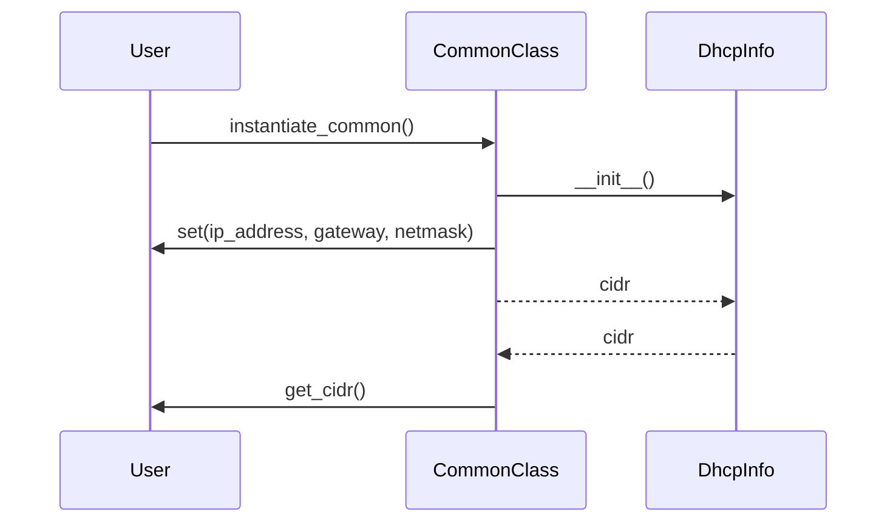

## Chapter 158: jumpstarter/packages/jumpstarter-driver-uboot/jumpstarter_driver_uboot/common.py

 Chapter Title: Understanding `jumpstarter/packages/jumpstarter-driver-uboot/jumpstart_driver_uboot/common.py` in the JumpStarter Project

   This chapter focuses on explaining the purpose and functionality of the Python file, `jumpstarter/packages/jumpstarter-driver-uboot/jumpstart_driver_uboot/common.py`, which is a crucial component of the JumpStarter project. The file serves as a common module for functions and classes utilized across multiple U-Boot driver implementations within the JumpStarter ecosystem.

   The primary class defined in this module is `DhcpInfo`, which represents DHCP (Dynamic Host Configuration Protocol) information. This class inherits from Pydantic's `BaseModel` and defines three properties: `ip_address`, `gateway`, and `netmask`. It also includes a property method, `cidr`, to provide the Classless Inter-Domain Routing (CIDR) representation of the netmask.

   The ESC constant at the beginning of the file is used for Escaped character handling. This character will be discussed in the context of its use with other functions within the JumpStarter project.

   In the broader context of the project, this code provides a consistent interface for handling DHCP information across different driver implementations. The `DhcpInfo` class simplifies parsing and manipulating network configuration data, which is often required when setting up U-Boot environments during the embedded system boot process.

   Example use cases of the `DhcpInfo` class could be found in driver modules where they handle network configuration information received from DHCP servers or when configuring U-Boot to communicate with a host machine for flashing firmware or debugging purposes. The consistent interface provided by this module allows developers to focus on implementing their specific drivers without worrying about handling the underlying DHCP data representation details.

 Here is a simple Mermaid sequence diagram that visualizes the interactions between key functions of `common.py`. Please note that this is a simplified version and may require adjustments based on your specific implementation details.

In this diagram, a user `U` interacts with an instance of the `CommonClass` (`C`) which has an embedded `DhcpInfo` object (`D`). The user creates an instance of the common class (1), initializing the DhcpInfo object in the process. Then, the user sets the ip_address, gateway, and netmask properties for the CommonClass (2). Afterward, the CommonClass calculates and stores the CIDR property within the DhcpInfo object (3 & 4) and provides it to the user through the `get_cidr` method (5).