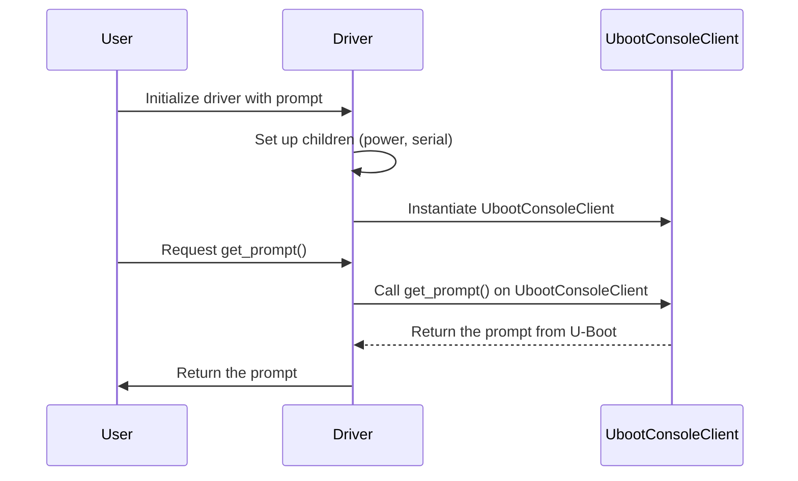

## Chapter 159: jumpstarter/packages/jumpstarter-driver-uboot/jumpstarter_driver_uboot/driver.py

 The `jumpstarter/packages/jumpstarter-driver-uboot/jumpstarter_driver_uboot/driver.py` file is a crucial component of the JumpStarter project, specifically designed for interacting with U-Boot (a popular open-source bootloader used in many embedded systems). This Python module implements a custom driver class named `UbootConsole`, which serves as an interface between your application and the U-Boot console.

   The main purpose of this file is to define the `UbootConsole` class, derived from the base `Driver` class provided by the JumpStarter framework. This class encapsulates functionality for connecting to the U-Boot console, reading/writing commands, and handling other related operations. Notable functions or methods within this class include:

   - `client()`: Returns a string representing the name of the client class responsible for interacting with the U-Boot console (in this case, `jumpstarter_driver_uboot.client.UbootConsoleClient`).
   - `__post_init__()`: Initializes the `UbootConsole` instance after all its attributes have been assigned. It ensures that the `power` and `serial` child drivers are correctly configured, as these components are essential for communicating with U-Boot.
   - `get_prompt()`: Returns the prompt displayed by U-Boot when running commands (e.g., "=>"). This method is decorated with the `@export` function to make it accessible outside of the class via the JumpStarter framework.

   In the larger context of the project, this driver enables your application to communicate with U-Boot through a clean, unified interface. By instantiating an instance of the `UbootConsole` class and calling its methods, you can execute commands on the target system's bootloader, ultimately streamlining development and debugging processes.

   Example use cases for this driver might include:
   - Booting a specific kernel image or device tree binary using U-Boot commands
   - Configuring and flashing various components of your embedded system
   - Running diagnostic tests on the target hardware, such as checking memory settings or verifying bootloader parameters.

 Here is a simple Mermaid sequence diagram that illustrates the interaction between the key functions in the provided Python code for `jumpstarter/packages/jumpstarter-driver-uboot/jumpstarter_driver_uboot/driver.py`.

This diagram represents that the User initializes the Driver with a custom prompt. The Driver sets up its children (power and serial) and instantiates an instance of `UbootConsoleClient`. When the User requests the current prompt using the `get_prompt()` function, the Driver delegates this call to the `UbootConsoleClient`, which retrieves the prompt from U-Boot and returns it back to the Driver, which in turn forwards it to the User.