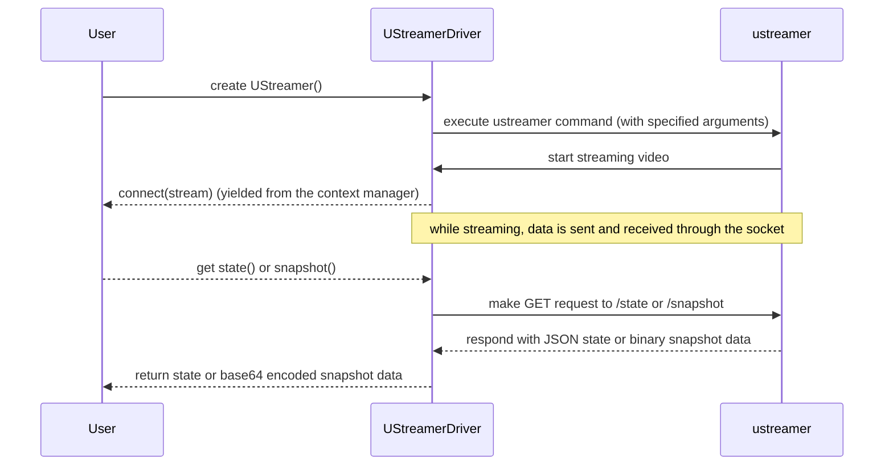

## Chapter 164: jumpstarter/packages/jumpstarter-driver-ustreamer/jumpstarter_driver_ustreamer/driver.py

 The file `jumpstarter/packages/jumpstarter-driver-ustreamer/jumpstarter_driver_ustreamer/driver.py` is a Python module that implements a driver for the UStreamer application within the broader Jumpstarter project. The UStreamer driver provides a way to control and interact with a UStreamer instance, allowing it to stream video and capture its state.

   The main class in this file is `UStreamer`, which extends the base `Driver` class defined in another part of the project. This class is responsible for spawning a UStreamer process, handling communication with it via a Unix socket, and providing APIs to retrieve the current state of the streamer and download snapshots.

   Key functions include:

1. `find_ustreamer()`: locates the executable for the UStreamer application on the system. If it's not found, a `FileNotFoundError` is raised.
2. The constructor for the `UStreamer` class sets up the UStreamer process and its communication socket.
3. `close()` method terminates the UStreamer process when called. It waits for the process to complete but will kill it if it takes longer than 5 seconds.
4. `state()`, `snapshot()`, and stream-related functions: these are the main APIs provided by the driver, allowing users to retrieve information about the current state of the UStreamer instance and download snapshots. They interact with the running UStreamer process via a Unix socket and handle any errors or exceptions that may occur.

   This code is integral to the project as it enables integration between Jumpstarter and UStreamer, allowing users to leverage the powerful streaming capabilities of UStreamer in their projects. Example use cases might include using UStreamer with other components of the Jumpstarter ecosystem for real-time video processing or recording applications.

 Here is a simple sequence diagram using mermaid that illustrates the interaction of the key functions in your `driver.py` script. Please note that mermaid doesn't support all aspects like exception handling, but it gives you an idea of the flow.

This diagram demonstrates that the user creates an instance of `UStreamerDriver`, which in turn executes the `ustreamer` command and starts streaming video. The user can then request the current state or a snapshot, which are retrieved by sending GET requests to the ustreamer process and receiving responses containing JSON or binary data.