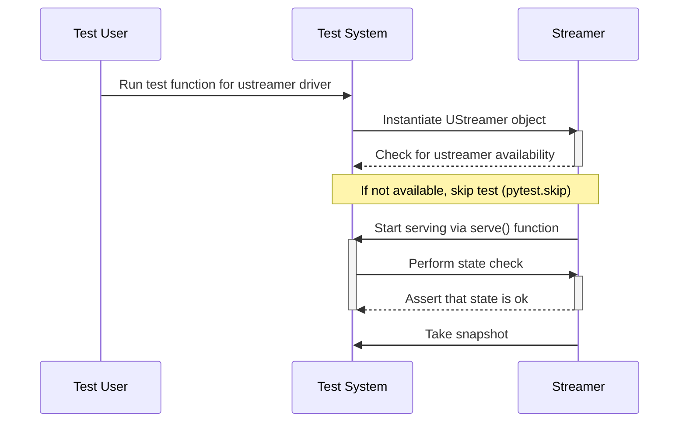

## Chapter 165: jumpstarter/packages/jumpstarter-driver-ustreamer/jumpstarter_driver_ustreamer/driver_test.py

 The file `jumpstarter/packages/jumpstarter-driver-ustreamer/jumpstarter_driver_ustreamer/driver_test.py` is a test script designed to verify the functionality of the UStreamer driver in the JumpStarter project. It serves as a crucial component during the development and testing phase, ensuring that the driver adheres to its intended specifications.

   The primary function in this script is `test_drivers_video_ustreamer()`. This function initializes an instance of the UStreamer class, attempts to connect it using the serve function from jumpstarter.common.utils, checks if the connection is successful, and takes a snapshot. If the ustreamer package is not available on the system, the test will be skipped.

   The UStreamer class in question is located in `jumpstarter_driver_ustreamer/driver.py`, where it is responsible for handling video streaming tasks. The serve function in `jumpstarter/common/utils` facilitates starting a server that the UStreamer can connect to, allowing external clients to interact with it.

   This code fits into the project by providing an automated means of testing the UStreamer driver, which is essential for ensuring its correct behavior and maintaining software quality. Example use cases include verifying that streaming works as expected under different conditions (e.g., varying bitrates, resolutions, and frame rates) or checking that the driver recovers gracefully from errors such as network disconnections.

   By following this test script's execution, developers can have confidence in the functionality of the UStreamer driver before deploying it in their applications.

 Here is a simple Mermaid sequence diagram for the provided Python test case, visualizing the interactions between the `UStreamer` class and the testing environment. Please note that this is an approximation based on the given code snippet, as the exact methods called and their specific arguments are not explicitly defined in the code excerpt you provided.

