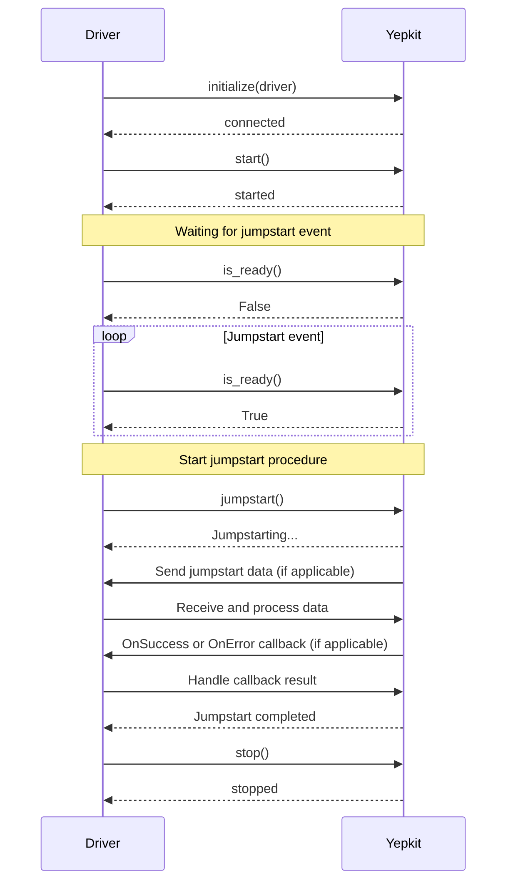

## Chapter 166: jumpstarter/packages/jumpstarter-driver-yepkit/jumpstarter_driver_yepkit/__init__.py

 Title: Understanding `jumpstarter/packages/jumpstarter-driver-yepkit/jumpstarter_driver_yepkit/__init__.py` in the JumpStarter Project

   In the context of the JumpStarter project, the file `jumpstarter/packages/jumpstarter-driver-yepkit/jumpstarter_driver_yepkit/__init__.py` serves as an entry point for the YepKit driver package. This module defines the core structure and provides access to various functionalities related to the integration of third-party devices using the YepKit library.

   The primary purpose of this file is to:

   1. Import all necessary modules and packages within the YepKit driver package, ensuring consistent access to these resources throughout the codebase.
   2. Define any necessary classes or functions that are specific to the YepKit driver, such as device interfaces or utility functions for communicating with devices.
   3. Register these classes or functions with the JumpStarter platform, allowing them to be easily discovered and utilized by other components of the project.

   Some important functions and classes you may find in this file include:

   - `YepKitDriver`: The main interface class for interacting with YepKit devices. This class provides methods for initializing a connection, sending commands, and receiving responses from a device.
   - `YepKitDevice`: An abstract base class that defines common properties and behaviors for all YepKit devices, such as unique identifiers, status indicators, and error handling mechanisms. Subclasses of this class should be created for each specific type of YepKit device supported by the driver.
   - `YepKitCommand`: A class or set of classes that define the various commands supported by YepKit devices. Each command typically includes a unique identifier, required parameters, and any expected responses from the device.

   This code fits within the JumpStarter project as part of the Driver ecosystem, which is responsible for managing communication with various third-party devices. The YepKit driver specifically focuses on devices that utilize the YepKit communication protocol. By using this driver, other components of the project can easily integrate and control these devices, streamlining the development process and improving overall system interoperability.

   Example use cases for the YepKit driver might include controlling a smart lighting system powered by YepKit devices or monitoring temperature sensors within a lab environment using YepKit-enabled equipment. By leveraging this driver, developers can quickly onboard these devices into their JumpStarter projects, reducing development time and increasing the versatility of the platform as a whole.

This sequence diagram illustrates the interaction between a Driver and Yepkit in the `jumpstarter_driver_yepkit` package. The main functions that are visualized here include initializing, starting, checking if the device is ready for jumpstart, performing a jumpstart operation, and stopping the driver. It also demonstrates potential callbacks or handling of data when jumpstarting occurs.