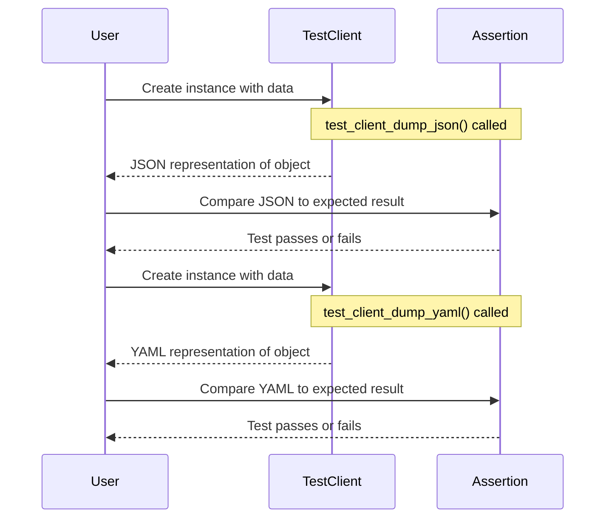

## Chapter 175: jumpstarter/packages/jumpstarter-kubernetes/jumpstarter_kubernetes/clients_test.py

 In the `jumpstarter/packages/jumpstarter-kubernetes` project, the file `clients_test.py` contains test cases for the `V1Alpha1Client` and `V1Alpha1ClientStatus` classes defined in the same package. This file is part of the unit testing suite, ensuring the correct functionality and behavior of these classes when interacting with Kubernetes objects.

   The `V1Alpha1Client` class represents a client object that deals with various Kubernetes resources. It's instantiated with required metadata and status properties, including an API version, kind, metadata (creation timestamp, generation, name, namespace, resource_version, uid), and status (credential and endpoint).

   The `V1Alpha1ClientStatus` class represents the status of a Kubernetes client object. It contains two attributes: credential and endpoint. In this example, both are set to null.

   The two test functions, `test_client_dump_json()` and `test_client_dump_yaml()`, serve as examples demonstrating how to serialize the instantiated client object into JSON and YAML formats, respectively. They check whether the serialization results match the expected output strings for JSON and YAML representations.

   In a project context, these tests ensure that the classes can be correctly created, serialized, and deserialized, providing confidence in their proper functioning when interacting with Kubernetes resources. When developing or modifying related code, these tests should be run to verify that any changes don't impact the intended functionality.

 Here is a Mermaid sequence diagram for the given code. It shows the `V1Alpha1Client` object being created, and then two tests (`test_client_dump_json()` and `test_client_dump_yaml()`) that compare the JSON and YAML output of the `dump_json()` and `dump_yaml()` methods on the `TEST_CLIENT` instance.

