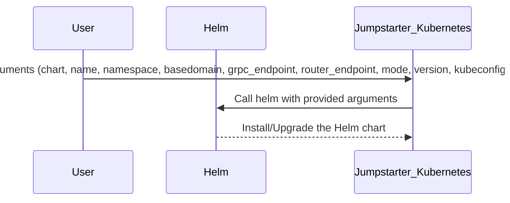

## Chapter 178: jumpstarter/packages/jumpstarter-kubernetes/jumpstarter_kubernetes/install.py

 The `jumpstarter/packages/jumpstarter-kubernetes/jumpstarter_kubernetes/install.py` file serves as a utility for installing the Jumpstarter Helm chart, which is responsible for deploying and managing the Jumpstarter service in a Kubernetes cluster. This script provides an asynchronous function (`install_helm_chart`) to perform this installation task with various configuration options.

   The `helm_installed(name: str) -> bool` function checks whether Helm, a popular package manager for Kubernetes, is installed on the system. It achieves this by attempting to locate the Helm binary using the `shutil.which()` function.

   The main functionality of the script lies within the `install_helm_chart` function. This asynchronous function takes several arguments:

   - `chart`: The name of the Helm chart (in this case, Jumpstarter).
   - `name`: A unique name for the deployment.
   - `namespace`: The namespace where the Jumpstarter service will be deployed.
   - `basedomain`: The base domain for the Jumpstarter service.
   - `grpc_endpoint`: The gRPC endpoint URL for the Jumpstarter service.
   - `router_endpoint`: The router endpoint URL for the Jumpstarter service.
   - `mode`: The deployment mode, which can be either "nodeport", "ingress", or "route". This determines how the Jumpstarter service will expose itself to the cluster and external network.
   - `version`: The specific version of the Helm chart to install.
   - `kubeconfig`: An optional path to a Kubernetes configuration file. If provided, this file will be used for managing the Kubernetes API instead of the default in-cluster config.
   - `context`: An optional Kubernetes context name. If provided, it will be used when accessing the cluster with the kubeconfig file.
   - `helm`: An optional path to the Helm binary (defaults to the system's Helm if not provided).

   The function constructs the necessary arguments for the Helm upgrade command and then spawns a subprocess to execute this command. It waits for the installation process to complete before returning.

   This code fits into the broader project by providing an easy way to deploy Jumpstarter on Kubernetes clusters using the official Helm chart. Example use cases could include:

   - Deploying a new Jumpstarter instance on a Kubernetes cluster with specific configuration settings (e.g., custom domain, deployment mode).
   - Upgrading an existing Jumpstarter installation to a newer version without altering its configuration or namespace.
   - Removing a Jumpstarter deployment by providing the necessary arguments for Helm's delete command.

 Here is a simplified Mermaid sequence diagram that visualizes the main interactions in the `install_helm_chart` function:

This diagram represents that the user initiates the process by providing required arguments to the Jumpstarter_Kubernetes module. The Jumpstarter_Kubernetes module then calls the Helm function with the provided arguments, which installs or upgrades the specified Helm chart.