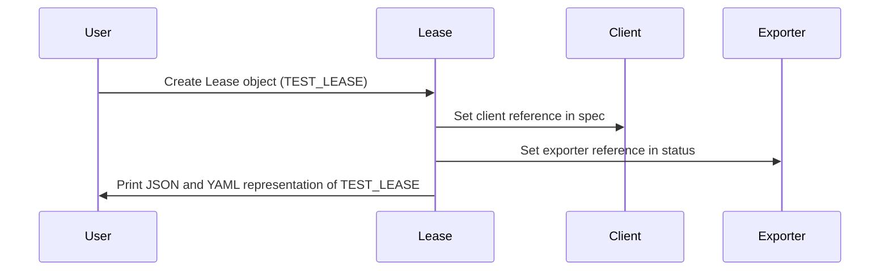

## Chapter 183: jumpstarter/packages/jumpstarter-kubernetes/jumpstarter_kubernetes/test_leases.py

 The `jumpstarter/packages/jumpstarter-kubernetes/jumpstarter_kubernetes/test_leases.py` file is a part of the larger Jumpstarter project, which focuses on simplifying Kubernetes operations by providing higher-level abstractions. This specific module tests the creation and serialization (conversion to JSON or YAML format) of a Lease resource in the Jumpstarter API.

   The central object here is `TEST_LEASE`, an instance of `V1Alpha1Lease` which represents a Kubernetes Lease resource. A Lease is a dynamic and short-lived resource used to obtain temporary ownership of a cluster-wide name or namespace in Kubernetes. It's useful when multiple controllers need to manage the same resource, but only one should do so at a given time.

   The `test_lease_dump_json()` function dumps the JSON representation of the `TEST_LEASE` object and verifies that it matches the expected output. Similarly, the `test_lease_dump_yaml()` function dumps the YAML representation and checks if it's correct as well.

   In the context of the project, this code ensures that the Lease resource is created correctly when using the Jumpstarter API, and that it can be serialized and deserialized properly for storage or transmission purposes. An example use case would be a controller acquiring a lease on a cluster-wide name to ensure exclusive control over its management while it performs an operation, such as scaling up or down based on resource usage.

 Here is a simple sequence diagram using mermaid that visualizes the interaction between different functions and objects (like `TEST_LEASE`) in your provided code. Please note that this is a basic representation, and you may need to adjust it according to the specific flow of your application.



To render this mermaid diagram, you can use a service like [Mermaid Live Editor](https://mermaid-js.github.io/mermaid-live-editor/) or include it in your markdown file with the following syntax:

```

```