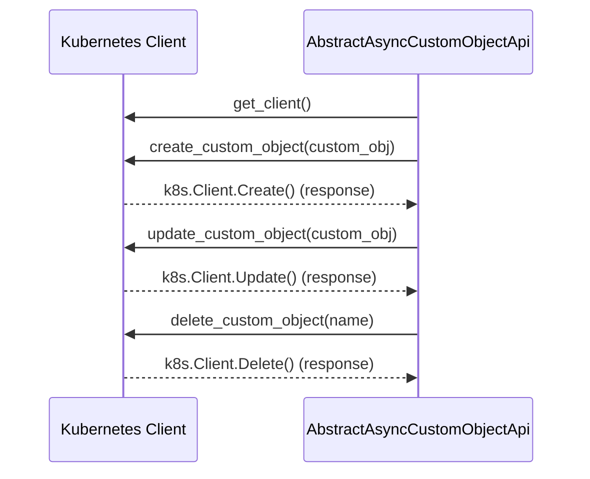

## Chapter 184: jumpstarter/packages/jumpstarter-kubernetes/jumpstarter_kubernetes/util/__init__.py

 Title: Understanding the `jumpstarter/packages/jumpstarter-kubernetes/jumpstarter_kubernetes/util/__init__.py` File in JumpStarter Project

The `jumpstarter/packages/jumpstarter-kubernetes/jumpstarter_kubernetes/util/__init__.py` file serves as the initializer for the utility module within the Kubernetes package of the JumpStarter project. This module is crucial for providing useful functions and classes to assist in managing Kubernetes resources, particularly custom objects.

The primary class defined in this file is `AbstractAsyncCustomObjectApi`, which is an abstract base class designed to help create and manage asynchronous Kubernetes Custom Object APIs. An Abstract Base Class (ABC) is a metaclass used for defining classes that act as bases for other classes, enforcing a common interface or protocol among those subclasses.

In the context of JumpStarter, `AbstractAsyncCustomObjectApi` offers a standard structure to interact with Kubernetes Custom Object APIs without needing to manually handle the boilerplate code associated with asynchronous API calls. This abstraction leads to cleaner, more maintainable, and easier-to-understand custom object implementations.

Example use cases for this module might include creating a CustomResourceDefinition (CRD) that represents a new kind of Kubernetes resource, or implementing a controller that manages resources based on the state of custom objects. Developers can extend `AbstractAsyncCustomObjectApi` to create their own custom Kubernetes APIs, benefiting from the built-in asynchronous functionality and simplified API interaction.

This code fits within the broader JumpStarter project, which aims to provide a modular framework for building Kubernetes operators and controllers. By abstracting away some of the complexity associated with working with Kubernetes APIs, this utility module helps developers focus on implementing the business logic of their operators or controllers while still ensuring adherence to best practices and standards within the project.

 Here is a simple Mermaid sequence diagram that illustrates the interaction between key functions based on the provided file. Please note that this example focuses on the main interaction between the `AbstractAsyncCustomObjectApi` class and other functions or objects that it interacts with.

This diagram demonstrates the main functions `get_client`, `create_custom_object`, `update_custom_object`, and `delete_custom_object` interacting with a Kubernetes client to perform CRUD operations on custom objects. The exact implementation details would depend on the specific use case and underlying library or SDK being used.