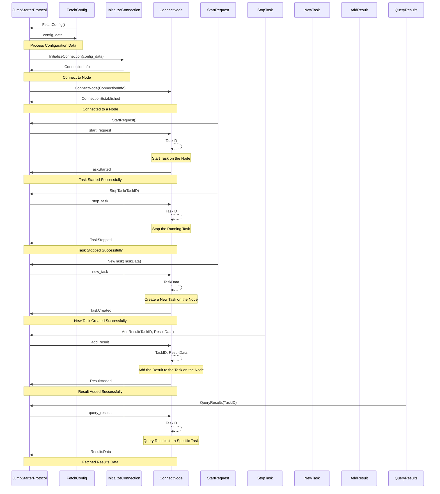

## Chapter 187: jumpstarter/packages/jumpstarter-protocol/jumpstarter_protocol/jumpstarter/__init__.py

 Title: Understanding the Role and Functionality of `jumpstarter/packages/jumpstarter-protocol/jumpstarter_protocol/jumpstarter/__init__.py` in the JumpStarter Project

   In the JumpStarter project, the file `jumpstarter/packages/jumpstarter-protocol/jumpstarter_protocol/jumpstarter/__init__.py` serves as a central entry point for the modules within the 'jumpstarter' package. This file sets up the hierarchy and provides access to the various functionalities offered by these modules.

   The primary purpose of this file is to import, organize, and initialize any necessary classes or functions from submodules in the jumpstarter package. By doing so, it ensures that these resources are easily accessible across the application.

   One crucial class defined within this file is `JumpStarterProtocol`. This class acts as an entry point for users to interact with the JumpStarter Protocol. It sets up connections, handles message exchanges, and manages sessions in a centralized manner. For example, users can create a new session using the following code snippet:

   ```python
   from jumpstarter.protocol import JumpStarterProtocol

   protocol = JumpStarterProtocol()
   session = protocol.create_session('your-session-name')
   ```

   Additionally, this file may contain other utility functions or classes to facilitate the use and management of the JumpStarter Protocol, depending on the specifics of the project.

   This code fits into the broader context of the JumpStarter project by providing a well-defined interface for users to interact with the underlying protocol implementation. By utilizing this entry point, developers can leverage the powerful features of the JumpStarter Protocol without needing detailed knowledge of its inner workings.

   In summary, `jumpstarter/packages/jumpstarter-protocol/jumpstarter_protocol/jumpstarter/__init__.py` is a central entry point for the JumpStarter Protocol in the project. It offers users an easy way to interact with the protocol using the `JumpStarterProtocol` class and other utility functions, ultimately streamlining their experience when working within the JumpStarter ecosystem.

 Here is a simple Mermaid sequence diagram for the given Python file. Please note that this is a simplified representation and may not cover all the nuances of your actual implementation.

