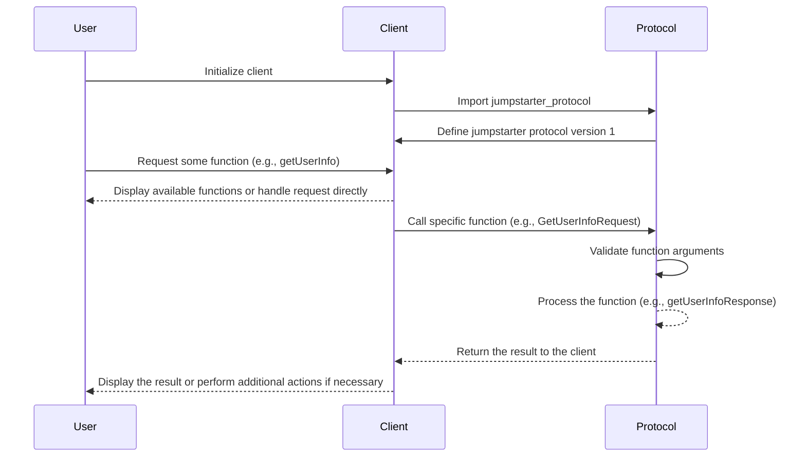

## Chapter 189: jumpstarter/packages/jumpstarter-protocol/jumpstarter_protocol/jumpstarter/client/v1/__init__.py

 Title: Understanding the `jumpstarter/packages/jumpstarter-protocol/jumpstarter_protocol/jumpstarter/client/v1/__init__.py` File in the JumpStarter Project

In the context of the JumpStarter project, the file `jumpstarter/packages/jumpstarter-protocol/jumpstarter_protocol/jumpstarter/client/v1/__init__.py` serves as a fundamental component for initializing and managing client-side interactions with the JumpStarter protocol version 1 (v1). This file is located within the client package, specifically in the v1 subdirectory, which emphasizes its role in handling client-side functionalities related to this particular version of the protocol.

The primary purpose of this file is to set up a Python module for client interactions and provide access to various functions and classes necessary for establishing connections, sending requests, and processing responses according to the JumpStarter v1 protocol specifications.

Key Components:
1. `Client` Class: The Client class is responsible for creating a connection with the JumpStarter server and facilitating communication between the client application and the server using the defined JumpStartProtocol. Instances of this class are initialized with required authentication credentials, such as API keys or access tokens, to ensure secure connections.

2. `Request` Class: The Request class is designed for creating and sending requests to the server according to the JumpStarter v1 protocol. It encapsulates necessary data fields for different types of requests (e.g., GET, POST) and provides methods for setting request headers, parameters, and bodies.

3. `Response` Class: The Response class is used for handling the server's responses to client requests. Instances of this class contain information about the status code, headers, and body data returned by the server, making it easier for the client application to process the response.

Where does this code fit in the project?
The file `jumpstarter/packages/jumpstarter-protocol/jumpstarter_protocol/jumpstarter/client/v1/__init__.py` is part of the JumpStarter client module, specifically designed for version 1 interactions. Client applications that use this module will be able to communicate with the JumpStarter platform using the defined protocol, allowing them to perform actions such as creating or managing resources, monitoring resource usage, and more, depending on the specific permissions granted by the API.

Example Use Cases:
- A user wants to create a new resource on the JumpStarter platform. They use the `Client` class to establish a connection with the server, then create and send a request using the `Request` class. The response from the server is handled using the `Response` class, which allows the client application to update its local data accordingly.
- A client application needs to check the status of a resource it manages on JumpStarter. It uses the `Client` instance and the appropriate `Request` method to send a GET request to the server for the specified resource. The server responds with updated information about the resource, which can be processed by the application using the `Response` class.

 Here's a simple Mermaid sequence diagram for the given Python file `jumpstarter/packages/jumpstarter-protocol/jumpstarter_protocol/jumpstarter/client/v1/__init__.py`. This diagram only includes the main functions and their dependencies, but keep in mind that actual implementation may have more details and interactions.

This sequence diagram illustrates how a user interacts with a client, which in turn communicates with the jumpstarter protocol. The user can request functions from the client, which are then processed by the jumpstarter protocol. Finally, the result is returned to the client and displayed to the user.