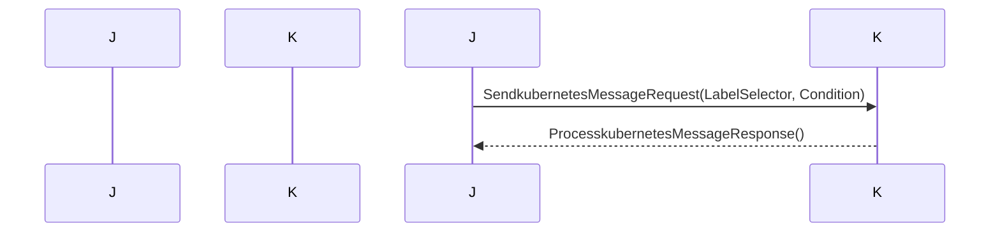

## Chapter 195: jumpstarter/packages/jumpstarter-protocol/jumpstarter_protocol/jumpstarter/v1/kubernetes_pb2.py

 The file `jumpstarter/packages/jumpstarter-protocol/jumpstarter_protocol/jumpstarter/v1/kubernetes_pb2.py` is a Python script generated by Protocol Buffers, a language-agnostic data serialization system developed by Google. This file contains the compiled representation of the `kubernetes.proto` protocol buffer definition file.

   The purpose of this file is to define message types and services for handling Kubernetes-related data within the Jumpstarter project. Protocol buffers provide a compact, efficient, platform-independent, extensible mechanism for serializing structured data. In the case of this file, the defined message types include `LabelSelector`, `LabelSelectorRequirement`, and `Time`, among others, which are used to describe various Kubernetes object properties.

   Here is a brief description of some important functions or classes:

   - `LabelSelector` defines a label selector for selecting a subset of resources based on their labels. It contains an array of `MatchLabelsEntry` objects, each representing a label-value pair to match.

   - `LabelSelectorRequirement` represents a label selector requirement that specifies the type and values of the labels required by a resource, as well as any operators for matching (e.g., `=`, `!=`, `IN`). It also contains an array of `MatchExpressions`, each representing a match expression to apply to the resource labels.

   - `Time` defines a message type for representing time values. It contains both `seconds` and `nanos` fields to allow for precision down to nanoseconds.

   This code fits within the Jumpstarter project, which aims to provide a simple and consistent way to manage Kubernetes resources across multiple clusters. By generating protocol buffer definitions for Kubernetes objects, it allows for efficient communication between different components of the system and ensures data consistency.

   Example use cases may include:

   - Serializing Kubernetes custom resource definitions (CRDs) as `LabelSelector` messages to compare with a running Kubernetes cluster's resources.
   - Exchanging information about pods, services, and other Kubernetes objects between different parts of the Jumpstarter system using the defined message types.

 Here is a simple sequence diagram using `mermaid` that shows the interactions between some key functions based on the given protocol buffer file. Note that this is a simplified version and may not cover all possible scenarios, as the actual code implementation might include more complex use cases.

This diagram shows a high-level interaction between `Jumpstarter` and `Kubernetes`. The `Jumpstarter` sends a message with a `LabelSelector` and a `Condition` to the `Kubernetes`. Upon receiving the request, `Kubernetes` processes it and sends a response back to the `Jumpstarter`.