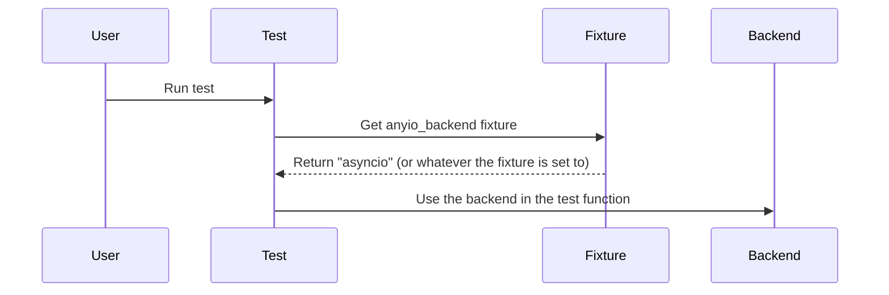

## Chapter 200: jumpstarter/packages/jumpstarter-testing/conftest.py

 In the `jumpstarter/packages/jumpstarter-testing/conftest.py` file, we have a setup script that provides infrastructure for testing various components of the JumpStarter project using PyTest, a popular Python testing framework. This file is primarily used to configure test environments and provide shared fixtures (pre-configured resources) for multiple tests in the testing suite.

   The `pytest_plugins = ["pytester"]` line is an attribute that tells PyTest to use the pytester plugin, which simplifies writing unit tests and provides additional functionalities such as test discovery, running tests in parallel, and code coverage reporting.

   The most important function in this file is the `@pytest.fixture` decorator, which defines a fixture that can be reused across multiple tests. In our case, we have defined a fixture called `anyio_backend()`, which returns the string "asyncio". This fixture is used to set up an event loop for asynchronous tests using AsyncIO, a popular Python library for writing concurrent code with coroutines and callbacks.

   The function of this code within the project is to ensure that all asynchronous tests are executed using the same event loop. By doing so, we can avoid inconsistencies arising from multiple instances of the event loop and ensure that tests run in a predictable manner.

   Here's an example use case for this fixture: Suppose we have a test suite for an asynchronous function that retrieves data from a remote API using the `aiohttp` library. To test this function, we would create multiple tests that use different input parameters and verify their output. With the `anyio_backend()` fixture in place, all these tests will automatically run under the same event loop provided by AsyncIO, ensuring consistent behavior across all tests.

   In summary, the purpose of `conftest.py` is to configure test environments, set up shared fixtures, and provide a consistent testing framework for the JumpStarter project. This setup simplifies writing tests, improves code quality, and ensures that all asynchronous tests are executed consistently within the same event loop.

 In order to create a sequence diagram using Mermaid, we need to visualize the interactions between the key functions in your `conftest.py` file. Here's an example of how it could be represented:

This diagram illustrates that the user runs a test, which retrieves a fixture called `anyio_backend`. The fixture returns a value ("asyncio"), and the test then utilizes the backend with this information.