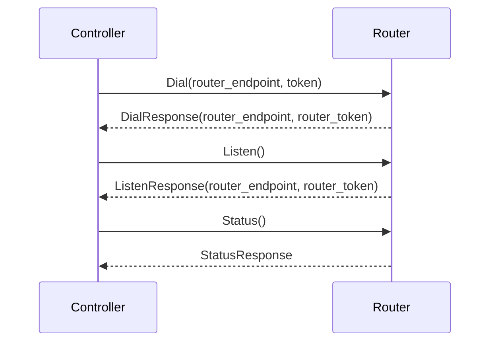

## Chapter 204: jumpstarter/packages/jumpstarter/conftest.py

 The file `jumpstarter/packages/jumpstarter/conftest.py` is a configuration and fixture setup file for pytest, which helps in automating the testing process of the Jumpstarter project. This file contains several important functions, classes, and settings that are used to create test environments for the `ControllerServiceServicer` and `RouterServiceServicer` classes in the Jumpstarter protocol.

   - `MockRouter` is a dataclass that acts as a mock implementation of the `RouterServiceServicer`. It contains a dictionary called `pending`, which stores any pending connections awaiting data transfer, and implements the GrpcStream method for handling connection requests from clients.

   - `MockController` is another dataclass that serves as a mock implementation of the `ControllerServiceServicer`. This class simulates the functionalities required by the Controller Service in the Jumpstarter protocol, including registering, unregistering nodes, dialing connections to routers, and handling status updates.

   - The `anyio_backend` fixture returns the value "asyncio," which is used for selecting the underlying event loop for asynchronous testing within pytest.

   - The `mock_controller` fixture sets up a test environment by creating an insecure Grpc server with a self-signed SSL certificate, initializing the mock controller and router services, and starting the server. It then returns the address of the started server, which can be used for testing the Controller Service.

   This code fits within the Jumpstarter project as it provides the necessary infrastructure to test the different functionalities of the protocol in a controlled environment, ensuring that changes made to the code do not break existing functionality or introduce new bugs. Example use cases for this file involve writing unit tests and integration tests for various components of the Jumpstarter system, such as checking the correctness of data transfer between nodes or verifying the behavior of the Controller Service in response to specific events.

 Here is a simple Mermaid sequence diagram that visualizes the interaction between the MockController and MockRouter based on the given code. Please note that this diagram is a simplified version of the actual interactions and might not cover all edge cases or error handling scenarios.

In this diagram, the MockController initiates a connection to the MockRouter using the Dial function. Once connected, it listens for status updates from the Router using the Listen function. Additionally, the Controller periodically queries the status of the connection by sending the Status request to the Router.