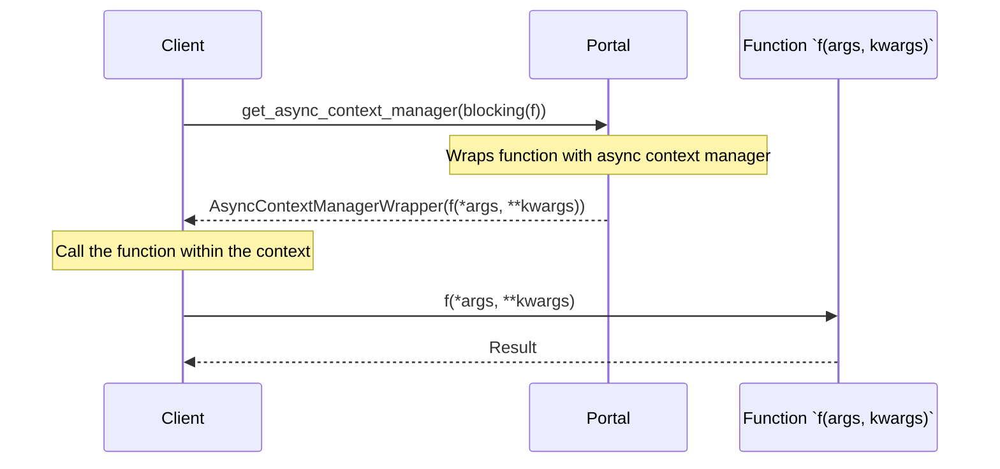

## Chapter 206: jumpstarter/packages/jumpstarter/jumpstarter/client/adapters.py

 In the `jumpstarter` project, the file `jumpstarter/packages/jumpstarter/jumpstarter/client/adapters.py` is a crucial component that provides adapter functions to interact with various services using blocking calls while managing asynchronous contexts.

   The primary purpose of this file is to create decorators, specifically the `@blocking` decorator, which allows for the use of synchronous (blocking) function calls within an asynchronous environment. This is achieved by wrapping the original function with a context manager that handles the underlying async/await structure.

   The `@blocking` decorator takes in a single argument, `f`, which represents the function being decorated. Inside the wrapper, it uses the `contextlib.contextmanager` to define a new context manager. This context manager accepts an optional keyword argument `client`, which is an instance of a class that inherits from a specific interface or abstract base class (not shown in the provided code).

   The decorator's implementation also utilizes the `functools.wraps` function to preserve the original function's metadata, such as its name and docstring. This ensures that debugging tools like `help()` or IDE auto-completion continue to work correctly on the decorated function.

   The decorated function is executed within a context created by the `kwargs["client"].portal.wrap_async_context_manager(f(*args, **kwargs))`, which manages the asynchronous nature of the called function. This line should call an async method provided by the `client` object that returns a coroutine. Inside the decorated function, yielding a value from within the context manager allows the execution to pause and resume in an asynchronous manner while appearing synchronous to the caller.

   In terms of where this code fits in the project, these adapters are responsible for allowing developers to work with various external services using straightforward synchronous function calls without needing to understand the intricacies of async programming. By managing the asynchronous contexts, the adapters enable seamless integration and interaction between the main application and third-party services.

   Example use cases might involve calling a REST API or interacting with a database using synchronous function calls, even though these operations are inherently asynchronous. By utilizing these adapters, developers can write more readable and maintainable code while still leveraging the benefits of asynchronous programming in the overall project architecture.

 Here's a basic Mermaid sequence diagram representation of the interactions between key functions in the provided Python code. Please note that this is a simplified version and might not cover all possible scenarios or edge cases.

In this diagram, the `Client` interacts with the `Portal`, which is responsible for wrapping the provided function (`f`) with an async context manager. The client then calls the wrapped function and receives the result.