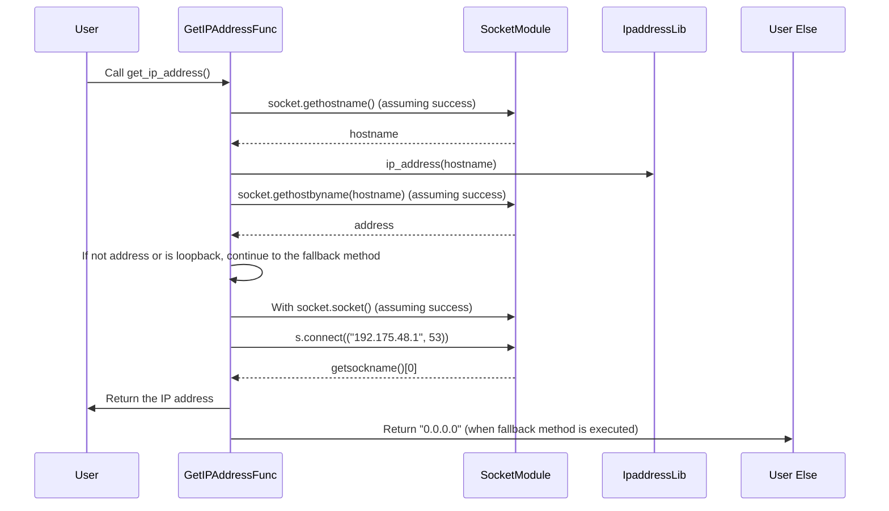

## Chapter 219: jumpstarter/packages/jumpstarter/jumpstarter/common/ipaddr.py

 The file `jumpstarter/packages/jumpstarter/jumpstarter/common/ipaddr.py` is a Python module within the larger Jumpstarter project, providing a function to obtain the IP address of the host machine. This module is part of the common package and is primarily used for utility purposes across various components within the system.

   The main function in this module is `get_ip_address`, which accepts an optional argument `logger` of type `logging.Logger`. This function attempts to find the IP address of the host machine using the given logger for debugging and error reporting purposes. Here's a breakdown of how it works:

   1. First, it tries to get the IP address by looking up the hostname with the socket module and then retrieving its corresponding IP address using `socket.gethostbyname(hostname)`.

   2. If this method fails to return an IP address or if the returned address is a loopback (i.e., 127.0.0.1), it falls back to a more manual approach. In this alternative method, it creates a UDP socket, connects it to a specific IP and port (192.175.48.1:53, which is associated with the AS112 resolver service), and retrieves its own IP address from the returned sockname. This method is useful when DNS resolution fails or when using private networks without access to public DNS servers.

   3. If any exceptions occur during this process, the function logs a warning message using the provided logger object if it exists.

   In terms of how this code fits into the project, it is typically used in components that require the host's IP address for network communication or identification purposes. Example use cases could include:

  - Setting up connections between different Jumpstarter nodes for distributed processing
  - Configuring the Jumpstarter agent to report back to a central server with its unique IP address
  - Automating the setup process of new Jumpstarter instances, where their IP addresses need to be known for further configuration.

 Here's a simple Mermaid sequence diagram for the `get_ip_address` function in your provided code. This diagram shows how the function interacts with the `socket` module and the `ipaddress` library to obtain the IP address of the host machine. Please note that the `logging` module is not directly involved in this particular function, so it's not included here.

