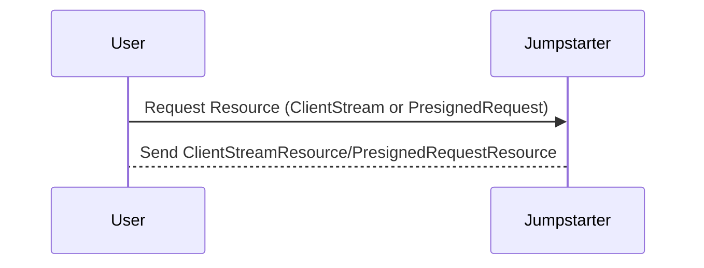

## Chapter 221: jumpstarter/packages/jumpstarter/jumpstarter/common/resources.py

 In the `jumpstarter` project, the file `jumpstarter/packages/jumpstarter/jumpstarter/common/resources.py` serves as a crucial component for managing and defining resources related to the system. This module is primarily responsible for creating classes that represent different types of resources, each with specific attributes and behaviors.

   The primary classes defined in this file are `ClientStreamResource` and `PresignedRequestResource`.

   - `ClientStreamResource` represents a client stream resource, which has a unique universally unique identifier (UUID) associated with it and is identified by the "client_stream" kind. This type of resource is typically used for streaming data from a client to the server.

   - `PresignedRequestResource` represents a presigned request resource, which includes headers, a URL, and an HTTP method (either GET or PUT). The purpose of this resource is to provide temporary signed URLs for storing or retrieving data from AWS S3 or similar services.

   By using these classes, developers can easily create and manipulate different types of resources within the project. These resources are then stored and managed in a consistent manner across various components of the system.

   It is essential to note that these resource definitions take advantage of Pydantic, allowing for strong typing, validation, and serialization of JSON data. Additionally, the use of Literal types ensures that the kind attribute for each resource can only hold specific predefined values.

   This code plays a pivotal role in various aspects of the project, including data management, streaming, and interactions with external storage services like AWS S3. For example, when uploading files or data to S3, the system might generate and return a presigned request resource to initiate the transfer process efficiently.

   In summary, `jumpstarter/packages/jumpstarter/jumpstarter/common/resources.py` is a critical file for defining and managing resources in the `jumpstarter` project, enabling strong typing, validation, and efficient resource manipulation within the system.

 Here is a simple sequence diagram using Mermaid that shows the interaction between the `ClientStreamResource` and `PresignedRequestResource` classes. Please note that this is a simplified version as the actual implementation might involve more complex scenarios.

In this diagram, the `User` sends a request for a resource to the `Jumpstarter`. The `Jumpstarter` then responds with either a `ClientStreamResource` or `PresignedRequestResource`.