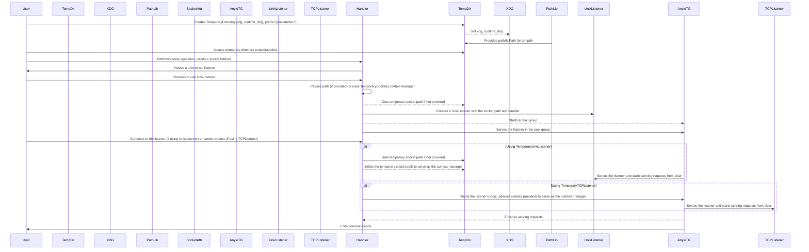

## Chapter 225: jumpstarter/packages/jumpstarter/jumpstarter/common/tempfile.py

 This chapter discusses the purpose and functionality of the file `jumpstarter/packages/jumpstarter/jumpstarter/common/tempfile.py` in the context of the Jumpstarter project.

The main objective of this module is to provide a simple, reusable way to create temporary files and sockets within the XDG runtime directory for various tasks in the Jumpstarter project. It uses `anyio` for asynchronous I/O operations.

The file defines three context managers: `TemporarySocket`, `TemporaryUnixListener`, and `TemporaryTcpListener`.

1. `TemporarySocket()` creates a temporary directory within the XDG runtime directory (usually located under `~/.local/share/jumpstarter-<pid>/`) and returns the path to a subdirectory named 'socket'. This can be useful for creating a temporary socket file for various purposes.

2. `TemporaryUnixListener(handler, path: PathLike | None = None)` creates a Unix domain socket in the temporary directory created by `TemporarySocket()`. If a specific path is provided, it uses that path instead. The context manager sets up an asynchronous listener for incoming connections and starts an asynchronous task group to handle incoming connections. This can be used when creating a server that listens on a Unix domain socket.

3. `TemporaryTcpListener(handler, local_host="127.0.0.1", local_port=0, family=AddressFamily.AF_UNSPEC, backlog=65536, reuse_port=True)` creates a TCP listener in the temporary directory created by `TemporarySocket()`. It allows specifying a custom IP address (default is 127.0.0.1), port number (default is automatically assigned), and other options such as socket family (IPv4 or IPv6). Similar to `TemporaryUnixListener`, it sets up an asynchronous listener for incoming connections and starts an asynchronous task group to handle incoming connections. This can be used when creating a server that listens on a TCP socket.

These context managers provide a convenient way to create temporary files and sockets without having to manually manage their lifetimes, making the code more readable and maintainable in the Jumpstarter project.

Example use cases include creating temporary data storage for an application, setting up a Unix domain socket server for inter-process communication, or launching a TCP server for handling client requests.

 Here is a Mermaid sequence diagram that represents the flow of interaction among the key functions in the given Python code. Please note that Mermaid has limitations when it comes to representing asynchronous contexts, so this diagram may not be perfectly accurate regarding the actual execution order.

