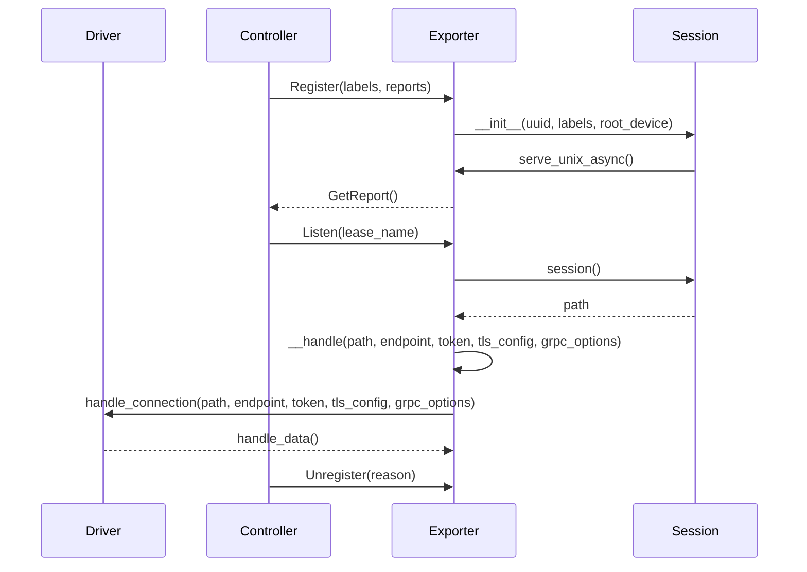

## Chapter 244: jumpstarter/packages/jumpstarter/jumpstarter/exporter/exporter.py

 In the `jumpstarter/packages/jumpstarter/jumpstarter/exporter/exporter.py` file of the Jumpstarter project, we have an implementation for the Exporter class that acts as a gRPC server for data collection and exportation. The purpose of this class is to provide a way to listen for incoming connection requests, register with the controller service, and handle connections once they are established.

   The Exporter class extends AbstractAsyncContextManager and Metadata classes, providing an interface that conforms to both. It takes several parameters such as `channel_factory`, `device_factory`, `lease_name`, `tls`, and `grpc_options`.

   Key functions in this file include:

   - `__aexit__`: This function is responsible for unregistering the exporter with the controller when the context manager is closed or an exception occurs.
   - `__handle`: This function handles incoming connections from other services, taking care of setting up the connection and passing it on to a router stream.
   - `session`: This async context manager method sets up the gRPC channel, registers with the controller service, starts serving on a specified Unix domain socket, and returns the path to that socket for future use.
   - `handle`: This function listens for incoming connection requests on a specific lease name by repeatedly calling the Listen RPC from the controller service. Once a request is received, it sends the connection details to the `__handle` method.
   - `serve`: The `serve` method initializes the registration process by creating a session and starting the status listener, which periodically checks the current lease status.

Example use cases:

- A data collection device can instantiate an Exporter object with its factory methods for creating gRPC channels and drivers (devices). It then calls `await self.serve()` to start serving on a Unix domain socket and registering with the controller service. The device will now accept incoming connection requests and export data as requested.
- A monitoring application can use the Exporter object to establish a long-term connection to a data collection device for continuous data ingestion and visualization. It listens for the lease status changes, re-connects when the device becomes available again, and updates its display accordingly.

 Here is a simple mermaid sequence diagram to illustrate the main interactions between the key functions in the `Exporter` class:

The `Driver` instance is not directly shown in this diagram but it represents the data source that sends data to the exporter. It interacts with the `Exporter` through the `handle_connection` function. The `Session` object manages the connection with the client and serves the unix socket for receiving connections.

This diagram is a simplified representation of the interactions and does not include error handling, retries, or status updates, which are also important aspects of the code.