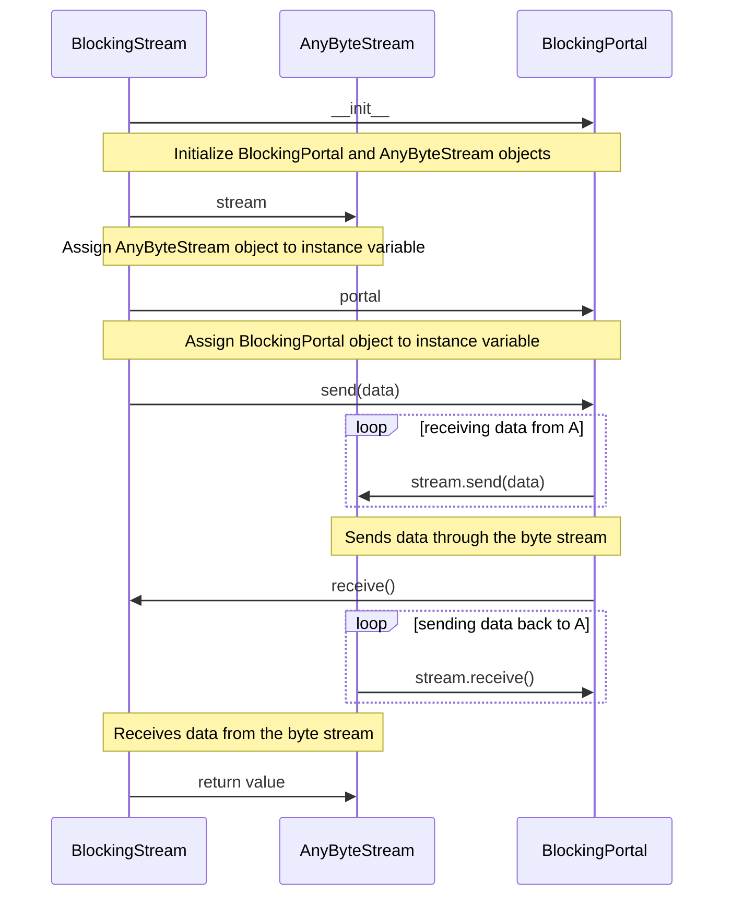

## Chapter 249: jumpstarter/packages/jumpstarter/jumpstarter/streams/blocking.py

 In the `jumpstarter/packages/jumpstarter/jumpstarter/streams/blocking.py` file, we have a custom data class named `BlockingStream`. This module is responsible for managing blocking I/O operations in the context of an asynchronous system using AnyIO library.

The primary purpose of this class is to wrap any synchronous byte stream (e.g., a socket) and provide asynchronous-safe methods for sending and receiving data. By leveraging `BlockingPortal`, it allows us to execute blocking calls within the non-blocking event loop of AnyIO.

Here's a brief overview of the important functions or classes in this module:

1. **`@dataclass(kw_only=True) class BlockingStream:`**: This class serves as a wrapper for an asynchronous byte stream and provides methods to send and receive data. It takes two arguments, `stream` (AnyByteStream) and `portal` (BlockingPortal).

2. **`send(self, data: bytes) -> None`**: This method sends the provided data over the underlying byte stream asynchronously using the `call()` method from `BlockingPortal`. The return type is `None`, as sending data doesn't produce a result in this context.

3. **`receive(self) -> bytes`**: This method receives data from the underlying byte stream asynchronously using the `call()` method from `BlockingPortal`. It returns the received data as a bytes object.

This code fits within the Jumpstarter project, which is a modular and scalable distributed application framework. In this specific context, the `BlockingStream` class can be used to manage I/O operations in any component that needs to communicate over blocking sockets while maintaining an asynchronous architecture.

Example use cases for this code might include:
- Communication between microservices using synchronous TCP connections in an otherwise asynchronous application stack.
- Reading and writing from files, where the underlying file access is blocking but needs to be integrated into an asynchronous processing pipeline.

 Here is a simple mermaid sequence diagram that visualizes the interaction between the main functions in the `BlockingStream` class:

This diagram illustrates that when a `BlockingStream` object is created, it initializes both a `BlockingPortal` and an `AnyByteStream`. The send method in `BlockingStream` delegates the data sending to the `BlockingPortal`, which in turn sends the data through the `AnyByteStream`. Similarly, the receive method in `BlockingStream` receives data from the `AnyByteStream` via the `BlockingPortal`.