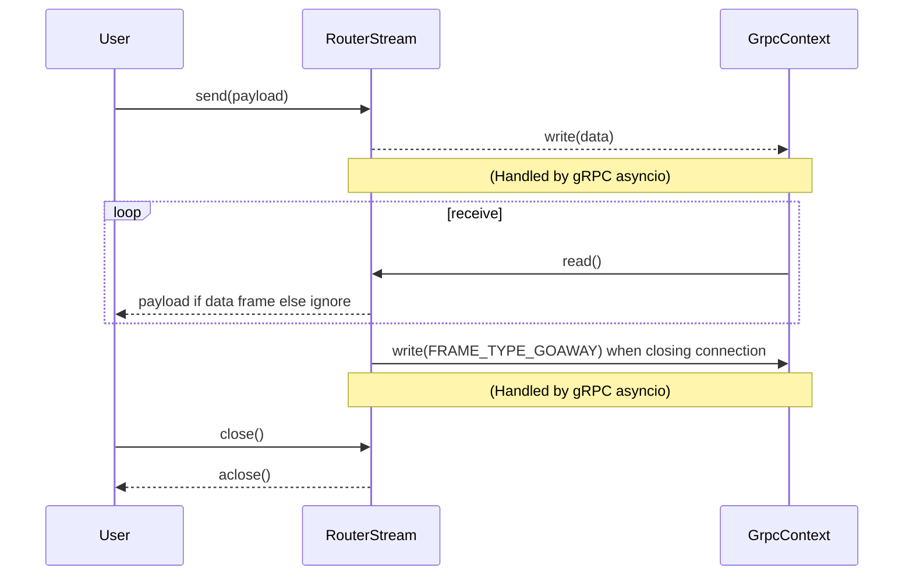

## Chapter 253: jumpstarter/packages/jumpstarter/jumpstarter/streams/router.py

 In the `jumpstarter/packages/jumpstarter/jumpstarter/streams/router.py` file, we define a custom stream class named `RouterStream`. This class is designed to handle bi-directional data streams using gRPC, a high-performance communication protocol between services.

   The `RouterStream` class inherits from the `ObjectStream[bytes]` abstract base class provided by the `anyio` library and overrides several methods to adapt it for working with gRPC. This custom stream class is used when dealing with streams in the larger Jumpstarter project.

   Important functions and classes include:

   - `RouterStream`: The custom stream class that wraps a gRPC stream or servicer context, handling data transmission bi-directionally using the `send()`, `receive()`, and other methods.

   Here's an overview of some key functions in the RouterStream class:

   - `__post_init__`: This method initializes the `cls` attribute based on the context provided, ensuring proper handling for gRPC stream calls or servicer contexts.
   - `send(self, payload: bytes) -> None`: Sends a given byte payload over the wrapped gRPC stream or context.
   - `receive(self) -> bytes`: Asynchronously reads the next available payload from the wrapped gRPC stream or context.
   - `send_eof()`: Sends an end-of-stream signal to the remote side using the appropriate gRPC frame type.
   - `aclose()`: Closes the underlying gRPC stream or context and sends a proper close message.

   The RouterStream fits into the project by providing a convenient and consistent way of handling streams in gRPC communication within the Jumpstarter framework. This class helps maintain code readability, modularity, and simplifies the process of working with gRPC streams across different components of the project.

   Example use cases for the RouterStream class might involve implementing a service that handles requests from clients using the gRPC protocol, where the service would use this custom stream class to manage the incoming and outgoing data streams efficiently and consistently. Additionally, other components within the Jumpstarter project could use this stream class to communicate with each other using the gRPC protocol, benefiting from its simplicity and efficiency.

 Here is a simple Mermaid sequence diagram that illustrates the interactions between the key functions in the `RouterStream` class:

This diagram demonstrates how a user sends data to the `RouterStream`, which in turn writes it to the underlying gRPC context. The stream then reads incoming frames from the context, processes the data payloads, and ignores other frame types. When the connection is closed, the stream writes a GOAWAY frame and then closes the connection itself.