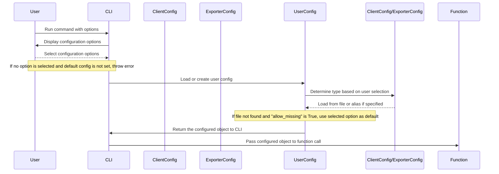

## Chapter 26: jumpstarter/packages/jumpstarter-cli-common/jumpstarter_cli_common/config.py

 In the `jumpstarter` project, the file `jumpstarter/packages/jumpstarter-cli-common/jumpstarter_cli_common/config.py` provides a custom decorator function named `opt_config()` for managing command line interface (CLI) arguments related to configuration files. The primary purpose of this code is to simplify the handling of configuration options and ensure that the correct configurations are loaded during the execution of CLI commands.

The main class used in this file is `click.Command`, which provides a convenient way to define command line interfaces for scripts or functions. The file also imports several classes from the `jumpstarter.config` package, such as `ClientConfigV1Alpha1`, `ExporterConfigV1Alpha1`, and `UserConfigV1Alpha1`. These classes are used to load and handle various configuration objects within the project.

The `opt_config_inner()` function is a decorator that takes three parameters: `f`, `client`, `exporter`, and `allow_missing`. The `f` parameter represents the function or command being decorated, while `client` and `exporter` control whether configuration options for the client and exporter should be available as CLI arguments, respectively. The `allow_missing` parameter determines whether unspecified required configurations will raise an error or simply be set to a default value (i.e., `None`).

The decorator modifies the command's CLI options by adding two options for each supported configuration object: an alias and a path option. For example, it adds `--client` and `--client-config` options for managing client configurations. If both `client` and `exporter` parameters are set to `True`, the decorator will also add corresponding options for the exporter configuration.

When a command decorated with `opt_config()` is executed, it first checks whether any of the configuration options have been specified on the command line. If no options are provided and default configurations haven't been set, the decorator raises an error. If at least one option is provided, it loads the appropriate configuration object (either from a provided alias or file path) and passes it to the decorated function as an argument.

Here's an example use case: Suppose you have a command `my_command` that requires a client configuration for proper execution. You can decorate this command with `opt_config(client=True)` to add options for managing the client configuration:

```python
@click.command()
@opt_config(client=True)
def my_command(config):
    # Access and use the loaded client configuration object (config) here
    pass
```

In this example, when you run `my_command`, it will prompt you for a client configuration alias or path. If no option is provided, it will attempt to load the default client configuration or raise an error if none exists. The resulting `config` argument in the `my_command` function can then be used to access and work with the loaded client configuration object.

 Here's a simple Mermaid sequence diagram that attempts to visualize the interaction of functions in the provided code. Please note that this is an approximation and might not cover all edge cases or details:

