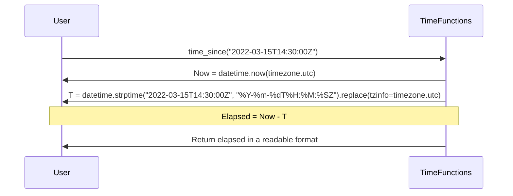

## Chapter 33: jumpstarter/packages/jumpstarter-cli-common/jumpstarter_cli_common/time.py

 Chapter Title: Understanding the `time.py` Module in Jumpstarter CLI Common Library

   In the Jumpstarter project, the file `jumpstarter/packages/jumpstarter-cli-common/jumpstarter_cli_common/time.py` serves as a utility module for handling date and time operations, specifically calculating the elapsed time between two points in time. This functionality is vital in various aspects of the project, such as tracking the progress of tasks or operations.

   The primary function of this module is `time_since(t_str: str)`, which takes a string representation of a datetime (in the ISO 8601 format with a timezone of UTC) as an argument and returns a formatted string representing the elapsed time since that point in time. The function considers seconds, minutes, hours, days, months, and years for the elapsed time calculation.

   The function first parses the input string into a `datetime` object using the `datetime.strptime()` function. It then calculates the difference between this datetime object and the current datetime (obtained using `datetime.now(timezone.utc)`). Finally, it formats the elapsed time in a human-readable format based on the total number of seconds, minutes, hours, days, months, or years that have passed since the provided timestamp.

   For example, if you call `time_since("2021-10-01T00:00:01Z")`, assuming it's currently 2021-10-01T00:01:01Z, the function will return "1s". If you call the same function at 2021-10-02T00:01:01Z, it will return "24h1m0s".

   This code fits into the broader project by providing a centralized location for handling time calculations. Instead of having each module or package perform its own time-related operations, this utility module ensures consistency and simplifies maintenance across the project.

 Here is a simple Mermaid sequence diagram that visualizes the interaction between the `time_since` function and the creation of the datetime objects. Please note that Mermaid does not support complex logic like conditional statements, so I've simplified it to show the flow.

In this diagram, the `User` calls the `time_since` function with a timestamp as an argument. The function creates two datetime objects (Now and T) using the provided timestamp and the current time. It then calculates the elapsed time between these two dates and returns the result in a readable format to the user.