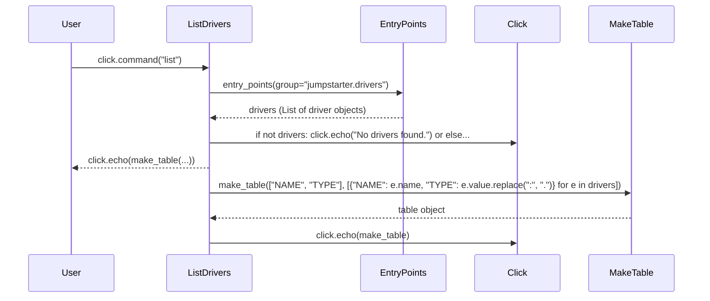

## Chapter 37: jumpstarter/packages/jumpstarter-cli-driver/jumpstarter_cli_driver/driver.py

 The `jumpstarter/packages/jumpstarter-cli-driver/jumpstarter_cli_driver/driver.py` file is a crucial component of the Jumpstarter project, responsible for managing and listing available drivers within the system. This Python script is primarily focused on command-line interface (CLI) operation and driver management.

   The core functionality of this module revolves around the `@click.command("list")` decorator, which defines a CLI command called "list". When invoked, this command retrieves a list of all registered drivers using the `entry_points(group="jumpstarter.drivers")` function from the importlib.metadata module.

   The retrieved driver information is processed and formatted into an easy-to-read table using the `make_table()` function from the jumpstarter_cli_common.table module. If no drivers are found, a message indicating this fact is displayed using the click library's `click.echo()` function.

   This code fits within the project by providing a means for users to inspect and interact with registered drivers on the command line. It serves as the entry point for invoking driver operations and enables seamless integration of various drivers into the Jumpstarter ecosystem.

   Example use cases may include listing all available data connectors (drivers) in a Jumpstarter project, such as MySQL, PostgreSQL, and MongoDB, to determine which one is suitable for a specific task or workflow. In other scenarios, this command could be used to troubleshoot connectivity issues by ensuring that the desired driver is properly installed and configured within the project environment.

 In this example, I will create a simplified sequence diagram based on the given Python script, focusing on the `list_drivers` function and its dependencies. Please note that Mermaid does not directly support async/await functionality, so I'll represent them as steps.

This diagram represents the flow of interactions between different components when executing the `list` command. It starts with a user invoking the command, which leads to the creation of the ListDrivers function. The ListDrivers function then uses the EntryPoints module to get a list of drivers, and based on that list, it either displays "No drivers found" or passes the table data to the MakeTable function to create a table object. Finally, the table object is displayed by the Click library.