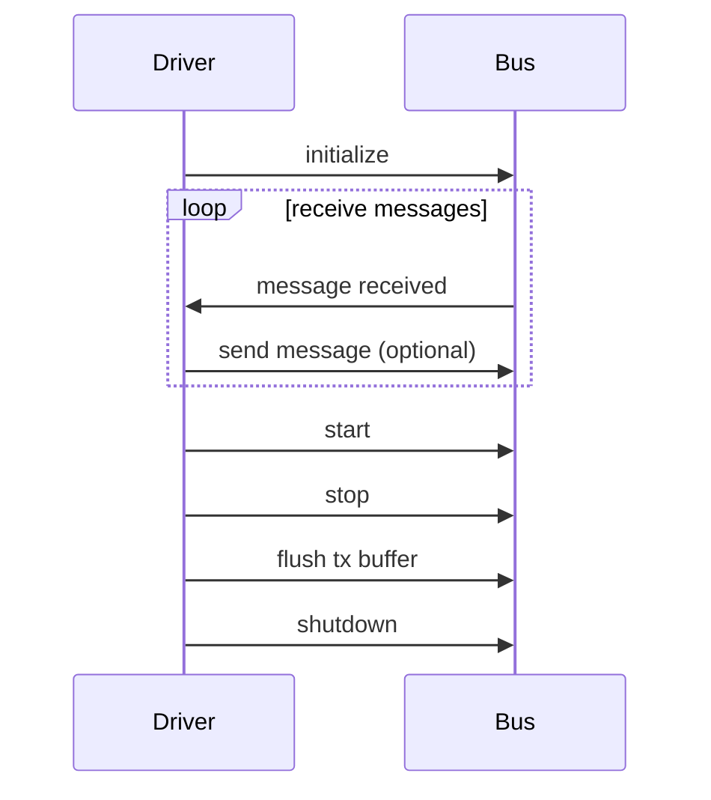

## Chapter 59: jumpstarter/packages/jumpstarter-driver-can/jumpstarter_driver_can/driver.py

 The file `jumpstarter/packages/jumpstarter-driver-can/jumpstarter_driver_can/driver.py` is a core component of the JumpStarter project, serving as a generic CAN bus driver class for connecting to and communicating with various CAN interfaces through the `python-can` library.

   The file defines two main classes: `Can`, an abstract base class for all CAN drivers, and specific implementation classes for three types of CAN drivers:
   1. `IsoTpPython`, a pure Python ISO-TP socket driver
   2. `IsoTpSocket`, a Linux kernel ISO-TP socket driver
   3. `Can`, a generic CAN bus driver

   These classes are designed to provide a uniform interface for accessing different types of CAN interfaces, abstracting away the complexity and technical details of each specific implementation. The classes share common attributes and methods such as `channel`, `interface`, `bus`, and `_recv_internal`, `send`, `_send_periodic_internal`, `start_task`, `stop_task`, `state`, `protocol`, `channel_info`, `apply_filters`, `flush_tx_buffer`, and `shutdown`.

   Example use cases for these drivers include:
   - Using the generic CAN driver to communicate with a vehicle's ECU (Electronic Control Unit) over a CAN interface
   - Utilizing the ISO-TP Python driver for implementing custom, non-standard hardware interfaces using `python-can` and the ISO-TP protocol
   - Employing the Linux kernel ISO-TP socket driver on systems running version 5.10 or higher to leverage the built-in ISO-TP support for standard CAN interfaces

   In summary, this file provides a versatile and powerful foundation for communicating with various types of CAN bus systems, enabling users to easily access and control different devices through a consistent interface.

 Here is a sequence diagram for the `Can` class using Mermaid syntax, which visualizes how some of the key functions interact. Note that this diagram is quite simple due to the limited information provided in the code snippet you've given.

This diagram shows that the `CanDriver` initializes with a `Bus` object, receives messages from the bus, and can send messages back. It also illustrates the methods for starting, stopping, flushing the transmission buffer, and shutting down the bus. However, as there is no explicit connection between the driver and specific cyclic tasks or ISO-TP communication shown in the code, this sequence diagram does not include those interactions. To create a more comprehensive diagram, you would need to consider additional details provided in other parts of your code.