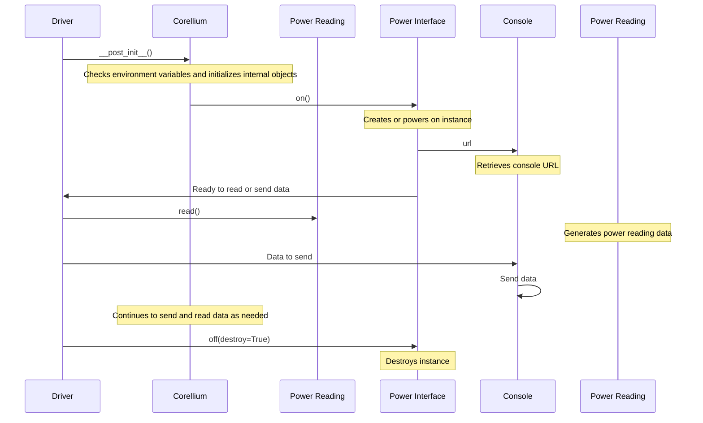

## Chapter 71: jumpstarter/packages/jumpstarter-driver-corellium/jumpstarter_driver_corellium/driver.py

 This chapter discusses the `jumpstarter/packages/jumpstarter-driver-corellium/jumpstarter_driver_corellium/driver.py` file, a crucial component of the Jumpstarter project that interacts with Corellium virtual devices.

   The module implements classes and functions required for managing Corellium-based virtual devices as part of Jumpstarter's driver ecosystem. It includes the top-level `Corellium` driver class, as well as child drivers for handling power (`CorelliumPower`) and console access (`CorelliumConsole`).

   The `Corellium` driver class represents the Corellium device in the Jumpstarter context. It initializes an instance of the Corellium API client and provides methods to interact with it, such as getting project details or managing instances (powering on/off). Additionally, it creates child drivers for handling power management and console access.

   The `CorelliumPower` driver manages the virtual device's power state by creating new instances when needed and setting their states accordingly. It allows users to power a device on or off, and even destroy an instance if desired.

   Lastly, the `CorelliumConsole` driver handles serial console communication with the remote virtual instance through a network websocket connection. It provides properties for configuring baud rates and retrieving the console URL from Corellium's API, which can then be used by other drivers (such as PySerial) to establish and maintain the connection.

   In summary, this module enables users to control Corellium-based virtual devices within the Jumpstarter framework, providing essential power management functionality and serial console access for debugging and managing these devices.

 Here's a simple Mermaid sequence diagram for the interaction of the key functions in this driver. Please note that this is a very basic representation and may not fully capture all edge cases or detailed interactions.

