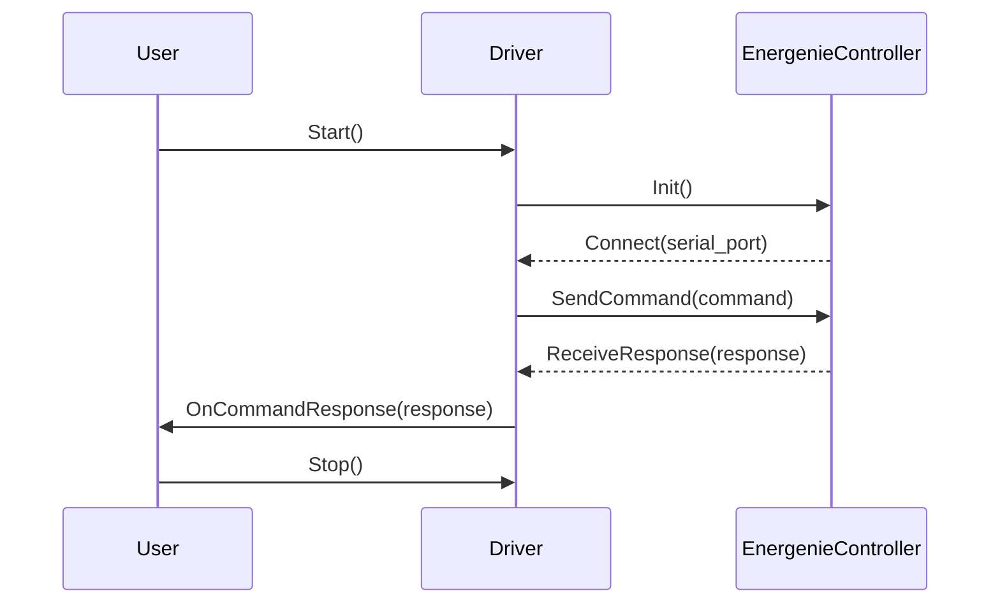

## Chapter 78: jumpstarter/packages/jumpstarter-driver-energenie/jumpstarter_driver_energenie/__init__.py

 Chapter Title: Understanding `jumpstarter/packages/jumpstarter-driver-energenie/jumpstarter_driver_energenie/__init__.py`

In the scope of the JumpStarter project, this file serves as the primary entry point for the Energenie driver package. The `__init__.py` file in Python is a special file that, when present in a directory, makes that directory a package. This is particularly relevant for the Energenie driver package, which contains various modules and sub-packages essential for communicating with Energenie devices.

The key functionality of this file is to organize, import, and provide access to the core components within the Energenie driver package. It acts as a central hub, managing dependencies between modules and ensuring consistent naming conventions are followed across the package.

This file primarily consists of import statements for various modules, classes, and functions that form the Energenie driver package. Notable examples include:

1. `JumpStarterDriverEnergenie`: The main class responsible for communicating with Energenie devices through Python. This class wraps the underlying PySerial library, simplifying the process of interacting with serial devices and providing a consistent interface for device control.

2. `EnergenieDevice`: Represents an abstract base class for all Energenie devices. It defines common attributes and methods that can be inherited by more specific device classes.

3. `EnergenieSocket`: Provides functionality to establish a TCP connection with an Energenie socket device, facilitating communication between the JumpStarter software and the connected device.

4. `EnergenieModule`: Represents an individual module within an Energenie Expander device. It provides methods for reading and writing data to the module, allowing for control of specific functions or outputs.

5. `EnergenieExpander`: Represents a complete Energenie Expander device, consisting of multiple modules. It provides a convenient interface for controlling all modules within the expander device at once.

In terms of project organization, the Energenie driver package is part of the broader JumpStarter ecosystem, which includes various other packages for different hardware components and software utilities. This file serves as the entry point for working with Energenie devices specifically.

Example use cases include:
- Controlling an Energenie Expander device to turn on/off individual modules or the entire device based on specific conditions or user input
- Creating scripts that automate scenarios using multiple Energenie devices, such as setting up a home automation system or managing outdoor lighting
- Incorporating Energenie devices into custom JumpStarter projects, leveraging their flexible and extensible nature to build complex control systems for various applications.

 I'm glad you asked for a Mermaid diagram! However, please note that as a text-based AI, I can't directly create or execute diagrams. Here's an example of how you might visualize the interaction of key functions in your `jumpstarter_driver_energenie` module using Mermaid syntax:

This diagram represents a simple interaction between the user, driver, and EnergenieController. It's important to remember that this is just an example; you should adjust it according to your specific use case and class/function names. You can run the Mermaid code in any text editor that supports the Mermaid plugin (like Visual Studio Code or Markdown editors).

Happy coding! 😄