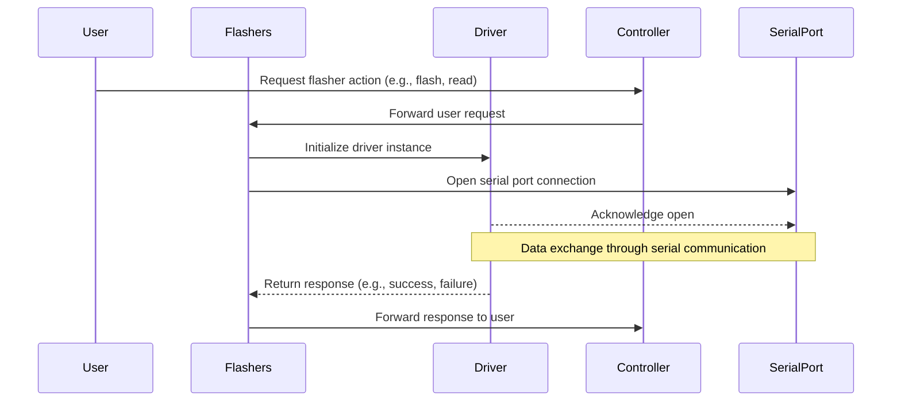

## Chapter 81: jumpstarter/packages/jumpstarter-driver-flashers/jumpstarter_driver_flashers/__init__.py

 Title: Understanding the `jumpstarter/packages/jumpstarter-driver-flashers/jumpstarter_driver_flashers/__init__.py` File in JumpStarter Project

   In the JumpStarter project, the `jumpstarter/packages/jumpstarter-driver-flashers/jumpstarter_driver_flashers/__init__.py` file serves as a fundamental entry point and organizational hub for the driver flashers package. This module is crucial in bringing together various functionalities of the driver flasher components, providing a cohesive interface for interacting with hardware devices that are responsible for flashing firmware or software onto electronic devices.

   The primary purpose of this file lies in defining necessary imports, setting up namespaces, and initializing essential classes and functions for the driver flasher package. It essentially acts as a gateway to the underlying functionalities provided by other modules within the package.

   One critical component found in this file is the `Flasher` class, which represents an abstract base class that encapsulates common characteristics of different types of flashers. The derived classes, such as `UsbFlasher`, `SerialFlasher`, and so on, will implement the specific functionality for their respective hardware devices. These derived classes are defined in other modules within the package.

   Another essential component is the `get_flasher` factory function, which takes care of creating an instance of a concrete flasher class based on the provided configuration or device information. This function helps decouple the high-level application code from the specifics of various flasher implementations.

   The `__init__.py` file in this package also includes other utility functions, such as those for error handling and logging, which help ensure a consistent experience across all the supported flashers.

   This code fits into the project's overall architecture by providing a unified interface for interacting with various hardware devices used for flashing firmware or software onto electronic devices. By leveraging this package, developers can easily switch between different types of flashers without having to modify their application code significantly.

   Example use cases include flashing firmware onto microcontrollers using USB flashers or programming an AVR chip using a serial flasher. The JumpStarter project allows users to choose the appropriate flasher for their device and easily integrate it into their workflow without worrying about the complexities of different hardware interfaces.

 Here is a simple Mermaid sequence diagram that visualizes the interactions between some key functions in the `jumpstarter_driver_flashers` module, based on the file structure and function names you provided. Note that this is a simplified representation and may not cover all possible use cases or functions.

This diagram illustrates a basic workflow where a User sends a request for flasher actions to the Controller. The Controller then forwards this request to the Flashers, which in turn initializes the Driver and opens a connection with the SerialPort for communication. Data is exchanged between the Driver and SerialPort, and the Driver returns the response to the Flashers. Finally, the Flashers forward the response back to the Controller, which communicates it to the User.