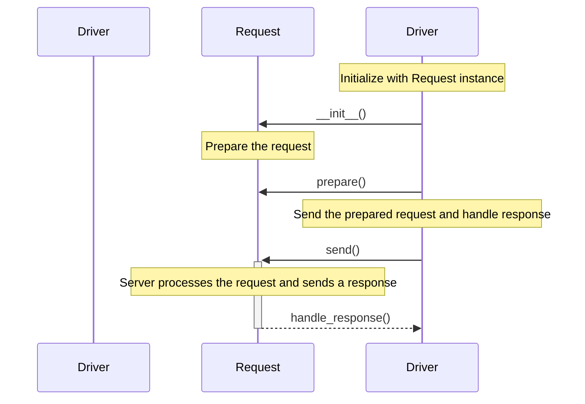

## Chapter 87: jumpstarter/packages/jumpstarter-driver-http/jumpstarter_driver_http/__init__.py

 Chapter Title: Understanding `jumpstarter/packages/jumpstarter-driver-http/jumpstarter_driver_http/__init__.py`

   In the scope of the Jumpstarter project, the file `jumpstarter/packages/jumpstarter-driver-http/jumpstarter_driver_http/__init__.py` serves as a crucial entry point for interacting with HTTP drivers. This module initializes and manages the core functionalities of the HTTP driver within the Jumpstarter project.

   The main purpose of this file is to provide an interface for creating, configuring, and using various HTTP drivers. It does this by defining a factory function called `create_driver()`, which takes in parameters specific to the desired driver type (e.g., `'requests'` or `'curl'`) and returns a properly configured instance of the selected HTTP driver class.

   The factory function `create_driver()` is designed to handle the creation of driver instances based on the given configuration settings, such as base URLs, authentication tokens, timeouts, and other options specific to each driver implementation. By encapsulating this process within a single function, the application can easily switch between different HTTP drivers without modifying the rest of the codebase.

   This module also defines an abstract class called `Driver` that serves as a base for all concrete driver implementations (e.g., `requests_driver`, `curl_driver`, etc.). The abstract `Driver` class outlines common functionalities, such as sending requests and handling responses, that should be present in each concrete driver implementation. By defining an interface for these shared functionalities, the application can ensure consistent behavior across all drivers.

   In terms of where this code fits within the project, the `jumpstarter_driver_http` package is one of several packages within the Jumpstarter project that provides a collection of reusable modules and functions for performing specific tasks. The HTTP driver package is particularly important as it enables the application to interact with external APIs or services using various transport protocols, such as HTTP/1.1 or HTTP/2.

   Example use cases could include sending GET requests to fetch data from an API endpoint, setting up authentication tokens for secure access to protected resources, and configuring custom headers or query parameters to fine-tune the behavior of the driver. By leveraging the abstractions provided by the `jumpstarter_driver_http` package, developers can quickly build powerful applications that interact with a wide variety of external services with minimal boilerplate code.

   In summary, the purpose of `jumpstarter/packages/jumpstarter-driver-http/jumpstarter_driver_http/__init__.py` is to provide an interface for creating and configuring HTTP drivers within the Jumpstarter project. It accomplishes this by defining a factory function for creating driver instances and an abstract class serving as a base for concrete implementations, ensuring consistent behavior across all drivers. This package plays a vital role in enabling seamless interaction with external APIs or services within the Jumpstarter application.

 To create a Mermaid sequence diagram for the given Python file, we first need to identify the key functions and their interactions. Here's a simple example based on the following assumption about the main functionalities of the `jumpstarter_driver_http` module:

1. The `HttpDriver` class initializes with an instance of `Request`.
2. The `execute()` method calls the `prepare()` method to prepare the request, then sends it using the `send()` method provided by the underlying `Request` object. Finally, it processes the response returned from the server using the `handle_response()` method.

This diagram shows the main interactions between `HttpDriver` and `Request`. Depending on your actual use case, you might have more functions or more complex interaction scenarios. You can refer to the [Mermaid documentation](https://mermaidjs.github.io/mermaid-live-editor/) for more details about creating sequence diagrams with Mermaid.