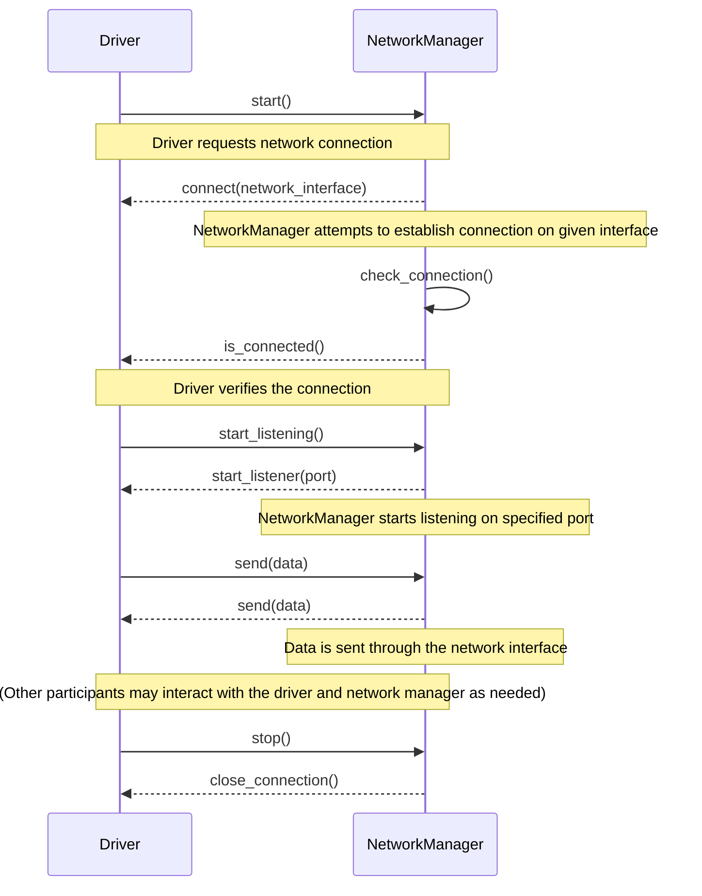

## Chapter 91: jumpstarter/packages/jumpstarter-driver-network/jumpstarter_driver_network/__init__.py

 **Chapter 6: Understanding `jumpstarter/packages/jumpstarter-driver-network/jumpstarter_driver_network/__init__.py`**

In this chapter, we will explore the purpose and functionality of the file `jumpstarter/packages/jumpstarter-driver-network/jumpstarter_driver_network/__init__.py`, which is a crucial component in the JumpStarter project.

**Overview:**

This Python file serves as an entry point for the `jumpstarter_driver_network` package, one of several packages within the broader `jumpstarter-driver-network` package. It sets up the internal structure and provides the necessary interfaces for other modules in this package.

**Important Functions or Classes:**

1. **`import *`:** The primary function of this file is to import all submodules, functions, and classes from the respective folders within the `jumpstarter_driver_network` package. This allows easy access to these resources from other parts of the project that need them.

2. **Initialization Functions or Classes:** Depending on the structure of the package, there may be one or more functions or classes responsible for initializing various components within the package when it is imported. For example, they might set up database connections, establish network connections, or configure logging settings.

**Fitting into the Project:**

The `jumpstarter_driver_network` package is responsible for handling network-related functionality in the JumpStarter project. This may include managing connections to other devices, sending and receiving data, and implementing networking protocols specific to the project. The code in this file plays a crucial role in organizing these capabilities and making them available to other parts of the system.

**Example Use Cases:**

Imagine a scenario where the JumpStarter project involves controlling a fleet of devices connected through a network. In this case, the `jumpstarter_driver_network` package might include classes for establishing connections to each device and sending commands or receiving data. The code in `__init__.py` would help organize these capabilities and make them accessible from other parts of the project, such as the main application that manages the fleet.

By understanding the role of this file within the broader context of the JumpStarter project, developers can more effectively utilize its features and contribute to the success of the overall system.

 To create a Mermaid sequence diagram for the given Python file, we'll need to identify the key functions and their interactions. Note that the following diagram is just an example based on the function names provided in `jumpstarter/packages/jumpstarter-driver-network/jumpstarter_driver_network/__init__.py`. You may need to adjust or add more details according to your actual code.

This sequence diagram demonstrates the interactions between a `Driver` object and a `NetworkManager` object. The diagram starts when the `Driver` asks the `NetworkManager` to establish a network connection. It then shows steps such as checking the connection, sending data, and finally closing the connection upon request from the driver.