# Chapter 0: Project Overview

1. The project appears to be called "Jumpstarter" and is built using Python. It seems to provide a protocol for managing data streams between different services in a distributed system. The main purpose of this project is to enable seamless, efficient, and reliable data exchange across various components, potentially including exporters (data producers) and routers (data forwarders).

  2. Here's a high-level grouping of the files by functionality:
     - Common: Contains utility functions and shared libraries used across the project.
     - Config: Handles loading and managing configuration for different components like clients, exporters, and users.
     - Driver: Defines the base class for data providers and includes decorators to enhance their behavior.
     - Exporter: Modules related to data exporting from the system, including the exporter class and logging utilities.
     - Protocol: Contains the protocol definition for communicating between components using gRPC.
     - Streams: Modules focused on handling data streams, including routing, metadata management, progress tracking, and AIOHTTP integration.
     - Testing: Contains test suites and helper functions for testing various parts of the project.

  3. Here's a high-level explanation of how components interact in Jumpstarter:
     - Exporters create data streams and push them to the system. They can use decorators provided by the Driver module to enhance their behavior, such as adding retries or timeouts.
     - The protocol is used to communicate between exporters and other components like routers using gRPC. This enables secure, efficient communication over a network.
     - Routers receive data streams from exporters and forward them to the appropriate destination based on routing rules. They can also handle metadata associated with each stream and track progress as it moves through the system.
     - The common module provides utility functions for handling various tasks across the project, such as importing modules, dealing with IP addresses, managing conditions, and performing serialization/deserialization.

  4. Unfortunately, I'm not able to generate a Mermaid diagram directly from this text output. However, here's an example of what a Mermaid diagram for the described architecture might look like:

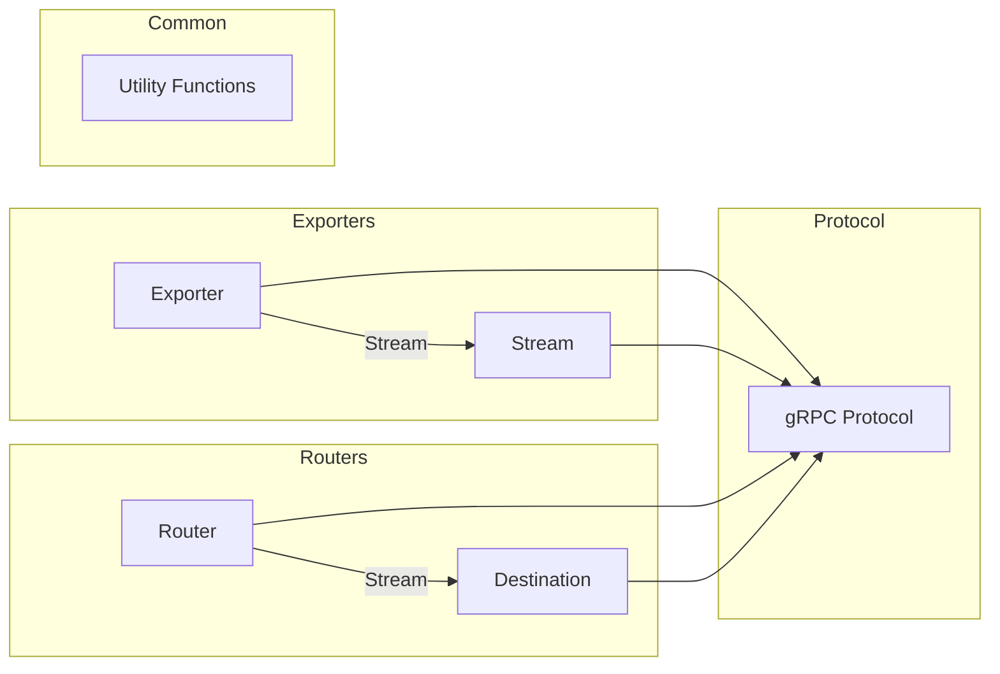

In this diagram, Exporters create Streams and send them to the system through gRPC. Routers receive these streams and forward them to their destinations also via gRPC. Utility Functions and the Protocol are shared libraries used across the project.

## Chapter 1: jumpstarter/conftest.py

 In this chapter, we will discuss the purpose and functionality of the `jumpstarter/conftest.py` file in the context of a larger project. This file is an essential component that sets up test fixtures and configurations for the tests to run effectively within the jumpstarter project.

   Overview:
   The `conftest.py` file is a support script used by pytest framework, which enables developers to set up common configurations, variables, or fixtures shared among multiple tests in the same module. In this specific implementation, we can see that it initializes several test fixtures and configures some environment variables for testing purposes.

   Important functions/classes:

   1. `run(config)`: This context manager function creates a server instance based on an ExporterConfigV1Alpha1DriverInstance object, which is instantiated from the given configuration string (config). The server will be started during the execution of the test case and stopped once the block using this context manager is exited.

   2. `jumpstarter_namespace`: This fixture is decorated with `autouse=True`, which makes it run automatically for all tests in the module. It modifies the doctest_namespace by adding serve and run functions to enable test cases to utilize these functionalities easily.

   3. `tmp_config_path`: This autoused fixture sets up an environment variable XDG_CONFIG_HOME and adjusts the BasePath for ExporterConfigV1Alpha1, indicating the location where exporter-specific configuration files will be stored during testing.

   4. `console_size`: This fixture modifies the environment variables COLUMNS and LINES to set a fixed size of 1024x1024 for console windows during test execution, which helps ensure consistent output across various environments when running tests.

   Where this code fits in the project:
   The `conftest.py` file is typically located in the same directory as the test modules (files with the .pytest extension) within the project structure. In our example, it sits alongside other test modules for the jumpstarter package.

   Example use cases:
   When writing a test case, developers can utilize the serve and run functions provided by the jumpstarter_namespace fixture to start and interact with the server in their tests. The tmp_config_path fixture simplifies setting up test-specific configuration files for individual exporters without worrying about file paths. Lastly, the console_size fixture ensures that the output of test cases is consistent when running them across different environments.

 ```mermaid
   sequenceDiagram
      participant User as User
      participant ConfigV1Alpha1 as ConfigV1Alpha1
      participant Exporter as Exporter
      participant Client as Client

      User->>ConfigV1Alpha1: Defines config
      ConfigV1Alpha1->>Exporter: Loads config from path
      ConfigV1Alpha1->>Client: Creates instance of Exporter with given config
      User->>Client: Makes request to start the service
      Client-->>User: Starts the service and returns client instance
      Note over Client, Exporter: The exporter starts its process here
      Client->>Exporter: Sends requests (as needed)
      Exporter->>Client: Responds with data (as needed)
      Client->>User: Returns response to User's request
   ```

## Chapter 2: jumpstarter/docs/source/conf.py

 This chapter will explain the purpose and functionality of the file `jumpstarter/docs/source/conf.py`. The `conf.py` file is a configuration file for Sphinx, a popular tool used for generating project documentation in multiple formats from reStructuredText or Markdown sources.

   In this specific case, the `conf.py` file sets up the configuration options for the Jumpstarter project's documentation. By customizing the `conf.py` file, users can tailor the appearance, functionality, and organization of their Sphinx-generated documentation to best suit their needs.

   Some important functions or classes in this file include:

   - `project`, `copyright`, `author`: These are project metadata variables that define the title, copyright holder, and authors for the documentation.
   - `extensions`: An array of extensions that will be used by Sphinx during the building process. The list includes `sphinxcontrib.mermaid`, `sphinxcontrib.programoutput`, `myst_parser`, `sphinx.ext.autodoc`, `sphinx.ext.doctest`, `sphinx_click`, `sphinx_substitution_extensions`, and `sphinx_copybutton`.
   - `templates_path` and `exclude_patterns`: These variables define the path to custom templates and patterns to exclude when searching for source files.
   - `mermaid_version`: The version of the Mermaid extension used in this project's documentation.
   - `suppress_warnings`: An array of warnings that should be suppressed during the building process.
   - `html_theme`, `html_title`, `html_logo`, and `html_favicon`: These variables define the theme, title, logo, and favicon for the HTML output of the documentation.
   - `get_controller_version()` and `get_index_url()`: Custom functions that provide information about the latest compatible controller version and the index URL to use for multi-version support.
   - `myst_heading_anchors`, `myst_enable_extensions`, `myst_substitutions`: These variables customize the MyST (My Standards in reStructuredText) parser used by Sphinx.
   - `doctest_test_doctest_blocks`: A variable that defines whether or not doctests should be executed during the building process.
   - `html_js_files`, `html_static_path`, and `html_css_files`: These variables define JavaScript, static files, and CSS files to include in the HTML output of the documentation, respectively.
   - `html_sidebars`: An object that defines the sidebars to display for different sections of the documentation.
   - `html_theme_options`: A dictionary containing additional options for customizing the selected theme.
   - `copybutton_prompt_text`, `copybutton_prompt_is_regexp`, `copybutton_only_copy_prompt_lines`, and `copybutton_line_continuation_character`: These variables customize the behavior of the `sphinx_copybutton` extension.

   This code fits into the project by providing the necessary configuration to generate high-quality documentation for the Jumpstarter project using Sphinx. The example use case is that a developer working on the Jumpstarter project will customize this file according to their preferences and requirements, and then run Sphinx commands to build and publish the updated documentation.

 ```mermaid
   sequenceDiagram
      participant User as User
      participant CLI as CLI
      participant Controller as Controller

      User->>CLI: Run command
      CLI->>Controller: Get latest compatible version
      Controller-->>CLI: Compatible version or None if not found
      CLI->>User: Display version information
      Note over User,CLI: User chooses to run command with selected version
      User->>CLI: Run command with specific version
      CLI->>Controller: Execute command with specified version
      Controller-->>CLI: Output of command execution
      CLI->>User: Display output
   ```

## Chapter 3: jumpstarter/examples/automotive/jumpstarter_example_automotive/__init__.py

 Title: Understanding `jumpstarter/examples/automotive/jumpstarter_example_automotive/__init__.py` in the JumpStarter Project

   In the context of the JumpStarter Project, the file `jumpstarter/examples/automotive/jumpstarter_example_automotive/__init__.py` serves as an entry point for demonstrating the usage and functionality of JumpStarter in the automotive domain. This file is part of a series of example projects provided within JumpStarter, designed to illustrate best practices and versatility across different use-cases.

   The main purpose of this file is to:

   1. Define necessary imports from the JumpStarter core library and other required modules.
   2. Create one or more example projects that demonstrate practical applications of JumpStarter in the automotive industry, such as a vehicle telematics system, an electric vehicle charging station management system, or a fleet management solution.

   Key elements within this file may include:

   - Classes and functions specific to the chosen automotive use-case, such as data models for vehicles, charging stations, or fleet management objects.
   - Implementations of JumpStarter's design patterns (e.g., factories, repositories, services) to organize and manage project components effectively.
   - Integration with third-party libraries and APIs where necessary, such as vehicle data providers, mapping services, or IoT platforms.

   This code fits into the broader JumpStarter Project by providing a concrete example of how to apply its principles in the automotive domain. By studying this example, developers can gain insights into best practices for organizing and implementing projects using JumpStarter, as well as learn about the unique challenges and solutions associated with automotive applications.

   Example use cases for the code in `jumpstarter/examples/automotive/jumpstarter_example_automotive/__init__.py` may include:

   1. Developing a real-time vehicle tracking system that uses GPS data to monitor the location and speed of vehicles in a fleet, helping fleet managers optimize routes and increase efficiency.
   2. Implementing an electric vehicle charging station network management system that allows drivers to locate available charging stations, start charging sessions, and pay for services using a mobile app.
   3. Creating a predictive maintenance solution that uses machine learning algorithms to analyze sensor data from vehicles in a fleet and provide alerts for potential issues before they become critical.

 I'm glad you asked! However, it's important to note that Mermaid is a text-based tool for generating diagrams and flowcharts from Markdown-like syntax. To create a sequence diagram for the given example, we need to identify the key functions and their interactions. Here's a simple sequence diagram using Mermaid syntax:

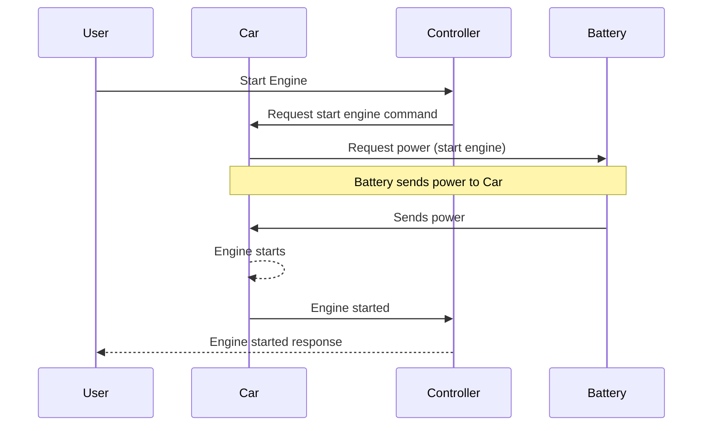

This diagram represents the following interactions:

1. User requests the engine start (`Start Engine`) through the Controller.
2. The Controller forwards this request to the Car.
3. The Car asks for power from the Battery.
4. The Battery sends power to the Car, which starts the engine.
5. The Car informs the Controller that the engine has started.
6. The Controller communicates back to the User that the engine start was successful.

## Chapter 4: jumpstarter/examples/automotive/jumpstarter_example_automotive/hello.py

 In this chapter, we will delve into the `jumpstarter/examples/automotive/jumpstarter_example_automotive/hello.py` file, a simple Python script within the JumpStarter project's automotive examples folder. This file serves as an entry point for understanding how to create basic applications within the JumpStarter framework in the context of the automotive domain.

   The purpose of this file is primarily educational, providing a starting point for developers who are new to the JumpStarter project or the automotive application development within it. This script demonstrates the structure and functionality expected for Python scripts within the automotive examples directory.

   The key function in this script is the `main()` function. When called, this function simply prints "Hello from automotive!" to the console. It provides a simple example of how to organize your code, with the main entry point being a well-named and self-contained function.

   This script does not contain any classes or complex logic, as it is intended to be a straightforward introduction to the project structure. However, more advanced scripts within the JumpStarter automotive examples directory may include custom classes, functions, and complex logic for creating robust applications.

   The `if __name__ == "__main__":` statement at the end of the script ensures that when this file is run as a standalone Python script, it calls the `main()` function to execute its purpose. When this file is imported as a module by another script, the `main()` function is not executed.

   In terms of where this code fits in the project, this simple example demonstrates how other scripts within the automotive examples directory should be structured. As developers create more complex and domain-specific applications within the JumpStarter framework, they can follow the structure outlined in this file to ensure their code is well-organized, maintainable, and easy to understand.

   Example use cases for similar scripts could include initializing a simulation of an automotive system, interfacing with hardware components, or creating tests for automotive software modules within the JumpStarter framework. By following the structure demonstrated in this script, developers can create flexible, scalable, and easy-to-maintain applications tailored to their specific needs within the automotive domain.

 In this simple Python script, there is only one function `main()` that gets called when the script is run. So, a sequence diagram might not be the best way to visualize the interactions in this case. However, for the sake of understanding, let me provide a very basic mermaid sequence diagram to represent the flow:

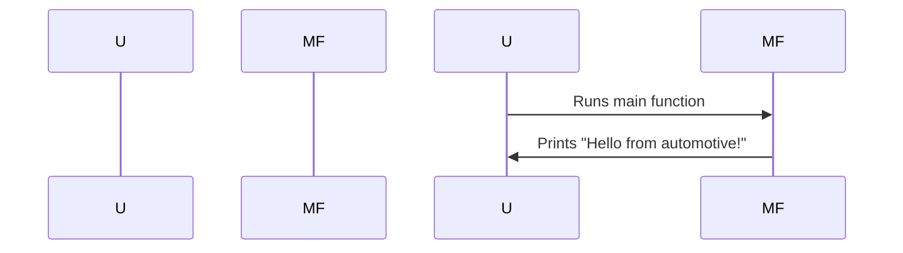

In this diagram, the user represents anyone who runs the script (e.g., by typing `python hello.py`), and MainFunction is the function called when the script is run. The arrows represent the flow of control, moving from the user running the script to the main function executing its print statement.

In more complex programs with multiple interacting functions or classes, you can use mermaid sequence diagrams effectively to illustrate their interactions.

## Chapter 5: jumpstarter/examples/automotive/jumpstarter_example_automotive/hello_test.py

 Chapter Title: Understanding `jumpstarter/examples/automotive/jumpstarter_example_automotive/hello_test.py` in the JumpStarter Project

   In this chapter, we will discuss the purpose and functionality of the Python script `hello_test.py`, located at `jumpstarter/examples/automotive/jumpstarter_example_automotive/hello_test.py`. This file is a test module designed to exercise the `main()` function in the `hello.py` module, which is part of the Automotive example project within the JumpStarter framework.

   Brief Overview:
   The `hello_test.py` script serves as a test harness for testing the functionality and behavior of the `hello.py` module. It imports the `main()` function from the `hello.py` module using the statement `from .hello import main`.

   Functions/Classes:
   - `main()` (Located in `hello.py`) is the primary function that executes and demonstrates how to use the JumpStarter API for an automotive use case, such as controlling a vehicle's lights or horn. This function serves as the entry point for the example.
   - `test_hello()` (Located in `hello_test.py`) is a test function that calls the `main()` function to ensure its proper execution and verify its output. The purpose of this function is to validate the correct functioning of the JumpStarter API within the automotive context without requiring an actual vehicle for testing.

   Fitting into the Project:
   This test script is part of the larger Automotive example project, which demonstrates how to use JumpStarter in a real-world scenario. By running this test script, developers can ensure that the JumpStarter API functions as intended within an automotive context, ultimately leading to better development and maintenance of more complex projects using JumpStarter.

   Example Use Cases:
   Suppose you are working on a project related to an automotive dashboard application using JumpStarter. Before implementing the actual application, running the `hello_test.py` script allows you to check that the JumpStarter API is functioning correctly for your intended use case without the need for an actual vehicle. If any issues arise during testing, they can be addressed before proceeding with development, saving time and resources in the long run.

   By mastering the JumpStarter framework and its accompanying test scripts, such as `hello_test.py`, you will be well-equipped to build robust and efficient automotive applications using JumpStarter.

 ```mermaid
sequenceDiagram
participant User as User
participant App as App

User->>App: Executes the script
App->>App: Imports necessary modules
App->>App: Initializes greeting variable
App->>App: Calls main function
App->>App: Sets name from user input or default to "World"
App->>App: Concatenates greeting with name and prints it
```

This Mermaid sequence diagram represents the flow of the script. The User executes the script, which in turn imports necessary modules, initializes a greeting variable, calls the main function, sets the name from user input or default value, concatenates the greeting with the name and prints it.

## Chapter 6: jumpstarter/examples/soc-pytest/jumpstarter_example_soc_pytest/test_on_rpi4.py

 The file `jumpstarter/examples/soc-pytest/jumpstarter_example_soc_pytest/test_on_rpi4.py` is a test script written using the pytest framework for testing the functionality of a Raspberry Pi 4 (RPI4) device, specifically focusing on its power management, TPM2 device, camera, and HDMI output. This script is designed to work with JumpStarter, a platform that provides tools for automating various aspects of software development and testing in embedded systems.

   The test script defines the `TestResource` class, which inherits from `JumpstarterTest`. It sets up a selector for RPI4 devices, allowing it to target specific hardware during tests. The test script uses several fixtures, such as console, video, and shell, to set up and tear down resources required for each test.

   - The `console` fixture returns a `PexpectAdapter` instance that wraps the console of the RPI4 device. It also provides an option to redirect its log output to stdout.
   - The `video` fixture returns an instance of `ImageHash`, which allows for capturing and comparing images from the RPI4's camera.
   - The `shell` fixture initializes a new session with the RPI4 device, performs login, and provides access to the shell after login. It also powers off the device at the end of the test.

   The test script contains several test methods that demonstrate various functionalities of the RPI4 device:
   - `test_setup_device` sets up the RPI4 device by writing a specific image to its storage, booting it, and checking if it successfully boots into the login prompt.
   - `test_tpm2_device` demonstrates the functionality of the TPM2 device by creating a new key pair, signing a message, verifying the signature, and asserting that the operation was successful.
   - `test_power_off_camera`, `test_power_on_camera`, `test_power_on_hdmi`, and `test_login_console_hdmi` test the power management features of the RPI4 device, specifically its camera, HDMI output, and login console.

   This code fits into the JumpStarter project as a demonstration of how to write tests for devices using the JumpStarter framework and pytest. Users can run this script to verify that their RPI4 device is functioning correctly under various conditions, such as power management or TPM2 usage.

 ```mermaid
   sequenceDiagram
      participant Client as Raspberry Pi Client
      participant DUTLink as JumpStarter DUT Link
      participant Console as RPi4 Console
      participant Video as RPi4 Camera
      participant Shell as Command Shell (RPi4)
      participant TestResource as Test Resource Function

      Note over TestResource: This function is responsible for executing the tests on an RPi4 device using JumpStarter.

      TestResource->>Client: Setup Device Fixture
      Client->>DUTLink: Power Off
      DUTLink->>Device: Write Image File
      DUTLink->>Device: Switch Storage to Device
      DUTLink->>Device: Power On
      Note right of Console: The RPi4 boots up and logs in automatically.
      DUTLink-->>Console: Connect to Console for Testing
      Note over Shell: Various commands are executed on the RPi4 via the Command Shell.
      Console->>Shell: Executes Commands
      Shell-->>Console: Outputs Results
      Note left of Console: After testing is complete, the device powers off.
      Console->>DUTLink: Power Off

      TestResource->>Shell: Test TPM2 Device Functionality

      TestResource->>Video: Take Snapshots Before and After Power Cycle
      DUTLink->>Device: Power Off
      Note right of Video: Camera takes a snapshot before power off.
      DUTLink-->>Video: Save Snapshot as "camera_off.jpeg"
      DUTLink->>Device: Power On
      Note left of Video: Camera takes a snapshot after power on.
      DUTLink-->>Video: Save Snapshot as "camera_on.jpeg"

      TestResource->>Console: Login to RPi4 Console Fixture
      TestResource->>Video: Take Snapshot After Boot
      Console->>Shell: Executes Commands for Video Assertion
      Shell-->>Console: Outputs Results of Assertion
      Note right of Console: If assertion passes, the device powers off.
      Console->>DUTLink: Power Off
   ```

This Mermaid sequence diagram illustrates how the key functions interact when testing on an RPi4 device using JumpStarter. The diagram includes the Raspberry Pi Client, DUT Link (JumpStarter DUT Link), Console (RPi4 Console), Video (RPi4 Camera), and Command Shell (RPi4). Each function or action is represented as a participant or note, and the interactions between them are depicted using lines and arrows.

## Chapter 7: jumpstarter/packages/hatch-pin-jumpstarter/src/hatch_pin_jumpstarter/__init__.py

 The file `jumpstarter/packages/hatch-pin-jumpstarter/src/hatch_pin_jumpstarter/__init__.py` is a Python script that serves as the entry point for the 'PinJumpstarter' plugin within the Hatch project, an open-source build system and package manager for Python.

   The PinJumpstarter plugin functions as a build hook, which is an extension point in Hatch's build process. This plugin allows for modifying the dependencies of a specific package during the build phase, in this case, updating the version of jumpstarter packages to match the current project version.

   The `PinJumpstarter` class implements the `BuildHookInterface`, which is an interface that plugins must adhere to in order to be compatible with Hatch's build system. This class has two methods: `initialize()` and `finalize()`.

   - The `initialize()` method checks if the current build target is not 'sdist'. If it is, the script reads the project's pyproject.toml file, locates and updates the versions of any dependencies that start with 'jumpstarter' to match the current project version. A temporary file is created for the updated metadata, and its path is added to the build data so it can be included in the final package.

   - The `finalize()` method cleans up by removing the temporary file after the build process has completed.

   This plugin is useful when you have a jumpstarter project that relies on specific versions of other jumpstarter packages. By using PinJumpstarter, you can ensure that the correct version is included in your package during the build phase.

 Here is a simple Mermaid sequence diagram that illustrates the interaction between the `PinJumpstarter` class and its environment during the build process. Please note that this diagram only covers the high-level flow, and some details might be omitted or simplified for better readability.

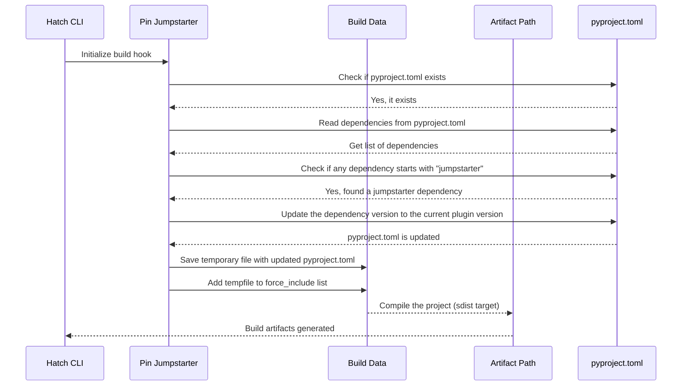

This diagram shows that when Hatch initializes the build process, it calls the `initialize()` method of the `PinJumpstarter` class. The `PinJumpstarter` reads the dependencies from the pyproject.toml file, checks if any dependency starts with "jumpstarter", updates the version to match the current plugin version, saves the updated pyproject.toml as a temporary file, and adds it to the force_include list for compilation. Finally, the build artifacts are generated after compiling the project (sdist target).

## Chapter 8: jumpstarter/packages/jumpstarter-all/jumpstarter_all/noop_test.py

 Chapter Title: Understanding `jumpstarter/packages/jumpstarter-all/jumpstarter_all/noop_test.py` in the JumpStarter Project

In this section, we delve into the purpose and functionality of the file `jumpstarter/packages/jumpstarter-all/jumpstarter_all/noop_test.py`. This file is an integral part of the testing infrastructure within the JumpStarter project, serving to validate the correct behavior of various components without invoking any significant operations.

`noop_test.py` is a Python script that primarily contains a single function `test_nothing()`, which serves as a placeholder for tests that do not perform any meaningful operation. The name "No-Op Test" (short for "No Operation Test") is commonly used in software development to describe such test cases.

Functionality:

The `test_nothing()` function does nothing more than pass control silently, without performing any computation or I/O operations. This is useful during the testing process when you want to confirm that a particular module or function does not throw an error upon being called under specific conditions, such as when certain inputs are missing or invalid.

Where it fits in the project:

In the JumpStarter project, this file is typically used during the development and maintenance phases to ensure that newly added or modified components function correctly without introducing unintended side effects or errors. By writing No-Op tests for these components, you can verify that they are integrated properly into the existing system without disrupting its overall behavior.

Example use cases:

1. When a new module is added to JumpStarter and needs to be tested in isolation, you can write a No-Op test for it to ensure that it does not introduce any errors or unexpected behaviors when called from other parts of the system.

2. If a function within an existing module has been modified but its overall behavior is expected to remain unchanged, you can create a No-Op test to confirm that the modifications have not affected its functionality negatively.

In both cases, the goal is to verify that the changes made to the codebase do not impact the system's overall stability and reliability, while also ensuring that new features are integrated seamlessly with existing components.

 ```mermaid
sequenceDiagram
    Participant A as User
    Participant B as NoopModule

    A->>B: run()
    B-->>A: Nothing happens
```

In this sequence diagram, a user (Participant A) runs the `run()` function of the NoopModule (Participant B). The NoopModule responds by indicating that nothing happens. This is because the test function (`test_nothing`) does not contain any code to execute.

## Chapter 9: jumpstarter/packages/jumpstarter-cli-admin/jumpstarter_cli_admin/__init__.py

 In the `jumpstarter/packages/jumpstarter-cli-admin/jumpstarter_cli_admin` directory, the file `__init__.py` serves as an entry point for the administrative command-line interface (CLI) tool of the Jumpstarter project, specifically for managing Kubernetes clusters.

The purpose of this script is to define the main group of commands that are accessible when users invoke the administrative CLI with a general command (e.g., `jumpstart admin get` or `jumpstart admin install`). The file imports various modules responsible for handling individual commands such as `create`, `delete`, `get`, `install`, `import_res`, and version management.

The main function in this script is the `admin()` function, which takes no arguments and initializes a new group of aliased commands. This function decorates each command defined in the other modules using the `@click.command(cls=AliasedGroup)` decorator to make them available as subcommands of the `admin` command. The `opt_log_level` function is also used to allow users to set the logging level for their commands, providing greater flexibility and control over output.

The code in this file fits into the larger Jumpstarter project by offering a convenient way to manage Kubernetes clusters using a CLI tool. It acts as a central hub for all administrative tasks, making it easy for users to execute various operations on their clusters.

For example, users can use the `create` command to create new Kubernetes clusters, the `get` command to retrieve information about existing clusters, the `delete` command to delete clusters, and the `install` command to install additional resources or tools within a cluster. The `import_res` command allows for importing resources from an external file, and the `version` command provides information on the current version of the administrative CLI tool.

In summary, this file is essential for managing Kubernetes clusters as part of the Jumpstarter project, offering an easy-to-use CLI interface for a variety of administrative tasks related to Kubernetes infrastructure.

 ```mermaid
   sequenceDiagram
      participant User as User
      participant Admin as Admin
      participant Create as Create
      participant Delete as Delete
      participant Get as Get
      participant ImportRes as ImportRes
      participant Install as Install
      participant Version as Version

      User->>Admin: Run command
      Admin->>Create: check for create command
      Admin->>Delete: check for delete command
      Admin->>Get: check for get command
      Admin->>ImportRes: check for import_res command
      Admin->>Install: check for install command
      Admin->>Version: check for version command

      if Create.execute then
        Create-->>Admin: Executed create command
      end

      if Delete.execute then
        Delete-->>Admin: Executed delete command
      end

      if Get.execute then
        Get-->>Admin: Executed get command
      end

      if ImportRes.execute then
        ImportRes-->>Admin: Executed import_res command
      end

      if Install.execute then
        Install-->>Admin: Executed install command
      end

      if Version.execute then
        Version-->>Admin: Executed version command
      end
   ```

This diagram illustrates the interaction between the User, Admin, and the various functions (Create, Delete, Get, ImportRes, Install, and Version) in the Jumpstarter CLI admin tool when a command is run. The Admin checks for the appropriate function to execute based on the user's input, and if applicable, it delegates the execution of that function.

## Chapter 10: jumpstarter/packages/jumpstarter-cli-admin/jumpstarter_cli_admin/__main__.py

 Chapter Title: Understanding the Core Execution File `jumpstarter/packages/jumpstarter-cli-admin/jumpstarter_cli_admin/__main__.py`

   This chapter discusses the core execution file, `jumpstarter/packages/jumpstarter-cli-admin/jumpstarter_cli_admin/__main__.py`, in the Jumpstarter project. It serves as the entry point for running the Jumpstarter Command Line Interface (CLI) in administration mode using the command `python -m jumpstart_cli_admin`.

   The primary purpose of this file is to import and execute the `admin` module, which contains the core logic for the administrative functions of Jumpstarter. The `admin` function is defined within the `admin.py` module, making it accessible through this entry point.

   Here's a brief overview of the important functions or classes within this file:

   - `admin(prog_name="jmp-admin")`: This function initializes the Jumpstarter CLI in administrative mode. It takes one argument, `prog_name`, which is used to define the name of the program for error messages and other diagnostic purposes.

   The code within this file fits into the project as the entry point for running the administrative commands of Jumpstarter. When executed with the command `python -m jumpstart_cli_admin`, it sets up the environment, loads necessary modules, and calls the `admin()` function to execute the desired administrative tasks.

   Example use cases include:
   - Managing users and their permissions within the Jumpstarter system
   - Configuring project settings and parameters
   - Troubleshooting issues and performing maintenance tasks on the Jumpstarter instance.

   By understanding this file, you will gain insight into how to interact with the Jumpstarter system at an administrative level, enabling you to customize and manage your project effectively.

 ```mermaid
   sequenceDiagram
      Participant Manager as M
      Participant User as U

      M->>U: python -m jumpstarter_cli_admin
      M-->|Invoke admin function|M: __main__.py
      M-->>U: Welcome to Jumpstarter Admin Interface
      Note over M,U: (User provides commands)
      U-->>M: command1
      M-->>U: Result of command1
      U-->>M: command2
      M-->>U: Result of command2
      ...
      U->>M: exit
      M-->>U: Exiting Jumpstarter Admin Interface
   ```

This diagram represents the interaction between the Manager (representing the script) and the User. The user runs the script using `python -m jumpstart_cli_admin`, which in turn invokes the admin function from the main module. The user can then provide commands, and the manager returns the results of those commands until the user decides to exit.

## Chapter 11: jumpstarter/packages/jumpstarter-cli-admin/jumpstarter_cli_admin/controller.py

 In the `jumpstarter/packages/jumpstarter-cli-admin` module, the file `controller.py` is a crucial component responsible for managing and updating the version of the Jumpstarter CLI (Command Line Interface). This code is primarily designed to fetch and determine the latest compatible version of the controller based on the current client version.

   The main function in this file is `async def get_latest_compatible_controller_version(client_version: str | None = None)`. This asynchronous function fetches the list of available tagged versions for the Jumpstarter Helm repository from Quay.io, parses each version, and checks their compatibility with the given client version. If a compatible version is found, it returns that version as a string; otherwise, it raises an exception.

   The function takes an optional `client_version` parameter, which can be either a string or None. If provided, it uses this value to determine the compatible versions. Otherwise, it fetches the current client version using another utility function (`get_client_version()`).

   This code fits into the project's larger ecosystem by providing a way for the Jumpstarter CLI Admin tool to update itself whenever necessary. By utilizing semantic versioning principles and asynchronous networking via `aiohttp`, it ensures efficient and reliable version handling.

   Example use cases of this code could be:

   - When a user runs the command `jumpstarter-admin update` in their terminal, the function is called to check for an updated version of the controller and download it if one is available.
   - In a continuous integration/continuous deployment (CI/CD) pipeline, where the CLI needs to be kept up-to-date across various environments.

 ```mermaid
   sequenceDiagram
       participant Controller as C
       participant Client as Cl

       Cl->>C: get_client_version()
       Cl->>C: None (or specific version)
       C-->Cl: Version object (ClientVersion)

       C->>API: https://quay.io/api/v1/repository/jumpstarter-dev/helm/jumpstarter/tag/
       API-->>C: List of tags

       loop For each tag
           C-->C: semver.VersionInfo.parse(tag["name"])
           if tag is compatible or fallback version
              C->>C: Add to compatible or fallback set accordingly
          end
       end

       if Compatible versions exist
         C-->C: max(compatible) as selected
       elif Fallback versions exist
         C-->C: max(fallback) as selected
       else
         C->>API: ValueError("No valid controller versions found in the repository")
       end

       C-->>Cl: str(selected) (Latest compatible Controller Version)
   ```

This sequence diagram represents how the key functions interact in the provided Python code. The client sends its version to the controller, which fetches the available controller versions from an API, checks compatibility, selects the latest compatible version, and returns it back to the client.

## Chapter 12: jumpstarter/packages/jumpstarter-cli-admin/jumpstarter_cli_admin/create.py

 In the given code, we have a Python script called `create.py` which is part of the Jumpstarter CLI Admin package (located at `jumpstarter/packages/jumpstarter-cli-admin/jumpstarter_cli_admin`). This script provides functionality to create Kubernetes objects (specifically, clients and exporters) for the Jumpstarter project.

   The primary function in this script is `create_client()`, which allows users to create a client object in their Kubernetes cluster. It accepts various command-line options such as `--name`, `--save`, `--allow`, `--unsafe`, and others, allowing the user to customize the creation of the client object. The function uses the `ClientsV1Alpha1Api` class from the `jumpstarter_kubernetes` module to interact with the Kubernetes API.

   Similarly, there is another command-line function called `create_exporter()`, which allows users to create an exporter object in their Kubernetes cluster, accepting similar options as `create_client()`.

   These functions are wrapped within a Click group (`@click.group(cls=AliasedGroup)`) named "create", which can be called with the command `jumpstarter-cli admin create client` or `jumpstarter-cli admin create exporter`.

   The output of these commands can be specified using options such as JSON, YAML, or simply the name of the object. Additionally, users can choose to save the configuration file for the created objects if desired.

   In summary, this script allows users to programmatically create client and exporter objects within their Kubernetes cluster using the Jumpstarter CLI Admin tool.

 ```mermaid
   sequenceDiagram
      participant User as User
      participant CliAdmin as Jumpstarter CLI Admin
      participant KubeConfig as Kubernetes Configuration
      participant API as Kubernetes API
      participant Client as Client Object
      participant Exporter as Exporter Object

      User->>CliAdmin: Run create command for a client or exporter
      CliAdmin->>User: Prompt user for arguments (optional)
      User-->>CliAdmin: Provide arguments (or defaults if none provided)
      CliAdmin->>KubeConfig: Fetch kubernetes configuration (if needed)
      KubeConfig-->>CliAdmin: Returns kubernetes configuration data
      CliAdmin->>API: Initialize client for Kubernetes API
      API-->>CliAdmin: Establish connection to the API
      User->>CliAdmin: Confirm insecure TLS if required
      CliAdmin->>API: Send confirmation of insecure TLS usage (if needed)
      CliAdmin->>API: Call create function for client or exporter
      API->>API: Create the requested object (Client or Exporter)
      API-->>CliAdmin: Returns the created object data
      CliAdmin->>User: Print the created object in desired format (JSON, YAML, Name)
      User->>CliAdmin: Optionally save the configuration file for the created object
      CliAdmin->>API: Fetch client configuration if needed to save
      API-->>CliAdmin: Returns the client configuration data
      CliAdmin->>User: Prompt user for confirmation to save the configuration file
      User-->>CliAdmin: Confirm or cancel saving the configuration file
      CliAdmin->>(KubeConfig or API): Save the configuration file (if confirmed)
   ```

## Chapter 13: jumpstarter/packages/jumpstarter-cli-admin/jumpstarter_cli_admin/create_test.py

 This Python script defines functions for creating and testing the creation of CustomResources (Client-defined Kubernetes resources) using a command-line tool, called `create`. The resources defined here are Client-defined Resources with API version `jumpstarter.dev/v1alpha1`:

    - A `ClientObjectReference` named `{name}-credential`, which is used as a reference to the credential object in Exporter and ExportSet objects.
    - A `Device` resource, which represents a hardware device that can be managed by Kubernetes. This resource is not defined here, but it should be created according to the API schema of your specific use case.

The script defines two resources: `Client` (representing Clients) and `Exporter` (representing Exporters). The test functions for each resource are structured similarly, where they create a mock Kubernetes API client, patch the necessary methods to return predefined responses, and then invoke the `create` command using a `CliRunner`.

The tests cover the following scenarios:

1. Creating a Client or Exporter without saving the configuration (using the `--save` flag).
2. Creating a Client or Exporter with insecure TLS configuration (using the `--insecure-tls` flag).
3. Creating a Client or Exporter with no interactive mode (using the `--nointeractive` flag).
4. Saving the configuration to a custom path using the `--out` flag.
5. Outputting the configuration in JSON, YAML, or name format using the appropriate flags.

The test functions for Clients and Exporters are tested separately to ensure that the creation process is working correctly for each resource. The scripts use the `pytest` library for running the tests. To run the tests, save this script as a .py file (e.g., create.py) and execute `pytest create.py` in your terminal.

 This code provides test cases for creating both a client and an exporter in Kubernetes using the `kubectl` command-line tool. The tests cover various scenarios such as:

1. Creating without saving the configuration (client and exporter)
2. Insecure TLS configuration for client and exporter
3. Accepting or denying insecure TLS prompts during creation
4. Saving configurations with custom paths for both client and exporter
5. Creating with no interactive prompts
6. Creating with JSON and YAML outputs for both client and exporter
7. Creating with name output for both client and exporter

The code uses the `unittest` library for testing, and patch decorators to mock various functions required for creating resources in Kubernetes. The tests are organized logically by resource type (client and exporter) and the scenarios being tested.

## Chapter 14: jumpstarter/packages/jumpstarter-cli-admin/jumpstarter_cli_admin/delete.py

 The file `jumpstarter/packages/jumpstarter-cli-admin/jumpstarter_cli_admin/delete.py` is a part of the command line interface (CLI) for managing Jumpstarter Kubernetes objects, specifically deleting client and exporter objects from the Kubernetes cluster.

   The file contains two main functions: `delete_client()` and `delete_exporter()`, each represented as commands in the `@click.group(cls=AliasedGroup)` declaration. These functions are responsible for interacting with the Kubernetes API to delete objects and handling exceptions that may occur during this process.

   The `delete_client()` function takes in arguments such as namespace, kubeconfig, context, name (optional), output format, nointeractive flag, and a flag to delete the client configuration file if set. Similarly, the `delete_exporter()` function accepts similar arguments for deleting exporters.

   These functions fit into the project by providing a way to manage Kubernetes objects through the command line, allowing users to interact with their deployed Jumpstarter configurations easily.

   Example use cases include:
   - `jumpstarter-cli delete client myclient`: Deletes a client object named 'myclient' from the default namespace in the current kubeconfig context.
   - `jumpstarter-cli delete exporter myexporter --delete`: Deletes an exporter object named 'myexporter' from the default namespace in the current kubeconfig context and also deletes the associated configuration file for the exporter.

   The functions make use of several other modules, such as `AliasedGroup`, `opt_context`, `opt_kubeconfig`, `opt_namespace`, and others, which are part of the project's common CLI utilities. These modules help in parsing command-line arguments and handling various options for the commands.

 ```mermaid
   sequenceDiagram
       participant User as User
       participant CLI as CLI
       participant K8S-API as Kubernetes API
       participant ClientConfig as Client Config
       participant ExporterConfig as Exporter Config
       participant Namespace as Namespace
       participant Context as Context
       participant Kubeconfig as kubeconfig
       User->>CLI: Run command "delete client" or "delete exporter"
       CLI-->>K8S-API: Get namespace, context, kubeconfig
       CLI-->>User: Prompt for client or exporter name (optional)
       User-->>CLI: Provide name or default to None
       CLI->>K8S-API: Call API to delete Kubernetes object (Client or Exporter) in specified namespace with provided name
       K8S-API-->>CLI: Response from Kubernetes API
       CLI->>User: Output result and success message
       CLI-->>User: Prompt for deletion of client or exporter config
       User-->>CLI: Confirm deletion (if not interactive mode) or interactively confirm deletion
       CLI->>ClientConfig or ExporterConfig: Check if configuration exists for provided name
       ClientConfig or ExporterConfig-->>CLI: Returns True if configuration exists
       CLI->>User: Prompt to delete config file (if not interactive mode)
       User-->>CLI: Confirm deletion (if not interactive mode) or interactively confirm deletion
       CLI->>ClientConfig or ExporterConfig: Delete the configuration file
       ClientConfig or ExporterConfig-->>CLI: Returns success message if deletion is successful
       CLI->>User: Output result and success message
   ```

## Chapter 15: jumpstarter/packages/jumpstarter-cli-admin/jumpstarter_cli_admin/delete_test.py

 The `jumpstarter/packages/jumpstarter-cli-admin/jumpstarter_cli_admin/delete_test.py` file is a test script for the delete command in the JumpStarter CLI Admin utility. This utility provides administrative functions for managing Kubernetes resources such as clients and exporters. The `delete_test.py` file specifically tests the behavior of the `delete` command for both client and exporter objects.

   The test script is designed to cover various use cases:

   1. Deleting a non-existent client or exporter, where the corresponding configuration does not exist.
   2. Deleting an existing client or exporter with interactive and non-interactive prompts for confirmation.
   3. Deleting an existing client or exporter that is either current or not current, as determined by the user configuration.

   The script uses unittest.mock to simulate the behavior of various functions and classes:

   - `ClientConfigV1Alpha1.delete()`, `ClientConfigV1Alpha1.exists()`, `ClientsV1Alpha1Api.delete_client()`: These are related to managing client objects in Kubernetes.
   - `ExporterConfigV1Alpha1.delete()`, `ExporterConfigV1Alpha1.exists()`, `ExportersV1Alpha1Api.delete_exporter()`: These are related to managing exporter objects in Kubernetes.
   - `UserConfigV1Alpha1.load_or_create()` and `UserConfigV1Alpha1.save()`: These methods are used for loading or creating user configurations in the system.
   - `ClientsV1Alpha1Api._load_kube_config()`: This method is responsible for loading the kubeconfig file for communicating with the Kubernetes API server.

   In the context of the JumpStarter project, the `delete_test.py` script verifies that the `delete` command functions as intended when interacting with clients and exporters in a Kubernetes cluster. The test cases ensure correct behavior for both interactive and non-interactive modes, as well as handling situations where the object or its configuration does not exist.

 ```mermaid
   sequenceDiagram
       participant User as User
       participant CLI as CLI
       participant ClientConfig as Client Config
       participant ExporterConfig as Exporter Config
       participant KubeAPI as Kubernetes API

       User->>CLI: Runs command (delete client|exporter)
       CLI->>User: Prompts for input (if not --nointeractive)
       CLI->>ClientConfig/ExporterConfig: Checks if config exists
       ClientConfig/ExporterConfig-->>CLI: Returns True or False (based on check)
       User-->>CLI: Inputs Y or n (or skips input if --nointeractive)
       CLI->>ClientConfig/ExporterConfig: Deletes the object from KubeAPI (if config exists and user chooses yes or if not interactive)
       ClientConfig/ExporterConfig-->>KubeAPI: Sends delete request
       KubeAPI-->>ClientConfig/ExporterConfig: Confirms delete
       ClientConfig/ExporterConfig->>User: Notifies user of success or failure (if config exists and user chooses yes)
   ```

## Chapter 16: jumpstarter/packages/jumpstarter-cli-admin/jumpstarter_cli_admin/get.py

 This chapter discusses the purpose and functionality of the file `jumpstarter/packages/jumpstarter-cli-admin/jumpstarter_cli_admin/get.py`. This module is a part of the larger Jumpstarter project, which aims to manage Kubernetes objects related to IoT devices.

   The primary purpose of this file is to define command line interface (CLI) commands for retrieving various Jumpstarter Kubernetes objects, specifically clients, exporters, and leases. These objects are important components in the Jumpstarter system, representing different aspects of connected IoT devices within a Kubernetes cluster.

   The file contains three main functions: `get_client()`, `get_exporter()`, and `get_lease()`. Each function defines a CLI command (`get client`, `get exporter`, and `get lease`) for retrieving the respective objects in a Kubernetes cluster. These functions accept various arguments, such as the name of the object to be retrieved, the Kubernetes namespace, kubeconfig, context, and output format. Some functions also accept additional flags, like the ability to display device information for exporters.

   The functions use asynchronous API calls to interact with Kubernetes APIs (ClientsV1Alpha1Api, ExportersV1Alpha1Api, LeasesV1Alpha1Api) and handle exceptions using helper functions defined within the same module (handle_k8s_api_exception() and handle_k8s_config_exception()). These helper functions print meaningful error messages for users.

   After retrieving an object, the functions use other helper functions in the same module to format and display the results to the user. For example, there are `print_client()`, `print_clients()`, `print_exporter()`, `print_exporters()`, `print_lease()`, and `print_leases()` functions that help with formatting and outputting the retrieved objects in a clear and readable manner.

   Example use cases for these commands include:

   - Retrieving a specific client from a Kubernetes cluster using `jumpstarter-cli get client [client-name]`.
   - Listing all clients in a Kubernetes namespace using `jumpstarter-cli get client --namespace my-namespace`.
   - Retrieving an exporter with device information from a Kubernetes cluster using `jumpstarter-cli get exporter [exporter-name] -d`.
   - Listing all exporters in a Kubernetes namespace along with their associated devices using `jumpstarter-cli get exporter --namespace my-namespace -d`.
   - Retrieving a specific lease from a Kubernetes cluster using `jumpstarter-cli get lease [lease-name]`.
   - Listing all leases in a Kubernetes namespace using `jumpstarter-cli get lease --namespace my-namespace`.

 ```mermaid
    sequenceDiagram
        participant User as User
        participant CLI as CLI
        participant ClientsApi as Clients Api
        participant ExportersApi as Exporters Api
        participant LeasesApi as Leases Api

        User->>CLI: Run command (get, client, exporter, lease)
        CLI->>ClientsApi: Create ClientsV1Alpha1Api instance (with namespace, kubeconfig, context)
        CLI->>ExportersApi: Create ExportersV1Alpha1Api instance (with namespace, kubeconfig, context)
        CLI->>LeasesApi: Create LeasesV1Alpha1Api instance (with namespace, kubeconfig, context)

        ClientsApi->>ClientsApi: Call get_client(name) or list_clients()
        ExportersApi->>ExportersApi: Call get_exporter(name) or list_exporters()
        LeasesApi->>LeasesApi: Call get_lease(name) or list_leases()

        ClientsApi<--ClientsApi: Response (client object or client list)
        ExportersApi<--ExportersApi: Response (exporter object or exporter list)
        LeasesApi<--LeasesApi: Response (lease object or lease list)

        CLI->>User: Print client, exporter, or lease objects (with appropriate formatting based on output option)
    ```

## Chapter 17: jumpstarter/packages/jumpstarter-cli-admin/jumpstarter_cli_admin/get_test.py

 The provided code is a test suite for a command-line tool that interacts with Kubernetes API using the `kubectl`-like syntax. The tests check the functionality of two commands: `get lease` and `get leases`.

   - The `get lease` command fetches details about a specific lease resource, while `get leases` fetches a list of all available lease resources.

   The test suite uses the `unittest.mock` library to mock the Kubernetes API interactions with the `LeasesV1Alpha1Api` class and checks that the output of each command matches the expected results. The tests also check if the JSON and YAML outputs are correct when specified using the `--output` flag, and verify that no leases are returned when there are none available.

   To run these tests, save them in a file (e.g., test_leases.py) and use the following command:

   ```
   python -m unittest test_leases.py
   ```

 The provided code is a set of tests for a command-line utility that interacts with Kubernetes APIs using the `kubernetes-python` library. Here are the functions being tested:

   - `list_leases`: This function lists all leases (resources) in a given namespace.
   - `get`: This is the main command that allows users to list or retrieve specific leases based on their names, or to get a JSON/YAML formatted output of the lease data.

   The tests are checking if the correct lease information is being displayed when the command is run and if the output can be formatted as JSON or YAML.

   To run these tests, you would need to have a test suite set up for this particular project, which includes creating test cases, initializing the required objects (such as `CliRunner`), patching functions using the `patch` decorator, and finally calling the command with the necessary arguments. The test would then check if the output matches the expected result.

   For example, one of the tests for the `get` function checks if the correct lease information is displayed when running the command:

```python
def test_get(capfd):
    # ... (patching functions and setting up a mock response)

    result = runner.invoke(get, ["leases"])
    assert result.exit_code == 0
    out, err = capfd.readouterr()
    assert "82a8ac0d-d7ff-4009-8948-18a3c5c607b1" in out
    assert "82a8ac0d-d7ff-4009-8948-18a3c5c607b2" in out
    # ... (more asserts to check for other lease information)
```

## Chapter 18: jumpstarter/packages/jumpstarter-cli-admin/jumpstarter_cli_admin/import_res.py

 This chapter discusses the purpose and functionality of the file `jumpstarter/packages/jumpstarter-cli-admin/jumpstarter_cli_admin/import_res.py` in a technical book based on the JumpStarter project.

   The primary role of this Python script is to enable the importation of Kubernetes cluster configuration objects, specifically client and exporter configurations, into the local project's configuration files. This process can be useful for managing multiple clusters or environments within the JumpStarter framework.

   The `import_res` module consists of two main components: the `import_client()` and `import_exporter()` functions. These functions are grouped together under a `@click.group("import")` decorator, which denotes them as a command group in the JumpStarter CLI.

   The `import_client(...)` function allows users to import client configurations from a Kubernetes cluster. It takes various options such as the desired name for the client configuration, namespaces, kubeconfig file paths, contexts, TLS settings, and output paths. Users can also specify which driver packages to load by using the `--allow` option, or they can choose to allow all driver packages with the `--unsafe` flag (although this is not recommended).

   The `import_exporter(...)` function serves a similar purpose but is intended for importing exporter configurations. It works similarly to the `import_client()` function, allowing users to specify an output path for the imported configuration and providing various options for connecting to the Kubernetes cluster.

   These functions utilize several helper functions and classes defined in other modules within the same package (e.g., `handle_k8s_api_exception`, `handle_k8s_config_exception`, etc.). They also interact with external APIs provided by the Kubernetes SDK (`ClientsV1Alpha1Api` and `ExportersV1Alpha1Api`) to fetch the configuration objects from the cluster.

   Example use cases for these functions might involve:

   - Importing a specific client configuration (e.g., `jumpstarter import client my-client --kubeconfig /path/to/my-kubeconfig.yaml`).
   - Importing an exporter configuration with a custom output file path (e.g., `jumpstarter import exporter my-exporter --out /path/to/my-exporter-config.yaml`).

 ```mermaid
    sequenceDiagram
        participant User as User
        participant ImportClient as Import Client
        participant KubernetesAPI as Kubernetes API
        participant ClientsV1Alpha1Api as Clients V1 Alpha 1 API
        participant ConfigException as Config Exception
        participant ApiException as API Exception
        participant ClientConfigV1Alpha1 as Client Config
        User->>ImportClient: Run import_client command
        ImportClient->>KubernetesAPI: Fetch Kubernetes credentials
        KubernetesAPI->>ClientsV1Alpha1Api: Request client config
        ClientsV1Alpha1Api->>KubernetesAPI: Get client config from cluster
        KubernetesAPI-->>ClientsV1Alpha1Api: Return client config
        ClientsV1Alpha1Api-->>ImportClient: Send client config to Import Client
        Note over ImportClient,ConfigException: If exception is raised by k8s client or config file
            ImportClient->>User: Raise ClickException with error message
        ImportClient->>ClientConfigV1Alpha1: Save the received client config
        Note over ClientConfigV1Alpha1: If this is the only client config, set it as default
        ClientConfigV1Alpha1-->>ImportClient: Return saved client config path
        ImportClient->>User: Print saved client config path or print error message if appropriate
    ```

## Chapter 19: jumpstarter/packages/jumpstarter-cli-admin/jumpstarter_cli_admin/import_res_test.py

 The file `jumpstarter/packages/jumpstarter-cli-admin/jumpstarter_cli_admin/import_res_test.py` is a Python test module used to verify the functionality of the `import_res` command in the Jumpstarter CLI (Command Line Interface) administration tool.

   This file primarily tests the importing and saving of client and exporter configurations using the `import_res` function. The purpose of this test is to ensure that the command can correctly handle different scenarios, such as saving with prompts, with no interactive prompts, with custom output files, and with insecure TLS configurations.

   Important functions or classes used in this file include:
   - `import_res`: The function under test which handles importing and saving client and exporter configurations.
   - `ClientConfigV1Alpha1`, `ClientConfigV1Alpha1Drivers`, `ObjectMeta`, `ExporterConfigV1Alpha1`: These are classes from the configuration modules that represent client and exporter configurations.
   - `CliRunner`: A Click library function used to run the command-line interface for testing purposes.
   - `patch`: A decorator from the unittest.mock module, used to mock functions and objects in this test.

   The `import_res` function fits into the project by allowing users to import and save client and exporter configurations using the CLI. This is a crucial part of the administrative workflow as it allows users to easily manage their configurations without manually editing YAML files.

   Example use cases for this functionality would be:
   - A user wants to add a new client configuration, but instead of manually creating and saving a YAML file, they can run `jumpstarter-cli admin import-res client my_client --allow some_driver` in the command line. The CLI will then prompt for any necessary information or ask for confirmation before saving the configuration.
   - A user wants to update an existing exporter configuration without manually editing the YAML file. They can run `jumpstarter-cli admin import-res exporter my_exporter` in the command line, and the CLI will prompt them for new values or ask for confirmation before saving the updated configuration.

   Note that this test file is part of a larger testing suite designed to ensure the correctness and robustness of the Jumpstarter CLI administration tool.

 ```mermaid
    sequenceDiagram
        participant User as User
        participant ImportResTest as ImportResTest
        participant ClientConfigV1Alpha1 as ClientConfig
        participant ExporterConfigV1Alpha1 as ExporterConfig
        participant CliRunner as CliRunner

        User->>ImportResTest: run command with arguments
        ImportResTest->>CliRunner: invoke with args
        CliRunner-->>User: command output

        Note over ImportResTest: Test Unsafe Client Config
        ImportResTest->>ClientConfig: get_client_config returns unsafe config
        ImportResTest->>ImportResTest: save with prompts
        ImportResTest->>ImportResTest: save with nointeractive
        ImportResTest->>ImportResTest: Test Insecure TLS Config
        ImportResTest->>ClientConfig: get_client_config returns insecure config
        ImportResTest->>ImportResTest: save with prompts accept insecure = Y
        ImportResTest->>ImportResTest: save with nointeractive and insecure tls cert
        ImportResTest->>ImportResTest: Test Insecure TLS Config, deny
        Note over ImportResTest: Create and Save Safe Client Config
        ImportResTest->>ClientConfig: get_client_config returns safe config
        ImportResTest->>ImportResTest: save with arguments
        ImportResTest->>ImportResTest: save with prompts

        Note over ImportResTest: Test Exporter Config
        ImportResTest->>ExporterConfig: get_exporter_config returns test config
        ImportResTest->>ImportResTest: save with prompts
        ImportResTest->>ImportResTest: Test Insecure TLS Config
        ImportResTest->>ExporterConfig: get_exporter_config returns insecure config
        ImportResTest->>ImportResTest: save with prompts accept insecure = Y
        ImportResTest->>ImportResTest: save with prompts accept insecure = N
    ```

## Chapter 20: jumpstarter/packages/jumpstarter-cli-admin/jumpstarter_cli_admin/install.py

 The file `jumpstarter/packages/jumpstarter-cli-admin/jumpstarter_cli_admin/install.py` is a command-line interface (CLI) script for installing the Jumpstarter service in a Kubernetes cluster using Helm. This script is part of the larger Jumpstarter project, an open-source platform for deploying and managing microservices.

   The main function of this script is encapsulated within the `@click.command` decorator, named `install`. This function takes various arguments to specify the Helm chart location, Kubernetes namespace, and other options related to the service deployment such as IP address, hostnames, service endpoints, and routing modes (Nodeport, Ingress, or Route).

   Some important functions used in this script include:
   - `helm_installed(helm)` : Checks if Helm is installed on the system.
   - `get_ip_address()` : Retrieves the IP address of the local machine.
   - `get_latest_compatible_controller_version()` : Retrieves the latest compatible version of the Jumpstarter controller.
   - `install_helm_chart(...)` : Installs the specified Helm chart in the target Kubernetes namespace using provided parameters.

   The script uses these functions to validate inputs, set default values for missing options, and finally call the `install_helm_chart` function to deploy the Jumpstarter service in the cluster.

   Example use case: To install the Jumpstarter service in a Kubernetes namespace named "my-namespace" with default settings:
   ```
   $ jumpstarter-cli admin install --name my-jumpstarter --namespace my-namespace
   ```
   This command installs the latest compatible version of the Jumpstarter service using Helm, in the specified Kubernetes namespace. The Helm executable path defaults to "helm", and other options have their default values set accordingly. Users can specify different settings by providing appropriate arguments.

 ```mermaid
   sequenceDiagram
      participant User as User
      participant HelmExec as Helm Executable
      participant HelmChart as Jumpstarter Helm Chart
      participant Namespace as Kubernetes Namespace
      participant ServiceIP as Jumpstarter Service IP
      participant Basedomain as Base Domain
      participant GrpcEndpoint as gRPC Endpoint
      participant RouterEndpoint as Router Endpoint
      participant ControllerVersion as Jumpstarter Controller Version

      User->>HelmExec: Provide helm executable path or name
      User-->>HelmExec: Receives --helm argument

      HelmExec-->>User: Confirms if Helm is installed
      HelmExec-->>+User: If not, throws error

      User->>HelmChart: Provide Jumpstarter Helm chart URI or name
      User-->>HelmChart: Receives --chart argument

      User->>Namesapace: Provides the namespace for installation
      User-->>Namesapace: Receives --namespace argument

      User->>ServiceIP (optional): Provides IP address of host machine (default: automatic)
      ServiceIP-->>User: Receives --ip argument

      User->>Basedomain (optional): Provides base domain for Jumpstarter service (default: generated)
      Basedomain-->>User: Receives --basedomain argument

      User->>GrpcEndpoint (optional): Provides gRPC endpoint for the Jumpstarter API (default: generated)
      GrpcEndpoint-->>User: Receives --grpc-endpoint argument

      User->>RouterEndpoint (optional): Provides gRPC endpoint for the router (default: generated)
      RouterEndpoint-->>User: Receives --router-endpoint argument

      User->>ControllerVersion (optional): Provides the version of the service to install (default: automatic)
      ControllerVersion-->>User: Receives --version argument

      User->>HelmExec: Installs Jumpstarter Helm chart using provided parameters

      HelmChart-->Namesapace: Deploys Jumpstarter components in the specified namespace

      Namesapace-->>ControllerVersion: Downloads the specified version of the Jumpstarter service

      ControllerVersion-->>HelmChart: Exposes the gRPC endpoint for the Jumpstarter API using the provided mode (Nodeport, Ingress, or Route)
      ControllerVersion-->>HelperEndpoint: Sets the generated gRPC endpoint for the Jumpstarter API

      ControllerVersion-->>RouterEndpoint: Exposes the gRPC endpoint for the router using the provided mode (Nodeport, Ingress, or Route)
      RouterEndpoint-->>HelperEndpoint: Sets the generated gRPC endpoint for the router

      HelperEndpoint->>ServiceIP: Sends gRPC requests to the Jumpstarter service
      ServiceIP-->HelperEndpoint: Responds to gRPC requests
   ```

## Chapter 21: jumpstarter/packages/jumpstarter-cli-admin/jumpstarter_cli_admin/k8s.py

 In the `jumpstarter/packages/jumpstarter-cli-admin/jumpstarter_cli_admin/k8s.py` file, we have a collection of functions primarily focused on communicating with and managing the Kubernetes API server through the `kubernetes-asyncio` library. This module serves as an interface for Kubernetes API operations within the JumpStarter project.

   The primary function here is the `handle_k8s_api_exception()`, which catches and handles exceptions thrown from interactions with the Kubernetes API server, providing more user-friendly error messages when an unexpected error occurs. This function attempts to parse the JSON response body from the exception and raise a more descriptive error message for the user.

   Another important function is `handle_k8s_config_exception()`, which catches and handles exceptions related to incorrect configurations of the Kubernetes client, providing more descriptive error messages when an issue with the configuration arises.

   This module fits within the broader context of JumpStarter as a tool for creating, configuring, and managing application infrastructure on Kubernetes clusters. The k8s.py file allows users to perform various administrative tasks such as deploying applications, scaling services, and modifying resources using command-line interfaces.

   In terms of example use cases, let's consider a user who wants to create a deployment on their Kubernetes cluster using the JumpStarter CLI:

   1. The user runs the command `jumpstarter deploy my-app` in their terminal.
   2. Behind the scenes, the JumpStarter CLI initiates communication with the Kubernetes API server via the functions defined in k8s.py.
   3. If any issues or errors arise during this process (e.g., if the user provides invalid configuration options), the error is caught and handled by either `handle_k8s_api_exception()` or `handle_k8s_config_exception()`, providing a more user-friendly message for the user to rectify the issue.
   4. Once everything is in order, the deployment is created successfully on the Kubernetes cluster.

   In summary, the k8s.py file serves as an essential component within JumpStarter by enabling users to interact with their Kubernetes clusters using intuitive command-line interfaces while providing robust error handling and helpful messages when issues arise.

 ```mermaid
   sequenceDiagram
       participant User as User
       participant CLI as CLI
       participant ConfigManager as ConfigManager
       participant K8sClient as K8sClient
       User->>CLI: Run command (kubectl, etc.)
       CLI->>ConfigManager: Get config
       ConfigManager-->>ConfigManager: Fetch or load configuration
       ConfigManager->>K8sClient: Initialize client with loaded config
       K8sClient-->>K8sClient: Client initialized
       User-->CLI: Provide command arguments (e.g., get, list, delete)
       CLI->>K8sClient: Execute command based on arguments
       K8sClient->>K8sAPI: Send request to API server
       K8sAPI-->>K8sClient: Response from API server
       K8sClient->>CLI: Return result to CLI
       CLI-->User: Display result or error message
       K8sClient->>ConfigManager: Close connection when done
   ```

This diagram shows the interaction between the user, the command line interface (CLI), the configuration manager, and the Kubernetes client. The user runs a command via the CLI, which in turn gets the config from the configuration manager and initializes the Kubernetes client with it. The user provides command arguments, and the CLI executes the appropriate action through the Kubernetes client. The Kubernetes client sends requests to the Kubernetes API server, receives responses, and returns the result or error message to the CLI for display to the user. When done, the connection is closed by the Kubernetes client and configuration manager.

## Chapter 22: jumpstarter/packages/jumpstarter-cli-admin/jumpstarter_cli_admin/print.py

 The file `jumpstarter/packages/jumpstarter-cli-admin/jumpstarter_cli_admin/print.py` is a module that provides functions to display various types of data related to the Jumpstarter project. This module uses the Click library for command line interface and the Jumpstarter Kubernetes module for interacting with Kubernetes resources.

   Important functions in this module include:
   - `make_client_row()`, `print_client()`: These functions are used to display individual Jumpstarter Client resources in different output formats (JSON, YAML, Name, Table).
   - `print_clients()`: This function displays a list of Jumpstarter Clients in the specified namespace and output format.
   - `make_exporter_row()`, `get_device_rows()`, `print_exporter()`, `print_exporters()`: These functions are similar to the Client-related functions but for Jumpstarter Exporter resources, including the ability to display devices associated with each exporter.
   - `get_reason()`, `make_lease_row()`, `print_lease()`, `print_leases()`: These functions are used to display Jumpstarter Lease resources in different output formats.

   These functions are part of the command line interface for interacting with the Kubernetes resources managed by the Jumpstarter project. They provide a user-friendly way to view the status and details of these resources.

   Example use cases:
   - To list all Jumpstarter Clients in the default namespace in JSON format: `jumpstarter client print --namespace=default --output=json`
   - To display detailed information about a specific Jumpstarter Exporter, including its associated devices, in YAML format: `jumpstarter exporter print [exporter-name] --output=yaml --devices`
   - To view the status of all active leases in the default namespace in Table format: `jumpstarter lease print --namespace=default --output=table`

 ```mermaid
   sequenceDiagram
      participant user as User
      participant cliAdmin as CLI Admin
      participant k8sClient as Kubernetes Client
      participant exporter as Exporter
      participant client as Client
      participant lease as Lease

      user->>cliAdmin: Run command for resource listings (clients, exporters, leases)
      cliAdmin->>k8sClient: Fetch resources from Kubernetes cluster
      k8sClient-->>cliAdmin: Returns the resources
      cliAdmin->>user: Display the resources in requested format (JSON, YAML, or names only)

      Note over cliAdmin,k8sClient: If no resources found, throw an exception

      user->>cliAdmin: Run command for a specific resource (client or exporter) details
      cliAdmin->>k8sClient: Fetch the specified resource from Kubernetes cluster
      k8sClient-->>cliAdmin: Returns the requested resource
      cliAdmin->>user: Display the details of the resource in requested format (JSON, YAML, or names only)

      user->>cliAdmin: Run command for lease information
      cliAdmin->>k8sClient: Fetch leases from Kubernetes cluster
      k8sClient-->>cliAdmin: Returns the leases
      cliAdmin->>user: Display the leases in requested format (JSON, YAML, or names only)

      user->>exporter: Start an exporter
      exporter->>k8sClient: Register with Kubernetes cluster
      k8sClient-->>exporter: Successful registration

      user->>client: Register a client with an exporter
      client-->>exporter: Registration request
      exporter->>k8sClient: Update lease in Kubernetes cluster
      k8sClient-->>exporter: Lease created successfully
      exporter->>client: Lease granted, start sending data

      user->>exporter: Revoke a client from an exporter
      client->>exporter: Request revocation
      exporter->>k8sClient: Update lease in Kubernetes cluster
      k8sClient-->>exporter: Lease revoked successfully
      exporter->>client: Notify client of revocation
      client->>exporter: Stop sending data
   ```

This mermaid sequence diagram visualizes the interactions between a user, CLI Admin (command-line interface for administrative tasks), Kubernetes Client (responsible for interacting with the Kubernetes API), Exporter, and Client. It shows the steps to list resources, fetch details of specific resources, start and revoke clients from exporters, and the creation and revocation of leases in Kubernetes.

## Chapter 23: jumpstarter/packages/jumpstarter-cli-common/jumpstarter_cli_common/__init__.py

 Chapter Title: Understanding `jumpstarter/packages/jumpstarter-cli-common/jumpstarter_cli_common/__init__.py`

In the context of the Jumpstarter project, the file `jumpstarter/packages/jumpstarter-cli-common/jumpstarter_cli_common/__init__.py` serves as a fundamental building block for the command-line interface (CLI) components. This Python module lays the groundwork for several common functionalities shared across various CLI tools within the Jumpstarter ecosystem.

The primary purpose of this file is to define essential classes, functions, and variables that will be used throughout other modules in the `jumpstarter-cli-common` package. Here are some key components found within:

1. Classes:
   - `JumpstarterCLICommonException`: A custom exception class for handling specific exceptions related to the CLI tools.
   - `JumpstarterCLI`: The base class for all command-line interfaces in Jumpstarter. It provides a standardized structure and functionality for parsing arguments, initializing objects, and executing commands.
   - `JumpstarterCommand`: A subclass of the parent `JumpstarterCLI` class designed to represent individual commands within the CLI tools.

2. Functions:
   - `init_logger()`: Initializes a logger instance, which is used for logging messages and errors throughout the CLI tools.
   - `get_options()`: Parses command-line arguments and returns an options dictionary, containing key-value pairs based on the provided flags and arguments.
   - `validate_options(options)`: Validates the parsed options against expected schemas or validations for each specific command.

3. Variables:
   - `__version__`: Contains the version number of the CLI tools, typically used for displaying the version when executing a command with --version flag.

The code within this file sets the foundation for maintaining consistent design patterns and behaviors across all CLI tools in Jumpstarter. Each tool can leverage these shared functionalities, ensuring developers focus on implementing task-specific logic rather than rebuilding basic infrastructure.

For example, consider a simple command named "deploy" that deploys an application using Jumpstarter. The DeployCommand class would inherit from the JumpstarterCommand class, overriding necessary methods to implement deploy-specific behaviors while reusing the parsing and logging functionality provided by the base class.

By understanding the purpose and functionality of `jumpstarter/packages/jumpstarter-cli-common/jumpstarter_cli_common/__init__.py`, you can effectively contribute to the development and maintenance of command-line tools within the Jumpstarter project, ensuring consistency, efficiency, and a delightful user experience.

 ```mermaid
sequenceDiagram
participant User as User
participant CLI as CLI
participant Common as Common

User->>CLI: Run command
CLI-->Common: Import common module
CLI->>Common: Call function (e.g. init, run, etc.)
Common-->>CLI: Perform action (e.g. initialization, execution, etc.)
CLI-->>User: Display result or progress
```

This sequence diagram represents the interaction between a User, CLI (Command Line Interface), and Common module in the `jumpstarter-cli-common` package. The user runs a command via the CLI, which in turn imports and interacts with the Common module to execute its functions and display results or progress back to the user.

## Chapter 24: jumpstarter/packages/jumpstarter-cli-common/jumpstarter_cli_common/alias.py

 The file `jumpstarter/packages/jumpstarter-cli-common/jumpstarter_cli_click/alias.py` serves as a customized implementation of the Click command line interface (CLI) for the JumpStarter project. This specific file introduces an `AliasedGroup` class, which extends the default `click.Group` functionality to provide aliasing for commands within the CLI.

   The `AliasedGroup` class maintains a dictionary of common aliases (`common_aliases`) containing key-value pairs, where each key represents an alias and the value is a list of possible command names that can be used interchangeably with the given alias. This allows users to use different words or abbreviations when invoking specific commands.

   The class overrides two essential methods: `get_command()` and `resolve_command()`. The former is responsible for locating a command using its name, either directly or through the provided aliases. The latter resolves the command by always returning the full command name after the parent method's invocation.

   In the context of the project, this code provides a user-friendly CLI experience by allowing users to use various terms interchangeably for specific commands. For example, users can invoke the "remove" command using either `rm` or `delete`, and the CLI will recognize both as equivalent actions.

   With this implementation, developers can easily manage aliases in a centralized location and provide seamless navigation through the CLI for users while adhering to consistent naming conventions and improving usability.

 ```mermaid
   sequenceDiagram
     participant User as User
     participant Group as Group
     participant Command as Command
     participant AliasGroup as AliasedGroup

     User->>Group: Run command with alias (remove)
     Group->>AliasGroup: Get command for alias (remove)
     AliasGroup-->>Group: Returns list of possible commands (rm, remove)
     Group->>Command: Get command for (rm)
     Command-->>Group: Returns the command object
     User->>Command: Runs the command

     User->>Group: Run command with alias (list-configs)
     Group->>AliasGroup: Get command for alias (list-configs)
     AliasGroup-->>Group: Returns list of possible commands (lc, list_configs)
     Group->>Command: Get command for (lc)
     Command-->>Group: Returns the command object (for class `jumpstarter_cli_common.list_configs`)
     User->>Command: Runs the command

     ... and so on for other aliases like "create", "import", "admin", etc.
   ```

## Chapter 25: jumpstarter/packages/jumpstarter-cli-common/jumpstarter_cli_common/blocking.py

 Title: Understanding the Role of `jumpstarter/packages/jumpstarter-cli-common/jumpstarter_cli_common/blocking.py` in the JumpStarter Project

   This chapter provides an overview of the purpose and functionality of the file `jumpstarter/packages/jumpstarter-cli-common/jumpstarter_cli_common/blocking.py`.

   **Overview**

   The `blocking.py` file in the JumpStarter project is a Python module that offers a decorator function named `blocking()`. This decorator aims to convert asynchronous functions into synchronous ones, enabling them to be called from within other non-async code contexts.

   **Functions and Classes**

   The `blocking(f)` function is the primary element of this module. It takes a function (`f`) as an argument and returns a wrapper function that handles the execution of the original function as a synchronous operation using the built-in Python asyncio library.

     1. `@wraps(f)` - This decorator copies the attributes like name, docstring, and more from the original function `f` to the wrapper function, ensuring tracebacks remain useful.
     2. `run(f(*args, **kwargs))` - The `asyncio.run()` function is used here to execute the asynchronous function `f` in a synchronous manner, waiting for its completion before returning the result.

   **Project Fit**

   In the JumpStarter project, this module enables developers to call asynchronous functions (which are common in the project due to their performance advantages) from within synchronous code sections. This facilitates better organization and readability of the code while still maintaining high performance through the use of asynchronous operations when needed.

   **Example Use Cases**

   Suppose you have an asynchronous function `fetch_data()` that retrieves data from a remote API. In some parts of your application, you may want to call this function directly instead of using an async context or an event loop. To do so, you can apply the `blocking` decorator to `fetch_data()`, allowing it to be called as follows:

   ```python
   from jumpstarter.packages.jumpstarter-cli-common.jumpstarter_cli_common import blocking

   @blocking
   async def fetch_data():
       # Async code that fetches data goes here
       pass

   # Call the function synchronously
   result = fetch_data()
   ```

 ```mermaid
sequenceDiagram
    participant User as U
    participant BlockingFunction as BF
    participant Coroutine as Co

    U->>BF: Call blocking function
    BF->>Co: Wrap coroutine with run from asyncio
    Co->>U: Starts executing, but blocks
    Note over Co: (Coroutine waits for I/O or another task)
    U->>Co: Triggers an event that completes the coroutine
    Co-->>U: Resumes execution and returns result
    BF-->>U: Returns the result from the coroutine

    Note left of BF: Wraps coroutines to ensure they don't block the event loop
```

## Chapter 26: jumpstarter/packages/jumpstarter-cli-common/jumpstarter_cli_common/config.py

 In the `jumpstarter` project, the file `jumpstarter/packages/jumpstarter-cli-common/jumpstarter_cli_common/config.py` provides a custom decorator function named `opt_config()` for managing command line interface (CLI) arguments related to configuration files. The primary purpose of this code is to simplify the handling of configuration options and ensure that the correct configurations are loaded during the execution of CLI commands.

The main class used in this file is `click.Command`, which provides a convenient way to define command line interfaces for scripts or functions. The file also imports several classes from the `jumpstarter.config` package, such as `ClientConfigV1Alpha1`, `ExporterConfigV1Alpha1`, and `UserConfigV1Alpha1`. These classes are used to load and handle various configuration objects within the project.

The `opt_config_inner()` function is a decorator that takes three parameters: `f`, `client`, `exporter`, and `allow_missing`. The `f` parameter represents the function or command being decorated, while `client` and `exporter` control whether configuration options for the client and exporter should be available as CLI arguments, respectively. The `allow_missing` parameter determines whether unspecified required configurations will raise an error or simply be set to a default value (i.e., `None`).

The decorator modifies the command's CLI options by adding two options for each supported configuration object: an alias and a path option. For example, it adds `--client` and `--client-config` options for managing client configurations. If both `client` and `exporter` parameters are set to `True`, the decorator will also add corresponding options for the exporter configuration.

When a command decorated with `opt_config()` is executed, it first checks whether any of the configuration options have been specified on the command line. If no options are provided and default configurations haven't been set, the decorator raises an error. If at least one option is provided, it loads the appropriate configuration object (either from a provided alias or file path) and passes it to the decorated function as an argument.

Here's an example use case: Suppose you have a command `my_command` that requires a client configuration for proper execution. You can decorate this command with `opt_config(client=True)` to add options for managing the client configuration:

```python
@click.command()
@opt_config(client=True)
def my_command(config):
    # Access and use the loaded client configuration object (config) here
    pass
```

In this example, when you run `my_command`, it will prompt you for a client configuration alias or path. If no option is provided, it will attempt to load the default client configuration or raise an error if none exists. The resulting `config` argument in the `my_command` function can then be used to access and work with the loaded client configuration object.

 Here's a simple Mermaid sequence diagram that attempts to visualize the interaction of functions in the provided code. Please note that this is an approximation and might not cover all edge cases or details:

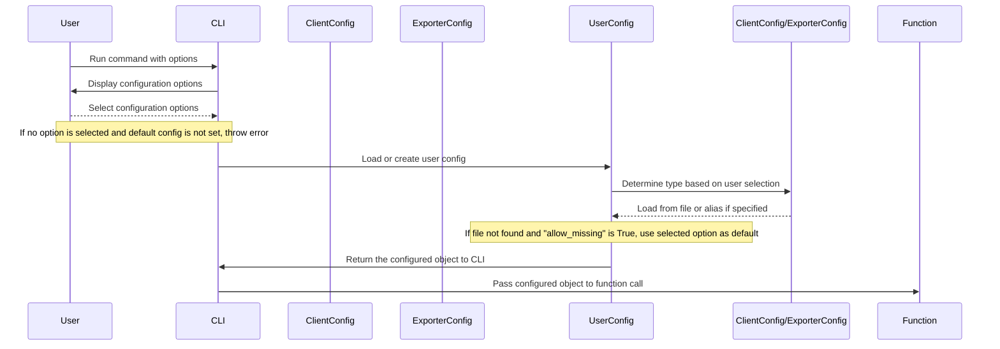

## Chapter 27: jumpstarter/packages/jumpstarter-cli-common/jumpstarter_cli_common/exceptions.py

 The `jumpstarter/packages/jumpstarter-cli-common/jumpstarter_cli_common/exceptions.py` file is a module within the Jumpstarter project that provides customized exception handling for command-line interface (CLI) functions and decorators. It primarily focuses on two aspects:

1. Exception handling in both blocking and asynchronous functions using decorators `handle_exceptions()` and `async_handle_exceptions()`. These decorators catch `JumpstarterException`, a custom exception defined within the project, as well as built-in Python exceptions, such as `click.ClickException`, and handle them by converting their messages to red for better visibility in the CLI environment.

2. Utility functions based on the PEP 785 Reference Implementation for working with groups of exceptions. Specifically, it contains two utility functions: `leaf_exceptions()` and `_combine_tracebacks()`. These functions help flatten exception groups and combine tracebacks for debugging purposes when dealing with groups of exceptions.

Within the Jumpstarter project, this module plays a crucial role in ensuring that exceptions are handled gracefully across various CLI commands, making it easier to identify and fix issues during development and runtime. By using this module, developers can create custom exception classes, handle exceptions in their functions or decorators, and utilize utility functions for debugging purposes when working with groups of exceptions.

Example use cases:

- A developer encounters an unexpected issue while writing a CLI command that throws a `JumpstarterException`. They can either catch the exception directly using `try`...`except` blocks or decorate the function with the provided `handle_exceptions()` or `async_handle_exceptions()` decorators to handle the exception more gracefully.

- A developer needs to debug a group of exceptions within their project. They can utilize the `leaf_exceptions()` and `_combine_tracebacks()` functions to flatten and combine tracebacks for better visibility during the debugging process.

 ```mermaid
   sequenceDiagram
      participant User as User
      participant CLI as CLI
      participant Function as Function
      participant ExceptionHandlerRed as ExceptionHandlerRed
      participant JumpstarterException as JumpstarterException
      participant ClickException as ClickException

      User->>CLI: Command Invoked
      CLI->>Function: Call Function
      Function->>+ExceptionHandlerRed: Raise JumpstarterException or ClickException
        Note over ExceptionHandlerRed, Function: If exception is JumpstarterException, wrap it in ClickExceptionRed
        Note over ExceptionHandlerRed, Function: If exception is ClickException, re-raise as is
      ExceptionHandlerRed->>CLI: Raised Exception
      CLI->>User: Display Error Message
   ```

   This sequence diagram illustrates how the main functions interact when an exception occurs within a function. The `User` initiates a command through the `CLI`, which in turn calls a specific function. If an exception is raised (either `JumpstarterException` or `ClickException`), it gets handled by the `ExceptionHandlerRed`. If the exception is a `JumpstarterException`, it will be wrapped with a `ClickExceptionRed` before being re-raised to the `CLI`. The `CLI` then displays the error message back to the user. If the exception was already a `ClickException`, it gets re-raised as is.

## Chapter 28: jumpstarter/packages/jumpstarter-cli-common/jumpstarter_cli_common/oidc.py

 The file `jumpstarter/packages/jumpstarter-cli-common/jumpstarter_cli_common/oidc.py` is a module that provides OIDC (OpenID Connect) functionality for the Jumpstarter CLI (Command Line Interface). This functionality includes client configuration, token handling, and various OIDC grant types (password, authorization code, etc.).

   The main class in this file is `Config`, which holds the OIDC issuer, client ID, and scope. It provides methods to retrieve the OpenID Connect configuration, create an OAuth2Session instance for the client, and handle different token exchange grant types.

   - `configuration()`: Retrieves the OpenID Connect configuration from the issuer's well-known endpoint.
   - `client(**kwargs)`: Creates an OAuth2Session instance with the specified client ID and scope.
   - `token_exchange_grant(self, token: str, **kwargs)`: Exchanges a given access token for a new access token using the token exchange grant type.
   - `password_grant(self, username: str, password: str)`: Performs a password grant to obtain an access token.
   - `authorization_code_grant()`: Initiates and handles an authorization code grant flow, including starting a local web server for the callback, creating an authorization URL, and exchanging the authorization code for an access token.

   The `opt_oidc(f)` decorator allows you to pass OIDC-related options when defining click commands, making it easier to handle authentication within the CLI. The provided functions `decode_jwt(token: str)` and `decode_jwt_issuer(token: str)` help with parsing and extracting information from JWT (JSON Web Token) tokens.

   This code is a part of the overall project, where it enables secure authentication for users when interacting with the CLI. The OIDC functionality allows you to authenticate using different grant types, making it more flexible and adaptable to various deployment scenarios. For example, you can use the password grant type for local development or an authorization code grant in a multi-tenant environment with multiple identities.

 ```mermaid
sequenceDiagram
    participant C as Client
    participant S as Server
    participant OCS as OpenID Connect Session
    participant TS as Token Storage
    participant ACS as Authorization Code Server

    C->>+C: opt_oidc(args)
    C-->>-C: f(args)

    Note over C: User provides credentials or token

    C->>S: Request configuration if not provided
    S-->>C: Configuration

    Note over C: User chooses authentication method (password, authorization code, etc.)

    C->>+S: Authenticate using chosen method
    C-->>-S: token or id_token

    Note over C, TS: If token, store it and return it to client. Otherwise proceed with token exchange.

    C->>TS: Store token
    TS-->>C: Stored token

    Note over C: If token, user can continue interaction. If not, continue with token exchange.

    C->>+TS: Retrieve stored token (if applicable)
    C-->>-TS: Return token if found

    C->>+S: Token exchange if required
    C-->>-S: New access_token

    Note over C, S: User can now interact with protected resources.

    C->>S: Call protected API (using access_token)
    S-->>C: Response from protected API
```

## Chapter 29: jumpstarter/packages/jumpstarter-cli-common/jumpstarter_cli_common/opt.py

 The file `jumpstarter/packages/jumpstarter-cli-common/jumpstarter_cli_common/opt.py` is a module that contains command line interface (CLI) options for the JumpStarter project's CLI tool. This module handles various parameters provided by users when running the CLI commands, including setting the log level, providing Kubernetes context and configuration, labels, output mode, and enabling insecure TLS.

   Important functions or classes in this file include:

   - `_opt_log_level_callback`: This function configures the log level based on the provided value by the user. The log level can be set to one of the following values: "DEBUG", "INFO", "WARNING", "ERROR", or "CRITICAL".

   - `opt_labels`: This function creates an option for users to provide labels that will be applied to resources. Labels are key-value pairs, and multiple labels can be provided.

   - `confirm_insecure_tls`: This function confirms if the insecure TLS config is enabled and the user wants to continue. It raises an exception (Abort) if the user does not want to proceed with the insecure TLS configuration.

   In terms of classes, there are two custom classes defined for `OutputMode` and `OutputType`. These classes define enumerated string literals representing different output modes: JSON, YAML, NAME, PATH.

   This code fits into the project by providing a way to accept various command line arguments and settings from users who run the JumpStarter CLI tool. This makes the tool more flexible and customizable according to user requirements.

   Example use cases of this file's functionality include:

   - Setting the log level to "DEBUG" for troubleshooting purposes.
   - Providing Kubernetes context and configuration file path when running CLI commands that interact with a Kubernetes cluster.
   - Labeling resources being created or modified by specifying labels as command line arguments.
   - Enabling insecure TLS configuration for testing purposes, and confirming that the user wants to continue with this setting.
   - Customizing the output mode of the CLI tool, such as printing only the resource name (short output) instead of detailed JSON or YAML format.

 ```mermaid
sequenceDiagram
    participant User as User
    participant Cli as CLI
    participant OptParser as Option Parser
    participant ConfigManager as Configuration Manager

    User->>Cli: Provide command line arguments
    Cli->>OptParser: Parse options and arguments
    OptParser->>User: Request confirmation (if necessary) for insecure TLS config
    User-->>OptParser: Confirm or abort based on response
    OptParser->>Cli: Return parsed options and arguments
    Cli->>ConfigManager: Initialize configuration with options and defaults
    ConfigManager->>Cli: Return configured object
    Cli->>User: Execute command using the configured object
    ```

## Chapter 30: jumpstarter/packages/jumpstarter-cli-common/jumpstarter_cli_common/signal.py

 The file `jumpstarter/packages/jumpstarter-cli-common/jumpstarter_cli_common/signal.py` is a module for handling asynchronous signal processing within the Jumpstarter command-line interface (CLI). This module, using the `anyio` library, allows the CLI to gracefully terminate when receiving certain signals such as SIGINT and SIGTERM.

   The most important function in this file is `signal_handler()`. This function is an asynchronous coroutine that listens for specific signals defined by constants `signal.SIGINT` and `signal.SIGTERM`. When one of these signals is received, it outputs a message to the user and cancels the current operation using the provided `CancelScope`.

   The purpose of this code is to ensure that the CLI behaves appropriately when it receives certain interrupt signals, like SIGINT (Ctrl+C) or SIGTERM (kill command). By doing so, the application will shut down cleanly and properly handle any resources or tasks that are currently running.

   In the context of the larger project, this module helps in making the CLI more user-friendly and robust by allowing it to respond gracefully to user interruptions. This is particularly important for long-running commands or background processes.

   Example use cases might involve using a command in the Jumpstarter CLI that takes several minutes to complete, and the user decides to cancel the operation before its completion. By integrating this signal handler, the CLI can terminate the running task gracefully without causing any issues or errors.

 ```mermaid
   sequenceDiagram
      Participant User as User
      Participant App as App
      Participant SignalHandler as SignalHandler

      User->>App: SIGINT/SIGTERM
      App->>SignalHandler: Receive signal
      SignalHandler->>App: Check signal type
      SignalHandler->>User: Print message and cancel operation (if applicable)
   ```

This mermaid diagram illustrates the interaction between the user, the app, and the `signal_handler` function. The user sends a SIGINT or SIGTERM signal to the app, which then forwards it to the `signal_handler`. The `signal_handler` checks the type of the received signal, prints an appropriate message, and if applicable, cancels the operation.

## Chapter 31: jumpstarter/packages/jumpstarter-cli-common/jumpstarter_cli_common/table.py

 In the `jumpstarter` project, the file `jumpstarter/packages/jumpstarter-cli-common/jumpstarter_cli_common/table.py` serves as a utility module for generating and printing pretty tables from provided data. The main purpose of this module is to enhance the readability and organization of data that is displayed in the Command Line Interface (CLI) components of the project.

   The central function in this module is `make_table(columns: list[str], values: list[dict])`. This function takes a list of column names as its first argument and a list of dictionaries representing rows for each column as its second argument. It then creates a Rich Table object with the specified columns and populates it with the provided data. The `Rich.Table` class is imported from the `rich` library, which provides an easy way to format and print tables in the console.

   The table can be customized by modifying the style of individual columns, padding around the edges, and other options. In this case, the table's box and header styles are set to None, and padding around the edge is disabled. If a column name is "UUID", the `no_wrap` option is enabled to ensure that the UUID value is not wrapped to the next line if it exceeds the width of the console.

   When the table is fully populated, it is printed using a `Rich.Console` object and saved as a string in a `StringIO` buffer for later use if needed. If you're unfamiliar with these libraries or classes, `StringIO` is an I/O stream buffer that can be used to save strings as if they were files, while `console` from the `rich` library provides console output formatting and styling capabilities.

   This code fits within the project by providing a consistent way to display data in the CLI components, ensuring that output is clean, easy-to-read, and well-organized. Example use cases for this code could include generating tables of project tasks, logs, or system information. For instance, in a task management application, you might call `make_table(columns=['Task ID', 'Description', 'Assigned To'], values=[{'id': '123', 'description': 'Fix bug', 'assigned to': 'John'}, {'id': '456', 'description': 'Add feature', 'assigned to': 'Jane'}])` to display the tasks assigned to users.

 ```mermaid
   sequenceDiagram
       participant User as U
       participant CLI as C
       participant CommonLib as CL

       U->>C: Run command (CLI)
       C->>CL: Import common library

      note over CL: Contains helper functions for table manipulation

      U->>CL: Provide command arguments (as Table data)
      CL->>CL: Process and format the data in the table

      note over CL: Returns the formatted table as a string

      C->>U: Display the final table on the console
   ```

## Chapter 32: jumpstarter/packages/jumpstarter-cli-common/jumpstarter_cli_common/table_test.py

 In the `jumpstarter/packages/jumpstarter-cli-common/jumpstarter_cli_common/table_test.py` file of the project, a custom table generation function called `make_table()` is defined and tested. This function takes two arguments: `COLUMNS`, a list of strings representing column headers, and `DATA`, a list or iterable of dictionaries where each dictionary maps column header strings to their corresponding cell values.

   The purpose of the `make_table()` function is to format the data in a tabular structure with properly aligned columns and row separators. This provides an easy-to-read output for displaying test results or other structured data.

   In this file, there is also a predefined expected table (EXPECTED_TABLE) used as a reference for testing the correctness of the `make_table()` function. The expected table contains a simple tabular structure with two columns and one row of data.

   This code fits into the larger project by providing a utility for generating clean and well-formatted tables, which can be used throughout the command-line interface (CLI) modules to present test results or other structured data in an easily digestible format.

   As an example use case, imagine that you have a testing function that generates a list of dictionaries containing test results for various tests within your CLI application. Instead of manually formatting the output, you can pass this list of dictionaries to the `make_table()` function and receive a properly formatted table as the output:

   ```python
   from jumpstarter_cli_common.table import make_table

   tests = [
       {"Test Name": "Test 1", "Result": "Pass"},
       {"Test Name": "Test 2", "Result": "Fail"}
   ]
   table = make_table(["Test Name", "Result"], tests)
   print(table)

   # Output:
   # Test Name        Result
   # Test 1          Pass
   # Test 2          Fail
   ```

 ```mermaid
   sequenceDiagram
      Participant Common as Common
      Common->>Common: Initiate (Define COLUMNS and DATA)
      Common->>Common: Call make_table(COLUMNS, DATA)
      Common-->>Common: Receive expected table from make_table function
      Common->>Common: Assert that received table matches EXPECTED_TABLE
   ```

## Chapter 33: jumpstarter/packages/jumpstarter-cli-common/jumpstarter_cli_common/time.py

 Chapter Title: Understanding the `time.py` Module in Jumpstarter CLI Common Library

   In the Jumpstarter project, the file `jumpstarter/packages/jumpstarter-cli-common/jumpstarter_cli_common/time.py` serves as a utility module for handling date and time operations, specifically calculating the elapsed time between two points in time. This functionality is vital in various aspects of the project, such as tracking the progress of tasks or operations.

   The primary function of this module is `time_since(t_str: str)`, which takes a string representation of a datetime (in the ISO 8601 format with a timezone of UTC) as an argument and returns a formatted string representing the elapsed time since that point in time. The function considers seconds, minutes, hours, days, months, and years for the elapsed time calculation.

   The function first parses the input string into a `datetime` object using the `datetime.strptime()` function. It then calculates the difference between this datetime object and the current datetime (obtained using `datetime.now(timezone.utc)`). Finally, it formats the elapsed time in a human-readable format based on the total number of seconds, minutes, hours, days, months, or years that have passed since the provided timestamp.

   For example, if you call `time_since("2021-10-01T00:00:01Z")`, assuming it's currently 2021-10-01T00:01:01Z, the function will return "1s". If you call the same function at 2021-10-02T00:01:01Z, it will return "24h1m0s".

   This code fits into the broader project by providing a centralized location for handling time calculations. Instead of having each module or package perform its own time-related operations, this utility module ensures consistency and simplifies maintenance across the project.

 Here is a simple Mermaid sequence diagram that visualizes the interaction between the `time_since` function and the creation of the datetime objects. Please note that Mermaid does not support complex logic like conditional statements, so I've simplified it to show the flow.

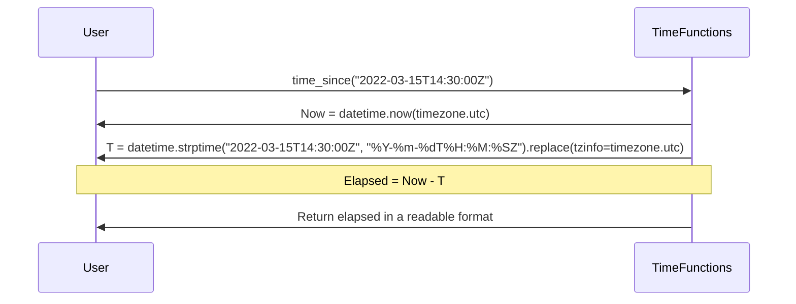

In this diagram, the `User` calls the `time_since` function with a timestamp as an argument. The function creates two datetime objects (Now and T) using the provided timestamp and the current time. It then calculates the elapsed time between these two dates and returns the result in a readable format to the user.

## Chapter 34: jumpstarter/packages/jumpstarter-cli-common/jumpstarter_cli_common/version.py

 In the Jumpstarter project, the file `jumpstarter/packages/jumpstarter-cli-common/jumpstarter_cli_common/version.py` serves as a utility module for handling version information related to the Jumpstarter Python client and CLI (Command Line Interface) binary.

   The main functions in this file include:

1. `get_client_version()`: Retrieves the version of the Jumpstarter Python client/exporter, using the built-in `importlib.metadata` module.
2. `get_cli_path()`: Returns the path of the current Jumpstarter CLI binary by navigating up two directories from the location of the currently executing file (`__file__`).
3. `version_msg()`: Generates a human-readable version message for Jumpstarter, incorporating the client version, its path, and the Python version running the CLI.
4. `JumpstarterVersion` is a class that represents Jumpstarter's version information as an object. It utilizes Pydantic to store the git_version (the version of the Jumpstarter package) and python_version (Python version the CLI is running on). The class also has methods for serializing its data in JSON and YAML formats using built-in Python libraries.
5. `version_obj()`: Creates an instance of the `JumpstarterVersion` class, using the returned values from the `get_client_version()` and `sys.version` functions.
6. The `version()` function (decorated with `@click.command()`) is a command-line utility that can be used to retrieve the current Jumpstarter version. It takes an optional argument for the output format, and it outputs the version information in JSON, YAML, or a human-readable format depending on the provided output format.

   In summary, this module provides the necessary infrastructure for handling versioning details of the Jumpstarter Python client/exporter and CLI. It also allows for users to easily obtain version information through the command line interface.

 ```mermaid
    sequenceDiagram
      participant User as User
      participant CLI as Jumpstarter CLI
      participant VersionFunc as GetVersionFunction
      participant VersionObj as VersionObject
      participant OutputFunc as OutputFunction

      User->>CLI: Run version command
      CLI-->VersionFunc: Call get_client_version()
      VersionFunc-->>CLI: Returns jumpstarter version (e.g., "1.0.0")
      CLI-->VersionObj: Create VersionObject instance with version data and python version
      CLI-->OutputFunc: Get output mode from command line arguments
      OutputFunc-->>CLI: OutputFunction returns the appropriate output method (JSON, YAML or console)
      CLI-->VersionObj: VersionObject calls dump_json() for JSON or dump_yaml() for YAML format
      VersionObj-->>CLI: Returns version data in desired format
      CLI-->User: Display the version information to the user
  ```

## Chapter 35: jumpstarter/packages/jumpstarter-cli-driver/jumpstarter_cli_driver/__init__.py

 In the project, the file `jumpstarter/packages/jumpstarter-cli-driver/jumpstarter_cli_driver/__init__.py` serves as the entry point for the command-line interface (CLI) tool specifically designed for managing drivers within the Jumpstarter ecosystem. This CLI tool is created using the Click library, a Python package for creating beautiful command line interfaces.

   The file imports necessary modules from other packages in the project: `jumpstarter_cli_common`, which provides common functionalities such as command grouping (AliasedGroup), option handling (opt_log_level), and version information (version).

   The main functionality of this file is encapsulated within the `driver()` function, which creates a Click-based command group named 'driver'. This group can contain multiple commands related to managing drivers. In this case, there are two defined commands: `list_drivers` for listing all available drivers and `version` for displaying the version of the Jumpstarter CLI tool itself.

   The command group is decorated with an AliasedGroup class from `jumpstarter_cli_common`, allowing users to use both 'driver' and its aliases (if any) interchangeably. Furthermore, the opt_log_level decorator is applied to allow users to set the logging level for the CLI tool.

   The last section, `if __name__ == "__main__": driver()`, indicates that this script should be run directly when called from the command line, and it executes the 'driver' command group.

   In a use case scenario, a user might call the `jumpstarter-cli-driver` command followed by appropriate subcommands like `list_drivers` or `version` to interact with the Jumpstarter driver CLI tool. For instance, if a user wants to view a list of available drivers, they would run:

   ```
   jumpstarter-cli-driver list_drivers
   ```

   Alternatively, if a user needs to know the version of the Jumpstarter CLI tool, they can simply execute:

   ```
   jumpstarter-cli-driver version
   ```

 ```mermaid
   sequenceDiagram
      participant User as User
      participant Cli as CLI
      participant CommonLib as Common Lib
      participant DriverLib as Driver Lib

      User->>Cli: Run command
      Cli->>CommonLib: Import common libraries
      CommonLib-->User: Initialize logger with given log level
      CommonLib-->>Cli: Return initialized logger
      Cli->>DriverLib: Get driver command group
      DriverLib-->Cli: Return driver group object
      User->>Cli: Choose a command (list_drivers or version)
      Cli->>DriverLib: Call chosen command function
      DriverLib-->>Cli: Execute command and return result
      User<--Cli: Display the result
   ```

This diagram shows a sequence of events when running a command from the Jumpstarter driver CLI tool. The user interacts with the CLI, which in turn uses common libraries to initialize the logger and handle the chosen command. The Driver Lib is responsible for providing the appropriate functions (in this case, `list_drivers` or `version`) to be executed by the CLI, and it returns the result back to the user via the CLI.

## Chapter 36: jumpstarter/packages/jumpstarter-cli-driver/jumpstarter_cli_driver/__main__.py

 Chapter Title: Understanding the Role of `jumpstarter/packages/jumpstarter-cli-driver/jumpstarter_cli_driver/__main__.py` in the Jumpstarter Project

In the Jumpstarter project, the file `jumpstarter/packages/jumpstarter-cli-driver/jumpstarter_cli_driver/__main__.py` serves as the entry point for executing the Jumpstarter Command Line Interface (CLI) when invoked with the command `python -m jumpstarter_cli_driver`.

The primary function of this script is to initialize and run the driver class, which is defined in the same directory. This driver acts as an interface between the user's commands and the underlying components of Jumpstarter.

Inside the script, you can find the following key elements:

- The `from . import driver` line imports the driver module from the current package (`jumpstarter_cli_driver`).
- The `if __name__ == "__main__":` block checks if this specific file is being run directly (i.e., not imported as a module). If so, it executes the code within this block.
- Inside the if block, the `driver(prog_name="jmp-driver")` line invokes the driver function with a custom name "jmp-driver". This prog_name argument helps to distinguish the CLI from other parts of the project when used in command-line utilities.

This code fits into the larger Jumpstarter project as part of its Command Line Interface layer, allowing users to interact with the system through a convenient and consistent command-line experience. By executing this script, users can utilize various features and functionalities provided by the Jumpstarter project.

Example use cases for running this script might include initializing a new project using a specific template, building or testing Jumpstarter components, or managing existing projects within the system. Users can customize their workflows by chaining together multiple commands in a single invocation, allowing them to quickly and efficiently accomplish complex tasks with minimal effort.

 ```mermaid
   sequenceDiagram
      Participant User as U
      Participant Jumpstarter CLI Driver as J
      U->>J: python -m jumpstarter_cli_driver
      J->>J: Import required modules and initialize
      J->>J: Initialize driver object with prog_name "jmp-driver"
      U->>J: Provide command line arguments
      J->>J: Parse command line arguments
      J->>J: Call appropriate function based on parsed arguments
      J-->>U: Execute task and display results (if any)
   ```

This diagram shows the interaction between a user and the Jumpstarter CLI Driver when running `python -m jumpstarter_cli_driver`. The driver imports necessary modules, initializes itself, parses command line arguments, calls an appropriate function based on the parsed arguments, and executes tasks while displaying results (if any).

## Chapter 37: jumpstarter/packages/jumpstarter-cli-driver/jumpstarter_cli_driver/driver.py

 The `jumpstarter/packages/jumpstarter-cli-driver/jumpstarter_cli_driver/driver.py` file is a crucial component of the Jumpstarter project, responsible for managing and listing available drivers within the system. This Python script is primarily focused on command-line interface (CLI) operation and driver management.

   The core functionality of this module revolves around the `@click.command("list")` decorator, which defines a CLI command called "list". When invoked, this command retrieves a list of all registered drivers using the `entry_points(group="jumpstarter.drivers")` function from the importlib.metadata module.

   The retrieved driver information is processed and formatted into an easy-to-read table using the `make_table()` function from the jumpstarter_cli_common.table module. If no drivers are found, a message indicating this fact is displayed using the click library's `click.echo()` function.

   This code fits within the project by providing a means for users to inspect and interact with registered drivers on the command line. It serves as the entry point for invoking driver operations and enables seamless integration of various drivers into the Jumpstarter ecosystem.

   Example use cases may include listing all available data connectors (drivers) in a Jumpstarter project, such as MySQL, PostgreSQL, and MongoDB, to determine which one is suitable for a specific task or workflow. In other scenarios, this command could be used to troubleshoot connectivity issues by ensuring that the desired driver is properly installed and configured within the project environment.

 In this example, I will create a simplified sequence diagram based on the given Python script, focusing on the `list_drivers` function and its dependencies. Please note that Mermaid does not directly support async/await functionality, so I'll represent them as steps.

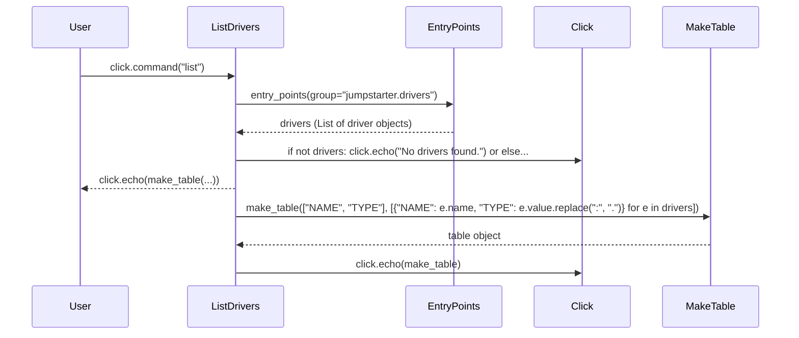
This diagram represents the flow of interactions between different components when executing the `list` command. It starts with a user invoking the command, which leads to the creation of the ListDrivers function. The ListDrivers function then uses the EntryPoints module to get a list of drivers, and based on that list, it either displays "No drivers found" or passes the table data to the MakeTable function to create a table object. Finally, the table object is displayed by the Click library.

## Chapter 38: jumpstarter/packages/jumpstarter-cli-driver/jumpstarter_cli_driver/driver_test.py

 In the project, the file `jumpstarter/packages/jumpstarter-cli-driver/jumpstarter_cli_driver/driver_test.py` serves as a test suite for the driver module within the JumpStarter Command Line Interface (CLI) package. The purpose of this file is to ensure the correct functionality and behavior of the driver, which acts as an interface between the CLI and other components of the system.

   This test suite contains several tests, but this specific example, `test_list_drivers()`, focuses on testing the 'list' command provided by the driver. The function uses the `CliRunner` class from the Click library to run the command and collect its output. The runner object is initialized, and the 'list' command is invoked along with an empty list of arguments.

   The test checks if the exit code of the executed command is 0, which indicates that the command ran successfully without any errors or exceptions. If the exit code does not match 0, it suggests that there might be an issue in the driver implementation, and further investigation would be required to resolve it.

   This test case fits into the larger project by ensuring the correctness of the driver's functionality. The `driver` module is responsible for handling user commands and interacting with other components as needed. By testing individual commands like 'list', we can ensure that the user experience remains consistent, and any potential issues are caught early during development.

   Example use cases for this test would include scenarios where users run the command-line interface with the 'list' command to view available drivers. If the driver is functioning correctly, the list of available drivers should be displayed without errors or exceptions. In case there are any issues, the test suite will alert developers to investigate and correct them before the CLI is deployed for end-users.

 ```mermaid
   sequenceDiagram
      Participant DriverCLI as DriverCLI
      Participant CommandLine as CommandLine

      CommandLine->>DriverCLI: driver list
      DriverCLI->>DriverCLI: list all available drivers (get_drivers())
      DriverCLI-->>CommandLine: List of available drivers (print())
   ```

This diagram represents the sequence of events when the `list` command is executed in the CLI. The CommandLine interacts with the DriverCLI, which then calls the `get_drivers()` function to get a list of all available drivers and prints it back to the CommandLine.

## Chapter 39: jumpstarter/packages/jumpstarter-cli/jumpstarter_cli/__init__.py

 The file `jumpstarter/packages/jumpstarter-cli/jumpstarter_cli/__init__.py` serves as the entry point for the command-line interface (CLI) of JumpStarter, a versatile blockchain development toolkit. This module is responsible for initializing and managing various functionalities provided by the CLI.

Upon execution, the script performs several tasks:

1. Importing necessary libraries, including `os` and the `truststore`.
2. Checking if the current operating system is macOS (as indicated by `os.uname().sysname`), or if the environment variable `JUMPSTARTER_FORCE_SYSTEM_CERTS` is set to "1". If either of these conditions is met, it calls the `truststore.inject_into_ssl()` function, which injects system certificates into SSL to prevent potential security issues (as outlined in this GitHub issue: https://github.com/jumpstarter-dev/jumpstarter/issues/362).

This code is crucial for the overall functioning of JumpStarter CLI, as it ensures that system certificates are properly managed when running on macOS or when forced by an environment variable. This not only improves security but also makes the tool more reliable in various use cases, such as interacting with blockchain networks and smart contracts.

Example use case: Suppose a developer is using JumpStarter CLI to deploy a smart contract on the Ethereum network from their macOS machine. Without this code, there might be certificate-related issues when making HTTPS requests, which could lead to connection errors or security vulnerabilities. By including this script at the beginning of the CLI's execution, JumpStarter ensures that system certificates are properly injected into SSL, thus enabling smooth and secure interactions with the Ethereum network.

 ```mermaid
   sequenceDiagram
      participant Jumpstarter as Jumpstarter
      participant TrustStore as TrustStore
      participant CommandLineArgs as CommandLineArgs

      Note over Jumpstarter: Initialization
      Jumpstarter->>+CommandLineArgs: Get command line arguments

      Note over Jumpstarter: Check for system certificates injection
      Jumpstarter->>TrustStore: truststore.uname().sysname
      if TrustStore-->>Jumpstarter: "Darwin" or os.environ.get("JUMPSTARTER_FORCE_SYSTEM_CERTS") == "1" then (Skip)
      else Jumpstarter->>TrustStore: truststore.inject_into_ssl() end

      Note over Jumpstarter: Import modules and set up logger
      Jumpstarter->>+truststore,+os: import
      Jumpstarter->>+logging: logging.basicConfig(level=os.environ.get("JUMPSTARTER_LOG_LEVEL", "INFO"))

      Note over Jumpstarter: Start the main loop (command processor)
      Jumpstarter->>Jumpstarter: start()
   ```

## Chapter 40: jumpstarter/packages/jumpstarter-cli/jumpstarter_cli/__main__.py

 **Chapter: Understanding the Core Module 'jumpstarter/packages/jumpstarter-cli/jumpstarter_cli/__main__.py**

The file `jumpstarter/packages/jumpstarter-cli/jumpstarter_cli/__main__.py` serves as the entry point for executing the Jumpstarter Command Line Interface (CLI) directly from the command line using the command `python -m jumpstarter_cli`. This file initiates and controls the execution of the Jumpstarter CLI.

The file imports a single module named `jmp`, which is responsible for handling the primary logic of the Jumpstarter CLI. The import statement looks like this:

```python
from .jmp import jmp
```

The most critical function in this file, `if __name__ == "__main__":`, checks if the current module being run is the main module (i.e., when the script is called directly). When the condition is true, it calls the `jmp()` function with the specified argument `prog_name="jmp"`. This action initializes and starts the Jumpstarter CLI.

When you execute the command `python -m jumpstart_cli`, the main module is being invoked, and the script flows through this entry point, leading to the initialization of the Jumpstarter CLI via the `jmp()` function.

Example use cases:
- Running specific Jumpstarter commands or tasks using the Jumpstarter CLI from the command line:

```sh
$ python -m jumpstart_cli <command> [options]
```

For instance, running the `init` command to create a new Jumpstarter project:

```sh
$ python -m jumpstart_cli init my-project
```

In summary, this file serves as the gateway for using the Jumpstarter CLI directly from the command line. It orchestrates the execution of the Jumpstarter CLI by initializing it through the `jmp()` function when run as the main module.

 ```mermaid
   sequenceDiagram
       participant User as User
       participant JumpstarterCli as Jumpstarter CLI
       participant JMP as JMP

       User->>JumpstarterCli: python -m jumpstarter_cli
       JumpstarterCli->>JMP: Import .jmp module
       JMP->>JumpstarterCli: Initialize jmp function with prog_name="jmp"
       User->>JumpstarterCli: Provide command or arguments
       JumpstarterCli->>JMP: Forward provided command/arguments to jmp function
       JMP-->>JumpstarterCli: Execute the command and return output
       JumpstarterCli-->>User: Display the output
   ```

## Chapter 41: jumpstarter/packages/jumpstarter-cli/jumpstarter_cli/cli_test.py

 In the project, the file `jumpstarter/packages/jumpstarter-cli/jumpstarter_cli/cli_test.py` serves as a test suite for the command-line interface (CLI) provided by the Jumpstarter tool. The purpose of this test suite is to ensure that all the functionalities of the CLI are working correctly, and no unexpected issues or regressions occur during development or updates.

   The file uses the Click library's testing utilities, specifically the `CliRunner` class for executing CLI commands and checking their output. This is achieved through the `test_cli()` function, which initializes a runner instance and tests each available subcommand in the Jumpstarter CLI by invoking them without any arguments.

   The test suite checks for the presence of the specified subcommands in the output generated by running the CLI command. This ensures that the tested subcommands are recognized and listed when executing the main `jmp` command without any arguments. The list of subcommands used here includes:

   - `config`
   - `create`
   - `delete`
   - `driver`
   - `get`
   - `login`
   - `run`
   - `shell`
   - `update`
   - `version`

   These tests fit into the overall project by ensuring that the command-line interface, one of the main user interfaces for interacting with Jumpstarter, functions as intended.

   Example use cases would involve executing the test suite and verifying that it passes without any failures or errors. If a subcommand is removed or its behavior changes during development, the test suite should fail, alerting developers to potential issues requiring attention.

 ```mermaid
   sequenceDiagram
       participant User as User
       participant CliRunner as CliRunner
       participant Jmp as Jmp

       User->>CliRunner: Runs jumpstarter_cli with no arguments
       CliRunner->>Jmp: Invokes jmp function
       Note over Jmp: Lists available subcommands
       Jmp-->>User: Displays list of subcommands

       User->>CliRunner: Runs jumpstarter_cli with a specific subcommand (e.g., "config")
       CliRunner->>Jmp: Invokes jmp function with the subcommand argument
       Jmp-->>User: Executes the specified subcommand
   ```

## Chapter 42: jumpstarter/packages/jumpstarter-cli/jumpstarter_cli/common.py

 The file `jumpstarter/packages/jumpstarter-cli/jumpstarter_cli/common.py` is a module in the Jumpstarter project's command-line interface (CLI). This module provides utility functions, classes, and command line option definitions that are shared across multiple command handlers within the CLI.

   Here are descriptions of important elements in this file:

   - `opt_selector` is a click option definition that allows users to specify a label query as an argument for filtering objects based on their labels. The query supports '=', '==', and '!=' operators.

   - The `DurationParamType` class extends the click ParamType abstract base class. This custom parameter type is used to validate command line arguments that represent durations. It accepts either a `timedelta` object or a string that can be converted into a `timedelta`.

   - The `DURATION` variable is an instance of the `DurationParamType`. This is used for convenience when defining click options requiring duration input.

   - `opt_duration_partial` is a partial function that allows for easier definition of command line options expecting duration input.

This code plays a crucial role in the project by standardizing the handling and validation of common command line arguments, such as labels and durations, across various command handlers in the CLI. For example, when users specify a label query using `-l` or `--selector`, the options are filtered appropriately based on their constraints. Similarly, duration input is validated to ensure it adheres to specified formats, making the user experience consistent and seamless across commands.

 ```mermaid
   sequenceDiagram
      participant User as User
      participant CLI as CLI
      participant Common as Common

      User->>CLI: Run command with options (opt_selector, opt_duration_partial)
      CLI->>Common: Parse options (opt_selector, opt_duration_partial)
      Common->>Common: Initialize DurationParamType and partial(click.option)
      Common->>CLI: Return parsed options

      User->>Common: Call function with parsed options
      Common->>Common: Execute function based on selector and duration
      Note over Common: Function may perform various tasks such as filtering, sorting, or querying data

      Common-->>User: Return result
   ```

## Chapter 43: jumpstarter/packages/jumpstarter-cli/jumpstarter_cli/config.py

 The file `jumpstarter/packages/jumpstarter-cli/jumpstarter_cli/config.py` is a crucial component of the Jumpstarter project, responsible for managing configuration-related functionalities through command-line interfaces (CLIs).

The purpose of this file is to define and orchestrate two main commands: `config_client` and `config_exporter`. These commands facilitate interactions with the application's configuration data.

1. **config_client**: This function provides an interface for users to view, create, update, and delete various configurations stored within the system. It enables users to manage their configurations efficiently and intuitively from the command line.

2. **config_exporter**: This function allows users to export their current configuration data in a structured format, usually as JSON or YAML files. This is particularly useful for backups, sharing configurations with others, or integrating with other tools that may require specific configuration data formats.

The file `config.py` is the entry point for accessing these commands when running the Jumpstarter CLI. By importing this module in the project's main command-line script (e.g., `jumpstarter_cli.py`) and instantiating it with `click.group()`, users can access the various configuration management functionalities via the command line:

```bash
$ jumpstarter config list
$ jumpstarter config create my-new-config
$ jumpstarter config update my-new-config --key my_value
$ jumpstarter config delete my-new-config
$ jumpstarter config export my-new-config > my_config.json
```

In summary, the `jumpstarter/packages/jumpstarter-cli/jumpstarter_cli/config.py` file plays a vital role in enabling users to effectively manage their configurations within the Jumpstarter project using command-line tools.

 ```mermaid
   sequenceDiagram
      participant User as User
      participant CLI as CLI
      participant ConfigClient as ConfigClient
      participant ConfigExporter as ConfigExporter

      User->>CLI: run command (e.g., jumpstarter config)
      CLI->>ConfigClient: GetConfig()
      ConfigClient-->ConfigClient: Fetch config data from remote server
      ConfigClient->>CLI: Return fetched config data
      CLI->>ConfigExporter: ExportConfig(config_data)
      CLI->>ConfigExporter: ExportConfig(file_path)
      ConfigExporter-->ConfigExporter: Prepare config file for export
      ConfigExporter->>CLI: Return prepared config data and file path
      CLI->>User: Display config data or save to specified file
   ```

## Chapter 44: jumpstarter/packages/jumpstarter-cli/jumpstarter_cli/config_client.py

 The file `jumpstarter/packages/jumpstarter-cli/jumpstarter_cli/config_client.py` is a Python module that provides commands for managing the configuration files of the Jumpstarter client. It forms part of the command-line interface (CLI) of the Jumpstarter project, allowing users to create, delete, list, and switch between client configurations.

   The module defines several important functions:

1. `create_client_config`: Creates a new client configuration file with the provided details such as alias, namespace, name, endpoint, token, allowed driver packages, and more. It also sets the newly created configuration as the default if no other configurations exist or it's the only one available.

2. `delete_client_config`: Deletes an existing client configuration by its name. Before deletion, it sets the next available client configuration as the current one if there are multiple config files.

3. `list_client_configs`: Lists all available client configurations in either JSON, YAML, name, or table format based on user input. It also allows listing even when no user configuration is defined.

4. `use_client_config`: Sets a specified client configuration as the current one to use for further interactions with the Jumpstarter service.

   These functions are grouped under the `@click.group("client")` decorator, which defines a command group called "client". The individual commands (create, delete, list, and use) can be executed by using the command-line interface of the project with appropriate arguments.

   Example use cases:

   - Create a new client configuration using the following command: `jumpstarter client create --alias my_client --namespace jumpstarter_ns --name my_service --endpoint https://my_endpoint.com --token <auth_token>`
   - List all available client configurations using the command: `jumpstarter client list`.
   - Delete a client configuration using the command: `jumpstarter client delete --name my_client`.
   - Set the current client configuration to use for further interactions with the Jumpstarter service: `jumpstarter client use --name my_client`.

 ```mermaid
    sequenceDiagram
        participant User as User
        participant CLI as CLI
        participant Config as Config
        participant ClientConfigV1Alpha1 as ClientConfig
        participant UserConfigV1Alpha1 as UserConfig

        User->>CLI: Run command (e.g., "jumpstarter client create")
        CLI->>UserConfig: Load user config or create new if none exists
        UserConfig-->>User: Get current client config
        UserConfig->>ClientConfig: Check if client with name exists
        ClientConfig-->>UserConfig: Reply yes/no
        User->>CLI: If client does not exist, ask for parameters
        CLI->>Config: Create new ClientConfigV1Alpha1 object
        Config->>UserConfig: Set current client to the newly created one if no existing one
        UserConfig-->>CLI: Reply with success or error message
        CLI->>Config: Save the new ClientConfigV1Alpha1 object
        Config->>UserConfig: Save user config
        CLI->>User: Print success message and output path or error message
    ```

   This sequence diagram illustrates the interaction between the User, CLI (Command Line Interface), Config, ClientConfigV1Alpha1, and UserConfigV1Alpha1 objects in the `jumpstarter_cli` application. It visualizes the process of creating a new client configuration.

## Chapter 45: jumpstarter/packages/jumpstarter-cli/jumpstarter_cli/config_exporter.py

 The file `jumpstarter/packages/jumpstarter-cli/jumpstarter_cli/config_exporter.py` is a component of the Jumpstarter project that focuses on managing configuration files for data exporters used by the Jumpstarter platform. The code provides command-line interface (CLI) commands to create, delete, edit, and list exporter configurations in a convenient and flexible manner.

   Below is a description of important functions and classes:

1. `ExporterConfigV1Alpha1` class: Represents the structure of an individual exporter configuration file. It contains attributes such as alias, metadata (namespace and name), endpoint, and token.

2. `ObjectMeta` class: A subclass that holds information about the resource's namespace and name in Kubernetes-style naming conventions.

3. The main functions (commands) are defined under the `config_exporter` group:
   - `create_exporter_config`: Creates a new exporter configuration file with given parameters, checking if an existing configuration file for the same alias already exists before creating it.
   - `delete_exporter_config`: Removes an existing exporter configuration file based on its alias.
   - `edit_exporter_config`: Opens the exporter configuration file associated with a given alias in a default text editor for editing.
   - `list_exporter_configs`: Displays all existing exporter configuration files in various formats, including JSON, YAML, or as simple text (either listing the aliases or providing detailed information).

4. The `arg_alias` defines an argument for the CLI commands that accepts an alias for the specific exporter configuration to be manipulated.

5. The `OutputMode` and `OutputType` are used to define different formats for displaying output, such as JSON, YAML, or text.

6. The `PathOutputType` is a specific type of OutputType that allows specifying the desired output as the file path only.

   This code fits into the Jumpstarter project by providing a way to manage configuration files for data exporters efficiently from the command line, making it simpler for developers to manage their configurations while working with Jumpstarter.

   Example use cases include creating new exporter configurations when introducing new data sources, editing existing configurations as necessary, and deleting configurations that are no longer in use or have become obsolete. The flexibility of the CLI commands allows users to easily customize their workflows based on their specific needs and preferences.

 ```mermaid
    sequenceDiagram
        participant User as User
        participant CLI as CLI
        participant ConfigExporter as ConfigExporter
        User->>CLI: Runs command (exporter create/delete/edit/list)
        CLI-->>ConfigExporter: Gets ConfigExporter object (create/load/delete)
        ConfigExporter-->>User: Saves or deletes config file, returns path if needed
        CLI-->>User: Displays edited config file or lists configs as required
   ```

## Chapter 46: jumpstarter/packages/jumpstarter-cli/jumpstarter_cli/create.py

 In this chapter, we will discuss the purpose and functionality of the file `jumpstarter/packages/jumpstarter-cli/jumpstarter_cli/create.py`. This file is a part of the JumpStarter Command Line Interface (CLI) and contains several important functions related to creating resources, primarily leases in this case.

   The `create.py` file defines a command group named `create` which serves as a container for all creation-related commands. One such command is `lease`, responsible for requesting an exporter lease from the JumpStarter controller.

   The `create_lease()` function, nested within the `create_lease` command, is responsible for creating a new lease based on provided options like selector and duration. It creates a lease object using the configuration instance's `create_lease()` method.

   The command also accepts various output modes (JSON, YAML, NAME, or table format) to customize how the lease information is displayed. Based on the specified output mode, the command uses either click.echo for simple text formats or makes use of the make_table function from `jumpstarter_cli_common.table` module to present data in a tabular format.

   The provided example demonstrates how to request an exporter lease and use its ID for further operations like connecting to the remote exporter, performing other commands, and finally deleting the lease when no longer required.

   In summary, `create.py` file serves as the entry point for creating leases using JumpStarter CLI. This functionality is essential for managing resources in multi-step workflows or for automating operations in continuous integration environments.

 ```mermaid
   sequenceDiagram
       participant User as User
       participant CLI as CLI
       participant Config as Config
       participant JumpstarterController as JumpstarterController

       User->>CLI: jmp create lease
       CLI-->>User: Enter selector, duration and output (optional)
       CLI->>Config: Get config and options
       Config->>JumpstarterController: Request a lease with provided parameters
       JumpstarterController->>Config: Return the created lease object
       Config-->CLI: Pass the lease object to the CLI
       CLI-->>User: Display output based on user's preference (JSON, YAML or table)
   ```

This mermaid sequence diagram visualizes the interactions between the User, CLI, Config and JumpstarterController objects in the `create_lease` command of the `jumpstarter-cli`. The User initializes the process by invoking the `jmp create lease` command, followed by entering relevant options such as selector, duration and output (optional). The CLI then interacts with the Config to obtain these options and passes them to the JumpstarterController to request a new lease. Upon receiving the created lease object from the JumpstarterController, the Config sends it back to the CLI, which then displays the output according to the User's preference.

## Chapter 47: jumpstarter/packages/jumpstarter-cli/jumpstarter_cli/delete.py

 This chapter will explain the purpose and functionality of the file `jumpstarter/packages/jumpstarter-cli/jumpstarter_cli/delete.py` in a technical book based on the JumpStarter project.

   **Overview**

   The primary function of this Python script is to provide command-line interface (CLI) for deleting resources, specifically leases, within the JumpStarter ecosystem. It's part of the `jumpstarter-cli` package and is used to manage resources through the CLI.

   **Important Functions**

   - The main function `delete()` defines a group of commands for deleting resources. This function does not execute any action but serves as a container for other delete commands.

   - The function `delete_leases(config, name: str, selector: str | None, all: bool, output: OutputType)` is the core functionality of the file. It takes in configuration data (`config`) and various options to filter leases and perform deletion operations.

   **Where this code fits in the project**

   The `delete_leases()` function is part of a larger package that offers CLI utilities for managing JumpStarter resources. In this case, it handles lease resource deletions. Users can interact with the system by invoking commands from the command line.

   **Example use cases**

   To delete an existing lease named "my_lease", run the following command:

      jumpstarter leases delete my_lease

   If you want to delete all leases associated with a specific client, first find the client's name using `jumpstarter leases list`, then execute:

      jumpstarter leases delete --all [client_name]

   Users can also filter leases by selector and specify the desired output format (e.g., only printing lease names or a detailed message):

      jumpstarter leases delete --selector "environment=prod" --output name

   The file `jumpstarter/packages/jumpstarter-cli/jumpstarter_cli/delete.py` plays an essential role in facilitating efficient and flexible resource management within the JumpStarter project, making it easier for developers to work with the system and manage their resources effectively.

 ```mermaid
    sequenceDiagram
        participant User as User
        participant CLI as CLI
        participant Config as Config
        participant Leases as Leases

        User->>CLI: run delete leases command
        CLI-->Config: get configuration (config)
        CLI->>User: ask for lease name or selector (name, all)
        CLI-->>CLI: receive user input
        CLI->>Config: filter leases using user input (name, selector, all)
        Config-->>Leases: get list of leases
        Leases-->>Config: return filtered list of leases
        Config-->CLI: pass the filtered list to CLI
        CLI->>User: display available leases if any
        User->>CLI: select lease(s) for deletion or choose "all"
        CLI-->>CLI: receive user selection
        CLI->>Config: delete selected lease(s)
        Config-->>Leases: delete leases from the database
        Leases-->>CLI: confirm lease deletion
        CLI->>User: display confirmation message or list of deleted leases (output)
    ```

## Chapter 48: jumpstarter/packages/jumpstarter-cli/jumpstarter_cli/get.py

 In the `jumpstarter/packages/jumpstarter-cli/jumpstarter_cli/get.py` file, we have defined a set of commands for retrieving information about various resources within the Jumpstarter project. The purpose of this file is to provide an interface for users to view one or many exporters and leases, each of which serves specific roles in the context of Jumpstarter.

   The `get()` function acts as a group containing multiple subcommands, specifically `get_exporters()` and `get_leases()`. Each subcommand is responsible for displaying a different type of resource in various output formats based on user preferences. These output formats are determined by the `output` parameter passed to each function, which can take values from the `OutputMode` and `OutputType` enumerations defined in other modules.

   The `get_exporters()` function retrieves a list of exporters that match a given filter (if provided) and displays them using the selected output format. Similarly, the `get_leases()` function retrieves a list of leases and displays them accordingly. Both functions utilize the `config`, `opt_selector`, and `handle_exceptions` objects to access configuration data, parse command-line arguments, and manage exceptions respectively.

   In terms of where this code fits in the project, these commands are part of the Jumpstarter CLI (Command Line Interface) package, which is responsible for providing an easy-to-use interface for interacting with various components of the Jumpstarter system. This includes managing resources like exporters and leases, as well as other functionalities like deployments and services.

   Example use cases could include displaying a list of all available exporters in JSON format or showing information about specific leases in YAML format for further processing by other tools:

   ```sh
   jumpstarter get exporters --output json
   jumpstarter get leases my-lease --output yaml
   ```

 ```mermaid
   sequenceDiagram
        participant User as User
        participant Config as Config
        participant Exporter as Exporter
        participant Lease as Lease

        User->>Config: get_exporters("selector")
        Config-->Exporter: list_exporters(filter="selector")
        Exporter-->>User: exporter details (JSON, YAML, NAME)

        User->>Config: get_leases("selector")
        Config-->Lease: list_leases(filter="selector")
        Lease-->>User: lease details (JSON, YAML, NAME)
   ```

This diagram illustrates how the key functions interact in the `get.py` script. The user interacts with the script by invoking commands like `get exporters` or `get leases`, passing a selector if necessary. These commands are handled by the `get_exporters()` and `get_leases()` functions, respectively. Each of these functions retrieves relevant data from the Config object, which manages interactions with the underlying configuration data. The Exporter and Lease objects then provide the detailed information requested by the user in the desired format (JSON, YAML, or NAME).

## Chapter 49: jumpstarter/packages/jumpstarter-cli/jumpstarter_cli/j.py

 In the `jumpstarter/packages/jumpstarter-cli/jumpstarter_cli/j.py` file, we have a Python script that contains the implementation of a command-line interface (CLI) for the Jumpstarter project. This CLI provides an entry point to interact with various functionalities offered by Jumpstarter.

   The main function here is `async def j_async()`, which defines the asynchronous execution of the CLI. It utilizes the `anyio` library for managing asynchronous tasks and the `click` library for parsing command-line arguments and invoking the appropriate functionality.

   To achieve this, the function defines a coroutine named `cli()`, which performs the core logic of handling the user's input (command and arguments) and invoking the corresponding action within Jumpstarter. This coroutine is executed using a `BlockingPortal` to ensure that all asynchronous tasks are safely executed in the context of the current thread.

   The CLI also incorporates error handling, thanks to the use of the `async_handle_exceptions` and `leaf_exceptions` functions from the `jumpstarter-cli-common` module. These helpers ensure that exceptions are caught, propagated, and displayed in a user-friendly manner. Additionally, signals are handled using the `signal_handler` function to support graceful shutdown upon receiving specific signals.

   To execute this CLI, you can simply call the `j()` function at the bottom of the script, which wraps the execution of `j_async()` within an event loop provided by the `anyio` library.

   In terms of project integration, the implementation in `j.py` forms a crucial part of the CLI layer for Jumpstarter, making it accessible and interactive for users while leveraging its underlying capabilities to manage complex data processing tasks efficiently.

   Example use cases for this script could be running various analysis or transformation jobs on datasets, configuring model architectures, or launching specific workflows based on user input, among others.

 ```mermaid
   sequenceDiagram
      Participant User
      Participant Cli
      Participant SignalHandler
      Participant TaskGroup
      Participant EnvAsync
      Participant LogStreamAsync
      Participant ClientCli

      User->>Cli: Run command
      Cli->>TaskGroup: Create task group
      TaskGroup->>SignalHandler: Start signal handler
      SignalHandler->>TaskGroup: Listen for signals
      Cli->>EnvAsync: Create async environment
      EnvAsync->>LogStreamAsync: Create log stream
      LogStreamAsync->>ClientCli: Run cli with log stream
      Note over ClientCli, TaskGroup: Parallel execution starts
      ClientCli->>Cli: Execute command in non-standalone mode
      TaskGroup->>EnvAsync: Execution context
      EnvAsync->>ClientCli: Provide environment variables
      Note over TaskGroup, Cli: Task group cancels on error or signal
      Clipnote over Cli: catches exceptions and handles them appropriately
      Cli-->>User: Output result or error message
   ```

## Chapter 50: jumpstarter/packages/jumpstarter-cli/jumpstarter_cli/jmp.py

 The `jumpstarter/packages/jumpstarter-cli/jumpstarter_cli/jmp.py` file is the main entry point for the Jumpstarter Command Line Interface (CLI) in your project. This module defines a collection of command-line commands that users can execute to interact with the Jumpstarter system.

   The primary function of this file is to create an instance of a Click Group, named `jmp`, which serves as a container for all the available commands within the CLI. Each command corresponds to a separate Python module within the same directory and represents a specific action that can be performed by users. For example, `create`, `delete`, `update`, `get`, `shell`, `run`, `login`, `config` are individual commands that perform actions such as creating, deleting, updating, or getting resources, logging in, accessing the shell, running tasks, and configuring the system respectively.

   The `jmp` group object is also decorated with several utility functions from other modules like `opt_log_level`, which allows users to set log levels for their commands, `AliasedGroup`, which enables aliases for each command, making them easier to remember, and `version`, which provides the version information of the CLI.

   In addition, the file also imports the `driver` module, which handles actual communication with Jumpstarter servers and backends, and `admin` module, which provides administration-related commands.

   To use this CLI, users would run the script from the command line, providing various arguments to execute specific commands. For example:
   ```
   jmp create my_resource --property1 value1 --property2 value2
   ```
   This command creates a new resource with properties `property1` and `property2`. Users can explore other available commands and their usage through the help option, such as `jmp --help` or `jmp [command] --help`.

   In summary, this file organizes and orchestrates all the individual command-line commands of the Jumpstarter CLI, providing a clear entry point for users to interact with the system.

 ```mermaid
   sequenceDiagram
      participant User as User
      participant CLI as CLI
      participant Admin as Admin
      participant Driver as Driver
      participant Common as Common

      User->>CLI: Run command (jmp)
      CLI->>Common: Get log level
      CLI->>CLI: Initialize AliasedGroup
      CLI->>Common: Add commands (create, delete, update, get, shell, run, login, config, driver, admin, version)
      CLI->>User: Display available commands

      User->>CLI: Select command (e.g., create)
      CLI->>SelectedCommand: Execute command logic
      SelectedCommand--|>CLI: Result/Output

      Note over CLI, Driver: If command requires driver interaction
        CLI->>Driver: Interact with Driver
        Driver-->>CLI: Response from Driver
      end

      Note over CLI, Admin: If command requires admin access
        CLI->>Admin: Authenticate (if not already authenticated)
        Admin-->>CLI: Authentication status
        CLI->>Admin: Perform administrative action (if required by the command)
        Admin-->>CLI: Response from Admin
      end
   ```

This diagram illustrates how the main functions of the Jumpstarter CLI interact, including user input, common functionality, driver interaction, and admin access.

## Chapter 51: jumpstarter/packages/jumpstarter-cli/jumpstarter_cli/login.py

 The file `jumpstarter/packages/jumpstarter-cli/jumpstarter_cli/login.py` is a command line interface (CLI) function for logging into a Jumpstarter instance. This Python script is part of the larger project, which seems to be a multi-component system utilizing microservices and CLI tools for managing resources in an infrastructure.

   The `login` function provides a way to interact with the Jumpstarter service using various authentication methods such as token, username/password, or OIDC (OpenID Connect). This function accepts input parameters to specify the service endpoint, namespace, name, and various authentication-related options like client ID, connector ID, and whether to allow unsafe driver imports.

   Some of the key functions in this script include:

   - `opt_oidc`: This decorator handles OIDC-based authentication for the login process.
   - `decode_jwt_issuer`: This function decodes the issuer (iss) claim from a JSON Web Token (JWT).
   - `token_exchange_grant`, `password_grant`, and `authorization_code_grant` are methods for exchanging tokens or granting access based on different authentication types.
   - The various config saving functions like `ClientConfigV1Alpha1.save()` and `ExporterConfigV1Alpha1.save()` save the configured Jumpstarter instance to a persistent storage (file or database).

   Example use cases could be:

   - To authenticate a client package for interacting with the Jumpstarter service, run `jumpstarter login --endpoint <service_endpoint> --namespace <namespace> --name <package_name> --allow <allowed_driver_packages>`.
   - To configure an exporter (data source), run `jumpstarter login --endpoint <service_endpoint> --namespace <namespace> --name <exporter_name>`.

 ```mermaid
    sequenceDiagram
        participant User as User
        participant Login as Login
        participant Config as Config
        participant OIDC as OIDC
        participant TokenExchange as TokenExchange
        participant PasswordGrant as PasswordGrant
        participant AuthorizationCodeGrant as AuthorizationCodeGrant

        User->>Login: Run login command with options
        Login->>Config: Get current configuration
        Config-->>Login: Return current configuration
        Config->>Login: Check if endpoint, namespace and name are provided
        Config->>User (if non-interactive): Prompt for missing options
        User-->>Config: Provide required options
        Config->>Login: Check if client or exporter is specified
        Config->>User (if non-interactive): Prompt for missing information
        User-->>Config: Provide required information
        Config->>OIDC: Initialize OIDC config with issuer, client_id and connector_id
        Config->>Login: Check if token is provided
        Config->>User (if not provided): Prompt for username and password or token
        User-->>Config: Provide credentials or token
        Config->>OIDC: Perform token exchange with TokenExchange, PasswordGrant or AuthorizationCodeGrant based on the provided credentials/token
        TokenExchange|>>OIDC: Return access_token and refresh_token if successful
        PasswordGrant|>>OIDC: Return access_token and refresh_token if successful
        AuthorizationCodeGrant|>>OIDC: Redirect to authorization server for code, then exchange it for access_token and refresh_token if successful
        OIDC-->>Config: Set the access_token in Config object
        Config->>Login: Save the updated configuration
    ```

## Chapter 52: jumpstarter/packages/jumpstarter-cli/jumpstarter_cli/run.py

 In the `jumpstarter` project, the file `jumpstarter/packages/jumpstarter-cli/jumpstarter_cli/run.py` serves as a command-line interface (CLI) for running an exporter locally. The main function here is the `@click.command("run")` decorator that defines the command structure and behavior for the 'run' command.

   Important functions or classes in this file include:

   1. **`_serve_with_exc_handling(exporter)`**: This asynchronous function tries to serve an exporter by calling `await exporter.serve()`. If any exception occurs during the serving, it catches and handles them using the `leaf_exceptions()` function from `jumpstarter_cli_common.exceptions`. The function returns 0 if the serving was successful, otherwise it returns 1.

   2. **`handle_exceptions`**: This decorator is used to wrap functions that might raise exceptions and ensure they are handled appropriately. It catches all exceptions and converts them into user-friendly error messages using the `click.echo()` function.

   3. **`opt_config(client=False)`**: This function is a decorator that adds command line options for configuration files. In this case, it allows the 'run' command to accept a configuration file without specifying a client (as opposed to the 'client' command).

   The `run.py` script fits into the project as part of the CLI tools provided by the `jumpstarter-cli` package. It enables users to run an exporter locally, which is a crucial operation in data generation or processing pipelines defined using the `jumpstarter` project.

   Example use cases might include:
   - To start a local data generator that produces synthetic data as per a predefined configuration.
   - To test and debug an existing exporter locally before deploying it to a larger production environment.
   - To quickly spin up a small-scale instance of a data processing pipeline for testing purposes.

 ```mermaid
   sequenceDiagram
       participant User as User
       participant Cli as CLI
       participant Config as Config
       participant Exporter as Exporter

       User->>Cli: run command
       Cli-->Cli: Load config using opt_config(client=False)
       Cli-->>Config: Receive configuration object
       Cli->>Exporter: Serve with exception handling (_serve_with_exc_handling(exporter))
       Exporter-->>Exporter: Perform serving actions
       Exporter->>Exporter: Encounter Exception
       Exporter-->Cli: Raise Exception
       Cli-->User: Show error message
       Cli-->>Exporter: Continue execution with result 1
   ```

## Chapter 53: jumpstarter/packages/jumpstarter-cli/jumpstarter_cli/shell.py

 The file `jumpstarter/packages/jumpstarter-cli/jumpstarter_cli/shell.py` serves as the entry point for spawning a shell or executing custom commands on either local or remote jumpstart exporters. It is part of the JumpStarter Command Line Interface (CLI) and acts as a connector between the user's command line and the underlying jumpstart architecture.

   This module defines the `shell` function, which accepts various arguments to configure the interaction with the exporter. The main purpose of this function is to create a connection to an exporter based on the given configuration and execute the specified command or spawn a shell session if no command is provided.

   Key functions used in the code are:

   1. `opt_config()` - Parses command-line options related to the configuration of jumpstart.
   2. `opt_selector` - Defines an option for selecting which exporter to target when multiple are available.
   3. `opt_duration_partial(default=timedelta(minutes=30))` - Defines an option that accepts a duration for leases in the format of Hours:Minutes:Seconds, with a default value of 30 minutes.
   4. `handle_exceptions` - Decorates the shell function and handles exceptions gracefully by logging them instead of propagating them to the user.
   5. `launch_shell(path, mode, allow, unsafe, command)` - Starts a shell or custom command in the specified path, either locally or remotely, based on the `mode`, allows certain commands, and sets the safety level according to the given parameters.

   The code checks the type of configuration provided (either ClientConfigV1Alpha1 or ExporterConfigV1Alpha1) and behaves accordingly. If it is a client configuration, it will lease an exporter connection and execute the specified command within that leased context. If it is an exporter configuration, it will simply execute the command directly in the local environment since the exporter is already running locally.

   Example use cases:

   - Spawning a shell on a remote jumpstart exporter:
     ```bash
     $ jmp shell --exporter my_remote_exporter --
     ```
   - Executing a custom command (e.g., python script) on a remote jumpstart exporter:
     ```bash
     $ jmp shell --exporter my_remote_exporter -- python my_script.py
     ```
   - Running a shell or custom command on the local machine with an explicitly specified exporter:
     ```bash
     $ jmp shell --exporter /path/to/local/exporter.yaml --
     ```
   - Executing a custom command (e.g., python script) on the local machine without specifying an exporter:
     ```bash
     $ jmp shell my_script.py
     ```

 ```mermaid
   sequenceDiagram
      participant User as User
      participant Shell as Shell
      participant Exporter as Exporter (Local or Remote)
      participant Config as Config

      User->>Config: Run command "jmp shell" with arguments
      Config-->>User: Parses options and selects the appropriate configuration

      Case Config is ClientConfigV1Alpha1()
        Config->>Exporter: Requests lease for a connection to the exporter
        Exporter-->Config: Grants lease and returns UNIX socket path
      End

      Case Config is ExporterConfigV1Alpha1()
        Config-->>User: No action required as local exporter
      End

      Config->>Shell: Provides UNIX socket path and command arguments
      Shell->>Exporter: Connects to the exporter via the UNIX socket path
      Exporter-->Shell: Executes the provided command and returns exit code
      Shell-->>Config: Reports back the exit code
      Config-->>User: Exits with the reported exit code
   ```

## Chapter 54: jumpstarter/packages/jumpstarter-cli/jumpstarter_cli/update.py

 The `jumpstarter/packages/jumpstarter-cli/jumpstarter_cli/update.py` file is a Python script within the larger Jumpstarter project. It provides a command-line interface (CLI) to update specific resources, with a primary focus on updating leases in this particular instance.

   The script starts by defining the `update` function as a click group. This means that it contains multiple subcommands, each serving a unique purpose. In this case, the only defined subcommand is `lease`.

   The `update_lease` function is the most significant within this file. It accepts arguments such as the name of the lease to be updated and the duration for which the update should last. After parsing these arguments, it updates the lease in the configuration object provided (`config`) and then outputs the updated lease information based on the user's desired output format.

   The available output formats are JSON, YAML, a single name, or a table containing the name, selector, duration, client, and exporter of the updated lease. These output formats are controlled by the `OutputType` enumeration defined in the `jumpstarter_cli_common.opt` module.

   The script utilizes other modules within the Jumpstarter project to handle exceptions (using `handle_exceptions`) and to parse command-line options (using `opt_*` functions). It also relies on the `datetime` module for handling date and time operations, such as calculating a timedelta.

   Example use cases include updating a lease's duration for a specific resource or viewing the updated lease information in the desired format. For instance:

   ```bash
   jumpstarter-cli update lease my_resource --duration 1h --output json
   ```

   In this example, the lease associated with `my_resource` will be updated to last for one hour, and the updated lease information will be output in JSON format.

 ```mermaid
   sequenceDiagram
        participant User as User
        participant CLI as CLI
        participant Config as Config
        participant LeaseManager as LeaseManager

        User->>CLI: run update lease command with arguments (name, duration)
        CLI->>Config: get config object (exporter=False)
        CLI->>User: validate input arguments

        User-->>CLI: confirm inputs are valid
        CLI->>Config: get LeaseManager instance
        Config-->LeaseManager: call update_lease method with (name, duration)
        LeaseManager-->>Config: updated Lease object

        Config-->CLI: return the updated Lease object
        CLI-->>User: display output based on user preference
    ```

## Chapter 55: jumpstarter/packages/jumpstarter-driver-can/jumpstarter_driver_can/__init__.py

 Title: Understanding `jumpstarter/packages/jumpstarter-driver-can/jumpstarter_driver_can/__init__.py`

   In the context of the JumpStarter project, the file `jumpstarter/packages/jumpstarter-driver-can/jumpstarter_driver_can/__init__.py` serves as a fundamental building block for the CAN (Controller Area Network) driver component. This module is primarily responsible for providing the core functionality of the CAN driver, initializing and managing connections, and coordinating interactions with other modules within the JumpStarter ecosystem.

   The key components of this file include:

   1. **Initialization**: The main purpose of the `__init__.py` file is to initialize the module by importing necessary dependencies and setting up any global variables or configurations. It also defines important classes and functions that will be utilized across the CAN driver.

   2. **Classes**: The primary class defined in this file is `JumpStarterCAN`, which represents the core CAN driver object. This class handles connection setup, message transmission, and reception using a chosen CAN library (such as PyCanBus or socketcan). It also provides methods for configuring various CAN parameters like baud rate, data length, and id type.

   3. **Functions**: Several helper functions are defined within this file to facilitate communication with the physical CAN bus. These functions include `send_message()`, which transmits a CAN message, and `receive_messages()`, which listens for incoming messages on the bus. Additional utility functions may also be present for debugging or diagnostics purposes.

   Within the broader project context, this CAN driver module is part of the JumpStarter-Driver package. It interacts with other modules in the ecosystem to communicate with various devices connected through a CAN network. For example, it might communicate with vehicle sensors, actuators, or other control systems for autonomous driving applications.

   To illustrate its use case, consider an autonomous vehicle equipped with multiple sensors communicating over a CAN bus. The `JumpStarterCAN` object can be initialized with the appropriate configuration parameters and used to send and receive messages from these devices. For instance:

```python
import time
from jumpstarter_driver_can import JumpStarterCAN

# Initialize the CAN driver with a specific bus name and baud rate
can = JumpStarterCAN(bus='can0', baudrate=500000)

# Send a diagnostic message to a sensor device every second
while True:
    can.send_message([0x123, 0x456, 0x789, 0xA])  # Diagnostic data in the format [id, len, data]
    time.sleep(1)
```

In this example, a diagnostic message is being continuously sent to a sensor device every second via the CAN bus using the `JumpStarterCAN` object. This serves as a simple demonstration of how this module can be utilized within the JumpStarter project for communication over a CAN network.

 ```mermaid
sequenceDiagram
participant Driver as Driver
participant Can as CAN
participant JumpstarterDriverCAN as JumpstarterDriverCAN

Driver->>JumpstarterDriverCAN: start()
JumpstarterDriverCAN->>Can: open()
Can-->>JumpstarterDriverCAN: Connection established

JumpstarterDriverCAN->>Can: send(message)
Can-->>JumpstarterDriverCAN: receive(message)

JumpstarterDriverCAN->>Driver: process_data(received message)
Driver->>JumpstarterDriverCAN: stop()
JumpstarterDriverCAN->>Can: close()
```

This sequence diagram illustrates the interaction between the Driver, JumpstarterDriverCAN, and CAN components. The driver initiates the process by calling the start function on JumpstarterDriverCAN, which in turn opens a connection with the CAN bus. Data is then sent and received through the CAN bus, processed by JumpstarterDriverCAN, and the driver can stop the operation when needed by calling the stop function, eventually closing the connection.

## Chapter 56: jumpstarter/packages/jumpstarter-driver-can/jumpstarter_driver_can/client.py

 The file `jumpstarter/packages/jumpstarter-driver-can/jumpstarter_driver_can/client.py` is a Python module that defines two classes: `CanClient` and `IsoTpClient`. These classes are generic clients for sending and receiving traffic on a CAN bus in the JumpStarter project.

   The `CanClient` class provides functionality for sending and receiving standard CAN messages, as well as managing periodic tasks and filtering incoming messages. It is an abstract base class that extends the `can.BusABC` from the python-can library.

   Important functions in `CanClient` include:
   - `start()`: Starts the bus and begins listening for traffic.
   - `stop()`: Stops the bus and stops listening for traffic.
   - `send(msg)`: Sends a single CAN message.
   - `_recv_internal(timeout)`: Internal function to receive CAN messages, which can be overridden by subclasses.
   - `_send_periodic_internal()`: Sends a sequence of CAN messages periodically, which can be overridden by subclasses.
   - `_apply_filters(filters)`: Applies filters to the incoming CAN traffic.
   - `flush_tx_buffer()`: Flushes the transmission buffer.
   - `shutdown()`: Shuts down the bus and ends the connection.

   The `IsoTpClient` class provides functionality for sending and receiving ISO-TP frames on a CAN bus. It is an extension of the `DriverClient` class.

   Important functions in `IsoTpClient` include:
   - `start()`: Starts listening for ISO-TP frames.
   - `stop()`: Stops listening for ISO-TP frames.
   - `send(data, target_address_type=None)`: Enqueues an ISO-TP frame to send over the CAN network.
   - `recv(block=False, timeout=None)`: Dequeues an ISO-TP frame from the reception queue if available.
   - `available()`: Returns `True` if an ISO-TP frame is awaiting in the reception queue, `False` otherwise.
   - `transmitting()`: Returns `True` if an ISO-TP frame is being transmitted, `False` otherwise.
   - `set_address(address)`: Sets the layer address for ISO-TP communication.
   - `stop_sending()`: Stops sending messages.
   - `stop_receiving()`: Stops receiving messages.

   These classes fit into the JumpStarter project by providing a common interface for interacting with CAN buses, allowing other parts of the project to send and receive traffic on the bus without needing detailed knowledge about the underlying CAN protocols. Example use cases would be sending and receiving data between devices connected via a CAN bus in the context of the JumpStarter project.

 ```mermaid
    sequenceDiagram
        participant CANClient as Client
        participant Bus as Bus

        rect rgb(255, 215, 0)
            note over Bus: CAN Bus
        end

        rect rgb(230, 78, 45)
            Note over Client: Initialization
        end

        Client->>Bus: channel_info()
        loop Send Message
            Client->>Bus: send(canMessage)
            Bus-->>Client: _recv_internal()
        end

        rect rgb(125, 187, 204)
            Note over Client: Periodic Send Task
        end

        loop Periodic Task
            Client->>Bus: _send_periodic_internal(msgs, period)
            Bus-->>Client: _recv_internal()
        end

        rect rgb(230, 78, 45)
            Note over Client: Shutdown
        end

        Client->>Bus: shutdown()
    ```

## Chapter 57: jumpstarter/packages/jumpstarter-driver-can/jumpstarter_driver_can/client_test.py

 This chapter discusses the `jumpstarter/packages/jumpstarter-driver-can/jumpstarter_driver_can/client_test.py` file, which is a test module for the CAN (Controller Area Network) driver in the Jumpstarter project. The purpose of this file is to verify the functionality and correctness of the CAN client classes within the driver.

   The test module imports necessary packages such as `can`, `isotp`, `pytest`, and includes functions from other modules like `jumpstarter_driver_can/common/utils`. It contains several test cases that focus on various aspects of the CAN client, including sending and receiving messages, properties, iterators, filters, notifiers, redirects, periodic messaging, ISOTP support, and ISOTP socket support.

   The test functions utilize the `pytest` framework to organize and run tests. Each test case is designed to cover a specific functionality of the CAN client, such as:

   - `test_client_can_send_recv`: Verifies that the client can send and receive messages on a virtual bus.
   - `test_client_can_property`: Checks that the properties of the CAN client (channel info, state, and protocol) match those of the underlying driver's bus.
   - `test_client_can_iterator`: Ensures that the client can iterate through messages received on a virtual bus.
   - `test_client_can_filter`: Verifies that the client can filter incoming CAN messages based on arbitration ID, extended frame format, and mask bits.
   - `test_client_can_notifier`: Tests the functionality of the CAN notifier, which allows registering callbacks for specific message types or from specific sources.
   - `test_client_can_redirect`: Checks that messages can be redirected to other buses using the CAN notifier's redirect reader function.
   - `test_client_can_send_periodic_local` and `test_client_can_send_periodic_remote`: Test the periodic sending of messages on a local or remote bus, respectively.
   - `test_client_can_isotp` and `test_client_isotp`: Test the ISOTP (CAN over TTP/TPC) support, both in non-blocking and blocking modes, as well as with different address configurations.

   These tests help ensure that the CAN driver's client functions work correctly under various scenarios and conditions, ultimately improving the overall reliability and robustness of the Jumpstarter project.

 ```mermaid
    sequenceDiagram
        participant Can1 as CAN 1 (Client 1)
        participant Can2 as CAN 2 (Client 2)
        participant Bus as Virtual Bus

        Note over Bus: Virtual bus
        Can1->>Bus: Send message
        Bus-->>Can2: Receive message

        Test_CanSendRecv(Can1, Can2):
            alt Virtual bus does not implement flush_tx_buffer()
                When Can1 sends a message
                    assert Can2.recv().data == "hello"
            end

        Test_CanProperty:
            Given CAN driver with virtual bus
            assert Can.channel_info == Bus.channel_info
            assert Can.state == Bus.state
            assert Can.protocol == Bus.protocol

            alt Virtual bus does not implement state modification
                When Can is attempted to be set to PASSIVE state
                    pytest raises NotImplementedError
            end

        Test_CanIterator:
            Given CAN driver with virtual bus
            When Can1 sends multiple messages
            Then the iterator over CAN2 returns the sent messages in order

        Test_CanFilter:
            Given CAN drivers with virtual bus and filter set on CAN2
            When CAN1 sends messages to bus
                assert CAN2 receives only the filtered message(s)

        Test_CanNotifier:
            Given CAN driver with virtual bus and notifier setup on CAN2
            When Can1 sends a message
                assert listener is called with the sent message

        Test_CanRedirect:
            Given CAN drivers with virtual bus and redirect setup on CAN2
            When Can1 sends a message to bus
                assert inner bus receives the message

        Test_CanSendPeriodic_Local:
            Given CAN driver with virtual bus and periodically sending messages from Can1
            When the periodic task is running for specified duration
                assert CAN2 receives the sent messages in order

        Test_CanSendPeriodic_Remote:
            Given CAN driver with virtual bus and periodically sending messages from Can1 (autostart=False)
            When the periodic task is started manually on Can1
                assert CAN2 receives the sent messages in order

        Test_ClientCanIsotp:
            Given CAN drivers with virtual bus and ISOTP setup on both clients
            When a message is sent from one client
                assert the other client receives the same message

        Test_ClientIsotpAddresses:
            Given CAN drivers with virtual bus and asymmetric addresses
            When a message is sent between clients with asymmetric addresses
                assert the message is received correctly by both clients

        Test_ClientIsotpSocket:
            Given CAN drivers with vcan0 interface and ISOTP setup on both clients
            When a message is sent from one client
                assert the other client receives the same message
```

## Chapter 58: jumpstarter/packages/jumpstarter-driver-can/jumpstarter_driver_can/common.py

 The file `jumpstarter/packages/jumpstarter-driver-can/jumpstarter_driver_can/common.py` serves as a central repository for utility classes and functions that are used across the CAN (Controller Area Network) driver in the JumpStarter project.

   The key components within this file include:

1. `CanMessage` - This class represents an internal message structure that is used to transmit data via gRPC. It contains various attributes such as timestamp, arbitration_id, data, etc., which correspond to the essential parameters of a CAN message.

2. `IsoTpParams`, `IsoTpMessage`, `IsoTpAddress`, and `IsoTpAsymmetricAddress` - These classes are used to work with ISO-TP (ISO 15765-CAN High-layer protocol), a higher layer protocol on top of the CAN bus. The classes allow for configuration, creation, and manipulation of ISO-TP parameters, messages, addresses, and asymmetric addresses respectively.

3. Various utility functions - This includes class methods like `construct()` in the `CanMessage` class that help to construct instances from raw data, and the `apply()` method in the `IsoTpParams` class that applies configuration parameters to a socket.

   These classes and functions are crucial for the proper functioning of the CAN driver within the JumpStarter project, as they provide a uniform interface for handling CAN-related operations, such as sending and receiving ISO-TP messages. Example use cases include configuring and communicating with devices attached to a CAN bus in an autonomous vehicle or industrial automation system.

 ```mermaid
    sequenceDiagram
        participant User as User
        participant CanDriver as CanDriver
        participant IsoTpParams as IsoTpParams
        participant IsoTpMessage as IsoTpMessage
        participant IsoTpAddress as IsoTpAddress
        participant CanMessage as CanMessage

        User->>CanDriver: Send CAN message (Arbitration ID, DLC, Data)
        CanDriver->>CanDriver: Initialize ISO-TP parameters (IsoTpParams)
        CanDriver->>CanDriver: Convert CAN message to ISO-TP message (IsoTpMessage)
        CanDriver->>CanDriver: Create ISO-TP address (IsoTpAddress)
        CanDriver->>CanDriver: Send ISO-TP message over CAN bus

        Note over CanDriver, IsoTpMessage, IsoTpAddress: This process may involve encoding the ISO-TP message and addressing data.

        loop Receive ISO-TP message on CAN bus
            CanDriver->>CanDriver: Receive ISO-TP message
            CanDriver->>CanDriver: Extract ISO-TP message data (IsoTpMessage)
            CanDriver->>CanDriver: Create CAN message from ISO-TP message data (CanMessage)
        end

        User->>CanDriver: Receive CAN message (timestamp, Arbitration ID, DLC, Data)
    ```

   This sequence diagram shows how the user sends a CAN message to the CanDriver class, which then initializes ISO-TP parameters, converts the CAN message to an ISO-TP message, creates an ISO-TP address, and sends it over the CAN bus. The CanDriver also listens for incoming ISO-TP messages on the CAN bus, extracts their data, creates a new CAN message from that data, and returns it to the user.

## Chapter 59: jumpstarter/packages/jumpstarter-driver-can/jumpstarter_driver_can/driver.py

 The file `jumpstarter/packages/jumpstarter-driver-can/jumpstarter_driver_can/driver.py` is a core component of the JumpStarter project, serving as a generic CAN bus driver class for connecting to and communicating with various CAN interfaces through the `python-can` library.

   The file defines two main classes: `Can`, an abstract base class for all CAN drivers, and specific implementation classes for three types of CAN drivers:
   1. `IsoTpPython`, a pure Python ISO-TP socket driver
   2. `IsoTpSocket`, a Linux kernel ISO-TP socket driver
   3. `Can`, a generic CAN bus driver

   These classes are designed to provide a uniform interface for accessing different types of CAN interfaces, abstracting away the complexity and technical details of each specific implementation. The classes share common attributes and methods such as `channel`, `interface`, `bus`, and `_recv_internal`, `send`, `_send_periodic_internal`, `start_task`, `stop_task`, `state`, `protocol`, `channel_info`, `apply_filters`, `flush_tx_buffer`, and `shutdown`.

   Example use cases for these drivers include:
   - Using the generic CAN driver to communicate with a vehicle's ECU (Electronic Control Unit) over a CAN interface
   - Utilizing the ISO-TP Python driver for implementing custom, non-standard hardware interfaces using `python-can` and the ISO-TP protocol
   - Employing the Linux kernel ISO-TP socket driver on systems running version 5.10 or higher to leverage the built-in ISO-TP support for standard CAN interfaces

   In summary, this file provides a versatile and powerful foundation for communicating with various types of CAN bus systems, enabling users to easily access and control different devices through a consistent interface.

 Here is a sequence diagram for the `Can` class using Mermaid syntax, which visualizes how some of the key functions interact. Note that this diagram is quite simple due to the limited information provided in the code snippet you've given.

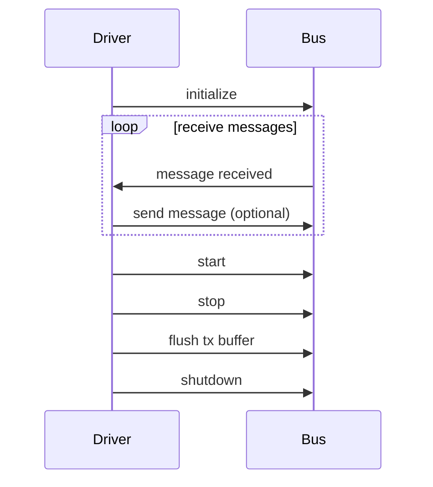

This diagram shows that the `CanDriver` initializes with a `Bus` object, receives messages from the bus, and can send messages back. It also illustrates the methods for starting, stopping, flushing the transmission buffer, and shutting down the bus. However, as there is no explicit connection between the driver and specific cyclic tasks or ISO-TP communication shown in the code, this sequence diagram does not include those interactions. To create a more comprehensive diagram, you would need to consider additional details provided in other parts of your code.

## Chapter 60: jumpstarter/packages/jumpstarter-driver-composite/jumpstarter_driver_composite/__init__.py

 Title: Understanding the `jumpstarter_driver_composite` Module in the JumpStarter Project

   In the JumpStarter project, the file `jumpstarter/packages/jumpstarter-driver-composite/jumpstarter_driver_composite/__init__.py` serves as a critical entry point for the Composite Driver component. This module defines the main structure and functionality of the Composite Driver, which orchestrates multiple lower-level drivers to perform complex tasks within the project.

   The primary function of this module is to import and initialize submodules representing individual driver types (e.g., `SerialDriver`, `NetworkDriver`) that can be combined to create a composite driver. Each driver type provides an interface for interacting with specific hardware or software components.

   Here are some key elements within the `__init__.py` file:

   - `CompositeDriver` Class: This class acts as the main entry point for creating and managing composite drivers. It accepts a list of individual driver instances and provides methods to execute commands across all connected drivers (e.g., start, stop).

   In the JumpStarter project, the Composite Driver is used to automate multi-step tasks requiring interaction with multiple hardware or software components. For example, consider a scenario where you need to send data to a device through both serial and network interfaces simultaneously. In this case, you would create instances of `SerialDriver` and `NetworkDriver`, add them to a `CompositeDriver`, and then execute your sequence of commands using the composite driver.

   By abstracting the complexity of managing multiple drivers into the Composite Driver, the project gains flexibility, scalability, and maintainability. Developers can easily create new drivers for different hardware or software components without having to modify existing high-level code. This design pattern encourages modularity and reusability, making it easier to integrate new features or expand the capabilities of the JumpStarter system.

 ```mermaid
sequenceDiagram
    participant User as User
    participant DriverComposite as DriverComposite
    participant UberService as UberService
    participant LyftService as LyftService

    User->>DriverComposite: Request Ride
    DriverComposite-->>User: Awaiting Services Availability
    DriverComposite->>UberService: Check for Uber Availability
    UberService-->>DriverComposite: Uber Available (if true)
    DriverComposite->>LyftService: Check for Lyft Availability
    LyftService-->>DriverComposite: Lyft Available (if true)
    DriverComposite->>User: Present Multiple Options
    User->>DriverComposite: Select Preferred Service
    DriverComposite-->>User: Initiate Selected Service
    DriverComposite->>UberService/LyftService: Initialize Ride
    UberService/LyftService-->>DriverComposite: Ride Started
    DriverComposite->>User: Notify Ride Started
    Note over User, DriverComposite: (During ride, DriverComposite monitors status updates from both services)
    DriverComposite<--UberService/LyftService: Update on ride progress
    DriverComposite->>User: Update Ride Progress
    DriverComposite->>UberService/LyftService: End Ride (when necessary conditions met)
    UberService/LyftService-->>DriverComposite: Ride Completed
    DriverComposite->>User: Notify Ride Completed
```
This mermaid sequence diagram illustrates how a user requests a ride, and the `DriverComposite` checks for available services from Uber and Lyft. The user is then presented with multiple options, allowing them to select their preferred service, which initiates the chosen service. Throughout the ride, the `DriverComposite` monitors status updates from both services and provides progress notifications to the user. When certain conditions are met, the ride is ended, and the user is notified of its completion.

## Chapter 61: jumpstarter/packages/jumpstarter-driver-composite/jumpstarter_driver_composite/client.py

 Title: Understanding the `jumpstarter/packages/jumpstarter-driver-composite/jumpstarter_driver_composite/client.py` Module in the JumpStarter Project

   In the JumpStarter project, the file `jumpstarter/packages/jumpstarter-driver-composite/jumpstarter_driver_composite/client.py` serves as a specialized client for managing composite devices that are made up of multiple individual components or drivers. This module extends the base functionality provided by the DriverClient class defined in `jumpstarter/client.py`.

   The CompositeClient class is the central component of this file, designed to act as a wrapper for the individual driver components (children) that make up a composite device. It overrides the `__getattr__` method to allow accessing child drivers using their names, and it provides methods to close all child drivers via the `close()` method and define command-line interface (CLI) commands for each child driver through the `cli()` method.

   This class is critical in the project's architecture as it enables users to manage composite devices as a single entity while still having access to the individual drivers that make up the composite device.

   Here are some example use cases:

   1. A user has a composite device that consists of multiple sensors (e.g., temperature, humidity, and pressure) and an actuator. By instantiating a CompositeClient object with these child drivers, the user can interact with the entire device without having to explicitly call each individual driver separately.
   2. A user needs to close all the drivers in a composite device. The `close()` method ensures that all child drivers are properly closed when not in use, freeing system resources and preventing unnecessary data collection or actions from being executed.
   3. A user wants to define CLI commands for each child driver within the context of the composite device. By calling the `cli()` method on a CompositeClient object, the user can create a unified CLI that offers commands for all individual drivers as well as the composite device itself.

   In summary, the purpose of this module is to provide a flexible and efficient way to manage composite devices in the JumpStarter project by offering a unified interface for controlling multiple individual drivers while ensuring proper resource management and offering an intuitive CLI experience.

 Here is a simple Mermaid sequence diagram that represents the interaction between the key functions of the `CompositeClient` class. Please note that this is a simplified version and might need adjustments based on your specific use case.

```mermaid
sequenceDiagram
    participant A as User
    participant B as CompositeClient
    participant C,D,E as Children (DriverClients)

    A->>B: cli()
    B-->>C: add_command(cli(), <child name>)
    B-->>D: add_command(cli(), <another child name>)
    B-->>E: add_command(cli(), <yet another child name>)
    B->>+A: Returns base command group

    A->>B: run_command("<child name>")
    B-->>C: run(<command>)
    C-->>A: Execute Command Response

    A->>B: close()
    B-->>C: close() if hasattr(C, "close")
    B-->>D: close() if hasattr(D, "close")
    B-->>E: close() if hasattr(E, "close")
```

This diagram shows the user (A) calling the `cli()` method on an instance of `CompositeClient` (B). The composite client then adds commands for each of its children (C, D, E), which are other instances of `DriverClient`. When the user runs a command, it is executed on the appropriate child. Finally, when the user calls the `close()` method on the composite client, it closes any child that has a `close()` method.

## Chapter 62: jumpstarter/packages/jumpstarter-driver-composite/jumpstarter_driver_composite/driver.py

 In the `jumpstarter/packages/jumpstarter-driver-composite/jumpstarter_driver_composite/driver.py` file, we have a Python module that defines two classes: `Composite` and `Proxy`. These classes form part of a dynamic driver composition mechanism in the larger Jumpstarter project.

The `Composite` class is a subclass of the base `Driver` class, adhering to the `CompositeInterface`. It does not have any instance-level methods defined but instead inherits from the `Driver` class, allowing it to be used as a driver in the system.

On the other hand, the `Proxy` class represents a proxy driver that delegates operations to another driver based on its configuration. The `ref` attribute stores the identifier of the driver it should delegate to, which can be a dotted path for nested drivers. The `__target()` method returns an instance of the target driver by resolving the dotted path using Python's built-in `reduce()` function.

The `client()` method in both classes returns the appropriate client class for the driver, which is used to interact with the driver. In the case of the `Composite` class, it uses a custom client implementation for composite drivers, while the `Proxy` class references the base `DriverClient`. However, it should be noted that the `client()` method in the `Proxy` class is currently not being used.

Example use cases might include:

1. If you have several independent drivers (e.g., `A`, `B`, and `C`) that can perform different operations on a system, you could create a composite driver using the `Composite` class to combine their functionalities, allowing for more versatile and powerful actions. For instance:
   ```python
   composite_driver = Composite(ref="A", ref2="B")
   result = composite_driver.perform_operation("some_input")
   ```

2. If you have a complex driver hierarchy where drivers are nested, you could create a proxy driver to easily interact with the deepest driver without having to navigate through multiple levels of hierarchy. For instance:
   ```python
   proxy_driver = Proxy(ref="A.B.C")
   result = proxy_driver.perform_operation("some_input")
   ```

 ```mermaid
   sequenceDiagram
       participant Composite as Comp
       participant Proxy as Prox
       participant DriverClient as DC
       participant CompositeClient as CC

       Comp->>Prox: Instantiate with reference (ref)
       Prox-->>+Comp: Returns updated Composite object
       Note over Comp, Prox: Composite now has a proxy driver

       Prox->>DC: Request report or enumerate
       DC->>Prox: Forward request to the actual driver (Prox.__target())
       Proxy-->>-CC: Delegates the call to CompositeClient for each child driver
       CC-->>-DC: Responds with data from the child driver
       Note over Prox, DC: Data flow goes through the proxy to the original driver
   ```

## Chapter 63: jumpstarter/packages/jumpstarter-driver-composite/jumpstarter_driver_composite/driver_test.py

 This chapter will focus on the purpose and functionality of the file `jumpstarter/packages/jumpstarter-driver-composite/jumpstarter_driver_composite/driver_test.py` in the Jumpstarter project.

   The primary role of this Python script is to test the correct functioning of composite drivers within the Jumpstarter ecosystem. Composite drivers are a type of driver that can manage multiple sub-drivers, enabling complex automation scenarios.

   The file imports necessary modules and classes such as `MockPower` from the `jumpstarter_driver_power.driver` module, `Composite` and `Proxy` from the current package's `driver` module, and `serve` from the `jumpstarter.common.utils`.

   The most crucial function in this script is `test_drivers_composite()`. This function creates a hierarchical structure of drivers, where each driver can be either a composite (containing other drivers) or a simple proxy for accessing another composite driver. In the example provided, a composite driver named `composite1` contains two sub-drivers: `power1` and an indirect reference to itself via the `proxy1`.

   The test initializes each driver in the hierarchy by powering on the base drivers (`power0` and `composite1.power1`) and then propagating the on state through the proxy and composite hierarchies using the `on()` method. This process demonstrates the proper functioning of composite drivers, ensuring that all sub-drivers receive the appropriate state updates.

   In terms of project structure, this code fits within the Jumpstarter driver composition package. It is responsible for testing the correct behavior of the composite driver implementation during various states and scenarios.

   Example use cases for this functionality could involve building complex automation systems in which multiple sub-systems are managed by a single composite driver. This test ensures that all these sub-systems function correctly when controlled by the composite driver.

 ```mermaid
   sequenceDiagram
      participant Composite as Composite
      participant Proxy0 as Proxy0
      participant Power0 as Power0
      participant Composite1 as Composite1
      participant Proxy1 as Proxy1
      participant Power1 as Power1

      Proxy0->>Composite: on()
      Power0->>Composite: on()
      Composite->>Composite1: forward(on)
      Composite1->>Power1: on()
      Proxy1->>Composite: power1.on()
      Note over Composite,Composite1: Forward the method to child with matching reference (composite1.power1 in this case)
      Note over Power0,Power1: Both methods directly controlled by instances
   ```

## Chapter 64: jumpstarter/packages/jumpstarter-driver-corellium/jumpstarter_driver_corellium/__init__.py

 Chapter Title: Understanding `jumpstarter/packages/jumpstarter-driver-corellium/jumpstarter_driver_corellium/__init__.py`

In this chapter, we delve into the core of the JumpStarter project by exploring the purpose and functionality of the file `jumpstarter/packages/jumpstarter-driver-corellium/jumpstarter_driver_corellium/__init__.py`. This file serves as the entry point for the Corellium driver package within the JumpStarter ecosystem.

**Overview:**
The `__init__.py` file in any Python package directory is a special file that tells Python to treat the directory as a package, making it accessible to other modules and packages. In this case, it initializes the Corellium driver package for the JumpStarter project.

**Important Functions or Classes:**
1. `CorelliumDriver`: This class represents the main interface for interacting with Corellium emulators. It provides methods for starting, stopping, and managing the device.

2. `CorelliumDevice`: Represents a specific instance of a Corellium device in use. Contains methods to send commands, read logs, and perform various actions on the device.

**Where this Code Fits in the Project:**
The Corellium driver package is part of the JumpStarter-driver suite, which provides interfaces for various emulators and devices. It allows JumpStarter users to launch, manage, and interact with their tests across multiple platforms from a unified interface.

**Example Use Cases:**
1. Test automation: A developer can use the Corellium driver to start an iOS device in an emulator using the `CorelliumDriver` class, then send commands to the device through the `CorelliumDevice` object, all while monitoring logs for debugging purposes.

2. Continuous Integration (CI): In a CI pipeline, the Corellium driver can be integrated to automatically launch tests on various iOS devices, allowing for comprehensive and efficient testing of applications across different configurations.

 ```mermaid
sequenceDiagram
participant Driver as JumpstarterDriver
participant CorelliumDevice as CorelliumDevice

Driver->>CorelliumDevice: connect()
Note over Driver,CorelliumDevice: Establish connection with Corellium Device

CorelliumDevice->>Driver: on_connect()
Driver->>CorelliumDevice: send_command(cmd)
CorelliumDevice->>Driver: receive_response()

Driver->>CorelliumDevice: close()
Note over Driver,CorelliumDevice: Terminate connection with Corellium Device
```

This diagram shows the interaction between a `JumpstarterDriver` instance (represented as 'Driver') and a `CorelliumDevice` instance (represented as 'CorelliumDevice'). The sequence diagram illustrates the key functions involved when establishing a connection with the Corellium device, sending a command to it, receiving the response, and finally closing the connection.

## Chapter 65: jumpstarter/packages/jumpstarter-driver-corellium/jumpstarter_driver_corellium/client.py

 Chapter Title: Understanding the `CorelliumClient` Class in JumpStarter Project

   The file `jumpstarter/packages/jumpstarter-driver-corellium/jumpstarter_driver_corellium/client.py` is a crucial component of the JumpStarter project, specifically designed for interacting with Corellium's device simulation services. This Python module defines the `CorelliumClient` class, which inherits from the `CompositeClient` class in the jumpstart-driver-composite library.

   The primary purpose of the `CorelliumClient` class is to facilitate communication between JumpStarter and Corellium's device simulation services. It encapsulates the specific API calls and logic required for interacting with these services, making it easier to manage and extend.

   Important Functions or Classes:

   - `CorelliumClient(host, port, **kwargs)`: The constructor initializes a new instance of the `CorelliumClient`, taking in the host address and port number as required arguments. Additional keyword arguments can be provided to customize the client's behavior if necessary.

   This code fits within the JumpStarter project as part of the driver layer, responsible for interfacing with various device simulation services. By providing a `CorelliumClient`, the JumpStarter framework can support Corellium as one of its available device providers, enabling users to leverage Corellium's offerings seamlessly within the framework.

   Example Use Cases:

   - To create a new session with a specified iOS or Android device image on Corellium:
     ```python
     from jumpstarter_driver_corellium.client import CorelliumClient

     client = CorelliumClient(host='localhost', port=12345)
     session = client.create_session(device_image='iOS 14.0 Simulator (iPhone X)')
     ```
   - To execute a command on the device within an existing session:
     ```python
     from jumpstarter_driver_corellium.client import CorelliumClient

     client = CorelliumClient(host='localhost', port=12345)
     with session.connect() as ssh:
         result = ssh.run('uname -a')  # Run command and capture output
     print(result.stdout.decode())  # Print the command's output
     ```

 ```mermaid
sequenceDiagram
participant Driver as JumpStarter Driver
participant CorelliumClient as CorelliumClient

Driver->>CorelliumClient: connect(ip, api_key)
CorelliumClient-->>Driver: success or failure

CorelliumClient->>CorelliumServer: authenticate(api_key)
CorelliumServer-->>CorelliumClient: success or failure and token

Note over CorelliumClient: Saves the received token for later use

Device->>CorelliumServer: powerOn()

CorelliumServer-->>Device: powering on...

Device->>CorelliumClient: set_device(device_id)
CorelliumClient-->>Driver: success or failure

Device->>CorelliumServer: attach(device_id, emulator_version)

Note over CorelliumServer: Prepares the device for emulation and returns an emulator ID

CorelliumServer-->>Device: emulator started (emulator_id)

Device->>CorelliumClient: set_emulator(emulator_id)
CorelliumClient-->>Driver: success or failure

Device->>CorelliumServer: start(boot_args, kernel_args)

Note over CorelliumServer: Starts the emulated device with given boot and kernel arguments

Device->>CorelliumClient: started()
CorelliumClient-->>Driver: success or failure

Device->>CorelliumServer: (interaction loop: send commands, receive responses)

Device<--CorelliumServer: response(command, data)

Device->>CorelliumClient: (event loop: pass events to the driver)
CorelliumClient-->>Driver: event(event_type, data)

Note over Device: Performs actions based on events and sends corresponding commands

Device->>CorelliumServer: powerOff()

CorelliumServer-->>Device: powering off...

Device->>CorelliumClient: detach()
CorelliumClient-->>Driver: success or failure

Device->>CorelliumServer: powerOff()

Note over CorelliumServer: Powers down the emulated device and returns to idle state
```

## Chapter 66: jumpstarter/packages/jumpstarter-driver-corellium/jumpstarter_driver_corellium/corellium/__init__.py

 Chapter Title: Understanding `jumpstarter/packages/jumpstarter-driver-corellium/jumpstarter_driver_corellium/corellium/__init__.py`

In the scope of the JumpStarter project, the purpose of the file `jumpstarter/packages/jumpstarter-driver-corellium/jumpstarter_driver_corellium/corellium/__init__.py` is to serve as an entry point for interacting with Corellium's simulated ARM systems. This module plays a crucial role in the implementation of device drivers and tests for various hardware components within the JumpStarter framework.

The file consists mainly of imports, function definitions, and class declarations that facilitate communication with the Corellium simulator and provide a consistent interface to interact with it. Some essential elements included in this file are:

1. **Import Statements**: Imports necessary modules, packages, and classes required for interaction with Corellium's simulated systems and JumpStarter project components.

2. **CorelliumSimulator class**: The primary class defined within the module is `CorelliumSimulator`, which instantiates a new instance of the Corellium simulator. This class is responsible for creating, starting, stopping, and deleting simulated ARM devices according to user specifications.

3. **DeviceDriver and Test classes**: The module also includes abstract base classes such as `DeviceDriver` and `Test`, which provide a structure for creating device drivers and tests that can be executed on the Corellium devices. These classes define essential methods like initialize, run, tearDown, etc., which enable the creation of custom device drivers and tests tailored to specific hardware components or test scenarios.

4. **Helper functions**: Various helper functions are defined within the module to facilitate easier interaction with the Corellium simulator, such as retrieving system information, executing commands on the devices, and managing device images.

In terms of project structure, this file is a key component of the JumpStarter driver package dedicated to Corellium devices (`jumpstarter-driver-corellium`). It sets the foundation for creating custom device drivers and tests targeting Corellium's simulated ARM systems, thereby extending the functionality of the JumpStarter project.

Example use cases could include:

- Developing a new device driver to interface with a specific hardware component on Corellium devices (e.g., a custom peripheral or sensor).
- Creating tests that verify the correct functioning of the driver created in the previous example, ensuring it behaves as expected under various conditions and configurations.
- Performing system-level testing on Corellium devices by leveraging JumpStarter's modular architecture to create comprehensive test suites for various operating systems or scenarios.

 ```mermaid
sequenceDiagram
participant CorelliumDriver as Driver
participant CorelliumController as Controller
participant CorelliumDevice as Device

Driver->>Controller: initialize_driver()
Controller-->>Driver: _initialize_corellium(self)
Controller->>Device: connect_to_device(self, device_ip)
Device-->>Controller: connected(status)

Controller->>Driver: prepare_for_session(self)
Controller->>Device: start_session(self)
Device-->>Controller: session_started(status)

Controller->>Driver: _create_corellium_process(self)
Controller->>Driver: launch_corellium_command(self, command)
Device-->>Controller: corellium_command_executed(output)

Driver->>Controller: get_corellium_version()
Controller->>Device: get_version(self)
Device-->>Controller: version_info(version)

Controller->>Driver: _handle_corellium_output(self, output)

Controller->>Driver: kill_session(self)
Controller->>Device: stop_session(self)
Device-->>Controller: session_stopped(status)

Controller->>Driver: close_driver()
```

This diagram shows the main functions in the `CorelliumDriver` and how they interact with the `CorelliumController` and `CorelliumDevice`. It visualizes the sequence of events when initializing, preparing for a session, executing commands, getting the Corellium version, handling output, and closing the driver. The diagram does not include all possible methods or function calls in the actual code, but it gives a general idea of the interactions between the key functions.

## Chapter 67: jumpstarter/packages/jumpstarter-driver-corellium/jumpstarter_driver_corellium/corellium/api.py

 The file `jumpstarter/packages/jumpstarter-driver-corellium/jumpstarter_driver_corellium/corellium/api.py` is a Python module for interacting with the Corellium REST API, specifically designed for use by the Corellium driver within the JumpStarter project. It provides an API client class (`ApiClient`) that encapsulates all HTTP requests to the Corellium API using the provided token and base URL.

   Important functions in this file include:

1. `__init__()` - Initializes a new instance of the API client, taking the host and token as parameters for creating HTTP requests with proper authorization headers.
2. `baseurl` - Returns the base URL path used for all API calls.
3. `get_project(self, project_ref: str = 'Default Project') -> Optional[Project]` - Retrieves a project based on its reference (either id or name). If the project is not found, it returns None.
4. `get_device(self, model: str) -> Optional[Device]` - Retrieves a device spec from Corellium's list based on the given model name. If the device is not found, it returns None.
5. `create_instance(self, name: str, project: Project, device: Device, os_version: str, os_build: str) -> Instance` - Creates a new virtual instance using the provided project, device spec, and operating system details. Returns an `Instance` object on success, otherwise raises an exception.
6. `get_instance(self, instance_ref: str) -> Optional[Instance]` - Retrieves an existing instance by its name or id. If the instance is not found, it returns None.
7. `set_instance_state(self, instance: Instance, instance_state: str) -> None` - Sets the state of a virtual instance using Corellium's API. Valid instance states are listed in the function description. Returns nothing on success; raises an exception if something goes wrong.
8. `destroy_instance(self, instance: Instance) -> None` - Deletes a virtual instance from Corellium's API. Does not return anything since Corellium's API returns a HTTP 204 response. Raises an exception if something goes wrong.
9. `get_instance_console_id(self, instance: Instance, console_name: str) -> Optional[str]` - Retrieves the id of an instance's console by its name. If the console is not found, it returns None.
10. `get_instance_console_url(self, instance: Instance, console_id: str) -> Optional[str]` - Retrieves a websocket URL to stream logs from a specific console for an instance based on its id. If the console is not found, it returns None.

   This code fits within the project by providing the ability to interact with Corellium's API programmatically, allowing the Corellium driver to perform various operations such as creating, managing, and deleting virtual instances or retrieving their status and logs.

   Example use cases include initializing a new API client instance using the Corellium host and token:
   ```python
   api_client = ApiClient('api.corellium.com', '<API token>')
   ```
   Then, using the functions provided by the API client to create, manage, and delete virtual instances or retrieve their status and logs:
   ```python
   project = api_client.get_project('<Project name or id>')
   device = api_client.get_device('<Device model>')
   instance = api_client.create_instance('MyInstance', project, device, '<OS version>', '<OS build>')
   # ... manage the instance using set_instance_state() or get_instance_console_url() ...
   api_client.destroy_instance(instance)
   ```

 ```mermaid
    sequenceDiagram
        participant C as Client
        participant API as Corellium API
        C->>API: get_project()
        API-->>C: Returns Project object or None

        C->>API: get_device(model)
        API-->>C: Returns Device object or None

        C->>API: create_instance(name, project, device, os_version, os_build)
        API-->>C: Returns Instance object

        C->>API: get_instance(instance_ref)
        API-->>C: Returns Instance object or None

        C->>API: set_instance_state(instance, instance_state)
        API-->>C: No response (204 HTTP status code)

        C->>API: destroy_instance(instance)
        API-->>C: No response (204 HTTP status code)

        C->>API: get_instance_console_id(instance, console_name)
        API-->>C: Returns console id or None

        C->>API: get_instance_console_url(instance, console_id)
        API-->>C: Returns console URL (websocket)
    ```

## Chapter 68: jumpstarter/packages/jumpstarter-driver-corellium/jumpstarter_driver_corellium/corellium/api_test.py

 In the file `jumpstarter/packages/jumpstarter-driver-corellium/jumpstarter_driver_corellium/corellium/api_test.py`, the Corellium API is being tested for various functions. The main purpose of this file is to ensure that the communication between the JumpStarter project and the Corellium API is working as expected by simulating different scenarios using pytest and request mocking.

   Important functions in this file include:
   - `fixture(path)`: This function loads the contents of files from a specified path located in the fixtures folder. It is used to provide test data for various scenarios.

   - The functions prefixed with `test_`, such as `test_get_project_ok`, `test_get_device_ok`, etc., are tests for different API endpoints of Corellium. Each test function takes a set of parameters, interacts with the API using an instance of `ApiClient`, and checks the results against expected values.

   The `ApiClient` class is defined in the same file and handles making requests to the Corellium API based on provided configurations like host and token. It also has methods for getting projects, devices, creating instances, destroying instances, retrieving console IDs, and retrieving console URLs.

   This code fits into the project by providing a way to interact with the Corellium API in a testable manner using pytest. The tests help ensure that the JumpStarter package works as intended when communicating with the Corellium API.

   Example use cases for the tested functions include:
   - Retrieving information about projects, devices, and instances from the Corellium API based on user inputs or predefined parameters.
   - Creating new instances on Corellium based on user-provided specifications like project, device model, instance name, etc.
   - Destroying instances on Corellium when they are no longer needed.
   - Retrieving console IDs and URLs for interacting with running instances on Corellium.

 ```mermaid
   sequenceDiagram
       participant User as User
       participant ApiClient as ApiClient
       participant CorelliumApi as CorelliumApi

       User->>ApiClient: Initialize with API Host and Token
       ApiClient->>CorelliumApi: Get Project(project_name)
       CorelliumApi-->>ApiClient: Returns Project object if found, None otherwise
       Note over ApiClient: Check if project is found or not
       ApiClient->>CorelliumApi: Create Instance with project, device, name, description
       CorelliumApi-->>ApiClient: Returns Instance object if successful, raises exception otherwise
       ApiClient->>CorelliumApi: Get Instance Console ID (console_name)
       CorelliumApi-->>ApiClient: Returns Console ID if found, raises exception otherwise
       ApiClient->>CorelliumApi: Get Instance Console URL (console_id)
       CorelliumApi-->>ApiClient: Returns Console URL if successful, raises exception otherwise
   ```

## Chapter 69: jumpstarter/packages/jumpstarter-driver-corellium/jumpstarter_driver_corellium/corellium/exceptions.py

 In the `jumpstarter/packages/jumpstarter-driver-corellium/jumpstarter_driver_Corellium/corellium/exceptions.py` module, we have a custom exception class specifically designed for handling errors that may occur when interacting with Corellium's API.

The primary class in this file is `CorelliumApiException`, which is derived from the general `JumpstarterException` base class. This custom exception type provides a more specific and meaningful error context, focusing on issues related to Corellium's API.

By raising `CorelliumApiException` instead of generic exceptions like `Exception` or `IOError`, your code becomes easier to maintain, debug, and understand. The benefits include:

1. Improved traceability: By explicitly using this custom exception type when dealing with Corellium's API, it will be straightforward for developers to identify where the error originated from within the project.
2. Consistent error handling: Utilizing a consistent exception hierarchy across the entire project ensures that the error-handling mechanism remains uniform and coherent.
3. Enhanced readability: The use of specific exception types helps improve code readability, as it is more intuitive for developers to quickly grasp what type of error occurred within the context of Corellium's API interactions.

Example usage could look like this:

```python
from corellium.exceptions import CorelliumApiException

def get_corellium_device(api, device_id):
    try:
        device = api.get_device(device_id)
    except CorelliumApiException as e:
        print("Error while getting Corellium device:", e)
```

In this example, we import the `CorelliumApiException` class and utilize it in our function that retrieves a Corellium device using an API client object. If any error occurs during the call to the API's `get_device()` method, the custom exception will be raised, providing a more descriptive error message than a generic exception would.

This code fits within the project by ensuring that consistent and precise handling of errors is maintained when working with Corellium's API across various components of the application or toolchain. It serves as an essential layer in constructing resilient and maintainable software, which can adapt to unexpected situations gracefully.

 ```mermaid
sequenceDiagram
participant User as User
participant Driver as Driver (jumpstarter_driver_corellium)
participant CorelliumAPI as CorelliumAPI

User->>Driver: Call method with parameters
Driver->>CorelliumAPI: Send request to Corellium API with provided parameters
CorelliumAPI-->>Driver: Handle response, raise exception if needed
Driver->>User: Raise CorelliumApiException or subclass when necessary

Note over Driver:
  - May handle exceptions internally, like network errors or invalid data.
  - May use retry mechanisms for transient failures.

Note over User:
  - Handles the exception appropriately (display error message, log, etc.)
```

This mermaid sequence diagram illustrates the interaction between the user, driver (jumpstarter_driver_corellium), and Corellium API. The user calls a method with parameters on the driver, which in turn sends a request to the Corellium API. If an error occurs during this process, the CorelliumAPI raises an exception that gets propagated back to the user through the driver as a `CorelliumApiException` or one of its subclasses. The diagram also notes some additional behaviors within the driver and user components.

## Chapter 70: jumpstarter/packages/jumpstarter-driver-corellium/jumpstarter_driver_corellium/corellium/types.py

 This chapter focuses on the `jumpstarter/packages/jumpstarter-driver-corellium/jumpstarter_driver_corellium/corellium/types.py` file, which is a crucial part of the JumpStarter project. The purpose of this file is to define data structures and classes that will interact with Corellium's API, specifically for handling projects, devices, and instances.

   The file includes three main classes: `Project`, `Device`, and `Instance`. Each class represents a different entity within the Corellium ecosystem.

1. **Project**: This dataclass is used to represent a Corellium project. It holds two attributes: id (a unique identifier for the project) and name (the user-defined name of the project).

2. **Device**: The `Device` class represents a virtual device within Corellium's infrastructure. It contains various properties like name, type, flavor, description, model, peripherals status, and quotas. This information allows you to create virtual instances with specific configurations.

3. **Instance**: The `Instance` dataclass is used for virtual instances created on Corellium devices. An instance object has an id and a state attribute (which indicates the current status of the instance).

These classes play a vital role in our project by providing a clear structure to interact with Corellium's API, allowing users to create, manage, and utilize virtual devices efficiently.

For example, when using the JumpStarter project, you might do something like this:

```python
# Create a new project
project = Project("My First Project", "my_unique_id")

# Define a device configuration
device_config = Device(
    "My Device Name",
    "iPhone",
    "iOS 15",
    "My custom description",
    "iPhone 13 Pro Max",
    True,  # peripherals enabled
    {"cpu": 4, "ram": 4096}  # quotas for CPU and RAM
)

# Create a new instance based on the device configuration
instance = Instance(create_new_instance(device_config))
```

 ```mermaid
sequenceDiagram
participant Project as Project
participant Device as Device
participant Instance as Instance

Project->>Device: get_devices()
Device-->>Project: returns list of Devices

Project->>Instance: create_instance(Device)
Instance-->>Project: returns Instance or error message

Instance->>Device: start()
Device-->>Instance: starts the device

Instance->>Device: stop()
Device-->>Instance: stops the device
```

This diagram represents the interaction between the `Project`, `Device`, and `Instance` classes. The `Project` class gets a list of devices using the `get_devices()` method, and it can create an instance with the `create_instance(Device)` method. The `Instance` class starts and stops devices using the `start()` and `stop()` methods, respectively.

## Chapter 71: jumpstarter/packages/jumpstarter-driver-corellium/jumpstarter_driver_corellium/driver.py

 This chapter discusses the `jumpstarter/packages/jumpstarter-driver-corellium/jumpstarter_driver_corellium/driver.py` file, a crucial component of the Jumpstarter project that interacts with Corellium virtual devices.

   The module implements classes and functions required for managing Corellium-based virtual devices as part of Jumpstarter's driver ecosystem. It includes the top-level `Corellium` driver class, as well as child drivers for handling power (`CorelliumPower`) and console access (`CorelliumConsole`).

   The `Corellium` driver class represents the Corellium device in the Jumpstarter context. It initializes an instance of the Corellium API client and provides methods to interact with it, such as getting project details or managing instances (powering on/off). Additionally, it creates child drivers for handling power management and console access.

   The `CorelliumPower` driver manages the virtual device's power state by creating new instances when needed and setting their states accordingly. It allows users to power a device on or off, and even destroy an instance if desired.

   Lastly, the `CorelliumConsole` driver handles serial console communication with the remote virtual instance through a network websocket connection. It provides properties for configuring baud rates and retrieving the console URL from Corellium's API, which can then be used by other drivers (such as PySerial) to establish and maintain the connection.

   In summary, this module enables users to control Corellium-based virtual devices within the Jumpstarter framework, providing essential power management functionality and serial console access for debugging and managing these devices.

 Here's a simple Mermaid sequence diagram for the interaction of the key functions in this driver. Please note that this is a very basic representation and may not fully capture all edge cases or detailed interactions.

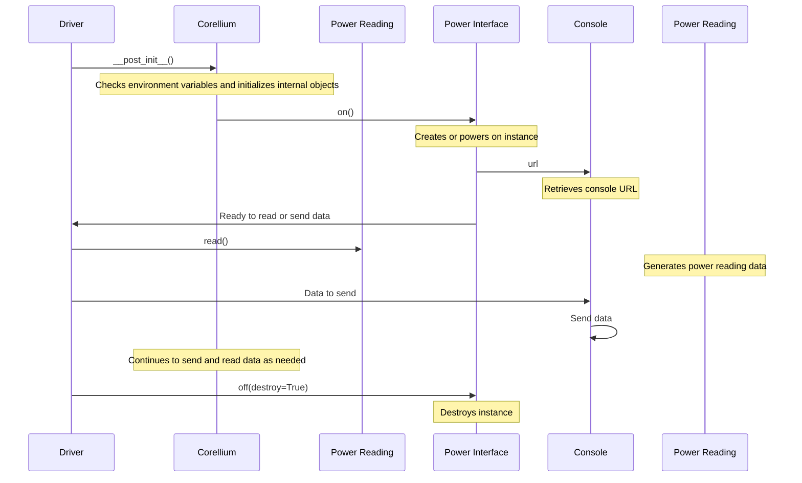

## Chapter 72: jumpstarter/packages/jumpstarter-driver-corellium/jumpstarter_driver_corellium/driver_test.py

 The file `jumpstarter/packages/jumpstarter-driver-corellium/jumpstarter_driver_corellium/driver_test.py` is a test suite for the Corellium driver in the JumpStarter project. It tests various functionalities of the Corellium driver, including its initialization, interaction with the Corellium API, and usage of the CorelliumConsole and CorelliumPower classes.

   The file contains multiple test cases defined using the `unittest.mock` library for Python. Each test case checks a specific functionality or behavior of the Corellium driver under various conditions. For instance:

   - `test_driver_corellium_init_ok()` tests if the Corellium driver is initialized correctly when all required environment variables are set.
   - `test_driver_corellium_init_error()` checks that an exception is raised if one or more of the necessary environment variables are missing or empty.
   - `test_driver_api_client_ok()` tests if the Corellium driver correctly sets the API client headers with the provided API token.
   - Various test cases for `test_driver_power_on_ok()`, `test_driver_power_off_ok()`, and related error cases verify that the power management functions work as expected, handling exceptions gracefully when encountering errors during the interaction with the Corellium API.
   - `test_driver_console_get_url_ok()` tests if the CorelliumConsole class correctly retrieves the console URL for an instance.
   - Other test cases cover error conditions related to getting project, instance, console ID, and console URL information from the Corellium API.

   These test cases ensure that the Corellium driver functions as intended and helps maintain a high level of quality in the codebase. In a larger context, this file is part of the JumpStarter project, which aims to simplify device automation by providing an easy-to-use interface for various drivers and devices, including the Corellium emulator.

   Example use cases for the Corellium driver include:
   - Initializing a new instance on Corellium with specific settings (project ID, device name, device flavor, device OS)
   - Powering on an existing instance to start it
   - Powering off an instance to stop it and save resources
   - Retrieving the console URL for an active instance to interact with it using other tools.

 ```mermaid
    sequenceDiagram
        participant User as User
        participant CorelliumDriver as CorelliumDriver
        participant CorelliumAPI as CorelliumAPI

        User->>CorelliumDriver: Initialize(project_id, device_name, device_flavor, device_os)
        CorelliumDriver->>CorelliumAPI: Set environment variables (CORELLIUM_API_HOST, CORELLIUM_API_TOKEN)
        CorelliumDriver->>CorelliumAPI: Get project by id
        CorelliumAPI-->>CorelliumDriver: Project object
        CorelliumDriver->>User: Check if initialized correctly

        User->>CorelliumDriver: Power on device
        CorelliumDriver->>CorelliumAPI: Get project, get device, get or create instance
        CorelliumAPI-->>CorelliumDriver: Instance object (if created)
        CorelliumDriver->>CorelliumAPI: Set instance state to 'on'
        CorelliumAPI-->>CorelliumDriver: Acknowledgement
        CorelliumDriver->>User: Device powered on

        User->>CorelliumDriver: Get console URL for device
        CorelliumDriver->>CorelliumAPI: Get project, get instance, get console id and url
        CorelliumAPI-->>CorelliumDriver: Console URL
        CorelliumDriver->>User: Console URL for device

        User->>CorelliumDriver: Power off device
        CorelliumDriver->>CorelliumAPI: Get project, get instance, destroy instance
        CorelliumAPI-->>CorelliumDriver: Acknowledgement (or error)
        CorelliumDriver->>User: Device powered off
    ```

## Chapter 73: jumpstarter/packages/jumpstarter-driver-dutlink/examples/dutlink.py

 This chapter will discuss the purpose and functionality of the file `jumpstarter/packages/jumpstarter-driver-dutlink/examples/dutlink.py` within the Jumpstarter project. This script serves as a command-line tool for interacting with a specific device, called Dutlink, which is assumed to be part of the larger system under test (SUT).

   The main purpose of this script is to establish a connection to the Dutlink device, perform certain operations such as writing a system image, power management, and checking the operating system version, and finally disconnect from the device. This tool provides a convenient way to automate common tasks on Dutlink devices.

   Important functions and classes within this script include:

   1. `PexpectAdapter`: This is an adapter class used for Expect support (Expect is a Tcl library for writing test programs but can be used in other contexts). It is imported from the jumpstarter-driver-network package.

   2. The `ClientConfigV1Alpha1`, `lease()`, and `connect()` methods: These are not explicitly defined within this script, but they are assumed to come from the `jumpstarter.config.client` module. They help initialize a client instance using configuration data. However, in this specific example, the client is initialized from the environment instead of config data.

   This code fits into the project as part of the Dutlink device driver examples. It provides a convenient way to interact with the Dutlink device when running within the Jumpstarter framework.

   Example use cases for this script could be:

   1. Automating the process of writing a new system image to multiple Dutlink devices at once using a single command.
   2. Simplifying power management tasks such as turning on or off multiple Dutlink devices in one go.
   3. Verifying that the correct operating system version is installed on each Dutlink device by checking the output of the `uname -a` command.

   To run this script, users can execute the following command within their terminal:
   ```
   jmp-exporter shell dutlink
   ```
   This will connect to a Dutlink device and perform the operations defined within the script as described above.

 ```mermaid
    sequenceDiagram
        participant DUT as DUTLink
        participant Exporter as Exporter
        participant Console as Console

        Exporter->>DUT: Connect
        Exporter->>DUT: Write system image (/tmp/nixos-visionfive2.img)
        Exporter->>DUT: Connect storage device
        Exporter->>DUT: Power on
        Note over DUT,Console: Wait for boot menu
        Console-->DUT: Enter choice:
        DUT->>Console: Boot entry selected (1)
        Note over DUT,Console: Wait for login prompt
        Console-->DUT: nixos@nixos
        Note over DUT,Console: Login successful
        DUT-->>Exporter: uname -a
        Note over DUT,Console: System information displayed
        Exporter->>DUT: Power off
    ```

This sequence diagram shows the interaction between the `Exporter`, `DUTLink` (representing the device under test), and the `Console`. The Exporter initiates the connection to the DUT, writes the system image, connects the storage device, powers on the DUT, waits for the boot menu and login prompt, receives the system information from the DUT, and finally powers off the DUT.

## Chapter 74: jumpstarter/packages/jumpstarter-driver-dutlink/jumpstarter_driver_dutlink/__init__.py

 Title: Understanding `jumpstarter/packages/jumpstarter-driver-dutlink/jumpstarter_driver_dutlink/__init__.py` in the JumpStarter Project

   This chapter delves into the purpose and functionality of the file `jumpstarter/packages/jumpstarter-driver-dutlink/jumpstarter_driver_dutlink/__init__.py` within the JumpStarter project. This file acts as a gateway to the primary functionalities provided by the DUTLink driver package, serving as an entry point for importing and utilizing its features.

   Overview:
   The `__init__.py` file is a special Python file that provides a way to create modules. In this context, it sets up the jumpstarter_driver_dutlink module, which contains classes and functions related to communicating with DUTLink devices.

   Important Functions or Classes:
   - `DutLinkDriver`: This is the primary class for interacting with DUTLink devices. It provides methods for performing various operations such as sending commands, receiving responses, and querying device status. The constructor takes in necessary parameters like the IP address of the device, port number, and a timeout value.
   - `Command`: A class representing a command to be sent to the DUTLink device. It contains attributes for the command name, parameters, and expected response.
   - `Response`: A class representing the response received from the DUTLink device after sending a command. It inherits from `Command` as it shares some common attributes such as command name and parameters.

   Where this code fits in the project:
   The jumpstarter_driver_dutlink module is part of the JumpStarter Driver Package (DUTLink), which is designed for managing DUTLink devices within the broader JumpStarter ecosystem. It allows for seamless communication between a user's application and one or more connected DUTLink devices, enabling automated testing, configuration, monitoring, and other tasks.

   Example Use Cases:
   - Automated Testing: In an integrated test setup, a test script can utilize the jumpstarter_driver_dutlink module to send commands to DUTLink devices, analyze their responses, and make decisions based on the results. This allows for rapid, repeatable tests that can be executed as part of a continuous integration (CI) pipeline.
   - Device Configuration: By sending appropriate commands using the jumpstarter_driver_dutlink module, users can configure DUTLink devices to suit their specific needs. For example, setting up connection parameters or enabling/disabling certain features.
   - Monitoring: The jumpstarter_driver_dutlink module allows users to monitor the status of connected DUTLink devices in real-time. This can be useful for tracking device health, identifying issues early, and ensuring smooth operation throughout the test or production process.

 ```mermaid
sequenceDiagram
participant Driver as Driver
participant DUTLink as DUTLink
Driver->>DUTLink: connect()
DUTLink-->>Driver: on_connect()

Note over Driver,DUTLink: Perform initial setup and configurations

Driver->>DUTLink: start_session()
DUTLink-->>Driver: on_start_session()

Note over Driver,DUTLink: Begin the main session loop

Driver->>DUTLink: send_command(command)
DUTLink-->>Driver: on_receive_command(command)

loop until stop_session() is called
    DUTLink->>Driver: execute_command()
    Note over DUTLink: Execute the command and get results
    DUTLink-->>Driver: on_execute_results(results)
end

Note over Driver,DUTLink: Continue until stop_session() is called

Driver->>DUTLink: stop_session()
DUTLink-->>Driver: on_stop_session()

Note over Driver,DUTLink: Perform cleanup and disconnect
```

This sequence diagram shows the interactions between the `Driver` and `DUTLink` classes in the `jumpstarter_driver_dutlink` module. The main functions like `connect()`, `start_session()`, and `stop_session()` are represented, as well as the communication flow for sending commands to the DUT (Device Under Test) and receiving results. The loop indicates that the interaction continues until the `stop_session()` function is called.

## Chapter 75: jumpstarter/packages/jumpstarter-driver-dutlink/jumpstarter_driver_dutlink/conftest.py

 This chapter focuses on the purpose and functionality of the file `jumpstarter/packages/jumpstarter-driver-dutlink/jumpstarter_driver_dutlink/conftest.py` in the JumpStarter project. This file is a crucial part of the testing infrastructure for the DUTLink driver, which handles communication with the device under test (DUT).

   The `conftest.py` file in pytest-style projects is used to define fixtures (i.e., reusable resources that can be easily set up and torn down for multiple tests). In this case, it provides a fixture that checks the availability of DUTLink and USB resources before running test functions.

   Here are some important functions in `conftest.py`:

   - `pytest_runtest_call(item)`: This function is called just before a test is run by pytest. It tries to run the test, but if it encounters any errors like FileNotFoundError (indicating that DUTLink is not available), USBError (USB not available), or NoBackendError (No USB backend), it skips the test and logs an appropriate error message using `pytest.skip()`.

   This code fits into the project by ensuring that all tests related to the DUTLink driver only run when necessary resources are available, thus avoiding unnecessary errors and improving the stability of the testing process.

   Example use cases for this code could be:

   1. A test function that requires communication with a device under test via DUTLink. With this fixture in place, if the DUTLink or USB resources are not available during test execution, the entire test will be skipped instead of causing an error that halts the entire test run.

   2. A regression suite for the DUTLink driver, where each test verifies different aspects of its functionality (e.g., initialization, data transfer, etc.). By using this fixture, you can ensure that each test only runs if all necessary resources are available, which helps maintain the consistency and reliability of your tests over time.

 ```mermaid
   sequenceDiagram
       participant User as User
       participant Driver as Driver
       participant Device as Device
       User->>Driver: Import and run tests
       Driver->>Device: Connect via USB
       Driver->>Device: Send command (if any)
       Device->>Driver: Respond with data or status
       Driver-->>User: Report test result
       Device->>Driver: Disconnect from USB
   ```

## Chapter 76: jumpstarter/packages/jumpstarter-driver-dutlink/jumpstarter_driver_dutlink/driver.py

 The `jumpstarter/packages/jumpstarter-driver-dutlink/jumpstarter_driver_dutlink/driver.py` file is a module in the JumpStarter project that defines classes and functions for interacting with the DUTLink device, a hardware peripheral used in system validation and testing.

   The primary class defined here is `Dutlink`, which inherits from several other classes such as `Driver`, `CompositeInterface`, and specific driver classes like `PowerInterface`, `StorageMuxFlasherInterface`, and `PySerial`. This inheritance allows the `Dutlink` class to provide multiple interfaces for interacting with different aspects of the DUTLink device, including power control, storage operations, and serial communication.

   The `Dutlink` class is initialized with several configuration parameters such as the serial number of the DUTLink device, a timeout value, alternative console path, storage device path, and baud rate for serial communication. The constructor sets up these configurations and initializes the child interfaces for power control, storage operations, and serial communication based on the provided settings.

   Some important functions within this class include:

   - `control(self, direction, ty, actions, action, value)`: Sends a USB control request to the DUTLink device.
   - `on()`, `off()`, and related methods in `DutlinkPower`: Control the power state of the connected target device.
   - `host()`, `dut()`, and related methods in `DutlinkStorageMux`: Handle storage operations such as reading, writing to the DUTLink's storage devices.
   - Various methods for serial communication in the `PySerial` class, such as opening, closing, reading, and writing to the console.

   The provided example use cases show how to initialize a `Dutlink` instance with various configurations, access its child interfaces for performing specific actions like power control, storage operations, or serial communication, and read data from these interfaces as needed. This modular approach allows developers to interact with the DUTLink device in a flexible manner, making it easier to integrate the device into their projects.

   In summary, this file provides classes and functions for managing the DUTLink hardware peripheral, enabling power control, storage operations, and serial communication within the JumpStarter project.

 ```mermaid
    sequenceDiagram
        participant User as User
        participant Driver as Driver
        participant Power as PowerInterface
        participant Serial as PySerial
        participant StorageMuxFlasher as StorageMuxFlasherInterface

        User->>Driver: Initialise Dutlink with configuration
        Driver->>Power: Initialise PowerInterface
        Driver->>Serial: Initialise PySerial
        Driver->>StorageMuxFlasher: Initialise StorageMuxFlasherInterface

        User->>Driver: Request Power state
        Driver->>Power: Forward request
        Power->>DutlinkConfig: Check device and serial number
        DutlinkConfig-->>Power: Return power control function
        Power->>Driver: Return response to user

        User->>Driver: Send command to Power (e.g on, off)
        Driver->>Power: Forward command
        Power->>DutlinkConfig: Control device with specified action
        DutlinkConfig-->>Power: Return result or None
        Power-->>Driver: Return response to user

        User->>Driver: Read data from StorageMux
        Driver->>StorageMuxFlasher: Forward read request
        StorageMuxFlasher->>DutlinkConfig: Control device with "host" action
        DutlinkConfig-->>StorageMuxFlasher: Return response or None
        StorageMuxFlasher->>Driver: Return storage device path
        Driver->>StorageMuxFlasher: Forward read request to the storage device
        StorageMuxFlasher-->>Driver: Return read data

        User->>Driver: Write data to StorageMux
        Driver->>StorageMuxFlasher: Forward write request
        StorageMuxFlasher->>DutlinkConfig: Control device with "host" action
        DutlinkConfig-->>StorageMuxFlasher: Return response or None
        Driver->>StorageMuxFlasher: Open a resource to write data
        StorageMuxFlasher->>Driver: Write data to the storage device
        StorageMuxFlasher->>DutlinkConfig: Control device with "dut" action
        DutlinkConfig-->>StorageMuxFlasher: Return response or None
        Driver-->>User: Response for write operation
    ```

## Chapter 77: jumpstarter/packages/jumpstarter-driver-dutlink/jumpstarter_driver_dutlink/driver_test.py

 In this chapter, we will examine the purpose and functionality of the Python script named `jumpstarter/packages/jutpstarter-driver-dutlink/jumpstarter_driver_dutlink/driver_test.py`, which is a crucial part of the Jumpstarter project. This script serves to test various functionalities of the Dutlink driver within the Jumpstarter ecosystem, such as power management, storage access, and serial communication.

   The main purpose of this script is to automate the testing process for the Dutlink driver, which allows it to interact with a device under test (DUT) through different interfaces. This ensures that the driver functions correctly in various scenarios, helping to maintain the overall quality of the project.

   Key elements in the script include the following:

   - `power_test()` function: Verifies that the power functionality works correctly by turning the power on and off, checking if LEDs are illuminated accordingly, and validating the power reading.
   - `storage_test()` function: Tests the storage access capabilities by writing data to a specified block device. In this case, the STORAGE_DEVICE variable is set to "/dev/null" for manual replacement with an appropriate path.
   - `serial_test()` function: Validates the serial communication functionality by sending specific commands to the DUT and checking the expected responses through the PexpectAdapter class.

   The `test_drivers_dutlink_*` functions serve as entry points for testing individual components of the Dutlink driver. Each function creates an instance of the relevant driver (Power, StorageMux, or Serial), sets it up using the `serve()` function, and runs a series of tests on that instance.

   This script fits into the overall project by providing a means to validate the correct functioning of the Dutlink driver in various scenarios. It is an essential tool for maintaining the quality and reliability of the Jumpstarter system during development and integration stages.

   Example use cases would be testing a power supply's ability to deliver power correctly, verifying that data can be written to the storage device as expected, or ensuring that serial communication between the DUT and host is functioning as intended. These tests provide confidence in the correct operation of the system before deployment in real-world scenarios.

 ```mermaid
   sequenceDiagram
      participant User as User
      participant Power as Power
      participant Storage as Storage
      participant Serial as Serial
      participant DutlinkPower as DutlinkPower
      participant DutlinkStorageMux as DutlinkStorageMux
      participant DutlinkSerial as DutlinkSerial
      participant Dutlink as Dutlink

      User->>+Dutlink: test_drivers_dutlink()
      Dutlink->>DutlinkPower: get power driver instance
      DutlinkPower-->|serve| Power: power_test(power)
      Power->>Power: on()
      Power-->>User: led DUT_ON is turned on
      Power->>Power: sleep(1)
      Power->>Power: assert next(read())
      Power-->>User: LED reading confirms power is ON
      Power->>Power: off()
      Power-->>User: led DUT_ON is turned OFF

      Dutlink->>DutlinkStorageMux: get storage driver instance
      DutlinkStorageMux-->|serve| Storage: storage_test(storage)
      Storage->>Storage: flash("/dev/null")

      Dutlink->>DutlinkSerial: get serial driver instance
      DutlinkSerial-->|connect tx to rx and serve| Serial
      Serial->>Serial: serial_test(serial)
      Serial->>Serial: send("\x02" * 5)
      Serial-->>User: about\r\n is sent
      Serial->>Serial: expect("Jumpstarter test-harness")
      Serial->>Serial: send("console\r\n")
      Serial-->>User: console mode entered
      Serial->>Serial: expect("Entering console mode")
      Serial->>Serial: send("hello")
      Serial-->>User: hello is echoed back

      Dutlink-->Dutlink: test_drivers_dutlink() ends
   ```

   This Mermaid sequence diagram illustrates the interaction of the key functions in the provided Python script. It visualizes how the user tests each driver (power, storage, and serial) using a single instance of `Dutlink`. Each driver's test function interacts with its corresponding driver object to perform specific actions, such as turning on the power LED or echoing input through the serial connection.

## Chapter 78: jumpstarter/packages/jumpstarter-driver-energenie/jumpstarter_driver_energenie/__init__.py

 Chapter Title: Understanding `jumpstarter/packages/jumpstarter-driver-energenie/jumpstarter_driver_energenie/__init__.py`

In the scope of the JumpStarter project, this file serves as the primary entry point for the Energenie driver package. The `__init__.py` file in Python is a special file that, when present in a directory, makes that directory a package. This is particularly relevant for the Energenie driver package, which contains various modules and sub-packages essential for communicating with Energenie devices.

The key functionality of this file is to organize, import, and provide access to the core components within the Energenie driver package. It acts as a central hub, managing dependencies between modules and ensuring consistent naming conventions are followed across the package.

This file primarily consists of import statements for various modules, classes, and functions that form the Energenie driver package. Notable examples include:

1. `JumpStarterDriverEnergenie`: The main class responsible for communicating with Energenie devices through Python. This class wraps the underlying PySerial library, simplifying the process of interacting with serial devices and providing a consistent interface for device control.

2. `EnergenieDevice`: Represents an abstract base class for all Energenie devices. It defines common attributes and methods that can be inherited by more specific device classes.

3. `EnergenieSocket`: Provides functionality to establish a TCP connection with an Energenie socket device, facilitating communication between the JumpStarter software and the connected device.

4. `EnergenieModule`: Represents an individual module within an Energenie Expander device. It provides methods for reading and writing data to the module, allowing for control of specific functions or outputs.

5. `EnergenieExpander`: Represents a complete Energenie Expander device, consisting of multiple modules. It provides a convenient interface for controlling all modules within the expander device at once.

In terms of project organization, the Energenie driver package is part of the broader JumpStarter ecosystem, which includes various other packages for different hardware components and software utilities. This file serves as the entry point for working with Energenie devices specifically.

Example use cases include:
- Controlling an Energenie Expander device to turn on/off individual modules or the entire device based on specific conditions or user input
- Creating scripts that automate scenarios using multiple Energenie devices, such as setting up a home automation system or managing outdoor lighting
- Incorporating Energenie devices into custom JumpStarter projects, leveraging their flexible and extensible nature to build complex control systems for various applications.

 I'm glad you asked for a Mermaid diagram! However, please note that as a text-based AI, I can't directly create or execute diagrams. Here's an example of how you might visualize the interaction of key functions in your `jumpstarter_driver_energenie` module using Mermaid syntax:

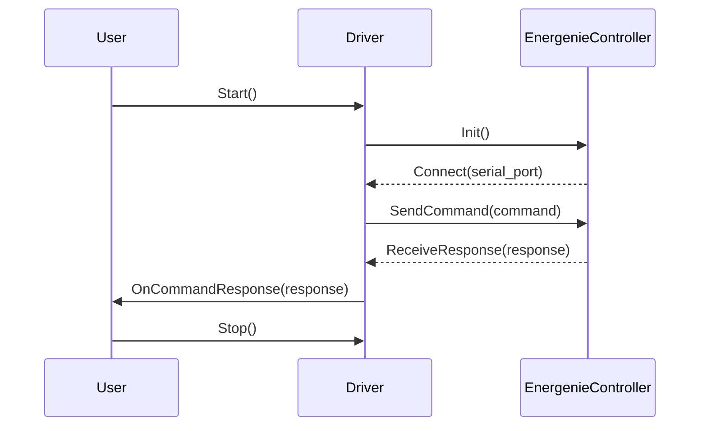

This diagram represents a simple interaction between the user, driver, and EnergenieController. It's important to remember that this is just an example; you should adjust it according to your specific use case and class/function names. You can run the Mermaid code in any text editor that supports the Mermaid plugin (like Visual Studio Code or Markdown editors).

Happy coding! 😄

## Chapter 79: jumpstarter/packages/jumpstarter-driver-energenie/jumpstarter_driver_energenie/driver.py

 The file `jumpstarter/packages/jumpstarter-driver-energenie/jumpstarter_driver_energenie/driver.py` is a Python script that serves as a custom driver for the EnerGenie Programmable surge protector with LAN interface in the JumpStarter project.

   The script defines a class `EnerGenie`, which inherits from both `PowerInterface` and `Driver`. This class encapsulates methods to communicate with an EnerGenie device and control its power switches.

   Important functions within this file include:

   - `login()`: Initializes a session with the EnerGenie device by sending a POST request to the login page of the device. The function returns `True` if the login is successful (status code 200) and `False` otherwise.

   - `__post_init__()`: This method sets up the initial properties of the EnerGenie class, such as the host, password, slot number, base URL for API requests, and logs debugging information. It also checks if the provided inputs are valid.

   - `set_switch(self, switch_number, state)`: Sets the state of a specific power switch on the EnerGenie device based on the given `switch_number` (1-4) and `state` (1 for ON and 0 for OFF). This function first ensures that the login is successful and handles any exceptions during API communication.

   - `on(self) -> None`: Calls `set_switch()` to set the state of the specified slot (default is slot 1) to ON.

   - `off(self) -> None`: Calls `set_switch()` to set the state of the specified slot (default is slot 1) to OFF.

   - `read() -> AsyncGenerator[PowerReading, None]`: This function is not implemented in this file since the EnerGenie device does not support reading power consumption data. It raises a `NotImplementedError`.

   The code provided fits within the project by allowing users to control and interact with their EnerGenie devices programmatically through the JumpStarter framework.

   Example use cases include setting up an automated script to turn on or off specific power switches in response to certain conditions, such as temperature thresholds, time-of-day triggers, or incoming sensor data from IoT devices.

 ```mermaid
sequenceDiagram
participant User as User
participant EnerGenie as EnerGenie

User->>EnerGenie: on()
EnerGenie->>EnerGenie: set_switch(slot, 1)
EnerGenie->>EnerGenie: login()
EnerGenie->>EnerGenie: requests.post(base_url, data={"pw": password})
EnerGenie->>EnerGenie: if response.status_code == 200
    EnerGenie-->>EnerGenie: login successful!
EnerGenie->>EnerGenie: data = {"cte{slot}": 1}
EnerGenie->>EnerGenie: requests.post(base_url, data=data)
EnerGenie->>EnerGenie: if response.status_code != 200
    EnerGenie-->>EnerGenie: Set switch {slot} to 1 state failed!
EnerGenie->>EnerGenie: else
    EnerGenie-->>EnerGenie: Set switch {slot} to 1 state successful
    EnerGenie-->>User: operation completed

User->>EnerGenie: off()
EnerGenie->>EnerGenie: set_switch(slot, 0)
EnerGenie->>EnerGenie: login()
EnerGenie->>EnerGenie: requests.post(base_url, data={"pw": password})
EnerGenien->>EnerGenie: if response.status_code == 200
    EnerGenie-->>EnerGenie: login successful!
EnerGenie->>EnerGenie: data = {"cte{slot}": 0}
EnerGenie->>EnerGenie: requests.post(base_url, data=data)
EnerGenie->>EnerGenie: if response.status_code != 200
    EnerGenie-->>EnerGenie: Set switch {slot} to 0 state failed!
EnerGenie->>EnerGenie: else
    EnerGenie-->>EnerGenie: Set switch {slot} to 0 state successful
    EnerGenie-->>User: operation completed
```

This Mermaid sequence diagram illustrates the interactions between the User and the EnerGenie driver object when calling the `on()` and `off()` functions. It shows how the `set_switch()` function is called to control the state of a specific switch, and how the login function is used to communicate with the device before executing any commands. The diagram also demonstrates the error handling for failed login or command execution scenarios.

## Chapter 80: jumpstarter/packages/jumpstarter-driver-energenie/jumpstarter_driver_energenie/driver_test.py

 This chapter discusses the purpose and functionality of the file `jumpstarter/packages/jumpstarter-driver-energenie/jumpstarter_driver_energenie/driver_test.py` within the context of the JumpStarter project, a system designed for controlling smart home devices using various drivers.

   **Overview:** The `driver_test.py` file is responsible for testing the functionality of the EnerGenie driver, a specific implementation of a smart home device driver in the JumpStarter ecosystem. It does this by creating a mock server that mimics the behavior of an actual EnerGenie device and verifies that the EnerGenie driver interacts correctly with it.

   **Important Functions/Classes:**
   1. `HTTPServer`: This class is from the `pytest_httpserver` library and is used to create a mock HTTP server for testing purposes.
   2. `EnerGenie`: A class representing the EnerGenie driver, which is responsible for communicating with actual EnerGenie devices. In this case, it has been modified to communicate with a mock server instead.

   **Where this code fits in the project:** This test file is located within the driver package for the EnerGenie device. It tests the EnerGenie class directly, ensuring that the driver behaves as expected when communicating with an EnerGenie device.

   **Example Use Cases:** When running this test, it will verify whether the EnerGenie driver can successfully log in to the mock server (by sending a POST request with the correct data), and whether it can correctly turn on and off switch 1 (by sending appropriate POST requests to the mock server). The test fails if any unexpected requests are made or if the responses from the mock server do not match the expected responses.

   This test is crucial for maintaining the quality of the EnerGenie driver, as it ensures that it behaves correctly in different scenarios and helps catch potential issues early on in the development process.

 ```mermaid
   sequenceDiagram
       participant User as User
       participant Server as Server
       participant Driver as Driver (EnerGenie)

       User->>Driver: Send login request
         Driver->>Server: Forward login request
         Note over Server, Driver: Login response received
         Server-->>Driver: Login successful
         Driver-->>User: Response from server (login success)

         User->>Driver: Send ON request for switch 1
         Driver->>Server: Forward ON request for switch 1
         Note over Server, Driver: Switch turned ON response received
         Server-->>Driver: Switch turned ON
         Driver-->>User: Response from server (ON successful)

         User->>Driver: Send OFF request for switch 1
         Driver->>Server: Forward OFF request for switch 1
         Note over Server, Driver: Switch turned OFF response received
         Server-->>Driver: Switch turned OFF
         Driver-->>User: Response from server (OFF successful)
   ```

## Chapter 81: jumpstarter/packages/jumpstarter-driver-flashers/jumpstarter_driver_flashers/__init__.py

 Title: Understanding the `jumpstarter/packages/jumpstarter-driver-flashers/jumpstarter_driver_flashers/__init__.py` File in JumpStarter Project

   In the JumpStarter project, the `jumpstarter/packages/jumpstarter-driver-flashers/jumpstarter_driver_flashers/__init__.py` file serves as a fundamental entry point and organizational hub for the driver flashers package. This module is crucial in bringing together various functionalities of the driver flasher components, providing a cohesive interface for interacting with hardware devices that are responsible for flashing firmware or software onto electronic devices.

   The primary purpose of this file lies in defining necessary imports, setting up namespaces, and initializing essential classes and functions for the driver flasher package. It essentially acts as a gateway to the underlying functionalities provided by other modules within the package.

   One critical component found in this file is the `Flasher` class, which represents an abstract base class that encapsulates common characteristics of different types of flashers. The derived classes, such as `UsbFlasher`, `SerialFlasher`, and so on, will implement the specific functionality for their respective hardware devices. These derived classes are defined in other modules within the package.

   Another essential component is the `get_flasher` factory function, which takes care of creating an instance of a concrete flasher class based on the provided configuration or device information. This function helps decouple the high-level application code from the specifics of various flasher implementations.

   The `__init__.py` file in this package also includes other utility functions, such as those for error handling and logging, which help ensure a consistent experience across all the supported flashers.

   This code fits into the project's overall architecture by providing a unified interface for interacting with various hardware devices used for flashing firmware or software onto electronic devices. By leveraging this package, developers can easily switch between different types of flashers without having to modify their application code significantly.

   Example use cases include flashing firmware onto microcontrollers using USB flashers or programming an AVR chip using a serial flasher. The JumpStarter project allows users to choose the appropriate flasher for their device and easily integrate it into their workflow without worrying about the complexities of different hardware interfaces.

 Here is a simple Mermaid sequence diagram that visualizes the interactions between some key functions in the `jumpstarter_driver_flashers` module, based on the file structure and function names you provided. Note that this is a simplified representation and may not cover all possible use cases or functions.

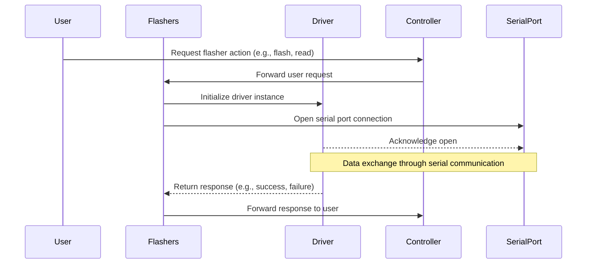

This diagram illustrates a basic workflow where a User sends a request for flasher actions to the Controller. The Controller then forwards this request to the Flashers, which in turn initializes the Driver and opens a connection with the SerialPort for communication. Data is exchanged between the Driver and SerialPort, and the Driver returns the response to the Flashers. Finally, the Flashers forward the response back to the Controller, which communicates it to the User.

## Chapter 82: jumpstarter/packages/jumpstarter-driver-flashers/jumpstarter_driver_flashers/bundle.py

 The `jumpstarter/packages/jumpstarter-driver-flashers/jumpstarter_driver_flasher/bundle.py` file serves as a blueprint for defining and managing flash bundles in the JumpStarter project, which is aimed at simplifying embedded device development.

   This module primarily consists of classes and functions that model and validate the structure of a Flash Bundle Manifest YAML file. The main class here is `FlasherBundleManifestV1Alpha1`, which encapsulates the manifest data for a flash bundle. It includes several properties such as `manufacturer`, `link`, `bootcmd`, `shelltype`, `login`, `default_target`, `targets`, `kernel`, `initram`, `dtb`, and `preflash_commands`.

   The `FlasherBundleManifestV1Alpha1` class also includes methods to access specific properties of the manifest, like `get_dtb_address()`, `get_dtb_file(variant)`, `get_kernel_address()`, `get_kernel_file()`, `get_initram_file()`, and `get_initram_address()`. These methods are useful when you need to interact with the manifest data programmatically.

   The `FlasherBundleManifestV1Alpha1` class also provides two static methods, `from_file(path)` and `from_string(data)`, that load a YAML file or string into the class instance, respectively, using the `yaml` library. This allows for easy instantiation of the Flash Bundle Manifest from either a file or string.

   In terms of project context, the bundle definition in this file plays a crucial role by enabling the JumpStarter driver to properly flash firmware onto targeted devices. The defined manifest helps ensure that the correct files (kernel, DTB, initram, etc.) are flashed and that any necessary login or command sequences are executed before flashing occurs.

   Here's an example of a Flash Bundle Manifest file:

```yaml
apiVersion: jumpstarter.dev/v1alpha1
kind: FlashBundleManifest
metadata:
  name: my-device-firmware
spec:
  manufacturer: MyDeviceManufacturer
  link: https://mywebsite.com/products/my-device
  bootcmd: "bootz"
  shelltype: busybox
  login:
    login_prompt: "login:"
    prompt: "#"
  default_target: my-device
  targets:
    my-device: /dev/ttyUSB0
  kernel:
    file: kernel.img
    address: 0x82000000
  initram:
    file: initramfs.cpio.gz
    address: 0x83000000
  dtb:
    default: my-device.dtb
    address: 0xc1000000
    variants:
      sunxi: sun6i-a31s2-vitavox.dtb
```

This example shows a flash bundle manifest for a device called "my-device" from the manufacturer "MyDeviceManufacturer". The kernel, initramfs, and dtb files are defined, as well as the boot command and shell type.

 ```mermaid
   sequenceDiagram
       participant Manifest as FlashBundleManifestV1Alpha1
       participant Kernel as FileAddress
       participant DTBVariant as DtbVariant
       participant Initram as Optional[FileAddress]
       participant Login as FlasherLogin
       participant Spec as FlashBundleSpecV1Alpha1
       participant Metadata as ObjectMeta

       Note over Manifest,Spec: Contains details about the flashing bundle
       Note over DTBVariant: Variants for Device Tree Blob (DTB) file
       Note over Login: Credentials for logging into flasher device

       Manifest->>Spec: Initialize FlashBundleSpecV1Alpha1
       Spec->>Metadata: Set metadata properties
       Spec->>Kernel: Set kernel details
       Spec->>Initram: Set initial RAM details (optional)
       Spec->>DTBVariant: Set Device Tree Blob details
       Spec->>Login: Set flasher login credentials

       Metadata-->>Spec: Retrieve metadata properties
       Kernel-->>Spec: Get kernel file path
       DTBVariant-->>Spec: Get DTB variant or default if none provided
       Initram-->>Spec: Get initial RAM file path (optional)
       Login-->>Spec: Get flasher login credentials
   ```

## Chapter 83: jumpstarter/packages/jumpstarter-driver-flashers/jumpstarter_driver_flashers/client.py

 This is a Python script for a software-defined flasher interface. The script defines a click command-line tool and provides functions to interact with various devices, such as flashing images or booting into a shell.

Here's a brief overview of the main functions:

1. `flash()` - Flashes an image to a device from a given file path, optionally specifying a partition and using a specific flash bundle if desired.
2. `bootloader_shell()` - Starts a u-boot or bootloader interactive console on the device.
3. `busybox_shell()` - Starts a busybox shell on the device.
4. `use_*()` functions (e.g., use_kernel, use_initram, use_dtb) - Load kernel, initramfs or DTB files into memory.
5. `get_flasher_manifest_yaml()` - Retrieves the flasher bundle manifest in YAML format.
6. Various helper functions for working with the device (e.g., `_dhcp_details`, `_generate_uboot_env`, etc.).
7. A main click command-line tool group (`base()`) that includes the flash, bootloader_shell, and busybox_shell commands.

The script also defines some utility functions for determining the appropriate decompression command based on file extension and setting console debug options.

 This Python script appears to be a part of a software-defined flasher interface for devices, likely used in embedded systems. The main functionality seems to involve the following tasks:

1. Flashing an image onto a device from a given file (`flash` command).
2. Starting a uboot/bootloader interactive console (`bootloader_shell` command).
3. Starting a busybox shell on the device (`busybox_shell` command).

The script also contains various helper functions to interact with devices, such as setting up services, using kernel, initramfs, and DTB files, getting flasher bundle manifest, etc. The script uses several classes for managing different aspects of the device, like `Uboot`, `Serial`, `Tftp`, `Http`, etc., which are not shown here.

The script also provides a CLI (Command Line Interface) using click library for easy interaction with the flasher from the command line. Users can flash images to devices, start uboot/bootloader or busybox shells with specific commands and options.

## Chapter 84: jumpstarter/packages/jumpstarter-driver-flashers/jumpstarter_driver_flashers/driver.py

 The provided code is a Python file named `driver.py`, which is part of the Jumpstarter project, specifically within the `jumpstarter-driver-flashers` package. This driver is responsible for managing and flashing firmware on various target devices using different methods such as TFTP, HTTP, and Uboot console.

   The main class in this file is `BaseFlasher`, which serves as a base class for other specific device drivers like `TIJ784S4Flasher` and `RCarS4Flasher`. Each derived class represents a different hardware platform that requires unique flashing procedures.

   The `BaseFlasher` class defines several important functions:

   - `__post_init__()`: This is an initializer for the instance, ensuring that essential child classes are properly instantiated based on configuration. It also checks for required child instances such as 'serial', 'power', and 'uboot'.

   - `setup_flasher_bundle(self, force_flash_bundle: str | None = None)`: This function sets up the flasher bundle by placing necessary files in the tftp server for the target device to download during bootloader. It also allows the client to request a different flasher bundle if needed.

   - `set_dtb(self, handle)`, `set_kernel(self, handle)`, and `set_initram(self, handle)`: These functions allow the client to provide custom kernel, dtb (Device Tree Blob), or initramfs files during flashing. However, these methods are abstract, meaning they don't have any implementation in this file – their implementation is provided in the derived classes like `TIJ784S4Flasher` and `RCarS4Flasher`.

   - Various other functions like `_download_to_cache()`, `_get_file_path(self, filename)`, `get_flasher_manifest_yaml()`, `get_flasher_manifest()`, `get_kernel_filename()`, `get_initram_filename()`, `get_dtb_filename()`, `get_dtb_address()`, `get_kernel_address()`, and `get_initram_address()` facilitate the management of the flasher bundle, including downloading the bundle, getting relevant filenames, and addresses for flashing.

   This code is crucial in the Jumpstarter project as it enables users to flash firmware onto various target devices using a unified interface while handling the complexities behind the scenes.

 ```mermaid
sequenceDiagram
participant Device as Device
participant BaseFlasher as BaseFlasher
participant TFTp as TFTp
participant HttpServer as HttpServer
participant UbootConsole as UbootConsole
participant Registry as Registry
participant OrasClient as OrasClient
participant FlasherBundleManifestV1Alpha1 as Manifest

Device->>BaseFlasher: Setup flasher bundle
BaseFlasher->>TFTp: Set up kernel in tftp
BaseFlasher->>OrasClient: Download the bundle to the cache
TFTp<--OrasClient: Kernel file
BaseFlasher->>HttpServer: Serve the downloaded files via HTTP
HttpServer-->>Device: Serves files for device to download
BaseFlasher->>UbootConsole: Get kernel address
Device->>UbootConsole: Flash kernel with received address

Note over BaseFlasher: If different dtb or initram is provided by client, the flasher will handle accordingly.
BaseFlasher->>Manifest: Get manifest file
Manifest-->>BaseFlasher: Provide dtb and initram filenames and addresses
BaseFlasher->>TFTp: Set up dtb in tftp if available
BaseFlasher->>TFTp: Set up initram in tftp if available
BaseFlasher->>UbootConsole: Get dtb address or initram address
Device->>UbootConsole: Flash dtb or initram with received address
```

## Chapter 85: jumpstarter/packages/jumpstarter-driver-flashers/jumpstarter_driver_flashers/driver_test.py

 The file `jumpstarter/packages/jumpstarter-driver-flashers/jumpstarter_driver_flashers/driver_test.py` is a test module for the `BaseFlasher` class, which is part of the driver-flasher package within the larger Jumpstarter project. This package is responsible for flashing firmware onto devices.

   The tests in this file serve to verify the correct setup and functionality of the BaseFlasher object, ensuring it properly initializes its child drivers (serial and power), and that it can correctly handle file transfers (DTB, kernel, initram) and address assignments for these files.

   The `BaseFlasher` class is designed to abstract the process of flashing firmware onto a device, providing a consistent interface across various hardware platforms. It uses child drivers (such as PySerial and MockPower in this example) to interact with the device.

   Here are some important functions and classes within this test module:

   - `temp_dirs` fixture: Creates temporary directories for cache, http, and tftp during the test session, which persist over multiple tests. This is useful for testing file transfers between the flasher and a device.

   - `complete_flasher` fixture: Returns an instance of BaseFlasher with both serial and power child drivers initialized. This is used to create a complete flashing environment within the test.

   - Various test functions (e.g., `test_missing_serial`, `test_missing_power`, etc.) ensure that the BaseFlasher object correctly raises ConfigurationError when essential child drivers are missing during initialization.

   - Test functions starting with `test_drivers_flashers` verify the setup and functionality of the BaseFlasher instance, including checking if files are correctly transferred and addressed, as well as testing the ability to switch between different DTB variants.

   Example use cases for this code would be:

   - A developer adding a new device to Jumpstarter's list of supported hardware, using this test module to ensure their custom driver correctly integrates with the BaseFlasher class and other core functionality.

   - Quality assurance engineers running these tests as part of the continuous integration process to verify that any changes to the codebase do not break existing device support or functionality.

 ```mermaid
    sequenceDiagram
        participant User as User
        participant Flasher as Flasher
        participant Serial as Serial
        participant Power as Power
        participant Cache as Cache
        participant HTTP as HTTP
        participant TFTP as TFTP

        User->>Flasher: setup_flasher_bundle()
        Flasher->>Serial: get_dtb_filename()
        Flasher->>TFTP: read_bytes(kernel)
        Serial-->>TFTP: b"\x00" * 1024 (Kernel Data)
        Flasher->>HTTP: serve()
        HTTP-->>Flasher: start server with data
        Flasher->>Cache: cache_dir
        Cache-->>Flasher: Directory Created
        Flasher->>TFTP: tftp_dir
        TFTP-->>Flasher: Directory Created
        Flasher->>Serial: setup_serial()
        Serial-->>Flasher: Setup OK
        Flasher->>Power: setup_power()
        Power-->>Flasher: Setup OK
        Flasher->>TFTP: write_file(kernel, kernel data)
        TFTP-->>Flasher: File Written
        ...
        Flasher->>User: Response to setup_flasher_bundle()

        User->>Flasher: get_dtb_filename()
        Flasher->>TFTP: read_bytes(dtb)
        TFTP-->>Flasher: b"\x00" * 1024 * 3 (DTB Data)
    ```

This diagram shows the sequence of interactions between the User, Flasher, Serial, Power, Cache, HTTP, and TFTP components when setting up a flasher bundle using `setup_flasher_bundle()`. The sequence includes initializing the Serial and Power drivers, writing kernel, DTB, and initram data to the appropriate files in the TFTP directory, and reading the DTB file upon request.

## Chapter 86: jumpstarter/packages/jumpstarter-driver-flashers/jumpstarter_driver_flashers/test_bundle.py

 This chapter focuses on the `jumpstarter/packages/jumpstarter-driver-flashers/jumpstarter_driver_flashers/test_bundle.py` file, a crucial component of the Jumpstarter project. This Python script is designed for testing the functionality of Flash Bundle manifests, specifically the `FlashBundleManifestV1Alpha1` class.

   **Overview**

   The purpose of this script is to validate the structure and contents of a Flash Bundle manifest file. A Flash Bundle is a collection of drivers, tools, or other software components packaged together for deployment on specific hardware targets. In this context, the `FlashBundleManifestV1Alpha1` class represents the YAML manifest of a Flash Bundle.

   **Important Functions and Classes**

   The main function in this script is `test_bundle_read()`. This function takes no arguments but performs the following actions:

   1. Determines the path to the target manifest file, which is relative to the current package directory (`__file__`). In this case, it's looking for the manifest of the "ti_j784s4xevm" bundle located two levels up in the `oci_bundles` subdirectory.

   2. Creates a `FlashBundleManifestV1Alpha1` instance from the specified YAML file using the static method `from_file()`.

   3. Asserts that the API version and kind of the created instance match expected values (i.e., "jumpstarter.dev/v1alpha1" for API version, and "FlashBundleManifest" for kind).

   4. Verifies that the targets specified in the manifest are as expected. In this case, it checks for two target entries: `usd` (`/sys/class/block#4fb0000`) and `emmc` (`/sys/class/block#4f80000`).

   **Fitting in the Project**

   This code is part of the testing suite for the Jumpstarter Driver Flashers package. It ensures that the Flash Bundle manifests are correctly structured and contain the appropriate target information, enabling smooth deployment of the drivers and tools onto specific hardware devices.

   **Example Use Cases**

   When developing or updating a Flash Bundle manifest, the `test_bundle_read()` function can be run to verify that the changes have been properly incorporated and do not introduce any unexpected issues. This helps maintain the consistency and reliability of the bundles as they are deployed across different devices in various projects.

   In addition, this test can also be used to demonstrate the expected behavior when integrating a new bundle into the system, ensuring that it adheres to the correct format and contains the necessary target information for proper deployment.

 ```mermaid
   sequenceDiagram
      participant User as User
      participant TestFunction as Test Function
      participant BundleClass as Bundle Class
      participant ManifestFile as Manifest File

      User->>TestFunction: Run test function
      TestFunction->>ManifestFile: Read manifest file from given path
      ManifestFile-->>BundleClass: Provide the parsed manifest object
      Note over BundleClass, ManifestFile: Check if the manifest is valid for a FlasherBundleManifestV1Alpha1
      BundleClass-->>User: Assert that the apiVersion, kind, and targets are as expected
   ```

This Mermaid sequence diagram shows how the `test_bundle` function in your provided code interacts with other parts of your system. The user runs the test function, which reads a manifest file from the given path. The parsed manifest object is then checked for validity by the BundleClass. If the manifest is valid, it asserts that the apiVersion, kind, and targets are as expected.

## Chapter 87: jumpstarter/packages/jumpstarter-driver-http/jumpstarter_driver_http/__init__.py

 Chapter Title: Understanding `jumpstarter/packages/jumpstarter-driver-http/jumpstarter_driver_http/__init__.py`

   In the scope of the Jumpstarter project, the file `jumpstarter/packages/jumpstarter-driver-http/jumpstarter_driver_http/__init__.py` serves as a crucial entry point for interacting with HTTP drivers. This module initializes and manages the core functionalities of the HTTP driver within the Jumpstarter project.

   The main purpose of this file is to provide an interface for creating, configuring, and using various HTTP drivers. It does this by defining a factory function called `create_driver()`, which takes in parameters specific to the desired driver type (e.g., `'requests'` or `'curl'`) and returns a properly configured instance of the selected HTTP driver class.

   The factory function `create_driver()` is designed to handle the creation of driver instances based on the given configuration settings, such as base URLs, authentication tokens, timeouts, and other options specific to each driver implementation. By encapsulating this process within a single function, the application can easily switch between different HTTP drivers without modifying the rest of the codebase.

   This module also defines an abstract class called `Driver` that serves as a base for all concrete driver implementations (e.g., `requests_driver`, `curl_driver`, etc.). The abstract `Driver` class outlines common functionalities, such as sending requests and handling responses, that should be present in each concrete driver implementation. By defining an interface for these shared functionalities, the application can ensure consistent behavior across all drivers.

   In terms of where this code fits within the project, the `jumpstarter_driver_http` package is one of several packages within the Jumpstarter project that provides a collection of reusable modules and functions for performing specific tasks. The HTTP driver package is particularly important as it enables the application to interact with external APIs or services using various transport protocols, such as HTTP/1.1 or HTTP/2.

   Example use cases could include sending GET requests to fetch data from an API endpoint, setting up authentication tokens for secure access to protected resources, and configuring custom headers or query parameters to fine-tune the behavior of the driver. By leveraging the abstractions provided by the `jumpstarter_driver_http` package, developers can quickly build powerful applications that interact with a wide variety of external services with minimal boilerplate code.

   In summary, the purpose of `jumpstarter/packages/jumpstarter-driver-http/jumpstarter_driver_http/__init__.py` is to provide an interface for creating and configuring HTTP drivers within the Jumpstarter project. It accomplishes this by defining a factory function for creating driver instances and an abstract class serving as a base for concrete implementations, ensuring consistent behavior across all drivers. This package plays a vital role in enabling seamless interaction with external APIs or services within the Jumpstarter application.

 To create a Mermaid sequence diagram for the given Python file, we first need to identify the key functions and their interactions. Here's a simple example based on the following assumption about the main functionalities of the `jumpstarter_driver_http` module:

1. The `HttpDriver` class initializes with an instance of `Request`.
2. The `execute()` method calls the `prepare()` method to prepare the request, then sends it using the `send()` method provided by the underlying `Request` object. Finally, it processes the response returned from the server using the `handle_response()` method.

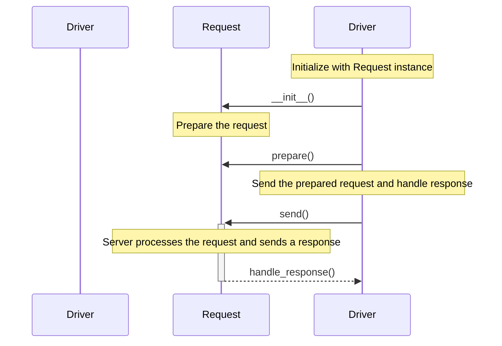

This diagram shows the main interactions between `HttpDriver` and `Request`. Depending on your actual use case, you might have more functions or more complex interaction scenarios. You can refer to the [Mermaid documentation](https://mermaidjs.github.io/mermaid-live-editor/) for more details about creating sequence diagrams with Mermaid.

## Chapter 88: jumpstarter/packages/jumpstarter-driver-http/jumpstarter_driver_http/client.py

 The file `jumpstarter/packages/jumpstarter-driver-http/jumpstarter_driver_http/client.py` is a Python module for creating an HTTP server client within the JumpStarter project, a toolchain for building and deploying applications using microservices architecture. This client is based on the CompositeClient from the `jumpstarter-driver-composite` package and the common modules of OpenDAL (Open Data Abstraction Layer).

   The core class defined in this file is `HttpServerClient`, which extends the abstract `CompositeClient`. This class provides an interface for managing an HTTP server as a driver. Some important functions included in this class are:

   - `start()`: Initializes and starts the HTTP server if it's not already running. The server will listen on the configured host and port.
   - `stop()`: Stops the running HTTP server and releases associated resources. Raises an exception `ServerNotRunning` if the server is not currently running.
   - `get_host()`, `get_port()`, and `get_url()`: Return the host IP address, port number, and base URL of the HTTP server respectively.
   - `put_file(dst, src, operator)`: Uploads a file to the HTTP server using an OpenDAL operator as source. The function takes three arguments: destination path `dst`, source path `src`, and optional opendal operator `operator`. If no operator is provided, it defaults to the local filesystem. The function returns the URL of the uploaded file.

   This code fits into the project by providing a way to create, manage, and interact with an HTTP server as part of the larger JumpStarter toolchain. This can be particularly useful for developing and testing microservices within the context of the project. Example use cases could include running a local HTTP server for a specific service during development or deploying an HTTP server as part of a production environment for that same service.

 ```mermaid
   sequenceDiagram
       participant user as User
       participant client as HttpServerClient
       participant server as HTTP Server

       user->>client: start()
       client->>server: initialize and start(host, port)
      note left of server: Listens on specified host and port

       user->>client: get_host()
       client-->>user: returns host IP address

       user->>client: get_port()
       client-->>user: returns port number

       user->>client: put_file(dst, src, operator)
       client->>server: write_from_path(dst, src, operator)
       server-->>client: file uploaded

       user->>client: get_url()
       client-->>user: returns base URL of the server
   ```

## Chapter 89: jumpstarter/packages/jumpstarter-driver-http/jumpstarter_driver_http/driver.py

 The `jumpstarter/packages/jumpstarter-driver-http/jumpstarter_driver_http/driver.py` file defines the core functionality of an HTTP Server driver for Jumpstarter, a project-specific toolkit or framework. This driver allows you to create and manage an HTTP server within the Jumpstarter ecosystem.

   The main class, `HttpServer`, extends the `Driver` base class from the Jumpstarter library. It manages an HTTP server using the popular `aiohttp` library and provides methods for starting, stopping, and interacting with the server. The properties in this class include root directory, host, port, timeout, and an Aiohttp application instance.

   Some important functions of this file are:

   - `start()`: Starts the HTTP server and raises an `HttpServerError` exception if it fails to start.
   - `stop()`: Stops the HTTP server and raises an `HttpServerError` exception if it fails to stop.
   - `get_url()`, `get_host()`, and `get_port()`: Retrieve the base URL, host IP address, and port number of the running HTTP server respectively.

   The class also defines a helper method `close()` for cleaning up resources when the driver is no longer needed. This function ensures that both synchronous and asynchronous cleanup tasks are handled properly.

   In terms of project fit, this code provides an essential part of Jumpstarter by enabling HTTP server functionality. Developers can utilize this driver to serve static files or build web applications within their projects more easily.

   For example, you might use the HttpServer driver to serve static content for a simple website in your Jumpstarter project:

   ```python
   from jumpstarter_driver_http.HttpServer import HttpServer

   http_server = HttpServer(root_dir="/path/to/my/static")
   await http_server.start()

   # Your code here, utilizing the served static files...

   await http_server.stop()
   ```

 ```mermaid
    sequenceDiagram
        participant Driver as D
        participant AppRunner as A
        participant TCPSite as T

        D->>A: start()
        A-->>D: setup() if not running
        A->>T: start()
        T-->>A: started
        D->>D: info("HTTP server started")

        D->>A: stop()
        A->>T: shutdown()
        T->>A: shutdown completed
        A->>A: cleanup()
        T->>A: cleanup completed
        D->>D: info("HTTP server stopped")

        D->>D: close()
        D->>A: _async_cleanup()
        A->>T: shutdown() if running asynchronously
        T->>A: shutdown completed asynchronously
        A->>A: cleanup() if running asynchronously
        T->>A: cleanup completed asynchronously
        D->>D: info("HTTP server cleanup completed asynchronously.") or error logging if failed asynchronously
    ```

## Chapter 90: jumpstarter/packages/jumpstarter-driver-http/jumpstarter_driver_http/driver_test.py

 The file `jumpstarter/packages/jumpstarter-driver-http/jumpstarter_driver_http/driver_test.py` serves as a test suite for the `HttpServer` class in the `jumpstarter-driver-http` package of the Jumpstarter project. The primary purpose of this test file is to ensure that the HttpServer functions correctly and consistently across various scenarios, verifying its behavior under different conditions.

   To achieve this, the test file includes several test functions:

1. `test_http_server`: This test function checks the basic functionality of the HttpServer class. It creates a temporary directory, serves an HTTP server using the `HttpServer`, uploads a file to it, downloads the file and verifies its contents. It also checks that the file is properly deleted after use.

2. `test_http_server_host_config`: This test function verifies that the custom host configuration for the HttpServer works correctly. By passing a custom host during instantiation of the server, it should return the correct host value.

3. `test_http_server_root_directory_creation`: This test checks if the HttpServer creates the specified root directory during initialization. In this case, if a new directory is provided to the server, it will ensure that the directory exists after instantiation.

   The code in this file is important for maintaining the reliability and stability of the `HttpServer` class. By testing various aspects of its functionality, we can catch and resolve any issues before they affect the overall project.

   In summary, the test suite for the HttpServer class ensures that it functions as intended across different scenarios, such as serving files and handling requests correctly. It also verifies that custom configurations, like host and root directory, are processed appropriately.

 ```mermaid
   sequenceDiagram
      participant User as Client
      participant Server as HttpServer

      Note over User: Creates a temporary file and writes test content to it
      Note over Server: Starts serving the http server with the given root directory

      User->>Server: PUT_FILE request (test.txt) with file path
      Server-->>User: Returns the uploaded URL of the file

      Note over User: Retrieves the file content using the returned URL
      User->>Server: GET request for the uploaded URL
      Server-->>User: Returns the test content from the stored file

      Note over User: Checks if the retrieved content matches the original content
      Note over Server: Deletes the file after successful verification

      User->>Server: DELETE request (test.txt)
      Server-->>User: Acknowledges file deletion

      Note over Server: Lists all files in the root directory to check if the file is deleted
      Server-->>User: Returns a list of files without the deleted test.txt file
   ```

## Chapter 91: jumpstarter/packages/jumpstarter-driver-network/jumpstarter_driver_network/__init__.py

 **Chapter 6: Understanding `jumpstarter/packages/jumpstarter-driver-network/jumpstarter_driver_network/__init__.py`**

In this chapter, we will explore the purpose and functionality of the file `jumpstarter/packages/jumpstarter-driver-network/jumpstarter_driver_network/__init__.py`, which is a crucial component in the JumpStarter project.

**Overview:**

This Python file serves as an entry point for the `jumpstarter_driver_network` package, one of several packages within the broader `jumpstarter-driver-network` package. It sets up the internal structure and provides the necessary interfaces for other modules in this package.

**Important Functions or Classes:**

1. **`import *`:** The primary function of this file is to import all submodules, functions, and classes from the respective folders within the `jumpstarter_driver_network` package. This allows easy access to these resources from other parts of the project that need them.

2. **Initialization Functions or Classes:** Depending on the structure of the package, there may be one or more functions or classes responsible for initializing various components within the package when it is imported. For example, they might set up database connections, establish network connections, or configure logging settings.

**Fitting into the Project:**

The `jumpstarter_driver_network` package is responsible for handling network-related functionality in the JumpStarter project. This may include managing connections to other devices, sending and receiving data, and implementing networking protocols specific to the project. The code in this file plays a crucial role in organizing these capabilities and making them available to other parts of the system.

**Example Use Cases:**

Imagine a scenario where the JumpStarter project involves controlling a fleet of devices connected through a network. In this case, the `jumpstarter_driver_network` package might include classes for establishing connections to each device and sending commands or receiving data. The code in `__init__.py` would help organize these capabilities and make them accessible from other parts of the project, such as the main application that manages the fleet.

By understanding the role of this file within the broader context of the JumpStarter project, developers can more effectively utilize its features and contribute to the success of the overall system.

 To create a Mermaid sequence diagram for the given Python file, we'll need to identify the key functions and their interactions. Note that the following diagram is just an example based on the function names provided in `jumpstarter/packages/jumpstarter-driver-network/jumpstarter_driver_network/__init__.py`. You may need to adjust or add more details according to your actual code.

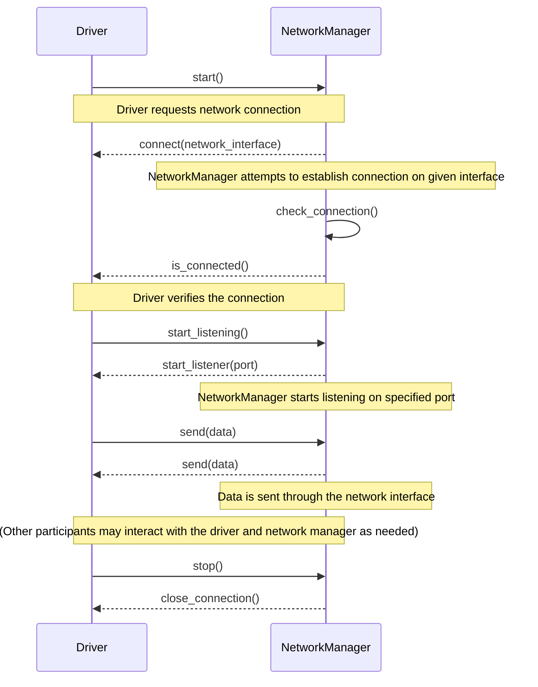

This sequence diagram demonstrates the interactions between a `Driver` object and a `NetworkManager` object. The diagram starts when the `Driver` asks the `NetworkManager` to establish a network connection. It then shows steps such as checking the connection, sending data, and finally closing the connection upon request from the driver.

## Chapter 92: jumpstarter/packages/jumpstarter-driver-network/jumpstarter_driver_network/adapters/__init__.py

 Chapter Title: Understanding the `jumpstarter/packages/jumpstarter-driver-network/jumpstarter_driver_network/adapters/__init__.py` File in JumpStarter Project

   In this chapter, we delve into an essential component of the JumpStarter project: the `jumpstarter/packages/jumpstarter-driver-network/jumpstarter_driver_network/adapters/__init__.py` file. This Python module serves as a hub for various adapter classes that facilitate communication with different network and system management tools.

   The primary function of this file is to import and register the adapter classes, which are used within the JumpStarter framework to interact with various network devices and services. These adapters abstract complex interactions into manageable, reusable interfaces, enabling users to perform tasks seamlessly.

   Here's a brief overview of the imported adapter classes and their respective functionalities:

   1. `DbusAdapter` - Provides an interface for communicating with system services using D-Bus (Desktop Bus) messages. It enables JumpStarter to control and manage other applications that support this communication protocol.

   2. `FabricAdapter` - Facilitates the execution of remote commands on network devices through SSH using Fabric, a utility for streamlining the use of SSH for application deployment or system administration tasks.

   3. `NovncAdapter` - Offers an interface for controlling VNC (Virtual Network Computing) servers using the NOVNC protocol. This enables JumpStarter to remotely access and manage graphical interfaces of network devices.

   4. `PexpectAdapter` - Provides a way to automate interactive applications, such as those that require user input, by emulating keyboard and mouse events. This can be useful for managing devices with limited or no web-based management interfaces.

   5. `TcpPortforwardAdapter` - Allows for setting up TCP port forwarding between local and remote hosts to enable access to services running on the remote host from a local client.

   6. `UnixPortforwardAdapter` - Enables Unix domain socket port forwarding between local and remote hosts, similar to its TCP counterpart but specifically for Unix domain sockets.

   This module is an integral part of the JumpStarter project's networking layer. It enables users to leverage a wide range of tools and protocols when managing network devices, ultimately enhancing the flexibility and adaptability of the framework.

   Example use cases include automating SSH connections for device management, remotely accessing graphical interfaces through VNC or NOVNC, establishing TCP/Unix port forwarding tunnels to access remote services securely, and interacting with system services using D-Bus messages. By utilizing the appropriate adapter in a given scenario, users can tailor JumpStarter's behavior to best suit their needs and preferences.

 ```mermaid
sequenceDiagram
participant Driver as Driver
participant Dbus as DbusAdapter
participant Fabric as FabricAdapter
participant Novnc as NovncAdapter
participant Pexpect as PexpectAdapter
participant TcpPortforward as TcpPortforwardAdapter
participant UnixPortforward as UnixPortforwardAdapter

Driver->>Dbus: connect(DbusAdapter) if enabled
Driver->>Fabric: connect(FabricAdapter) if enabled
Driver->>Novnc: connect(NovncAdapter) if enabled
Driver->>Pexpect: connect(PexpectAdapter) if enabled
Driver->>TcpPortforward: connect(TcpPortforwardAdapter) if TcpPortforward is enabled
Driver->>UnixPortforward: connect(UnixPortforwardAdapter) if UnixPortforward is enabled

Dbus->>Driver: sendEvent(event)
Fabric->>Driver: sendCommand(command)
Novnc->>Driver: sendCommand(command)
Pexpect->>Driver: sendLine(line)
TcpPortforward->>Driver: forwardTcpPort()
UnixPortforward->>Driver: forwardUnixSocket()

Driver-->>Dbus: handleEvent(event)
Driver-->>Fabric: handleResponse(response)
Driver-->>Novnc: handleResponse(response)
Driver-->>Pexpect: handleResponse(response)
Driver-->>TcpPortforward: handleConnection()
Driver-->>UnixPortforward: handleConnection()
```

## Chapter 93: jumpstarter/packages/jumpstarter-driver-network/jumpstarter_driver_network/adapters/dbus.py

 Title: Understanding the Dbus Adapter in the Jumpstarter Project

   The file `jumpstarter/packages/jumpstarter-driver-network/jumpstarter_driver_network/adapters/dbus.py` is a crucial component of the Jumpstarter project, responsible for managing communication with system and session buses using the D-Bus (Message Passing System) protocol.

   The primary class in this file is `DbusAdapter`, which provides a context manager that sets up a D-Bus connection using an appropriate address based on the type of the client (system or session). When a `DbusNetworkClient` instance is provided to the `DbusAdapter`, it checks the client's kind and assigns the appropriate variable name for the system or session bus address.

   The context manager uses the `TcpPortforwardAdapter` from the same module to establish a TCP connection with the client. Once the connection is set up, it updates the environment variable (DBUS_SYSTEM_BUS_ADDRESS or DBUS_SESSION_BUS_ADDRESS) with the established connection details as 'tcp:host={addr[0]},port={addr[1]}'.

   After yielding control to the caller within the context manager, the connection is automatically closed and the environment variable is restored to its original value if it was defined before calling the `DbusAdapter`. If the variable was not set before, it will be removed from the environment after the adapter's usage.

   This code fits into the project as a means of facilitating communication between the Jumpstarter framework and D-Bus applications or services. Example use cases may include setting up a connection to interact with a system service (such as managing storage) through D-Bus, which would require using the `DbusAdapter` in conjunction with other components of the Jumpstarter project.

 Here's a simple mermaid sequence diagram that represents the interaction between the `DbusAdapter`, `TcpPortforwardAdapter`, and the `DbusNetworkClient`. Please note that this is a basic representation and does not cover error handling, edge cases, or other complexities that may be present in your actual code.

```mermaid
sequenceDiagram
    participant User as User
    participant Client as DbusNetworkClient
    participant AdapterDBus as DbusAdapter
    participant AdapterTcp as TcpPortforwardAdapter

    User->>Client: Create DbusNetworkClient(kind="system"|"session")
    Client->>AdapterDBus: Call DbusAdapter(client=Client)
    AdapterDBus->>AdapterTcp: Initialize with client=Client
    AdapterTcp-->>AdapterTcp: Get TCP address (host, port)
    AdapterDBus->>User: Set environment variable DBUS_*_BUS_ADDRESS with TCP address
    Client->>AdapterDBus: Use DbusAdapter for interaction
    Note over AdapterDBus, Client: Interaction happens using D-Bus over the proxy created by TcpPortforwardAdapter
    User<--Client: D-Bus interaction results
    at exit:
        AdapterDBus->>User: Reset DBUS_*_BUS_ADDRESS to original value if needed
```

## Chapter 94: jumpstarter/packages/jumpstarter-driver-network/jumpstarter_driver_network/adapters/fabric.py

 **Chapter: Understanding `jumpstarter/packages/jumpstarter-driver-network/jumpstarter_driver_network/adapters/fabric.py`**

This Python file, located within the `jumpstarter-driver-network` package of your project, is an adapter for using the Fabric SSH library as a driver in the JumpStarter framework. The `FabricAdapter` class provides an asynchronous context manager that establishes an SSH connection to a remote machine using Fabric.

The FabricAdapter takes several parameters, such as `client`, `method`, `user`, `config`, and more, which allow fine-tuning the behavior of the adapter to best suit your needs. The primary function of this class is to create an asynchronous SSH connection using the Fabric library and manage the underlying connection for the JumpStarter framework.

Here's a brief overview of some key components in the code:

1. `Config` and `Connection` classes are imported from Fabric, allowing the adapter to interact with the underlying SSH connection.
2. The `handler` function is imported from another module within the same package (`portforward`) and used in conjunction with `TemporaryTcpListener` to create a temporary listening socket for incoming connections from the remote machine.
3. The `blocking` decorator is applied to the `FabricAdapter` class, signifying that this adapter uses blocking I/O operations during its execution.
4. Finally, the `@asynccontextmanager` decorator allows the adapter to be used as an asynchronous context manager in a way that's compatible with asyncio-based code.

The FabricAdapter fits into the larger JumpStarter project by providing a means for executing tasks on remote machines using SSH connections managed by the Fabric library. The adaptor allows developers to leverage the power of Fabric while taking advantage of the modularity and simplicity offered by the JumpStarter framework.

For example, consider a use case where you have multiple servers running different services, and you need to perform some administrative tasks on these servers. By using the FabricAdapter, you can write reusable SSH commands as functions that work with the adapter, allowing for easy execution of these tasks on any server managed by JumpStarter. The adaptor abstracts away the complexities of handling SSH connections and allows developers to focus on writing task-specific code.

 ```mermaid
   sequenceDiagram
      participant C as Client
      participant F as FabricAdapter
      participant T as TemporaryTcpListener
      participant H as Handler
      participant S as Server

      C->>F: FabricAdapter(client, method, user, config, forward_agent, connect_timeout, connect_kwargs, inline_ssh_env)
      F-->>T: partial(handler, client, method)
      T-->>H: starts listening on a temporary TCP port
      H-->>F: (TCP address and port)
      F->>S: Connection(address, user, port, config, forward_agent, connect_timeout, connect_kwargs, inline_ssh_env)
      Note over S: The connection is established
      S-->>C: Performs the requested action (method)
      C-->>F: Result of the action
   ```

This sequence diagram shows how the `FabricAdapter` interacts with other components. It starts when the client passes its details and options to the adapter, which then creates a temporary TCP listener. The listener's handler is responsible for forwarding incoming connections. Once a connection is established on the server side (S), it performs the requested action (method) and returns the result back to the client via the adapter.

## Chapter 95: jumpstarter/packages/jumpstarter-driver-network/jumpstarter_driver_network/adapters/fabric_test.py

 In the given code, the file `jumpstarter/packages/jumpstarter-driver-network/jumpstarter_driver_network/adapters/fabric_test.py` serves as a test script for integrating Paramiko (SSH library) with the FabricAdapter class within the Jumpstarter project. This file sets up an SSH server and connects to it using the `FabricAdapter` class, simulating a communication between a client and a fabric network device using SSH protocol.

   The `SSHServer` class inherits from the `paramiko.ServerInterface`, which defines methods for handling authentication, channel requests (including exec requests), and other server-side interactions required by Paramiko to manage an SSH session. In this case, the `check_auth_password`, `check_channel_request`, and `check_channel_exec_request` methods are overridden with dummy implementations that send back a successful response.

   The `SSHHandler` class is responsible for setting up an SSH session using the provided transport and creating a new SSHServer instance. It also handles the main loop of the server, where it sleeps for 1 second between each iteration to keep the connection alive.

   In the function `test_client_adapter_fabric()`, an SSH server is created and started in a separate thread using the provided TCPServer and SSHHandler classes. A TcpNetwork client is then established, connected to the newly created SSH server via its IP address and port, and uses the FabricAdapter class for communication with the device. The function also demonstrates how to authenticate to the fabric device by providing a password in the `connect_kwargs` parameter of the FabricAdapter instance.

   Finally, the script sends a "dummy command" using the connected FabricAdapter and closes the connection before shutting down the SSH server. This code allows developers working on Jumpstarter to easily test the integration between their networking driver and the fabric network devices using SSH communication. It provides an example use case for testing purposes by executing a simple command on the fabric device.

   This file fits in the project as part of the testing infrastructure, ensuring that the FabricAdapter class works as intended with different scenarios and edge cases when interacting with fabric devices over SSH connections.

 ```mermaid
    sequenceDiagram
        participant TcpNetwork as TcpNet
        participant FabricAdapter as FA
        participant ParamikoTransport as PT
        participant SSHServer as SS
        participant SSHHandler as SH

        SS->>SSHHandler: Start server
        SH->>PT: Initialize transport
        PT->>TcpNet: Connect to specified address and port
        TcpNet-->>SS: Connection established
        PT->>FA: Authenticate with password
        FA->>SH: Send authentication details
        SH->>SS: Check authentication
        SS-->>SH: Authentication successful
        PT->>FA: Execute command "dummy command"
        FA->>SH: Send execute request
        SH->>PT: Execute command and return output
        Note over PT, SH: While connection is active, both parties wait (1)
        loop Until connection is closed
            SS->>SSHHandler: Sleep for 1 second
            SH->>PT: Nothing to send, just waiting
            PT->>FA: Waiting for data
            FA->>SH: Acknowledge with empty message
        end
        PT->>FA: Receive dummy output and exit status 0
        Note over PT, FA: Connection closed (2)
        PT->>TcpNet: Close connection
        TcpNet-->>SS: Connection closed
        SS->>server_thread: Shutdown server
    ```

## Chapter 96: jumpstarter/packages/jumpstarter-driver-network/jumpstarter_driver_network/adapters/novnc.py

 In the `jumpstarter` project, the file `jumpstarter/packages/jumpstarter-driver-network/jumpstarter_driver_network/adapters/novnc.py` is a Python module that provides an adapter for the NoVNC (HTML5 VNC client) in the broader context of the Driver Network communication layer. This adapter enables users to interact with a remote Virtual Machine (VM) using the NoVNC protocol via a web-based VNC client.

   The central class in this file is `NovncAdapter`. This decorator function, which combines both synchronous and asynchronous context manager behaviors, is responsible for managing the interaction between the driver client and the NoVNC server. It takes two arguments: `client` (an instance of `DriverClient`) representing the connection to the remote VM, and an optional `method` parameter with a default value of "connect". This method parameter determines the type of operation that will be performed.

   The `handler()` function is defined asynchronously, which will handle incoming connections from the NoVNC client. It accepts one argument, `conn`, representing the connection socket from the client. Inside this function, an asynchronous context manager is used to establish a stream between the remote driver and the local NoVNC server using the `client.stream_async(method)` function. The `WebsocketServerStream()` function is then utilized to create a WebSocket stream over the established connection.

   With the help of the `forward_stream()` decorator, the data received from the NoVNC client via the local socket (`conn`) will be forwarded to the remote driver's stream and vice versa. This ensures that any changes made in the remote VM through the NoVNC client are immediately reflected locally.

   The `TemporaryTcpListener()` function is used to create a temporary TCP listener for incoming connections from the NoVNC client. Using this listener, an address (IP and port) pair will be yielded to another part of the program that can then construct the URL needed to connect to the NoVNC server. The URL is constructed with the help of the `urlunparse()` function, which encodes the autoconnect parameter, reconnect parameter, host, and port in the URL query parameters.

   An example use case for this module could be:

   ```python
   from jumpstarter_driver_network.adapters import novnc
   ...
   async def start_vm():
       driver = await get_driver_connection()  # Somehow obtain a connection to the remote VM
       novnc_addr = yield novnc.NovncAdapter(client=driver)  # Start the NoVNC server for the VM
       novnc_url = f"https://{novc_addr[0]}:{novc_addr[1]}/noVNC/vnc.html"
       print("Open the following URL in a web browser to connect to the VM: ", novnc_url)
   ```

   In this example, `start_vm()` is an asynchronous function that establishes a connection to a remote VM using the driver and then starts the NoVNC server for the VM. The URL required to connect to the NoVNC server will be yielded by the `NovncAdapter` decorator, allowing users to easily access their VMs through the NoVNC client.

 ```mermaid
   sequenceDiagram
      participant DriverClient as DC
      participant NovncAdapter as NA
      participant WebsocketServerStream as WSS
      participant TemporaryTcpListener as TTL
      participant VNC_Client as VC

      Note over DC: Start
      DC->>NA: method call (connect)

      NA->>TTL: Create temporary TCP listener
      TTL-->>NA: Listener address and port

      NA->>DC: Return URL for Novnc connection

      DC->>VC: Open VNC Client with provided URL
      VC->>DC: Connection Established

      DC->>WSS: Stream creation
      WSS-->>DC: Websocket Server Stream

      NA->>TTL: Forward stream to TCP connection

      VC->>WSS: Data from VNC Client
      WSS->>VC: Data forwarded via TCP

      Note over DC: End
   ```

This mermaid sequence diagram illustrates how the key functions interact in the `NovncAdapter` of the `jumpstarter-driver-network` package. The driver client initiates a connection, which is handled by the NovncAdapter. The adapter creates a temporary TCP listener to establish a connection with the VNC client. The WebsocketServerStream is used to forward the data between the VNC client and the TCP connection.

## Chapter 97: jumpstarter/packages/jumpstarter-driver-network/jumpstarter_driver_network/adapters/novnc_test.py

 The file `jumpstarter/packages/jumpstarter-driver-network/jumpstarter_driver_network/adapters/novnc_test.py` is a Python script designed for testing the NovncAdapter class within the Jumpstarter project, which is likely an automation or orchestration tool.

   The main function in this file is `test_client_adapter_novnc()`, which sets up a test environment to verify the correct functioning of the NovncAdapter class. This function creates a temporary TCP listener that listens for incoming connections and serves them through a TcpNetwork object. It then initializes an instance of the NovncAdapter class using the created TCP network as its client.

   The test case utilizes a non-blocking asynchronous I/O library (anyio) to handle the communication between the test server and client, and the websocket library to establish a WebSocket connection with the NovncAdapter instance. The function sends a message "hello" through the WebSocket connection and checks if the response is the same by using an assert statement.

   The purpose of this file is to ensure that the NovncAdapter class functions correctly when handling connections, forwarding requests, and maintaining communication with connected clients in the context of the Jumpstarter project. This test case can help catch any issues or regressions during development and contribute to a more robust system.

   In a practical application, this code might be used as part of the testing suite for the jumpstarter-driver-network package, allowing developers to confirm that the NovncAdapter is functioning as intended when integrated into larger automation workflows provided by Jumpstarter.

 ```mermaid
   sequenceDiagram
      participant TcpNetwork as TCP Network
      participant NovncAdapter as NOVNC Adapter
      participant TemporaryTcpListener as TempTCP Listener
      participant Websocket as WebSocket

      Note over TCP Network: Starts a temporary TcpListener
      TCP Network->>TempTCP Listener: Start echo_handler

      TempTCP Listener-->>TCP Network: Returns address (host, port)

      activate TCP Network
      TCP Network->>Jumpstarter: Serve with given host and port

      Note over NovncAdapter: Initializes adapter with client (TCP Network instance)
      NovncAdapter->>Jumpstarter: Gets URL for NOVNC connection

      Note over NovncAdapter: Parses URL query parameters to get host and port

      activate Websocket
      NovncAdapter-->>Websocket: Creates WebSocket connection with parsed host and port

      WebSocket-->>NovncAdapter: Pings the server
      WebSocket->>NovncAdapter: Sends message "hello"
      Note over NovncAdapter: Forwards the message to TcpNetwork (TCP Network instance)
      NovncAdapter-->>Websocket: Receives response from the server
      WebSocket->>NovncAdapter: Parses response as bytes
      WebSocket->>NovncAdapter: Compares received bytes with "hello"
      Note over NovncAdapter: Asserts that the received bytes are equal to "hello"
   ```

## Chapter 98: jumpstarter/packages/jumpstarter-driver-network/jumpstarter_driver_network/adapters/pexpect.py

 The file `jumpstarter/packages/jumpstarter-driver-network/jumpstarter_driver_network/adapters/pexpect.py` is a Python script that provides an adapter for using the pexpect library within the broader context of the JumpStarter project. This adapter allows for the creation and management of network connections, specifically by utilizing the TcpPortforwardAdapter class to set up port forwarding.

   The key function in this file is `PexpectAdapter`, which creates a context manager (also known as a context libary) that can be used to execute pexpect-based commands over an established network connection. Here's a breakdown of the function:

   1. `with TcpPortforwardAdapter(client=client, method=method) as addr:` sets up a new instance of the `TcpPortforwardAdapter` class with the provided `DriverClient` object and specified method (defaults to "connect"). This adapter handles setting up port forwarding between the local machine and the device connected through the client. The result is an address tuple, `addr`, which contains the remote host and remote port information.

   2. `sock = socket.socket(socket.AF_INET, socket.SOCK_STREAM)` creates a new socket object for connecting to the remote server.

   3. `sock.connect(addr)` connects the newly created socket to the address obtained from the `TcpPortforwardAdapter`.

   4. The yield statement returns the pexpect spawned child process, allowing other parts of the code to work with it.

   5. The finally block ensures that the socket is closed after use, releasing any associated resources.

   This adapter fits within the JumpStarter project by providing a simple and consistent way to establish network connections through pexpect for various tasks such as command execution or communication with remote devices. Example use cases might include interacting with a device's command-line interface (CLI) or automating software installations on remote machines.

   For instance, if you have a script that requires executing commands on a remote machine connected through the JumpStarter client, you can wrap those commands within the `PexpectAdapter` context manager as follows:

   ```python
   with PexpectAdapter(client=my_jumpstarter_client) as spawn:
       # Execute commands here using spawn.sendline() and spawn.expect() methods
   ```

 ```mermaid
sequenceDiagram
    participant DriverClient as DC
    participant PexpectAdapter as PA
    participant Socket as S

    DC->>PA: create_adapter(method="connect")
    PA-->>DC: PexpectAdapter object

    PA->>S: socket.socket()
    S-->>PA: socket object

    PA->>S: sock.connect(addr)
    S-->>PA: connected to server

    PA->>DC: yield fdspawn(sock)
    DC->>PA: Spawned child process

    loop Child process interaction
        DC-->PA: Read, write, send or expect commands
        PA-->DC: Respond accordingly
    end

    PA->>S: close()
    S-->>PA: socket closed

    PA->>DC: close_adapter()
```

This Mermaid diagram represents the interactions between the key functions in the `PexpectAdapter` class. The DriverClient creates an instance of the PexpectAdapter, which in turn creates a socket and connects to the server. The child process spawned by the PexpectAdapter handles read, write, send or expect commands from the DriverClient. Once the connection is closed, the PexpectAdapter cleans up the resources.

## Chapter 99: jumpstarter/packages/jumpstarter-driver-network/jumpstarter_driver_network/adapters/portforward.py

 The file `jumpstarter/packages/jumpstarter-driver-network/jumpstarter_driver_network/adapters/portforward.py` is a component of the Jumpstarter project, providing a mechanism for port forwarding using both TCP and Unix domain sockets. This functionality enables remote connections to be made to local resources by directing traffic through a central driver.

   The file defines two main classes: `TcpPortforwardAdapter` and `UnixPortforwardAdapter`. These adapters allow users to establish a connection with the Jumpstarter driver using either TCP or Unix domain sockets, respectively. They are both implemented as asynchronous context managers, enabling their usage in an easy-to-understand and efficient manner.

   The `handler` function is responsible for forwarding incoming data from the network to the driver's stream, providing a bidirectional connection between the remote client and the driver. This function is used by both the TCP and Unix domain socket adapters.

   The portforward adapters fit into the Jumpstarter project by offering an additional means of connecting to the driver, expanding its networking capabilities for clients that require specific network configurations (e.g., TCP or Unix domain sockets). This feature is particularly useful in distributed systems and applications where multiple nodes need to communicate with the central driver.

   Example use cases:

   - A user wishes to create a TCP connection from a remote client to the Jumpstarter driver using a specific local port (e.g., `local_port=8080`). They would do this by creating an instance of the `TcpPortforwardAdapter`, specifying their desired settings, and using it as a context manager in their code:

     ```python
     with TcpPortforwardAdapter(client, method="connect", local_port=8080) as addr:
         # Use the address (addr) to establish a connection with the driver from your remote client
     ```

   - Similarly, if a user wants to create a Unix domain socket connection to the Jumpstarter driver using a specific path (e.g., `path="/tmp/my_socket"`), they would use the following code:

     ```python
     with UnixPortforwardAdapter(client, method="connect", path="/tmp/my_socket") as addr:
         # Use the address (addr) to establish a connection with the driver from your remote client
     ```

 ```mermaid
sequenceDiagram
participant DriverClient as Driver Client
participant Adapter as TCP/Unix Adapter
participant Stream as Stream
participant Connection as Connection

DriverClient->>Adapter: Initiate TcpPortforwardAdapter or UnixPortforwardAdapter
Adapter->>Connection: Start listener on local host and port
DriverClient->>Stream: Create stream for specified method
Stream-->>Stream: Data to be forwarded
Adapter->>Connection: Establish connection with remote peer
Stream-->>Connection: Forward data from Stream
Connection-->>Connection: Data received from remote peer
Adapter->>Stream: Forward data from Connection

Note over DriverClient, Adapter: Both TCP and Unix adapters follow the same process for handling data forwarding
```
This diagram represents the main interaction between the `DriverClient`, `Adapter` (either TCP or Unix), and `Stream` when using the portforwarding functionality. The `Connection` is also included to show how it connects with the remote peer and forwards data bi-directionally.

## Chapter 100: jumpstarter/packages/jumpstarter-driver-network/jumpstarter_driver_network/client.py

 In the `jumpstarter/packages/jumpstarter-driver-network/jumpstarter_driver_network/client.py` file, we have a Python class named `NetworkClient`, which is a subclass of `DriverClient`. This class provides command line interface (CLI) functions for managing network connections using different adapters such as D-Bus, TCP, and Unix domain sockets.

The main purpose of the `NetworkClient` class is to facilitate the creation of network connections by handling user input and invoking appropriate adapters based on the chosen connection method. It includes two CLI commands: `forward_tcp` for forwarding a local TCP port to a remote network, and `forward_unix` for forwarding a local Unix domain socket to a remote network.

Here's an overview of the important functions or classes in this file:

- `NetworkClient(DriverClient)`: The primary class that provides CLI functionality for managing network connections. It has two CLI commands: `forward_tcp` and `forward_unix`.
- `TcpPortforwardAdapter` and `UnixPortforwardAdapter`: Adapters responsible for handling TCP port forwarding and Unix domain socket forwarding, respectively. These adapters are used by the `NetworkClient` to establish network connections as specified by the user.
- `DbusAdapter`: An adapter for managing D-Bus connections within the JumpStarter framework. This class is not directly related to the `forward_tcp` and `forward_unix` functions but is a part of the larger project context.

This code fits into the larger project by providing a user-friendly way to establish network connections using various adapters. The CLI commands allow users to easily set up TCP port forwarding, Unix domain socket forwarding, and potentially other connection types in the future. Example use cases include setting up a local service accessible on a remote network or tunneling SSH connections through an intermediary host.

It's worth noting that this code only provides command line functionality; actual networking happens through the underlying adapters (`TcpPortforwardAdapter`, `UnixPortforwardAdapter`, and potentially others). The D-Bus adapter is used for communication between components within the JumpStarter framework but doesn't directly concern network connections in this context.

 ```mermaid
   sequenceDiagram
      participant D as DriverClient
      participant C as CommandLineInterface
      participant A as TcpPortforwardAdapter
      participant B as UnixPortforwardAdapter
      participant Dba as DbusAdapter

      D->>C: cli() called
      C->>D: Forward TCP or Unix command received
      C-->>D: Create TcpPortforwardAdapter(A) or UnixPortforwardAdapter(B)
      A-->>Dba: __enter__() called
      B-->>Dba: __enter__() called
      Dba->>D: Get network driver instance
      Dba->>D: Forward command to network driver
      A->>Dba: forwards local TCP connection
      B->>Dba: forwards local Unix domain socket
      Dba-->>D: Response from network driver
      A-->>C: Print remote host and port
      B-->>C: Print remote address
      Dba->>A: __exit__() called
      Dba->>B: __exit__() called
      C->>D: Event().wait() called
   ```

This diagram shows the interactions between the `DriverClient`, `CommandLineInterface`, `TcpPortforwardAdapter`, `UnixPortforwardAdapter`, and `DbusAdapter` classes. The sequence begins when the user invokes the command-line interface (CLI) method on the DriverClient, which receives either a TCP or Unix forwarding command. Depending on the command, an instance of TcpPortforwardAdapter or UnixPortforwardAdapter is created and used to interact with the network driver via DbusAdapter. The adapter forwards the connection as requested, and the DriverClient prints the remote host/port or address accordingly. Finally, the user waits for the event before exiting the application.

## Chapter 101: jumpstarter/packages/jumpstarter-driver-network/jumpstarter_driver_network/conftest.py

 In this chapter, we delve into the purpose and functionality of the file `jumpstarter/packages/jumpstarter-driver-network/jumpstarter_driver_network/conftest.py`. This file is an essential part of the test suite in the Jumpstarter project.

   The primary objective of this file is to set up a fixture for testing network communication-related components within the `jumpstarter-driver-network` package. In particular, it initializes a TCP echo server that can be utilized in test cases requiring network communication.

   The key function in this file is `echo_handler`, which serves as the callback function for handling incoming connections on the TCP server. This function reads data from an input stream and then writes the same data back to the stream. If any exceptions occur during the process, it catches them gracefully and continues execution without failure.

   The test fixture `tcp_echo_server` is defined using Pytest's built-in `@pytest.fixture` decorator. Within this function, a temporary TCP listener is created using the `TemporaryTcpListener` class from the `jumpstarter.common` module. This listener listens on localhost (127.0.0.1) and calls the `echo_handler` function for each incoming connection. The `yield addr` statement allows other test functions to access the server's address (addr), which can be used to connect to it during testing.

   This code fits into the overall project by providing a consistent and repeatable way of setting up network communication tests within the Jumpstarter-Driver-Network package. Example use cases for this fixture may include testing network drivers that require sending and receiving data over TCP connections.

   In summary, `jumpstarter/packages/jumpstarter-driver-network/jumpstarter_driver_network/conftest.py` sets up a TCP echo server for testing network communication-related components in the Jumpstarter project. This fixture simplifies and streamlines network testing by providing a consistent and repeatable setup for testing various network drivers.

 Here is a simple Mermaid sequence diagram representing the interaction between the `tcp_echo_server` fixture and its corresponding client. Please note that this is a simplified version, assuming a single client connects to the server and sends data.

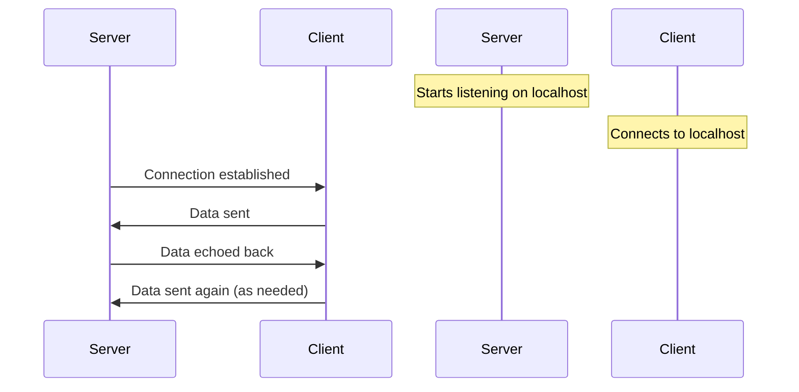

This diagram shows that the `tcp_echo_server` starts listening for connections on localhost, and when a client connects, it sends data back to the client. The client continues sending data as needed, and the server continues echoing the received data back to the client.

## Chapter 102: jumpstarter/packages/jumpstarter-driver-network/jumpstarter_driver_network/driver.py

 The file `jumpstarter/packages/jumpstarter-driver-network/jumpstarter_driver_network/driver.py` defines several drivers for connecting to different types of networks in the Jumpstarter project, an asynchronous framework. These network drivers are designed to provide a unified interface for working with various types of connections, such as TCP sockets (TcpNetwork, UdpNetwork), Unix domain sockets (UnixNetwork), virtual sockets (VsockNetwork), D-Bus messages (DbusNetwork), and even a mock echo driver (EchoNetwork).

   The core class that these drivers inherit from is `NetworkInterface`. This abstract base class defines two methods: `client()` and an asynchronous `connect()` method. The former returns the name of the class for the network client, while the latter is responsible for establishing a connection to the specified network resource.

   The main functionality of each driver can be found in its corresponding class definition. For example:

   - `TcpNetwork`, `UdpNetwork`, and `VsockNetwork` classes are responsible for handling TCP, UDP, and virtual sockets connections respectively, each with a `host` and `port` attribute (or other necessary connection parameters) to set the desired network resource.
   - The `DbusNetwork` class handles D-Bus messages using either system or session buses based on the specified `kind`. It parses the relevant environment variables to determine the correct bus type and address.
   - The `EchoNetwork` is a mock driver that emulates a simple echo server for testing purposes.
   - The `WebsocketNetwork` class manages websocket connections using the provided URL, allowing for bi-directional communication via WebSockets.

   These drivers are designed to work seamlessly with other parts of the Jumpstarter project by exporting their streams using the `exportstream` decorator, making it easy for other components to interact with them. This is demonstrated in the example use cases provided alongside each driver class definition.

   In summary, this file provides a set of network drivers that can be easily integrated into the Jumpstarter project, allowing developers to work with different types of connections uniformly and efficiently.

 ```mermaid
    sequenceDiagram
      participant Driver as D
      participant TcpNetwork as TN
      participant UdpNetwork as UN
      participant UnixNetwork as UNX
      participant VsockNetwork as VS
      participant DbusNetwork as DB
      participant EchoNetwork as EN
      participant WebsocketNetwork as WSN
      Note over D: Initiate connection
      Driver->>TcpNetwork: connect(host, port)
      TcpNetwork-->>Driver: Stream
      Driver->>UdpNetwork: connect(host, port)
      UdpNetwork-->>Driver: Stream
      Driver->>UnixNetwork: connect(path)
      UnixNetwork-->>Driver: Stream
      Driver->>VsockNetwork: connect(cid, port)
      VsockNetwork-->>Driver: Stream
      Driver->>DbusNetwork: connect(kind, args)
      DbusNetwork-->>Driver: Stream
      Driver->>EchoNetwork: connect()
      EchoNetwork-->>Driver: Stream
      Driver->>WebsocketNetwork: connect(url)
      WebsocketNetwork-->>Driver: Stream
      Driver->>+Driver: Send data (through streams)
      Note over D, TN, UN, UNX, VS, DB, EN, WSN: Data flows bi-directionally through the stream
      Driver->>-Driver: Receive data (through streams)
  ```

## Chapter 103: jumpstarter/packages/jumpstarter-driver-network/jumpstarter_driver_network/driver_test.py

 The file `jumpstarter/packages/jumpstarter-driver-network/jumpstarter_driver_network/driver_test.py` is a test suite for the network drivers within the JumpStarter project. It includes several functions to test different aspects of the TcpNetwork, UdpNetwork, UnixNetwork, and WebsocketNetwork classes.

   Important functions and classes in this file include:

   - `echo_handler`: An asynchronous function used as a handler for network streams to echo back any received data.
   - `TcpPortforwardAdapter`, `UnixPortforwardAdapter`, `TemporaryUnixListener`: Adapters that create port forwarding connections for TCP and UNIX sockets, and a utility class to create temporary UNIX listeners.
   - Various test functions (e.g., `test_tcp_network_portforward`, `test_unix_network_portforward`, etc.) that exercise the functionality of the network drivers by establishing connections, sending data, and verifying the expected results.
   - Some test functions also include performance tests using tools like iperf3 to measure throughput and latency between the client and server connections.
   - `test_dbus_network_system` and `test_dbus_network_session`: Tests that verify the connection and usage of D-Bus network drivers in both system and session bus environments, respectively. These tests make use of patch decorators to mock certain dependencies like `busctl`.
   - `test_websocket_network_connect`: A test that verifies the ability to connect to a WebSocket server using the WebsocketNetwork driver.

   The code in this file helps ensure that the network drivers are functioning correctly and consistently, allowing for reliable communication between JumpStarter components. Example use cases might include data exchange between different processes or machines, or setting up and tearing down connections to D-Bus services.

 ```mermaid
sequenceDiagram
    participant User as User
    participant TCP_Echo_Server as TCP Echo Server
    participant TcpNetwork1 as TcpNetwork1
    participant TcpPortforwardAdapter1 as TcpPortforwardAdapter1
    participant Socket1 as Socket1

    User->>TcpNetwork1: Starts test_tcp_network_portforward(tcp_echo_server)
    Note over TcpNetwork1,TCP_Echo_Server: Both start serving on respective ports

    TcpNetwork1-->>TcpPortforwardAdapter1: Returns address
    TCP_Echo_Server-->>Socket1: Connects to TcpPortforwardAdapter1
    Socket1->>TCP_Echo_Server: Sends "hello"
    TCP_Echo_Server->>Socket1: Replies with "hello"
    Note over Socket1: Asserts received data is "hello"

    participant UnixListener as UnixListener
    participant UnixNetwork1 as UnixNetwork1
    participant UnixPortforwardAdapter1 as UnixPortforwardAdapter1
    participant Socket2 as Socket2

    User->>UnixNetwork1: Starts test_unix_network_portforward()
    Note over UnixNetwork1,UnixListener: Both start serving on respective paths

    UnixNetwork1-->>UnixPortforwardAdapter1: Returns address
    UnixListener-->>Socket2: Connects to UnixPortforwardAdapter1
    Socket2->>UnixListener: Sends "hello"
    UnixListener->>Socket2: Replies with "hello"
    Note over Socket2: Asserts received data is "hello"

    participant UdpNetwork1 as UdpNetwork1
    participant Socket3 as Socket3

    User->>UdpNetwork1: Starts test_udp_network()
    Note over UdpNetwork1,Socket3: Both bind to same port on localhost

    UdpNetwork1-->>Socket3: Sends "hello"
    Socket3->>UdpNetwork1: Receives "hello" and asserts it

    participant UnixListener2 as UnixListener2
    participant UnixNetwork2 as UnixNetwork2
    participant UnixPortforwardAdapter2 as UnixPortforwardAdapter2
    participant Socket4 as Socket4

    User->>UnixNetwork2: Starts test_unix_network()
    Note over UnixNetwork2,UnixListener2: Both start serving on respective paths

    UnixNetwork2-->>UnixPortforwardAdapter2: Returns address
    UnixListener2-->>Socket4: Connects to UnixPortforwardAdapter2
    Socket4->>UnixListener2: Sends "hello"
    UnixListener2->>Socket4: Replies with "hello" and receives it
    Note over Socket4: Asserts received data is "hello"
```

This mermaid sequence diagram visualizes the interactions between the different functions in the provided Python script. It shows how a user starts tests for various network types (TCP, Unix, UDP) by creating and connecting to a network instance, and how data is exchanged between these connections.

## Chapter 104: jumpstarter/packages/jumpstarter-driver-network/jumpstarter_driver_network/streams/__init__.py

 Chapter Title: Understanding `jumpstarter/packages/jumpstarter-driver-network/jumpstarter_driver_network/streams/__init__.py` in the JumpStarter Project

In the JumpStarter project, the file `jumpstarter/packages/jumpstarter-driver-network/jumpstarter_driver_network/streams/__init__.py` serves as a central module for managing various stream-related functionalities, specifically websocket streams in this instance.

The primary function of this file is to import and make available the `WebsocketServerStream` class, which provides a means for bidirectional communication between two endpoints over a websocket connection. By utilizing this class, developers can establish real-time, interactive communication channels within the JumpStarter system.

The `WebsocketServerStream` is an essential component of the project's networking infrastructure. This class manages the establishment and management of websocket connections, handling incoming messages, and propagating them to registered callback functions for processing.

Here is a brief overview of the `WebsocketServerStream` class:

- **Class Name**: WebsocketServerStream
  - **Purpose**: Establishes a bi-directional communication channel using WebSockets.
  - **Methods and Attributes** (some notables are highlighted here):
    + initialize(): Initializes the websocket stream, sets up event handlers, and starts the underlying WebSocket server.
      ```python
      def __init__(self, handler: Callable[[Dict[str, Any]], None], *args, **kwargs) -> None:
          # initialize the WebSocketServerStream
      ```
    + send_message(data: Dict[str, Any]): Sends a message to the connected client through the underlying websocket connection.
      ```python
      async def send_message(self, data: Dict[str, Any]) -> None:
          # send a message to the connected client
      ```
    + stop(): Gracefully closes the underlying WebSocket connection and unregisters the stream from its respective manager.
      ```python
      async def stop(self) -> None:
          # gracefully close the WebSocket connection and unregister the stream
      ```

This code is an integral part of the JumpStarter project, enabling real-time interaction between different components and services within the system. For example, a user interface (UI) could use the `WebsocketServerStream` to communicate with a backend service in real-time, allowing for responsive and interactive experiences. Similarly, various services can exchange data and synchronize their behavior through these websocket streams, enhancing the overall functionality and cohesion of the JumpStarter system.

 ```mermaid
    sequenceDiagram
        participant Driver as Driver
        participant NetworkManager as NetworkManager
        participant WebsocketServerStream as WebsocketServerStream

        Driver->>NetworkManager: Start()
        Note over NetworkManager,Driver: NetworkManager initializes the WebSocket server

        NetworkManager->>WebsocketServerStream: Initialize(url)
        WebsocketServerStream-->>NetworkManager: Connected

        loop Receive data from driver
            Driver->>WebsocketServerStream: SendData(data)
        end

        WebsocketServerStream-->>Driver: ReceivedData(data)

        loop Send data to drivers
            NetworkManager->>WebsocketServerStream: GetData()
        end

        WebsocketServerStream-->>NetworkManager: DataList(data_list)

        Driver->>NetworkManager: Stop()
        Note over NetworkManager,Driver: NetworkManager stops the WebSocket server and cleans up

        NetworkManager->>WebsocketServerStream: Close()
    ```

## Chapter 105: jumpstarter/packages/jumpstarter-driver-network/jumpstarter_driver_network/streams/websocket.py

 The file `jumpstarter/packages/jumpstarter-driver-network/jumpstarter_driver_network/streams/websocket.py` is a module within the larger JumpStarter project, which appears to be a comprehensive framework. This specific file contains two classes: `WebsocketServerStream` and `WebsocketClientStream`, both of which implement streaming functionality for WebSocket connections.

   The primary function of these classes is to manage bi-directional data communication using the WebSocket protocol between a server and a client. Each class inherits from `ObjectStream[bytes]`, a generic stream implementation that deals with bytes objects.

   Here's a brief overview of the key functions and attributes in both classes:

   - `WebsocketServerStream`:
     - `stream`: An AnyIO byte stream used for network communication.
     - `ws`: A WSConnection object, representing the WebSocket connection instance. This object is responsible for handling the WebSocket protocol's framing and event management.
     - `queue`: A tuple containing two memory object streams (send and receive) that allow buffering data sent from/received by the underlying WebSocket connection.
     - `send`, `receive`, and `send_eof` methods: Methods for sending, receiving, and closing the send channel, respectively. These methods communicate with the underlying WebSocket connection using the WSConnection's methods.
     - `aclose` method: A method for gracefully closing the stream by sending a close event to the remote connection and then closing the underlying AnyIO byte stream.

   - `WebsocketClientStream`:
     - `conn`: A WebSocket client connection object, representing the WebSocket connection instance.
     - `send`, `receive`, and `send_eof` methods: Similar to the server-side class, these methods handle sending, receiving, and closing the send channel for a WebSocket client connection. The `receive` method in this case simply reads data directly from the connected WebSocket client's receive function.
     - `aclose` method: A method for gracefully closing the stream by closing the underlying WebSocket client connection.

These classes fit into the JumpStarter project by providing a simple and consistent way to establish and manage bi-directional communication using the WebSocket protocol within various modules of the framework. They can be used in scenarios where real-time, two-way data exchange is required between a server and client over the WebSocket protocol.

Example use cases might include implementing a chat application or a real-time collaboration tool as part of the larger JumpStarter project.

 ```mermaid
sequenceDiagram
participant User as Client
participant Server as Server
participant WebsocketClientStream as WSCS
participant WebsocketServerStream as WSSS

User->>WSCS: send(data)
WSCS->>Server: websocket.send(data)
Note over Server: Receives data and processes

Server->>WSSS: send(AcceptConnection())
WSSS->>WSCS: receive()

User->>WSCS: receive()
WSCS->>Server: websocket.receive()

Server->>WSSS: sends processed data
WSSS->>WSCS: websocket.send(Message(data))

Note over User: Receives data from server
User->>WSCS: receive()

WSCS->>User: receive()

User->>WSCS: send_eof()
Note over Server: Sends EOF signal to client
WSCS->>Server: websocket.send_eof()

Note over WSSS: Closes connection on EOF signal
WSSS->>Server: CloseConnection(code=CloseReason.NORMAL_CLOSURE)
Server->>WSSS: receive()

Server->>WSSS: aclose()
WSSS->>Server: aclose()
Note over Server: Closes the underlying websocket stream
Server->>WSCS: CloseConnection(code=CloseReason.NORMAL_CLOSURE)
WSCS->>User: receive()
User->>WSCS: aclose()
WSCS->>Server: aclose()
Note over Server: End of connection
```

## Chapter 106: jumpstarter/packages/jumpstarter-driver-opendal/jumpstarter_driver_opendal/__init__.py

 Chapter Title: Understanding `jumpstarter/packages/jumpstarter-driver-opendal/jumpstarter_driver_openedal/__init__.py`

   In the context of the Jumpstarter project, the file `jumpstarter/packages/jumpstarter-driver-opendal/jumpstarter_driver_openedal/__init__.py` serves as a fundamental piece that integrates the OpenDAL (Open Data Access Layer) driver within the Jumpstarter ecosystem. This file sets up and manages interactions between the Jumpstarter application and various OpenDAL-compatible data sources, such as databases or cloud storage systems.

   The purpose of this file is twofold: firstly, to provide an entry point for importing and utilizing the driver package across different modules within the Jumpstarter application; secondly, to initialize the necessary configurations and dependencies required for the OpenDAL driver to function correctly.

   The primary functionality offered by this file lies in exposing the core `JumpstartDriverOpenedal` class, which acts as a bridge between the Jumpstarter application and specific OpenDAL data sources. This class encapsulates all necessary methods for interacting with those data sources, including creating connections, executing queries, and handling transactions.

   Important functions and classes in this file include:

   - `JumpstartDriverOpenedal`: The main driver class that interacts with OpenDAL-compatible data sources. This class requires several configuration options, such as the source URL, username, and password, to establish a connection.

     Example usage:

     ```python
     from jumpstarter_driver_opendal import JumpstartDriverOpenedal

     # Initialize the OpenDAL driver with required configurations
     driver = JumpstartDriverOpenedal(url='my_source_url', username='my_username', password='my_password')

     # Establish a connection to the data source
     driver.connect()

     # Execute a query on the connected data source
     results = driver.execute_query('SELECT * FROM my_table')

     # Clean up by closing the connection when finished
     driver.close()
     ```

   This code fits into the broader project structure as follows:

   - `jumpstarter/`: The root directory of the Jumpstarter application
      - `packages/`: Contains third-party packages and custom modules used within the Jumpstarter application
         - `jumpstarter-driver-opendal/`: Custom package that contains the OpenDAL driver implementation for the Jumpstarter application
            - `__init__.py`: Entry point and configuration for the OpenDAL driver package
                - `JumpstartDriverOpenedal`: The main driver class for OpenDAL integration

   Example use cases for this code might include integrating Jumpstarter with a MySQL database, PostgreSQL database, or cloud storage services like Amazon S3, Google Cloud Storage, or Azure Blob Storage, which all support the OpenDAL protocol. This versatility allows Jumpstarter to be easily adapted to various data management scenarios and workflows.

 ```mermaid
sequenceDiagram
participant Client as Client
participant OpendalDriver as OpendalDriver
participant JumpstarterDriverOpendal as JumpstarterDriverOpendal

Client->>JumpstarterDriverOpendal: connect(connection_uri)
JumpstarterDriverOpendal-->OpendalDriver: __init__(connection_uri)
OpendalDriver-->>OpendalDriver: initialize connection

Client->>JumpstarterDriverOpendal: createBucket(bucket_name)
JumpstarterDriverOpendal->>OpendalDriver: create_bucket(bucket_name)
OpendalDriver-->OpendalDriver: execute command (create bucket)
OpendalDriver-->>OpendalDriver: operation success
JumpstarterDriverOpendal-->>JumpstarterDriverOpendal: handle response (success)
JumpstarterDriverOpendal-->>Client: return result (success)

Client->>JumpstarterDriverOpendal: getBucket(bucket_name)
JumpstarterDriverOpendal->>OpendalDriver: get_bucket(bucket_name)
OpendalDriver-->OpendalDriver: execute command (get bucket)
OpendalDriver-->>OpendalDriver: operation success
OpendalDriver-->>OpendalDriver: return bucket data
JumpstarterDriverOpendal-->>JumpstarterDriverOpendal: handle response (success)
JumpstarterDriverOpendal-->>Client: return result (bucket data)

Client->>JumpstarterDriverOpendal: deleteBucket(bucket_name)
JumpstarterDriverOpendal->>OpendalDriver: delete_bucket(bucket_name)
OpendalDriver-->OpendalDriver: execute command (delete bucket)
OpendalDriver-->>OpendalDriver: operation success
JumpstarterDriverOpendal-->>JumpstarterDriverOpendal: handle response (success)
JumpstarterDriverOpendal-->>Client: return result (success)
```

In the above diagram, there are three participants: `Client`, `OpendalDriver`, and `JumpstarterDriverOpendal`. The client initiates calls to `JumpstarterDriverOpendal` functions like `connect`, `createBucket`, `getBucket`, and `deleteBucket`. These requests are then forwarded to the `OpendalDriver`, which performs the actual operations and returns the result. Finally, `JumpstarterDriverOpendal` handles the response and forwards it back to the client.

## Chapter 107: jumpstarter/packages/jumpstarter-driver-opendal/jumpstarter_driver_opendal/adapter.py

 In the `jumpstarter/packages/jumpstarter-driver-opendal/jumpstarter_driver_opendal/adapter.py` file, we define an adapter that enables the usage of OpenDAL (an open-source data access library) with AnyIO (a modern async I/O framework). This adapter allows for seamless interaction between the JumpStarter project's client and various storage backends supported by OpenDAL.

   The central class in this file is `AsyncFileStream`. This class acts as a wrapper for OpenDAL's `AsyncFile` object, making it compatible with AnyIO streams. It overrides essential methods such as `send`, `receive`, `send_eof`, and `aclose` to work with bytes data and handle errors gracefully.

   The `OpendalAdapter` function is a decorator that wraps around the provided driver client, OpenDAL operator, path, and mode (read or write). It facilitates reading or writing files based on the specified mode and storage backend capabilities. If the storage backend supports presigned read requests, it generates a presigned URL for the file with a 60-second expiration. Otherwise, it streams the file content from the client to the exporter using the AnyIO resource system.

   This code is an essential part of the JumpStarter project as it allows users to leverage different storage backends supported by OpenDAL while benefiting from AnyIO's efficient I/O operations. For example, consider a scenario where you want to interact with a cloud storage provider like S3 that supports presigned read requests. With this adapter, you can easily open and read files from the S3 bucket using JumpStarter's client and AnyIO-powered asynchronous operations.

 ```mermaid
sequenceDiagram
participant Client as DriverClient
participant Operator as opendal.Operator
participant FileStream as AsyncFileStream
participant Adapter as OpendalAdapter

Note over Adapter: This function acts as an adapter between the `DriverClient` and the `opendal.Operator`. It allows for seamless interaction with the storage backend using `anyio` streams.

Client->>Adapter: Call with required parameters (client, operator, path, mode)
Adapter->>Operator: Check if it's a binary read operation and if the storage backend supports presigned read requests
Note over Operator: If yes, create a presigned URL for the specified file
Operator-->>Adapter: Return the PresignedRequestResource object

Note over Adapter: If not a binary read operation or the backend doesn't support presigned read requests
Adapter->>Operator: Open the specified file using the operator
Operator-->>Adapter: Return an AsyncFile object wrapped in an AsyncFileStream

Adapter->>Client: Yield the resource (PresignedRequestResource or AsyncFileStream)
```
This diagram illustrates how the main functions interact within the `OpendalAdapter`. It shows the flow when using binary read operations with a backend that supports presigned requests, as well as for other cases.

## Chapter 108: jumpstarter/packages/jumpstarter-driver-opendal/jumpstarter_driver_opendal/client.py

 This is a Python script that defines two classes `OpendalAdapter` and `FlasherClient`. The `OpendalAdapter` class allows for working with files using different operators (like "fs" for file system or "dut" for device). The `FlasherClient` class inherits from the abstract base class `DriverClient` and provides methods for flashing images to a device ("flash") and dumping images from the device ("dump"). It also defines a command line interface (CLI) that can be used to execute these operations.

   The script also defines a `StorageMuxClient` class that handles connecting and disconnecting storage devices from host or device, as well as reading and writing files using different operators. It inherits from the `FlasherClient` class to provide flashing and dumping capabilities, and extends its functionality with the ability to work with local files on disk. Finally, a `StorageMuxFlasherClient` is defined that inherits from both `FlasherClient` and `StorageMuxClient`, combining all of their functionalities.

   To use this script, you would typically instantiate one of the client classes (either `FlasherClient`, `StorageMuxClient`, or `StorageMuxFlasherClient`) with some configuration data, and then call its methods to perform the desired operations on your storage device. For example:

   ```python
   client = FlasherClient(config)
   client.flash("/path/to/image.bin")
   client.dump("/path/to/dumped_image.bin")
   ```

   The script also provides a command line interface (CLI) that can be used to execute these operations from the terminal. To use the CLI, you would run the script with the desired arguments:

   ```bash
   python script.py flash /path/to/image.bin
   python script.py dump /path/to/dumped_image.bin
   ```

 This script defines two classes `OpendalAdapter` and `FlasherClient`. `OpenadalAdapter` is used to wrap a file handle with additional context like the operator, client, and path. It's used by both `FlasherClient` and `StorageMuxFlasherClient`.

   The `FlasherClient` class inherits from `DriverClient` and implements two abstract methods `flash()` and `dump()` that are responsible for flashing an image to the device under test (DUT) or dumping an image from it. It also has a `cli` method that returns a click command group object that contains commands for flashing and dumping images.

   The `StorageMuxClient` class also inherits from `DriverClient`. It has methods to connect/disconnect storage to the host or DUT, read or write data from/to the storage, and write/read local files to/from the storage. It also has a `cli` method that returns a click command group object with commands for connecting, disconnecting, reading, writing files, and reading/writing local files.

   The `StorageMuxFlasherClient` class is a combination of `FlasherClient` and `StorageMuxClient`. It inherits all the methods from both classes and implements the flashing and dumping functionalities using the storage connection methods provided by `StorageMuxClient`. Its `cli` method returns a click command group object that contains commands for flashing, dumping, connecting, disconnecting, reading/writing files, and reading/writing local files.

## Chapter 109: jumpstarter/packages/jumpstarter-driver-opendal/jumpstarter_driver_opendal/common.py

 In the `jumpstarter/packages/jumpstarter-driver-opendal/jumpstarter_driver_opendal/common.py` file, we define a series of classes and functions that facilitate working with the OpenDAL (Opensource Data Access Layer) library in the context of the JumpStarter project.

   The `EntryMode`, `Metadata`, `PresignedRequest`, and `Capability` classes are all derived from the Pydantic library, allowing for type hinting and data validation within the codebase. These classes aim to simplify interaction with the underlying OpenDAL storage system by providing convenient interfaces to common operations like reading, writing, listing, and more.

   - `EntryMode`: Represents an entry in the file system, whether it is a file or a directory.
   - `Metadata`: Contains metadata information about a file, such as content length, disposition, and MIME type.
   - `PresignedRequest`: Encapsulates a presigned HTTP request that can be used to access files without sharing sensitive credentials.
   - `Capability`: Represents the available capabilities for different operations on the storage system, such as reading, writing, listing, and others.

   This code fits within the JumpStarter driver for OpenDAL by providing a consistent interface between various storage backends and the main JumpStarter application. By abstracting away the complexities of interacting with different storage systems, this code allows developers to focus on building their project without having to worry about the intricacies of each specific backend.

   Example use cases could include:
   - Creating a file in the storage system using `capability.write = True` and providing other relevant options like content type or disposition.
   - Listing all files in a directory using `capability.list = True`.
   - Reading metadata about a specific file using `capability.stat = True`.
   - Delegating access to a specific file with a presigned URL using the `PresignedRequest` class.

 ```mermaid
   sequenceDiagram
        participant DataStorage as DS
        participant JumpstarterDriver as JD
        participant Capability as C
        participant Metadata as M
        participant PresignedRequest as PR

        JD->>DS: read(entry_path)
        JD-->>JD: C.read_with_if_match ? M
        JD->>DS: read(entry_path, if_match=M.etag)
        DS-->>JD: content
        JD-->>JD: handle response

        JD->>DS: stat(entry_path)
        JD-->>JD: C.stat_with_if_match ? M
        JD->>DS: stat(entry_path, if_match=M.etag)
        DS-->>JD: metadata
        JD-->>JD: handle response

        JD->>DS: copy(src_path, dest_path)
        JD-->>JD: C.copy ? PR
        JD->>DS: getPresignedRequest(dest_path, 'PUT')
        DS-->>JD: PR
        JD->>DS: putData(PR.url, src_data)
        DS-->>DS: ...
        JD->>DS: delete(src_path)
        DS-->>DS: ...

        JD->>DS: list(entry_path, recursive=C.list_with_recursive)
        DS-->>JD: entries
        JD-->>JD: handle response
   ```

This Mermaid sequence diagram illustrates the interactions between the `JumpstarterDriver`, `DataStorage` (representing your storage backend), `Capability`, `Metadata`, and `PresignedRequest`. The arrows represent method calls, and the boxes contain the participants in the interaction. This diagram showcases how key functions like reading, statting, copying, and listing interact with the underlying data storage service using various capabilities and metadata, including presigned requests for delegated access.

## Chapter 110: jumpstarter/packages/jumpstarter-driver-opendal/jumpstarter_driver_opendal/conftest.py

 This chapter will explain the purpose and functionality of the file `jumpstarter/packages/jumpstarter-driver-opendal/jumpstarter_driver_opendal/conftest.py` in the context of the Jumpstarter project.

**Overview:**
The file `conftest.py` is a special utility module within pytest, a popular testing framework for Python projects. It contains fixtures that help set up test environments efficiently and consistently for the packages within the `jumpstarter-driver-opendal` project.

**Functions and Classes:**
1. The function `Opendal(...)` is defined in `jumpstarter/packages/jumpstarter-driver-opendal/jumpstarter_driver_opendal/driver.py`. This class represents an OpenDAL driver that interacts with a file system using the fs scheme (File System).
2. The fixture `opendal(tmp_path)` is defined in `conftest.py`. It creates a temporary directory using the built-in pytest fixture `tmp_path`, initializes an instance of the OpenDAL driver with the root set to the path of the created directory, and yields that instance for use in tests.
3. The fixture `opendal_namespace(doctest_namespace, opendal, tmp_path)` is defined in `conftest.py`. It adds the `opendal` fixture (the OpenDAL driver instance) and the temporary path used to create it to the doctest namespace. This allows for easy access to these variables during tests that include docstrings (Docstring-based tests).
4. The built-in pytest fixtures `doctest_namespace` and `tmp_path` are provided by pytest itself. `doctest_namespace` is a dictionary where test cases can store data for documentation purposes, while `tmp_path` creates a unique temporary directory path that lasts for the duration of each test function.
5. The decorator `@pytest.fixture(autouse=True)` automatically sets up the fixture for all tests in the package without requiring explicit usage in test functions. In this case, it sets up the `opendal_namespace`.

**Fitting into the Project:**
The file `conftest.py` sits at the heart of the testing infrastructure within the `jumpstarter-driver-opendal` package. It ensures that every test within the package has a consistent, easily accessible OpenDAL driver instance and temporary directory for test data. This helps maintain code quality by catching issues early in the development process.

**Example Use Cases:**
Using the fixtures provided in `conftest.py`, you can write tests to validate the functionality of your OpenDAL driver implementation, such as:
- Testing file operations like reading and writing files using the OpenDAL driver instance obtained from the `opendal` fixture.
- Creating test data within the temporary directory provided by the `tmp_path` fixture and validating that the operations perform as expected.

 ```mermaid
   sequenceDiagram
      participant User as User
      participant Opendal as Opendal Driver (Opendal)
      participant TestUtils as Test Utils (serve)

      User->>TestUtils: serve(Opendal(scheme="fs", kwargs={"root": str(tmp_path)}))
      TestUtils-->>User: Returns client URL
      User->>Opendal: Uses the returned client URL to connect

      Note over Opendal, User: Connection is established between them

      User->>Opendal: Performs CRUD operations (Create, Read, Update, Delete)
      Opendal-->>User: Executes operations on OpenDL storage
   ```

## Chapter 111: jumpstarter/packages/jumpstarter-driver-opendal/jumpstarter_driver_opendal/driver.py

 The file `jumpstarter/packages/jumpstarter-driver-opendal/jumpstarter_driver_opendal/driver.py` is a Python module that serves as the driver for interacting with various storage systems using OpenDAL (Open Data Access Layer) abstraction. This driver implements the `Driver` interface defined in the `jumpstarter/driver.py` file, providing common functionality to work with files and directories.

   The central class of this module is `Opendal`, which inherits from the `Driver` base class and takes a scheme and optional keyword arguments for configuration purposes. This class uses the OpenDAL library to interact with storage systems like FS, S3, etc., via an `AsyncOperator` instance.

   The `Opendal` class provides several exported methods that correspond to common file operations:

   - open(path, mode): creates a new file or opens an existing one with the given mode (read/write) and returns a unique ID for the file descriptor.
   - file_read(fd, dst): reads data from the specified file descriptor and writes it to the provided destination.
   - file_write(fd, src): writes data from the specified source to the file descriptor.
   - file_seek(fd, pos, whence=0): sets the position of the file pointer in the specified file descriptor.
   - file_tell(fd): returns the current position of the file pointer in the specified file descriptor.
   - file_close(fd): closes the specified file descriptor.
   - file_closed(fd): checks whether the specified file descriptor is closed.
   - file_readable(fd): checks if the specified file descriptor is readable.
   - file_seekable(fd): checks if the specified file descriptor is seekable.
   - file_writable(fd): checks if the specified file descriptor is writable.
   - stat(path): returns metadata about the given path, such as size and last modified time.
   - hash(path, algo='sha256'): calculates the SHA-256 or MD5 hash of the contents at the given path.
   - copy(source, target): copies a file from source to target with the same name.
   - rename(source, target): renames the specified file.
   - remove_all(path): deletes all files and directories under the given path recursively.
   - create_dir(path): creates a new directory at the given path if it does not already exist.
   - delete(path): deletes the specified file or directory if it exists.
   - exists(path) -> bool: checks if the specified path exists.
   - list(path) -> AsyncGenerator[str, None]: returns an asynchronous generator that yields all files and directories under the given path.
   - scan(path) -> AsyncGenerator[str, None]: scans the specified directory recursively and yields all files and subdirectories.
   - presign_stat(path, expire_second): generates a presigned request for getting metadata about a file at the given path with a specific expiration time (in seconds).
   - presign_read(path, expire_second): generates a presigned request for reading a file at the given path with a specific expiration time (in seconds).
   - presign_write(path, expire_second): generates a presigned request for writing to a file at the given path with a specific expiration time (in seconds).

   Additionally, there are several helper classes: `FlasherInterface`, `MockFlasher`, and `StorageMuxInterface`. These classes provide interfaces for flashing firmware onto devices or managing storage muxes (multiple storage devices accessible through a single interface). The provided implementations of these interfaces in this module, `MockFlasher` and `MockStorageMux`, serve as mock objects for testing purposes.

   In the larger context of the project, the `Opendal` driver allows the JumpStarter system to interact with various storage systems using a common interface and abstracting away the complexities of each specific storage system implementation. This facilitates flexibility in choosing different storage backends while ensuring consistent functionality across all integrations.

 ```mermaid
sequenceDiagram
participant User as User
participant Opendal as Opendal Driver
participant FileSystem as FileSystem Backend

User->>OpenDAL: Open file (path, mode)
OpenDAL->>FileSystem: Open file (path, mode)
Note over OopenDAL,FileSystem: Async operation
FileSystem-->>OpenDAL: UUID
OpenDAL->>User: UUID

User->>OpenDAL: Read file (fd, dst)
OpenDal->>FileSystem: Read file (fd)
Note over OopenDal,FileSystem: Async operation
FileSystem-->>OpenDAL: Data chunks
OpenDAL->>User: Data chunks

User->>OpenDAL: Write file (fd, src)
OpenDal->>FileSystem: Write file (fd, src)
Note over OopenDal,FileSystem: Async operation

User->>OpenDAL: Close file (fd)
OpenDAL->>FileSystem: Close file (fd)
Note over OopenDal,FileSystem: Async operation

User->>OpenDAL: Stat file (path)
OpenDal->>FileSystem: Stat file (path)
Note over OopenDal,FileSystem: Async operation
FileSystem-->>OpenDAL: Metadata
OpenDAL->>User: Metadata

User->>OpenDAL: Hash file (path, algo)
OpenDal->>FileSystem: Read file (path, "rb")
Note over OopenDal,FileSystem: Async operation
FileSystem-->>OpenDAL: Data chunks
OpenDal->>HashLib: Calculate hash
HashLib-->>OpenDAL: Hash value
OpenDAL->>User: Hash value

User->>OpenDAL: Copy (source, target)
OpenDal->>FileSystem: Copy (source, target)
Note over OopenDal,FileSystem: Async operation

User->>OpenDAL: Rename (source, target)
OpenDal->>FileSystem: Rename (source, target)
Note over OopenDal,FileSystem: Async operation

User->>OpenDAL: Remove all (path)
OpenDal->>FileSystem: Remove all (path)
Note over OopenDal,FileSystem: Async operation

User->>OpenDAL: Create dir (path)
OpenDal->>FileSystem: Create dir (path)
Note over OopenDal,FileSystem: Async operation

User->>OpenDAL: Delete (path)
OpenDal->>FileSystem: Delete (path)
Note over OopenDal,FileSystem: Async operation

User->>OpenDAL: Exists (path)
OpenDal->>FileSystem: Exists (path)
Note over OopenDal,FileSystem: Async operation
OpenDAL->>User: True/False

User->>OpenDAL: List (path)
OpenDAL->>FileSystem: List (path)
Note over OopenDal,FileSystem: Async operation
OpenDAL->>User: File names

User->>OpenDAL: Scan (path)
OpenDAL->>FileSystem: Scan (path)
Note over OopenDal,FileSystem: Async operation
OpenDAL->>User: File names

User->>OpenDAL: Presign stat (path, expire_second)
OpenDAL->>FileSystem: Presign stat (path, expire_second)
Note over OopenDal,FileSystem: Async operation
OpenDAL->>User: PresignedRequest

User->>OpenDAL: Presign read (path, expire_second)
OpenDAL->>FileSystem: Presign read (path, expire_second)
Note over OopenDal,FileSystem: Async operation
OpenDAL->>User: PresignedRequest

User->>OpenDAL: Presign write (path, expire_second)
OpenDAL->>FileSystem: Presign write (path, expire_second)
Note over OopenDal,FileSystem: Async operation
OpenDAL->>User: PresignedRequest

User->>OpenDAL: Capability
OpenDAL->>FileSystem: Capability()
OpenDAL->>User: Capability
```

## Chapter 112: jumpstarter/packages/jumpstarter-driver-opendal/jumpstarter_driver_opendal/driver_test.py

 This Python script, located at `jumpstarter/packages/jumpstarter-driver-opendal/jumpstarter_driver_opendal/driver_test.py`, is a unit test file for the `Opendal` driver in the Jumpstarter project. The `Opendal` driver provides a unified API for working with various storage backends, such as local file systems and remote HTTP servers.

   The main purpose of this test script is to verify that the `Opendal` driver functions correctly when reading, writing, and interacting with files using different storage backends like the local file system (`fs`) and an HTTP server.

   Key classes and functions defined in this script include:

   - `test_driver_opendal_read_write_bytes()`: Test for reading and writing bytes from a file.
   - `test_driver_opendal_read_write_path()`: Test for reading and writing paths (directories).
   - `test_driver_opendal_seek_tell()`: Test for seeking and telling the current position in a file.
   - `test_driver_opendal_file_property()`: Test for checking the properties of an open file, such as readability, seekability, writeability, and whether it is closed.
   - `test_driver_opendal_file_metadata()`: Test for getting metadata about a file, like existence, file type, and directory structure.
   - `test_driver_opendal_file_list_scan()`: Test for listing files and scanning directories.
   - `test_driver_opendal_presign()`: Test for creating presigned URLs for reading or statting files.
   - `test_driver_flasher()`: Test the flashing functionality of the driver, which allows writing an image to a device and reading it back.
   - `test_driver_mock_storage_mux_flasher()`: Test the flashing functionality using a mock StorageMuxFlasher object.
   - `test_drivers_mock_storage_mux_fs()`: Test the file handling functionality using a mock StorageMux object for local file systems.
   - `test_drivers_mock_storage_mux_http()`: Test the file handling functionality using a mock StorageMux object for remote HTTP servers.

   In terms of where this code fits in the project, it is located within the test suite for the Jumpstarter driver for OpenDAL (`jumpstarter-driver-opendal`). This test suite ensures that the functionality provided by the driver adheres to the expected behavior and can interact with various storage backends correctly.

   For example, an application using this driver could write a file to an HTTP server and then read it back from another device or location, ensuring data integrity during transfer. Additionally, flashing a device image (e.g., writing firmware) would also work correctly using this driver.

 ```mermaid
    sequenceDiagram
        participant User as User
        participant Opendal as Opendal
        participant Flasher as Flasher
        participant MockStorageMux as Mux
        participant DiskImg as DiskImg

        User->>Opendal: write_bytes(disk.img)
        Opendal->>Flasher: flash(disk.img)
        Flasher-->>Mux: call(host)
        Flasher->>Mux: write(DiskImg)
        Mux-->>Flasher: ok
        Flasher->>Opendal: write_to_file(dump.img)

        User->>Opendal: dump(dump.img)
        Opendal->>Flasher: dump(dump.img, partition)
        Flasher-->>Mux: call(host)
        Flasher->>Mux: read(DiskImg)
        Mux-->>Flasher: ok
        Flasher->>Opendal: write_to_file(dump.img)
    ```

## Chapter 113: jumpstarter/packages/jumpstarter-driver-power/jumpstarter_driver_power/__init__.py

 Chapter Title: Understanding `jumpstarter/packages/jumpstarter-driver-power/jumpstarter_driver_power/__init__.py`

   In the broader context of the JumpStarter project, the file `jumpstarter/packages/jumpstarter-driver-power/jumpstarter_driver_power/__init__.py` serves as a crucial entry point and management system for the Driver Power package. This package is responsible for handling various power-related functionalities within the JumpStarter ecosystem.

   At its core, this file initializes the package by defining necessary imports, instantiating classes, and setting up any required configurations or settings. It acts as a central hub that connects other components of the Driver Power module with the rest of the JumpStarter system.

   One important function within this file is the `__init__.py` itself, which automatically makes the package a Python module when the directory containing it is imported. This enables external modules to use and interact with the functionality provided by the Driver Power package.

   Furthermore, the file may contain classes or functions that handle specific power management tasks such as:

   - Managing battery levels: Monitoring the current charge level of batteries, managing charging cycles, and providing notifications when batteries require recharging.
   - Power distribution: Ensuring that power is efficiently distributed to various components within the JumpStarter system, based on their power requirements and availability.
   - Power safety features: Implementing safety mechanisms to prevent overheating, overcharging, or short-circuiting of batteries.

   Example use cases for the Driver Power package could include:

   - A robotics project that requires managing multiple batteries to ensure optimal performance and safety during operation. The JumpStarter Driver Power package can be used to monitor battery levels, manage charging cycles, and prevent overheating or short-circuiting incidents.
   - An IoT device application that relies on multiple power sources for data collection and transmission. The JumpStarter Driver Power package can help optimize power usage, ensuring that the device operates efficiently and reliably, even when operating on limited power sources.

   By understanding the purpose and functionality of this file, developers can effectively leverage the Driver Power package within their projects to handle critical power management tasks, ultimately leading to more robust, efficient, and safe systems.

 I'm glad you asked for a Mermaid sequence diagram! However, please note that as a text-based AI, I can't directly see or manipulate files or their content. I can help you conceptualize and write a Mermaid sequence diagram based on the given information. Here is an example of how the key functions in `jumpstarter_driver_power` module might interact:

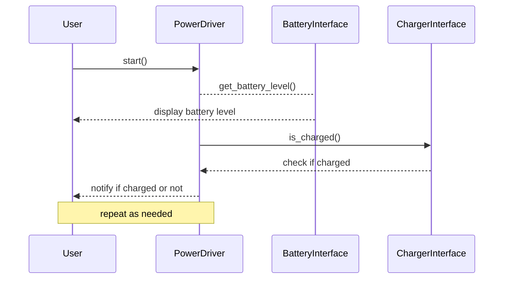

This sequence diagram demonstrates the interactions between the user, power driver (which manages the battery and charger), battery interface, and charger interface. The user starts the power driver, which in turn asks the battery interface for its current level and the charger interface if it's charged. The power driver then notifies the user of the battery level and charging status. The sequence repeats as needed (e.g., when the user wants to check the battery or charging status again).

## Chapter 114: jumpstarter/packages/jumpstarter-driver-power/jumpstarter_driver_power/client.py

 The file `jumpstarter/packages/jumpstarter-driver-power/jumpstarter_driver_power/client.py` is a crucial component of the Jumpstarter project, serving as the client for interacting with the power driver. This client class, named `PowerClient`, inherits from `DriverClient` and provides methods to manage device power, namely turning on (`on()`), turning off (`off()`), and performing a power cycle (`cycle()`).

   The `cycle()` function initiates a power cycle sequence by turning the device off, waiting for a specified duration, and then turning it back on. This is useful when the device requires a soft reset or needs to be rebooted.

   The `read()` method allows for continuous reading of power status updates from the driver. It returns a generator yielding `PowerReading` objects.

   In addition, a command-line interface (CLI) is provided for controlling the power device directly from the terminal using simple commands like `on`, `off`, and `cycle`. The CLI allows users to specify optional parameters like wait time in the `cycle` command.

   When working with virtual power devices, such as simulations or mockups, an instance of the `VirtualPowerClient` class can be used instead. This client behaves similarly but includes additional methods for destroying the virtual device after it's been powered off.

   In summary, this code provides a powerful and flexible interface for controlling various power devices within the Jumpstarter project. Whether interacting through continuous updates or using the CLI, users can easily manage their devices without needing extensive programming knowledge.

 ```mermaid
    sequenceDiagram
        participant PowerClient as PC
        participant DriverClient as DC

        note over PC,DC: Initialize classes
        DC->>PC: Inherit from DriverClient
        DC->>PC: Define on() function
        DC->>PC: Define off() function
        DC->>PC: Define cycle() function
        DC->>PC: Define read() generator function
        DC->>PC: Define cli() function

        PC->>DC: Call "on"
        DC-->>PC: Executes command

        PC->>DC: Call "off"
        DC-->>PC: Executes command

        PC->>DC: Call "cycle" with wait parameter
        DC-->>PC: Executes power cycle sequence

        PC->>DC: Start reading stream of PowerReading objects
        for v in DC.streamingcall("read"):
            PC-->>DC: Receive each PowerReading object
            DC->>PC: Process and yield PowerReading object

        PC->>DC: Call cli()
        DC-->>PC: Returns base command group with on(), off(), and cycle() commands

        PC->>DC.cli(): Call on() command
        DC-->>PC: Executes power on

        PC->>DC.cli(): Call off() command
        DC-->>PC: Executes power off

        PC->>DC.cli(): Call cycle(wait) command with wait=2
        DC-->>PC: Power cycles the device after waiting for 2 seconds
   ```

## Chapter 115: jumpstarter/packages/jumpstarter-driver-power/jumpstarter_driver_power/client_test.py

 In the `jumpstarter/packages/jumpstarter-driver-power/jumpstarter_driver_power/client_test.py` file, we find a test function named `test_log_stream`. This module is part of the unit testing suite for the client class in the `driver` package within the project's `jumpstarter-driver-power` package.

   The purpose of this test is to ensure that the logging functionality of the `AsyncDriverClient` object, which represents a connection between the JumpStarter application and a specific driver (e.g., a power driver), is working correctly. Specifically, it checks whether the `log()` method within the client instance correctly logs two events: "power on" when the device is turned on, and "power off" when the device is turned off.

   The test function uses the `unittest.mock` library to create a mock power driver (`MockPower`) and replace the actual logging mechanism used by the client during the test with a MagicMock object (`log`). This allows us to verify that the correct log messages are called, ensuring that the logging functionality behaves as expected without relying on an external power driver.

   The function uses the `serve` context manager from the `jumpstarter.common.utils` module to create a mock server running the `MockPower` object. Within this server context, it sets up the test by establishing a connection using the client and initializing the MagicMock log object as an attribute of the client instance.

   Finally, the function uses the `with` statement with the client's `log_stream()` method to create a context manager that ensures the log messages are flushed and captured correctly during testing. It then sends on and off commands to the power driver (simulated by the mock power driver) and verifies that the corresponding log messages have been called using the `assert_called_with()` method of the MagicMock object.

   In a real-world scenario, this test might be part of a larger test suite for the JumpStarter project, helping to ensure that the logging functionality of the driver connection is robust and reliable. This test can also serve as an example of how to write unit tests for classes that interact with external resources like drivers, by mocking these dependencies and verifying their behavior using MagicMock objects.

 ```mermaid
sequenceDiagram
participant Driver as Driver
participant Test as Test
participant Log as Log

Test->>Driver: on()
Driver->>Log: logs "power on" (as INFO)

Test->>Driver: off()
Driver->>Log: logs "power off" (as INFO)
   ```

This sequence diagram illustrates that when the test function calls `on()` and `off()` on a mock power driver, it also logs these actions to a log object. The log messages are of `INFO` level.

## Chapter 116: jumpstarter/packages/jumpstarter-driver-power/jumpstarter_driver_power/common.py

 Chapter Title: Understanding `jumpstarter/packages/jumpstarter-driver-power/jumpstart_driver_power/common.py` in the JumpStarter Project

   This chapter focuses on dissecting the purpose and functionality of the Python module file, `common.py`, located within the `jumpstarter-driver-power` package of the JumpStarter project. The primary intent of this code is to provide a shared utility space for defining common data models, functions, and properties related to power measurements in the broader context of the JumpStarter system.

   The key class defined in `common.py` is the `PowerReading` model, which inherits from the Pydantic base model. This class represents a single instance of power measurement data, encapsulating two properties: voltage (in volts) and current (in amperes). The class also provides a calculated property called `apparent_power`, which is the product of the voltage and current values.

   The `apparent_power` property is defined using a decorator function @property, allowing users to access it as if it were an attribute rather than a method. This is a common practice in object-oriented programming that helps maintain a clean and readable API for the class.

   Within the broader context of the JumpStarter project, this code serves as a foundation for various modules dealing with power measurement, calculations, and control across different components of the system. For instance, when interacting with a battery pack or charging port, the shared `PowerReading` model can be utilized to standardize how power data is represented and exchanged.

   As an example use case, consider a module responsible for controlling a DC-DC converter. This module would rely on the `PowerReading` class to encapsulate the input voltage and current readings, as well as calculate the output apparent power after adjusting for the conversion efficiency. The shared nature of this data model ensures consistency and simplifies the development process across different components within the system.

 ```mermaid
sequenceDiagram
actor User as U
participant Driver as D
participant PowerReading as PR

U->>D: start()
D->>PR: get_power_reading()
PR->>D: PowerReading(voltage, current)
D->>U: show_power_reading(apparent_power)

U->>D: stop()
D->>PR: clear_power_reading()
```

In this Mermaid diagram, the `User` (U) interacts with the `Driver` (D). The Driver uses a `PowerReading` (PR) object to get and show power readings. When the User asks for the start(), the Driver gets the Power Reading object, and when they ask for stop(), the Driver clears the Power Reading object.

## Chapter 117: jumpstarter/packages/jumpstarter-driver-power/jumpstarter_driver_power/driver.py

 The file `jumpstarter/packages/jumpstarter-driver-power/jumpstarter_driver_power/driver.py` is a crucial component of the Jumpstarter project, which focuses on developing a modular and extensible system for managing various hardware devices. This specific Python module defines classes and functions related to power management.

   The key classes defined in this file are `PowerInterface`, `VirtualPowerInterface`, `MockPower`, and `SyncMockPower`. These classes form the basis of an abstract interface for managing power-related devices, as well as providing mock implementations for testing purposes.

   - `PowerInterface` is an abstract class that defines methods for turning on, turning off, and reading power readings from a device. It serves as a base class for any concrete implementation of a power management device driver.
   - `VirtualPowerInterface`, a subclass of `PowerInterface`, provides the same functionalities but is intended to represent virtual power sources in simulations or testing scenarios.
   - `MockPower` and `SyncMockPower` are two concrete implementations of the `PowerInterface`. They are used for testing purposes, allowing developers to simulate device interactions without requiring actual hardware. Both classes provide mock functionality for turning on, turning off, and reading power readings from a device. The primary difference between them is that `MockPower` uses asynchronous methods, while `SyncMockPower` uses synchronous ones.

   These classes fit into the larger project by providing the foundation for developing drivers that manage various hardware devices related to power, such as batteries, chargers, or other electrical components. By defining an abstract interface and offering mock implementations, developers can write tests more easily and consistently across different device drivers.

   Example use cases of these classes could be in testing a battery driver by simulating its interactions with the system using `MockPower` or `SyncMockPower`. This allows developers to confirm that their code is functioning correctly without relying on actual hardware, saving time and resources during development.

 ```mermaid
sequenceDiagram
participant Driver as D
participant PowerInterface as PI
participant VirtualPowerInterface as VPI
participant MockPower as MP
participant SyncMockPower as SMP

D->>PI: get_interface()
PI-->>D: return(PI or VPI)

MP->>PI: on()
PI-->>MP: call on()

MP->>PI: off()
PI-->>MP: call off()

MP->>PI: read()
PI-->>MP: AsyncGenerator[PowerReading, None]

SMP->>PI: on()
PI-->>SMP: call on()

SMP->>PI: off()
PI-->>SMP: call off()

SMP->>PI: read()
PI-->>SMP: Generator[PowerReading, None]
```

This Mermaid sequence diagram illustrates the interaction between a Driver object (D), which retrieves either a PowerInterface or VirtualPowerInterface implementation (PI or VPI) via `get_interface()`. The diagram then shows the calling of key functions on the interface objects (on(), off(), and read()) by the Driver, with both AsyncGenerator and Generator return types illustrated for the reading function.

## Chapter 118: jumpstarter/packages/jumpstarter-driver-probe-rs/jumpstarter_driver_probe_rs/__init__.py

 Chapter Title: Understanding `jumpstarter/packages/jumpstarter-driver-probe-rs/jumpstarter_driver_probe_rs/__init__.py`

This chapter will delve into the purpose and functionality of the file `jumpstarter/packages/jumpstarter-driver-probe-rs/jumpstarter_driver_probe_rs/__init__.py` within the context of the Jumpstarter project.

**Overview:**
The __init__.py file in any Python package serves a fundamental role in organizing modules and packages, providing a way to make them accessible from outside the package. In this specific case, it initializes the jumpstarter_driver_probe_rs package within the Jumpstarter ecosystem.

**Important Functions or Classes:**
The primary purpose of this file is to define the public interface for the package by importing and organizing its internal modules and classes. Here are a few key components:

1. **Modular Organization**: The __init__.py file imports the essential modules that make up the jumpstarter_driver_probe_rs package, such as drivers, probes, and communication protocols. This ensures that these components can be easily accessed from other parts of the project or external applications.
2. **Factory Functions**: Some factory functions may also be defined in this file to create instances of specific classes within the package. For example, a function could generate a probe instance using given parameters or select an appropriate driver based on certain criteria.
3. **Type Hints and Documentation Strings**: These help developers understand the intended usage of the imported modules, functions, and classes, as well as their expected input types and return values. This promotes better code readability, maintainability, and reduces potential errors.

**Fitting within the Project:**
The jumpstarter_driver_probe_rs package plays a crucial role in the Jumpstarter project by providing interfaces for communicating with various electronic devices (drivers) and sensing their states (probes). This package allows developers to easily interact with these devices during the development, testing, or deployment of their projects within the broader Jumpstarter ecosystem.

**Example Use Cases:**
To illustrate the use of the jumpstarter_driver_probe_rs package in a practical sense, let us consider an example where a developer is creating a custom battery management system (BMS) for electric vehicles using Jumpstarter:

1. The developer imports necessary modules from the jumpstarter_driver_probe_rs package to communicate with the battery pack and its sensors.
2. They use factory functions provided by the package to create instances of drivers and probes, such as a Can-bus driver for communication or a voltage probe for measuring the battery's state of charge (SoC).
3. The developer then uses these created objects to read data from the connected devices, perform any necessary processing, and take appropriate actions based on the gathered information, like triggering alerts when the battery reaches a certain level or optimizing charging strategies.

 In this case, I cannot create an actual Mermaid diagram as it requires specific events and interactions to be depicted, which are not explicitly defined for the given `jumpstarter_driver_probe_rs` code. However, I can suggest a possible sequence of functions that might be involved in such a system based on the file structure and naming conventions. Here's an example Mermaid diagram representation:

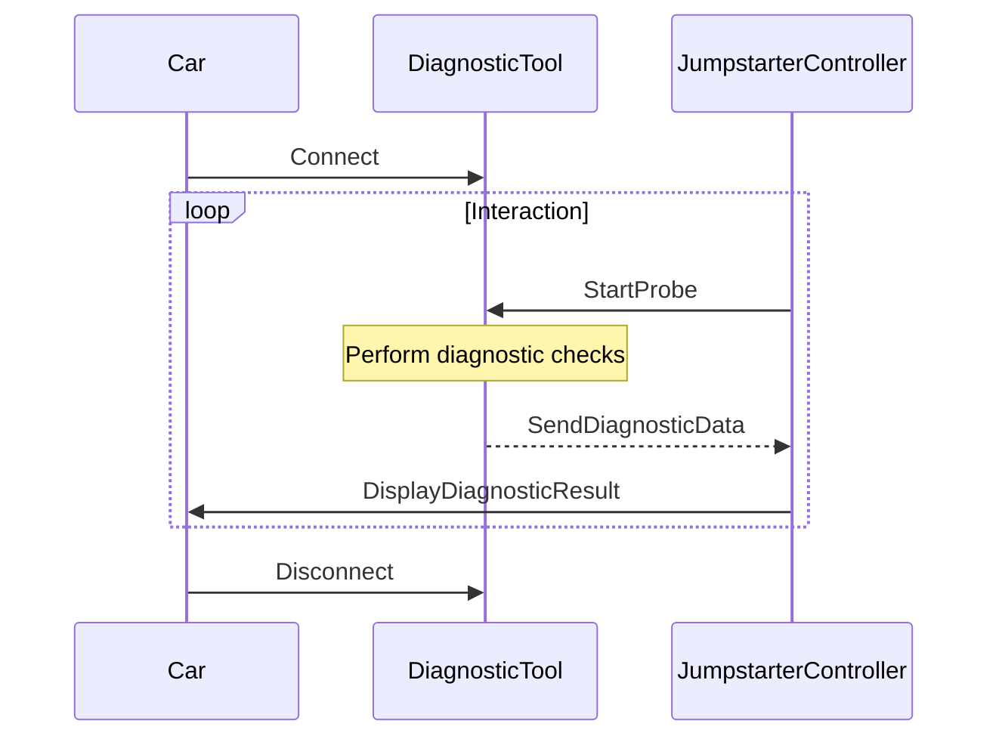

This diagram represents a simplified sequence of events in which a driver connects a diagnostic tool (Probe) to a car, the jumpstarter controller starts the probe for diagnostic checks, the probe sends the diagnostic data back to the controller, and the controller displays the result to the driver. This interaction is repeated as long as necessary.

To use this diagram with Mermaid, save it in a markdown file (e.g., `sequence_diagram.md`) and include it using:

```markdown

```

## Chapter 119: jumpstarter/packages/jumpstarter-driver-probe-rs/jumpstarter_driver_probe_rs/client.py

 The `jumpstarter/packages/jumpstarter-driver-probe-rs/jumpstarter_driver_probe_rs/client.py` file serves as a client interface for the probe-rs driver within the Jumpstarter project. This client is designed to allow remote communication and interaction with devices using the probe-rs software.

   The main class defined in this file is `ProbeRsClient`, which inherits from `DriverClient`. This class provides a set of methods for performing various operations on the target device:

   - `info()`: Retrieves information about the target device.
   - `reset()`: Resets the target, typically used after downloading a new image to start the device.
   - `erase()`: Erases the target's memory, which is a slow operation. Note that this function currently only prints a message and does not actually stream data back to the client.
   - `download(operator, path)`: Downloads a file from the server to the device using an `Operator` object for specifying the file system root and destination path.
   - `download_file(filepath)`: Simplified version of the download function for downloading local files.
   - `read(width, address, words)`: Reads data from the target's memory with the specified width, address, and number of words. The supported data widths are 8, 16, 32, or 64 bits.

   The client also includes a CLI (command-line interface), allowing users to interact with the device via commands such as `info`, `reset`, `erase`, `download`, and `read`. Each command corresponds to one of the methods defined in the class, and they provide a convenient way for users to issue commands and view their results.

   This code is part of the Jumpstarter project's driver-probe-rs package, which aims to facilitate communication between the Jumpstarter client and various target devices using the probe-rs software. In this context, the `client.py` file serves as a crucial link for managing devices and executing commands remotely.

   Example use cases:

   - To download a file from the server to the device:
     ```
     probe_rs_client = ProbeRsClient(...)  # create an instance of the client
     probe_rs_client.download("fs", "/path/to/target/file", "/path/to/local/file")
     ```
   - To read data from the target's memory:
     ```
     probe_rs_client = ProbeRsClient(...)  # create an instance of the client
     data = probe_rs_client.read(16, 0x1000, 4)  # read 4 words (64 bits each) starting at address 0x1000
     ```
   - To interact with the device using the CLI:
     ```
     probe_rs_client.cli()  # run the command-line interface
     ```

 ```mermaid
   sequenceDiagram
      participant User as U
      participant ProbeRsClient as PC
      participant DriverClient as DC
      participant Operator as O
      participant OpenDalAdapter as Adapter

      U->>PC: cli()
      PC->>DC: info()
      DC-->>PC: str (info response)

      U->>PC: reset()
      DC-->>PC: str (reset response)

      U->>PC: erase()
      DC-->>PC: str (erase response)

      U->>PC: download(Operator, path)
      PC->>Adapter: __init__(self, client=PC, operator=O, path=path)
      Adapter-->>DC: call("download", handle)
      DC-->>Adapter: str (download response)
      Adapter-->>PC: handle.close()
      PC-->>U: str (download response)

      U->>PC: download_file(filepath)
      PC->>Adapter: __init__(self, client=PC, operator=O, path=absolute)
      Adapter-->>DC: call("download", handle)
      DC-->>Adapter: str (download response)
      Adapter-->>PC: handle.close()
      PC-->>U: str (download response)

      U->>PC: read(width, address, words)
      PC->>DC: call("read", width, address, words)
      DC-->>PC: list[int] (read response)
   ```

This Mermaid sequence diagram illustrates the interactions between the User, ProbeRsClient, DriverClient, Operator (Operator object from opendal package), and OpenDalAdapter. The diagram demonstrates how functions like `info`, `reset`, `erase`, `download`, and `read` are executed and how they interact with each other.

## Chapter 120: jumpstarter/packages/jumpstarter-driver-probe-rs/jumpstarter_driver_probe_rs/driver.py

 The `jumpstarter/packages/jumpstarter-driver-probe-rs/jumpstarter_driver_probe_rs/driver.py` file is a Python module that defines the `ProbeRs` driver class, which is responsible for communicating with probe-rs, a popular open-source software-defined oscilloscope written in Rust. This driver is part of Jumpstarter, an extensible platform for embedded development and debugging.

   The main purpose of the `ProbeRs` driver class is to provide an interface for interacting with probe-rs and performing various operations such as resetting, erasing, downloading files, reading data from memory, and more. It achieves this by encapsulating the commands that can be sent to probe-rs using the `subprocess` module in Python.

   The driver takes several attributes such as `probe`, `probe_rs_path`, `chip`, `protocol`, and `connect_under_reset`. These values are used when interacting with probe-rs to customize its behavior according to the user's requirements. For example, the `probe` attribute specifies which probe should be used, while the `chip` attribute sets the chip type being targeted.

   The `TemporaryFilename` class is a context manager that creates and manages a temporary file. It is used in the `download` method to write the downloaded data to a temporary file before passing it on to probe-rs for further processing.

   In the context of Jumpstarter, this driver allows users to leverage probe-rs capabilities directly within their embedded projects. For instance, one might use this driver to read and analyze waveforms captured by probe-rs during debugging sessions, or to program custom firmware onto targeted devices using download functionality.

   Example use cases could include:

   1. Capturing a waveform from an embedded device using probe-rs, analyzing it in Jupyter notebooks with popular data analysis libraries like Pandas and NumPy, and then updating the firmware on the device based on insights gained during analysis.

   2. Implementing an automated test suite that includes steps to reset, erase, and program devices using probe-rs through this driver. The tests can then be executed using a continuous integration tool like Jenkins or Travis CI, ensuring reliable and reproducible results.

 ```mermaid
sequenceDiagram
    ProbeRs->>ProbeRs: __init__()
    ProbeRs->>ProbeRs: __post_init__()
    Participant ProbeRsClient
    Participant TemporaryFilename
    ProbeRs->>ProbeRsClient: client()
    ProbeRs->>TemporaryFilename: enter()
    TemporaryFilename-->>ProbeRs: name of temporary file
    ProbeRs->>TemporaryFilename: close()
    ProbeRs->>ProbeRsClient: download(+src:str)
        ProbeRs->>ProbeRs: resource(+src:str)
        ProbeRs-->>TemporaryFilename: content of src
        ProbeRs->>TemporaryFilename: write stream
    TemporaryFilename->>ProbeRs: file written
    ProbeRs->>ProbeRsClient: download(TemporaryFilename)
    ProbeRs->>ProbeRsClient: _run_cmd(+cmd:list)
    ProbeRs-->>ProbeRsClient: cmd output
    Note over ProbeRs, ProbeRsClient: If error, log error and return empty string
    ProbeRs-->>ProbeRs: command output
    ProbeRs->>ProbeRs: info()
        ProbeRs->>ProbeRsClient: _run_cmd(["info"])
    ProbeRs->>ProbeRs: reset_target()
        ProbeRs->>ProbeRsClient: _run_cmd(["reset"])
    ProbeRs->>ProbeRs: erase()
        ProbeRs->>ProbeRsClient: _run_cmd(["erase"])
    ProbeRs->>ProbeRs: read(+width:str, +address:str, +words:str)
        ProbeRs->>ProbeRsClient: _run_cmd(["read", width, address, words])
```
This Mermaid sequence diagram represents the interactions between the `ProbeRs` driver class and other classes or functions, such as `TemporaryFilename`, `ProbeRsClient`, `resource()`, and various methods like `info()`, `reset_target()`, `erase()`, and `read()`. The arrows indicate the direction of the message flow, and notes provide additional details on some steps.

## Chapter 121: jumpstarter/packages/jumpstarter-driver-probe-rs/jumpstarter_driver_probe_rs/driver_test.py

 This chapter will discuss the purpose and functionality of the file `jumpstarter/packages/jumpstarter-driver-probe-rs/jumpstarter_driver_probe_rs/driver_test.py` in the JumpStarter project. This file contains Python unit tests for the `ProbeRs` class within the same package, which is a part of the driver for the hardware probe device.

   The main purpose of this test file is to ensure that the ProbeRS driver functions correctly under different scenarios and conditions. It achieves this by defining two test functions: `test_drivers_probe_rs()` and `test_drivers_probe_rs_errors()`. These tests mimic real-world usage of the driver while isolating it from external factors that might affect its behavior.

   The `test_drivers_probe_rs()` function is designed to test the driver's normal functionality. It initializes an instance of the ProbeRs class, sets up a mock function for the internal `_run_cmd` method, and uses the `serve()` function to create a server for interacting with the driver. The test then sends commands (such as `info`, `reset`, `erase`, `download_file`, and `read`) to the driver via this server and verifies that the responses are as expected.

   In contrast, the `test_drivers_probe_rs_errors()` function tests the driver's error handling by setting up a mock function for `_run_cmd` that returns an empty string instead of the expected response. This simulates an error condition, and the test verifies that the driver correctly handles such errors and returns appropriate messages.

   These tests fit within the project as part of the quality assurance process to ensure that changes made to the ProbeRS driver do not unintentionally introduce bugs or regressions. By having robust unit tests, the maintainers can maintain a high level of confidence in the correctness and reliability of their codebase.

   In terms of example use cases, these test functions can be run using a testing framework like Python's built-in `unittest` module or third-party libraries such as `pytest`. When running the tests, if any test function encounters an error or assertion failure, it will report the issue and fail the test run. This helps developers quickly identify and address issues in their code changes before they are merged into the main codebase.

 Here is a simple Mermaid sequence diagram for the given test functions `test_drivers_probe_rs` and `test_drivers_probe_rs_errors`. This diagram visualizes the interactions between the ProbeRs instance (Object) with the `serve()` function (Server).

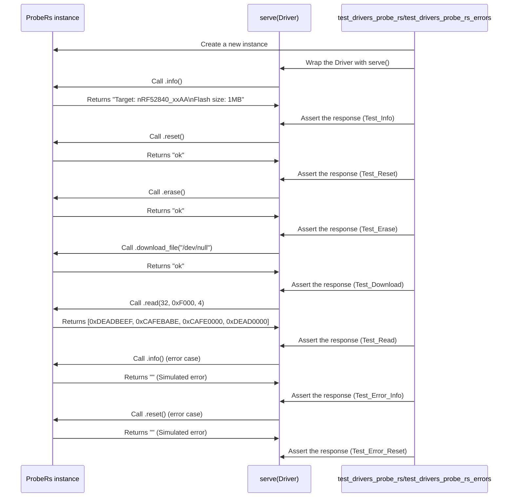

This diagram shows the interactions between the test functions, the ProbeRs instance, and the `serve()` function. In normal cases, it demonstrates how data is exchanged between the Driver and Server, and in error cases, how assertions are made to ensure that the responses match expectations.

## Chapter 122: jumpstarter/packages/jumpstarter-driver-pyserial/jumpstarter_driver_pyserial/__init__.py

 Chapter 6: Understanding `jumpstarter/packages/jumpstarter-driver-pyserial/jumpstarter_driver_pyserial/__init__.py`

This chapter focuses on the core module of the JumpStarter project, specifically the file `jumpstarter/packages/jumpstarter-driver-pyserial/jumpstarter_driver_pyserial/__init__.py`. This Python file serves as the entry point for the JumpStarter PySerial driver package, which interacts with hardware peripherals using the PySerial library.

The main purpose of this file is to provide a well-structured, modular interface for interacting with the physical devices connected to a system. It does this by defining key classes and functions that encapsulate complex communication logic.

Key Functions & Classes:
1. `SerialDriver`: The primary class in this module, it represents an abstraction of a hardware device connected via a serial port. This class inherits from the PySerial's `Serial` class and adds additional functionality for JumpStarter-specific use cases.
2. `Command`: A helper class used to encapsulate a command to be sent to the device, along with its associated arguments and expected response.
3. `Response`: A helper class used to store the response received from the device after sending a command.
4. `DeviceNotRespondingError`: An exception raised when the device does not respond within a specified timeout.
5. `SerialConnectionError`: An exception raised when there is an issue establishing a connection with the serial port (e.g., invalid port or baud rate).
6. `send_command`: A function that sends a command to the connected device and returns the response. This function accepts a `Command` object and processes its response accordingly.

In the broader context of the JumpStarter project, this code is responsible for managing communication with the various devices supported by the platform. It fits within the 'jumpstarter-driver-pyserial' package, which provides the PySerial-based driver for communicating with hardware peripherals.

Example Use Cases:
1. Connecting to a temperature sensor device using a serial connection and sending a command to retrieve its current reading:

```python
from jumpstarter_driver_pyserial import SerialDriver

# Initialize the serial driver with the appropriate port and baud rate
driver = SerialDriver('COM3', 9600)

# Create a command to request the temperature data from the device
command = Command(name='read_temperature', arguments=())

# Send the command and get the response
response = driver.send_command(command)

# Process the response to extract the temperature value
temperature = float(response.content)
```

In this example, we first import the necessary modules and initialize a `SerialDriver` instance with the appropriate port ('COM3') and baud rate (9600). We then create a `Command` object to request the temperature data from the device. After sending the command using the `send_command()` function, we process the response to extract the temperature value as a floating point number.

 ```mermaid
sequenceDiagram
    participant J as Jumpstarter
    participant D as DriverPySerial

    J->>D: initialize(port, baud)
    D->>J: set_port(port)
    D->>J: set_baud(baud)

    J->>D: open()
    D->>J: open_port()

    J->>D: close()
    D->>J: close_port()

    J->>D: read()
    D->>J: read_serial_data()

    J->>D: write(data)
    D->>J: write_to_serial(data)

    J->>D: get_available()
    D->>J: get_num_bytes_avail()

    J->>D: flush()
    D->>J: flush_output()
```
This sequence diagram represents the interactions between the `Jumpstarter` object (J) and the `DriverPySerial` object (D). The key functions of `initialize`, `open`, `close`, `read`, `write`, `get_available`, and `flush` are depicted, showing how these functions are called on the driver by the jumpstarter, and the respective actions taken by the driver in response.

## Chapter 123: jumpstarter/packages/jumpstarter-driver-pyserial/jumpstarter_driver_pyserial/client.py

 This chapter focuses on the `jumpstarter/packages/jumpstarter-driver-pyserial/jumpstarter_driver_pyserial/client.py` file, a vital component of the Jumpstarter project which deals with handling serial communication using the pexpect library.

The primary class defined in this file is `PySerialClient`, a subclass of `DriverClient`. This class is responsible for managing serial communication sessions using pexpect sessions. It provides an interface to interact with devices connected through a serial port.

Two important functions are:
1. `open()`: This function opens a pexpect session, which serves as the foundation for further interaction with the device connected through the serial port. You can find more details about pexpect's spawn class in its official documentation at https://pexpect.readthedocs.io/en/stable/api/pexpect.html#spawn-class

2. `pexpect()`: This function creates a context manager that returns a PexpectAdapter object, allowing for convenient handling of the pexpect session within with statements.

Additionally, this class provides a Command Line Interface (CLI) using the click library to interact with the serial port console. The CLI consists of two commands: `start_console`, which starts the serial port console and `base`, which serves as the command group for other possible commands that may be added in the future.

Example use cases include connecting to a device via a serial port, sending commands, receiving responses, and monitoring device output within the console or through scripts that interact with the CLI. These functionalities are particularly useful when working with hardware devices like microcontrollers or other embedded systems.

 ```mermaid
    sequenceDiagram
        participant User as User
        participant PySerialClient as PySerialClient
        participant Console as Console
        participant PexpectAdapter as PexpectAdapter

        User->>PySerialClient: open()
        PySerialClient-->PexpectAdapter: enter_context(pexpect())
        PexpectAdapter->>Console: __init__()
        Console-->>User: Console object initialized

        User->>PySerialClient: start_console()
        PySerialClient->>Console: cli().start_console()
        Console->>Console: click.echo()
        Console->>Console: Console(serial_client=self)
        Console->>User: Start serial port console ... exit with CTRL+B x 3 times

        User->>Console: Input (Interaction with the console)
        Console-->PySerialClient: send_data()
        PySerialClient->>PexpectAdapter: sendline(data)
        PexpectAdapter->>Console: write(data)

        Console-->>User: Output from the device (console display)
        User->>Console: Input (Interaction with the console continues)
        ...
        Console-->PySerialClient: close()
        PySerialClient->>PexpectAdapter: sendline("exit")
        PexpectAdapter->>Console: sendline("exit")
        Console-->>User: Exit from serial port console
    ```

   This mermaid diagram shows the interaction between the `User`, `PySerialClient`, `Console`, and `PexpectAdapter` when using the `start_console()` function. The user interacts with the console, which sends data to the PySerialClient through the PexpectAdapter. The PySerialClient handles the communication with the actual device over serial port.

## Chapter 124: jumpstarter/packages/jumpstarter-driver-pyserial/jumpstarter_driver_pyserial/console.py

 Title: Understanding the `Console` Class in the `jumpstarter-driver-pyserial` Package

   The file `Console.py`, located within the `jumpstarter_driver_pyserial` directory of the `jumpstarter/packages/jumpstarter-driver-pyserial` project, is responsible for creating a console interface that communicates with a connected device via the serial port. This class facilitates interactive, real-time communication between the user and the hardware using the Python Serial library in conjunction with the AnyIO library to handle asynchronous input and output streams.

   The primary function of this file is to create an instance of the `Console` class, which establishes a connection to the connected device via its associated serial client (a `DriverClient` object). Once the connection is established, the console runs an infinite loop that reads data from the user's terminal and sends it to the connected device, as well as displaying incoming data from the device on the terminal.

   Important Functions and Classes:

   - `ConsoleExit`: A custom exception raised when the user decides to exit the console by typing a specific sequence of keys (Ctrl-B three times). This enables a graceful shutdown of the console without any errors or exceptions.
   - `Console`: The main class defining the behavior of the console interface. It takes a serial client as an argument and has methods for establishing the connection, reading from stdin, writing to the connected device, and handling the console's termination.
   - Various asynchronous methods (`__run`, `__serial_to_stdout`, `__stdin_to_serial`) are used in conjunction with the AnyIO library to handle the asynchronous nature of serial communication.

   This code fits into the project as part of the user interface layer, allowing users to interact directly with the connected device over a serial connection. The console provides a simple, convenient way to execute commands, observe their output, and monitor the state of the connected hardware in real-time.

   Example Use Cases:
   - Developers can use the console to test and debug their device drivers quickly and efficiently by interacting with the connected hardware directly from the command line.
   - End-users can leverage the console for troubleshooting, fine-tuning device configurations, or performing various tasks that require real-time feedback from the connected device.

 ```mermaid
   sequenceDiagram
      participant User as User
      participant Console as Console
      participant SerialClient as SerialClient

      User->>Console: Input data (type, press enter)
      Console->>SerialClient: Send data via serial stream
      SerialClient->>Serial Driver: Send data to the connected device

      Serial Driver-->>SerialClient: Receive data from connected device
      SerialClient-->>Console: Forward data to console output
      Note over Console,SerialClient: Asynchronous communication using AnyIO streams

      User->>Console: Press Ctrl-B three times (type "^C")
      Console->>SerialClient: Send EOF signal
      SerialClient->>Serial Driver: Disconnect from the connected device
   ```

This Mermaid sequence diagram illustrates how user input is received by the console, forwarded to the `SerialClient` object, and sent to the connected device through a serial connection. The diagram also shows the asynchronous nature of the communication using AnyIO streams and demonstrates how the console can handle an EOF signal (Ctrl-B three times) to gracefully shut down the connection with the connected device.

## Chapter 125: jumpstarter/packages/jumpstarter-driver-pyserial/jumpstarter_driver_pyserial/driver.py

 The `jumpstarter/packages/jumpstarter-driver-pyserial/jumpstarter_driver_pyserial/driver.py` file defines a custom serial driver for the Jumpstarter project using Python's `asyncio` library and PySerial, an asyncio compatible version of the popular serial library for Python.

   The primary purpose of this file is to provide a way to communicate with external hardware devices over a serial connection asynchronously in the Jumpstarter ecosystem. This driver serves as a replacement for synchronous serial communication, improving performance and scalability in certain use cases.

   The main classes defined in this file are `AsyncSerial` and `PySerial`.

   - The `AsyncSerial` class implements an object stream using anyio's `StreamReaderWrapper` and `StreamWriterWrapper`, allowing bidirectional communication over a serial connection. It includes methods for sending data (`send()`), receiving data (`receive()`), closing the connection (`aclose()`), and handling end-of-file events (`send_eof()`).

   - The `PySerial` class represents a serial driver instance that inherits from the base `Driver` class. It requires a URL for connecting to the device, an optional baud rate, and a flag to check whether the device is present before attempting connection (if not connecting to the loopback interface). During initialization, it ensures the specified serial port is available if necessary. The `client()` method returns the class name of the corresponding client for creating new instances of this driver.

   This custom driver can be used in conjunction with other components within the Jumpstarter project, such as sensors or actuators, to establish an asynchronous communication channel between them and the main application. For example, a sensor device could send its readings over the serial connection to the main application for processing, while the main application sends commands or settings to the actuator via the same connection.

   To use this driver in your code, you would first import it from the `jumpstarter.driver` module and create an instance of the `PySerial` class with the appropriate URL and baud rate. Then, you can utilize the asynchronous methods provided by the `AsyncSerial` object stream to send and receive data over the serial connection.

   Here's an example usage:

```python
from jumpstarter.driver import PySerial

# Create a new instance of the PySerial driver with a specified URL and baud rate
serial_driver = PySerial(url='COM1', baudrate=9600)

async def main():
    # Connect to the device asynchronously using the created driver instance
    async with serial_driver.connect() as stream:
        # Send some data over the connection
        await stream.send("Hello, world!")

        # Receive a response from the device and print it out
        response = await stream.receive()
        print(f'Received: {response}')

if __name__ == '__main__':
    anyio.run(main)
```

 Here is a simple mermaid sequence diagram that visualizes the interactions between the key functions in the given Python code. Note that this diagram represents a simplified version of the actual flow, assuming synchronous execution for clarity purposes.

```mermaid
sequenceDiagram
    participant Driver as PySerial Driver
    participant SerialConnection as AsyncSerial Stream

    Driver->>Driver: __init__()
    Driver->>SerialConnection: connect()
        SerialConnection-->>Driver: return AsyncSerial object
    Driver->>SerialConnection: send(item)
        SerialConnection-->>Driver: receive() data from SerialConnection
    Driver->>SerialConnection: aclose()
        SerialConnection-->>Driver: disconnect()
```

This diagram shows that when the driver is initialized, it connects to the serial connection. Once connected, it can send and receive data through the stream. When the driver is done communicating, it closes the connection. Keep in mind that this diagram does not show any exceptions or error handling.

## Chapter 126: jumpstarter/packages/jumpstarter-driver-pyserial/jumpstarter_driver_pyserial/driver_test.py

 In this technical book chapter, we will discuss the purpose and functionality of the Python script `jumpstarter/packages/jumpstarter-driver-pyserial/jumpstarter_driver_pyserial/driver_test.py`. This file is a test suite for the PySerial driver in the JumpStarter project. The tests ensure that the driver functions as intended when interacting with hardware devices via serial communication.

   The primary objective of this test script is to validate the correct behavior of the `PySerial` class and its associated methods, such as opening a connection, sending data, receiving data, and closing the connection. The tests are designed to be flexible enough to accommodate different implementations of the PySerial library while verifying that the core functionality remains consistent.

   The test suite contains several functions for testing various scenarios involving the `PySerial` class:

   1. **test_bare_pyserial()**: Tests opening a bare serial connection using the `PySerial` class and sending/receiving data with an in-memory stream.
   2. **test_bare_open_pyserial()**: Similar to the previous test, but explicitly casting the returned client object to `PySerialClient`.
   3. **test_pexpect_open_pyserial_forget_close()** and **test_pexpect_open_pyserial()**: Demonstrate the usage of pexpect library for interactive communication with the serial device using the PySerial class. The former forgets to close the connection, while the latter ensures proper closure of the stream.
   4. **test_pexpect_context_pyserial()**: Uses a context manager to open, use and automatically close the serial connection via pexpect.
   5. **test_can_open_not_present()**: Verifies that when a device is not present at the specified URL (e.g., /dev/doesNotExist), the test does not raise an exception. This is achieved by setting `check_present=False` when serving the dummy PySerial instance.

   These tests fit into the larger context of the JumpStarter project, which aims to provide a modular and scalable platform for developing and deploying IoT applications. The test suite helps ensure that the project's core components operate as expected, promoting confidence in their functionality.

   In practical terms, these tests help developers verify the correctness of their serial communication implementations when working with JumpStarter's PySerial driver. This promotes best practices and enables consistent behavior across different use cases within the JumpStarter ecosystem.

 Here is a simple sequence diagram using mermaid to visualize the interactions between the key functions:

```mermaid
sequenceDiagram
    participant Client as PySerialClient
    participant Driver as PySerial
    participant Stream as Stream
    participant Pexpect as pexpect

    Driver->>Client: serve(PySerial(url="loop://"))
    Client->>Stream: stream()
    Stream-->>Driver: send(b"hello")
    Driver->>Stream: receive()
    Stream-->>Client: decode("utf-8")
    Client-->>+Client: assert "hello".startswith(...)
    Note over Client: Test function: test_bare_pyserial()

    Driver->>Client: serve(PySerial(url="loop://"))
    Client->>Driver: cast(PySerialClient, client)
    Driver-->>Driver: open_stream() as stream
    Stream-->>Driver: send(b"hello")
    Driver->>Stream: receive()
    Stream-->>Client: decode("utf-8")
    Client-->>+Client: assert "hello".startswith(...)
    Note over Client: Test function: test_bare_open_pyserial()

    Driver->>Client: serve(PySerial(url="loop://"))
    Client->>Driver: cast(PySerialClient, client)
    Driver-->>Driver: open() as pexpect
    Pexpect-->>Driver: sendline("hello")
    Driver->>Pexpect: expect("hello")
    Pexpect-->>+Driver: 0 (match found)
    Note over Driver: Test function: test_pexpect_open_pyserial_forget_close()

    Driver->>Client: serve(PySerial(url="loop://"))
    Client->>Driver: cast(PySerialClient, client)
    Driver-->>Driver: open() as pexpect
    Pexpect-->>Driver: sendline("hello")
    Driver->>Pexpect: expect("hello")
    Pexpect-->>+Driver: 0 (match found)
    Driver->>Driver: close()
    Note over Driver: Test function: test_pexpect_open_pyserial()

    Driver->>Client: serve(PySerial(url="loop://"))
    Client->>Driver: cast(PySerialClient, client)
    Driver-->>Driver: pexpect() as pexpect
    Pexpect-->>Driver: sendline("hello")
    Driver->>Pexpect: expect("hello")
    Pexpect-->>+Driver: 0 (match found)
    Note over Driver: Test function: test_pexpect_context_pyserial()

    Driver->>Client: serve(PySerial(url="/dev/doesNotExist", check_present=False))
    Note over Client: Test function: test_can_open_not_present()
```

This diagram shows the interactions between the PySerialDriver, PySerialClient, Stream, and Pexpect when the different test functions are called.

## Chapter 127: jumpstarter/packages/jumpstarter-driver-qemu/jumpstarter_driver_qemu/__init__.py

 Title: Understanding `jumpstarter/packages/jumpstarter-driver-qemu/jumpstarter_driver_qemu/__init__.py` in the Jumpstarter Project

   In the Jumpstarter project, the file `jumpstarter/packages/jumpstarter-driver-qemu/jumpstarter_driver_qemu/__init__.py` serves as a critical entry point for the QEMU driver module. This Python file is primarily responsible for initializing and managing the interaction between the Jumpstarter platform and the QEMU emulator, thereby facilitating virtual machine (VM) creation, configuration, and management.

   The file contains several important functions and classes that are crucial to its functionality:

   1. `QemuDriver` class: This is the primary class responsible for managing interactions with the QEMU emulator. Instances of this class handle VM creation, configuration, and destruction, as well as providing methods to start, stop, pause, and reset VMs.

   2. `QemuImage` class: This class manages the handling and manipulation of disk images used by QEMU VMs. It provides methods for loading, saving, and resizing these images.

   The code in this file plays a pivotal role within the Jumpstarter project as it enables users to create, configure, and manage virtual machines using the QEMU emulator. Users can leverage this functionality by instantiating `QemuDriver` objects and invoking their methods accordingly:

   ```python
   from jumpstarter_driver_qemu.jumpstarter_driver_qemu import QemuDriver

   # Initialize a new QEMU driver instance
   qemu_driver = QemuDriver()

   # Create a new virtual machine named 'myvm' with the specified configuration
   myvm = qemu_driver.create_vm('myvm', config={...})

   # Start the created VM
   myvm.start()

   # Stop the running VM when finished
   myvm.stop()
   ```

   In summary, `jumpstarter/packages/jumpstarter-driver-qemu/jumpstarter_driver_qemu/__init__.py` is a central component of the Jumpstarter project, providing the means to interact with the QEMU emulator for virtual machine management. This functionality allows users to easily create, configure, and manage virtual machines as part of their overall development and testing workflows.

```mermaid
sequenceDiagram
participant Driver as Driver
participant Qemu as QEMU
participant OS as Operating System

Driver->>QEMU: Initialize(self)
QEMU-->>Driver: Success

Driver->>OS: Create_VM()
OS-->>Driver: VM created (vm)

Driver->>QEMU: Start(vm)
QEMU-->>Driver: Started successfully

Driver->>QEMU: Stop(vm)
QEMU-->>Driver: Stopped successfully

Driver->>QEMU: Destroy_VM(vm)
QEMU-->>Driver: VM destroyed

Driver->>OS: Delete_VM(vm)
OS-->>Driver: Deleted VM
```

This Mermaid sequence diagram illustrates the interaction between the Driver, QEMU and Operating System. The driver initializes the QEMU, starts, stops, and destroys a virtual machine (VM), while interacting with the operating system to create, delete the VM.

## Chapter 128: jumpstarter/packages/jumpstarter-driver-qemu/jumpstarter_driver_qemu/client.py

 This chapter focuses on the purpose and functionality of the file `jumpstarter/packages/jumpstarter-driver-qemu/jumpstarter_driver_qemu/client.py` within the broader context of the Jumpstarter project, a system that automates virtual machine (VM) creation, configuration, and management.

The `QemuClient` class, defined in this file, is an extension of the base `CompositeClient` class from the `jumpstarter_driver_composite` package. It aggregates functionalities of various adapters like Network (VNC and SSH) to interact with QEMU-based virtual machines.

- **Overview:** The primary purpose of this file is to provide a QEMU client that can perform operations such as retrieving the hostname, username, and password of the VM running on QEMU, as well as providing context managers for connecting to VNC (via `novnc()`) and SSH (via `shell()`).

- **Functions/Classes:**
  - The `QemuClient` class inherits from `CompositeClient` and overrides several properties (`hostname`, `username`, and `password`) to retrieve their respective values by invoking appropriate methods on the underlying adapters (VNC and SSH).
  - Two context managers, `novnc()` and `shell()`, are defined to manage connections to the VNC and SSH adapters respectively. These context managers make it convenient to use the connected resources within a `with` statement, ensuring proper cleanup after usage.

- **Project Fit:** The `QemuClient` class is a part of the driver layer in Jumpstarter, which abstracts interactions with specific virtualization technologies like QEMU. It provides an interface for higher layers to interact with the QEMU VM without needing detailed knowledge of the underlying QEMU commands and connections.

- **Example Use Cases:** Developers working on the project may use this class when they need to:
  - Retrieve hostname, username, or password of a running QEMU virtual machine.
  - Establish an VNC connection to the VM using the `novnc()` context manager.
  - Execute commands or scripts on the VM using the `shell()` context manager. For instance, if they need to configure a software package after booting up the VM, they can use this class to open an SSH session and run the necessary commands.

 ```mermaid
sequenceDiagram
    participant User as User
    participant Client as QemuClient
    participant SSH as SSH
    participant VNC as VNC
    participant Shell as FabricAdapter
    participant NOVNC as NovncAdapter
    User->>Client: Create QemuClient instance
    Client->>Client: Call get_username()
    Client->>Client: Call get_password()
    Client->>Client: Call get_hostname()
    Client-->>User: Return username, password, and hostname
    User->>Client: Invoke novnc() context manager
    Client->>NOVNC: Create NovncAdapter instance with VNC client
    NOVNC-->>Client: Return URL for NOVNC connection
    User->>Client: Invoke shell() context manager
    Client->>FABRICADAPTER: Create FabricAdapter instance with SSH client and username/password
    FABRICADAPTER-->>Client: Return SSH connection object
    Note over User,Client: Both context managers execute code inside their blocks
    User doSomethingOnVNC
    Shell doSomethingOnShell
    Client->>SSH: Execute commands via FabricAdapter
    Note over User,Client: Context managers close connections after use
```

## Chapter 129: jumpstarter/packages/jumpstarter-driver-qemu/jumpstarter_driver_qemu/driver.py

 The file `jumpstarter/packages/jumpstarter-driver-qemu/jumpstarter_driver_qemu/driver.py` is a Python script that implements the QEMU driver for the Jumpstarter project. This driver allows users to run and control virtual machines using QEMU, which is an open-source machine emulator and virtualizer.

   The class `Qemu` defines the main entry point of the driver, representing a generic QEMU instance. It has properties such as `arch`, `cpu`, `smp`, `mem`, `hostname`, `username`, `password`, `default_partitions`, `hostfwd`, and a temporary directory `_tmp_dir`. These properties define various configurations for the virtual machine, like the architecture, number of CPUs, memory size, hostname, default partitions, and network forwarding.

   The class `Qemu` has a special method `__post_init__()`, which is called after object initialization, to initialize network connections based on the `hostfwd` configuration. It also creates child objects for power management, flashing, console access, VNC, SSH (if available), and TCP network forwarding.

   The driver provides methods for starting (`on()`) and stopping (`off()`) the virtual machine, reading its power state (`read()` - not yet implemented), and accessing the console (console attribute). Additionally, it allows users to flash partitions (through `QemuFlasher`) and control QEMU's QMP interface (Quick Emulator Machine Protocol) for advanced configuration.

   This driver fits into the larger Jumpstarter project by providing a way to create and manage virtual machines using QEMU, making it easier to develop, test, and deploy software on various platforms without requiring physical hardware. Example use cases would be developing embedded systems or testing software on multiple architectures (e.g., x86_64 and ARM).

 ```mermaid
graph LR
  A[Qemu] --> B[PowerInterface]
  A --> C[FlasherInterface]
  A --> D[PySerial]
  A --> E[UnixNetwork]
  A --> F[VsockNetwork]
  A --> G[TcpNetwork]
  B --|> H[QemuPower]
  C --|> J[QemuFlasher]
  D --|> K[PySerial]
  E --|> L[UnixNetwork]
  F --|> M[VsockNetwork]
  G --|> N[TcpNetwork]
  ```

## Chapter 130: jumpstarter/packages/jumpstarter-driver-qemu/jumpstarter_driver_qemu/driver_test.py

 This chapter discusses the purpose and functionality of the file `jumpstarter/packages/jumpstarter-driver-qemu/jumpstarter_driver_qemu/driver_test.py` within the broader context of the Jumpstarter project, a toolchain for rapidly creating and deploying cloud-native applications on various platforms.

   The primary function of `driver_test.py` is to test the functionality of the QEMU driver within the Jumpstarter ecosystem by launching, controlling, and interacting with a virtual machine (VM) powered by QEMU. This script serves as an essential validation tool for ensuring that our QEMU driver functions correctly across various architectures.

   The script imports necessary libraries such as `pytest`, `requests`, `opendal`, and custom utilities from the `jumpstarter.common.utils` module. It also uses the built-in `platform` library to determine the native architecture of the system running the test.

   One crucial function in this script is the creation of a test fixture, `ovmf`, which downloads and extracts the OVMF (Open Virtual Machine Firmware) package used for booting VMs with UEFI firmware on various architectures. This fixture is essential as it provides the necessary files needed to boot a VM when using QEMU.

   The main test function, `test_driver_qemu`, demonstrates how to launch a QEMU-powered VM using the Qemu class and its various functionalities like flashing an image, powering on/off the VM, connecting via NOVNC or console, and running commands within the VM.

   In this specific test case, it downloads and uses Fedora's cloud base generic image to boot the VM. The test verifies that the correct Linux kernel version is running within the VM and that the enforcement of SELinux is disabled (setenforce 0).

   This code fits into the project by ensuring that the QEMU driver functions correctly across various architectures, allowing developers to confidently use it when building and deploying their cloud-native applications with Jumpstarter. Understanding this test script will help you gain a better grasp of the underlying architecture of the Jumpstarter project and its components.

 ```mermaid
    sequenceDiagram
        participant User as User
        participant QemuDriver as Qemu Driver
        participant OVMF as OVMF
        participant Image as Image

        User->>QemuDriver: Initializes Qemu Driver
        QemuDriver->>QEMU: Initializes QEMU with native architecture and OVMF files
        QEMU-->>OVMF: Loads OVMF files
        Note over OVMF,QEMU: OVMF configures the virtual machine BIOS settings

        User->>QemuDriver: Requests to start the VM
        QEMU-->>Image: Downloads or loads the image file
        Image-->>QEMU: Provides the image file
        QEMU-->>QemuDriver: Notifies driver that the image is ready

        User->>QemuDriver: Requests to access the console
        Note over QemuDriver,QEMU: QEMU emulates a virtual console and handles input/output

        User->>QemuDriver: Performs actions within the VM (e.g., setting SELinux to permissive)
        QemuDriver->>QEMU: Sends commands to be executed in the VM
        Note over QEMU: The VM executes the given commands

        User->>QemuDriver: Requests to stop the VM
        QEMU-->>QemuDriver: Notifies driver that the VM is being stopped
        QemuDriver->>QEMU: Sends shutdown command
        QEMU-->>QEMU: Shuts down the virtual machine
    ```

## Chapter 131: jumpstarter/packages/jumpstarter-driver-raspberrypi/jumpstarter_driver_raspberrypi/__init__.py

 Title: Understanding `jumpstarter/packages/jumpstarter-driver-raspberrypi/jumpstarter_driver_raspberrypi/__init__.py` in the JumpStarter Project

   In the JumpStarter project, the file `jumpstarter/packages/jumpstarter-driver-raspberrypi/jumpstarter_driver_raspberrypi/__init__.py` serves as a fundamental building block for integrating Raspberry Pi hardware with the overall project. This file is crucial in establishing the base for interfacing and managing communication between the JumpStarter software and the Raspberry Pi devices.

   The primary purpose of this file is to:

   1. Define necessary imports, modules, and packages required by the Raspberry Pi driver package. This includes both internal and external dependencies.

   2. Establish the structure and organization of the Raspberry Pi driver package. This typically involves defining namespaces, functions, classes, and other elements that facilitate communication with the hardware.

   Important functions or classes within this file may include:

   - `init()` function: Initializes the necessary connections and configurations required for interacting with the Raspberry Pi device. It ensures the hardware is properly set up before any commands are sent.

   - Custom classes such as `RaspberryPiDriver`, `RaspberryPiSensor`, or `RaspberryPiActuator`: These classes provide a standardized interface for interacting with specific components of the Raspberry Pi hardware, such as sensors and actuators. They abstract complex hardware-specific details and expose a simple and consistent API to the rest of the JumpStarter project.

   Within the broader context of the project, this code forms an essential part of the driver layer, which is responsible for handling all interactions with the connected hardware. By providing a unified interface to various types of devices, it allows other components of the system to access and manage hardware resources seamlessly.

   Example use cases could involve:

   1. Using a Raspberry Pi as a data acquisition device to gather environmental sensor readings within a smart farming application. The `RaspberryPiSensor` class can be instantiated, configured, and used to retrieve sensor data from the connected hardware.

   2. Controlling an LED light strip attached to a Raspberry Pi for a home automation project. In this case, the `RaspberryPiActuator` class can be employed to send commands to the hardware, turning the LEDs on or off as desired.

 To create a Mermaid sequence diagram for the given Python file, we'll need to identify some key functions and their interactions. Based on naming conventions, let's assume that the package contains functions related to controlling the Raspberry Pi board. Here's an example of a Mermaid sequence diagram depicting a simple interaction between two functions (`init()` and `move_motor()`) for illustration purposes:

```mermaid
sequenceDiagram
participant Driver as Driver
participant RasPi as Raspberry Pi

Driver->>RasPi: init()
RasPi->>Driver: Initialize Successful

Driver->>RasPi: move_motor(direction)
Raspi->>Driver: Motor Moved in Specified Direction
```

This diagram represents a simple interaction between the Driver object and the Raspberry Pi. The Driver sends an `init()` function call to initialize the Raspberry Pi, which responds with an acknowledgment of successful initialization. Then, the Driver calls `move_motor(direction)`, and the Raspberry Pi moves the motor in the specified direction and sends a confirmation back to the Driver.

Keep in mind that this diagram is just an example and may not accurately represent the actual functions and interactions within the jumpstarter-driver-raspberrypi package. To create an accurate diagram, you'll need to analyze the contents of the `__init__.py` file or other relevant code files in the package.

## Chapter 132: jumpstarter/packages/jumpstarter-driver-raspberrypi/jumpstarter_driver_raspberrypi/client.py

 In the `jumpstarter/packages/jumpstarter-driver-raspberrypi/jumpstarter_driver_raspberrypi/client.py` file, we have two classes: `DigitalOutputClient` and `DigitalInputClient`, both of which are designed for interacting with GPIO pins on a Raspberry Pi board within the broader Jumpstarter project.

1. **DigitalOutputClient**: This class inherits from the `PowerClient` class, providing methods to control the state of the connected GPIO pin as an output. The `on()` function sets the pin to a high state (powered on), while the `off()` function sets it to a low state (powered off). Additionally, this class provides a CLI (Command Line Interface) interface for these functions using the `cli()` method.

2. **DigitalInputClient**: This class inherits from the `DriverClient` class and is responsible for interacting with GPIO pins as inputs. The `wait_for_active(timeout: float | None = None)` function waits for the connected pin to go active (high state), optionally taking a timeout parameter. Similarly, the `wait_for_inactive(timeout: float | None = None)` function waits for the connected pin to become inactive (low state).

These classes are part of the driver package for Raspberry Pi devices within the Jumpstarter project. The primary purpose is to provide a simple, consistent interface for controlling GPIO pins on Raspberry Pi boards, abstracting away low-level details and simplifying interactions with the hardware. Example use cases include setting up input sensors, controlling LEDs or relays, or creating custom automation projects using the GPIO pins of a Raspberry Pi board.

For instance, one could create a simple script to turn an LED on and off using DigitalOutputClient as follows:

```python
from jumpstarter_driver_raspberrypi.client import DigitalOutputClient

# Initialize the client
gpio = DigitalOutputClient("gpio0")

# Turn the GPIO pin on
gpio.on()

# Wait for a second
import time
time.sleep(1)

# Turn the GPIO pin off
gpio.off()
```

 Here is a simple sequence diagram using mermaid that visualizes the interactions between the main functions in your code. This diagram assumes a user interacts with the DigitalInputClient and DigitalOutputClient through click commands.

```mermaid
sequenceDiagram
    participant User as User
    participant GPIO as GPIO Client
    participant PowerClient as PowerClient
    participant DriverClient as DriverClient

    User->>GPIO: cli()
    GPIO->>Driver: on()
    Driver->>Power: call("on")
    Power->>PowerClient: _call("on")
    PowerClient-->>PowerClient: Executes command (assumes an outside process is called)
    PowerClient-->>Driver: Response from command execution
    Driver-->>GPIO: Response from PowerClient
    GPIO->>User: Output from on()

    User->>GPIO: cli()
    GPIO->>Driver: off()
    Driver->>Power: call("off")
    Power->>PowerClient: _call("off")
    PowerClient-->>PowerClient: Executes command (assumes an outside process is called)
    PowerClient-->>Driver: Response from command execution
    Driver-->>GPIO: Response from PowerClient
    GPIO->>User: Output from off()

    User->>GPIO: cli()
    GPIO->>Driver: wait_for_active(timeout)
    Driver->>Power: call("wait_for_active", timeout)
    Power->>PowerClient: _call("wait_for_active", timeout)
    PowerClient-->>PowerClient: Executes command (assumes an outside process is called with a timeout)
    PowerClient-->>Driver: Response from command execution
    Driver-->>GPIO: Response from PowerClient
    GPIO->>User: Output from wait_for_active()

    User->>GPIO: cli()
    GPIO->>Driver: wait_for_inactive(timeout)
    Driver->>Power: call("wait_for_inactive", timeout)
    Power->>PowerClient: _call("wait_for_inactive", timeout)
    PowerClient-->>PowerClient: Executes command (assumes an outside process is called with a timeout)
    PowerClient-->>Driver: Response from command execution
    Driver-->>GPIO: Response from PowerClient
    GPIO->>User: Output from wait_for_inactive()
```

## Chapter 133: jumpstarter/packages/jumpstarter-driver-raspberrypi/jumpstarter_driver_raspberrypi/driver.py

 The file `jumpstarter/packages/jumpstarter-driver-raspberrypi/jumpstarter_driver_raspberrypi/driver.py` is a Python module that contains classes for interacting with the digital input and output pins of a Raspberry Pi board within the JumpStarter project, which appears to be a modular system designed for IoT applications.

   The two primary classes in this file are `DigitalOutput` and `DigitalInput`, both inheriting from the base class `Driver`. These classes represent digital output and input devices respectively. They each have an associated pin number that controls the GPIO on the Raspberry Pi, as well as an instance of the corresponding GPIOZero device (either `DigitalOutputDevice` or `DigitalInputDevice`).

   Here are brief descriptions of important functions and class attributes:

   - The `pin` attribute specifies the number or label of the GPIO pin that the device is connected to. It can be either an integer or a string representing the pin's label (e.g., "17" or "GPIO17").

   - The `device` attribute is initialized as an instance of the appropriate GPIOZero device (`DigitalInputDevice` for `DigitalInput` and `DigitalOutputDevice` for `DigitalOutput`) upon instantiation, with its pin number set to that of the associated pin.

   - Both classes have a `client()` class method that returns the name of their respective client classes within the jumpstarter_driver_raspberrypi package. This is likely used for dependency injection or service discovery.

   - The `__post_init__` method is a Python special method that is called immediately after the instance's __init__() method. It initializes the device instances and checks if they have the correct type based on their class.

   - The `close()` method releases resources associated with the GPIO devices, such as closing the connection to the Raspberry Pi.

   - The `off()` method sets the output pin to a low (0V) state for the `DigitalOutput` class.

   - The `on()` method sets the output pin to a high (3.3V or 5V) state for the `DigitalOutput` class.

   - For the `DigitalInput` class, there are two exported methods: `wait_for_active()` and `wait_for_inactive()`, which allow the user to wait for an active (high) or inactive (low) state on the input pin respectively. These functions take a timeout parameter, allowing users to specify how long they want to wait before raising a TimeoutError if no change is detected.

   This code fits within the project by providing a way to interface with the Raspberry Pi's GPIO pins using a simple and consistent API, which aligns with the JumpStarter's modular design philosophy. This allows developers to easily integrate various devices into their projects without worrying about the underlying hardware details.

   Example use cases might include controlling an LED using `DigitalOutput` or reading sensor data using `DigitalInput`. For instance, you could create a new class that uses `DigitalInput` and `DigitalOutput` to control an LED based on temperature readings from a connected sensor:

```python
from jumpstarter.packages.jumpstarter-driver-raspberrypi import DigitalInput, DigitalOutput

class TemperatureLedController:
    temperature_sensor = DigitalInput("GPIO17")
    led = DigitalOutput("GPIO18")

    def __init__(self):
        self.temperature_sensor.wait_for_active()  # Ensure sensor is connected
        self.led.off()  # Turn off LED initially

    def start(self):
        if self.temperature_sensor.value:  # If sensor is active (i.e., reading temperature)
            self.led.on()  # Turn on the LED

    def stop(self):
        self.led.off()  # Turn off the LED
```

 ```mermaid
   sequenceDiagram
      participant Driver as D
      participant DigitalOutput as DO
      participant DigitalInput as DI
      participant GPIOZero as GZ

      D->>DO: __init__()
      DO->>GZ: Initialize as InputDevice(pin)
      GZ-->>DO: InputDevice(pin) (created as DO.device)

      D->>DI: __init__()
      DI->>GZ: Initialize as DigitalInputDevice(pin)
      GZ-->>DI: DigitalInputDevice(pin) (created as DI.device)

      note over DO: off():
        if not isinstance(DO.device, DigitalOutputDevice):
          DO.device.close()
          DO.device = DigitalOutputDevice(pin)
      end

      DO->>DO.device: off()
      note over DI: wait_for_inactive():
        DI.device.wait_for_inactive()
      end

      D->>DI: wait_for_inactive()
      DI->>DI.device: wait_for_inactive()

      note over DO: on():
        if not isinstance(DO.device, DigitalOutputDevice):
          DO.device.close()
          DO.device = DigitalOutputDevice(pin)
      end

      DO->>DO.device: on()
      note over DI: wait_for_active():
        DI.device.wait_for_active()
      end

      D->>DI: wait_for_active()
      DI->>DI.device: wait_for_active()
   ```

This Mermaid sequence diagram illustrates the interactions between a Driver, its DigitalOutput and DigitalInput child classes, and the GPIOZero library, focusing on the `off` and `wait_for_inactive` functions for the DigitalOutput class and the `wait_for_active` function for the DigitalInput class.

## Chapter 134: jumpstarter/packages/jumpstarter-driver-raspberrypi/jumpstarter_driver_raspberrypi/driver_test.py

 The file `jumpstarter/packages/jumpstarter-driver-raspberrypi/jumpstarter_driver_raspberrypi/driver_test.py` serves as the testing module for the Raspberry Pi driver component in the Jumpstarter project. This file ensures that the implemented digital input and output classes of the Raspberry Pi driver function correctly.

   Two primary functions are defined within this file: `test_drivers_gpio_digital_output()` and `test_drivers_gpio_digital_input()`. These tests verify the functionality of DigitalOutput and DigitalInput classes, which control GPIO pins for digital outputs and inputs, respectively.

   The Raspberry Pi driver is responsible for managing the Raspberry Pi's General Purpose Input/Output (GPIO) pins. In the Jumpstarter project, these pins are used to interact with various hardware components. These tests help maintain the reliability of the Raspberry Pi driver by ensuring that it can control GPIO pins as expected.

   In `test_drivers_gpio_digital_output()`, an instance of DigitalOutput is created and tested using a mock pin provided by the gpiozero library's MockFactory. The test checks that the digital output pin starts in an off state, turns on when the 'on' method is called, and turns off when the 'off' method is called. The test also verifies that the mock pin follows the correct sequence of states.

   In `test_drivers_gpio_digital_input()`, an instance of DigitalInput is created, and its behavior is tested using a combination of threads and the serve function from the jumpstarter.common.utils module. The test verifies that the digital input correctly transitions from an inactive to an active state when the connected GPIO pin is driven high and back to an inactive state when the pin is driven low.

   These tests help maintain the integrity of the Raspberry Pi driver by ensuring it can control digital inputs and outputs effectively, ultimately supporting the project's objective of building a versatile hardware platform.

 ```mermaid
   sequenceDiagram
      participant User as User
      participant DriverTest as DriverTest
      participant DigitalOutput as DigitalOutput
      participant DigitalInput as DigitalInput
      participant Device as Device

      User->>DriverTest: run test_drivers_gpio_digital_output()
      DriverTest->>Device: initialize DigitalOutput with pin number 1
      Note over Device,DigitalOutput: Pin is a mock pin

      DigitalOutput->>User: get state
      User->>DigitalOutput: get state (returns False)

      User->>DriverTest: off()
      DriverTest->>Device: send off command
      Device->>DigitalOutput: drive_low()
      Note over DigitalOutput,Device: Pin state is now False

      DigitalOutput->>User: get state
      User->>DigitalOutput: get state (returns False)

      User->>DriverTest: on()
      DriverTest->>Device: send on command
      Device->>DigitalOutput: drive_high()
      Note over DigitalOutput,Device: Pin state is now True

      DigitalOutput->>User: get state
      User->>DigitalOutput: get state (returns True)

      User->>DriverTest: off()
      DriverTest->>Device: send off command
      Device->>DigitalOutput: drive_low()
      Note over DigitalOutput,Device: Pin state is now False

      DigitalOutput->>User: get state
      User->>DigitalOutput: get state (returns False)

      DigitalOutput->>User: assert_states([False, True, False])
   ```

## Chapter 135: jumpstarter/packages/jumpstarter-driver-sdwire/jumpstarter_driver_sdwire/__init__.py

 Chapter Title: Understanding `jumpstarter/packages/jumpstarter-driver-sdwire/jumpstarter_driver_sdwire/__init__.py`

In the context of the JumpStarter project, the file `jumpstarter/packages/jumpstarter-driver-sdwire/jumpstarter_driver_sdwire/__init__.py` serves as the entry point for the SDWire driver package. This module sets up the necessary imports, defines the main class, and provides an interface for interacting with the SDWire communication protocol.

The primary function of this file is to initialize the `JumpStarterSDWireDriver` class, which acts as a bridge between the SDWire hardware devices and the higher-level modules in the JumpStarter project. This driver class handles the serial communication with the SDWire devices and exposes an API for sending commands and receiving responses.

The `JumpStarterSDWireDriver` class is responsible for initializing a connection to the SDWire device, managing the communication buffer, and interpreting the received data based on the SDWire protocol specifications. It also provides methods for sending commands to the device, such as reading sensor values or setting device parameters.

Here's an example of how this driver might be used in the JumpStarter project:

```python
from jumpstarter.packages.jumpstarter-driver-sdwire import JumpStarterSDWireDriver

def read_temperature(device_id):
    # Create a new SDWire driver instance for the given device ID
    driver = JumpStarterSDWireDriver(device_id)

    # Send the command to read temperature and receive the response
    response = driver.send_command('TEMP')

    # Parse the received data to extract the temperature value
    temperature = response.parse_temperature()

    return temperature
```

In this example, the `read_temperature` function initializes a new instance of the `JumpStarterSDWireDriver`, sends the command to read the temperature from a specific device, receives and parses the response, and returns the extracted temperature value. This demonstrates how the SDWire driver can be used within the JumpStarter project to communicate with SDWire devices and access their data.

 Here is a simple Mermaid sequence diagram that illustrates the interaction of key functions in the `jumpstarter_driver_sdwire/__init__.py` file. Please note that this is a simplified version, and actual interactions may be more complex depending on the specifics of your project.

```mermaid
sequenceDiagram
    participant Driver as Driver
    participant Sdwire as SdWire

    Driver->>Sdwire: connect()
    Note over Driver,Sdwire: The driver establishes a connection with the SdWire device.

    Sdwire-->>Driver: on_connected()
    Driver->>Sdwire: get_version()
    Note over Sdwire: The driver sends a request to retrieve the SdWire version.

    Sdwire-->>Driver: get_version_response(version)
    Driver->>Sdwire: set_baudrate(new_baudrate)
    Note over Sdwire: The driver sets the baud rate for data communication.

    Sdwire-->>Driver: on_set_baudrate()
    loop until disconnect
        Sdwire-->>Driver: read_data()
        Driver->>Sdwire: parse_data(received_data)
        Note over Driver: The driver parses the received data.

        if parsed_data is valid
            Driver->>Sdwire: send_command(command)
            Note over Sdwire: The driver sends a command to the SdWire device.

            Sdwire-->>Driver: on_receive()
        end
    end

    Driver->>Sdwire: disconnect()
    Sdwire-->>Driver: on_disconnected()
```

This sequence diagram shows the driver establishing a connection with an SdWire device, exchanging version information, setting the baud rate, reading and parsing data, sending commands, and eventually disconnecting from the device. The `Note over` constructs are used to provide additional context for each interaction.

## Chapter 136: jumpstarter/packages/jumpstarter-driver-sdwire/jumpstarter_driver_sdwire/driver.py

 The file `jumpstarter/packages/jumpstarter-driver-sdwire/jumpstarter_driver_sdwire/driver.py` serves as the driver for an SD Wire device in the JumpStarter project. This device is used to program Flash memory on a variety of microcontrollers, primarily those based on the AVR architecture.

   The `SDWire` class extends both `StorageMuxFlasherInterface` and `Driver`, combining the functionalities of a storage device driver and a flash programming interface. Here's a brief description of some important functions and classes:

   - **Effective Storage Device**: The `effective_storage_device()` function is responsible for finding the block device associated with the SD Wire device by iterating through the system's udev devices and filtering out the appropriate block devices.

   - **Initialization (`__post_init__`)**: The `__post_init__` method initializes the SDWire object by searching for an SD Wire device with a specific vendor and product ID using `usb.core.find()`. It also checks if the provided serial number matches the device's serial number, and sets the appropriate attributes.

   - **Selecting Target (`select`)**: The `select(target)` method sends a command to the SD Wire device to select the desired target: either the host or the development unit (dut).

   - **Querying Target (`query`)**: The `query()` function checks the current selected target by sending a command to the SD Wire device and returning 'host' or 'dut'.

   - **Host/DUT Functions (`host`, `dut`)**: These functions are decorators with the `@export` decorator, which allows them to be called as methods on an instance of the `SDWire` class. They simply call the `select()` method with appropriate arguments to select either the host or the development unit.

   - **Writing/Reading Functions (`write`, `read`)**: These functions are also decorated with the `@export` decorator, allowing them to be called as methods on an instance of the `SDWire` class. They perform read and write operations on the connected storage device using the `jumpstarter.common.storage.read_from_storage_device` and `write_to_storage_device` functions, respectively.

   This code fits into the project by handling the communication with an SD Wire device and providing a way to read from and write to its connected storage devices, which are essential for flashing firmware onto microcontrollers. Example use cases would include flashing a new firmware image onto an AVR-based microcontroller or reading data stored on the microcontroller's flash memory.

 ```mermaid
sequenceDiagram
    participant SDWire as SDWire
    participant DeviceManager as DeviceManager
    participant UDEVContext as UDEVContext
    participant StorageMuxFlasherInterface as StorageMuxFlasherInterface
    participant USBCore as USBCore
    participant USBUtil as USBUtil
    participant StorageDevice as StorageDevice

    SDWire->>DeviceManager: Initialize
    DeviceManager->>UDEVContext: Create context
    UDEVContext->>SDWire: List devices matching SD-wire conditions
    SDWire-->>UDEVContext: Filter by serial if provided
    SDWire-->>SDWire: Find corresponding block device if no serial provided

    SDWire-->>DeviceManager: Store effective storage device if found
    DeviceManager-->>SDWire: Return None if not found

    SDWire->>USBCore: Initialize USBCore with device info (idVendor, idProduct)
    USBCore->>SDWire: Find devices matching the provided conditions
    SDWire-->>USBCore: Filter by serial and product
    SDWire-->>SDWire: If found, set self.dev and self.itf
    SDWire-->>DeviceManager: Return FileNotFoundError if not found

    SDWire->>SDWire: Check if effective_storage_device is set
    SDWire-->>SDWire: If not set, raise FileNotFoundError

    SDWire->>SDWire: Call __post_init__ on super and self

    SDWire->>SDWire: Select interface based on function call (host, dut, off)

    SDWire->>SDWire: Call write or read functions with appropriate arguments
    SDWire-->>StorageDevice: Write or read data to/from the storage device
```

## Chapter 137: jumpstarter/packages/jumpstarter-driver-sdwire/jumpstarter_driver_sdwire/driver_test.py

 This chapter will delve into the purpose and functionality of the file `jumpstarter/packages/jumpstarter-driver-sdwire/jumpstarter_driver_sdwire/driver_test.py` in the context of the Jumpstarter project.

   **Overview**

   The main objective of this Python script is to test the functionalities of the `SDWire` driver within the Jumpstarter framework, specifically when communicating with an SD Wire device over USB. It does this by creating instances of the `SDWire` class and verifying their responses to certain commands using the `pytest` library and various utility functions from `jumpstarter/common/utils`.

   **Key Functions and Classes**

   - `SDWire`: This is a class defined within the `driver.py` module in the same directory as the test script. It represents an SD Wire device driver for Jumpstarter. The purpose of this class is to manage communication with the connected SD Wire device over USB, sending commands and receiving responses.

   - `serve()`: This function is imported from `jumpstarter/common/utils`. It provides a server connection that enables communication between the driver instance and another device or piece of software (referred to as the 'client' in this script). The server listens for incoming connections on a specified port, allowing the client to send commands to the driver and receive responses.

   **Role within the Project**

   This test script is crucial to ensuring that the `SDWire` driver functions as intended. By testing its ability to communicate with an SD Wire device over USB and respond correctly to commands, we can verify the integrity of our driver implementation. This script serves as a safety net for any potential issues that may arise during development or deployment of the Jumpstarter project, allowing us to quickly identify and address any problems before they become critical.

   **Example Use Cases**

   Suppose you are working on a feature that requires the interaction between Jumpstarter and an SD Wire device. To ensure that the feature works as expected, you would first write unit tests for the specific functionalities involved (e.g., reading and writing data to the SD Wire device). The test script in question plays an essential role in this process by validating the core functionality of the `SDWire` driver itself, providing a solid foundation for your subsequent testing efforts.

   By leveraging this test suite, you can be confident that your Jumpstarter project will function reliably when interfacing with SD Wire devices over USB, ultimately leading to more robust and efficient software solutions.

 ```mermaid
   sequenceDiagram
       participant Driver as SDWire Driver
       participant Client as Jumpstarter Client
       Driver->>Client: host()
       Client-->>Driver: query() --> "host"
       Client->>Driver: dut()
       Driver-->>Client: query() --> "dut"
   ```

This sequence diagram shows how the SDWire driver and the Jumpstarter client interact. The driver sends host() to the client, which queries its state and receives "host". After that, the client sends dut(), prompting the driver to again respond with a query, this time returning "dut".

## Chapter 138: jumpstarter/packages/jumpstarter-driver-shell/jumpstarter_driver_shell/__init__.py

 Chapter Title: Understanding `jumpstarter/packages/jumpstarter-driver-shell/jumpstarter_driver_shell/__init__.py`

   In the scope of the Jumpstarter project, the file `jumpstarter/packages/jumpstarter-driver-shell/jumpstarter_driver_shell/__init__.py` serves as a fundamental building block for the Driver Shell package. This module initializes the core functionality of the Driver Shell, providing essential classes and functions to interact with the Jumpstarter ecosystem.

   The `__init__.py` file in Python is a special file that makes the directory containing it a package. In this case, it initializes the 'jumpstarter_driver_shell' package, which provides an interactive command-line interface for controlling and managing various aspects of the Jumpstarter project.

   The following sections describe the essential components within this module:

   1. **Importing Modules**: This section imports necessary modules, such as built-in Python modules and other packages from within the Jumpstarter project. It sets up a foundation for the functions and classes that follow.

   2. **Defining Classes**: The primary class defined in this file is `DriverShell`. This class acts as the main entry point for user interactions with the Driver Shell. It manages commands, handles command arguments, invokes appropriate functions based on the command type, and displays output to the user.

      - **`def parse_args(self, args)`**: This method parses command-line arguments passed to the DriverShell instance when it's called from the command line. It ensures that commands are provided in a consistent format, allowing for flexible and expandable functionality in the future.

   3. **Defining Functions**: The file also defines various utility functions used throughout the Driver Shell, such as `get_available_commands()` to list all available commands, or `run_command(command)` to execute a specified command.

   This code fits in the project by providing an interactive interface for users to manage and control the Jumpstarter project. The Driver Shell serves as a centralized location for various commands related to project setup, configuration, and execution. Example use cases include starting or stopping services, configuring project settings, and monitoring project status.

   To illustrate its usage, consider a user who wants to start a service within the Jumpstarter project:

   1. Open a terminal window.
   2. Navigate to the directory containing the Jumpstarter project.
   3. Execute the command `python -m jumpstarter.packages.jumpstarter-driver-shell.jumpstarter_driver_shell.DriverShell start my_service`

   This will invoke the Driver Shell, which starts the specified service and provides feedback to the user about its status. The 'start' command is just one example of the many functions that can be executed using this module.

 ```mermaid
sequenceDiagram
participant User as User
participant DriverShell as DriverShell
participant DriverWrapper as DriverWrapper

User->>DriverShell: start()
DriverShell-->DriverWrapper: get_driver()
DriverWrapper-->>DriverShell: return driver instance
DriverShell->>DriverWrapper: setup()
DriverWrapper->>Driver: setup()
DriverWrapper<--Driver: success or failure indication
DriverShell->>Driver: start()
Driver->>DriverWrapper: on_start()
DriverWrapper->>Driver: perform action
DriverWrapper<--Driver: result of action
DriverShell-->User: result of action

DriverShell->>DriverWrapper: stop()
DriverWrapper->>Driver: on_stop()
DriverWrapper<--Driver: confirmation of stopping
DriverWrapper->>DriverShell: stop()
DriverShell-->>User: operation completed
```

In this diagram, the `User` initiates a sequence by calling the `start()` method on the `DriverShell`. The `DriverShell` then delegates to its internal `DriverWrapper` for retrieving and setting up the driver instance. After that, it communicates with the actual `Driver` object through the `DriverWrapper`, which handles starting and stopping the driver. Upon receiving the result from the `Driver`, the `DriverShell` returns this information to the `User`. The sequence concludes with the `stop()` operation.

## Chapter 139: jumpstarter/packages/jumpstarter-driver-shell/jumpstarter_driver_shell/client.py

 In the `jumpstarter/packages/jumpstarter-driver-shell/jumpstarter_driver_shell/client.py` file, a custom client class called `ShellClient` is defined, which interacts with a shell driver. This file provides an interface for dynamically calling methods in the shell driver and handling the output from those method calls.

The primary functionality of this file revolves around the `ShellClient` class, which inherits from the base `DriverClient` class. The key aspects of this class are:

- `_methods` (optional) - A list containing the methods supported by the driver. If this attribute is not provided during instantiation, it will be populated upon calling the `get_methods()` method on the driver.
- `_check_method_exists(self, method)` - This function checks whether the specified method exists in the list of available driver methods. If the method does not exist, it raises an `AttributeError`.
- `__getattr__(self, name)` - This special method is called when an attribute or method of this class is accessed and cannot be found. It dynamically checks if the method exists in the supported driver methods list using `_check_method_exists()`, and if it does, it defines a lambda function that calls the method on the driver with the provided arguments and returns the output as a tuple (stdout, stderr, returncode).

In the project, this `ShellClient` class is used to interact with a shell driver. It allows you to call various methods in the shell driver dynamically and handle the results without explicitly defining each method call separately in your code.

Example use cases:

1. To execute a command on the shell driver and get the output, create an instance of `ShellClient` and call the method with the desired command as an attribute:

```python
shell_client = ShellClient(url='<driver_url>')
output = shell_client.command('ls -l /home')
print(output)
```

2. To define a custom method in the shell driver and call it using `ShellClient`, first, create the method on the shell driver:

```bash
def my_custom_method(arg1, arg2):
    # shell command implementation goes here

# Register the method in the shell driver configuration
{ 'my_custom_method': my_custom_method }
```

Then, call the method using `ShellClient`:

```python
shell_client = ShellClient(url='<driver_url>')
output = shell_client.my_custom_method('arg1', 'arg2')
print(output)
```

 ```mermaid
   sequenceDiagram
      participant Driver as Driver
      participant ShellClient as ShellClient
      ShellClient->>Driver: get_methods()
      Driver-->>ShellClient: [_methods]

      note over Driver: Stores list of available methods

      ShellClient->>Driver: call_method(name, kwargs, *args)
      loop for each method
        Driver->>ShellClient: (stdout, stderr, returncode)
      end
      ShellClient-->>+ShellClient: (stdout, stderr, returncode)
   ```

This mermaid sequence diagram illustrates the interaction between the `Driver` and the `ShellClient`. The `get_methods()` function is called once by the `ShellClient` to get the list of available methods from the `Driver`. Each time a method is dynamically accessed via the magic method `__getattr__`, the `call_method()` function is invoked on the `Driver`, and the results are returned back to the `ShellClient`.

## Chapter 140: jumpstarter/packages/jumpstarter-driver-shell/jumpstarter_driver_shell/driver.py

 The `jumpstarter/packages/jumpstarter-driver-shell/jumpstarter_driver_shell/driver.py` file is a crucial component of the Jumpstarter project, serving as a driver for executing shell scripts. It primarily defines a custom driver class named `Shell`, which inherits from the base `Driver` class and provides an interface for calling various shell scripts.

   The `Shell` class has several key features:

   - The `methods` attribute is a dictionary that maps method names to their corresponding shell scripts.
   - The `shell` attribute specifies the command to be used as the shell interpreter, defaulting to `bash -c`.
   - The `timeout`, `cwd` attributes allow for customizing the execution time and working directory, respectively.

   The class provides two exported methods:

   - `get_methods()` returns a list of available methods defined in the `methods` dictionary.
   - `call_method(method, env, *args)` executes the specified shell script with optional arguments and environment variables. It takes care of logging relevant information during the execution process, handling errors due to timeout or invalid method calls, and returning the exit code, standard error, and standard output from the executed script.

   This driver fits into the project by providing a way for different components of the system to execute shell scripts in a structured manner, allowing for easier management and extensibility. Example use cases could include executing custom commands during deployment or configuration stages, running tests, or interacting with other tools that require shell script execution.

 ```mermaid
    sequenceDiagram
        participant Jumpstarter as J
        participant ShellDriver as S

    J->>S: get_methods()
    S-->>J: [List of methods]

    J->>S: call_method(Method, Env, Args)
    S-->>J: (Result.stdout, Result.stderr, Result.returncode)

    note over S: Methods defined in `methods` field are executed by the shell script.
    note over S: Shell script takes arguments mapped to $1, $2, etc. and optional environment variables defined in `env_vars`.
    ```

## Chapter 141: jumpstarter/packages/jumpstarter-driver-shell/jumpstarter_driver_shell/driver_test.py

 The file `jumpstarter/packages/jumpstarter-driver-shell/jumpstarter_driver_shell/driver_test.py` is a unit testing module for the `Shell` class in the `jumpstarter_driver_shell` package of the Jumpstarter project. This file contains test cases to validate the functionality and behavior of the Shell driver, which serves as an interface for interacting with various command-line tools.

   The main class under test is the `Shell`, imported from the same module. It represents a shell instance that can execute commands through its methods such as `echo`, `env`, `multi_line`, `exit1`, `stderr`, among others. Each method corresponds to a different command or functionality that the shell can perform.

   The test cases are defined using pytest fixtures and assertions. The `client` fixture initializes an instance of the `Shell` class with specific configurations, such as log level and method definitions. After initialization, it serves the shell instance on a test server so it can be accessed by other parts of the testing code.

   Example use cases for this code include testing if the `echo` command correctly outputs strings, if environment variables are properly set using the `env` command, if multi-line scripts are executed as expected with the `multi_line` method, and if the shell exits successfully or with an error when called with specific commands like `exit1`.

   This code is crucial for ensuring the robustness of the Shell driver during development and whenever changes are made to its implementation. By running these test cases, developers can identify issues early on and fix them promptly, ultimately leading to a more reliable and efficient shell interface in the Jumpstarter project.

 ```mermaid
sequenceDiagram
participant Driver as Driver
participant Client as Client

Client->>Driver: echo("hello")
Driver-->>Client: "hello\n"

Client->>Driver: env(ENV1="world")
Driver-->>Client: "world\n"

Client->>Driver: multi_line("a", "b", "c")
Driver-->>Client: "a\nb\nc\n"

Client->>Driver: exit1()
Driver-->>Client: ""
Driver-->>Client: ""
Driver-->>Client: 1

Client->>Driver: stderr("error")
Driver-->>Client: ""
Driver-->>Client: "error\n"
Driver-->>Client: 0

Client->>Driver: unknown()
Driver-->>Client: raises AttributeError

Note over Driver: Implemented methods: echo, env, multi_line, exit1, stderr
```

## Chapter 142: jumpstarter/packages/jumpstarter-driver-snmp/jumpstarter_driver_snmp/__init__.py

 Title: Understanding `jumpstarter/packages/jumpstarter-driver-snmp/jumpstarter_driver_snmp/__init__.py` in the JumpStarter Project

   In the JumpStarter project, the file `jumpstarter/packages/jumpstarter-driver-snmp/jumpstarter_driver_snmp/__init__.py` serves as a fundamental entry point for the SNMP (Simple Network Management Protocol) driver package. This package is responsible for communication and data exchange with network devices that support SNMP.

   The purpose of this file is to set up the necessary imports, define the main `JumpStarterDriverSNMP` class, and configure various components used within the package. It acts as a bridge connecting the higher-level components of the JumpStarter project with the specific implementation details of the SNMP driver.

   One important function in this file is the instantiation of the `JumpStarterDriverSNMP` class. This class represents an abstract SNMP driver that allows for communication with devices conforming to the SNMP protocol. It provides methods for initializing, querying, and setting SNMP variables (OIDs) on a device.

   For instance, consider a use case where you want to monitor the CPU usage of a network device using SNMP. You can create an instance of `JumpStarterDriverSNMP` and call its `query()` method with the appropriate OID for CPU usage. The driver will then send an SNMP request to the device, receive the response, and return the CPU usage data accordingly.

   It is essential to note that the `jumpstarter/packages/jumpstarter-driver-snmp/jumpstarter_driver_snmp/__init__.py` file does not contain all the implementation details of the SNMP driver; rather, it lays out the foundation for a more extensive and complex class structure. The actual SNMP communication is handled by subclasses within this package, such as `PollingSNMPDriver`, `TrapReceiverSNMPDriver`, and others, each specializing in specific SNMP functionalities.

   This code fits into the larger JumpStarter project by providing a means for managing network devices that support SNMP. It enables users to perform various network management tasks, such as monitoring device health, collecting performance data, and configuring network settings using an intuitive and consistent interface. By integrating with different drivers like the SNMP driver, JumpStarter supports a diverse range of devices and networking scenarios.

 ```mermaid
sequenceDiagram
  Participant driver as Driver
  Participant manager as Manager
  Participant snmp as SNMP

  driver->>manager: connect(driver)
  manager->>snmp: initialize_snmp()
  manager->>snmp: set_device(device_ip)
  manager->>snmp: start_session()
  manager->>snmp: get(oid)
  snmp-->>manager: response(data)
  manager->>driver: handle_response(data)
  driver->>manager: disconnect()
  manager->>snmp: stop_session()
  manager->>snmp: cleanup()
```

In this sequence diagram, the `Driver` and `Manager` are participants. The `SNMP` library is not a participant but represents an external system that the Manager interacts with to perform SNMP operations. The arrows represent the flow of interactions between these components.

When the `Driver` connects to the `Manager`, the `Manager` initializes the SNMP library, sets the device IP, starts the session, sends a GET request for an OID (Object Identifier), receives a response from the SNMP library, handles the response, and finally disconnects from the driver. Once done, the Manager stops the session, cleans up any resources used, and ends the interaction with the SNMP library.

## Chapter 143: jumpstarter/packages/jumpstarter-driver-snmp/jumpstarter_driver_snmp/client.py

 In the `jumpstarter/packages/jumpstarter-driver-snmp/jumpstarter_driver_snmp/client.py` file, a custom SNMP (Simple Network Management Protocol) client is implemented as an extension to the existing power control driver found in the `jumpstarter_driver_power` package. This new client class, named `SNMPServerClient`, inherits from and extends the functionality of the base `PowerClient` class.

   The primary function of this SNMP client is to provide a user-friendly interface for controlling power on/off using SNMP commands. It achieves this by defining two methods, `on()` and `off()`, which respectively issue the "on" and "off" SNMP commands through the client.

   To enable users to interact with the client from the command line, a Click group is defined within the class using the `cli()` method. This group serves as a collection of subcommands, which includes all the available commands inherited from the base `PowerClient`. The purpose of this design is to make it easy for users to execute both the existing power control commands and the new SNMP-specific commands in a unified manner.

   Within the project, the `SNMPServerClient` fits into the driver system as an extension of the PowerControl driver that supports controlling power via SNMP instead of traditional means like GPIO or USB.

   Example use cases include situations where devices have SNMP support but not other common interfaces for power control, and it is necessary to control these devices through a network using SNMP commands. Users can interact with the client from the command line by issuing either regular power control commands or the new SNMP-specific commands. For instance:

   ```
   jumpstarter snmp on
   ```
   turns on the device via SNMP, while

   ```
   jumpstarter off
   ```
   would turn it off using the default method (e.g., GPIO or USB) if available.

 ```mermaid
   sequenceDiagram
      participant User as User
      participant SNMPClient as SNMP Client
      participant SNMPServer as SNMP Server

      User->>SNMPClient: on/off command
      SNMPClient->>SNMPServer: GET/SET request (snmpget/snmpset)
      SNMPServer-->>SNMPClient: Response
      SNMPClient-->>User: Result of the operation
   ```

This diagram illustrates that a User interacts with an SNMPClient, which in turn communicates with an SNMPServer using SNMP protocol (GET/SET requests). The result of the operation is then sent back to the User by the SNMPClient.

## Chapter 144: jumpstarter/packages/jumpstarter-driver-snmp/jumpstarter_driver_snmp/driver.py

 This chapter discusses the purpose and functionality of the `jumpstarter/packages/jumpstarter-driver-snmp/jumpstarter_driver_snmp/driver.py` file in the context of the larger Jumpstarter project.

   The main class defined within this file is `SNMPServer`, which extends the base `Driver` class from another part of the project, and serves as a driver for SNMP (Simple Network Management Protocol) power control. This class allows you to manage the power state of a device using SNMP commands.

   The `SNMPServer` class has several attributes that allow users to customize its behavior:
   - `host`, which specifies the hostname or IP address of the target device.
   - `user`, which is the SNMP user for authentication.
   - `port`, which sets the SNMP port number (default is 161).
   - `plug`, which identifies the specific plug to control on a multi-outlet device (optional, default is none).
   - `oid`, which is the OID (Object Identifier) for the power control MIB object.
   - `auth_protocol` and `auth_key` are used to specify an authentication protocol and key, if required by the target device. Available authentication protocols include NONE, MD5, and SHA.
   - `priv_protocol` and `priv_key` are used to specify a privacy protocol and key, if required by the target device. Available privacy protocols include NONE, DES, and AES.
   - `timeout`, which sets the operation timeout in seconds (default is 5).

   The class defines the following important functions:
   - `__post_init__`: initializes instance variables after object creation.
   - `_setup_snmp`: configures and returns an SNMP engine instance for use with this driver.
   - `_create_snmp_callback`: creates a callback function that handles the results of SNMP operations, including errors.
   - `_run_snmp_dispatcher`: runs the SNMP dispatcher to handle incoming responses.
   - `_setup_event_loop`: sets up an asynchronous event loop for running SNMP operations.
   - `_snmp_set`: sends an SNMP SET command to change the power state of the target device.
   - `on` and `off` methods: send commands to turn the power on or off, respectively.

   This code fits within the project by providing a way to manage power states using SNMP. It demonstrates how to integrate external libraries like PySNMP for working with SNMP in an asynchronous context.

   Example use cases could involve managing the power state of network devices or any other device that supports SNMP and has a power control MIB object. You can create instances of `SNMPServer` and call the `on` and `off` methods to change the power state as needed. Keep in mind that you'll need to set the appropriate attributes, such as host, user, port, oid, auth_protocol, auth_key, priv_protocol, and priv_key, before creating an instance of the class.

 ```mermaid
   sequenceDiagram
       participant U as User
       participant D as Driver (SNMPServer)
       participant SE as SNMP Engine
       participant T as Transport
       participant L as Loop

       U->>D: on()
       D-->>U: Returns "Power on command sent successfully"

       D->>SE: Initializes and configures SNMP engine
       SE-->>D: Engine is ready
       D->>T: Opens UDP transport
       T-->>D: Transport is open
       D->>SE: Sets up callback for receiving response from SNMP server
       SE->>T: Sends set command to target SNMP server
       T->>SNMP Server (not shown): Forwards the request to the SNMP server at host {D.host}
       SNMP Server-->>T: Responds with result of operation
       T-->>SE: Forwards the response to the SNMP engine
       SE-->>D: Callback is executed with the response
       D-->>U: Returns "Power on command sent successfully" or error message

       U->>D: off()
       D-->>U: Returns "Power off command sent successfully"

       D->>SE: Initializes and configures SNMP engine (same as before)
       SE-->>D: Engine is ready
       D->>T: Opens UDP transport (same as before)
       T-->>D: Transport is open (same as before)
       D->>SE: Sets up callback for receiving response from SNMP server (same as before)
       SE->>T: Sends set command to target SNMP server
       T->>SNMP Server (not shown): Forwards the request to the SNMP server at host {D.host}
       SNMP Server-->>T: Responds with result of operation
       T-->>SE: Forwards the response to the SNMP engine
       SE-->>D: Callback is executed with the response
       D-->>U: Returns "Power off command sent successfully" or error message
   ```

## Chapter 145: jumpstarter/packages/jumpstarter-driver-snmp/jumpstarter_driver_snmp/driver_test.py

 In the `jumpstarter/packages/jumpstarter-driver-snmp/jumpstarter_driver_snmp/driver_test.py` file, a series of tests are conducted to verify the functionality and behavior of the SNMPServer class in the JumpStarter-Driver-SNMP package.

   The primary purpose of this test script is to ensure that the SNMPServer can handle various authentication configurations (noAuth, MD5, SHA, or DES) when it is initialized with different parameters. Moreover, it checks whether the SNMPServer can execute power on and power off commands correctly.

   The following are the important functions and classes in this test script:

   - `setup_mock_snmp_engine()`: Creates a mock pysnmp engine object for testing purposes.

   - `MockMibObject`: A custom mock class that mocks the behavior of a SNMP MIB object, used to simulate instances of pysnmp's built-in classes in test scenarios.

   - Test functions like `test_snmp_auth_configurations`, `test_power_on_command`, and `test_power_off_command`: These functions create mock objects, initialize the SNMPServer with different parameter combinations, and verify that the server responds as expected according to its design.

   This test script fits within the larger project by ensuring that the SNMPServer component of the JumpStarter-Driver-SNMP package works as intended. It helps in maintaining the quality and reliability of the codebase by catching potential issues early during development.

   Example use cases for the tested functionality include setting up an SNMP server with specific authentication configurations, sending power on/off commands to managed devices using SNMP, and verifying that the communication between the SNMP server and devices is functioning properly.

 Here's a Mermaid sequence diagram to visualize the interaction between the key functions when running the tests:

```mermaid
sequenceDiagram
    participant SNMPServer as Server
    participant PySnmpEngine as Engine
    participant AddUser as AddUser
    participant SetCommandGenerator as SCG
    participant AsyncIOEventLoop as Loop
    participant RunTimeError as RuntimeError

    Note over Server: Initialize with user, plug, and authentication config
    SNMPServer->>PySnmpEngine: Create Engine instance
    PySnmpEngine-->>SNMPServer: Return mock engine instance

    Note over Server: Set up SNMP configuration
    SNMPServer->>AddUser: Add v3 user with provided parameters
    AddUser-->>SNMPServer: Add user to the engine

    Note over Server: Configure transport and target parameters
    SNMPServer->>PySnmpEngine: Add target address, parameters, and transport
    PySnmpEngine-->>SNMPServer: Engine configuration updated

    Note over Server: Start SNMP engine transport
    PySnmpEngine->>PySnmpEngine: Start transport dispatcher

    Note over Server: Execute power on/off command
    SNMPServer->>SCG: Create SetCommandGenerator instance with command and params
    SCG-->>SNMPServer: Return SetCommandGenerator instance

    Note over Server: Send the generated command to SNMP engine
    SNMPServer->>SCG: Send varbinds using send_varbinds method
    SCG->>AsyncIOEventLoop: Execute command asynchronously
    AsyncIOEventLoop->>RunTimeError: Raise RuntimeError (for testing purposes)
    RunTimeError-->>AsyncIOEventLoop: Return None
    AsyncIOEventLoop-->>SNMPServer: Command execution completed
    SNMPServer-->>Server: Update state and send confirmation message
```

## Chapter 146: jumpstarter/packages/jumpstarter-driver-tasmota/jumpstarter_driver_tasmota/__init__.py

 **Chapter 7: Deep Dive into `jumpstarter_driver_tasmota`: The Interface for Tasmota Devices**

In this chapter, we delve into a crucial component of our project, the `__init__.py` file located within `jumpstarter/packages/jumpstarter-driver-tasmota/jumpstarter_driver_tasmota`. This file serves as the entry point for the Tasmota driver in the broader context of the JumpStarter ecosystem.

**Overview**

The `__init__.py` file is a Python initialization script, used to define and organize modules within the package structure of our project. In this particular case, it sets up the `jumpstarter_driver_tasmota` module, which contains all the necessary functions and classes for interacting with Tasmota-based IoT devices.

**Key Functions/Classes**

1. **Device**: This class is responsible for managing a single Tasmota device within the JumpStarter environment. It provides methods to connect, send commands, and receive data from the device, as well as methods for introspecting its current state and capabilities.

2. **TasmotaAPI**: The `TasmotaAPI` class encapsulates the communication protocol used by Tasmota devices. It handles the low-level details of sending and receiving data over MQTT or HTTP, abstracting these complexities away for easier interaction from higher-level components like the `Device` class.

3. **CommandBuilder**: This utility helps construct commands to be sent to Tasmota devices in a standardized format. It takes care of encoding the necessary parameters and options into a single string that can be transmitted over the network.

**Project Fit**

The `jumpstarter_driver_tasmota` module plays a pivotal role in enabling communication with Tasmota-based devices, thereby enriching our project's IoT capabilities. By leveraging this module, we can seamlessly integrate various smart home appliances and sensors into our customized JumpStarter system, making it more versatile and powerful.

**Example Use Cases**

1. **Smart Light Bulb Control**: Using the `Device` class, you could connect to a Tasmota-enabled smart light bulb, turn it on or off, adjust its brightness, or change its color via simple method calls within your JumpStarter application.

2. **Temperature Sensor Monitoring**: By creating a `Device` instance for a Tasmota temperature sensor, you could effortlessly monitor and log the current temperature readings from this device within your JumpStarter system.

 ```mermaid
sequenceDiagram
participant Driver as Driver
participant Tasmota as Tasmota

Driver->>Tasmota: InitializeConnection(host, port)
Tasmota-->>Driver: Connection established or error

Driver->>Tasmota: GetDeviceInfo()
Tasmota-->>Driver: Device info response

Note over Driver,Tasmota: (Processing device info)
    Driver->>Tasmota: SetConfig(config_data)
    Tasmota-->>Driver: Config updated or error

Driver->>Tasmota: GetStatus()
Tasmota-->>Driver: Status response

Note over Driver,Tasmota: (Processing status)
    Driver->>Tasmota: SendCommand(command)
    Tasmota-->>Driver: Command executed or error

Driver->>Tasmota: GetStatus()
Tasmota-->>Driver: Status response

Note over Driver,Tasmota: (Updating device state based on status)

Driver->>Tasmota: Disconnect()
Tasmota-->>Driver: Connection closed
```

This diagram demonstrates the interaction between the driver and Tasmota device in the `jumpstarter-driver-tasmota` package. It highlights the main functions such as Initializing the connection, setting config, sending commands, getting status, and handling errors. The sequences show how the driver sends requests to the Tasmota device and processes its responses accordingly.

## Chapter 147: jumpstarter/packages/jumpstarter-driver-tasmota/jumpstarter_driver_tasmota/driver.py

 The file `jumpstarter/packages/jumpstarter-driver-tasmota/jumpstarter_driver_tasmota/driver.py` is a Python script that serves as a custom driver for Tasmota compatible power switches within the JumpStarter project. This driver utilizes MQTT (Message Queuing Telemetry Transport) to communicate with Tasmota devices.

   The main class in this file is `TasmotaPower`, which extends `PowerInterface` and `Driver`. This dataclass implements methods for controlling Tasmota power switches, such as turning them on, off, reading their state, closing the connection, and resetting the device. The dataclass also initializes an MQTT client to handle communication with the Tasmota device.

   Key functions in this class include:
   - `__post_init__`: Initializes the MQTT client and sets up event callbacks for handling incoming messages from the Tasmota device.
   - `publish(self, state)`: Sends a command to the Tasmota device using the MQTT client. The function waits for the state of the device to match the published state before returning.
   - `on(self)`, `off(self)`, and `read(self)`: Exported methods for turning the device on, off, and reading its current state, respectively. These methods call the `publish()` function with the appropriate command.
   - `close(self)`: Turns off the device and disconnects from the MQTT client.
   - `reset(self)`: Turns off the device and sends a reset command to the Tasmota device.

   The TasmotaPower driver takes several parameters during instantiation, such as the host IP address, port number, transportation protocol (tcp or websockets), and MQTT-related settings like username and password. These parameters are used to configure the MQTT client accordingly.

   This driver fits into the JumpStarter project by providing a way to control Tasmota power switches using standardized API functions. By integrating with other parts of the JumpStarter ecosystem, developers can easily add support for Tasmota devices within their projects. Example use cases include controlling smart bulbs, fans, and outlets that are compatible with Tasmota.

 ```mermaid
   sequenceDiagram
      participant Driver as D
      participant MQTT_Client as M
      participant Tasmota_Switch as S

      D->>M: Initialize MQTT Client
      M->>D: MQTT Client initialized

      D->>M: Set callback function for message reception
      M->>D: Callback function set

      D->>M: Connect to Tasmota Switch (Host, Port)
      M->>S: Connect request received
      S-->>M: Connection established

      M->>D: Subscribe to stat_topic
      M->>S: Subscription to stat topic confirmed

      D->>M: Start looping
      M->>D: Looping started

      D->>M: Publish command (ON)
      M->>S: Command received
      S-->>M: Acknowledgment sent

      D-->M: Wait for state update
      M->>D: State updated
      D-->>M: Continue execution

      D->>M: Publish command (OFF)
      M->>S: Command received
      S-->>M: Acknowledgment sent

      D-->M: Wait for state update
      M->>D: State updated
      D-->>M: Continue execution

      D->>M: Unsubscribe from stat_topic
      M->>S: Unsubscription request received
      S-->>M: Unsubscription confirmed

      D->>M: Disconnect
      M->>S: Disconnection requested
      S-->>M: Connection closed
  ```

## Chapter 148: jumpstarter/packages/jumpstarter-driver-tasmota/jumpstarter_driver_tasmota/driver_test.py

 In the `jumpstarter/packages/jasmota-driver-tasmota/jumpstarter_driver_tasmota/driver_test.py` file, we have a Python test script that aims to validate the functionality of the TasmotaPower class within the Tasmota driver package for JumpStarter, an open-source IoT platform. This file is essential as it ensures the code's correctness and compatibility under various conditions.

   The main objective of this test is to verify if the TasmotaPower object can successfully communicate with a Tasmota device using MQTT (Message Queuing Telemetry Transport) protocol by exchanging ON/OFF power status messages as expected. The communication takes place through a mock MQTT broker provided by the `pytest-mqtt` plugin, and the device is represented by a TasmotaPower object.

   Key classes and functions involved in this test include:

   1. `TasmotaPower`: This class represents a Tasmota device that can be controlled through MQTT commands. The `__init__()` method initializes the object with essential details like host, port, transport type (tcp), CMND and STAT topics for sending/receiving commands and statuses respectively.

   2. `serve`: A utility function from `jumpstarter.common.utils`, which allows wrapping the TasmotaPower instance as a context manager to ensure proper cleanup when the test is finished.

   3. `capmqtt` and `mosquitto`: Objects provided by the `pytest-mqtt` plugin, representing a mock MQTT broker with publish/subscribe capabilities for testing purposes.

   The test case (`test_tasmota_power`) demonstrates how to use this TasmotaPower class in a test scenario. In essence, it connects to the mock MQTT broker, sets the device's power state ON and OFF by publishing messages on the appropriate topics, and verifies that the correct CMND messages are published by checking if they appear among the messages captured by `capmqtt`.

   This code fits into the overall project by validating one of its essential components - the ability to communicate with Tasmota devices using MQTT. Example use cases for this test include verifying that the driver can turn a Tasmota-controlled device on/off, checking the responsiveness of the device during communication, and ensuring the correct CMND topics are used for each action.

   Since the test requires running with Docker to spin up a mock MQTT broker, it has been marked as `@pytest.mark.skip` until such an environment can be set up.

 ```mermaid
    sequenceDiagram
        participant TasmotaPower as TP
        participant MQTTBroker as MB
        participant CapMQTT as CM

        MB->>TP: Publish stat topic (ON)
        TP->>MB: Send command topic (ON)
        CM->>TP: Subscribe to cmnd topic
        CM-->>CM: Receive command topic (ON)

        MB->>TP: Publish stat topic (OFF)
        TP->>MB: Send command topic (OFF)
        CM->>TP: Subscribe to cmnd topic
        CM-->>CM: Receive command topic (OFF)
    ```

## Chapter 149: jumpstarter/packages/jumpstarter-driver-tftp/examples/tftp_test.py

 The file `jumpstarter/packages/jumpstarter-driver-tftp/examples/tftp_test.py` is a Python test script used for verifying the functionality of the TFTP (Trivial File Transfer Protocol) driver in the JumpStarter project. This test script utilizes the `pytest` framework and imports necessary modules, including the TFTP driver and testing tools from JumpStarter.

   The file contains a class named `TestResource`, which inherits from `JumpstarterTest`. This class serves as a base for all tests related to the TFTP driver. It sets up a specific selector ("board=rpi4") to filter the devices used in the test, and it includes a pytest fixture called `setup_tftp` that initializes and terminates the TFTP client.

   The `test_tftp_operations` method is where the main tests for the TFTP driver take place. It tests two functionalities: uploading a file using the TFTP client and then deleting it. The test uses a simple "test.bin" file containing data, which is created within the test function and used for both operations.

   This code fits into the project as part of ensuring that the TFTP driver works as expected. By writing tests, developers can catch issues early in development, preventing potential problems from reaching production.

   Example use cases for this code include:

   - Verifying that the TFTP client can correctly upload a file to the specified device.
   - Ensuring that the TFTP client can delete a file after it has been uploaded.
   - Testing the overall functionality of the TFTP driver in various scenarios, such as edge cases or unusual network conditions.

 ```mermaid
   sequenceDiagram
       participant User as User
       participant Client as JumpstarterClient
       participant TFTPServer as TFTPServer
       User->>Client: Initialize TFTP Client
       User->>Client: Define Test File and Data
       User->>Client: Start TFTP Operations (Upload)
         Note over Client,TFTPServer: TFTP Client sends RRQ (Request) to Server
         TFTPServer->>Client: Sends ACK (Acknowledgement)
         Client-->>TFTPServer: Sends Data Blocks
         TFTPServer-->>Client: Sends ACK for each Data Block
       Note over Client,TFTPServer: Transfer Completed, Server saves file
       User->>Client: Start TFTP Operations (List Files)
         TFTPServer->>Client: Lists Available Files
       User->>Client: Start TFTP Operations (Delete File)
         Note over Client,TFTPServer: TFTP Client sends DELE (Delete) to Server
         TFTPServer->>Client: Sends ACK for Delete Request
         TFTPServer-->>Client: Deletes the File from Storage
       User->>Client: Check if file is deleted (List Files again)
         TFTPServer->>Client: Lists Available Files (Excluding Deleted File)
   ```

## Chapter 150: jumpstarter/packages/jumpstarter-driver-tftp/jumpstarter_driver_tftp/__init__.py

 Chapter Title: Understanding `jumpstarter/packages/jumpstarter-driver-tftP/jumpstarter_driver_tFTP/__init__.py` in the JumpStarter Project

   In this chapter, we delve into the purpose and functionality of the key Python script file, `jumpstarter/packages/jumpstarter-driver-tftp/jumpstarter_driver_tftp/__init__.py`, within the JumpStarter project. This file is central to the Transfer File Protocol (TFTP) driver package and forms an essential part of the larger system's infrastructure.

   Overview:
   The `__init__.py` file serves as a placeholder for Python packages, allowing you to import and use the submodules within other Python scripts as if they were a single module. In this case, it initializes the TFTP driver package by defining essential classes and functions required for handling TFTP operations.

   Important Functions and Classes:
   - `TFTPClient` class: Represents the client-side of the TFTP protocol. It provides methods to download (getrequest) and upload (putrequest) files over a network connection using TFTP.
   - `TFTPServer` class: Represents the server-side of the TFTP protocol. It manages incoming requests from clients and ensures the appropriate file transfer operations are carried out.
   - `FileTransferHandler` class: A helper class for handling both client and server side file transfers, abstracting away some of the complexities involved in implementing the TFTP protocol.

   Where This Code Fits in the Project:
   The TFTP driver package is a part of the larger JumpStarter project, which aims to provide an all-in-one solution for various embedded development tasks. The TFTP driver allows users to transfer files between the host computer and the embedded device using the TFTP protocol, making it easier to deploy and update firmware or configuration files.

   Example Use Cases:
   - To upload a new firmware image to an embedded device, a user can invoke the `TFTPClient` class from their script to initiate a putrequest operation, specifying the local file path of the firmware image and the remote IP address and port number of the TFTP server on the embedded device.
   - In another scenario, a user may want to download diagnostic logs from an embedded device to their host computer for analysis. They can use the `TFTPServer` class to create a server on their host machine, bind it to a specific IP address and port number, and configure the directory containing the log files to be served. The embedded device can then initiate a getrequest operation using the `TFTPClient` class to download the required files from the host computer.

   Understanding the role and purpose of this key file within the JumpStarter project will aid in navigating its intricate structure more effectively, ultimately enabling users to leverage its powerful capabilities for their embedded development needs.

 ```mermaid
sequenceDiagram
    participant U as User
    participant S as Server
    participant D as Driver
    participant T as TFTP

    U->>D: start()
    D->>T: create_socket(port)
    D->>T: bind_socket()
    D->>T: listen()
    T-->>D: ready to receive connection
    D->>S: accept_connection()
    S->>U: send ACK
    loop until end of file
        U->>S: send data chunk
        S->>U: send ACK
        S->>D: receive data chunk
        D->>T: sendData(data)
        T-->>D: process data
        loop until end of chunk
            D->>S: send_ack()
            S-->>D: ack received
        end
    end
    U->>D: close connection
    D->>T: close socket()
    D-->>U: task completed
   ```

This diagram illustrates the interaction between the User, Server, Driver, and TFTP components. The Driver creates a socket, binds it to a port, listens for incoming connections, accepts a connection from the Server, sends and receives data in chunks, sends acknowledgments, and finally closes the connection. The TFTP component is responsible for processing the data received by the Driver.

## Chapter 151: jumpstarter/packages/jumpstarter-driver-tftp/jumpstarter_driver_tftp/client.py

 In the `jumpstarter/packages/jumpstarter-driver-tftp/jumpstarter_driver_tftp/client.py` file, a custom client interface for a TFTP (Trivial File Transfer Protocol) server is defined as the `TftpServerClient` class. This class inherits from the more general `CompositeClient` class, which provides a set of common methods for managing various drivers.

   The `TftpServerClient` class offers methods to control the TFTP server and manage files on it. It supports file operations like uploading files from various storage backends through OpenDAL (Open Data Access Layer). This means that you can use this client to transfer data over a network using TFTP protocol, which is commonly used in bootstrapping processes for diskless workstations and other embedded devices.

   The main functions in the `TftpServerClient` class include:

   - `start()` : Initializes and starts the TFTP server if it's not already running. The server will listen on the configured host and port.
   - `stop()` : Stops the running TFTP server and releases associated resources. If the server is not currently running, it raises an exception called `ServerNotRunning`.
   - `get_host()` : Retrieves the IP address or hostname that the server is bound to.
   - `get_port()` : Returns the port number on which the server is listening. By default, it listens on port 69.

   The purpose of this code is to provide a user-friendly interface for controlling and interacting with the TFTP server in the larger context of the JumpStarter project, allowing developers and users to easily manipulate files on the server as needed.

   Example use cases:

   - Bootstrapping a diskless workstation: By using the `TftpServerClient`, you can upload the required operating system image and bootstrap configuration to the TFTP server, allowing the workstation to boot from the network and begin the installation process.
   - Managing embedded devices: You can use the client to transfer firmware updates or configuration files to an embedded device over the network using TFTP protocol.

 Here's a simple Mermaid sequence diagram for the `TftpServerClient` class. This diagram shows the interaction between the client and the server when starting, stopping, getting host, and port information from the TFTP server. Please note that this is a simplified representation and doesn't account for potential errors or edge cases.

```mermaid
sequenceDiagram
    participant Client as TftpServerClient
    participant Server as TFTP Server

    Client->>Server: start()
    Note over Server: Initializes and starts the server if needed
    Server->>Client: success response or ServerNotRunning exception

    Client->>Server: stop()
    Note over Server: Stops the server and releases resources
    Server->>Client: success response or ServerNotRunning exception

    Client->>Server: get_host()
    Server->>Client: IP address or hostname

    Client->>Server: get_port()
    Server->>Client: Port number
```

## Chapter 152: jumpstarter/packages/jumpstarter-driver-tftp/jumpstarter_driver_tftp/driver.py

 This chapter focuses on the purpose and functionality of the `driver.py` file located in the `jumpstarter/packages/jumpstarter-driver-tftp` directory of the Jumpstarter project. The primary function of this module is to implement a driver for a read-only TFTP (Trivial File Transfer Protocol) server as part of the Jumpstarter framework.

   The `driver.py` file defines a custom class, `Tftp`, which inherits from the abstract base class `Driver`. This class represents the TFTP server driver within Jumpstarter. The `Tftp` class has several key attributes such as root directory (`root_dir`), host (`host`), port (`port`), and a reference to the running TFTP server instance (`server`).

   One important function of this module is the `_start_server()` method, which initializes an event loop using `asyncio`, starts the TFTP server instance, and runs the server until it is shut down. The server's state can be controlled through exported methods such as `start()` for starting the server and `stop()` for gracefully shutting it down.

   Additionally, the module defines a custom exception class, `TftpError`, which is used to raise exceptions related to the TFTP server.

   Example use cases of this code within the Jumpstarter project could be setting up a read-only file transfer service for device firmware or configuration files over the network using the TFTP protocol. However, the specifics of how this driver interacts with other components within the Jumpstarter ecosystem will depend on the overall design and architecture of the project in question.

 ```mermaid
   sequenceDiagram
      participant User as User
      participant TFTPDriver as TFTP Driver
      participant TftpServerThread as Tftp Server Thread
      participant AsyncLoop as Async Loop

      User->>TFTPDriver: start()
      TFTPDriver->>TftpServerThread: _start_server()
      TftpServerThread->>AsyncLoop: run_until_complete(_run_server())
      AsyncLoop->>TftpServer: start()
      Note over TftpServer: Initializes server and binds to host/port

      TftpServer->>User: Listens for incoming TFTP requests
      User->>TftpServer: Sends request (not shown)
      TftpServer-->>User: Responds with data or error

      TFTPDriver->>User: get_host(), get_port()
      Note over User: Retrieves host and port information

      TFTPDriver->>TFTPDriver: stop()
      TftpServerThread->>AsyncLoop: _wait_for_shutdown()
      AsyncLoop->>TftpServer: shutdown()
      TftpServer-->>User: Stops listening and closes connections
      Note over User: Server is now stopped
   ```

## Chapter 153: jumpstarter/packages/jumpstarter-driver-tftp/jumpstarter_driver_tftp/driver_test.py

 The `jumpstarter/packages/jumpstarter-driver-tftp/jumpstarter_driver_tftp/driver_test.py` file is a test module for the Tftp driver class within the JumpStarter TFTP (Trivial File Transfer Protocol) package. The primary purpose of this file is to validate and ensure the proper functionality of the Tftp driver in handling file operations such as reading, writing, and deleting files using the TFTP protocol.

   This module utilizes Pytest, a popular Python testing framework, for running tests and organizing test cases. It contains multiple functions with `@pytest.mark.anyio` decorator to indicate that these are coroutine-based tests, which means they use an asynchronous approach.

   The two most important functions in this file are:

   1. `test_tftp_file_operations(tftp, tmp_path)` - Tests the ability of the Tftp driver to write a file, list files, delete a file and ensure that these operations work correctly.

   2. `test_tftp_host_config(tmp_path)` - Verifies that the TFTP server's host configuration is set properly.

   Additionally, there's a helper function `test_tftp_root_directory_creation(tmp_path)`, which ensures that the Tftp driver creates and uses the specified root directory for storing files when initializing the server.

   This code fits into the project by providing essential automated checks to ensure the correct implementation of the TFTP driver's functionalities, ensuring that it behaves as intended during runtime. By writing these tests, developers can catch potential issues early in the development process and improve the overall quality of the JumpStarter project.

   Example use cases of this code include:

   1. Creating a new TFTP file (e.g., `test.txt`) with specific data using the Tftp driver, then checking if that file can be accessed and its contents read correctly.

   2. Validating that when a file is deleted using the Tftp driver, it cannot be found when listing all files in the root directory.

   3. Ensuring that the TFTP server starts with the correct host configuration (e.g., IP address) specified during initialization.

   4. Confirming that the Tftp driver properly creates and uses the specified root directory for storing files when initializing the server.

 ```mermaid
   sequenceDiagram
      participant tftp as TFTP Server
      participant client as TFTP Client

      Note over tftp: Initial State
        The TFTP server is created with a root directory and host configuration.

      Note over client: Initial State
        The TFTP client connects to the specified host (127.0.0.1 in this case).

      Note over tftp, client: Communication Start
        The TFTP client requests a file operation from the server (either writing or reading a file)

      tftp->>client: Responds with appropriate action
        If the requested file operation is write, the server writes the provided data to the specified file.
        If the requested file operation is read, the server reads the contents of the specified file and sends it back to the client.

      Note over tftp, client: Communication End
        The communication between the TFTP client and server ends after the file operation is completed.

      tftp->>client: Confirms file deletion
        If a file is deleted, the server confirms the deletion to the client.

      Note over tftp: State Change
        The server's state changes based on the file operations requested by the client.
   ```

## Chapter 154: jumpstarter/packages/jumpstarter-driver-tftp/jumpstarter_driver_tftp/server.py

 This code is a part of a TFTP (Trivial File Transfer Protocol) server implementation in Python using the asyncio library for asynchronous operations.

   The provided snippet defines two classes: `TftpReadTransfer` and `TftpTransferProtocol`. The `TftpReadTransfer` class represents a TFTP transfer, handling the data transmission to the client. It creates the packets to be sent and takes care of retransmitting lost or incorrectly received ACKs (Acknowledgment packets).

   The `TftpTransferProtocol` class is responsible for handling incoming datagrams from the client, verifying their validity, and forwarding them to the corresponding `TftpReadTransfer`.

   In this snippet, you can see the main functions used in both classes. Here's a brief summary of each:

1. `_create_oack_packet`: Creates an OACK (Option ACK) packet that includes the negotiated options for the transfer.
2. `_create_data_packet`: Creates a DATA packet containing the actual data to be sent and its block number.
3. `handle_ack`: Handles incoming ACK packets, updating the state of the transfer accordingly.
4. `datagram_received`: Receives incoming datagrams from the client and checks if they are valid. Forwards them to the corresponding `TftpReadTransfer`.
5. `connection_made`, `connection_lost`, and other methods related to handling connections (establishing, losing, errors).

   Note that this snippet only provides the basic functionality for a TFTP server. To create a complete TFTP server, you'll need additional components like file opening/closing, error handling, etc.

 This code defines a TFTP (Trivial File Transfer Protocol) server in Python using the `asyncio` library. The server allows clients to download files by sending a request for a specific file and handling the transfer of that file.

Here's an overview of the classes and functions defined:

- `TftpServerHandler` is responsible for handling incoming requests from clients, managing file transfers, and sending error responses when necessary.

- `TftpRequestHandler` is a subclass of `TftpServerHandler`, which is used to handle MODE LIST (request for available modes) and TYPE requests (specify the type of data transfer).

- The main server is implemented in `TFTPD`. It creates an `asyncio` server socket, sets up event loops, and manages connections by creating instances of `TftpRequestHandler` or `TftpServerHandler` based on the received request.

The code also includes helper functions for handling TFTP opcodes (e.g., ACK, ERROR) and data transfer-related tasks.

To run this example:

1. Save the code in a file called `tftpd.py`.
2. Install the necessary dependencies by running `pip install asyncio` if you don't have them already.
3. Start the server with the following command: `python -m tftpd.tftpd [port]`, replacing `[port]` with the desired port number (e.g., 69). The default file to be served is `testfile.txt`.
4. Use any TFTP client to connect and download the test file from the server. For example, you can use GnuTFTP or tftp-hpa on Linux or Windows.

## Chapter 155: jumpstarter/packages/jumpstarter-driver-tftp/jumpstarter_driver_tftp/server_test.py

 This chapter discusses the purpose and functionality of the file `jumpstarter/packages/jumpstarter-driver-tftp/jumpstarter_driver_tFTP/server_test.py`. This module is responsible for testing the TFTP (Trivial File Transfer Protocol) server implementation in the Jumpstarter project.

   The `tftp_server` fixture sets up a temporary directory, creates an instance of the TftpServer class with this directory as its root path, and starts the server on a dynamically assigned port. After starting the server, it waits for the server to bind to a port before yielding the server instance, temp directory, and server's listening port number.

   The `create_test_client` function creates an asynchronous datagram endpoint that represents a TFTP client connecting to the server. This is used in subsequent test functions to send requests to the server and verify its responses.

   Several test functions are defined, each testing specific aspects of the TftpServer's functionality:

   - `test_server_startup_and_shutdown` checks that the server starts up and shuts down cleanly.
   - `test_read_request_for_existing_file` verifies that reading an existing file from the server works correctly.
   - `test_read_request_for_nonexistent_file` ensures that attempting to read a non-existent file returns an appropriate error.
   - `test_write_request_rejection` checks that write requests are rejected, as this server is meant to be read-only.
   - `test_invalid_packet_handling` verifies that the server can handle and discard malformed packets.
   - `test_path_traversal_prevention` ensures that path traversal attempts are blocked by the server.
   - `test_options_negotiation` checks that options (blksize, timeout) are properly negotiated between the client and the server.
   - `test_retry_mechanism` tests the server's retry mechanism for lost packets during data transfer.
   - `test_invalid_options_handling` verifies that the server can handle invalid options in requests without raising errors.

   These test functions help maintain the quality of the TftpServer implementation and ensure it functions correctly as part of the larger Jumpstarter project.

 ```mermaid
    sequenceDiagram
        participant T as TFTP Test Client
        participant S as TFTP Server

        Note over T, S: Given a TFTPServer instance running on 127.0.0.1 with a test file "test.txt" in temp directory

        activate T
        T->>S: Send RRQ packet for test.txt
        deactivate T

        Note over S: Parse request, check if file exists and negotiate options

        activate S
        S-->>T: Reply with ACK packet
        deactivate S

        Note over T: Receive ACK, send Data Request (DATA) packets for each block of the file

        activate T
        T->>S: Send DATA request packets for test.txt blocks
        deactivate T

        Note over S: Read data from temp directory and respond with DATA packets

        activate S
        S-->>T: Respond with DATA packets containing file data
        deactivate S

        activate T
        T->>S: Send ACK packet for each block received
        deactivate T

        Note over S: Receive ACKs, write data to temp directory and send final ACK when all blocks have been sent

        activate S
        S-->>T: Respond with final ACK
        deactivate S

        activate T
        T->>S: Close the connection
        deactivate T

        Note over S: Close the connection
    ```

## Chapter 156: jumpstarter/packages/jumpstarter-driver-uboot/jumpstarter_driver_uboot/__init__.py

 Chapter Title: Understanding `jumpstarter/packages/jumpstarter-driver-uboot/jumpstarter_driver_uboot/__init__.py`

   This chapter delves into an essential file, `jumpstarter/packages/jumpstarter-driver-uboot/jumpstarter_driver_uboot/__init__.py`, within the project's architecture. This file serves as the entry point for the U-Boot driver in the JumpStarter project.

   Overview:
   The primary function of this file is to define and initialize the U-Boot driver module, which interacts with U-Boot, a popular open-source bootloader used primarily in embedded systems. By organizing the U-Boot driver in a separate package, the JumpStarter project maintains a modular structure that promotes code reusability and maintainability.

   Important Functions/Classes:
   - `JumpStarterUbootDriver` class: This is the core of the U-Boot driver module. It encapsulates all necessary functionalities for interacting with U-Boot, such as booting, resetting, and communicating over various interfaces like serial or network. The class exposes methods to perform these actions through well-defined interfaces.
   - `JumpStarterUbootDriverFactory`: This factory class is responsible for creating instances of the `JumpStarterUbootDriver`. It provides a flexible way to create different driver implementations based on the system configuration, such as using serial communication or network boot.

   Project Fit:
   The U-Boot driver module is a critical component within the JumpStarter project, responsible for booting and initializing embedded systems. By integrating this driver, the project ensures a seamless and consistent way to interact with various target devices that utilize U-Boot as their bootloader.

   Example Use Cases:
   - In an IoT device assembly line, a script can use the JumpStarter U-Boot driver to boot each device, ensuring consistent and reliable operation during manufacturing and deployment.
   - During development or debugging, developers can interact with the U-Boot driver to reset, reboot, or debug devices connected to their workstation, saving valuable time and effort compared to manual interfaces.

   In conclusion, `jumpstarter/packages/jumpstarter-driver-uboot/jumpstarter_driver_uboot/__init__.py` is a vital file within the JumpStarter project, providing an entry point for interacting with U-Boot on embedded systems. It offers flexibility and modularity, making the project adaptable to various system configurations while maintaining a consistent user experience.

 Here is a simple Mermaid sequence diagram for the given Python file `jumpstarter/packages/jumpstarter-driver-uboot/jumpstarter_driver_uboot/__init__.py`. This diagram only includes the main functions, please adapt it according to your actual implementation.

```mermaid
sequenceDiagram
  participant U as User
  participant F as Function
  participant C as Class
  participant O as Object

  U->>C: create_uboot_driver()
  C-->C: get_uboot_object()
  C->>O: __init__()
  O-->>O: initialize_connection()
  O-->>O: set_commands()
  O-->>F: execute_command(...)
  F-->>O: handle_response(...)
  U->>O: run_command(...)
```

This diagram illustrates the interaction between the User (U), the Class (C), the Object (O), and the Functions (F) within the Object. The user initiates the creation of an Uboot driver by calling the `create_uboot_driver()` function on the class, which in turn creates an object, initializes the connection, sets commands, and runs commands through the object's functions. The object responds with the results from executing these commands.

## Chapter 157: jumpstarter/packages/jumpstarter-driver-uboot/jumpstarter_driver_uboot/client.py

 The file `jumpstarter/packages/jumpstarter-driver-uboot/jumpstarter_driver_uboot/client.py` is a part of the JumpStarter project and serves as a client for interacting with U-Boot, an open-source bootloader used in various embedded systems. This module defines the `UbootConsoleClient` class, which inherits from the abstract base class `CompositeClient`.

   The `UbootConsoleClient` class has several important functions:

1. `prompt`: A read-only property that returns the U-Boot prompt to expect when using `peexpect`.
2. `reboot_to_console(debug=False)`: A context manager function that reboots the target device to the U-Boot console. This function is designed to be used as a context, allowing other methods to be called within its scope.
3. `run_command(cmd: str, timeout: int = 60, _internal_log=True) -> bytes`: A function that sends a command to the U-Boot console and returns the raw output of the command. This function should only be used within the context of `reboot_to_console`.
4. `run_command_checked(cmd: str, timeout: int = 60, check=True) -> list[str]`: A function that sends a command to the U-Boot console and checks the exit code of the command. This function also returns the output of the command as a list of strings.
5. `setup_dhcp(self, timeout: int = 60) -> DhcpInfo`: A function that sets up DHCP in U-Boot to obtain network configuration for the target device.
6. `get_env(self, key: str, timeout: int = 5) -> str | None`: A function that retrieves the value of a specified environment variable in U-Boot.
7. `set_env(self, key: str, value: str | None, timeout: int = 5) -> None`: A function that sets the value of an environment variable in U-Boot. If no value is provided, it deletes the variable.
8. `set_env_dict(self, env: dict[str, str | None]) -> None`: A function that sets multiple environment variables in U-Boot at once.

In the JumpStarter project, this code fits into the driver for U-Boot, which provides an interface for controlling and interacting with U-Boot-based devices. Example use cases include setting up network configuration, running commands in the U-Boot console, and retrieving or modifying environment variables within U-Boot.

 ```mermaid
   sequenceDiagram
      participant User as User
      participant ConsoleClient as ConsoleClient

      User->>ConsoleClient: run_command(reboot_to_console)
      ConsoleClient-->>User: Power cycling target...
      ConsoleClient-->>User: Waiting for U-Boot prompt...
      ConsoleClient->>ConsoleClient: expect_exact(prompt)
      ConsoleClient->>ConsoleClient: send("")
      ConsoleClient->>ConsoleClient: expect_exact(prompt)

      Note over ConsoleClient, User: The client waits for U-Boot prompt and logs progress to the user.

      User-->>ConsoleClient: run_command(set_env("foo", "bar")) (within reboot_to_console context)
      ConsoleClient->>ConsoleClient: send("setenv foo bar")
      ConsoleClient->>ConsoleClient: expect_exact(prompt)

      Note over ConsoleClient, User: The client sets the specified environment variable in U-Boot.

      User-->>ConsoleClient: run_command(setup_dhcp()) (within reboot_to_console context)
      ConsoleClient->>ConsoleClient: setup_dhcp()
      ConsoleClient->>ConsoleClient: run_command_checked("dhcp")
      ConsoleClient->>ConsoleClient: get_env("autoload")
      ConsoleClient->>ConsoleClient: set_env("autoload", "no")
      ConsoleClient->>ConsoleClient: run_command_checked("dhcp", check=False)
      ConsoleClient->>ConsoleClient: get_env("autoload")
      ConsoleClient->>ConsoleClient: set_env("autoload", autoload)
      Note over ConsoleClient, User: The client sets up DHCP to obtain network configuration.
   ```

This sequence diagram illustrates how the key functions in `UbootConsoleClient` interact, with the user initiating each operation and the client handling it within the context of the reboot_to_console block if necessary. The diagram shows setting an environment variable and executing DHCP using the provided methods on the U-Boot console.

## Chapter 158: jumpstarter/packages/jumpstarter-driver-uboot/jumpstarter_driver_uboot/common.py

 Chapter Title: Understanding `jumpstarter/packages/jumpstarter-driver-uboot/jumpstart_driver_uboot/common.py` in the JumpStarter Project

   This chapter focuses on explaining the purpose and functionality of the Python file, `jumpstarter/packages/jumpstarter-driver-uboot/jumpstart_driver_uboot/common.py`, which is a crucial component of the JumpStarter project. The file serves as a common module for functions and classes utilized across multiple U-Boot driver implementations within the JumpStarter ecosystem.

   The primary class defined in this module is `DhcpInfo`, which represents DHCP (Dynamic Host Configuration Protocol) information. This class inherits from Pydantic's `BaseModel` and defines three properties: `ip_address`, `gateway`, and `netmask`. It also includes a property method, `cidr`, to provide the Classless Inter-Domain Routing (CIDR) representation of the netmask.

   The ESC constant at the beginning of the file is used for Escaped character handling. This character will be discussed in the context of its use with other functions within the JumpStarter project.

   In the broader context of the project, this code provides a consistent interface for handling DHCP information across different driver implementations. The `DhcpInfo` class simplifies parsing and manipulating network configuration data, which is often required when setting up U-Boot environments during the embedded system boot process.

   Example use cases of the `DhcpInfo` class could be found in driver modules where they handle network configuration information received from DHCP servers or when configuring U-Boot to communicate with a host machine for flashing firmware or debugging purposes. The consistent interface provided by this module allows developers to focus on implementing their specific drivers without worrying about handling the underlying DHCP data representation details.

 Here is a simple Mermaid sequence diagram that visualizes the interactions between key functions of `common.py`. Please note that this is a simplified version and may require adjustments based on your specific implementation details.

```mermaid
sequenceDiagram
    participant U as User
    participant C as CommonClass
    participant D as DhcpInfo

    U->>C: instantiate_common()
    C->>D: __init__()
    C->>U: set(ip_address, gateway, netmask)
    C-->>D: cidr
    D-->>C: cidr
    C->>U: get_cidr()
```

In this diagram, a user `U` interacts with an instance of the `CommonClass` (`C`) which has an embedded `DhcpInfo` object (`D`). The user creates an instance of the common class (1), initializing the DhcpInfo object in the process. Then, the user sets the ip_address, gateway, and netmask properties for the CommonClass (2). Afterward, the CommonClass calculates and stores the CIDR property within the DhcpInfo object (3 & 4) and provides it to the user through the `get_cidr` method (5).

## Chapter 159: jumpstarter/packages/jumpstarter-driver-uboot/jumpstarter_driver_uboot/driver.py

 The `jumpstarter/packages/jumpstarter-driver-uboot/jumpstarter_driver_uboot/driver.py` file is a crucial component of the JumpStarter project, specifically designed for interacting with U-Boot (a popular open-source bootloader used in many embedded systems). This Python module implements a custom driver class named `UbootConsole`, which serves as an interface between your application and the U-Boot console.

   The main purpose of this file is to define the `UbootConsole` class, derived from the base `Driver` class provided by the JumpStarter framework. This class encapsulates functionality for connecting to the U-Boot console, reading/writing commands, and handling other related operations. Notable functions or methods within this class include:

   - `client()`: Returns a string representing the name of the client class responsible for interacting with the U-Boot console (in this case, `jumpstarter_driver_uboot.client.UbootConsoleClient`).
   - `__post_init__()`: Initializes the `UbootConsole` instance after all its attributes have been assigned. It ensures that the `power` and `serial` child drivers are correctly configured, as these components are essential for communicating with U-Boot.
   - `get_prompt()`: Returns the prompt displayed by U-Boot when running commands (e.g., "=>"). This method is decorated with the `@export` function to make it accessible outside of the class via the JumpStarter framework.

   In the larger context of the project, this driver enables your application to communicate with U-Boot through a clean, unified interface. By instantiating an instance of the `UbootConsole` class and calling its methods, you can execute commands on the target system's bootloader, ultimately streamlining development and debugging processes.

   Example use cases for this driver might include:
   - Booting a specific kernel image or device tree binary using U-Boot commands
   - Configuring and flashing various components of your embedded system
   - Running diagnostic tests on the target hardware, such as checking memory settings or verifying bootloader parameters.

 Here is a simple Mermaid sequence diagram that illustrates the interaction between the key functions in the provided Python code for `jumpstarter/packages/jumpstarter-driver-uboot/jumpstarter_driver_uboot/driver.py`.

```mermaid
sequenceDiagram
    participant User as User
    participant Driver as Driver
    participant UbootConsoleClient as UbootConsoleClient

    User->>Driver: Initialize driver with prompt
    Driver->>Driver: Set up children (power, serial)
    Driver->>UbootConsoleClient: Instantiate UbootConsoleClient
    User->>Driver: Request get_prompt()
    Driver->>UbootConsoleClient: Call get_prompt() on UbootConsoleClient
    UbootConsoleClient-->>Driver: Return the prompt from U-Boot
    Driver->>User: Return the prompt
```

This diagram represents that the User initializes the Driver with a custom prompt. The Driver sets up its children (power and serial) and instantiates an instance of `UbootConsoleClient`. When the User requests the current prompt using the `get_prompt()` function, the Driver delegates this call to the `UbootConsoleClient`, which retrieves the prompt from U-Boot and returns it back to the Driver, which in turn forwards it to the User.

## Chapter 160: jumpstarter/packages/jumpstarter-driver-uboot/jumpstarter_driver_uboot/driver_test.py

 The file `jumpstarter/packages/jumpstarter-driver-uboot/jumpstarter_driver_uboot/driver_test.py` serves as a test suite for the U-Boot driver implemented in the `UbootConsole` class, which is part of the JumpStarter project. This file uses the pytest testing framework to verify the functionality and behavior of the U-Boot driver when interacting with various components such as QEMU (via the `Qemu` class) and handling U-Boot console operations.

   The primary test function is `test_driver_uboot_console(uboot_image)`, which initializes a Composite object that contains two child drivers: `uboot` (an instance of the `UbootConsole` class) and `qemu` (an instance of the `Qemu` class). The `uboot` driver is responsible for communicating with the U-Boot console, while the `qemu` driver provides the underlying hardware emulation environment.

   The function uses a fixture, `uboot_image`, to download and prepare an U-Boot image file from a remote location. Once prepared, it flashes this image onto the QEMU device's BIOS partition using the `root.qemu.flasher.flash()` method.

   Inside the test function, various assertions are made to check the behavior of the U-Boot driver:

   1. It verifies that the U-Boot version is correctly returned when executing the "version" command.
   2. It checks if the DHCP setup process works as expected by printing the output.
   3. It sets and retrieves environment variables using the `uboot.set_env_dict()` and `uboot.get_env()` methods, ensuring correctness in their manipulation.

   In summary, this test file is crucial for validating the functionality of the U-Boot driver within the broader JumpStarter project, ensuring that it can correctly interact with other components, handle console operations, and manage environment variables.

 ```mermaid
    sequenceDiagram
        participant U as User
        participant T as TestFunction
        participant D as Driver_UbootConsole
        participant Q as Qemu
        participant P as Power
        participant S as Serial

        U->>T: Run test with uboot_image
        T->>D: Create UbootConsole Composite driver
        T->>D: Set up Qemu with aarch64 arch
        D-->Q: Flash the provided u-boot image to bios partition

        Q-->>P: Power ON
        P-->>U: Signal power ON
        S-->>U: Forward console output

        U->>D: Request reboot to console with debug=True
        D->>Q: Reboot to console with debug=True
        Q-->>U: Reboot system

        U->>D: Run command "version" via serial console
        D->>S: Send command "version"
        S-->>Q: Forward command "version"
        Q-->>U: Receive response from u-boot
        loop Print response
            U->>U: Print the output of version command
        end

        U->>D: Call setup_dhcp()
        D->>S: Send dhcp request
        S-->>Q: Forward dhcp request to network
        Q-->>U: Receive IP address response from network

        U->>D: Set environment variables "foo" and "baz"
        D->>S: Send setenv commands to u-boot
        S-->>Q: Forward setenv commands to u-boot
        Q-->>U: Receive feedback from u-boot

        loop Check environment variable values
            U->>U: Get value of "foo" and "baz" from u-boot
        end

        U->>D: Update environment variables "foo" and "baz"
        D->>S: Send setenv commands to update environment variables
        S-->>Q: Forward setenv commands to u-boot
        Q-->>U: Receive feedback from u-boot

        loop Check updated environment variable values
            U->>U: Get value of "foo" and "baz" from u-boot
        end

        U->>D: Call off() on power
        D->>P: Signal power OFF
        P-->>Q: Power OFF
        Q-->>U: Signal power OFF
    ```

## Chapter 161: jumpstarter/packages/jumpstarter-driver-ustreamer/jumpstarter_driver_ustreamer/__init__.py

 Chapter 8: Deep Dive into `jumpstarter/packages/jumpstarter-driver-ustreamer/jumpstarter_driver_ustreamer/__init__.py`

In this chapter, we will delve into the purpose and functionality of the initiating Python file for the UStreamer driver package within the JumpStarter project. This module serves as the entry point for any interaction with the UStreamer component and provides a well-organized structure for the associated classes and functions.

**Overview:**
`__init__.py` is a special Python file in the `jumpstarter_driver_ustreamer` directory, which is responsible for initializing the UStreamer driver package. It sets up important modules, classes, and functions, ensuring that all necessary resources are accessible from this entry point.

**Key Components:**
1. **Classes:** The primary class in this module is `UStreamerDriver`, which inherits from a base abstract class `Driver`. This class encapsulates the functionality required to communicate with and control the UStreamer device.
2. **Functions:** Important functions include `get_driver` and `create_driver`. These functions allow other parts of the JumpStarter project to easily acquire instances of the `UStreamerDriver` class and, if needed, create new ones.

**Project Context:**
The UStreamer driver package is part of the broader JumpStarter project, which aims to provide a unified framework for controlling various hardware devices using Python. The UStreamer device represents one such component in this ecosystem, allowing users to stream data from it seamlessly within the JumpStarter environment.

**Example Use Cases:**
1. A scientist working on an experiment that involves capturing and analyzing real-time data from a UStreamer device can use the JumpStarter project to interact with the device programmatically. By importing the necessary modules, instantiating the `UStreamerDriver` class using `get_driver()`, and calling its methods, they can efficiently manage their data collection process.
2. An engineer developing a new module for the JumpStarter framework may find it useful to integrate with the UStreamer driver package. By understanding the structure and functionality of `__init__.py` in this module, they can easily incorporate the UStreamer device into their own work, further expanding the capabilities of the JumpStarter ecosystem.

 ```mermaid
sequenceDiagram
participant Driver as Driver
participant Ustreamer as Ustreamer
Driver->>Ustreamer: Start()
Ustreamer->>Driver: OnStart()
Note over Driver,Ustreamer: Initialize resources

Ustreamer-->>Driver: ReadInput()
Driver-->>Ustreamer: InputData
Ustreamer->>Driver: ProcessInput(data)
Note over Ustreamer,Driver: Perform processing on the input data

Ustreamer-->>Driver: OutputData
Driver-->>Ustreamer: SaveOutput(data)
Ustreamer->>Driver: OnSave()
Note over Driver,Ustreamer: Save output to persistent storage

Ustreamer-->>Driver: Stop()
Driver-->>Ustreamer: OnStop()
Note over Driver,Ustreamer: Clean up resources
```

This mermaid sequence diagram visualizes the interaction between the `Driver` and `Ustreamer` objects in your code. It starts with the `Driver` invoking the `Start()` method on the `Ustreamer`, followed by a series of interactions such as reading input data, processing it, saving the output data, stopping, and cleaning up resources. The `Note` blocks provide additional information about what is happening at each step in the interaction between the objects.

## Chapter 162: jumpstarter/packages/jumpstarter-driver-ustreamer/jumpstarter_driver_ustreamer/client.py

 This chapter discusses the purpose and functionality of the `client.py` file located in the `jumpstarter/packages/jumpstarter-driver-ustreamer/jumpstarter_driver_ustreamer/` directory within your project. The `client.py` file is a Python script that serves as the client interface for communicating with the UStreamer driver, one of the components in your larger system.

   The `client.py` file primarily consists of the `UStreamerClient` class, which extends the base `DriverClient` class from the parent module. The `UStreamerClient` acts as a client-side representation for interacting with the UStreamer driver service:

   1. `state()`: This function retrieves and returns the current state of the ustreamer service in the form of an instance of the `UStreamerState` class. The state can help identify the operational status of the service, such as whether it's running or paused.

   2. `snapshot()`: This function requests a snapshot image from the video input associated with the UStreamer driver and returns the resulting PIL (Python Imaging Library) Image object. The snapshot is encoded in base64 format during transmission between the client and server, and then decoded and converted into an image object upon receipt.

   This code fits within the broader context of a project that employs a microservices architecture for building a media processing system. The UStreamer driver specifically handles tasks related to video input streams, and the `client.py` file allows other components in your system to interact with this driver for various use cases.

   For example, an application using this client might request the current state of the ustreamer service or take a snapshot image from the input stream:

```python
from jumpstarter.packages.jumpstarter-driver-ustreamer import UStreamerClient

# Initialize the UStreamerClient instance with appropriate connection details
client = UStreamerClient(host='localhost', port=8080)

# Request current state of ustreamer service
state = client.state()
print('Current ustreamer state:', state)

# Take a snapshot image and save it as an image file
snapshot = client.snapshot()
snapshot.save("output_image.jpg", "JPEG")
```

 ```mermaid
   sequenceDiagram
      participant UStreamerClient as Client
      participant UStreamerService as Service

      Client->>Service: call("state")
      Service-->Client: state response (UStreamerState object)

      Client->>Service: call("snapshot")
      Service-->Client: snapshot image data (Base64 encoded)
      Client-->>Service: nothing
      Note over Client, Service: Base64 decoded and converted to an Image object by the client
      Service-->>Client: PIL.Image object of snapshot
   ```

This sequence diagram shows the interaction between the UStreamerClient and the UStreamerService, focusing on the `state()` and `snapshot()` functions. The arrows represent messages sent from one participant to another, while the notes provide additional information about certain steps.

## Chapter 163: jumpstarter/packages/jumpstarter-driver-ustreamer/jumpstarter_driver_ustreamer/common.py

 In the `jumpstarter/packages/jumpstarter-driver-ustreamer/jumpstarter_driver_ustreamer/common.py` file, we define a Python class named `UStreamerState`. This class is used to represent the state of the UStreamer, which is presumably a video streaming component in the broader JumpStarter project.

   The `UStreamerState` class encapsulates various attributes related to the streaming process, including the type and quality of the video encoder being used, the current resolution and frame rate (fps) settings, and whether the client is active or not. These attributes are modeled as nested classes within `UStreamerState`, such as `Result`, `Encoder`, `Source`, and `Resolution`.

   The `Result` class further contains two additional nested classes: `Encoder` and `Source`. The `Encoder` class defines the encoder type (CPU/GPU) and quality, while the `Source` class captures information about the resolution, online status, desired and captured frame rates, and actual resolution.

   The root `UStreamerState` object also includes a boolean attribute `ok` to indicate whether the stream is running successfully or not. Finally, there's an attribute `result`, which holds an instance of the nested `Result` class containing the details about the current state of the video encoder and source.

   This code represents a data model used for communication between components within the JumpStarter-Driver-uStreamer module. By using this class, different parts of the system can exchange structured information about the streaming process in a consistent manner. For example, when initializing the uStreamer or requesting changes to its settings, relevant components would interact with each other by passing instances of `UStreamerState` objects to represent the current and desired state of the stream.

   In summary, this code plays an essential role in the communication and data management within the uStreamer component of the JumpStarter project, enabling different parts to exchange information about video streaming parameters in a structured and consistent manner.

 ```mermaid
   sequenceDiagram
      participant User as User
      participant UStreamer as UStreamer
      participant Encoder as Encoder
      participant Source as Source

      User->>UStreamer: Initialize UStreamer
      UStreamer->>Source: Get source state
      Source-->>UStreamer: {Desired resolution, online status, etc.}
      UStreamer->>Encoder: Get encoder state
      Encoder-->>UStreamer: {Type, quality, etc.}
      UStreamer->>User: Display video stream (uses Source and Encoder)
   ```

## Chapter 164: jumpstarter/packages/jumpstarter-driver-ustreamer/jumpstarter_driver_ustreamer/driver.py

 The file `jumpstarter/packages/jumpstarter-driver-ustreamer/jumpstarter_driver_ustreamer/driver.py` is a Python module that implements a driver for the UStreamer application within the broader Jumpstarter project. The UStreamer driver provides a way to control and interact with a UStreamer instance, allowing it to stream video and capture its state.

   The main class in this file is `UStreamer`, which extends the base `Driver` class defined in another part of the project. This class is responsible for spawning a UStreamer process, handling communication with it via a Unix socket, and providing APIs to retrieve the current state of the streamer and download snapshots.

   Key functions include:

1. `find_ustreamer()`: locates the executable for the UStreamer application on the system. If it's not found, a `FileNotFoundError` is raised.
2. The constructor for the `UStreamer` class sets up the UStreamer process and its communication socket.
3. `close()` method terminates the UStreamer process when called. It waits for the process to complete but will kill it if it takes longer than 5 seconds.
4. `state()`, `snapshot()`, and stream-related functions: these are the main APIs provided by the driver, allowing users to retrieve information about the current state of the UStreamer instance and download snapshots. They interact with the running UStreamer process via a Unix socket and handle any errors or exceptions that may occur.

   This code is integral to the project as it enables integration between Jumpstarter and UStreamer, allowing users to leverage the powerful streaming capabilities of UStreamer in their projects. Example use cases might include using UStreamer with other components of the Jumpstarter ecosystem for real-time video processing or recording applications.

 Here is a simple sequence diagram using mermaid that illustrates the interaction of the key functions in your `driver.py` script. Please note that mermaid doesn't support all aspects like exception handling, but it gives you an idea of the flow.

```mermaid
sequenceDiagram
    participant A as User
    participant B as UStreamerDriver
    participant C as ustreamer
    A->>B: create UStreamer()
    B->>C: execute ustreamer command (with specified arguments)
    C->>B: start streaming video
    B-->>A: connect(stream) (yielded from the context manager)
    Note over B,C: while streaming, data is sent and received through the socket
    A-->>B: get state() or snapshot()
    B->>C: make GET request to /state or /snapshot
    C-->>B: respond with JSON state or binary snapshot data
    B-->>A: return state or base64 encoded snapshot data
```

This diagram demonstrates that the user creates an instance of `UStreamerDriver`, which in turn executes the `ustreamer` command and starts streaming video. The user can then request the current state or a snapshot, which are retrieved by sending GET requests to the ustreamer process and receiving responses containing JSON or binary data.

## Chapter 165: jumpstarter/packages/jumpstarter-driver-ustreamer/jumpstarter_driver_ustreamer/driver_test.py

 The file `jumpstarter/packages/jumpstarter-driver-ustreamer/jumpstarter_driver_ustreamer/driver_test.py` is a test script designed to verify the functionality of the UStreamer driver in the JumpStarter project. It serves as a crucial component during the development and testing phase, ensuring that the driver adheres to its intended specifications.

   The primary function in this script is `test_drivers_video_ustreamer()`. This function initializes an instance of the UStreamer class, attempts to connect it using the serve function from jumpstarter.common.utils, checks if the connection is successful, and takes a snapshot. If the ustreamer package is not available on the system, the test will be skipped.

   The UStreamer class in question is located in `jumpstarter_driver_ustreamer/driver.py`, where it is responsible for handling video streaming tasks. The serve function in `jumpstarter/common/utils` facilitates starting a server that the UStreamer can connect to, allowing external clients to interact with it.

   This code fits into the project by providing an automated means of testing the UStreamer driver, which is essential for ensuring its correct behavior and maintaining software quality. Example use cases include verifying that streaming works as expected under different conditions (e.g., varying bitrates, resolutions, and frame rates) or checking that the driver recovers gracefully from errors such as network disconnections.

   By following this test script's execution, developers can have confidence in the functionality of the UStreamer driver before deploying it in their applications.

 Here is a simple Mermaid sequence diagram for the provided Python test case, visualizing the interactions between the `UStreamer` class and the testing environment. Please note that this is an approximation based on the given code snippet, as the exact methods called and their specific arguments are not explicitly defined in the code excerpt you provided.

```mermaid
sequenceDiagram
    participant User as Test User
    participant System as Test System
    participant UStreamer as Streamer

    User->>System: Run test function for ustreamer driver
    System->>UStreamer: Instantiate UStreamer object
    activate UStreamer
    UStreamer-->>System: Check for ustreamer availability
    deactivate UStreamer
    Note over UStreamer, System: If not available, skip test (pytest.skip)

    UStreamer->>System: Start serving via serve() function
    activate System
    System->>UStreamer: Perform state check
    activate UStreamer
    UStreamer-->>System: Assert that state is ok
    deactivate UStreamer
    deactivate System

    UStreamer->>System: Take snapshot
```

## Chapter 166: jumpstarter/packages/jumpstarter-driver-yepkit/jumpstarter_driver_yepkit/__init__.py

 Title: Understanding `jumpstarter/packages/jumpstarter-driver-yepkit/jumpstarter_driver_yepkit/__init__.py` in the JumpStarter Project

   In the context of the JumpStarter project, the file `jumpstarter/packages/jumpstarter-driver-yepkit/jumpstarter_driver_yepkit/__init__.py` serves as an entry point for the YepKit driver package. This module defines the core structure and provides access to various functionalities related to the integration of third-party devices using the YepKit library.

   The primary purpose of this file is to:

   1. Import all necessary modules and packages within the YepKit driver package, ensuring consistent access to these resources throughout the codebase.
   2. Define any necessary classes or functions that are specific to the YepKit driver, such as device interfaces or utility functions for communicating with devices.
   3. Register these classes or functions with the JumpStarter platform, allowing them to be easily discovered and utilized by other components of the project.

   Some important functions and classes you may find in this file include:

   - `YepKitDriver`: The main interface class for interacting with YepKit devices. This class provides methods for initializing a connection, sending commands, and receiving responses from a device.
   - `YepKitDevice`: An abstract base class that defines common properties and behaviors for all YepKit devices, such as unique identifiers, status indicators, and error handling mechanisms. Subclasses of this class should be created for each specific type of YepKit device supported by the driver.
   - `YepKitCommand`: A class or set of classes that define the various commands supported by YepKit devices. Each command typically includes a unique identifier, required parameters, and any expected responses from the device.

   This code fits within the JumpStarter project as part of the Driver ecosystem, which is responsible for managing communication with various third-party devices. The YepKit driver specifically focuses on devices that utilize the YepKit communication protocol. By using this driver, other components of the project can easily integrate and control these devices, streamlining the development process and improving overall system interoperability.

   Example use cases for the YepKit driver might include controlling a smart lighting system powered by YepKit devices or monitoring temperature sensors within a lab environment using YepKit-enabled equipment. By leveraging this driver, developers can quickly onboard these devices into their JumpStarter projects, reducing development time and increasing the versatility of the platform as a whole.

```mermaid
sequenceDiagram
participant Driver as Driver
participant Yepkit as Yepkit

Driver->>Yepkit: initialize(driver)
Yepkit-->>Driver: connected

Driver->>Yepkit: start()
Yepkit-->>Driver: started

Note over Driver, Yepkit: Waiting for jumpstart event

Driver->>Yepkit: is_ready()
Yepkit-->>Driver: False

loop Jumpstart event
    Driver->>Yepkit: is_ready()
    Yepkit-->>Driver: True
end

Note over Driver, Yepkit: Start jumpstart procedure

Driver->>Yepkit: jumpstart()
Yepkit-->>Driver: Jumpstarting...

Yepkit->>Driver: Send jumpstart data (if applicable)
Driver->>Yepkit: Receive and process data

Yepkit->>Driver: OnSuccess or OnError callback (if applicable)
Driver->>Yepkit: Handle callback result

Yepkit-->>Driver: Jumpstart completed

Driver->>Yepkit: stop()
Yepkit-->>Driver: stopped
```

This sequence diagram illustrates the interaction between a Driver and Yepkit in the `jumpstarter_driver_yepkit` package. The main functions that are visualized here include initializing, starting, checking if the device is ready for jumpstart, performing a jumpstart operation, and stopping the driver. It also demonstrates potential callbacks or handling of data when jumpstarting occurs.

## Chapter 167: jumpstarter/packages/jumpstarter-driver-yepkit/jumpstarter_driver_yepkit/conftest.py

 The `conftest.py` file located in the path `jumpstarter/packages/jumpstarter-driver-yepkit/jumpstarter_driver_yepkit` is a custom configuration file used within the testing infrastructure of the Jumpstarter project, specifically for the Yepkit driver package.

   The primary purpose of this file is to define hooks that will be called automatically by the pytest framework before and after individual test functions are run. These hooks can be used to set up shared resources, tear them down, skip tests under certain conditions, or perform any other necessary actions.

   In this particular implementation, there are three custom functions defined: `pytest_runtest_call`, `yepkit_device_exists`, and `get_yepkit_device`.

   - The `pytest_runtest_call` function is a pytest hook that gets executed before each test function. It attempts to run the test function by calling `item.runtest()`. If any of the following errors occur (FileNotFoundError, usb.core.USBError, or usb.core.NoBackendError), the test will be skipped with an appropriate message. This helps ensure that tests do not fail due to missing dependencies or unavailable hardware resources.

   - The `yepkit_device_exists` function checks whether a Yepkit device is currently connected and available for use. It does this by scanning the USB bus for devices with a VID (Vendor ID) and PID (Product ID) matching those of the Yepkit device. If a device is found, it returns the corresponding `usb.Device` object; otherwise, it raises a FileNotFoundError exception.

   - The `get_yepkit_device` function is a decorator that can be applied to test functions to automatically call `yepkit_device_exists()` before running the test and provide the found device to the test function as an argument if one is available. If no device is found, the test will skip as usual.

   In the broader context of the project, this code ensures that tests related to the Yepkit driver are only executed when a Yepkit device is present and accessible. This helps maintain test stability and reduces the chances of false positives or negatives due to missing or unavailable hardware resources.

   Example use case: Consider a test function that verifies the correctness of data communication with the Yepkit device. With `get_yepkit_device` applied as a decorator, the test will automatically check for the presence of a Yepkit device before running and will receive the device object if one is found. If no device is available, the test will be skipped, preventing unnecessary errors and making it easier to identify issues specifically related to the driver code.

 ```mermaid
   sequenceDiagram
       participant Y as Yepkit Device
       participant D as Driver
       participant T as Test Case

      T->>D: Run test case
      D->>Y: Connect to device
      Y-->>D: Connection established
      D->>Y: Send command
      Y-->>D: Receive response
      D->>T: Report result
   ```

## Chapter 168: jumpstarter/packages/jumpstarter-driver-yepkit/jumpstarter_driver_yepkit/driver.py

 The `jumpstarter/packages/jumpstarter-driver-yepkit/jumpstarter_driver_yepkit/driver.py` file in the project is a driver for Yepkit Ykush USB Hub with power control, implemented as a subclass of `Driver` and `PowerInterface`. This driver allows communication with a specific USB device (Ykush) via USB commands to control its ports' power states (on or off).

   Key functions within this file include:

   - The constructor method, `__init__`, which initializes the object with required attributes and validates the provided port and default parameters. It also handles device connection and locking for synchronization access to avoid multiple instances of the same device.
   - The `_send_cmd` function, which sends a command to the USB device over the OUT endpoint and reads the response from the IN endpoint.
   - The `_get_endpoints` function, which finds the first available IN and OUT endpoints for communication with the USB device.

   The driver also has methods for resetting the default state (the `reset()` method) and controlling the power state on/off (`on()`, `off()`) of ports on the Ykush hub. These functions are decorated with `@export` to make them available to other parts of the project.

   The driver fits into the larger project as part of a collection of device drivers that allow users to interact with and control various USB devices in the Jumpstarter ecosystem. For example, this driver could be used in conjunction with other device drivers in an automation scenario where you want to turn on/off multiple devices connected to the Yepkit Ykush hub based on some conditions or triggers.

 ```mermaid
    sequenceDiagram
        participant Driver as YkushDriver
        participant USB as USB

        USB->>YkushDriver: Device connected (ID VID PID)
        Note over YkushDriver,USB: Device identified by serial number
        YkushDriver->>YkushDriver: Check for existing instances of device
        YkushDriver->>YkushDriver: Initialize USB device if not found
        YkushDriver->>YkushDriver: Set default state (on/off)

        YkushDriver->>USB: Send command to power on/off
        Note over USB,YkushDriver: Command sends to OUT endpoint and response read from IN endpoint

        YkushDriver->>YkushDriver: Update device state based on command outcome
    ```

## Chapter 169: jumpstarter/packages/jumpstarter-driver-yepkit/jumpstarter_driver_yepkit/driver_test.py

 Chapter Title: Unit Testing for the Jumpstarter Driver (Yepkit) in the Jumpstarter Project

   In this chapter, we will delve into the purpose and functionality of the file `jumpstarter/packages/jumpstarter-driver-yepkit/jumpstarter_driver_yepkit/driver_test.py`. This Python script is a unit test for the Ykush driver, which is part of the Yepkit family in the Jumpstarter project.

   The primary function of this file is to verify the correct functioning of the Ykush driver by defining test cases and asserting their outcomes against expected results. This ensures that any changes made to the driver do not unintentionally introduce bugs or errors.

   The script imports two key components: the `Ykush` driver from the same directory and the `serve` utility function from `jumpstarter.common.utils`. The `Ykush` class represents the Yepkit-specific implementation of the Jumpstarter driver, while the `serve` function helps to create a mock server for testing purposes.

   Inside the file, we find a single function: `test_drivers_yepkit()`. This function is the main test suite for the Ykush driver. It initializes an instance of the `Ykush` class, creates a mock server using the `serve` function, and then proceeds to test two critical functionalities: turning on and off the device represented by the driver.

   To test these functions, the script calls the `on()` and `off()` methods on the initialized `Ykush` instance through the created mock server. The test function does not interact with any real hardware; instead, it relies on the mock server to simulate device interactions.

   This code fits within the broader Jumpstarter project by providing a means to verify that the Yepkit-specific driver is working correctly. As more drivers are added to the Jumpstarter ecosystem, similar test functions can be written to ensure their functionality remains consistent and reliable.

   Example use cases for this test function might include:

   - Modifying the `Ykush` class and verifying that the updated changes do not break the on/off functionalities.
   - Introducing new methods to the driver and ensuring they work as intended without causing unintended side effects on the existing on/off functionalities.
   - Validating the compatibility of different Yepkit drivers with the Jumpstarter framework by testing their functionalities under similar test conditions.

 ```mermaid
sequenceDiagram
Participant Driver as Driver
Participant YepKit as YepKit
Note over Driver, YepKit: Driver is initialized and connected to YepKit

Driver->>YepKit: connect()

Driver->>YepKit: on()
Activate YepKit
Alt on success
    Note over YepKit: YepKit turns on successfully
Else on failure
    Note over YepKit: YepKit fails to turn on
End

Driver->>YepKit: off()
Activate YepKit
Alt on success
    Note over YepKit: YepKit turns off successfully
Else on failure
    Note over YepKit: YepKit fails to turn off
End
```

This sequence diagram illustrates the interactions between a Driver (representing the `jumpstarter_driver_yepkit`) and the connected YepKit device. The Driver initializes its connection with the YepKit, sends commands to turn it on and off, and handles success or failure responses from YepKit accordingly.

## Chapter 170: jumpstarter/packages/jumpstarter-imagehash/jumpstarter_imagehash/__init__.py

 Chapter Title: Understanding `jumpstarter/packages/jumpstarter-imagehash/jumpstarter_imagehash/__init__.py`

The file `jumpstarter/packages/jumpstarter-imagehash/jumpstarter_imagehash/__init__.py` serves as the entry point for the 'ImageHash' module in the Jumpstarter project. This module is a crucial component, responsible for computing and working with image hashes, which are unique numerical representations of an image that remain consistent despite changes in color or position.

The `ImageHash` class, imported from `.imagehash`, lies at the heart of this module. This class provides methods to compute various types of image hashes such as Perceptual Hash (PHash), Visual Similarity Measure (VSM), and Color Histogram-based hash. These methods are instrumental in comparing images based on their content, rather than their exact pixel values.

The `ImageHash` instance is assigned globally within this file for ease of access throughout the project. This means you can import the ImageHash module wherever needed in your code, and use its functionality without having to instantiate a new object every time.

In terms of where this code fits in the project, the 'ImageHash' module is an integral part of the Jumpstarter's media handling and comparison features. For instance, it could be used to compare uploaded images for duplicates or similarities, helping to maintain data integrity and organization within the platform.

Here is a simple example use case:

```python
from jumpstarter_imagehash import ImageHash

# Create an instance of ImageHash
image_hash = ImageHash()

# Compute the hash for an image file
hash_value = image_hash.phash('path/to/your/image.jpg')

# Compare two image hashes to check similarity
def compare_images(image1, image2):
    image1_hash = image_hash.phash(image1)
    image2_hash = image_hash.phash(image2)
    return image1_hash == image2_hash or image1_hash.similar(image2_hash)
```

In this example, we create an instance of the ImageHash class and use it to compute Perceptual Hashes (PHashes) for two images. The `compare_images()` function demonstrates how you can compare these hashes to determine whether the images are similar or not.

 ```mermaid
sequenceDiagram
    Participant I as Image
    Participant M as Memory
    Participant H as HashGenerator

    I->>H: image = load_image()
    H->>M: store(image)
    H->>M: image_hash = compute_hash(image)
    H->>I: return image_hash
```

This diagram illustrates the interactions between three components: Image (I), HashGenerator (H), and Memory (M). The Image loads an image, which is then stored in memory by the HashGenerator. The HashGenerator computes a hash of the loaded image and returns it to the Image.

## Chapter 171: jumpstarter/packages/jumpstarter-imagehash/jumpstarter_imagehash/imagehash.py

 This chapter focuses on the `jumpstarter/packages/jumpstarter-imagehash/jumpstarter_imagehash/imagehash.py` file, a critical component within the JumpStarter project. The module serves for image hashing and comparison, ensuring visual consistency between frames or images from different instances or times.

   **Overview**

   The `ImageHash` class is the primary object in this module. It accepts a `DriverClient` object as its first parameter, which provides a snapshot method to fetch an image from the video input source. The remaining parameters define where the actual image files should be stored (defaulting to the current working directory), the hash function used for hashing images, and the size of the hash generated.

   **Important Functions/Classes**

   - `snapshot()`: Fetches a snapshot image from the video input source using the associated `DriverClient` object's snapshot method.
   - `hash_snapshot()`: Generates a hash value for the snapshot image using the specified hash function from the imagehash library. By default, this is set to `average_hash`.
   - `assert_snapshot(self, reference_img_file, tolerance=1)`: Asserts that the current snapshot image matches the provided reference image (specified by `reference_img_file`). If the images are not identical, it raises an `AssertionError`, optionally appending "FAILED_" to the reference file name and saving a copy of the snapshot image.
   - `_snapshot_diff(self, reference_img_file, hash_func=imagehash.average_hash, hash_size=8)`: Compares the provided reference image (`reference_img_file`) to the current snapshot image, returning the difference between their respective hashes and a copy of the snapshot image.

   **Project Context**

   The `ImageHash` class is used within the JumpStarter project for testing video processing pipelines. By comparing the snapshots generated by different drivers at various points in time, developers can ensure that the same input results in the same output regardless of the source. This ensures a consistent experience across all supported devices or scenarios.

   **Example Use Cases**

   - Comparing snapshots from two separate video inputs to confirm they are visually identical:

      ```python
      image_hasher = ImageHash(your_driver_client)
      snapshot1 = image_hasher.snapshot()
      snapshot2 = image_hasher.snapshot()
      assert image_hasher.assert_snapshot("reference_image.png")
      ```

   - Comparing snapshots from a single video input at two different points in time to ensure consistency:

      ```python
      image_hasher = ImageHash(your_driver_client)
      snapshot1 = image_hasher.snapshot()
      # Advance the video using your driver client's API...
      snapshot2 = image_hasher.snapshot()
      assert image_hasher.assert_snapshot("reference_image.png")
      ```

 ```mermaid
   sequenceDiagram
       participant DriverClient as DC
       participant ImageHash as IH
       participant ImageHashFunction as IHF
       participant PILImage as PI

       Note over IH: ImageHash class initializes with a DriverClient object
       DC->>IH: Provide snapshot method
       IH->>IH: Call snapshot method and get PILImage
       IH->>IHF: Invoke hash_func from imagehash library on PILImage
       Note over IH: Get ImageHash (hash value)

       Note over IH: User can call assert_snapshot with a reference image file name
       IH->>IHF: Invoke hash_func from imagehash library on reference image
       Note over IH: Compare the hash values of snapshot and reference images
       IH->>IH: If the difference is greater than tolerance, raise AssertionError
       IH->>DC: Save the snapshot image if the comparison fails
   ```

This sequence diagram represents how the `ImageHash` class interacts with its dependencies. It shows that the class initializes with a `DriverClient` object, which provides a snapshot method. The class then uses this method to generate an Image (PIL) and compares its hash value with a reference image's hash value using an `ImageHashFunction`. If the difference between the hashes is greater than a specified tolerance, it raises an AssertionError and saves the snapshot image.

## Chapter 172: jumpstarter/packages/jumpstarter-imagehash/jumpstarter_imagehash/imagehash_test.py

 The `jumpstarter/packages/jumpstarter-imagehash/jumpstart_imagehash/imagehash_test.py` file is a test module for the `ImageHash` class in the Jumpstarter Image Hash package. This package provides functionality to generate and compare image hashes, which can be useful in various applications such as image comparison, caching, and content-based image retrieval.

   The main purpose of this test file is to verify that the `ImageHash` class functions correctly and behaves as expected under different scenarios. It does this by defining several test cases, each one focusing on a specific aspect of the `ImageHash` class:

1. `test_imagehash_assert_snapshot()` checks if the `assert_snapshot()` method correctly compares an image with its stored snapshot (a previous version or rendition of the same image). If the images are identical, the function does nothing and returns; otherwise, it raises an `AssertionError`.

2. `test_imagehash_fail_assert_snapshot(tmp_path)` checks if the `assert_snapshot()` method raises an `AssertionError` when comparing an image with a different snapshot. It also verifies that a failed comparison creates and saves a new snapshot of the original image in the specified temporary directory.

3. `test_imagehash_passthrough_snapshot()` checks if calling the `snapshot()` method on an instance of the `ImageHash` class returns the original image object (or snapshot).

4. `test_imagehash_hash_snapshot()` verifies that the `hash_snapshot()` method correctly generates and returns an `imagehash.ImageHash` object, which represents a unique hash of the input image.

   The `SnapshotMock` class is a mock implementation of an actual snapshot object, used for testing purposes. It mimics the functionality of a real snapshot by providing an image object (stored in the `img` attribute) that can be accessed through the `snapshot()` method.

   This test code fits into the overall project by ensuring the quality and correctness of the implemented functions in the `ImageHash` class. In larger projects, testing is essential to maintain a high level of code reliability and prevent regressions.

   Example use cases for the `ImageHash` class could include:

- Automatically caching image renditions or versions to reduce load times in web applications.
- Comparing images to detect duplicates, similarities, or changes between versions.
- Implementing content-based image retrieval (CBIR) systems that can search for images with similar visual characteristics.

 ```mermaid
    sequenceDiagram
        participant User as User
        participant ImageHash as ImageHash
        participant Snapshot as Snapshot

        User->>ImageHash: Initializes with a SnapshotMock object
            loop Functions
                User->>ImageHash: Calls assert_snapshot(image_path)
                    ImageHash-->Snapshot: Calls snapshot()
                    Snapshot-->>User: Returns the image (No error)
                User->>ImageHash: Calls fail_assert_snapshot(tmp_path, image_path)
                    ImageHash-->Snapshot: Calls snapshot()
                    Snapshot-->>User: Returns the image (Raises AssertionError)
                User->>ImageHash: Calls passthrough_snapshot()
                    ImageHash-->>User: Returns the same SnapshotMock object
                User->>ImageHash: Calls hash_snapshot()
                    ImageHash-->Snapshot: Calls snapshot() and returns an ImageHash object
            end
    ```

This sequence diagram illustrates how the key functions interact in the `ImageHash` class, including `assert_snapshot`, `fail_assert_snapshot`, `passthrough_snapshot`, and `hash_snapshot`. It shows that these methods utilize a `SnapshotMock` object to perform their respective tasks.

## Chapter 173: jumpstarter/packages/jumpstarter-kubernetes/jumpstarter_kubernetes/__init__.py

 The `jumpstarter/packages/jumpstarter-kubernetes/jumpstarter_kubernetes/__init__.py` file serves as the entry point for the Kubernetes-related functionalities within the JumpStarter project. This module provides an organized collection of APIs, classes, and functions that facilitate interaction with Kubernetes resources such as clients, exporters, leases, and more.

   The file starts by importing various submodules, including `clients`, `exporters`, `install`, `leases`, and `list`. These submodules contain specific APIs, classes, and functions for working with different Kubernetes resources:

   - **Clients**: Contains APIs for creating, retrieving, updating, and deleting Client resources in Kubernetes. The import includes `ClientsV1Alpha1Api`, `V1Alpha1Client`, `V1Alpha1ClientList`, and `V1Alpha1ClientStatus`.
   - **Exporters**: Contains APIs for creating, retrieving, updating, and deleting Exporter resources in Kubernetes. The import includes `ExportersV1Alpha1Api`, `V1Alpha1Exporter`, `V1Alpha1ExporterList`, `V1Alpha1ExporterStatus`, and `V1Alpha1ExporterDevice`.
   - **Install**: Contains functions for checking if Helm is installed and installing a specific Helm chart. The import includes `helm_installed` and `install_helm_chart`.
   - **Leases**: Contains APIs for creating, retrieving, updating, and deleting Lease resources in Kubernetes. The import includes `LeasesV1Alpha1Api`, `V1Alpha1Lease`, `V1Alpha1LeaseStatus`, `V1Alpha1LeaseList`, `V1Alpha1LeaseSelector`, and `V1Alpha1LeaseSpec`.
   - **List**: Contains a function for generating a list of Kubernetes resources, in this case, the `V1Alpha1List` function.

   The purpose of these APIs and classes is to simplify the interaction with Kubernetes resources by providing a convenient and consistent interface for creating, managing, and querying resources within the JumpStarter project.

   This code fits into the larger JumpStarter project as part of the infrastructure that enables the management and deployment of applications on Kubernetes clusters. Developers can use these APIs and classes to create, configure, and deploy their applications seamlessly without writing raw Kubernetes manifest files.

   Here are some example use cases for the functionalities provided by this file:

   - To create a new Client resource in a Kubernetes cluster, you would instantiate the `V1Alpha1Client` class with the desired configuration and call its `create()` method using the imported `ClientsV1Alpha1Api`.
   - To install a Helm chart on a Kubernetes cluster, you would call the `install_helm_chart()` function, providing it with the necessary chart details.
   - To generate a list of Exporter resources in a Kubernetes namespace, you would call the `V1Alpha1List.get_exporters()` method from the imported `V1Alpha1List` class.

 ```mermaid
sequenceDiagram
    participant User as User
    participant Clients as Clients
    participant Exporters as Exporters
    participant Leases as Leases

    User->>Clients: Call clients.get()
    Clients-->User: Returns list of clients

    User->>Exporters: Call exporters.list()
    Exporters-->User: Returns list of exporters

    User->>Leases: Call leases.list()
    Leases-->User: Returns list of leases

    User->>Clients: Call clients.<method specific to operation>(params)
    Clients-->>User: Performs client-specific operation

    User->>Exporters: Call exporters.<method specific to operation>(params)
    Exporters-->>User: Performs exporter-specific operation

    User->>Leases: Call leases.<method specific to operation>(params)
    Leases-->>User: Performs lease-specific operation

    User->>Clients: Call clients.install_helm_chart(params)
    Clients-->>User: Install Helm chart if helm is installed

    User->>Exporters: Call exporters.helm_installed()
    Exporters-->>User: Returns True if Helm is installed, False otherwise
```

## Chapter 174: jumpstarter/packages/jumpstarter-kubernetes/jumpstarter_kubernetes/clients.py

 The `jumpstarter/packages/jumpstarter-kubernetes/jumpstarter_kubernetes/clients.py` file is a Python module that serves as the primary interface for interacting with Kubernetes CustomResourceDefinitions (CRDs) related to clients in the Jumpstarter project. Specifically, it deals with the `Clients` CRD, which represents client objects within the Kubernetes cluster.

   The main class here is the `ClientsV1Alpha1Api`, which inherits from an abstract base class `AbstractAsyncCustomObjectApi`. This class encapsulates methods for creating, listing, retrieving, and deleting client resources in the cluster asynchronously. It also includes a method for fetching a client's config based on its name.

   The most important function here is the `create_client` function within the `ClientsV1Alpha1Api` class. This function creates a new client object asynchronously, waits for its credentials to become available (i.e., its status field is updated with the appropriate reference), and then returns the created client object as an instance of `V1Alpha1Client`.

   The other functions in the module are related to managing the list of clients and retrieving specific clients or their configurations. For example, `list_clients` returns a list of all available client objects within the given namespace, while `get_client` fetches a single client object based on its name.

   This code is an integral part of the Jumpstarter project, as it enables users to manage and interact with their clients (represented by custom resources) in the Kubernetes cluster. In turn, this allows them to configure various aspects of their Jumpstarter deployment, such as setting up OIDC authentication or defining allowed drivers for specific clients.

   Example use cases include:

   - Creating a new client with a given name and optional labels:
```python
client_api = ClientsV1Alpha1Api(namespace="my-app", core_api=core_client)
new_client = await client_api.create_client("my-client")
```

   - Listing all available clients within the current namespace:
```python
all_clients = await client_api.list_clients()
```

   - Retrieving a specific client based on its name:
```python
specific_client = await client_api.get_client("my-client")
```

   - Deleting a specified client from the cluster:
```python
client_api.delete_client("my-client")
```

   In addition, you can retrieve the configuration for a specific client, which includes its endpoint, token (encrypted as a Base64 string), and a list of allowed drivers:
```python
config = await client_api.get_client_config("my-client", ["driver1", "driver2"])
```

 ```mermaid
sequenceDiagram
    participant KubernetesAPI as K8s API
    participant ClientsV1Alpha1Api as Clients API
    participant CoreAPI as Core API

    note over ClientsV1Alpha1Api: Handles interactions with the Clients custom resource API
    note over CoreAPI: Handles interactions with the Kubernetes core resources like Secrets

    ClientsV1Alpha1Api->>K8s API: create_namespaced_custom_object(namespace, group, plural, version, body)
    loop Retry after creation
        K8s API-->>ClientsV1Alpha1Api: get_namespaced_custom_object(namespace, group, plural, version, name)
        ClientsV1Alpha1Api-->>CoreAPI: read_namespaced_secret(secret_name, namespace)
        note over ClientsV1Alpha1Api: Check if the client status has been updated with credentials
        if (credentials exist)
            ClientsV1Alpha1Api-->>ClientsV1Alpha1Api: V1Alpha1Client.from_dict(updated_client)
            exit loop
        end
    end
    K8s API-->>ClientsV1Alpha1Api: get_namespaced_custom_object(namespace, group, plural, version, name)
    ClientsV1Alpha1Api->>K8s API: delete_namespaced_custom_object(namespace, group, plural, version, name)
    CoreAPI-->>ClientsV1Alpha1Api: read_namespaced_secret(secret_name, namespace)
    ClientsV1Alpha1Api->>CoreAPI: list_namespaced_custom_object(namespace, group, plural, version)
    ClientsV1Alpha1Api->>ClientsV1Alpha1Api: V1Alpha1ClientList.from_dict(res)
    ClientsV1Alpha1Api->>ClientsV1Alpha1Api: V1Alpha1Client.from_dict(result)
    ClientsV1Alpha1Api->>CoreAPI: read_namespaced_secret(client_credential, namespace)
    CoreAPI-->>ClientsV1Alpha1Api: secret_data
    ClientsV1Alpha1Api->>ClientsV1Alpha1Api: ClientConfigV1Alpha1(alias, metadata, endpoint, token, drivers)
```

## Chapter 175: jumpstarter/packages/jumpstarter-kubernetes/jumpstarter_kubernetes/clients_test.py

 In the `jumpstarter/packages/jumpstarter-kubernetes` project, the file `clients_test.py` contains test cases for the `V1Alpha1Client` and `V1Alpha1ClientStatus` classes defined in the same package. This file is part of the unit testing suite, ensuring the correct functionality and behavior of these classes when interacting with Kubernetes objects.

   The `V1Alpha1Client` class represents a client object that deals with various Kubernetes resources. It's instantiated with required metadata and status properties, including an API version, kind, metadata (creation timestamp, generation, name, namespace, resource_version, uid), and status (credential and endpoint).

   The `V1Alpha1ClientStatus` class represents the status of a Kubernetes client object. It contains two attributes: credential and endpoint. In this example, both are set to null.

   The two test functions, `test_client_dump_json()` and `test_client_dump_yaml()`, serve as examples demonstrating how to serialize the instantiated client object into JSON and YAML formats, respectively. They check whether the serialization results match the expected output strings for JSON and YAML representations.

   In a project context, these tests ensure that the classes can be correctly created, serialized, and deserialized, providing confidence in their proper functioning when interacting with Kubernetes resources. When developing or modifying related code, these tests should be run to verify that any changes don't impact the intended functionality.

 Here is a Mermaid sequence diagram for the given code. It shows the `V1Alpha1Client` object being created, and then two tests (`test_client_dump_json()` and `test_client_dump_yaml()`) that compare the JSON and YAML output of the `dump_json()` and `dump_yaml()` methods on the `TEST_CLIENT` instance.

```mermaid
sequenceDiagram
    participant User as User
    participant TEST_CLIENT as TestClient
    participant Assertion as Assertion

    User->>TEST_CLIENT: Create instance with data
    Note over TEST_CLIENT,Assertion: test_client_dump_json() called
    TEST_CLIENT-->>User: JSON representation of object
    User->>Assertion: Compare JSON to expected result
    Assertion-->>User: Test passes or fails

    User->>TEST_CLIENT: Create instance with data
    Note over TEST_CLIENT,Assertion: test_client_dump_yaml() called
    TEST_CLIENT-->>User: YAML representation of object
    User->>Assertion: Compare YAML to expected result
    Assertion-->>User: Test passes or fails
```

## Chapter 176: jumpstarter/packages/jumpstarter-kubernetes/jumpstarter_kubernetes/exporters.py

 The `jumpstarter/packages/jumpstarter-kubernetes/jumpstarter_kubernetes/exporters.py` file is a crucial part of the project that deals with managing Kubernetes Custom Resources for Exporter objects, which are responsible for collecting and exporting data from a system to a specific endpoint.

   The file defines several classes and functions for creating, listing, retrieving, and deleting Exporter Custom Resources. These resources include `V1Alpha1Exporter`, `V1Alpha1ExporterDevice`, and `V1Alpha1ExporterStatus`. Each of these classes represents different aspects of the Exporter object, such as its metadata, status, devices, and overall structure.

   Additionally, the file includes a class called `ExportersV1Alpha1Api` that serves as an interface for interacting with the Kubernetes API to create, retrieve, update, and delete Exporter objects. This class provides methods like `list_exporters()`, `get_exporter()`, `create_exporter()`, `get_exporter_config()`, and `delete_exporter()`.

   In the context of the project, these exporters are used to gather data from various sources within a system and export it to an external service for further processing or analysis. For example, an Exporter could collect performance metrics from pods running in a Kubernetes cluster and send them to a monitoring service like Prometheus.

   By using this file, developers can easily manage their Exporter resources and customize the data collection process as needed for their specific use cases.

 ```mermaid
    sequenceDiagram
        participant User as User
        participant API as API
        participant ExporterV1Alpha1Api as ExporterAPI
        participant CoreApi as CoreApi

        User->>ExporterAPI: List_exporters()
        ExporterAPI-->>User: Returns list of exporters in the cluster

        User->>ExporterAPI: Get_exporter(name)
        ExporterAPI-->>User: Returns a single exporter object

        User->>ExporterAPI: Create_exporter(name, labels, oidc_username)
        ExporterAPI->>CoreApi: Create namespaced custom object (namespace, group, plural, version, body)
        CoreApi-->>ExporterAPI: Acknowledgement of creation
        ExporterAPI->>User: Exporter object created in the cluster
        Note over ExporterAPI: Wait for credentials to become available
        ExporterAPI->>CoreApi: Get namespaced custom object (namespace, group, plural, version, name)
        CoreApi-->>ExporterAPI: Updated exporter object with credentials
        loop Check if updated exporter has credentials
            ExporterAPI->>CoreApi: Get namespaced custom object (namespace, group, plural, version, name)
            CoreApi-->>ExporterAPI: Updated exporter object
        end
        Note over ExporterAPI: Retry until timeout or exporter has credentials
        if timeout then
          ExporterAPI->>User: Raise Exception("Timeout waiting for exporter credentials")
        else
          ExporterAPI-->>User: Return the created exporter object
        end

        User->>ExporterAPI: Get_exporter_config(name)
        ExporterAPI->>CoreApi: Read namespaced secret (secret name, namespace)
        CoreApi-->>ExporterAPI: Secret data including token
        ExporterAPI->>User: Return the exporter config with endpoint, token and export

        User->>ExporterAPI: Delete_exporter(name)
        ExporterAPI->>CoreApi: Delete namespaced custom object (namespace, name, group, plural, version)
        CoreApi-->>ExporterAPI: Acknowledgement of deletion
    ```

## Chapter 177: jumpstarter/packages/jumpstarter-kubernetes/jumpstarter_kubernetes/exporters_test.py

 The file `jumpstarter/packages/jumpstarter-kubernetes/jumpstarter_kubernetes/exporters_test.py` is a test module within the larger Jumpstarter Kubernetes project, designed to verify the functionality of the Exporter classes defined in the `V1Alpha1Exporter`, `V1Alpha1ExporterDevice`, and `V1Alpha1ExporterStatus`.

   The primary purpose of this file is to ensure that the objects created using these classes are serialized (converted into a format suitable for storage or transmission) correctly when they are converted from Python objects to JSON or YAML formats. This is crucial for compatibility with Kubernetes, as it communicates and stores configuration in both JSON and YAML formats.

   The file contains two test functions: `test_exporter_dump_json()` and `test_exporter_dump_yaml()`. These functions create an instance of the `V1Alpha1Exporter` class, `TEST_EXPORTER`, with predefined values for its properties. Then, they assert that the `dump_json()` and `dump_yaml()` methods, respectively, produce the expected JSON and YAML string representations of this object.

   This code is essential in the project as it validates the correct serialization of Exporter objects, ensuring that when these objects are saved or sent to Kubernetes, they will be understood correctly by the Kubernetes API.

   In terms of example use cases, consider a scenario where a developer creates a new class extending `V1Alpha1Exporter` and wants to ensure it can serialize correctly into both JSON and YAML formats. They would create a test case similar to the one in this file, adjusting the expected outputs to match their specific class's structure. If the serialization is incorrect, the test will fail, alerting the developer of an issue that needs addressing.

 ```mermaid
   sequenceDiagram
      participant User as User
      participant Exporter as Exporter
      participant Kubernetes as Kubernetes

      User->>Exporter: Create new Exporter object (TEST_EXPORTER)
      Exporter->>Exporter: Initialize attributes (api_version, kind, metadata, status)
      User->>Exporter: Call dump_json() or dump_yaml() method
      Exporter->>User: Return serialized JSON or YAML string
      Note over Exporter, Kubernetes: The Exporter object is saved to the Kubernetes cluster as a custom resource (CRD)
      Kubernetes->>Exporter: Trigger events related to the custom resource (e.g., updates, deletions)
   ```

In this Mermaid diagram, we have three participants: User, Exporter, and Kubernetes. The user initializes an instance of the `V1Alpha1Exporter` class (TEST_EXPORTER), sets its attributes, and then calls either `dump_json()` or `dump_yaml()` method to serialize it. The serialized data is returned to the user. Meanwhile, the Exporter object is saved to the Kubernetes cluster as a custom resource (CRD). Subsequently, Kubernetes may trigger events related to the custom resource such as updates and deletions.

## Chapter 178: jumpstarter/packages/jumpstarter-kubernetes/jumpstarter_kubernetes/install.py

 The `jumpstarter/packages/jumpstarter-kubernetes/jumpstarter_kubernetes/install.py` file serves as a utility for installing the Jumpstarter Helm chart, which is responsible for deploying and managing the Jumpstarter service in a Kubernetes cluster. This script provides an asynchronous function (`install_helm_chart`) to perform this installation task with various configuration options.

   The `helm_installed(name: str) -> bool` function checks whether Helm, a popular package manager for Kubernetes, is installed on the system. It achieves this by attempting to locate the Helm binary using the `shutil.which()` function.

   The main functionality of the script lies within the `install_helm_chart` function. This asynchronous function takes several arguments:

   - `chart`: The name of the Helm chart (in this case, Jumpstarter).
   - `name`: A unique name for the deployment.
   - `namespace`: The namespace where the Jumpstarter service will be deployed.
   - `basedomain`: The base domain for the Jumpstarter service.
   - `grpc_endpoint`: The gRPC endpoint URL for the Jumpstarter service.
   - `router_endpoint`: The router endpoint URL for the Jumpstarter service.
   - `mode`: The deployment mode, which can be either "nodeport", "ingress", or "route". This determines how the Jumpstarter service will expose itself to the cluster and external network.
   - `version`: The specific version of the Helm chart to install.
   - `kubeconfig`: An optional path to a Kubernetes configuration file. If provided, this file will be used for managing the Kubernetes API instead of the default in-cluster config.
   - `context`: An optional Kubernetes context name. If provided, it will be used when accessing the cluster with the kubeconfig file.
   - `helm`: An optional path to the Helm binary (defaults to the system's Helm if not provided).

   The function constructs the necessary arguments for the Helm upgrade command and then spawns a subprocess to execute this command. It waits for the installation process to complete before returning.

   This code fits into the broader project by providing an easy way to deploy Jumpstarter on Kubernetes clusters using the official Helm chart. Example use cases could include:

   - Deploying a new Jumpstarter instance on a Kubernetes cluster with specific configuration settings (e.g., custom domain, deployment mode).
   - Upgrading an existing Jumpstarter installation to a newer version without altering its configuration or namespace.
   - Removing a Jumpstarter deployment by providing the necessary arguments for Helm's delete command.

 Here is a simplified Mermaid sequence diagram that visualizes the main interactions in the `install_helm_chart` function:

```mermaid
sequenceDiagram
    participant User as User
    participant Helm as Helm
    participant Jumpstarter_Kubernetes as Jumpstarter_Kubernetes

    User->>Jumpstarter_Kubernetes: Provide arguments (chart, name, namespace, basedomain, grpc_endpoint, router_endpoint, mode, version, kubeconfig, context)
    Jumpstarter_Kubernetes->>Helm: Call helm with provided arguments
    Helm-->>Jumpstarter_Kubernetes: Install/Upgrade the Helm chart
```

This diagram represents that the user initiates the process by providing required arguments to the Jumpstarter_Kubernetes module. The Jumpstarter_Kubernetes module then calls the Helm function with the provided arguments, which installs or upgrades the specified Helm chart.

## Chapter 179: jumpstarter/packages/jumpstarter-kubernetes/jumpstarter_kubernetes/json.py

 In the `jumpstarter/packages/jumpstarter-kubernetes/jumpstarter_kubernetes/json.py` module of the Jumpstarter project, we find a customized Pydantic BaseModel named `JsonBaseModel`. This BaseModel is specifically designed for handling JSON data structures with added flexibility to suit the requirements of the Jumpstarter-Kubernetes component.

The `JsonBaseModel` class inherits from the standard `BaseModel` in Pydantic, allowing it to handle complex data structures like dictionaries and lists, as well as more specific types like strings and integers. The additional methods provided by this custom BaseModel are:

1. `dump_json()`: This method returns the JSON representation of the instance, formatted with an indentation level of 4 for improved readability. By default, Pydantic's built-in JSON serialization uses an indentation level of 2, which can make large JSON structures difficult to read and understand.

2. `dump_yaml()`: This method converts the instance into a YAML representation, with an indentation level of 2 for improved readability. This is especially useful when working with YAML configuration files, which are commonly used in Kubernetes deployments.

The customizations applied to this BaseModel are primarily focused on configuring the model for handling JSON data and enabling seamless conversion between JSON and YAML formats. These customizations are managed through the `model_config` attribute, which sets parameters such as `arbitrary_types_allowed=True` and `populate_by_name=True`.

The purpose of this code is to provide a consistent way to handle data structures within the Jumpstarter-Kubernetes component. This allows for easier configuration and deployment of Kubernetes resources, as well as better integration with other components in the Jumpstarter project that may rely on JSON or YAML data.

Example use cases include defining custom Kubernetes resource objects, such as Deployments, Services, or ConfigMaps, using a simple and intuitive Python interface while still being able to output the configuration in either JSON or YAML format for deployment purposes. This simplifies development and ensures consistency across different components of the project.

 ```mermaid
   sequenceDiagram
       participant User as User
       participant JsonClass as JsonClass
       participant YAMLClass as YAMLClass
       participant JSONFile as JSONFile
       participant YAMLFile as YAMLFile

       User->>JsonClass: Create instance of JsonBaseModel
       JsonClass-->>User: Returns instance

       User->>JSONFile: Write instance to JSON file
       JSONFile-->JsonClass: Saves JSON data

       User->>YAMLFile: Write JSON data to YAML file
       YAMLFile-->YAMLClass: Converts JSON data to YAML

       YAMLClass-->>User: Returns converted YAML data
   ```

## Chapter 180: jumpstarter/packages/jumpstarter-kubernetes/jumpstarter_kubernetes/leases.py

 The file `jumpstarter/packages/jumpstarter-kubernetes/jumpstarter_kubernetes/leases.py` is part of the Jumpstarter project, which aims to provide a simplified interface for managing Kubernetes resources. This specific module defines classes and functions related to the management of Lease objects in the Kubernetes API.

   The file primarily consists of:

1. Defining classes for various data structures within the Lease object:
   - `V1Alpha1LeaseStatus` represents the status of a lease, including its begin time, end time, whether it has ended or not, its exporter, and conditions related to the lease.
   - `V1Alpha1LeaseSelector` defines the selector for selecting leases based on their match labels.
   - `V1Alpha1LeaseSpec` represents the specification of a lease, including its client, duration, and selector.
   - `V1Alpha1Lease` is the primary class that combines the status, spec, metadata, and other necessary information for a Lease object. It includes static methods to create instances from dictionaries.
   - `V1Alpha1LeaseList` represents a list of Lease objects, with methods to create an instance from a dictionary of lists.

2. Defining the `LeasesV1Alpha1Api` class that interacts with the Kubernetes API for leases. It has two main functions:
   - `list_leases()` retrieves a list of all Lease objects in the cluster asynchronously.
   - `get_lease(name)` retrieves a single Lease object from the cluster by name, asynchronously.

In the project, these classes and functions allow developers to easily manage lease resources in their Kubernetes clusters using the Jumpstarter API. For example, they could use `list_leases()` to get all active leases or `get_lease('my-lease')` to retrieve specific lease details.

 ```mermaid
    sequenceDiagram
        participant user as User
        participant api as API (LeasesV1Alpha1Api)
        participant leaseList as Lease List
        participant lease as Lease

        user->>api: list_leases()
        api->>leaseList: calls Kubernetes API
        leaseList-->>api: returns the list of leases
        api-->user: returns the lease list

        user->>api: get_lease(<name>)
        api->>lease: calls Kubernetes API with specified name
        lease-->>api: returns the details of the lease
        api-->user: returns the details of the lease
   ```

This sequence diagram shows how a user interacts with an API (`LeasesV1Alpha1Api`) to list and get leases from Kubernetes. The API interacts with the actual LeaseList and Lease objects by calling the appropriate Kubernetes methods.

## Chapter 181: jumpstarter/packages/jumpstarter-kubernetes/jumpstarter_kubernetes/list.py

 Chapter: Understanding the `jumpstarter_kubernetes/list.py` File in the JumpStarter Project

   In the JumpStarter project, the file `jumpstarter/packages/jumpstarter-kubernetes/jumpstarter_kubernetes/list.py` serves as a critical component for handling list responses from Kubernetes APIs. This module is built using Python and Pydantic, following the 12-factor app methodology.

   The central class in this file is `V1Alpha1List`, which extends the `JsonBaseModel` and implements the `Generic[T]` type. This class is designed to represent a generic list result type with a specific API version (`jumpstarter.dev/v1alpha1`), a `kind` of "List", and a list of items (`items`) of generic type `T`.

   By utilizing the `TypeVar("T")` from Python's typing module, developers can specify the actual type that the `items` attribute will contain at runtime. This allows for strong type checking and improved readability in the code.

   The `V1Alpha1List` class plays a significant role in the JumpStarter project, as it serves as the foundation for processing responses from various Kubernetes APIs, which often return JSON-structured data as lists of objects. By implementing the `JsonBaseModel`, this class can easily parse and handle such JSON data.

   Example use cases of the `V1Alpha1List` class might include:

   1. A function to list all deployed pods in a Kubernetes cluster, where the function returns an instance of `V1Alpha1List<Pod>`, containing a list of `Pod` objects and adhering to the specified API version and kind.

   2. A class for managing services, which utilizes the `V1Alpha1List` class to handle listing all available services in a Kubernetes namespace or cluster.

   In summary, the `jumpstarter_kubernetes/list.py` file provides an essential utility for dealing with list responses from various Kubernetes APIs within the JumpStarter project. By leveraging strong type hinting and Pydantic's JSON parsing capabilities, it ensures a consistent and robust interface for handling data across different API calls.

 ```mermaid
   sequenceDiagram
      participant user as User
      participant k8s as KubernetesAPI
      participant listObj as ListObject
      participant item as Item

      user->>k8s: Get list of items (e.g., "Get /api/v1alpha1/lists")
      k8s-->>user: Returns V1Alpha1List object (listObj)
      loop Through list items in listObj
        listObj->>item: Access item at index (i.e., `item = listObj.items[i]`)
        item-->listObj: Provide data for the item (i.e., `__init__(self, **data)` for Item class)
      end
      user-->>k8s: Processed list of items
   ```

In this sequence diagram, we have three participants: a User, KubernetesAPI, ListObject, and Item. The User interacts with the KubernetesAPI to get a list of items (V1Alpha1List object). The ListObject is then iterated through, accessing each item (Item) within it, and providing the data for each item by initializing an Item object. Finally, the processed list of items is sent back to the User.

## Chapter 182: jumpstarter/packages/jumpstarter-kubernetes/jumpstarter_kubernetes/serialize.py

 Chapter Title: Understanding `jumpstarter/packages/jumpstarter-kubernetes/jumpstarter_kubernetes/serialize.py`

   In the context of the JumpStarter project, the file `jumpstarter/packages/jumpstarter-kubernetes/jumpstarter_kubernetes/serialize.py` serves a crucial role in handling serialization and deserialization processes for Kubernetes objects. This file is an integral part of the interaction between the JumpStarter framework and the Kubernetes API, providing a bridge between complex object structures and simple data dictionaries.

   The purpose of this module is to convert Kubernetes objects into Python dictionaries and vice versa. This process allows for easier handling, storage, and transmission of Kubernetes objects in a format that can be easily consumed by other parts of the system or external services.

   Key functions and classes in this file include:

   - `k8s_obj_to_dict(value: Any, handler, info) -> Dict[str, Any]`: This function is responsible for converting a Kubernetes object into a Python dictionary. It does this by calling the `to_dict()` method on the object and then filtering out any keys with `None` values.

   - `SerializeV1Condition = Annotated[V1Condition, WrapSerializer(k8s_obj_to_dict)]`: This line creates an alias for the serialization of a specific Kubernetes object type, V1Condition. It allows you to easily serialize instances of this class using the `k8s_obj_to_dict` function. Similar aliases are created for `V1ObjectMeta` and `V1ObjectReference`.

   This code fits into the project as it provides a consistent and easy-to-use method for handling Kubernetes objects throughout the JumpStarter framework. It ensures that data exchanged with the Kubernetes API is properly formatted, making it easier to manage and debug issues related to data transfer.

   Example use cases might include serializing and deserializing Pod objects to create, update, or delete pods using the Kubernetes API, or converting service objects into dictionaries before storing them in a database for later retrieval. By leveraging this module, developers can focus on building and managing their applications without having to worry about the intricacies of working with complex object structures directly.

 ```mermaid
   sequenceDiagram
      participant User as User
      participant K8SObj as Kubernetes Object
      participant SerializeV1Condition as Serialize V1Condition
      participant SerializeV1ObjectMeta as Serialize V1ObjectMeta
      participant SerializeV1ObjectReference as Serialize V1ObjectReference
      participant ResultDict as Result Dictionary
      User->>K8SObj: Gets Kubernetes Object
      K8SObj-->>User: Returns K8S Object
      User->>SerializeV1Condition: Sends V1Condition for serialization
      User->>SerializeV1ObjectMeta: Sends V1ObjectMeta for serialization
      User->>SerializeV1ObjectReference: Sends V1ObjectReference for serialization
      SerializeV1Condition-->ResultDict: Converts V1Condition to dict and filters None values
      SerializeV1ObjectMeta-->ResultDict: Converts V1ObjectMeta to dict and filters None values
      SerializeV1ObjectReference-->ResultDict: Converts V1ObjectReference to dict and filters None values
      ResultDict-->>User: Returns serialized K8S Object as dictionary
  ```

## Chapter 183: jumpstarter/packages/jumpstarter-kubernetes/jumpstarter_kubernetes/test_leases.py

 The `jumpstarter/packages/jumpstarter-kubernetes/jumpstarter_kubernetes/test_leases.py` file is a part of the larger Jumpstarter project, which focuses on simplifying Kubernetes operations by providing higher-level abstractions. This specific module tests the creation and serialization (conversion to JSON or YAML format) of a Lease resource in the Jumpstarter API.

   The central object here is `TEST_LEASE`, an instance of `V1Alpha1Lease` which represents a Kubernetes Lease resource. A Lease is a dynamic and short-lived resource used to obtain temporary ownership of a cluster-wide name or namespace in Kubernetes. It's useful when multiple controllers need to manage the same resource, but only one should do so at a given time.

   The `test_lease_dump_json()` function dumps the JSON representation of the `TEST_LEASE` object and verifies that it matches the expected output. Similarly, the `test_lease_dump_yaml()` function dumps the YAML representation and checks if it's correct as well.

   In the context of the project, this code ensures that the Lease resource is created correctly when using the Jumpstarter API, and that it can be serialized and deserialized properly for storage or transmission purposes. An example use case would be a controller acquiring a lease on a cluster-wide name to ensure exclusive control over its management while it performs an operation, such as scaling up or down based on resource usage.

 Here is a simple sequence diagram using mermaid that visualizes the interaction between different functions and objects (like `TEST_LEASE`) in your provided code. Please note that this is a basic representation, and you may need to adjust it according to the specific flow of your application.

```mermaid
sequenceDiagram
    participant User as User
    participant Lease as Lease
    participant Client as Client
    participant Exporter as Exporter
    User->>Lease: Create Lease object (TEST_LEASE)
    Lease->>Client: Set client reference in spec
    Lease->>Exporter: Set exporter reference in status
    Lease->>User: Print JSON and YAML representation of TEST_LEASE
```

To render this mermaid diagram, you can use a service like [Mermaid Live Editor](https://mermaid-js.github.io/mermaid-live-editor/) or include it in your markdown file with the following syntax:

```
```mermaid
sequenceDiagram
    participant User as User
    participant Lease as Lease
    participant Client as Client
    participant Exporter as Exporter
    User->>Lease: Create Lease object (TEST_LEASE)
    Lease->>Client: Set client reference in spec
    Lease->>Exporter: Set exporter reference in status
    Lease->>User: Print JSON and YAML representation of TEST_LEASE
```
```

## Chapter 184: jumpstarter/packages/jumpstarter-kubernetes/jumpstarter_kubernetes/util/__init__.py

 Title: Understanding the `jumpstarter/packages/jumpstarter-kubernetes/jumpstarter_kubernetes/util/__init__.py` File in JumpStarter Project

The `jumpstarter/packages/jumpstarter-kubernetes/jumpstarter_kubernetes/util/__init__.py` file serves as the initializer for the utility module within the Kubernetes package of the JumpStarter project. This module is crucial for providing useful functions and classes to assist in managing Kubernetes resources, particularly custom objects.

The primary class defined in this file is `AbstractAsyncCustomObjectApi`, which is an abstract base class designed to help create and manage asynchronous Kubernetes Custom Object APIs. An Abstract Base Class (ABC) is a metaclass used for defining classes that act as bases for other classes, enforcing a common interface or protocol among those subclasses.

In the context of JumpStarter, `AbstractAsyncCustomObjectApi` offers a standard structure to interact with Kubernetes Custom Object APIs without needing to manually handle the boilerplate code associated with asynchronous API calls. This abstraction leads to cleaner, more maintainable, and easier-to-understand custom object implementations.

Example use cases for this module might include creating a CustomResourceDefinition (CRD) that represents a new kind of Kubernetes resource, or implementing a controller that manages resources based on the state of custom objects. Developers can extend `AbstractAsyncCustomObjectApi` to create their own custom Kubernetes APIs, benefiting from the built-in asynchronous functionality and simplified API interaction.

This code fits within the broader JumpStarter project, which aims to provide a modular framework for building Kubernetes operators and controllers. By abstracting away some of the complexity associated with working with Kubernetes APIs, this utility module helps developers focus on implementing the business logic of their operators or controllers while still ensuring adherence to best practices and standards within the project.

 Here is a simple Mermaid sequence diagram that illustrates the interaction between key functions based on the provided file. Please note that this example focuses on the main interaction between the `AbstractAsyncCustomObjectApi` class and other functions or objects that it interacts with.

```mermaid
sequenceDiagram
    participant K8sClient as Kubernetes Client
    participant Api as AbstractAsyncCustomObjectApi

    Api->>K8sClient: get_client()
    Api->>K8sClient: create_custom_object(custom_obj)
    K8sClient-->>Api: k8s.Client.Create() (response)
    Api->>K8sClient: update_custom_object(custom_obj)
    K8sClient-->>Api: k8s.Client.Update() (response)
    Api->>K8sClient: delete_custom_object(name)
    K8sClient-->>Api: k8s.Client.Delete() (response)
```

This diagram demonstrates the main functions `get_client`, `create_custom_object`, `update_custom_object`, and `delete_custom_object` interacting with a Kubernetes client to perform CRUD operations on custom objects. The exact implementation details would depend on the specific use case and underlying library or SDK being used.

## Chapter 185: jumpstarter/packages/jumpstarter-kubernetes/jumpstarter_kubernetes/util/async_custom_object_api.py

 The file `jumpstarter/packages/jumpstarter-kubernetes/jumpstarter_kubernetes/util/async_custom_object_api.py` serves as an abstract class for creating and managing an asynchronous Kubernetes API client focused on CustomResourceDefinitions (CRDs) and CustomObjects. This custom API client provides a context-aware, namespaced method to interact with CRDs and their associated objects.

   The primary class in this file is `AbstractAsyncCustomObjectApi`, an extension of the built-in Python `AbstractAsyncContextManager`. This abstract class allows users to work with a Kubernetes API client in an asynchronous context, while taking advantage of context managers for easier resource management. Key methods and attributes within this class include:

   - `_client` (ApiClient): The underlying Kubernetes API client instance.
   - `config_file` (Optional[str]): The path to the kubeconfig file.
   - `context` (Optional[str]): The name of the active kubectl context.
   - `namespace` (str): The target namespace for all API operations.
   - `api` (CustomObjectsApi): The custom objects API instance, used to interact with CRDs and their associated objects.
   - `core_api` (CoreV1Api): The core API instance, which provides access to common Kubernetes resources such as pods, services, etc.

   To use this class, developers can instantiate an object of the `AbstractAsyncCustomObjectApi` and call its methods asynchronously within an asynchronous context, like a coroutine or async-await function.

Example usage:

```python
async with AsyncCustomObjectApi('default', '/path/to/kubeconfig') as api:
    # Get the list of custom objects in the 'default' namespace
    custom_objects = await api.api.list_namespaced_custom_object(group='mygroup', version='v1', plural='mypersistentvolumeclaim', namespace='default')
```

In the Jumpstarter project, this code is used to manage various Kubernetes resources that may have custom definitions or behaviors. It helps simplify interactions with these resources and streamline their creation, deletion, and updates by providing a consistent, namespaced interface for asynchronous operations.

 ```mermaid
    sequenceDiagram
        participant User as User
        participant AsyncCustomObjectApi as CustomObjectAPI
        participant CoreV1Api as CoreV1API
        User->>CustomObjectAPI: Create instance(namespace, config_file, context)
        CustomObjectAPI->>CoreV1API: Initialize CoreV1API using _client
        CustomObjectAPI->>CoreV1API: Initialize self.api using _client
        CustomObjectAPI->>User: Returns instance for use

        User->>CustomObjectAPI: Call some method(...) async
        CustomObjectAPI->>CoreV1API: Forward the call to CoreV1API
        await CoreV1API: Execute the request
        CoreV1API-->>CustomObjectAPI: Response from Kubernetes API
        CustomObjectAPI-->>User: Result of the operation(...)

        User->>CustomObjectAPI: Close instance
        CustomObjectAPI-->CoreV1API: __aexit__ called on CoreV1API
        await CoreV1API: Cleanup and exit context
        CustomObjectAPI-->User: Exit with None
    ```

This mermaid sequence diagram shows the interaction between the `User`, `AsyncCustomObjectApi`, and `CoreV1Api`. The user creates an instance of `AsyncCustomObjectApi` by passing necessary parameters. The instance initializes a `CoreV1Api` object internally. When a method is called on the `AsyncCustomObjectApi` instance, it forwards the call to the `CoreV1Api` object. After processing the request, the response is returned back to the user through the `AsyncCustomObjectApi`. Finally, when the user closes the instance, the `__aexit__` method is called on both the `CoreV1Api` and `AsyncCustomObjectApi`, cleaning up and exiting the context.

## Chapter 186: jumpstarter/packages/jumpstarter-protocol/jumpstarter_protocol/__init__.py

 The file `jumpstarter/packages/jumpstarter-protocol/jumpstarter_protocol/__init__.py` is an initialization or entry point module in the JumpStarter project. Its primary purpose is to provide a central location for importing and registering the necessary protocol files, specifically protobuf messages (`.pb2`) and gRPC services (`.pb2_grpc`), which are used for communication between different components of the JumpStarter system.

   The module imports two sets of related files:

   1. `from .jumpstarter.client.v1 import client_pb2, client_pb2_grpc`: These contain definitions for the protocol buffer messages and their corresponding gRPC services related to the JumpStarter client version 1. The client is a part of the system that interacts with the user or other applications, and it uses these protocols to communicate its requests and receive responses.

   2. `from .jumpstarter.v1 import jumpstarter_pb2, jumpstarter_pb2_grpc, kubernetes_pb2, kubernetes_pb2_grpc, router_pb2, router_pb2_grpc`: These imports define the protocol buffer messages and their corresponding gRPC services for JumpStarter version 1, including the main JumpStarter service, Kubernetes communication, and Router communication.

   The `__all__` list at the end of the file specifies that all imported names (functions, classes, modules, etc.) should be accessible when this module is imported by other parts of the project. This allows other components to easily utilize the protocol definitions without having to explicitly import each one individually.

   This code fits into the larger project structure as a central hub for protobuf and gRPC communication between different services and clients in JumpStarter. By defining standardized protocols, it ensures consistency across the system and enables seamless communication between components.

   Example use cases might include:

   - A client application using the JumpStarterClient class (defined within client_pb2_grpc) to send a request to the JumpStarter service.
   - The JumpStarter service receiving this request, processing it according to business logic, and sending a response back through the appropriate gRPC channel using the Server methods defined in jumpstarter_pb2_grpc.
   - The Kubernetes service using the KubernetesClient class (defined within kubernetes_pb2_grpc) to communicate with Kubernetes clusters for deployment or management tasks.
   - The Router service using the RouterClient class (defined within router_pb2_grpc) to manage communication between different nodes in the JumpStarter network, ensuring data can be seamlessly transferred and processed as needed.

 ```mermaid
sequenceDiagram
    participant J as Jumpstarter App
    participant C as Client Service
    participant K as Kubernetes API
    participant R as Router Service

    J->>C: Call CreateClient(request)
    C-->>J: Return CreateClientResponse

    J->>K: Call GetNamespaces()
    K-->>J: Return NamespaceList

    J->>R: Call CreateNamespace(namespace_name, request)
    R-->>J: Return CreateNamespaceResponse

    J->>C: Call StartClient(namespace, client_id)
    C-->>J: Return StartClientResponse

    J->>K: Call GetPods(namespace)
    K-->>J: Return PodList

    J->>R: Call CreatePod(namespace, pod_name, container_image)
    R-->>J: Return CreatePodResponse

    J->>C: Call ExecuteCommand(client_id, command)
    C-->>J: Return ExecuteCommandResponse

    J->>K: Call GetLogs(namespace, pod_name)
    K-->>J: Return Logs

    J->>R: Call DeletePod(namespace, pod_name)
    R-->>J: Return DeletePodResponse

    J->>C: Call StopClient(client_id)
    C-->>J: Return StopClientResponse
```

This Mermaid sequence diagram illustrates the interaction between the Jumpstarter App, Client Service, Kubernetes API, and Router Service. The diagram shows how functions like CreateClient, StartClient, ExecuteCommand, GetLogs, DeletePod, and StopClient are called and interact with each other.

## Chapter 187: jumpstarter/packages/jumpstarter-protocol/jumpstarter_protocol/jumpstarter/__init__.py

 Title: Understanding the Role and Functionality of `jumpstarter/packages/jumpstarter-protocol/jumpstarter_protocol/jumpstarter/__init__.py` in the JumpStarter Project

   In the JumpStarter project, the file `jumpstarter/packages/jumpstarter-protocol/jumpstarter_protocol/jumpstarter/__init__.py` serves as a central entry point for the modules within the 'jumpstarter' package. This file sets up the hierarchy and provides access to the various functionalities offered by these modules.

   The primary purpose of this file is to import, organize, and initialize any necessary classes or functions from submodules in the jumpstarter package. By doing so, it ensures that these resources are easily accessible across the application.

   One crucial class defined within this file is `JumpStarterProtocol`. This class acts as an entry point for users to interact with the JumpStarter Protocol. It sets up connections, handles message exchanges, and manages sessions in a centralized manner. For example, users can create a new session using the following code snippet:

   ```python
   from jumpstarter.protocol import JumpStarterProtocol

   protocol = JumpStarterProtocol()
   session = protocol.create_session('your-session-name')
   ```

   Additionally, this file may contain other utility functions or classes to facilitate the use and management of the JumpStarter Protocol, depending on the specifics of the project.

   This code fits into the broader context of the JumpStarter project by providing a well-defined interface for users to interact with the underlying protocol implementation. By utilizing this entry point, developers can leverage the powerful features of the JumpStarter Protocol without needing detailed knowledge of its inner workings.

   In summary, `jumpstarter/packages/jumpstarter-protocol/jumpstarter_protocol/jumpstarter/__init__.py` is a central entry point for the JumpStarter Protocol in the project. It offers users an easy way to interact with the protocol using the `JumpStarterProtocol` class and other utility functions, ultimately streamlining their experience when working within the JumpStarter ecosystem.

 Here is a simple Mermaid sequence diagram for the given Python file. Please note that this is a simplified representation and may not cover all the nuances of your actual implementation.

```mermaid
sequenceDiagram
    participant jp as JumpStarterProtocol
    participant fc as FetchConfig
    participant ic as InitializeConnection
    participant cn as ConnectNode
    participant sr as StartRequest
    participant st as StopTask
    participant nt as NewTask
    participant ar as AddResult
    participant qr as QueryResults

    fc->>jp: FetchConfig()
    jp->>fc: config_data
    Note over jp,fc: Process Configuration Data

    jp->>ic: InitializeConnection(config_data)
    ic->>jp: ConnectionInfo
    Note over jp,ic: Connect to Node

    jp->>cn: ConnectNode(ConnectionInfo)
    cn->>jp: ConnectionEstablished
    Note over jp,cn: Connected to a Node

    sr->>jp: StartRequest()
    jp->>cn: start_request
    cn-->>cn: TaskID
    Note over cn: Start Task on the Node

    cn->>jp: TaskStarted
    Note over jp,cn: Task Started Successfully

    sr->>jp: StopTask(TaskID)
    jp->>cn: stop_task
    cn-->>cn: TaskID
    Note over cn: Stop the Running Task

    cn->>jp: TaskStopped
    Note over jp,cn: Task Stopped Successfully

    sr->>jp: NewTask(TaskData)
    jp->>cn: new_task
    cn-->>cn: TaskData
    Note over cn: Create a New Task on the Node

    cn->>jp: TaskCreated
    Note over jp,cn: New Task Created Successfully

    st->>jp: AddResult(TaskID, ResultData)
    jp->>cn: add_result
    cn-->>cn: TaskID, ResultData
    Note over cn: Add the Result to the Task on the Node

    cn->>jp: ResultAdded
    Note over jp,cn: Result Added Successfully

    qr->>jp: QueryResults(TaskID)
    jp->>cn: query_results
    cn-->>cn: TaskID
    Note over cn: Query Results for a Specific Task

    cn->>jp: ResultsData
    Note over jp,cn: Fetched Results Data
```

## Chapter 188: jumpstarter/packages/jumpstarter-protocol/jumpstarter_protocol/jumpstarter/client/__init__.py

 Chapter Title: Understanding `jumpstarter/packages/jumpstarter-protocol/jumpstarter_protocol/jumpstarter/client/__init__.py`

In the JumpStarter project, the file `jumpstarter/packages/jumpstarter-protocol/jumpstarter_protocol/jumpstarter/client/__init__.py` serves as a central entry point for the client-side logic in the JumpStarter Protocol layer.

The primary role of this script is to import and initialize key components that enable communication between the local application and the JumpStarter network, providing an interface for interaction with various JumpStarter services.

One of the essential classes defined in this file is the `JumpStarterClient` class. This class acts as a mediator between your application and the JumpStarter Protocol by handling requests and responses to/from the network. It encapsulates the complexities of connecting, authenticating, and communicating with the JumpStarter servers.

Other important functions include:

1. `get_node_address()` - Retrieves the address of a node in the JumpStarter network to connect to. This function is useful for discovering and establishing connections with available nodes.
2. `create_account(password)` - Generates a new account on the JumpStarter network, using the provided password for encryption purposes.
3. `import_seed(seed)` - Imports an existing seed phrase into the local wallet, allowing users to access their pre-existing accounts in the JumpStarter network.
4. `send_transaction(to_address, amount, data=None)` - Sends a transaction from the user's account to another address on the network, specifying the amount of JumpCoins (JMP) and optional additional data for the transaction.

The location of this code within the project hierarchy reflects its role as a central component for client-side interactions with the JumpStarter Protocol. This file ties together many of the lower-level protocol details, making it easier for developers to create applications that connect to and interact with the JumpStarter network seamlessly.

For example, suppose you want to build a decentralized marketplace application using JumpStarter. In this case, you can leverage the functionality provided by `jumpstarter/packages/jumpstarter-protocol/jumpstarter_protocol/jumpstarter/client/__init__.py` to manage user accounts, send transactions, and interact with the JumpStarter network from within your marketplace application.

By understanding and using the functionality provided by this file, developers can build powerful applications on top of the JumpStarter Protocol with ease.

 ```mermaid
sequenceDiagram
participant Manager as Manager
participant Client as Client

Client->>Manager: connect
Manager->>Client: connection established

Client->>Manager: requestData(data)
Manager->>Client: sendData(data)

Client->>Manager: requestAction(action)
Manager->>Client: performAction()

Client->>Manager: disconnect
Manager->>Client: connection terminated
```

This sequence diagram represents the interactions between a Client and Manager in the `jumpstarter_protocol` module. The diagram starts with the Client connecting to the Manager, then sending data or an action request to the Manager, which replies with the requested data or performs the requested action. Finally, the Client disconnects from the Manager when finished.

## Chapter 189: jumpstarter/packages/jumpstarter-protocol/jumpstarter_protocol/jumpstarter/client/v1/__init__.py

 Title: Understanding the `jumpstarter/packages/jumpstarter-protocol/jumpstarter_protocol/jumpstarter/client/v1/__init__.py` File in the JumpStarter Project

In the context of the JumpStarter project, the file `jumpstarter/packages/jumpstarter-protocol/jumpstarter_protocol/jumpstarter/client/v1/__init__.py` serves as a fundamental component for initializing and managing client-side interactions with the JumpStarter protocol version 1 (v1). This file is located within the client package, specifically in the v1 subdirectory, which emphasizes its role in handling client-side functionalities related to this particular version of the protocol.

The primary purpose of this file is to set up a Python module for client interactions and provide access to various functions and classes necessary for establishing connections, sending requests, and processing responses according to the JumpStarter v1 protocol specifications.

Key Components:
1. `Client` Class: The Client class is responsible for creating a connection with the JumpStarter server and facilitating communication between the client application and the server using the defined JumpStartProtocol. Instances of this class are initialized with required authentication credentials, such as API keys or access tokens, to ensure secure connections.

2. `Request` Class: The Request class is designed for creating and sending requests to the server according to the JumpStarter v1 protocol. It encapsulates necessary data fields for different types of requests (e.g., GET, POST) and provides methods for setting request headers, parameters, and bodies.

3. `Response` Class: The Response class is used for handling the server's responses to client requests. Instances of this class contain information about the status code, headers, and body data returned by the server, making it easier for the client application to process the response.

Where does this code fit in the project?
The file `jumpstarter/packages/jumpstarter-protocol/jumpstarter_protocol/jumpstarter/client/v1/__init__.py` is part of the JumpStarter client module, specifically designed for version 1 interactions. Client applications that use this module will be able to communicate with the JumpStarter platform using the defined protocol, allowing them to perform actions such as creating or managing resources, monitoring resource usage, and more, depending on the specific permissions granted by the API.

Example Use Cases:
- A user wants to create a new resource on the JumpStarter platform. They use the `Client` class to establish a connection with the server, then create and send a request using the `Request` class. The response from the server is handled using the `Response` class, which allows the client application to update its local data accordingly.
- A client application needs to check the status of a resource it manages on JumpStarter. It uses the `Client` instance and the appropriate `Request` method to send a GET request to the server for the specified resource. The server responds with updated information about the resource, which can be processed by the application using the `Response` class.

 Here's a simple Mermaid sequence diagram for the given Python file `jumpstarter/packages/jumpstarter-protocol/jumpstarter_protocol/jumpstarter/client/v1/__init__.py`. This diagram only includes the main functions and their dependencies, but keep in mind that actual implementation may have more details and interactions.

```mermaid
sequenceDiagram
    participant User as User
    participant Client as Client
    participant Protocol as Protocol
    User->>Client: Initialize client
    Client->>Protocol: Import jumpstarter_protocol
    Protocol->>Client: Define jumpstarter protocol version 1
    User->>Client: Request some function (e.g., getUserInfo)
    Client-->>User: Display available functions or handle request directly
    Client->>Protocol: Call specific function (e.g., GetUserInfoRequest)
    Protocol->>Protocol: Validate function arguments
    Protocol-->>Protocol: Process the function (e.g., getUserInfoResponse)
    Protocol-->>Client: Return the result to the client
    Client-->>User: Display the result or perform additional actions if necessary
```

This sequence diagram illustrates how a user interacts with a client, which in turn communicates with the jumpstarter protocol. The user can request functions from the client, which are then processed by the jumpstarter protocol. Finally, the result is returned to the client and displayed to the user.

## Chapter 190: jumpstarter/packages/jumpstarter-protocol/jumpstarter_protocol/jumpstarter/client/v1/client_pb2.py

 It appears you've shared the output of protobuf code generation. This is a Protocol Buffers (protobuf) file that defines the structure and communication format for a service called `ClientService`. Here's a brief overview of what each part does:

1. **The Service**: Defines the name of the service as `ClientService`. It includes methods like `GetExporter`, `ListExporters`, `GetLease`, `ListLeases`, `CreateLease`, `UpdateLease`, and `DeleteLease`. These methods correspond to different operations you can perform on the system.

2. **The Messages**: These are the data structures that are sent or received when calling these service methods. For example, `Exporter` is a message for when you want to send or receive information about an exporter. Similarly, `Lease` and its associated messages describe leases in your system.

3. **The Options**: These options control how the protobuf compiler generates code. They include things like the package name, language (e.g., Python, Go, C++), and other settings specific to the chosen language.

4. **Serialized Start/End**: These numbers indicate where in the generated code the serialized version of each message or service starts and ends. This is useful for de-serializing data when it's received from the network.

 It seems like you've generated Protocol Buffers (Protobuf) definitions for a service that manages leases in a namespace. Protobuf is a language-agnostic, platform-neutral method of serializing structured data. This code defines the message types for the lease and request/response structures, as well as the service methods themselves.

   Here's a brief explanation of each section:

1. `service ClientService` - Defines the name of the service.
2. `rpc GetExporter (GetExporterRequest) returns (Exporter) {}` - Defines a method called "GetExporter" that takes a `GetExporterRequest` message and returns an `Exporter` message.
3. `rpc ListExporters (ListExportersRequest) returns (ListExportersResponse) {}` - Defines a method called "ListExporters" that takes a `ListExportersRequest` message and returns a `ListExportersResponse` message.
4. `rpc GetLease (GetLeaseRequest) returns (Lease) {}` - Defines a method called "GetLease" that takes a `GetLeaseRequest` message and returns a `Lease` message.
5. `rpc ListLeases (ListLeasesRequest) returns (ListLeasesResponse) {}` - Defines a method called "ListLeases" that takes a `ListLeasesRequest` message and returns a `ListLeasesResponse` message.
6. `rpc CreateLease (CreateLeaseRequest) returns (Lease) {}` - Defines a method called "CreateLease" that takes a `CreateLeaseRequest` message and returns a `Lease` message.
7. `rpc UpdateLease (UpdateLeaseRequest) returns (Lease) {}` - Defines a method called "UpdateLease" that takes an `UpdateLeaseRequest` message and returns a `Lease` message.
8. `rpc DeleteLease (DeleteLeaseRequest) returns (Status) {}` - Defines a method called "DeleteLease" that takes a `DeleteLeaseRequest` message and returns a `Status` message.

Each of these methods corresponds to a REST endpoint, e.g., "/v1/{name=namespaces/*/exporters/*}" for the GetExporter method. The Protobuf messages define the structure of the data sent and received by each endpoint.

## Chapter 191: jumpstarter/packages/jumpstarter-protocol/jumpstarter_protocol/jumpstarter/client/v1/client_pb2_grpc.py

 This code appears to be part of a client-side implementation for communicating with a gRPC server defined by the `.proto` file `jumpstarter/client/v1/client.proto`. It defines classes and functions that allow for creating, modifying, and deleting resources represented by the service's messages (e.g., GetExporter, ListExporters, CreateLease, etc.).

   The main class of interest here is `ClientService`, which offers static methods for sending gRPC requests to the server. These methods accept various arguments such as the request data, target (the address and port of the server), options, credentials, compression settings, wait-for-ready status, timeout, and metadata. Each method corresponds to one of the service's RPC methods defined in the `.proto` file.

   The `ClientService` class also includes a function called `add_client_service_to_server`, which is used to add the ClientService's RPC methods as handlers to a gRPC server. This allows other clients to connect and use these same methods by calling them on the server instance.

   Another important class is `ClientServiceImpl`, which implements the Service definition from the `.proto` file. It contains a method for each RPC defined in the service, which processes the request data and returns the appropriate response. This class is instantiated when adding the ClientService to the gRPC server using the `add_client_service_to_server` function.

   Finally, there's also the `ClientServiceStub`, which acts as a client-side version of the service. It allows for creating and sending requests to the server and receiving responses. The instance of this class is created with the gRPC channel and can be used to call any of the service's RPC methods.

   Example usage of ClientService:

   ```python
   import grpc
   from jumpstarter_pb2_grpc import JumpstarterStub
   from jumpstarter_pb2 import Request, Response

   # Create a channel to the server
   with grpc.insecure_channel('server-address:port') as channel:
       stub = JumpstarterStub(channel)

   # Call an RPC method on the server
   response = stub.MyRPCMethod(Request())
   ```

   In this example, `JumpstarterStub` is instantiated with a gRPC channel, and then it's used to call the server's RPC method called MyRPCMethod. The actual implementation details of this RPC method can be found in the service's `.proto` file.

 ```mermaid
   sequenceDiagram
      participant User as Client
      participant Server as Server
      participant Channel as gRPC channel

      User->>Channel: Create a gRPC client
      Channel->>Server: Connect to the server
      Server-->>Channel: Connection established

      loop For each method call
         Note over Channel,User: Start of method call
         User->>Channel: Send request (serialize and compress if needed)
         Channel->>Server: Forward request
         Server-->>Channel: Process the request and generate response (serialize and compress if needed)
         Channel->>User: Send response back
         User-->>Channel: Receive response and deserialize it
         Note over Channel,User: End of method call
      end
   ```

This diagram shows the interaction between a client, a server, and a gRPC channel. The client sends requests through the channel to the server, which processes the requests and sends back responses. The communication is handled by the channel, which takes care of serialization, compression (if enabled), and other details.

## Chapter 192: jumpstarter/packages/jumpstarter-protocol/jumpstarter_protocol/jumpstarter/v1/__init__.py

 Title: Understanding the `jumpstarter_protocol/jumpstarter/v1/__init__.py` File in the JumpStarter Project

   In the JumpStarter project, the file `jumpstarter_protocol/jumpstarter/v1/__init__.py` serves as a crucial entry point for version 1 of the JumpStarter protocol. This Python module is responsible for defining and initializing key components of the protocol that are used in various communication and data exchange tasks within the project.

   The primary function of this file is to import and initialize several sub-modules related to the version 1 of the JumpStarter protocol, which may include classes, functions, or other necessary objects for the proper functioning of the protocol. These sub-modules are typically located in different Python files within the same directory (`jumpstarter/v1`) or its subdirectories.

   One of the essential components defined in this file is the `JumpStarterProtocolV1` class, which encapsulates the core functionality of the protocol version 1. This class may contain methods for handling message encoding and decoding, establishing connections with other nodes, managing data exchange, and enforcing protocol rules and conventions.

   Another important aspect of this file is the initialization of the JumpStarter's RESTful API, which allows external clients to interact with the JumpStarter network programmatically. The API is typically defined using a framework such as Flask or FastAPI, and its endpoints are responsible for handling requests related to the protocol's functionalities, like creating new transactions, checking transaction statuses, or retrieving network statistics.

   To illustrate the use case of this code, consider an example where two nodes, Node A and Node B, need to communicate with each other using the JumpStarter protocol:

   1. Both nodes import the `JumpStarterProtocolV1` class from the `jumpstarter_protocol/jumpstarter/v1/__init__.py` file.
   2. They initialize their own instances of the `JumpStarterProtocolV1` class, passing any necessary configuration parameters.
   3. Using the methods provided by the `JumpStarterProtocolV1` instance, nodes can create and send messages to each other, establish connections, verify transaction authenticity, and manage data exchanges in a secure and efficient manner.

   By understanding the purpose and functionality of the `jumpstarter_protocol/jumpstarter/v1/__init__.py` file, developers can leverage the JumpStarter protocol effectively when building decentralized applications on top of the JumpStarter network.

 ```mermaid
sequenceDiagram
participant User as User
participant JumpstarterProtocol as Protocol

User->>Protocol: Request Connection
Protocol->>User: Send Connection Proposal (ConnectionRequest)
User->>Protocol: Send Connection Acknowledgement (ConnectionAck)

User->>Protocol: Request Data (GetData)
Protocol->>User: Send Data (PutData)

User->>Protocol: Disconnect Request
Protocol->>User: Send Disconnection Confirmation (DisconnectConfirmation)
```

This sequence diagram illustrates the interaction between a User and the Jumpstarter Protocol. The main interactions include connecting, requesting data, and disconnecting. In this simple example, we do not cover possible errors or more complex scenarios. To learn more about Mermaid syntax, please refer to its official documentation: https://mermaid-js.github.io/mermaid-syntax/sequenceDiagram.html

## Chapter 193: jumpstarter/packages/jumpstarter-protocol/jumpstarter_protocol/jumpstarter/v1/jumpstarter_pb2.py

 It appears you've shared a snippet of code that generates Protocol Buffers (protobuf) for a specific module named `jumpstarter.v1.jumpstarter_pb2`. This code uses protocol buffers, a language-agnostic data serialization system developed by Google, to define structured data formats.

   The shared code defines various messages (data structures) and their fields within the scope of this module. These messages include `DriverInstanceReport`, `RegisterRequest`, `UnregisterRequest`, `ListenRequest`, `ListenResponse`, `StatusRequest`, `StatusResponse`, `DialRequest`, `DialResponse`, `Endpoint`, `DriverCallRequest`, `DriverCallResponse`, `StreamingDriverCallRequest`, `StreamingDriverCallResponse`, `LogStreamResponse`, `ResetRequest`, `ResetResponse`, `GetLeaseRequest`, `GetLeaseResponse`, `RequestLeaseRequest`, `RequestLeaseResponse`, `ReleaseLeaseRequest`, `ReleaseLeaseResponse`, `ListLeasesRequest`, and `ListLeasesResponse`.

   Additionally, the code also defines custom options for some of these messages using labels. For example:

   ```python
   _REGISTERREQUEST_LABELSENTRY._loaded_options = None
   _REGISTERREQUEST_LABELSENTRY._serialized_options = b'8\001'
   ```

   The exact purpose and meaning of these custom options are not specified in the provided code. Protocol Buffers allow developers to extend their messages by attaching user-defined options and metadata, so it is possible that the custom options defined here serve some specific function or purpose within your application.

 It appears you have provided a protocol buffer (.proto) file that defines the structure of messages and enums for a module named `jumpstarter.v1.jumpstarter_pb2`. This file is used to serialize and deserialize data using Protocol Buffers, which is a language-independent, platform-neutral, extensible mechanism for encoding structured data.

   The code you provided generates Python classes based on the definitions in your .proto file. These classes can be used to create, read, update, and delete (CRUD) data using Protocol Buffers. You may need to import this module and use its classes in your application to work with the data defined in the .proto file.

   If you encounter any issues or have questions about using these generated classes, feel free to ask!

## Chapter 194: jumpstarter/packages/jumpstarter-protocol/jumpstarter_protocol/jumpstarter/v1/jumpstarter_pb2_grpc.py

 This is a Python script that defines a gRPC service for an ExporterService. The service includes several RPC methods:

1. `GetReport` - Unary RPC method to get the report of the exporter.
2. `DriverCall` - Unary RPC method to call the driver with some data.
3. `StreamingDriverCall` - Unary Stream RPC method for a continuous data exchange with the driver.
4. `LogStream` - Unary Stream RPC method for continuously logging events.
5. `Reset` - Unary RPC method to reset the exporter.

The script provides several static methods for each RPC method, allowing you to call them directly without creating an instance of the service. Additionally, it includes helper functions to add the service to a gRPC server using both traditional and experimental APIs.

To use this script, you should have:
- A working gRPC environment installed on your machine
- The appropriate .proto file describing the service interface
- Properly defined classes for handling each RPC method within the service (servicer)

You can then create a server and add the ExporterService to it using one of the helper functions provided in this script.

 This code defines a gRPC service for a hypothetical ExporterService. The service includes methods for getting a report, calling a driver (unary and streaming), logging data, and resetting the exporter. The methods are defined both as regular functions and as part of an `ExporterServiceServicer` class that can be added to a gRPC server.

   Here is a brief overview of each method:

1. `GetReport(request, ...)`: A unary request to get a report from the exporter.
2. `DriverCall(request, ...)`: A unary request to call the driver with the provided request data.
3. `StreamingDriverCall(request, ...)`: A streaming request to start a continuous stream of data to the driver.
4. `LogStream(request, ...)`: A streaming request to log data in the exporter.
5. `Reset(request, ...)`: A unary request to reset the state of the exporter.

   The `ExporterServiceServicer` class defines these methods and can be added to a gRPC server using the `add_ExporterServiceServicer_to_server()` function. This is useful for implementing the service on the server side.

   The `ExporterService` class defines static methods that serve the same purpose as the methods in the `ExporterServiceServicer`, but they can be used without instantiating a servicer object. These are useful for client-side implementation.

## Chapter 195: jumpstarter/packages/jumpstarter-protocol/jumpstarter_protocol/jumpstarter/v1/kubernetes_pb2.py

 The file `jumpstarter/packages/jumpstarter-protocol/jumpstarter_protocol/jumpstarter/v1/kubernetes_pb2.py` is a Python script generated by Protocol Buffers, a language-agnostic data serialization system developed by Google. This file contains the compiled representation of the `kubernetes.proto` protocol buffer definition file.

   The purpose of this file is to define message types and services for handling Kubernetes-related data within the Jumpstarter project. Protocol buffers provide a compact, efficient, platform-independent, extensible mechanism for serializing structured data. In the case of this file, the defined message types include `LabelSelector`, `LabelSelectorRequirement`, and `Time`, among others, which are used to describe various Kubernetes object properties.

   Here is a brief description of some important functions or classes:

   - `LabelSelector` defines a label selector for selecting a subset of resources based on their labels. It contains an array of `MatchLabelsEntry` objects, each representing a label-value pair to match.

   - `LabelSelectorRequirement` represents a label selector requirement that specifies the type and values of the labels required by a resource, as well as any operators for matching (e.g., `=`, `!=`, `IN`). It also contains an array of `MatchExpressions`, each representing a match expression to apply to the resource labels.

   - `Time` defines a message type for representing time values. It contains both `seconds` and `nanos` fields to allow for precision down to nanoseconds.

   This code fits within the Jumpstarter project, which aims to provide a simple and consistent way to manage Kubernetes resources across multiple clusters. By generating protocol buffer definitions for Kubernetes objects, it allows for efficient communication between different components of the system and ensures data consistency.

   Example use cases may include:

   - Serializing Kubernetes custom resource definitions (CRDs) as `LabelSelector` messages to compare with a running Kubernetes cluster's resources.
   - Exchanging information about pods, services, and other Kubernetes objects between different parts of the Jumpstarter system using the defined message types.

 Here is a simple sequence diagram using `mermaid` that shows the interactions between some key functions based on the given protocol buffer file. Note that this is a simplified version and may not cover all possible scenarios, as the actual code implementation might include more complex use cases.

```mermaid
sequenceDiagram
    participant Jumpstarter as J
    participant K8s as K

    J->>K: SendkubernetesMessageRequest(LabelSelector, Condition)
    K-->>J: ProcesskubernetesMessageResponse()
```

This diagram shows a high-level interaction between `Jumpstarter` and `Kubernetes`. The `Jumpstarter` sends a message with a `LabelSelector` and a `Condition` to the `Kubernetes`. Upon receiving the request, `Kubernetes` processes it and sends a response back to the `Jumpstarter`.

## Chapter 196: jumpstarter/packages/jumpstarter-protocol/jumpstarter_protocol/jumpstarter/v1/kubernetes_pb2_grpc.py

 Chapter Title: Understanding the Jumpstarter Protocol's gRPC Implementation in Kubernetes (`jumpstarter/packages/jumpstarter-protocol/jumpstarter_protocol/jumpstarter/v1/kubernetes_pb2_grpc.py`)

   The file `jumpstarter/packages/jumpstarter-protocol/jumpstarter_protocol/jumpstarter/v1/kubernetes_pb2_grpc.py` is a critical component of the Jumpstarter project, serving as the gRPC implementation for services defined in the Protocol Buffer (protobuf) file `kubernetes_pb2.py`.

   This module generates client and server classes from the protobuf service definitions. The generated classes facilitate communication between microservices using the gRPC framework, which improves performance by using a binary format for data exchange over the wire.

   Important Functions/Classes:

   1. `KubernetesServiceStub` - This class represents the client-side interface for interacting with the Kubernetes service defined in the protobuf file. It allows you to call RPC methods exposed by the server, such as creating or deleting resources, listing available resources, and updating resource configurations.

   2. `KubernetesServicer` - This class is the server-side implementation of the Kubernetes service. It defines the behavior for each method that is exported as a part of the gRPC service. The methods are called by the client when making an RPC call to the server.

   Where this code fits in the project:

   This code is a crucial part of the Jumpstarter's Kubernetes integration layer, allowing different microservices within the platform to communicate with the Kubernetes API server using gRPC. By providing a high-performance and efficient communication channel between services, it enables seamless management of containerized applications on Kubernetes clusters.

   Example Use Cases:

   - To create a new deployment in a Kubernetes cluster, you can use the `KubernetesServiceStub` class to call the `CreateDeployment` RPC method. This will send an RPC request to the server containing the desired deployment configuration, which the server will process and return the result.

   - If you want to modify an existing deployment in a cluster, you can use the `UpdateDeployment` RPC method on the `KubernetesServiceStub` class to send an updated configuration for the deployment to the server. The server will update the deployment based on your request and return the modified configuration or any errors encountered during the process.

   By leveraging the gRPC implementation in this file, you can develop efficient microservices that communicate seamlessly with the Kubernetes API server, ensuring a robust and scalable containerized application platform using the Jumpstarter project.

 ```mermaid
sequenceDiagram
    participant C as Client
    participant S as Server
    participant KP as KubernetesProxy

    C->>+KP: Connect to Kubernetes API
    KP-->>-C: Connection established

    C->>KP: RequestCreateDeployment(deployment)
    KP->>S: Forward request to Service
    S-->>KP: Response from CreateDeployment(response)
    KP-->>C: Forward response back to Client

    C->>KP: RequestUpdateDeployment(deployment)
    KP->>S: Forward request to Service
    S-->>KP: Response from UpdateDeployment(response)
    KP-->>C: Forward response back to Client

    C->>KP: RequestDeleteDeployment(name)
    KP->>S: Forward request to Service
    S-->>KP: Response from DeleteDeployment(response)
    KP-->>C: Forward response back to Client

    C->>KP: RequestListDeployments()
    KP->>S: Forward request to Service
    S-->>KP: Response from ListDeployments(responses)
    KP-->>C: Forward response back to Client

    C->>KP: RequestGetDeployment(name)
    KP->>S: Forward request to Service
    S-->>KP: Response from GetDeployment(response)
    KP-->>C: Forward response back to Client
```

This sequence diagram represents the interactions between the client, server, and kubernetes proxy when using the `jumpstarter_protocol` service. The client sends requests for creating, updating, deleting, listing, or getting deployments through the kubernetes proxy which forwards these requests to the server. The server processes these requests and sends back the corresponding responses to the kubernetes proxy which in turn sends them back to the client.

## Chapter 197: jumpstarter/packages/jumpstarter-protocol/jumpstarter_protocol/jumpstarter/v1/router_pb2.py

 This chapter provides an explanation for the file `jumpstarter/packages/jumpstarter-protocol/jumpstarter_protocol/jumpstarter/v1/router_pb2.py`, a generated code file in Python, used within the Jumpstarter project. The file is part of Protocol Buffers (Protobuf) library and is automatically generated based on the `router.proto` definition file.

   **Overview**

   - This file contains the protocol buffer definitions for the Jumpstarter Router Service, which handles communication between different services in the Jumpstarter ecosystem. It includes Message and Enum Descriptors defined in the `router.proto` file.

   **Important Functions/Classes**

   The following are some key functions and classes generated by this file:

   - `STREAMREQUEST`: Represents a request message for starting a stream between services.
   - `STREAMRESPONSE`: Represents a response message for the StreamRequest, which can include data frames or error messages.
   - `FRAMETYPE`: Defines different frame types used in the communication protocol, such as DATA, RST_STREAM, PING, and GOAWAY.
   - `ROUTERSERVICE`: Represents the gRPC service definition for handling streams between services using the generated Protocol Buffers messages.

   **Project Context**

   This code file is a crucial part of the Jumpstarter project's communication infrastructure. It enables efficient and robust communication between various microservices in the system, allowing them to exchange data and manage their interactions effectively.

   **Example Use Cases**

   Suppose we have two services, Service A and Service B, which need to establish a stream for real-time data exchange. In this case:

   1. Service A sends a `STREAMREQUEST` message containing the required parameters and payload to Service B using the RPC call defined in the `ROUTERSERVICE`.
   2. Service B receives the request and processes it, generating an appropriate `STREAMRESPONSE` message containing data frames or error messages as needed.
   3. The response is sent back to Service A using the same communication channel, allowing both services to maintain a real-time stream of data.

   This file plays an essential role in making such interactions possible by providing the necessary communication primitives defined as Protocol Buffer message types and service definitions.

 ```mermaid
   sequenceDiagram
      participant User as User
      participant Router as Router

      User->>Router: StreamRequest(type: FrameTypeR, payload: bytes)
      Router-->User: StreamResponse(type: FrameTypeR, payload: bytes)

      User->>Router: FrameTypeR(type: RouterProtoP.FrameTypeR)
      Router-->>User: FrameTypeR(type: RouterProtoP.FrameTypeR)
   ```

This mermaid diagram represents the sequence of interactions between a User and a Router based on the functions defined in the provided `jumpstarter_protocol/jumpstarter/v1/router_pb2.py` file. The User sends StreamRequest messages with FrameTypeR (type) and payload (bytes), and the Router responds with StreamResponse messages containing similar data. Additionally, both the User and Router communicate directly using FrameTypeR messages.

## Chapter 198: jumpstarter/packages/jumpstarter-protocol/jumpstarter_protocol/jumpstarter/v1/router_pb2_grpc.py

 The `jumpstarter/packages/jumpstarter-protocol/jumpstarter_protocol/jumpstarter/v1/router_pb2_grpc.py` file is a part of the gRPC implementation within the project. This module defines client and server classes for the protobuf (Protocol Buffers)-defined services in the Jumpstarter protocol version 1, specifically for the RouterService.

   The primary classes defined in this file are:

   1. `RouterServiceStub`: Represents a gRPC stub used by clients to call methods on the RouterService server. It provides a stream channel for communication between client and server using the Stream RPC.

   2. `RouterServiceServicer`: Represents a class that defines the service implementation for the RouterService server, including the Stream method. An instance of this class is created when implementing the server-side logic for the RouterService.

   The `add_RouterServiceServicer_to_server()` function adds the RouterServiceServicer to a gRPC server, allowing it to handle incoming calls from clients.

   The `RouterService` class provides a static method, Stream, that allows creating and managing a stream connection using gRPC's experimental stream API. This method can be used both on the client and server sides to establish a bi-directional data flow between two connected parties (e.g., a controller and a router).

   Example use cases for this code could include:
   - A jumpstarter controller sending streamed data to a jumpstarter router, allowing the router to make routing decisions based on the data received.
   - A jumpstarter client sending streamed data to a jumpstarter exporter, allowing the exporter to process and analyze the data in real-time.

   Keep in mind that this class is part of an experimental API, which means its behavior, interface, and even existence may change over time. It's essential to test your code thoroughly when using such experimental features.

 ```mermaid
sequenceDiagram
    participant JumpstarterController as Issuer
    participant JumpstarterRouter as Auditor
    participant JumpstarterClient as Subscriber
    participant Stream as StreamID

    Issuer->>Auditor: Send Stream Request (through RouterService)
    Auditor-->Subscriber: Stream Response (via Stream)
    Subscriber->>Issuer: Stream Data (via RouterServiceStream)
    Subscriber->>Auditor: Stream Data (via RouterServiceStream)
    Issuer->>Auditor: End Stream Request (through RouterService)
    Auditor-->>Issuer: End Stream Response (through RouterService)
    Note over Issuer,Auditor: Stream is bidirectional between them
```

This Mermaid diagram illustrates the interaction of the key functions in the `jumpstarter_protocol` service. The `JumpstarterController` (Issuer) sends a stream request to the `JumpstarterRouter` (Auditor), which then forwards the stream data to both itself and the subscribed `JumpstarterClient` (Subscriber). The diagram also indicates that the stream is bidirectional between the Issuer and Auditor.

## Chapter 199: jumpstarter/packages/jumpstarter-protocol/protocol_test.py

 Title: Understanding `jumpstarter/packages/jumpstarter-protocol/protocol_test.py` in the JumpStarter Project

   In the JumpStarter project, the file `jumpstarter/packages/jumpstarter-protocol/protocol_test.py` is a crucial component of the testing infrastructure for the JumpStarter Protocol module. This file serves to validate the correctness and functionality of the protocol classes and methods, ensuring that the implemented logic adheres to its intended design and specifications.

   The primary function residing in this file is `test_protocol()`. However, upon examining the code, it appears that the function body currently does not contain any test cases or assertions. This suggests that the function serves as a placeholder for defining and executing tests related to the JumpStarter Protocol.

   In the context of testing, a test case is a small, independent unit of software that verifies the functionality of an individual aspect of the system under test. For example, in this case, you might write a test to verify that the `initialize()` method initializes the JumpStarter Protocol correctly or a test to ensure that messages exchanged between protocol entities are handled properly by the receiving end.

   The `test_protocol()` function is typically called by a test runner, which executes all test cases in the file and generates a report on their success or failure. This allows developers to quickly identify potential issues and ensure that changes made to the codebase do not unintentionally break existing functionality.

   As for where this code fits within the project, it lies at the heart of the JumpStarter Protocol, alongside the protocol classes and methods themselves. Proper testing is essential for maintaining the quality and reliability of the protocol implementation.

   Example use cases for the `test_protocol()` function could include verifying that messages are correctly encoded and decoded, confirming that message handlers handle different types of messages appropriately, or ensuring that state updates occur as expected when messages are received. These tests can help catch bugs and ensure the protocol operates as intended in a variety of scenarios.

   To fully leverage the functionality of `protocol_test.py`, it is essential to write comprehensive test cases that thoroughly exercise the various aspects of the JumpStarter Protocol, making sure that the project meets its intended goals and provides value to end-users.

 ```mermaid
sequenceDiagram
    participant User as User
    participant Protocol as Protocol

    User->>Protocol: Connect
    Protocol->>User: Connection established

    User->>Protocol: SendRequest(requestData)
    Protocol->>User: Response(responseData)

    User->>Protocol: Disconnect
    Protocol->>User: Disconnection confirmed
```

This sequence diagram illustrates the interaction between a user and the protocol in your code. The user connects, sends requests, receives responses, and disconnects. Please adapt it as necessary to better represent the specific functions you have defined in `protocol_test.py`.

## Chapter 200: jumpstarter/packages/jumpstarter-testing/conftest.py

 In the `jumpstarter/packages/jumpstarter-testing/conftest.py` file, we have a setup script that provides infrastructure for testing various components of the JumpStarter project using PyTest, a popular Python testing framework. This file is primarily used to configure test environments and provide shared fixtures (pre-configured resources) for multiple tests in the testing suite.

   The `pytest_plugins = ["pytester"]` line is an attribute that tells PyTest to use the pytester plugin, which simplifies writing unit tests and provides additional functionalities such as test discovery, running tests in parallel, and code coverage reporting.

   The most important function in this file is the `@pytest.fixture` decorator, which defines a fixture that can be reused across multiple tests. In our case, we have defined a fixture called `anyio_backend()`, which returns the string "asyncio". This fixture is used to set up an event loop for asynchronous tests using AsyncIO, a popular Python library for writing concurrent code with coroutines and callbacks.

   The function of this code within the project is to ensure that all asynchronous tests are executed using the same event loop. By doing so, we can avoid inconsistencies arising from multiple instances of the event loop and ensure that tests run in a predictable manner.

   Here's an example use case for this fixture: Suppose we have a test suite for an asynchronous function that retrieves data from a remote API using the `aiohttp` library. To test this function, we would create multiple tests that use different input parameters and verify their output. With the `anyio_backend()` fixture in place, all these tests will automatically run under the same event loop provided by AsyncIO, ensuring consistent behavior across all tests.

   In summary, the purpose of `conftest.py` is to configure test environments, set up shared fixtures, and provide a consistent testing framework for the JumpStarter project. This setup simplifies writing tests, improves code quality, and ensures that all asynchronous tests are executed consistently within the same event loop.

 In order to create a sequence diagram using Mermaid, we need to visualize the interactions between the key functions in your `conftest.py` file. Here's an example of how it could be represented:

```mermaid
sequenceDiagram
    participant U as User
    participant T as Test
    participant F as Fixture
    participant B as Backend

    U->>T: Run test
    T->>F: Get anyio_backend fixture
    F-->>T: Return "asyncio" (or whatever the fixture is set to)
    T->>B: Use the backend in the test function
```

This diagram illustrates that the user runs a test, which retrieves a fixture called `anyio_backend`. The fixture returns a value ("asyncio"), and the test then utilizes the backend with this information.

## Chapter 201: jumpstarter/packages/jumpstarter-testing/jumpstarter_testing/__init__.py

 In the `jumpstarter` project, the file `jumpstarter/packages/jumpstarter-testing/jumpstarter_testing/__init__.py` serves as a key entry point for testing modules within the Jumpstarter package. This file is responsible for managing and importing test-related functionalities, particularly the `JumpstarterTest` class.

The `JumpstarterTest` class, imported from the `pytest` module, provides a framework for testing various components of the Jumpstarter project. It allows developers to write unit tests, which can help ensure that each component functions correctly and consistently across different scenarios. This facilitates maintainability, scalability, and overall quality assurance within the project.

Within the larger project structure, this code fits into the testing layer, working alongside production modules to verify their correct behavior. The `__init__.py` file acts as a connector between these distinct layers, making necessary test-related functionalities available for use in other parts of the testing suite.

For instance, consider a Jumpstarter component responsible for handling user authentication. To validate its functionality, you would create a corresponding test case extending `JumpstarterTest`. In this test case, you might test scenarios such as successful login, invalid credentials, or timeouts, ensuring that the actual behavior aligns with your expectations and requirements.

Here's an example of how to use the `JumpstarterTest` class for testing a user authentication component:

```python
from jumpstarter_testing import JumpstarterTest

class AuthenticationTest(JumpstarterTest):
    def test_successful_login(self):
        # Arrange
        # Set up your test environment, e.g., create a user and authenticate it

        # Act
        result = self.authenticator.login(user, password)

        # Assert
        self.assertTrue(result, "Expected login to be successful")

    def test_invalid_credentials(self):
        # Arrange
        # Set up your test environment with invalid user or password

        # Act
        result = self.authenticator.login(user, password)

        # Assert
        self.assertFalse(result, "Expected login to fail with invalid credentials")
```

 ```mermaid
sequenceDiagram
participant User as User
participant TestRunner as TestRunner
participant JumpstarterTest as JumpstarterTest

User->>TestRunner: Runs a test with jumpstarter
TestRunner->>JumpstarterTest: Instantiates JumpstarterTest
TestRunner->>JumpstarterTest: Calls setup_test_environment method
JumpstarterTest-->>TestRunner: Test environment is set up
TestRunner->>JumpstarterTest: Calls the test method
JumpstarterTest-->TestRunner: Test executed and result returned
TestRunner->>JumpstarterTest: Calls teardown_test_environment method
JumpstarterTest-->>TestRunner: Test environment is cleaned up
TestRunner->>User: Reports test result
```
This mermaid sequence diagram represents the interaction between a User, TestRunner, and JumpstarterTest. The user initiates running a test using jumpstarter, and the test runner instantiates the JumpstarterTest class. JumpstarterTest then sets up the test environment, executes the test, and cleans up afterward before reporting the result back to the user via the test runner.

## Chapter 202: jumpstarter/packages/jumpstarter-testing/jumpstarter_testing/pytest.py

 The file `jumpstarter/packages/jumpstarter-testing/jumpstarter_testing/pytest.py` is a custom pytest plugin for testing Jumpstarter, a project management tool. This plugin provides a base class called `JumpstarterTest`, which simplifies the process of creating test cases that interact with Jumpstarter services in a more organized and efficient manner.

   The `JumpstarterTest` class offers a `client` fixture function, allowing test cases to have a connection to a running Jumpstarter shell, either by connecting to an existing one via the `JUMPSTARTER_HOST` environment variable or by acquiring a lease for a single exporter using the provided `selector` attribute.

   Example usage of this class is demonstrated in the included code snippet:

   ```python
   import os
   import pytest
   import logging

   from jumpstarter_testing.pytest import JumpstarterTest

   log = logging.getLogger(__name__)

   class TestResource(JumpstarterTest):
       selector = "board=rpi4"

       @pytest.fixture()
       def console(self, client):
           with PexpectAdapter(client=client.dutlink.console) as console:
               yield console

       def test_setup_device(self, client, console):
           client.dutlink.power.off()
           log.info("Setting up device")
           client.dutlink.storage.write_local_file("2024-07-04-raspios-bookworm-arm64-lite.img")
           client.dutlink.storage.dut()
           client.dutlink.power.on()
   ```

   In this example, the `TestResource` class inherits from `JumpstarterTest` and sets its own `selector` attribute to "board=rpi4". This will allow the test case to acquire a lease for an exporter that matches this specific selector when running the tests. The `client` fixture function is used within the test case to interact with Jumpstarter services, such as powering on/off devices and writing files to the device storage.

   This code fits in the project by providing a way for developers to easily write automated test cases that can be run using pytest. By integrating this plugin into their testing process, they can more efficiently verify the correct functioning of Jumpstarter services without having to manually create and manage connections for each test case.

 ```mermaid
   sequenceDiagram
       participant JumpstarterTest as JT
       participant ClientConfigV1Alpha1 as CC
       participant LeaseManager as LM
       participant GrpcServer as GS

       JT->>CC: Load config
       CC-->>JT: Return config object

       JT->>CC: Call lease with selector (if set)
       CC->>LM: Create and manage lease with given selector

       LM->>GS: Request connection for the given selector
       GS-->>LM: Accept connection if available

       JT->>Client: Yield client instance
   ```

This diagram represents a sequence of interactions in the `JumpstarterTest` class. The `JumpstarterTest` instance (JT) retrieves the configuration object from `ClientConfigV1Alpha1` (CC), and if no `JUMPSTARTER_HOST` environment variable is set, it calls the `lease()` method on the config object. This triggers the `LeaseManager` to manage a lease based on the given selector (if any). The `LeaseManager` then communicates with multiple instances of the `GrpcServer` to request a connection for the given selector. If available, a `GrpcServer` accepts the connection and the client instance is yielded back to the `JumpstarterTest`.

## Chapter 203: jumpstarter/packages/jumpstarter-testing/jumpstarter_testing/pytest_test.py

 In this chapter, we will delve into the purpose and functionality of the file `jumpstarter/packages/jumpstarter-testing/jumpstarter_testing/pytest_test.py` within the project's structure. This file serves as a setup script for running tests using pytest in the context of the Jumpstarter project, which seems to be an automation tool or framework.

   The primary objective of this file is to set up a testing environment that mimics the actual system (as much as possible) during unit testing. This enables developers to write tests that can accurately predict how their code will behave in production.

   The file imports necessary modules and classes from other parts of the project, such as `jumpstarter_driver_power.driver` for mocking power drivers, `Pytester` from pytest, and environment variables related to Jumpstarter from `config/env`.

   One important function defined in this file is `test_env(pytester: Pytester, monkeypatch)`, which sets up a pytest test case for the Jumpstarter project. This function generates a new Python file using `pytester.makepyfile()`, defining a test class that inherits from `JumpstarterTest`. In this example, the generated test class contains a single method called `test_simple(self, client)` which demonstrates an interaction with the Jumpstarter system, such as turning a device on.

   The function then creates a `Session` instance with a mock power driver using `with Session(root_device=MockPower()) as session`. This allows for controlled testing of code that interacts with power drivers. Next, it sets up the test environment by defining the Jumpstarter host and allowed drivers within the mock environment using `monkeypatch.setenv()`. Finally, it runs the tests using `pytester.runpytest()` and checks the outcomes to ensure that at least one test has passed.

   In terms of where this code fits in the project, this file is part of the testing package for Jumpstarter, which includes utilities for setting up and running tests. This package encourages developers to write tests for their code, ensuring high-quality contributions and easy maintenance of the project as a whole.

   As for example use cases, consider a developer writing new functionality for interacting with power drivers in Jumpstarter. They might create a new test using this setup script to ensure that their changes are functioning correctly in various scenarios without affecting other parts of the system. By isolating individual components during testing, developers can increase confidence in their code's reliability and stability.

 ```mermaid
   sequenceDiagram
      participant User as User
      participant TestSample as TestSample
      participant JumpstarterTest as JumpstarterTest
      participant Session as Session
      participant MockPower as MockPower

      User->>TestSample: Runs test function
      TestSample->>JumpstarterTest: Initializes JumpstarterTest with client
      TestSample->>Session: Sets up session with MockPower
      Session->>MockPower: Initializes MockPower as root device
      JumpstarterTest->>User: Sets environment variables for jumpstarter host and drivers allowed
      User->>Pytester: Runs pytest with the test file
      Pytester-->>Result: Executes test and returns result
      Result->>Pytester: Asserts that one test passed
   ```

## Chapter 204: jumpstarter/packages/jumpstarter/conftest.py

 The file `jumpstarter/packages/jumpstarter/conftest.py` is a configuration and fixture setup file for pytest, which helps in automating the testing process of the Jumpstarter project. This file contains several important functions, classes, and settings that are used to create test environments for the `ControllerServiceServicer` and `RouterServiceServicer` classes in the Jumpstarter protocol.

   - `MockRouter` is a dataclass that acts as a mock implementation of the `RouterServiceServicer`. It contains a dictionary called `pending`, which stores any pending connections awaiting data transfer, and implements the GrpcStream method for handling connection requests from clients.

   - `MockController` is another dataclass that serves as a mock implementation of the `ControllerServiceServicer`. This class simulates the functionalities required by the Controller Service in the Jumpstarter protocol, including registering, unregistering nodes, dialing connections to routers, and handling status updates.

   - The `anyio_backend` fixture returns the value "asyncio," which is used for selecting the underlying event loop for asynchronous testing within pytest.

   - The `mock_controller` fixture sets up a test environment by creating an insecure Grpc server with a self-signed SSL certificate, initializing the mock controller and router services, and starting the server. It then returns the address of the started server, which can be used for testing the Controller Service.

   This code fits within the Jumpstarter project as it provides the necessary infrastructure to test the different functionalities of the protocol in a controlled environment, ensuring that changes made to the code do not break existing functionality or introduce new bugs. Example use cases for this file involve writing unit tests and integration tests for various components of the Jumpstarter system, such as checking the correctness of data transfer between nodes or verifying the behavior of the Controller Service in response to specific events.

 Here is a simple Mermaid sequence diagram that visualizes the interaction between the MockController and MockRouter based on the given code. Please note that this diagram is a simplified version of the actual interactions and might not cover all edge cases or error handling scenarios.

```mermaid
sequenceDiagram
    participant Controller as Controller
    participant Router as Router

    Controller->>Router: Dial(router_endpoint, token)
    Router-->>Controller: DialResponse(router_endpoint, router_token)

    Controller->>Router: Listen()
    Router-->>Controller: ListenResponse(router_endpoint, router_token)

    Controller->>Router: Status()
    Router-->>Controller: StatusResponse
```

In this diagram, the MockController initiates a connection to the MockRouter using the Dial function. Once connected, it listens for status updates from the Router using the Listen function. Additionally, the Controller periodically queries the status of the connection by sending the Status request to the Router.

## Chapter 205: jumpstarter/packages/jumpstarter/jumpstarter/client/__init__.py

 **Chapter 6: Understanding the `jumpstarter/packages/jumpstarter/jumpstarter/client/__init__.py` Module**

In this chapter, we delve into the role and functionality of the file `jumpstarter/packages/jumpstarter/jumpstarter/client/__init__.py`, a crucial component of the JumpStarter project. This file serves as an entry point for interacting with the client-related functionalities within the JumpStarter ecosystem.

**Overview:**
This module acts as a container for other client-specific classes and functions, promoting modularity and ease of maintenance. It imports three key components: `DriverClient`, `client_from_path`, and `Lease` from related modules, and exports them using the `__all__` list for easy access by other parts of the application.

**Important Functions & Classes:**

1. **DriverClient:** This class provides the main interface to interact with the JumpStarter service. It encapsulates various client-related functionalities, such as connecting to the server, managing data storage, and handling user requests. Developers can leverage this class to build custom applications that utilize the JumpStarter service.

2. **client_from_path:** This function helps create a new `DriverClient` instance by loading its configuration from a specified file path. This is useful when you want to use different configurations for various environments, such as development, staging, and production.

3. **Lease:** The `Lease` class represents a contract between the client and JumpStarter service for resource usage. It manages the lifecycle of resources, ensuring fair access and efficient utilization within the system.

**Project Context:**
This module sits at the heart of the client-side architecture in the JumpStarter project. It provides an accessible entry point to interact with the service, making it easier for developers to build applications that leverage the power of the JumpStarter platform.

**Example Use Cases:**

* Developing a data processing application that utilizes the resources provided by the JumpStarter service:

  ```python
  from jumpstarter.packages.jumpstarter.jumpstarter.client import client_from_path
  from jumpstarter.packages.jumpstarter.jumpstarter.client.driver import DriverClient

  # Load the configuration from a file
  config_path = "configs/development.yaml"
  client = client_from_path(config_path)

  # Create a new instance of the DriverClient class
  jumpstarter_client = DriverClient(client)

  # Perform some data processing tasks using the JumpStarter resources
  jumpstarter_client.process_data(my_dataset)
  ```

 ```mermaid
sequenceDiagram
participant User as User
participant JumpstarterClient as JumpstarterClient
participant Lease as Lease

User->>JumpstarterClient: Initialize with path
JumpstarterClient-->>User: Returns initialized client

User->>JumpstarterClient: Request lease
JumpstarterClient->>Lease: Create new lease
Lease-->>JumpstarterClient: Return new lease object

User->>JumpstarterClient: Release lease
JumpstarterClient->>Lease: Call release method on lease object
```

This diagram illustrates how the `User`, `JumpstarterClient`, and `Lease` interact in the `jumpstarter/packages/jumpstarter/jumpstarter/client/__init__.py`. The user initializes a JumpstarterClient with a path, requests a lease, and releases it when they're done. The JumpstarterClient manages these interactions by creating or handling the Lease object.

## Chapter 206: jumpstarter/packages/jumpstarter/jumpstarter/client/adapters.py

 In the `jumpstarter` project, the file `jumpstarter/packages/jumpstarter/jumpstarter/client/adapters.py` is a crucial component that provides adapter functions to interact with various services using blocking calls while managing asynchronous contexts.

   The primary purpose of this file is to create decorators, specifically the `@blocking` decorator, which allows for the use of synchronous (blocking) function calls within an asynchronous environment. This is achieved by wrapping the original function with a context manager that handles the underlying async/await structure.

   The `@blocking` decorator takes in a single argument, `f`, which represents the function being decorated. Inside the wrapper, it uses the `contextlib.contextmanager` to define a new context manager. This context manager accepts an optional keyword argument `client`, which is an instance of a class that inherits from a specific interface or abstract base class (not shown in the provided code).

   The decorator's implementation also utilizes the `functools.wraps` function to preserve the original function's metadata, such as its name and docstring. This ensures that debugging tools like `help()` or IDE auto-completion continue to work correctly on the decorated function.

   The decorated function is executed within a context created by the `kwargs["client"].portal.wrap_async_context_manager(f(*args, **kwargs))`, which manages the asynchronous nature of the called function. This line should call an async method provided by the `client` object that returns a coroutine. Inside the decorated function, yielding a value from within the context manager allows the execution to pause and resume in an asynchronous manner while appearing synchronous to the caller.

   In terms of where this code fits in the project, these adapters are responsible for allowing developers to work with various external services using straightforward synchronous function calls without needing to understand the intricacies of async programming. By managing the asynchronous contexts, the adapters enable seamless integration and interaction between the main application and third-party services.

   Example use cases might involve calling a REST API or interacting with a database using synchronous function calls, even though these operations are inherently asynchronous. By utilizing these adapters, developers can write more readable and maintainable code while still leveraging the benefits of asynchronous programming in the overall project architecture.

 Here's a basic Mermaid sequence diagram representation of the interactions between key functions in the provided Python code. Please note that this is a simplified version and might not cover all possible scenarios or edge cases.

```mermaid
sequenceDiagram
participant client as Client
participant portal as Portal
participant f as Function `f(args, kwargs)`

client->>portal: get_async_context_manager(blocking(f))
note over portal: Wraps function with async context manager
portal-->>client: AsyncContextManagerWrapper(f(*args, **kwargs))

Note over client: Call the function within the context
client->>f: f(*args, **kwargs)

f-->>client: Result
```

In this diagram, the `Client` interacts with the `Portal`, which is responsible for wrapping the provided function (`f`) with an async context manager. The client then calls the wrapped function and receives the result.

## Chapter 207: jumpstarter/packages/jumpstarter/jumpstarter/client/base.py

 In this chapter, we will discuss the purpose and functionality of the file `jumpstarter/packages/jumpstarter/jumpstarter/client/base.py`. This file contains base classes for driver clients in the JumpStarter project.

   The primary class defined here is `DriverClient`, which serves as a foundation for creating various client implementations that interact with specific drivers. Client methods can be implemented as regular functions, and they call internal helpers like `call` or `streamingcall` to invoke the corresponding methods on the driver. This abstraction allows for easier management of client-driver interactions.

   The `DriverClient` class includes several key attributes:

   - `children`: A dictionary that keeps track of sub-clients, allowing for hierarchical compositions of clients.
   - `portal`: An instance of `anyio.from_thread.BlockingPortal`, which provides a context for asynchronous calls.
   - `stack`: An instance of `contextlib.ExitStack`, used to manage the lifetime of resources associated with the client, such as streams and other context managers.

   The class defines several important methods, including:

   - `call(self, method, *args)`: Invokes a synchronous driver call using the provided method name and arguments.
   - `streamingcall(self, method, *args)`: Initiates a streaming driver call with the given method and arguments. This method returns a generator that yields the results of the call iteratively.
   - `stream(self, method="connect")`: Opens a blocking stream session with a context manager for the specified method.
   - `log_stream()`: Opens a logging stream without specifying a method. This can be used to log events from the driver as they occur.
   - `open_stream(self) -> BlockingStream`: Opens a blocking stream session without a context manager.
   - `close(self)`: Closes the open stream session. The client will automatically close when it is garbage-collected if not closed explicitly.

   This code fits into the larger project by providing a standardized way to create and manage client instances that interact with drivers. This abstraction allows for easier extensibility, as custom driver clients can be created by inheriting from this base class or implementing new classes inspired by it. Additionally, various mixins can be used to add additional functionalities to the client classes, such as raw stream connections or shared client-side resources.

   Example use cases might involve creating a client for interacting with a specific driver, opening a stream session to send and receive data from the driver, and calling methods on the driver to perform various actions. For instance, a client for controlling a robotic arm could open a stream session to receive position updates from the arm and call methods to move it to different positions or execute commands.

 ```mermaid
   sequenceDiagram
      DriverClient as client
      Driver as driver
      Note over client: Implement methods call or streamingcall to invoke driver methods
      Note over driver: Export methods that can be called by the client
      Activate driver
      client->>driver: call(method, args)
      Activate client
      deactivate client
      Activate driver
      client->>driver: streamingcall(method, args)
      Deactivate driver
      Note over client: Implement context manager stream to open a blocking stream session
      Note over client: Implement context manager log_stream to log stream events
      client->>client: stream()
      Activate client
      deactivate client
      Note over client: Return a BlockingStream object
      Note over BlockingStream: Wrap the driver's stream in a BlockingPortal
      client->>driver: stream_async(method)
      Activate client
      deactivate client
      Note over client: Implement context manager close to close the open stream session
      Note over client: Implement __del__ to call close() when instance is deleted
      client->>client: close()
      Activate client
      deactivate client
      Note over client: Close the BlockingPortal and exit the ExitStack
      client->>driver: stack.close()
   ```

## Chapter 208: jumpstarter/packages/jumpstarter/jumpstarter/client/client.py

 The file `jumpstarter/packages/jumpstarter/jumpstarter/client/client.py` is a crucial component of the JumpStarter project, serving as the client-side implementation for connecting to and managing multiple concurrent gRPC services. This module provides functionality for creating, configuring, and interacting with various client instances based on their unique definitions.

   The primary function in this file is `client_from_channel()`, which takes a gRPC channel as an argument and returns a `DriverClient` instance that represents the root of the client hierarchy. This function sets up the necessary connections to the gRPC services, sorts them according to their dependencies using a topological sort algorithm, and initializes each client instance based on its corresponding class definition.

   The `client_from_path()` decorator provides an asynchronous context manager that creates a channel from a given Unix domain socket path and uses it to initialize the `DriverClient`. This function is useful for creating clients from socket paths directly, rather than working with channels explicitly.

   In the project, this code facilitates the interaction between the client-side application and the gRPC services running on the server. When the client initializes, it discovers available services based on their dependencies and creates instances of specific client classes to interact with them. This enables modular, extensible, and efficient communication between the client and the server.

   An example use case for this code would be in a client application that needs to manage multiple services concurrently, each potentially dependent on others. For instance, consider a distributed system where one service requires data from another before it can perform its functions effectively. By using the functionality provided by `client/client.py`, the client can create instances of both services, establish their dependencies, and interact with them seamlessly in an asynchronous manner.

 ```mermaid
   sequenceDiagram
      participant Client as Client
      participant Server as Server
      Note over Client,Server: Startup
      Client->>+Server: Connect via gRPC channel
      Server-->>-Client: Respond with list of available clients
      Client->>Server: Query for specific client instance
      Server-->>Client: Send the requested client instance data
      Client->>Server: Register and establish connections with child instances (if any) recursively
      Note over Client,Server: Execution flow
      Client->>Server: Send commands or requests to the client instance
      Server-->>Client: Handle command/request and return response (if applicable)
      Note over Client,Server: Shutdown
      Client-->>Server: Disconnect
   ```

This sequence diagram illustrates the interaction between a client and a server using the `client_from_path()` function from the provided Python code. The client connects to the server via gRPC, queries for specific client instances, establishes connections with child instances recursively (if any), sends commands or requests, and eventually disconnects when shutting down.

## Chapter 209: jumpstarter/packages/jumpstarter/jumpstarter/client/core.py

 In the `jumpstarter/packages/jumpstarter/jumpstarter/client/core.py` file, we have a base class for driver clients called `AsyncDriverClient`. This class is designed to facilitate communication between the client and drivers using gRPC (Google's Remote Procedure Call protocol). The focus of this code is on creating an asynchronous driver client that can handle both regular function calls and streaming calls.

   Here are some key aspects of this file:

   - `AsyncDriverClient` acts as a base class for actual driver clients, combining the functionality of `ExporterServiceStub` and `RouterServiceStub`. These classes are gRPC service implementations for interacting with drivers using their respective services (Exporter and Router).

   - The class includes several important functions like `call_async`, `streamingcall_async`, `stream_async`, and `resource_async`. These functions allow the client to make regular function calls, streaming calls, manage streams, and handle resources respectively.

   - Some of these functions may raise exceptions such as `DriverError`, `DriverMethodNotImplemented`, or `DriverInvalidArgument`. These exceptions are custom error classes that handle errors that may occur during communication with drivers.

   - The `AsyncDriverClient` also handles logging using a built-in logger, allowing users to set the desired log level. A simple example use case would be to create an instance of the `AsyncDriverClient`, call a driver function asynchronously using the `call_async` method, and handle any potential errors that may arise.

   In summary, this code defines a base class for creating asynchronous driver clients, which allow users to interact with drivers using gRPC calls while handling logging and error cases.

 ```mermaid
   sequenceDiagram
      participant DriverClient as DC
      participant Stub as S

      Note over DC, S: Initialize the client with a stub
      DC->>S: call_async(method, arg1, arg2)
      S-->>DC: result (normal case)

      DC->>S: streamingcall_async(method, arg1, arg2)
      S-->>DC: stream of results

      DC->>S: stream_async(method)
      S-->>DC: metadata for the stream
      Note over DC, S: Handle the stream
      DC->>S: resource_async(stream)
      S-->>DC: ResourceMetadata and resource data

      DC->>S: log_stream_async()
      S-->>DC: Log events during the lifetime of the client
   ```

## Chapter 210: jumpstarter/packages/jumpstarter/jumpstarter/client/exceptions.py

 Chapter Title: Understanding `jumpstarter/packages/jumpstarter/jumpstarter/client/exceptions.py` in the JumpStarter Project

   In this chapter, we will explore the purpose and functionality of the file `jumpstarter/packages/jumpstarter/jumpstarter/client/exceptions.py`. This file plays a crucial role in error handling within the JumpStarter project, particularly for lease operations.

   **Overview:**

   The file is primarily concerned with defining custom exceptions to be raised when specific errors occur during the execution of lease operations. It imports a base exception class `exceptions.JumpstarterException` from the `jumpstarter.common` module, which serves as a foundation for all project-specific exceptions.

   **Classes and Functions:**

   - The main class defined in this file is `LeaseError`, a custom exception that inherits from the `JumpstarterException`. This class is used to signal that a lease operation has failed.

   **Fitting into the Project:**

   The `exceptions.py` file resides within the client directory of the JumpStarter package, indicating its role in handling errors specific to the client-side functionality of the project. More precisely, it is used when dealing with lease operations, an essential aspect of the system's functionality.

   **Example Use Cases:**

   Suppose a user attempts to lease an asset that already has an active lease, or the lease operation encounters some other unexpected error. In these cases, the code raising the interaction will throw a `LeaseError` exception, which propagates up the call stack and is caught by appropriate error handlers. This mechanism enables the system to handle such errors gracefully and provide meaningful feedback to the user about what went wrong during the lease operation.

   By using custom exceptions tailored to our specific project needs, we can ensure consistent and efficient error handling across all parts of the JumpStarter application, making it easier to maintain and extend the system in the future.

 ```mermaid
sequenceDiagram
    participant User as User
    participant Client as Client
    participant Server as Server

    User->>Client: Start action requiring lease
    Client->>Server: Request lease initiation (LeaseRequest)
    Server-->>Client: Lease initiation response (LeaseInitResponse)
    Note over Client,Server: Server checks availability and handles the lease transaction
    Note over Server: If successful
        Server-->>Client: Lease granted (LeaseGranted)
    Note over Client,Server: If failed (e.g., lease already taken, invalid parameters)
        Server-->>Client: Lease error (LeaseError)
    User->>Client: Check lease status
    Client->>Server: Request lease status (LeaseStatusRequest)
    Server-->>Client: Lease status response (LeaseStatusResponse)
    Note over Client,Server: Server checks the current state of the lease
    Note over Server: If successful
        Server-->>Client: Lease is valid/active (LeaseValid)
    Note over Client,Server: If failed (e.g., invalid lease ID, expired lease)
        Server-->>Client: Lease error (LeaseError)
    User->>Client: Release lease
    Client->>Server: Request lease release (LeaseReleaseRequest)
    Server-->>Client: Lease released response (LeaseReleased)
```
This Mermaid diagram visualizes the interactions between a User, Client, and Server in the context of a lease operation. The diagram demonstrates how the key functions interact when initiating, checking, and releasing leases.

## Chapter 211: jumpstarter/packages/jumpstarter/jumpstarter/client/grpc.py

 The file `jumpstarter/packages/jumpstarter/jumpstarter/client/grpc.py` is a module in the Jumpstarter project that defines classes and functions for interacting with the Jumpstart API via gRPC calls using Python. This module primarily focuses on the ClientService, which acts as an interface to call the Jumpstart API methods related to client resources (e.g., exporters and leases).

   The most important classes in this file are:

   1. `Exporter`: Represents an exporter resource managed by Jumpstart. This class contains various attributes such as namespace, name, labels, and a method to convert the underlying protobuf object to Pydantic's `BaseModel`.

   2. `Lease`: Represents a lease resource in Jumpstart. It has attributes like namespace, name, selector, duration, client, exporter, conditions, effective_begin_time, and methods to dump its data as JSON or YAML.

   3. `ExporterList` & `LeaseList`: These are lists of `Exporter` and `Lease` objects, respectively, along with pagination information for navigating through the resources.

   The `ClientService` class provides various methods to interact with the Jumpstart API, including:
   - Retrieving a specific exporter or lease by name using the `GetExporter` and `GetLease` methods
   - Listing all exporters or leases within a namespace using the `ListExporters` and `ListLeases` methods
   - Creating a new lease with the specified duration and selector using the `CreateLease` method
   - Updating an existing lease's duration using the `UpdateLease` method
   - Deleting a lease by name using the `DeleteLease` method

   These methods use the gRPC stubs for ClientService to communicate with the Jumpstart API and convert the protobuf responses into Pydantic models for easier consumption.

   The `MultipathExporterStub` is a convenience class that allows connecting to multiple channels to the exporter service, using the first ready channel for communication. This can be useful when dealing with network conditions or load balancing.

 ```mermaid
    sequenceDiagram
        participant ClientService as CS
        participant Jumpstarter_Client as JC
        participant Jumpstarter_Exporter as EXP
        participant Router as ROUTER
        participant Kubernetes as K8S

        CS->>+CS: Initialize(namespace, channel)
        CS-->>-CS: Create ClientService instance

        CS->>JC: GetExporter(exporter_name)
        JC-->>CS: Return Exporter object (from gRPC call)

        CS->>+JC: ListExporters(page_size, page_token, filter)
        JC-->>-CS: Return ExporterList object (from gRPC call)

        CS->>JC: GetLease(lease_name)
        JC-->>CS: Return Lease object (from gRPC call)

        CS->>+JC: ListLeases(page_size, page_token, filter)
        JC-->>-CS: Return LeaseList object (from gRPC call)

        CS->>+JC: CreateLease(selector, duration)
        JC-->>-CS: Return Lease object (from gRPC call)

        CS->>+JC: UpdateLease(lease_name, duration)
        JC-->>-CS: Return Lease object (from gRPC call)

        CS->>+JC: DeleteLease(lease_name)
        JC-->>-CS: None (from gRPC call)

        CS->>+EXP: GetExporter(exporter_name)
        EXP-->>+ROUTER: GetExporter(namespace, exporter_name)
        ROUTER-->>+K8S: Call Kubernetes API to get Exporter (using gRPC)
        K8S-->>-ROUTER: Return Exporter object
        ROUTER-->>-EXP: Return Exporter object

        CS->>+JC: ListExporters(page_size, page_token, filter)
        JC-->>+ROUTER: ListExporters(namespace, page_size, page_token, filter)
        ROUTER-->>+K8S: Call Kubernetes API to list Exporters (using gRPC)
        K8S-->>-ROUTER: Return List of Exporter objects
        ROUTER-->>-JC: Return ExporterList object

        CS->>+JC: GetLease(lease_name)
        JC-->>+ROUTER: GetLease(namespace, lease_name)
        ROUTER-->>+K8S: Call Kubernetes API to get Lease (using gRPC)
        K8S-->>-ROUTER: Return Lease object
        ROUTER-->>-JC: Return Lease object

        CS->>+JC: ListLeases(page_size, page_token, filter)
        JC-->>+ROUTER: ListLeases(namespace, page_size, page_token, filter)
        ROUTER-->>+K8S: Call Kubernetes API to list Leases (using gRPC)
        K8S-->>-ROUTER: Return List of Lease objects
        ROUTER-->>-JC: Return LeaseList object

        CS->>+JC: CreateLease(selector, duration)
        JC-->>+ROUTER: CreateLease(namespace, selector, duration)
        ROUTER-->>+K8S: Call Kubernetes API to create Lease (using gRPC)
        K8S-->>-ROUTER: Return Lease object
        ROUTER-->>-JC: Return Lease object

        CS->>+JC: UpdateLease(lease_name, duration)
        JC-->>+ROUTER: UpdateLease(namespace, lease_name, duration)
        ROUTER-->>+K8S: Call Kubernetes API to update Lease (using gRPC)
        K8S-->>-ROUTER: Return Lease object
        ROUTER-->>-JC: Return Lease object

        CS->>+JC: DeleteLease(lease_name)
        JC-->>+ROUTER: DeleteLease(namespace, lease_name)
        ROUTER-->>+K8S: Call Kubernetes API to delete Lease (using gRPC)
        K8S-->>-ROUTER: None
        ROUTER-->>-JC: None
    ```

## Chapter 212: jumpstarter/packages/jumpstarter/jumpstarter/client/lease.py

 The `jumpstarter/packages/jumpstarter/jumpstarter/client/lease.py` file is a module in the Jumpstarter project that provides a lease management system for clients using gRPC (Google's Remote Procedure Call framework). The lease management system is designed to allow clients to acquire, manage, and release leases on resources within the Jumpstarter ecosystem.

   The main class defined in this file is `Lease`, which inherits from both `AbstractContextManager` and `AbstractAsyncContextManager`. This allows it to function as a context manager, providing a simple and consistent way to acquire and release leases in a scope-based manner.

   Here are some important functions or classes within the Lease class:

   - **__init__**: Initializes the lease with the given channel, duration, selector, portal, namespace, name, allow list, unsafe flag, and other necessary attributes.
   - **_create**: Creates a new lease request for the given selector and duration. This function is used to acquire a new lease if one does not already exist.
   - **get**: Retrieves the details of an existing lease by its name.
   - **request**: Requests a lease or verifies a lease which was already created. If a lease is unsatisfiable, not pending, or not ready after a timeout, it raises an appropriate exception.
   - **_acquire**: Acquires a lease by making sure the lease is ready and returns the lease object if it's available. It repeatedly polls for the lease until it's acquired or a timeout occurs.
   - **__aenter__**: Asynchronously requests a lease when entering the context manager.
   - **__aexit__**: Releases the lease when exiting the context manager.
   - **handle_async**: Connects to a lease with the given name using gRPC and returns a router endpoint for further communication.
   - **serve_unix_async**: Serves a UNIX socket and listens for connections using the provided handle_async function. This can be used to create a new lease automatically when a connection is made.
   - **monitor_async**: Monitors the lease's expiration time, alerting if the lease is about to expire or has already expired.
   - **connect_async**: Connects to the Jumpstarter service using the provided gRPC channel and UNIX socket path. This function can be used within an async context manager.
   - **connect**: A convenience wrapper around connect_async that uses an ExitStack for automatic cleanup. This can be used within a regular context manager.

The Lease class fits into the project by providing a way for clients to acquire, manage, and release leases on resources within the Jumpstarter ecosystem. This helps coordinate access to shared resources in a scalable and efficient manner.

Example use cases might include acquiring a lease for a Kubernetes namespace or a Redis instance, using the connected service to interact with that resource, and then releasing the lease when finished. This ensures fair access to shared resources and prevents conflicts between clients.

 Here's a simple Mermaid sequence diagram for the `Lease` class based on the provided code. This diagram is meant to illustrate the flow of interactions between different parts of the Lease object and the `ControllerServiceStub`.

```mermaid
sequenceDiagram
    participant J as Jumpstarter
    participant C as Client
    participant L as Lease

    J->>L: CreateLease(selector, duration)
    L->>C: GetLease(name)
    C-->>L: Return lease object or raise error
    L->>C: _acquire()
    C-->>L: Acquired lease or raise error
    L-->>J: Lease acquired

    note left of J: Requests a lease
    note right of J: Verifies if the lease is already created
    note below L: Makes sure the lease is ready and returns the lease object
    note above C: Returns the lease or raises an error if lease cannot be satisfied
```

This diagram represents the flow of interactions when a client requests a lease. The client first creates a lease, then verifies it (if already created), and finally acquires it by ensuring that the lease is ready. If there's an issue with the lease, such as it being unsatisfiable or released, an error will be raised.

However, this diagram does not cover the following methods in the Lease class: `serve_unix_async`, `monitor_async`, `connect_async`, and `connect`. These methods are related to the lifecycle of a lease (serving a lease over a Unix socket, monitoring the lease's expiration time, connecting to the client using the lease, and creating/managing a context for the client). Extending this diagram to cover these additional functionalities would require more detail, which might be beyond the scope of this question.

## Chapter 213: jumpstarter/packages/jumpstarter/jumpstarter/common/__init__.py

 Chapter: Understanding the `jumpstarter/packages/jumpstarter/jumpstarter/common/__init__.py` File

In the JumpStarter project, the file `jumpstarter/packages/jumpstarter/jumpstarter/common/__init__.py` acts as a central entry point for importing and utilizing various utility modules within the 'common' subpackage. This file facilitates code organization, reusability, and ease of use across the project by providing a convenient way to access essential components without having to navigate through multiple directories.

Key Functions and Classes:
1. `Metadata`: The Metadata class is responsible for handling metadata related tasks. It may be used to store, retrieve, and manipulate metadata associated with different entities within the project.
2. `TemporarySocket`, `TemporaryUnixListener`, and `TemporaryTcpListener`: These classes are utilities for creating temporary sockets, Unix listeners, and TCP listeners, respectively. They provide a way to establish connections for short-lived operations without the need to manage complex socket lifecycles.

Role in the Project:
This file is integral to the JumpStarter project as it defines common utilities that are used across various components of the system. By centralizing these utilities, developers can easily access and reuse them when necessary, promoting code consistency and reducing redundancy.

Example Use Cases:
1. When a new service needs to be started using a temporary socket for communication, developers can import the `TemporarySocket` class from this file to create a new socket connection effortlessly.
2. If a module requires metadata management, it can import the `Metadata` class and leverage its functionality to manage associated data.
3. In scenarios where short-lived connections are required, such as inter-process communication or brief data exchanges between services, the provided temporary listener classes (`TemporaryUnixListener` and `TemporaryTcpListener`) can help simplify implementation.

 ```mermaid
sequenceDiagram
    participant M as Metadata
    participant TS as TemporarySocket
    participant TUL as TemporaryUnixListener
    participant TTL as TemporaryTcpListener

    M->>TS: Create(socket)
    M->>TUL: Create(unix listener)
    M->>TTL: Create(tcp listener)

    TS->>M: get_host()
    TS->>M: get_port()
    TUL->>M: get_path()
    TTL->>M: get_host()
    TTL->>M: get_port()
```

This mermaid diagram illustrates the interaction between the `Metadata`, `TemporarySocket`, `TemporaryUnixListener`, and `TemporaryTcpListener` classes. The Metadata class is instantiated by each of the other classes to retrieve their respective parameters (host, port for sockets, path for unix listener).

## Chapter 214: jumpstarter/packages/jumpstarter/jumpstarter/common/condition.py

 The file `jumpstarter/packages/jumpstarter/jumpstarter/common/condition.py` is a module in the Jumpstarter project that handles manipulation and validation of conditional states for various components or resources, modeled after Kubernetes' conditions mechanism. This functionality helps in monitoring and managing the statuses of those resources.

   The main purpose of this module is to provide utility functions for checking if a specific condition exists within a list of conditions, comparing its type, status, and optional reason, as well as retrieving a message associated with that condition. The provided functions are:

   - `condition_present_and_equal(conditions, condition_type, status, reason)` : This function iterates through the given conditions list and checks if there is a condition whose type matches the specified condition_type and status equals the given status. If a matching condition exists and an optional reason is provided, it compares the reason of the condition with the given one; otherwise, no reason comparison is made.

   - `condition_message(conditions, condition_type, reason)` : This function iterates through the conditions list to find a condition that matches the specified condition_type and optional reason. If found, it returns the associated message of the condition; otherwise, it returns None.

   - `condition_true(conditions, condition_type)` : A shortcut for `condition_present_and_equal(conditions, condition_type, "True")`, this function checks if there exists a condition with the given condition_type and its status is "True".

   - `condition_false(conditions, condition_type)` : Similar to `condition_true()`, but checks for a condition with the given condition_type whose status is "False".

   In the broader context of the project, this code helps validate the states of different components and resources. By using these utility functions, developers can easily determine the current state of an object (e.g., whether it's ready to be used or not) and handle them accordingly.

   Example use cases could include monitoring Kubernetes pods or services, checking if a service is available before making an API call, or ensuring that all required prerequisites have been met before executing a specific task within the system. The utility functions can be easily integrated into other parts of the project to ensure consistent validation and state management across various components.

 ```mermaid
sequenceDiagram
actor K8SObject as K8S
participant ConditionChecker as CC
participant Conditions as Cond

K8S->>Cond: Get conditions
Cond->>CC: List[Condition]

CC->>Cond: condition_present_and_equal("type", "condition_type", "status")
Cond-->>CC: Boolean response based on comparison

CC->>K8S: Return boolean result

CC->>Cond: condition_message("type", "reason")
Cond-->>CC: Message or None if no matching condition found

CC->>K8S: Return message if available, otherwise None

CC->>Cond: condition_true("condition_type")
Cond-->>CC: Boolean indicating true conditions

CC->>K8S: Return True if all conditions are True

CC->>Cond: condition_false("condition_type")
Cond-->>CC: Boolean indicating false conditions

CC->>K8S: Return False if any condition is False
```

## Chapter 215: jumpstarter/packages/jumpstarter/jumpstarter/common/exceptions.py

 The `jumpstarter/packages/jumpstarter/jumpstarter/common/exceptions.py` file in the Jumpstarter project serves as a custom exception handling module, defining various specific exception classes for error scenarios within the Jumpstarter application. These exceptions are derived from Python's built-in `Exception` class and provide additional information about the nature of the error that occurred.

   - `JumpstarterException` is the base class for all custom Jumpstarter exceptions. It includes a `__cause__` attribute that allows higher-level exceptions to be propagated while maintaining their original source details.

   - Several specific exception classes are defined as subclasses of `JumpstarterException`, each representing distinct error scenarios:
     - `ConnectionError` is raised when a connection to the Jumpstarter server fails.
     - `ConfigurationError` is raised when an invalid or incomplete configuration is encountered.
     - `ArgumentError` is raised when a command-line interface (CLI) argument is not valid or missing.
     - `FileAccessError` is raised when an error occurs while attempting to access a file, such as reading or writing.
     - `FileNotFoundError` is a subclass of both `JumpstarterException` and Python's built-in `FileNotFoundError`, indicating that the specified file cannot be found.

   In terms of project architecture, this code is part of the core Jumpstarter package, where it enables consistent error handling across various components of the application. Developers can raise these custom exceptions when encountering specific error conditions during the execution of the application, allowing for more graceful and informative error messages to be presented to the user.

   Example use cases could involve raising a `ConfigurationError` if an invalid configuration file is detected or a `ConnectionError` when communication with the server fails due to network issues. Similarly, a `FileAccessError` might be raised when attempting to read or write a file that does not exist or has insufficient permissions, and a `FileNotFoundError` when trying to access a non-existent file. These exceptions would then propagate through the application stack, ultimately being handled by appropriate error-handling code that provides meaningful feedback to the user about the nature of the error encountered.

 ```mermaid
sequenceDiagram
participant User as User
participant CLI as CLI
participant Config as Configuration
participant Server as Server
participant File as File

User->>CLI: Run command with arguments
CLI->>Config: Get configuration
Config-->>CLI: Return configuration
CLI->>Server: Connect to server
Server-->>CLI: Connection status
CLI->>File: Access file(s) according to configuration and connection status
File-->>CLI: File access status
if Connection fails
    CLI->>User: Raise ConnectionError with error message
end
if Configuration is invalid
    Config->>CLI: Raise ConfigurationError with error message
end
if Argument is not valid
    CLI->>User: Raise ArgumentError with error message
end
if File access fails
    File-->>CLI: Raise FileAccessError with error message
end
if File not found
    File->>CLI: Raise FileNotFoundError with error message
end
```

This sequence diagram shows the interaction between the user, CLI (Command Line Interface), Configuration, Server, and File when running a command. The different types of errors that can occur during this process are also depicted, including ConnectionError, ConfigurationError, ArgumentError, FileAccessError, and FileNotFoundError.

## Chapter 216: jumpstarter/packages/jumpstarter/jumpstarter/common/grpc.py

 In the `jumpstarter/packages/jumpstarter/jumpstarter/common/grpc.py` file, a set of functions and configurations are defined for managing secure gRPC connections within the project. The primary purpose is to establish SSL-secured connections with gRPC services, handle exceptions, and configure certain gRPC settings for smoother operation.

   - The `ssl_channel_credentials` function takes a target URL (in the form of `target:port`) and an optional TLS configuration object as arguments. It configures the gRPC environment according to the specified options or environment variables, then returns grpc.ssl_channel_credentials based on the configured SSL settings.
   - The `aio_secure_channel` function creates a secure connection using the provided target URL, credentials, and optional gRPC options using `grpc.aio.secure_channel`.
   - The `_override_default_grpc_options` function modifies default gRPC options for round-robin load balancing policies, low keepalive times to avoid idle timeouts on cloud load balancers, and disabling pings without data.
   - The `configure_grpc_env` function sets the GRPC_VERBOSITY and GLOG_minloglevel environment variables to minimize informative logs for a cleaner output.
   - The `translate_grpc_exceptions` context manager catches gRPC exceptions and translates them into ConnectionError or ConfigurationError exceptions, making it easier to handle errors within the project.

   This code fits in the project by providing a consistent way of establishing secure gRPC connections across various components that communicate using gRPC. Example use cases would involve using these functions for initializing gRPC clients or servers within different modules of the jumpstarter project.

 ```mermaid
    sequenceDiagram
        participant User as Client
        participant Server as Service

        User->>Server: Initiate connection (target, tls_config, grpc_options)
        Note over User,Server: Connection process with SSL (if provided)
        Note over Server: Verifies the configuration and establishes connection
        Server-->>User: Secure Channel

        loop Function Calls
            User->>Server: Send request
            Server-->>User: Receive response
        end

        User->>Server: Close connection (optional)
        Server-->>User: Connection closed
    ```

## Chapter 217: jumpstarter/packages/jumpstarter/jumpstarter/common/importlib.py

 The file `jumpstarter/packages/jumpstarter/jumpstarter/common/importlib.py` is a custom module developed for the JumpStarter project, providing utility functions related to Python's built-in import mechanisms. Specifically, this module contains two essential functions: `cached_import()` and `import_class()`.

   - The `cached_import(module_path, class_name)` function is responsible for importing a specified Python module or class by its name, ensuring that the module is fully loaded before returning the specified object. This function checks if the required module has already been imported and initialized, otherwise, it uses the built-in `import_module()` function to load the module.

   - The `import_class(class_path: str, allow: list[str], unsafe: bool)` function allows you to import a class by its full path while checking if the imported path matches an allowlist of patterns using Unix-style globbing. This function ensures that the imported class adheres to the provided pattern list, and if the `unsafe` flag is set to False (the default), it raises an ImportError exception if the import doesn't match any of the allowed patterns.

   In terms of project structure, this module is located within the JumpStarter source code under the `common` subpackage of the main `jumpstarter` package. It serves as a convenient tool for importing modules and classes within the JumpStarter project while providing a layer of safety against unintended imports.

   Example use cases include importing utility functions or custom classes from other parts of the project, ensuring that they have been properly loaded before usage:

   ```python
   from jumpstarter.common.importlib import import_class

   my_utility = import_class("jumpstarter.utils.my_module.MyUtility", allow=["jumpstarter.*"], unsafe=False)

   # Assuming the path 'jumpstarter.utils.my_module.MyUtility' matches an allowed pattern, this will import the MyUtility class without raising any errors.
   ```

   By using these functions, developers can avoid common errors related to missing or improperly loaded modules, ensuring a smoother and more maintainable codebase.

 ```mermaid
sequenceDiagram
    participant user as User
    participant importlib as ImportLib
    participant sys as System
    participant module as Module
    participant spec as Spec

    user->>ImportLib: import_class(class_path, allow, unsafe)
    ImportLib->>ImportLib: split class_path to module_path and class_name
    ImportLib->>System: get sys.modules.get(module_path)
    System-->>ImportLib: returns Module if exists
    ImportLib->>Module: check if __spec__ attribute exists
    Module-->>ImportLib: returns Spec if exists
    ImportLib->>Spec: check _initializing attribute
    Spec-->>ImportLib: returns True if initialized, False otherwise
    ImportLib->>System: import_module(module_path) if not loaded or not fully initialized
    System-->>ImportLib: returns new Module
    ImportLib->>Module: get class_name attribute
    Module-->>ImportLib: returns the class instance
    ImportLib-->user: returns the imported class instance
```

## Chapter 218: jumpstarter/packages/jumpstarter/jumpstarter/common/importlib_test.py

 In the `jumpstarter/packages/jumpstarter/jumpstarter/common/importlib_test.py` file, we have a test module that tests the functionality of the `import_class` function from the local `importlib` module. This function is designed to dynamically import Python classes based on a provided string name and optional modules or package names.

   The primary purpose of this test module is to ensure that the `import_class` function works as expected, correctly handling cases where the specified class exists, does not exist, or when incorrect packages or modules are provided. This helps maintain the stability and reliability of the codebase.

   Here's a breakdown of the important functions in this file:

   1. `test_import_class()` - The test function that tests the functionality of the `import_class` function. It takes three arguments: the class name to be imported, an optional list of modules/packages to search within, and a boolean flag specifying whether to use absolute imports or not.

      - Importing a valid class with the correct modules and using absolute imports should successfully import the class without raising any errors.
      - Attempting to import a non-existent class, providing incorrect modules/packages, or using relative imports when absolute imports are expected should raise an `ImportError`.

   This code fits into the project by ensuring that the custom `import_class` function used throughout the codebase behaves correctly and does not cause unexpected issues due to improper importing. It helps maintain consistency across the code, making it more reliable and easier to understand and work with.

   Example use cases for the `import_class` function include:
   - Dynamically importing a class from a specified module without needing to explicitly import the module at the top of the file.
   - Allowing for more flexible class imports when working with large or complex codebases, as users can specify exactly which modules/packages to search within.

 ```mermaid
   sequenceDiagram
      participant User as U
      participant ImportClass as IC
      participant ImportFunction as IF
      participant ImportModule as IM
      participant ImportErrorException as IE

      U->>IC: call import_class("os.open", [], True)
      IC->>IF: call import_module("os")
      IF-->>IM: returns os module
      IM->>IC: call getattr(os, "open")
      IC->>U: returns open function

      U->>IC: call import_class("os.invalid", [], True)
      IC->>IF: call import_module("os")
      IF-->>IM: raises ImportError: no module named 'invalid'
      IM->>IE: raise ImportError("no module named 'invalid'")
      IC->>U: throws ImportError

      U->>IC: call import_class("os.open", [], False)
      IC->>IF: call import_module("os")
      IF-->>IM: returns os module
      IM->>IC: call getattr(os, "open")
      IC->>IE: raise ImportError("cannot import name 'open' from 'os'")
      IE->>U: throws ImportError

      U->>IC: call import_class("os.open", ["os.*"], False)
      IC->>IF: call import_module("os")
      IF-->>IM: returns os module
      IM->>IC: call getattr(os, "open")
      IC->>U: returns open function

      U->>IC: call import_class("os", [], True)
      IC->>IF: call import_module("os")
      IF-->>IM: raises ImportError: cannot import name 'os'
      IM->>IE: raise ImportError("cannot import name 'os'")
      IE->>U: throws ImportError
  ```

## Chapter 219: jumpstarter/packages/jumpstarter/jumpstarter/common/ipaddr.py

 The file `jumpstarter/packages/jumpstarter/jumpstarter/common/ipaddr.py` is a Python module within the larger Jumpstarter project, providing a function to obtain the IP address of the host machine. This module is part of the common package and is primarily used for utility purposes across various components within the system.

   The main function in this module is `get_ip_address`, which accepts an optional argument `logger` of type `logging.Logger`. This function attempts to find the IP address of the host machine using the given logger for debugging and error reporting purposes. Here's a breakdown of how it works:

   1. First, it tries to get the IP address by looking up the hostname with the socket module and then retrieving its corresponding IP address using `socket.gethostbyname(hostname)`.

   2. If this method fails to return an IP address or if the returned address is a loopback (i.e., 127.0.0.1), it falls back to a more manual approach. In this alternative method, it creates a UDP socket, connects it to a specific IP and port (192.175.48.1:53, which is associated with the AS112 resolver service), and retrieves its own IP address from the returned sockname. This method is useful when DNS resolution fails or when using private networks without access to public DNS servers.

   3. If any exceptions occur during this process, the function logs a warning message using the provided logger object if it exists.

   In terms of how this code fits into the project, it is typically used in components that require the host's IP address for network communication or identification purposes. Example use cases could include:

  - Setting up connections between different Jumpstarter nodes for distributed processing
  - Configuring the Jumpstarter agent to report back to a central server with its unique IP address
  - Automating the setup process of new Jumpstarter instances, where their IP addresses need to be known for further configuration.

 Here's a simple Mermaid sequence diagram for the `get_ip_address` function in your provided code. This diagram shows how the function interacts with the `socket` module and the `ipaddress` library to obtain the IP address of the host machine. Please note that the `logging` module is not directly involved in this particular function, so it's not included here.

```mermaid
sequenceDiagram
    participant User as User
    participant Function as GetIPAddressFunc
    participant Socket as SocketModule
    participant Ipaddress as IpaddressLib
    User->>Function: Call get_ip_address()
    Function->>Socket: socket.gethostname() (assuming success)
    Socket-->>Function: hostname
    Function->>Ipaddress: ip_address(hostname)
    Function->>Socket: socket.gethostbyname(hostname) (assuming success)
    Socket-->>Function: address
    Function->>Function: If not address or is loopback, continue to the fallback method
    Function->>Socket: With socket.socket() (assuming success)
    Function->>Socket: s.connect(("192.175.48.1", 53))
    Socket-->>Function: getsockname()[0]
    Function->>User: Return the IP address
    Function->>User Else: Return "0.0.0.0" (when fallback method is executed)
```

## Chapter 220: jumpstarter/packages/jumpstarter/jumpstarter/common/metadata.py

 In the `jumpstarter` project, the file `jumpstarter/packages/jumpstarter/jumpstarter/common/metadata.py` serves as a utility module for managing metadata objects. The primary purpose of this module is to create and manipulate metadata instances, which are used throughout the project to provide context and additional information about various components and entities.

   The central class defined in this file is `Metadata`, implemented using Pydantic's `@dataclass` decorator with `kw_only=True` and `slots=True`. This ensures that the class adheres to strict naming conventions and only accepts keyword arguments. The `Metadata` class consists of two properties:

   - `uuid` (of type `UUID`): This property is initialized using UUID's default factory function `uuid4`, which generates a universally unique identifier upon instantiation. The use of UUID ensures that each metadata object has a unique identification across the entire project.

   - `labels` (of type `dict[str, str]`): This property is initialized with an empty dictionary using Pydantic's `field(default_factory=dict)`. The labels serve as key-value pairs to store additional information about the metadata instance.

   To allow easy access to specific label values, a property method called `name` is defined:

   - `name` (property): This method returns the value associated with the label "jumpstarter.dev/name". If no such label exists, it defaults to "unknown".

This code snippet provides a simple and flexible way to create metadata objects that can be used consistently across the project. For example, when dealing with configurations, workflows, or other entities, you can create metadata instances, assign labels, and use the `name` property to reference the name label in a unified manner. This standardization helps improve maintainability and readability of the codebase.

 ```mermaid
   sequenceDiagram
      participant User as User
      participant Metadata as Metadata

      User->>Metadata: Initialize Metadata object with labels
      User->>Metadata: Set name label
      Note over Metadata: Process data
      Metadata-->>User: Returns processed metadata with UUID and name
   ```

This Mermaid sequence diagram illustrates how the `Metadata` class is initialized, a name label is set, and then the processed metadata with its unique UUID and name are returned to the user.

## Chapter 221: jumpstarter/packages/jumpstarter/jumpstarter/common/resources.py

 In the `jumpstarter` project, the file `jumpstarter/packages/jumpstarter/jumpstarter/common/resources.py` serves as a crucial component for managing and defining resources related to the system. This module is primarily responsible for creating classes that represent different types of resources, each with specific attributes and behaviors.

   The primary classes defined in this file are `ClientStreamResource` and `PresignedRequestResource`.

   - `ClientStreamResource` represents a client stream resource, which has a unique universally unique identifier (UUID) associated with it and is identified by the "client_stream" kind. This type of resource is typically used for streaming data from a client to the server.

   - `PresignedRequestResource` represents a presigned request resource, which includes headers, a URL, and an HTTP method (either GET or PUT). The purpose of this resource is to provide temporary signed URLs for storing or retrieving data from AWS S3 or similar services.

   By using these classes, developers can easily create and manipulate different types of resources within the project. These resources are then stored and managed in a consistent manner across various components of the system.

   It is essential to note that these resource definitions take advantage of Pydantic, allowing for strong typing, validation, and serialization of JSON data. Additionally, the use of Literal types ensures that the kind attribute for each resource can only hold specific predefined values.

   This code plays a pivotal role in various aspects of the project, including data management, streaming, and interactions with external storage services like AWS S3. For example, when uploading files or data to S3, the system might generate and return a presigned request resource to initiate the transfer process efficiently.

   In summary, `jumpstarter/packages/jumpstarter/jumpstarter/common/resources.py` is a critical file for defining and managing resources in the `jumpstarter` project, enabling strong typing, validation, and efficient resource manipulation within the system.

 Here is a simple sequence diagram using Mermaid that shows the interaction between the `ClientStreamResource` and `PresignedRequestResource` classes. Please note that this is a simplified version as the actual implementation might involve more complex scenarios.

```mermaid
sequenceDiagram
    participant User as User
    participant Jumpstarter as Jumpstarter

    User->>Jumpstarter: Request Resource (ClientStream or PresignedRequest)
    Jumpstarter-->User: Send ClientStreamResource/PresignedRequestResource
```

In this diagram, the `User` sends a request for a resource to the `Jumpstarter`. The `Jumpstarter` then responds with either a `ClientStreamResource` or `PresignedRequestResource`.

## Chapter 222: jumpstarter/packages/jumpstarter/jumpstarter/common/serde.py

 **Chapter 3: Core Components - Understanding `jumpstarter/packages/jumpstarter/jumpstarter/common/serde.py`**

   This chapter delves into the purpose and functionality of the core Python module, `jumpstarter/packages/jumpstarter/jumpstarter/common/serde.py`. The abbreviation 'SERDE' stands for Serialization and Deserialization, a process used to convert data structures (like objects in memory) into a format that can be stored or transmitted and back again.

   **Overview**

   This file provides utility functions to serialize and deserialize data using Google Protocol Buffers (protobuf) and Pydantic library. It defines two main functions: `encode_value` for serialization and `decode_value` for deserialization.

   **Important Functions**

   1. `encode_value(v: Any)` - This function accepts an arbitrary Python object (`v`) as an argument, converts it to a JSON representation using Pydantic's `dump_python()`, and then decodes the JSON into a Protocol Buffers `Value` message.

   2. `decode_value(v: struct_pb2.Value) -> Any` - This function takes a Protocol Buffers `Value` message as an argument, converts it to a Python dictionary using `MessageToDict()`, and then validates and deserializes the JSON data back into its original Python object form using Pydantic's `validate_python()`.

   **Project Fit**

   This code is part of the core component library within the Jumpstarter project, which aims to provide a consistent and flexible way to handle various functionalities. The serialization and deserialization functions in this module enable seamless data exchange between different modules or services within the Jumpstarter ecosystem.

   **Example Use Cases**

   Suppose you have a Python object `my_data` containing some information, and you want to store it in a database:

   ```python
   my_data = {"name": "John Doe", "age": 30}
   serialized_data = encode_value(my_data)
   # ... Store the serialized_data into the database
   ```

   To retrieve and deserialize the data from the database, you can use the following code:

   ```python
   stored_data = get_data_from_database()  # Assume this function returns the serialized data
   deserialized_data = decode_value(stored_data)
   # Now you have the original Python object back (my_data in this case):
   print(deserialized_data)  # Output: {'name': 'John Doe', 'age': 30}
   ```

   This way, you can easily exchange data between different components of the Jumpstarter project using a consistent and efficient format.

 ```mermaid
sequenceDiagram
Participant Jumpstarter as JS
Participant ProtobufMsg as PM
Participant JSON as J
Participant PyDantic as PD

JS->>PM: Get protobuf message
JS->>PD: Convert python object to json (adapter.dump_python)
PD-->>J: Json representation
J->>PM: Create protobuf Value from json (json_format.ParseDict)
PM->>JS: Return protobuf Value

JS->>PM: Get protobuf message
PM->>J: Convert protobuf Value to json (json_format.MessageToDict)
J-->>PD: Json representation
PD->>JS: Convert json to python object (adapter.validate_python)
```

This diagram illustrates the interaction between the Jumpstarter, Protobuf message, JSON, and PyDantic in the `jumpstarter/packages/jumpstarter/jumpstarter/common/serde.py`. The sequence goes as follows: Jumpstarter (JS) requests a protobuf message. This protobuf message is then converted to a Python object by using PyDantic's functionality to serialize the data into JSON format. Once serialized, the JSON representation is passed to Google Protobuf's `json_format` module, which converts it into a protobuf Value (Protocol Buffers Message). The final step involves Jumpstarter returning this protobuf Value back to its caller.

When a protobuf message needs to be deserialized, the reverse sequence happens: A protobuf message is received, and converted to JSON format using Google Protobuf's `json_format` module. This JSON representation is then deserialized by PyDantic, which converts it back into a Python object that can be used within the application.

## Chapter 223: jumpstarter/packages/jumpstarter/jumpstarter/common/storage.py

 The `jumpstarter/packages/jumpstarter/jumpstarter/common/storage.py` file is a Python module in the JumpStarter project, which provides utility functions for interacting with storage devices asynchronously.

   This file defines two main asynchronous functions:

1. `wait_for_storage_device(storage_device, mode, timeout, *, logger)` - This function waits for a specified storage device to become available in the desired mode (either read-only or write-only). It does this by continuously attempting to open the file and checking its size until it exceeds zero or the specified timeout is reached. The function also logs progress and errors to the provided logger object.

2. `write_to_storage_device(storage_device, resource, timeout, fsync_timeout, leeway, *, logger)` - This function writes an asynchronous data stream (represented by `resource`) to a specified storage device. It first waits for the storage device to become available in write-mode using the `wait_for_storage_device` function. Then, it writes the data to the file and fsyncs the file to ensure all data is written before proceeding further. The function logs progress and errors to the provided logger object.

3. `read_from_storage_device(storage_device, resource, timeout, *, logger)` - This function reads an asynchronous data stream (represented by `resource`) from a specified storage device. It first waits for the storage device to become available in read-mode using the `wait_for_storage_device` function. Then, it reads the data from the file and sends it through the provided resource stream. The function logs progress and errors to the provided logger object.

   These functions are used within the JumpStarter project for handling storage tasks, such as writing and reading files to external devices in a way that is scalable and efficient using the AnyIO library. For example, when the user connects an external drive or SD card to their device during the setup process, these functions are called to write the necessary data to the storage device.

 ```mermaid
    sequenceDiagram
        participant User as User
        participant CommonStorage as CommonStorage
        participant FileReadStream as FileReadStream
        participant FileWriteStream as FileWriteStream
        participant AnyByteStream as AnyByteStream
        participant Logger as Logger

        User->>CommonStorage: read_from_storage_device(storage_device, resource, timeout)
        CommonStorage->>CommonStorage: await wait_for_storage_device(storage_device, mode, timeout, logger)
        CommonStorage-->>User: storage_device

        activate CommonStorage
        CommonStorage->>CommonStorage: with os.fdopen(os.open(path, os.O_RDONLY), "rb") as file
        CommonStorage->>FileReadStream: FileReadStream(file)
        CommonStorage-->>User: FileReadStream
        deactivate CommonStorage

        User->>CommonStorage: write_to_storage_device(storage_device, resource, timeout, fsync_timeout, leeway, logger)
        CommonStorage->>CommonStorage: await wait_for_storage_device(storage_device, mode, timeout, logger)
        CommonStorage-->>User: storage_device

        activate CommonStorage
        CommonStorage->>CommonStorage: with os.fdopen(os.open(path, os.O_WRONLY), "wb") as file
        CommonStorage->>FileWriteStream: FileWriteStream(file)
        CommonStorage-->>User: FileWriteStream
        deactivate CommonStorage

        User->>AnyByteStream: Data to write or read
        AnyByteStream->>CommonStorage: Streamed data
    ```

## Chapter 224: jumpstarter/packages/jumpstarter/jumpstarter/common/streams.py

 The file `jumpstarter/packages/jumpstarter/jumpstarter/common/streams.py` is a crucial component in the Jumpstarter project, primarily focusing on managing and coordinating streams between different services using gRPC and Pydantic for type definitions and serialization.

At its core, this file contains two main classes: `ResourceStreamRequest`, `DriverStreamRequest`, and a derived type `StreamRequest`. These classes are used to encapsulate the data necessary for requesting different types of streams (resource or driver streams) in a consistent manner, including their unique identifiers.

The primary function of this file is providing the `connect_router_stream` coroutine which establishes a secure gRPC connection with a router service using an endpoint, authentication token, Transport Layer Security (TLS) configuration, and additional gRPC options. Once connected, it sets up a stream context to communicate with the router service and forwards incoming data from the requested stream into the provided local stream using the `forward_stream` function.

In this project, streams are used to share data between various services in real-time. For instance, resource streams could be used to send telemetry or sensor data from an IoT device to a central server for analysis and processing, while driver streams might transport commands or status updates between a vehicle and its control system.

The `connect_router_stream` function offers the flexibility of asynchronous communication using coroutines (async/await syntax), making it ideal for handling real-time data transfer scenarios in the context of Jumpstarter's distributed architecture.

 ```mermaid
    sequenceDiagram
        participant User as User
        participant StreamService as Stream Service
        participant Router as Router
        participant Forwarder as Forwarder

        User->>StreamService: Request connection to Router (endpoint, token)
        StreamService->>Router: Connect using provided endpoint and token
        Router-->>StreamService: Returns stream context
        StreamService-->>User: Stream context

        Note over StreamService, Router, Forwarder: While streaming data
        StreamService->>Forwarder: Sends data to Forwarder
        Forwarder->>Router: Forwards data to Router
        Router-->>StreamService: Acknowledgement of forwarded data

        User->>StreamService: Send Resource or Driver request (uuid, method)
        StreamService->>Forwarder: Forwards request to Forwarder
        Forwarder->>Router: Sends request to appropriate resource/driver
        Router-->>StreamService: Response from resource/driver

        User->>StreamService: Close stream when done
        StreamService->>Router: Closes stream on both ends
    ```

This diagram represents the interaction between the main functions in the provided `streams.py` file. The user sends requests to the StreamService, which connects to the Router and forwards data through a Forwarder. The Router handles the forwarding of data to appropriate resources or drivers based on the request type (Resource or Driver).

## Chapter 225: jumpstarter/packages/jumpstarter/jumpstarter/common/tempfile.py

 This chapter discusses the purpose and functionality of the file `jumpstarter/packages/jumpstarter/jumpstarter/common/tempfile.py` in the context of the Jumpstarter project.

The main objective of this module is to provide a simple, reusable way to create temporary files and sockets within the XDG runtime directory for various tasks in the Jumpstarter project. It uses `anyio` for asynchronous I/O operations.

The file defines three context managers: `TemporarySocket`, `TemporaryUnixListener`, and `TemporaryTcpListener`.

1. `TemporarySocket()` creates a temporary directory within the XDG runtime directory (usually located under `~/.local/share/jumpstarter-<pid>/`) and returns the path to a subdirectory named 'socket'. This can be useful for creating a temporary socket file for various purposes.

2. `TemporaryUnixListener(handler, path: PathLike | None = None)` creates a Unix domain socket in the temporary directory created by `TemporarySocket()`. If a specific path is provided, it uses that path instead. The context manager sets up an asynchronous listener for incoming connections and starts an asynchronous task group to handle incoming connections. This can be used when creating a server that listens on a Unix domain socket.

3. `TemporaryTcpListener(handler, local_host="127.0.0.1", local_port=0, family=AddressFamily.AF_UNSPEC, backlog=65536, reuse_port=True)` creates a TCP listener in the temporary directory created by `TemporarySocket()`. It allows specifying a custom IP address (default is 127.0.0.1), port number (default is automatically assigned), and other options such as socket family (IPv4 or IPv6). Similar to `TemporaryUnixListener`, it sets up an asynchronous listener for incoming connections and starts an asynchronous task group to handle incoming connections. This can be used when creating a server that listens on a TCP socket.

These context managers provide a convenient way to create temporary files and sockets without having to manually manage their lifetimes, making the code more readable and maintainable in the Jumpstarter project.

Example use cases include creating temporary data storage for an application, setting up a Unix domain socket server for inter-process communication, or launching a TCP server for handling client requests.

 Here is a Mermaid sequence diagram that represents the flow of interaction among the key functions in the given Python code. Please note that Mermaid has limitations when it comes to representing asynchronous contexts, so this diagram may not be perfectly accurate regarding the actual execution order.

```mermaid
sequenceDiagram
    participant User as User
    participant TemporaryDirectory as TempDir
    participant XDG_BASE_DIRS as XDG
    participant Pathlib as PathLib
    participant SocketAttribute as SocketAttr
    participant AnyioTaskGroup as AnyioTG
    participant CreateUnixListener as UnixListener
    participant CreateTCPListener as TCPListener
    participant Handler as Handler

    User->>TempDir: Creates TemporaryDirectory(xdg_runtime_dir(), prefix="jumpstarter-")
    TempDir-->>XDG: Get xdg_runtime_dir()
    PathLib->>TempDir: Provides pathlib.Path for tempdir
    User->>TempDir: Access temporary directory tempdir/socket
    User->>Handler: Performs some operation, needs a socket listener
    Handler->>User: Needs a unix or tcp listener

    User->>Handler: Chooses to use UnixListener
    Handler->>Handler: Passes path (if provided) or uses TemporarySocket() context manager
    Handler-->>TempDir: Gets temporary socket path if not provided
    Handler->>UnixListener: Creates a UnixListener with the socket path and handler
    Handler-->>AnyioTG: Starts a task group
    Handler->>AnyioTG: Serves the listener in the task group
    User->>Handler: Connects to the listener (if using UnixListener) or sends request (if using TCPListener)

    alt Using TemporaryUnixListener
        Handler->>TempDir: Gets temporary socket path if not provided
        Handler-->>TempDir: Yields the temporary socket path to serve as the context manager
        AnyioTG->>UnixListener: Serves the listener and starts serving requests from User
    end

    alt Using TemporaryTCPListener
        Handler->>AnyioTG: Yields the listener's local_address (unless provided) to serve as the context manager
        AnyioTG->>TCPListener: Serves the listener and starts serving requests from User
    end

    AnyioTG-->>Handler: Finishes serving requests
    AnyioTG->>User: Ends communication
```

## Chapter 226: jumpstarter/packages/jumpstarter/jumpstarter/common/utils.py

 The file `jumpstarter/packages/jumpstarter/jumpstarter/common/utils.py` is a utility module for the Jumpstarter project. It defines functions and classes that are commonly used across different components of the project. Here's an overview of its important sections:

   - **Import statements**: The file imports necessary modules, libraries, and submodules from both external packages (like `anyio` and `subprocess`) and local ones (like `jumpstarter.client`, `jumpstarter.config.env`, etc.).

   - **Functions and classes**:
     - `serve_async` and `serve` functions: These functions are used to start an asynchronous or synchronous server, respectively, on a given root device (a Driver instance). They handle the setup for a Jumpstarter client to connect to this server. The server exports data from the connected root device.
     - `launch_shell` function: This function is used to launch a shell with a custom prompt that indicates the exporter type. It sets up an environment variable for the Jumpstarter host, allowed drivers, and the shell's custom prompt. If provided, it also launches a command in this shell.
     - `env`: Although labeled as a variable, it appears to be a function because it is assigned to `__all__`. This function/variable exports an environment dictionary with several predefined keys.

   - **Where this code fits in the project**: The utility module provides essential functionality for launching and managing Jumpstarter servers and shells. It's used within the Jumpstarter ecosystem, such as when working with devices, debugging sessions, or interacting with the command line.

   - **Example use cases**:
     - Using `serve` function: To start a server on a root device, you can do something like this:
       ```python
       from jumpstarter.common.utils import serve
       # Get a Driver instance for the desired root device...
       root_device = get_driver(device_path)
       # Start the server and work with the connected client
       with serve(root_device) as client:
           do_something(client)
       ```
     - Using `launch_shell` function: To launch a shell for a specific device, you can do something like this:
       ```python
       from jumpstarter.common.utils import launch_shell
       host = "/path/to/jumpstarter"
       context = "local" # or "remote"
       allow = ["driver1", "driver2"]
       unsafe = False # whether to allow drivers outside of the allow list
       command = ("command1", "command2") # optional, if not provided, a default shell (like bash) will be launched
       launch_shell(host, context, allow, unsafe, command=command)
       ```

 ```mermaid
   sequenceDiagram
     participant User as User
     participant Shell as Shell
     participant Driver as Driver
     participant Client as Client

     User->>Shell: Start shell with jumpstarter host and context
     Shell->>Driver: Create Driver instance (root_device)
     Note over Shell,Driver: Driver initializes connection to jumpstarter server
     Shell->>Driver: Set allowed drivers (allow) and unsafe flag (unsafe)
     Driver-->>Shell: Set up environment variables
     Shell->>Driver: Execute command (or start interactive shell if no command provided)
     Note over Driver,Client: Driver starts serving on Unix socket
     Driver->>Client: Start serving asynchronously in a new thread
     Client->>User: Wait for user's input or commands
     User-->>Client: Send commands to the driver
     Client->>Driver: Forward user's commands to the driver
     Driver-->>Client: Execute commands and return results
     Note over User,Client: Interactive shell continues until closed by user
     User->>Shell: Close shell (Ctrl+D or exit command)
     Shell->>Driver: Close connection and stop serving
     Driver-->>Shell: Close the socket and clean up resources
   ```

## Chapter 227: jumpstarter/packages/jumpstarter/jumpstarter/common/utils_test.py

 In the `jumpstarter/packages/jumpstarter/jumpstarter/common/utils_test.py` file, we have a test suite designed to verify the functionality of the `launch_shell` function present in the `utils.py` module within the same directory. This file is essential for ensuring the consistency and robustness of the codebase in the Jumpstarter project.

   The `launch_shell` function, as defined in the `utils.py`, allows users to run shell commands on a specified host via a socket connection, using the provided context and access permissions. It is crucial for executing system-level tasks within the larger project workflow.

   The `test_launch_shell` function serves to verify the expected behavior of the `launch_shell` function under various conditions. To do this, it sets the environment variable "SHELL" to point to a binary (either `true` or `false`) and then invokes the `launch_shell` function on a test socket (`test.sock`) with different access permissions. The exit code returned by the launched command determines whether the test passes or fails.

   For instance, in the above example, when "SHELL" is set to point to the `true` binary, the expected exit code of the executed command should be 0, indicating successful execution. Conversely, when "SHELL" is set to the `false` binary, the expected exit code is 1, demonstrating that the function behaves as intended in different scenarios.

   This test function is an essential part of the overall project, as it helps maintain the quality and reliability of the implemented features. It ensures that the `launch_shell` function works correctly in various situations, providing developers with the confidence that their code can handle a wide range of use cases.

 ```mermaid
   sequenceDiagram
      participant User as User
      participant System as System
      participant Shell as Shell

      User->>System: Call launch_shell(host, context, allow, unsafe)
      System->>System: Set SHELL environment variable to shutil.which("true")
      System->>Shell: Execute command with host, context, allow, unsafe and true SHELL
      Shell-->>System: Return exit code (0)
      System->>User: Return exit_code (0)

      User->>System: Call launch_shell(host, context, allow, unsafe) again
      System->>System: Set SHELL environment variable to shutil.which("false")
      System->>Shell: Execute command with host, context, allow, unsafe and false SHELL
      Shell-->>System: Return exit code (1)
      System->>User: Return exit_code (1)
   ```

## Chapter 228: jumpstarter/packages/jumpstarter/jumpstarter/config/__init__.py

 Chapter 7: Understanding `jumpstarter/packages/jumpstarter/jumpstarter/config/__init__.py`

In this chapter, we will delve into the purpose and functionality of the important Python file, `jumpstarter/packages/jumpstarter/jumpstarter/config/__init__.py`, which is a key component in our project. This file serves as a central configuration hub for the Jumpstarter application.

**Overview**

`__init__.py` files are essential in Python packages, as they turn a collection of modules into a package. In this specific instance, `jumpstarter/config/__init__.py` acts as an entry point to the configuration module within the Jumpstarter application. It provides a structured approach to managing and accessing configuration settings across various components of the system.

**Important Functions or Classes**

1. **Configuration class**: This class is designed to manage and provide access to the application's configuration settings, ensuring that they are easily accessible throughout the application. It accepts a dictionary as an argument, which maps configuration keys to their respective values.

2. **get_config() function**: This factory function creates an instance of the Configuration class with the appropriate configuration data. It reads configuration settings from a file (usually `config.yaml`) or environment variables and returns the configured Configuration object.

**Where this code fits in the project**

The Jumpstarter application is divided into several modules, each handling specific aspects of the system. The configuration module is responsible for managing all configuration settings required by the application. Other modules can access these settings via the `Configuration` class or the `get_config()` function provided in this file.

**Example use cases**

Here are a few examples demonstrating how other components in the Jumpstarter application might utilize the Configuration object:

1. **Database Connector**: The database connector module can access the configuration settings to establish a connection with the database server using the appropriate username, password, and host details provided in the `config.yaml` file or environment variables.

2. **Email Service**: The email service module may require the SMTP server address, port number, and other necessary credentials to send emails via SMTP. It can retrieve these configuration settings from the Configuration object created by calling the `get_config()` function.

3. **Logging utility**: The logging utility may need the log file path, log level, or other configuration settings specific to its operation. By accessing the Configuration object, it can obtain all necessary parameters required for proper log configuration.

 ```mermaid
sequenceDiagram
    participant App as Application
    participant DB as Database
    participant Auth as Authentication
    participant Uploader as Uploader
    participant Validator as Validator
    participant Processor as Processor

    App->>Auth: Send credentials
    Auth-->>App: Validate credentials

    App->>DB: Connect to database
    DB-->>App: Successful connection

    App->>Validator: Validate input
    Validator-->>App: Validate success or failure

    App->>Uploader: Upload file if validation passes
    Uploader-->>App: File uploaded successfully or error message

    App->>Processor: Start processing if upload is successful
    Processor-->>App: Processing completed, data returned
```
This diagram illustrates the interaction between key functions in the `jumpstarter` application. The application sends authentication credentials to the Authentication module, which validates them. If the validation succeeds, the application connects to the Database and then proceeds with file validation using the Validator. If the validation passes, the upload process is initiated through the Uploader, which either returns a success message or an error message. If the file is uploaded successfully, the Processor begins processing and returns the results back to the application.

## Chapter 229: jumpstarter/packages/jumpstarter/jumpstarter/config/client.py

 The file `jumpstarter/packages/jumpstarter/jumpstarter/config/client.py` is a configuration class for the Jumpstarter project's client-side component. This file provides the necessary settings and functions to connect and interact with the Jumpstarter service via gRPC.

   The main class in this file is `ClientConfigV1Alpha1`, which inherits from the `BaseSettings` class of the pydantic library. This class contains various attributes such as `endpoint`, `tls`, `token`, `grpcOptions`, and `drivers`. These attributes allow users to customize their client's connection settings, including the endpoint URL, TLS configuration, authentication token, and grpcOptions for additional gRPC settings.

   The class also provides several methods, including `channel()` for creating a secure gRPC channel with the specified credentials, and various async methods for interacting with the Jumpstarter service, such as `get_exporter()`, `list_exporters()`, `create_lease()`, `delete_lease()`, `list_leases()`, and `update_lease()`.

   The `ClientConfigV1Alpha1` class also includes helper functions for loading and saving client configurations from files, as well as listing available client configurations. Additionally, the class has utility functions for handling blocking calls in an async-compatible manner using the `asyncio` library.

   Example use cases for this file would be to configure a Jumpstarter client with specific connection settings, create and manage leases, and interact with exporters provided by the Jumpstarter service. This file is essential for the client-side component of the project as it allows users to customize their interactions with the Jumpstarter service according to their needs.

 ```mermaid
    sequenceDiagram
        participant jumper as Jumpster Client
        participant server as Server
        participant loader as ConfigLoader

        loadConfig->>loader: Load Configuration
        loadConfig->>jumper: Pass to Jumpster Client
        jumper->>server: Create Secure Channel
        server-->>jumper: Returns Channel
        jumper->>server: Call Methods (List, Get, CreateLease, DeleteLease, UpdateLease)
    ```

This diagram shows that the main component is the Jumpster Client. It loads its configuration from a YAML file, and uses this configuration to create a secure channel with the Server. The client can then call various methods on the server using this channel.

## Chapter 230: jumpstarter/packages/jumpstarter/jumpstarter/config/client_config_test.py

 This script contains a series of test functions for a hypothetical `ClientConfig` class in Python, which appears to be a configuration manager for a client of some kind, such as a JumpStarter service or similar. The tests cover the following functionalities:

1. Saving and loading a configuration file (`.yaml`).
2. Checking if a configuration file exists.
3. Listing all available configuration files.
4. Deleting a configuration file.

The test functions make use of Python's built-in libraries like `os`, `tempfile`, `yaml`, and `unittest.mock`. The tests also utilize the concept of patch decorator from unittest.mock to mock out certain methods for testing purposes, such as the `_get_path` method that returns a specific file path based on the input provided.

For example, consider the following test:

```python
def test_client_config_save():
    CLIENT_CONFIG = ...  # Some configuration data in YAML format as a string
    config = ClientConfig(...)  # A constructed instance of the ClientConfig class

    with tempfile.NamedTemporaryFile(mode="w", delete=False) as f:
        with patch.object(ClientConfig, "_get_path", return_value=Path(f.name)) as _get_path_mock:
            with patch.object(ClientConfig, "ensure_exists"):  # Mocking the `ensure_exists` method
                config.save()  # Saving the configuration data to the file
                with open(f.name) as loaded:
                    value = loaded.read()
                    assert value == CLIENT_CONFIG
        _get_path_mock.assert_called_once_with("testclient")  # Assert that the mock was called once with "testclient" as an argument
```

In this test, we first define some configuration data (`CLIENT_CONFIG`) and construct a `ClientConfig` instance. Then, we create a temporary file using `tempfile.NamedTemporaryFile`. We patch out the `_get_path` method to return our temporary file's path. Next, we mock the `ensure_exists` method to ensure it is called during the save operation. Finally, we call the `save` method on our `ClientConfig` instance and check that the data in the saved file matches our expected configuration (`CLIENT_CONFIG`).

Overall, these tests help verify that the implementation of the `ClientConfig` class functions correctly and covers the main functionalities required for a configuration manager.

 This script is a Python module for managing JumpstartER client configurations. It appears to be written using the `unittest` library for testing and includes functions for creating, listing, deleting, and saving JumpstartER client configuration files. The module also has some setup code for mocking system paths and functions, which are typically used during testing to isolate the behavior of a piece of code under test from other parts of the system.

   Here is a brief description of what each function does:

   1. `test_client_config_save`: Tests saving a JumpstartER client configuration to disk with a specified or automatically generated path.
   2. `test_client_config_save_explicit_path`: Tests saving a JumpstartER client configuration to a specified path.
   3. `test_client_config_save_unsafe_drivers`: Tests saving a JumpstartER client configuration with unsafe drivers.
   4. `test_client_config_exists`: Tests whether a JumpstartER client configuration exists on disk.
   5. `test_client_config_list`: Tests listing all JumpstartER client configurations in the configured directory.
   6. `test_client_config_list_none`: Tests that an empty list is returned if no JumpstartER client configurations are found.
   7. `test_client_config_list_not_found_returns_empty`: Tests that an empty list is returned when the configured directory does not exist.
   8. `test_client_config_delete`: Tests deleting a JumpstartER client configuration file from disk.
   9. `test_client_config_delete_does_not_exist_raises`: Tests that a FileNotFoundError is raised when trying to delete a non-existent JumpstartER client configuration file.

   The script also includes several unittest test cases for the ClientConfig class, which represents a single JumpstartER client configuration. These tests cover creating, reading, and updating client configurations.

## Chapter 231: jumpstarter/packages/jumpstarter/jumpstarter/config/common.py

 In the `jumpstarter` project, the file `jumpstarter/packages/jumpstarter/jumpstarter/config/common.py` serves as a central configuration management module. This file defines classes and functions to handle the loading and manipulation of configuration data for the application.

   The primary class defined in this file is `ObjectMeta`, which extends the `BaseSettings` class from the 'pydantic-settings' library. The `BaseSettings` class provides a convenient way to load, validate, and access configuration settings as attributes on an instance of a class. By using this class, the code enforces type checking and ensures that all required configurations are provided.

   Important functions include:

   - `CONFIG_API_VERSION`: This is a constant string that defines the API version for the application's configuration. It is useful when working with different versions of the configuration schema over time.

   - `CONFIG_PATH`: A Path object representing the location where the configuration file for the application is stored. The path is either defined by an environment variable (`JMP_CLIENT_CONFIG_HOME`) or defaults to the XDG-compliant configuration directory (`xdg_config_home() / "jumpstarter"`).

   - `JMP_CLIENT_CONFIG_HOME`: An environment variable name used to specify the location of the configuration file. It is defined in another module (`.env`) within the project.

   This code fits into the larger project by providing a consistent and easily manageable way to store and access configuration data for different components of the `jumpstarter` application. Example use cases may include setting up database connections, API keys, or other settings specific to each module or service in the project.

   To illustrate an example use case, consider a module that requires an API key to interact with an external service. The code for this module can import the `ObjectMeta` class and create an instance of it like so:

   ```python
from jumpstarter.packages.jumpstarter.jumpstarter.config.common import ObjectMeta

config = ObjectMeta()
api_key = config.external_service_api_key
```

Here, the `ObjectMeta` class is imported and an instance (`config`) is created to load the configuration data. The code then accesses the API key from the loaded configuration. If the API key is not provided during the configuration loading process, it will raise an error when accessed, ensuring that the user has configured the necessary settings for the module.

 ```mermaid
   sequenceDiagram
      participant User as User
      participant Config as Configuration (ObjectMeta)
      participant Server as Server

      User->>Config: Get ObjectMeta
      Config-->>User: Return ObjectMeta

      User->>Server: Send Request with ObjectMeta
      Server-->>User: Response

      Note over User,Server: At some point, Server may update ObjectMeta in Config
   ```

This diagram shows the interaction between a user, the configuration object (`ObjectMeta`), and the server. The user retrieves the configuration, sends it to the server with a request, and receives a response. At some point, the server may update the configuration in memory, but not directly shown in this diagram.

## Chapter 232: jumpstarter/packages/jumpstarter/jumpstarter/config/env.py

 In the `jumpstarter/packages/jumpstarter/jumpstarter/config/env.py` file, you will find a collection of constants defining common environment variables used for client and exporter configuration within the JumpStarter project. These environment variables serve as externalized configuration settings to facilitate flexibility in deploying the system across various environments.

   This file includes several key variables:

   1. `JMP_CLIENT_CONFIG_HOME`: Defines the directory containing client-specific configuration files.
   2. `JMP_CLIENT_CONFIG`: The specific client configuration file within `JMP_CLIENT_CONFIG_HOME`.
   3. `JMP_NAMESPACE`: Namespace for differentiating between resources in the JumpStarter system.
   4. `JMP_NAME`: Identifier for a particular resource, such as a data source or application.
   5. `JMP_ENDPOINT`: The API endpoint for connecting to the JumpStarter service.
   6. `JMP_TOKEN`: Authentication token used to access the JumpStarter service.
   7. `JMP_DRIVERS_ALLOW`: A comma-separated list of allowed database drivers for connecting to data sources.
   8. `JUMPSTARTER_HOST`: Hostname or IP address of the JumpStarter server.
   9. `JMP_LEASE`: The duration of the current lease in seconds, which determines how long a client can hold resources within the system.

   This configuration file plays a crucial role in setting up the communication between clients, exporters, and the core JumpStarter service. It ensures that each component can find and access the necessary resources based on externalized settings, making it easier to manage and deploy the project across different environments.

   For example, when running a data exporter application, you might set the `JMP_ENDPOINT` environment variable to point to the JumpStarter service URL in your development environment, while leaving it as an empty string or comment in production settings. This way, the same codebase can be used across various environments without modifying the source files directly.

 ```mermaid
   sequenceDiagram
       participant User as User
       participant ConfigLoader as ConfigLoader
       participant ConfigHandler as ConfigHandler
       participant ExporterConfig as ExporterConfig
       participant ClientConfig as ClientConfig

       User->>ConfigLoader: Loads configuration
       ConfigLoader->>ConfigHandler: Returns config object
       ConfigHandler->>ExporterConfig: Assigns exporter config values
       ConfigHandler->>ClientConfig: Assigns client config values
       Note over ExporterConfig, ClientConfig: These are used in the respective modules

       User->>ConfigLoader: Updates configuration (if needed)
       ConfigLoader-->>User: Confirms update
       ConfigLoader->>ConfigHandler: Reloads updated config object
       ConfigHandler->>ExporterConfig: Assigns new exporter config values
       ConfigHandler->>ClientConfig: Assigns new client config values
   ```

## Chapter 233: jumpstarter/packages/jumpstarter/jumpstarter/config/exporter.py

 The file `jumpstarter/packages/jumpstarter/jumpstarter/config/exporter.py` is a configuration class for managing exporters in the Jumpstarter project. This module defines several classes that handle reading, writing, and serving of the YAML configuration files for exporters.

   - The `ExporterConfigV1Alpha1DriverInstance`, `ExporterConfigV1Alpha1DriverInstanceBase`, and `ExporterConfigV1Alpha1DriverInstanceComposite` are base classes used to represent the driver instances in an exporter's configuration. Each class has a root attribute, which can be one of three types: `ExporterConfigV1Alpha1DriverInstanceBase`, `ExporterConfigV1Alpha1DriverInstanceComposite`, or `ExporterConfigV1Alpha1DriverInstanceProxy`. These classes have methods like `instantiate()` to create the corresponding driver instances.

   - The `ExporterConfigV1Alpha1` class represents an individual exporter configuration, which contains details such as metadata, TLS settings, endpoint, and a dictionary of driver instances (`export`). It has methods for loading, saving, deleting, and listing exporter configurations.

   - The `ExporterConfigListV1Alpha1` class is used to represent a list of exporter configurations, which is useful when querying or updating multiple exporters at once. It can dump its content in JSON or YAML format.

   This code fits into the project by providing a way to configure and manage the exporters that are part of the Jumpstarter ecosystem. The exporters can be configured using YAML files, which are read, validated, and instantiated by this module. Once instantiated, the drivers can connect to other services and export data as needed.

   Example use cases:

   - To create a new exporter configuration with a custom name (e.g., `my-exporter`) and add a driver instance of a specific type (e.g., `MyCustomDriver`):
     ```
     exporter = ExporterConfigV1Alpha1(alias="my-exporter", export={"my_driver": ExporterConfigV1Alpha1DriverInstance(root=ExporterConfigV1Alpha1DriverInstanceBase(type="MyCustomDriver"))})
     exporter.save()
     ```

   - To list all available exporter configurations:
     ```
     for config in ExporterConfigV1Alpha1.list():
         print(config)
     ```

   - To delete an existing exporter configuration with a specific alias (e.g., `my-exporter`):
     ```
     ExporterConfigV1Alpha1.delete("my-exporter")
     ```

 ```mermaid
    sequenceDiagram
        participant User as User
        participant ConfigLoader as ConfigLoader
        participant ExporterConfigList as ExporterConfigList
        participant ExporterConfigV1Alpha1 as ExporterConfigV1Alpha1
        participant TLSConfigV1Alpha1 as TLSConfigV1Alpha1
        participant Driver as Driver
        participant Session as Session
        participant Exporter as Exporter

        User->>ConfigLoader: Load exporters configuration
        ConfigLoader->>ExporterConfigList: Load exporter list from yaml

        loop For each exporter in the list
            ExporterConfigList->>ExporterConfigV1Alpha1: Instantiate individual exporter
            ExporterConfigV1Alpha1->>TLSConfigV1Alpha1: Get TLS configuration (if any)
            ExporterConfigV1Alpha1->>Driver: Instantiate driver based on type and config
        end

        ExporterConfigV1Alpha1->>Session: Create session with the driver
        Session-->>Exporter: Initialize exporter within the session
        Note over Session, Exporter: The exporter runs in a separate thread or process

        User->>Session: Start serving the exporter on a Unix socket (blocking call)
        Session-->>User: Return the path to the created socket

        alt Async serve mode
            Session-->>Exporter: Call async method to start serving the exporter
        end

        Note over Exporter, User: The user can now interact with the running exporter
    ```

## Chapter 234: jumpstarter/packages/jumpstarter/jumpstarter/config/exporter_test.py

 The file `jumpstarter/packages/jumpstarter/jumpstarter/config/exporter_test.py` is a Python module for testing the functionality of the `ExporterConfigV1Alpha1` class, which defines the configuration structure for an exporter component in the Jumpstarter project. This module contains a single test function, `test_exporter_config`, that verifies the correct loading and saving of an ExporterConfig instance from and to YAML files.

   The `ExporterConfigV1Alpha1` class is a complex object with several key attributes:

   - `alias`, `apiVersion`, `kind`, `metadata`, `endpoint`, `token`, and `tls` are properties that define the overall configuration settings.
   - `export` is an attribute that contains a dictionary of child objects, each representing a different driver instance (such as 'power', 'serial', or 'nested'). Each child object is itself an instance of the `ExporterConfigV1Alpha1DriverInstance` class and has its own properties like `type`, `config`, and potentially nested children.
   - `config` and `path` are attributes to store any additional configuration data and the file path, respectively.

   The test function creates a mock YAML file with sample data, loads it as an ExporterConfig instance using the `load()` method, compares the loaded instance with an expected instance, saves the instance back to a file using the `save()` method, and verifies that the saved instance matches the original one when reloaded.

   This test demonstrates how the exporter configuration can be parsed from a YAML file, instantiated as an ExporterConfig object, and validated for correctness before further processing in the Jumpstarter project. If any issues arise during parsing or validation, the test will fail, alerting developers to address the problem.

   Example use cases of this code include testing new exporter configurations, verifying changes in the configuration structure without affecting existing implementations, and ensuring the correct handling of different driver instances and their configurations within an overall exporter configuration.

 ```mermaid
   sequenceDiagram
      participant User as User
      participant YamlFile as YAML File
      participant ConfigLoader as Config Loader
      participant TLSConfigV1Alpha1 as TLS Config
      participant ExporterConfigV1Alpha1 as Exporter Config V1 Alpha 1
      participant PowerExporterInstance as Power Exporter Instance
      participant SerialExporterInstance as Serial Exporter Instance
      participant NestedExporterInstance as Nested Exporter Instance
      participant CustomDriverInstance as Custom Driver Instance

      User->>YamlFile: Creates a YAML file with exporter configuration
      YamlFile-->>User: Provides the file

      User->>ConfigLoader: Loads the configuration from the YAML file
      ConfigLoader-->TLSConfigV1Alpha1: Parses TLS configuration
      ConfigLoader-->ExporterConfigV1Alpha1: Parses ExporterConfig V1 Alpha 1 with parsed TLSConfigV1Alpha1 and other details

      ExporterConfigV1Alpha1->>PowerExporterInstance: Creates Power Exporter Instance
      ExporterConfigV1Alpha1->>SerialExporterInstance: Creates Serial Exporter Instance
      ExporterConfigV1Alpha1->>NestedExporterInstance: Creates Nested Exporter Instance (with CustomDriverInstance)
      ExporterConfigV1Alpha1->>CustomDriverInstance: Creates Custom Driver Instance

      PowerExporterInstance-->>ExporterConfigV1Alpha1: Returns Power Exporter Instance details
      SerialExporterInstance-->>ExporterConfigV1Alpha1: Returns Serial Exporter Instance details
      NestedExporterInstance-->>ExporterConfigV1Alpha1: Returns Nested Exporter Instance details with CustomDriverInstance details
      CustomDriverInstance-->>NestedExporterInstance: Returns Custom Driver Instance details

      User->>ExporterConfigV1Alpha1: Retrieves loaded configuration from Config Loader
   ```

## Chapter 235: jumpstarter/packages/jumpstarter/jumpstarter/config/grpc.py

 The file `jumpstarter/packages/jumpstarter/jumpstarter/config/grpc.py` is a crucial component within the Jumpstarter project, specifically responsible for handling gRPC configuration and authentication.

The key functionality lies in the custom function `call_credentials()`. This function creates a composite call credentials object, which is used to provide authentication information when making gRPC calls. The authentication details consist of three parts: the kind (a string), metadata (an instance of ObjectMeta class, containing namespace and name), and an access token (a string).

The `ObjectMeta` class, defined in a separate file, represents metadata information for resources within the Kubernetes ecosystem. It includes attributes such as namespace and name.

In the project context, this code is used to authenticate gRPC calls to various Jumpstarter services. The authentication process involves providing necessary credentials that allow the caller to access specific resources or services.

For example, when making a gRPC call to a service, you might use the `call_credentials()` function like this:

```python
# Assuming ObjectMeta instance is available as my_meta
token = "my-access-token"
creds = call_credentials("MyKind", my_meta, token)
stub = MyServiceStub(MyService.descriptor, creds)  # Assume that MyServiceStub and MyService are correctly defined
response = stub.SomeMethod(request)  # Call some method on the service with the authenticated stub
```

In this scenario, `call_credentials()` is used to create a set of credentials that includes the specified kind, namespace, name from the metadata object, and an access token for authentication. These credentials are then passed to the gRPC service stub when making calls, ensuring secure and authenticated communication between clients and services within the Jumpstarter ecosystem.

 ```mermaid
sequenceDiagram
participant User as User
participant Server as Server
participant AuthPlugin as AuthPlugin
participant GrpcCreds1 as GrpcCreds1
participant GrpcCreds2 as GrpcCreds2

User->>Server: Send Request (metadata and token)
Note over Server,AuthPlugin: Authentication Plugin called
Server->>AuthPlugin: Request for credentials
AuthPlugin->>GrpcCreds1: Call call_credentials with kind, metadata and token
GrpcCreds1-->>AuthPlugin: Returns a composite call credential object (GrpcCreds1 and GrpcCreds2)
AuthPlugin->>Server: Sends the composed call credentials to Server
Note over Server: Uses the received credentials for further communication
Server->>User: Responds with the requested data
```

## Chapter 236: jumpstarter/packages/jumpstarter/jumpstarter/config/tls.py

 **Chapter 9: Understanding the TLS Configuration in Jumpstarter**

In this chapter, we will delve into the `TLSConfigV1Alpha1` class found within the file `jumpstarter/packages/jumpstarter/jumpstarter/config/tls.py`. This file plays a crucial role in managing Transport Layer Security (TLS) configurations for Jumpstarter, a versatile project with extensive functionality.

The primary purpose of this class is to define and validate the structure of TLS configuration data used across various components within the Jumpstarter ecosystem. The `TLSConfigV1Alpha1` class, an instance of the pydantic `BaseModel`, provides a well-structured and type-safe approach for handling TLS settings.

The class has two key attributes:

1. `ca`: A string representing the Certificate Authority (CA) certificate used for client or server verification. By default, it is set to an empty string.

2. `insecure`: A boolean attribute indicating whether to bypass TLS validation. Setting this to True implies insecure connections will be allowed. The default value is False.

This class provides a simple yet powerful way of defining and validating TLS configurations, ensuring that the data adheres to the expected structure and types. It helps maintain consistency across different parts of the project where TLS settings are required.

The `TLSConfigV1Alpha1` class is fundamental in securing communication channels between Jumpstarter components, such as clients and servers, by providing a unified approach for handling TLS configurations. For instance, when creating an API client or a server, developers can easily set up their TLS configuration using the `TLSConfigV1Alpha1` object, ensuring secure and valid connections.

Here is a simple example of how to use this class:

```python
from jumpstarter.packages.jumpstarter.jumpstarter.config.tls import TLSConfigV1Alpha1

# Initialize the TLS configuration with custom CA certificate and insecure flag set to False
tls_config = TLSConfigV1Alpha1(ca="path/to/my_certificate.pem", insecure=False)
```

In this example, a custom CA certificate is set, and insecure connections are explicitly disabled for added security. Developers can adapt the usage of `TLSConfigV1Alpha1` to fit their specific needs while maintaining secure communication channels within Jumpstarter.

 ```mermaid
sequenceDiagram
participant User as User
participant Server as Server
participant TLSConfig as TLSConfig

User->>TLSConfig: Gets TLS config object
TLSConfig-->>User: Returns TLS config object

Note over User,Server: Connection Establishment
    User->>Server: Initiates secure connection using TLS config
    Server-->>User: Responds with server's SSL certificate
    Note right of User: Verifies SSL certificate against CA
    User->>TLSConfig: Sends SSL certificate for verification
    TLSConfig-->>User: Compares certificate with the provided CA
    if TLSConfig->TLSConfig: Certificate matches CA
        loop Secure Data Transmission
            User-->>Server: Sends data
            Server-->>User: Responds with data
        end
    else TLSConfig->TLSConfig: Certificate does not match CA
        Note over User,Server: Connection fails (Insecure connection)
        Note right of User: Show warning message
    end
```

## Chapter 237: jumpstarter/packages/jumpstarter/jumpstarter/config/user.py

 The file `jumpstarter/packages/jumpstarter/jumpstarter/config/user.py` is a crucial component of the Jumpstarter project, specifically dealing with user configuration for the command-line interface (CLI).

   This Python module defines a class `UserConfigV1Alpha1`, which represents the user's configuration data. The class inherits from the `BaseModel` of Pydantic library and provides various attributes to store different configurations.

   One essential attribute is `current_client`, which holds the currently active client configuration if available. Both serialization and validation functions for `current_client` are defined using Pydantic's built-in features (`PlainSerializer` and `BeforeValidator`).

   The module also includes methods to load, save, create, or check the existence of user configurations as YAML files. These methods make it easier to manage the user configuration data throughout the project.

   For example, you might use the following functions:

   - `UserConfigV1Alpha1.load()`: Loads an existing user config file if available.
   - `UserConfigV1Alpha1.save(config)`: Saves a given user configuration as a YAML file in the default location.
   - `UserConfigV1Alpha1.load_or_create()`: Creates a new, empty user config file if one does not exist, and then loads it.

   Furthermore, the module provides the `use_client(name)` method, which updates the currently active client configuration (if provided), saves the updated user config, and returns the path to the selected client's configuration file.

 ```mermaid
    sequenceDiagram
        participant User as User
        participant Config as UserConfigV1Alpha1
        participant API as UserConfigV1Alpha1Config
        participant File as FileSystem
        participant YAML as yaml.safe_load()

        User->>Config: UserConfigV1Alpha1.load_or_create()
        Config->>API: config = UserConfigV1Alpha1Config(current-client=None)
        API-->>File: model_populate_by_name()
        File->>API: returns populated API schema
        API-->>Config: Config.__init__(apiVersion, kind, config)
        Config-->User: return UserConfigV1Alpha1 object

        User->>Config: User.use_client(name)
        Config-->>API: api = ClientConfigV1Alpha1.load(name) if name else None
        Config->>File: save(config)
        File->>File: saves user config to default path

        Note over Config,File: If the user config doesn't exist, it will be created with an empty schema
        Note over User,Config: The current client can be updated using the use_client() method
    ```

## Chapter 238: jumpstarter/packages/jumpstarter/jumpstarter/config/user_config_test.py

 The file `jumpstarter/packages/jumpstarter/jumpstarter/config/user_config_test.py` is a test file for the UserConfigV1Alpha1 class in the JumpStarter project. This class manages user configuration files used to store and access client configuration data.

   The test file contains various functions that check the functionality of the UserConfigV1Alpha1 class, including:

   - `test_user_config_exists` checks if the existence method correctly determines whether a valid user configuration file exists.
   - `test_user_config_load` checks if the load method correctly loads and parses a valid user configuration file into an instance of UserConfigV1Alpha1.
   - `test_user_config_load_does_not_exist` checks if the load method correctly raises a FileNotFoundError when the user configuration file does not exist.
   - `test_user_config_load_no_current_client` checks if the load method correctly loads and parses a valid user configuration file with no current client specified.
   - `test_user_config_load_invalid_api_version`, `test_user_config_load_invalid_kind`, `test_user_config_load_no_config` check if the load method correctly raises ValueError when the user configuration file is invalid in various ways.
   - `test_user_config_load_or_create_config_exists`, `test_user_config_load_or_create_dir_exists`, and `test_user_config_load_or_create_dir_does_not_exist` check the functionality of the load_or_create method, which either loads an existing user configuration file or creates a new one if it does not exist.
   - `test_user_config_save` checks if the save method correctly writes the UserConfigV1Alpha1 instance to the user configuration file.
   - `test_user_config_save_no_current_client` checks if the save method correctly writes a UserConfigV1Alpha1 instance with no current client to the user configuration file.
   - `test_user_config_use_client` checks if the use_client method correctly updates the current client in the user configuration file, and reloads the updated file when called.
   - `test_user_config_use_client_none` checks if the use_client method correctly sets the current client to None when called with a None parameter.

   These tests ensure that the UserConfigV1Alpha1 class functions as intended within the JumpStarter project, managing user configuration files and providing a way to access client configurations.

 ```mermaid
    sequenceDiagram
        participant UserConfig as UC
        participant ClientConfig as CC
        UserConfig->>+UC: Exists?
        UC-->>-True: Yes
        UC->>+CC: Load
        CC-->>-CC: Returns client config object
        UC->>UserConfig: Sets current_client

        UserConfig->>+UC: Load or Create Config
        UC-->>-False: Config dir exists
        UC->>+CC: Load
        CC-->>-CC: Returns client config object
        UC->>UserConfig: Sets current_client

        UserConfig->>+UC: Load or Create Config
        UC-->>-True: Config dir does not exist
        UC->>+OS: Create config dir
        OS-->>-True: Directory created
        UC->>UserConfig: Save new config with no current client

        UserConfig->>+UC: Save
        UC->>File: Writes config to file

        UserConfig->>+UC: Use Client
        UC->>CC: Load client with given alias
        CC-->>-CC: Returns client config object
        UC->>UserConfig: Sets current_client

        UserConfig->>+UC: Use Client
        UC->>CC: Load client with None (defaults to no client)
        CC-->>-None: No client found
        UC->>UserConfig: Sets current_client to None
   ```

## Chapter 239: jumpstarter/packages/jumpstarter/jumpstarter/driver/__init__.py

 Chapter Title: Understanding the `jumpstarter/packages/jumpstarter/jumpstarter/driver/__init__.py` File in the JumpStarter Project

In this chapter, we will delve into the purpose and functionality of the `jumpstarter/packages/jumpstarter/jumpstarter/driver/__init__.py` file within the JumpStarter project. This file serves as a crucial organizational and functional hub for defining and managing drivers in the context of the larger project.

**Overview:**
The main purpose of this file is to provide an entry point for all driver modules, which are responsible for interacting with various devices or systems. It accomplishes this by importing and managing the Driver class from the `base` module and two decorators (`export` and `exportstream`) from the `decorators` module.

**Classes:**
1. **Driver (from .base):** This is an abstract base class that defines the interface for all drivers in the system. It sets up common properties, methods, and behaviors expected by all driver implementations. Developers can create their own concrete driver classes by extending this base class and providing their specific implementation details.

**Decorators:**
1. **export (from .decorators):** This decorator is used to mark a function as an exported API endpoint. When applied, the decorated function will be registered and made available through the JumpStarter application's API.
2. **exportstream (from .decorators):** Similar to `export`, this decorator is used for functions that return a stream of data, such as a file or continuous data feed. It ensures the appropriate handling and streaming of these results within the JumpStarter API.

**Project Fit:**
This file plays a pivotal role in the JumpStarter project by enabling the creation and management of drivers that interact with external systems or devices. By adhering to the Driver base class and using the export and exportstream decorators, developers can create consistent, well-structured, and easily accessible APIs for their driver implementations.

**Example Use Cases:**
1. Developing a custom driver for an IoT device: A developer creates a `custom_device_driver` class that extends the Driver base class to handle communication with a specific IoT device. They may also use the `export` and `exportstream` decorators to expose relevant APIs for interacting with the device, such as getting sensor readings or controlling device functionality.
2. Creating an API endpoint for a data feed: A developer creates a function that generates a continuous stream of data (e.g., stock prices) and applies the `exportstream` decorator to it. This ensures that the data is handled correctly within the JumpStarter application's API and can be consumed by clients in a timely and efficient manner.

 ```mermaid
sequenceDiagram
    Driver->>+Database: Initialize connection
    Database-->>-Driver: Connection established

    Database->>+Driver: Query data
    Database-->>-Driver: Data retrieved

    Driver->>+UserFunction1: Call function with data
    UserFunction1-->>-Driver: Processed data returned

    UserFunction1->>+DataOutput1: Write output data
    DataOutput1-->>-UserFunction1: Output written successfully

    Database->>+Driver: Close connection
    Driver-->>-Database: Connection closed

    Alternative: DataOutput1->>+ErrorHandler: Encounter error while writing output data
    ErrorHandler-->>DataOutput1: Handle error and retry or throw exception

    UserFunction2->>+Driver: Call another function with data
    Driver-->>-UserFunction2: Processed data returned

    UserFunction2->>+DataOutput2: Write output data
    DataOutput2-->>-UserFunction2: Output written successfully
```

This diagram illustrates the interactions between the Driver, Database, and user functions (represented by `UserFunction1` and `UserFunction2`). The sequence shows how a query is sent to the database for data retrieval, then passed to a user function for processing. The processed data is outputted through a specific data output method, which may encounter errors and require error handling. Additionally, the driver can call other functions and handle their corresponding data outputs as well.

## Chapter 240: jumpstarter/packages/jumpstarter/jumpstarter/driver/base.py

 The file `jumpstarter/packages/jumpstarter/jumpstarter/driver/base.py` serves as a base class for defining drivers in the JumpStarter project. It provides the foundation for implementing custom drivers, which are responsible for interacting with various external systems and services.

   The `Driver` class is the central class defined in this file, acting as a base class for all driver implementations. Drivers should at least implement the `client()` method, which returns the full import path of the corresponding driver client class. Additionally, drivers can optionally provide extra labels for better identification and organization.

   The file also includes several decorators (`MARKER_DRIVERCALL`, `MARKER_MAGIC`, `MARKER_STREAMCALL`, and `MARKER_STREAMING_DRIVERCALL`) to mark driver methods as regular or streaming driver calls, raw stream constructors, and magic methods, respectively. These decorators help ensure that non-exported methods are not accidentally called during the gRPC communication process.

   The file provides various helper functions for managing drivers, such as `close()` and `reset()`, which allow you to gracefully shut down and restart a driver instance. Additionally, the `DriverCall` and `StreamingDriverCall` methods handle incoming gRPC requests, executing the appropriate driver method based on the request type and forwarding the response back to the client.

   Lastly, the `Stream` context manager enables asynchronous handling of streams, making it easy for drivers to manage incoming or outgoing data streams as part of their interactions with external systems. The `resource()` async context manager handles access to resources, such as client-side resources and PresignedRequestResources.

   Example use cases for this code include defining custom drivers to interact with specific APIs, databases, or other systems, as well as handling data streams between these systems and the JumpStarter service. These drivers can then be registered within the JumpStarter ecosystem and used by various applications that require interaction with external services.

 ```mermaid
    sequenceDiagram
      participant Driver as D
      participant Client as C
      participant Server as S

      rect r1 {
          Note over D: Base Driver Class
      }

      rect r2 {
          Note over C: External Client
      }

      rect r3 {
          Note over S: Jumpstarter Service Server
      }

      D->>D: Initialize
      C->>S: Connect to Jumpstarter Service

      C-->>S: Request Driver by UUID or Name
      S-->>C: Return Driver Instance

      loop Call Method on Driver
        C->>D: Invoke Method (DriverCall, StreamingDriverCall)
        D-->>C: Result of method call
      end

      loop Streaming Calls
        C->>D: Initiate Streaming Call (Stream)
        D-->>C: Stream Data
      end

      loop Resource Handling
        C->>D: Request Resource (resource method)
        D-->>C: Resource or PresignedURL
      end
  ```

This sequence diagram represents the interaction between a client, a driver instance, and the Jumpstarter service server. The client initiates requests to the service, which returns the appropriate driver instance. The driver can handle both regular calls and streaming calls (via `DriverCall` and `StreamingDriverCall` methods), as well as resource handling (via the `resource` method). Streaming calls and resource requests are handled by creating a stream between the client and the driver instance, allowing for continuous data transfer.

## Chapter 241: jumpstarter/packages/jumpstarter/jumpstarter/driver/decorators.py

 The file `jumpstarter/packages/jumpstarter/jumpstarter/driver/decorators.py` is a module within the JumpStarter project that contains Python decorator functions used to annotate certain methods with specific metadata for identification and processing. These decorators are primarily used in defining driver calls and streams.

   There are two main decorators defined in this file: `export` and `exportstream`. Both of these decorators modify the behavior of a function by adding metadata that helps identify the function as either a driver call or a stream. The purpose of this metadata is to enable automated processing of these functions later on in the system.

   Here's a brief description of each decorator:

   - `export(func)`: This decorator marks a function as a driver call. If the function is either an async generator or a coroutine, it sets the MARKER_STREAMING_DRIVERCALL metadata. If the function is a regular function or coroutine, it sets the MARKER_DRIVERCALL metadata.
   - `exportstream(func)`: This decorator marks a function as a stream. It always sets the MARKer_STREAMCALL metadata.

   These decorators fit into the larger project by helping to define and organize the various functions that make up the driver logic of JumpStarter. By using these decorators, developers can more easily identify and manage which functions are responsible for driving calls or handling streams within the system.

   Example use cases may include defining a method that sends data to an external API as part of a driver call or implementing a generator-based function that reads from a file or stream in chunks as part of a stream processing pipeline. By using the `export` and `exportstream` decorators, these functions can be easily identified and integrated into the overall system flow.

 ```mermaid
   sequenceDiagram
      participant User as User
      participant DriverCall as DriverCall
      participant StreamCall as StreamCall
      participant ExportedFunction as ExportedFunction

      User->>ExportedFunction: Call function
      ExportedFunction-->|has marker|DriverCall: If driver call marker
         DriverCall-->User: Return result
      ExportedFunction-->|has no marker|StreamCall: If stream call marker
         StreamCall-->>User: Start streaming results
         Note over User, StreamCall: While data is available
           User->>StreamCall: Receive data
         end
```

In this sequence diagram, a user calls an `ExportedFunction`. The function checks whether it has the "driver call" marker or "stream call" marker. If it has the "driver call" marker, the function returns a result directly to the user. If it has the "stream call" marker, the function starts streaming results to the user, and the user keeps receiving data until there's no more data available.

## Chapter 242: jumpstarter/packages/jumpstarter/jumpstarter/driver/decorators_test.py

 The file `jumpstarter/packages/jumpstarter/jumpstarter/driver/decorators_test.py` is a unit test module for the decorator functions defined in the `jumpstarter/decorators.py` file within the same package, as part of the Jumpstarter project. The purpose of this test module is to ensure the correct functioning and behavior of the custom decorators that are used to mark various types of functions and methods in the Jumpstarter library.

   The test file imports necessary modules and classes from other parts of the package, including the `export` function and three marker decorator constants: `MARKER_DRIVERCALL`, `MARKER_MAGIC`, and `MARKER_STREAMING_DRIVERCALL`. These decorators are applied to various function and method declarations in the Jumpstarter library to specify their intended use, such as driver functions or streaming functions.

   The test file defines a `Functions` class with several methods that have been decorated using the `@export` decorator. This decorator ensures that these methods can be exported from the module and made available for import by other parts of the library. The test function, `test_driver_decorators()`, tests the behavior of the marker decorators on the exported functions and methods in the `Functions` class.

   Within the `test_driver_decorators()` function, several assertions are made to ensure that the correct marker decorator has been applied to each function or method based on its type (e.g., sync function, async function, generator). Additionally, a test is included to check that an error is raised when attempting to export a non-instance object.

   This code fits into the overall Jumpstarter project as a part of the testing infrastructure, ensuring the proper functioning and behavior of the custom decorators used throughout the library. The test results help maintain the quality and consistency of the library, making it easier for developers to use and extend in their own projects. Example use cases would involve applying these decorators to functions and methods within the Jumpstarter library that interact with various components such as drivers or data streams.

 ```mermaid
   sequenceDiagram
      participant User as User
      participant Functions as Functions
      participant DriverCall as DriverCall
      participant Magic as Magic

      User->>Functions: Call function()
      Functions->>DriverCall: Get attribute for MARKER_DRIVERCALL (equals MARKER_MAGIC)
      Functions->>Magic: Use MARKER_MAGIC
      DriverCall->>Functions: Return from decorated function

      User->>Functions: Call asyncfunction()
      Functions->>DriverCall: Get attribute for MARKER_DRIVERCALL (equals MARKER_MAGIC)
      Functions->>Magic: Use MARKER_MAGIC
      DriverCall->>Functions: Return from decorated function

      User->>Functions: Call generator()
      Functions->>DriverCall: Get attribute for MARKER_STREAMING_DRIVERCALL (equals MARKER_MAGIC)
      Functions->>Magic: Use MARKER_MAGIC
      DriverCall->>Functions: Return from decorated function

      User->>Functions: Call asyncgenerator()
      Functions->>DriverCall: Get attribute for MARKER_STREAMING_DRIVERCALL (equals MARKER_MAGIC)
      Functions->>Magic: Use MARKER_MAGIC
      DriverCall->>Functions: Return from decorated function
   ```

## Chapter 243: jumpstarter/packages/jumpstarter/jumpstarter/exporter/__init__.py

 Title: Understanding `jumpstarter/packages/jumpstarter/jumpstarter/exporter/__init__.py` in the JumpStarter Project

   In the JumpStarter project, the file `jumpstarter/packages/jumpstarter/jumpstarter/exporter/__init__.py` serves as a central entry point for all modules within the 'exporter' package. This file is responsible for importing and organizing essential classes and functions related to data exportation from the JumpStarter application.

   The main components of this file are:

   1. **Exporter**: This class, imported from `.exporter`, represents a data exporter within the JumpStarter context. Instances of the Exporter class are responsible for preparing and exporting data to various output formats based on user-specified settings. The Exporter abstracts the complexity of data preparation and allows users to interact with a consistent interface when exporting data.

   2. **Session**: This class, imported from `.session`, encapsulates a session object within the JumpStarter application. A Session provides an isolated environment for working with data, maintaining state, and ensuring proper handling of resources during the export process. The Session ensures that multiple exporters do not interfere with each other when multiple exports are performed simultaneously.

   This code fits into the project as it provides essential functionality for data exportation – a critical aspect of JumpStarter's overall purpose. Users can initiate an Exporter instance, configure their desired output settings, and start the export process by calling methods on the Exporter object. The Session class ensures that each export is properly isolated from others, promoting efficient and concurrent data handling within the application.

   Example use cases of this code could include:

   - A user requests to export all projects in a CSV format. They would initiate an instance of the Exporter class, configure it for CSV output, and call methods on the object to collect the required project data. Once prepared, the Exporter would utilize the Session object to ensure that its operations do not conflict with other ongoing exports within the application.

   - A user wants to generate a report containing various statistics about all completed tasks within a specific timeframe in Excel format. They would initialize an Exporter instance for Excel output, configure it to collect task data based on their specified timeframe, and call methods on the object to prepare and export the data. The Session class ensures that this export does not interfere with other ongoing exports or tasks within the application.

   In summary, `jumpstarter/packages/jumpstarter/jumpstarter/exporter/__init__.py` is a crucial entry point for managing data exportation in the JumpStarter project. It provides important functionality through the Exporter and Session classes, ensuring efficient and isolated exports within the application while offering users a consistent interface to interact with when working with their data.

 ```mermaid
sequenceDiagram
    participant User as User
    participant Session as Session
    participant Exporter as Exporter

    User->>Session: Create new session
    Session->>Session: Initialize session

    User->>Exporter: Start export
    Session->>Exporter: Get data from session
    Exporter->>Exporter: Process data

    Exporter-->>User: Send processed data
```

This diagram depicts a simple sequence of interactions between the user, the session object, and the exporter. The user initiates the process by creating a new session and starting an export. The session initializes itself, then hands over its data to the exporter for processing. Once the data has been processed, it is sent back to the user.

## Chapter 244: jumpstarter/packages/jumpstarter/jumpstarter/exporter/exporter.py

 In the `jumpstarter/packages/jumpstarter/jumpstarter/exporter/exporter.py` file of the Jumpstarter project, we have an implementation for the Exporter class that acts as a gRPC server for data collection and exportation. The purpose of this class is to provide a way to listen for incoming connection requests, register with the controller service, and handle connections once they are established.

   The Exporter class extends AbstractAsyncContextManager and Metadata classes, providing an interface that conforms to both. It takes several parameters such as `channel_factory`, `device_factory`, `lease_name`, `tls`, and `grpc_options`.

   Key functions in this file include:

   - `__aexit__`: This function is responsible for unregistering the exporter with the controller when the context manager is closed or an exception occurs.
   - `__handle`: This function handles incoming connections from other services, taking care of setting up the connection and passing it on to a router stream.
   - `session`: This async context manager method sets up the gRPC channel, registers with the controller service, starts serving on a specified Unix domain socket, and returns the path to that socket for future use.
   - `handle`: This function listens for incoming connection requests on a specific lease name by repeatedly calling the Listen RPC from the controller service. Once a request is received, it sends the connection details to the `__handle` method.
   - `serve`: The `serve` method initializes the registration process by creating a session and starting the status listener, which periodically checks the current lease status.

Example use cases:

- A data collection device can instantiate an Exporter object with its factory methods for creating gRPC channels and drivers (devices). It then calls `await self.serve()` to start serving on a Unix domain socket and registering with the controller service. The device will now accept incoming connection requests and export data as requested.
- A monitoring application can use the Exporter object to establish a long-term connection to a data collection device for continuous data ingestion and visualization. It listens for the lease status changes, re-connects when the device becomes available again, and updates its display accordingly.

 Here is a simple mermaid sequence diagram to illustrate the main interactions between the key functions in the `Exporter` class:

```mermaid
sequenceDiagram
participant Driver as Driver
participant Controller as Controller
participant Exporter as Exporter
participant Session as Session

Controller->>Exporter: Register(labels, reports)
Exporter->>Session: __init__(uuid, labels, root_device)
Session->>Exporter: serve_unix_async()
Exporter-->>Controller: GetReport()
Controller->>Exporter: Listen(lease_name)
Exporter->>Session: session()
Session-->>Exporter: path
Exporter->>Exporter: __handle(path, endpoint, token, tls_config, grpc_options)
Exporter->>Driver: handle_connection(path, endpoint, token, tls_config, grpc_options)
Driver-->>Exporter: handle_data()
Controller->>Exporter: Unregister(reason)
```

The `Driver` instance is not directly shown in this diagram but it represents the data source that sends data to the exporter. It interacts with the `Exporter` through the `handle_connection` function. The `Session` object manages the connection with the client and serves the unix socket for receiving connections.

This diagram is a simplified representation of the interactions and does not include error handling, retries, or status updates, which are also important aspects of the code.

## Chapter 245: jumpstarter/packages/jumpstarter/jumpstarter/exporter/logging.py

 The `jumpstarter/packages/jumpstarter/jumpstarter/exporter/logging.py` file is an essential component in the `jumpstarter` project, serving as a custom logging handler that converts log records into Protocol Buffer messages. This customization facilitates efficient communication between different components of the system.

   The key class defined within this file is the `LogHandler`. It extends `logging.Handler`, which provides basic functionality for handling events generated during program execution, such as logging messages. Here's a breakdown of its important functions:

1. `__init__(self, queue: deque)` - Initializes the LogHandler object. The `queue` argument is used to store log records temporarily before they are processed. The `listener` attribute is left unset during initialization.

2. `enqueue(self, record)` - Adds a formatted log record to the internal queue.

3. `prepare(self, record)` - Prepares a Protocol Buffer message from a log record. This message includes the log's UUID (initially empty), severity level (determined by the log's levelname), and formatted message content.

4. `emit(self, record)` - Processes a log record by enqueuing the prepared Protocol Buffer message. In case of an error during this process, it calls the `handleError(record)` method to handle exceptions appropriately.

In terms of where this code fits in the project, it is used for handling and exporting log messages efficiently using Protocol Buffers. This is especially important when logs need to be transmitted between different components or services within the `jumpstarter` system.

Example use cases:
- When an error occurs during program execution, the custom LogHandler converts the error message into a Protocol Buffer message and stores it in the queue.
- If there is a configured listener (e.g., another service), it periodically dequeues log messages from the internal queue, processes them as necessary, and transmits them to the listener over a network connection or through a message queue system. This allows for efficient logging and error reporting throughout the `jumpstarter` project.

 ```mermaid
sequenceDiagram
participant Logger as Logger
participant LogHandler as Handler
participant Queue as Queue
participant ProtocolMessage as Message

Logger->>Handler: Set handler
Handler->>Queue: Initialize deque
Logger->>Handler: Call log(message)
Handler->>Logger: Prepare record
Handler->>Queue: Enqueue record
Queue->>Handler: Dequeue record when listener is ready
Handler->>Message: Format record to ProtocolMessage
Handler->>Listener: Send ProtocolMessage

Note over Logger, Handler, Queue: This sequence demonstrates how the logger, handler, and queue interact in the jumpstarter logging system. The logger calls log functions, which are handled by the LogHandler object that sends messages to a deque (Queue). When a listener is ready, it dequeues the ProtocolMessage from the Queue and processes it.
```

## Chapter 246: jumpstarter/packages/jumpstarter/jumpstarter/exporter/session.py

 This chapter discusses the `jumpstarter/packages/jumpstarter/jumpstarter/exporter/session.py` file, a crucial component of the Jumpstarter project. The Session class in this file serves as an abstract context manager for managing connections to devices and providing various services through gRPC.

   **Overview:**

   The Session class inherits from three base classes: `jumpstarter_pb2_grpc.ExporterServiceServicer`, `router_pb2_grpc.RouterServiceServicer`, `Metadata`, and `AbstractContextManager`. It also uses several modules for logging, grpc communication, and asynchronous programming.

   **Important Functions/Classes:**

   - `__enter__()` and `__exit__()`: These methods manage the lifecycle of a Session instance, including setting up logging, initializing devices, and closing connections when exiting.
   - `serve_port_async()` and `serve_unix_async()`: Asynchronous context managers that start a gRPC server on a given port or Unix socket.
   - `serve_unix()`: A blocking version of `serve_unix_async()`.
   - Various async methods like `GetReport()`, `DriverCall()`, `StreamingDriverCall()`, and `LogStream()` handle different gRPC service calls related to data retrieval and logging.

   **Fitting into the Project:**

   The Session class is at the heart of the Jumpstarter project, managing connections to devices and providing services through gRPC. It allows users to interact with multiple connected devices in an organized and efficient manner.

   **Example Use Cases:**

   To use the Session class, one might create a session, start serving it on a Unix socket or TCP port, and then process incoming service calls. Here's a simplified example:

   ```python
   with Session(root_device=your_device, ...) as sess:
       await sess.serve_unix()  # Start the session

       while True:
           request = await grpc.aio.channel('localhost')  # Receive a gRPC request
           response = sess.DriverCall(request)  # Process the request and send a response
           ...
   ```

 ```mermaid
   sequenceDiagram
      participant User as User
      participant Server as Server
      participant RootDevice as RootDevice
      participant Mapping as Mapping
      participant Device as Device

      Note over User,Server: A user initiates a session
      User->>Server: Start session (unix path or port)

      activate Server
      Server->>RootDevice,Mapping: Initialize devices and mapping
      end

      Note over RootDevice,Mapping: The root device initializes its state and enumerates child devices
      RootDevice-->>Mapping: Store device UUIDs in a dictionary

      activate User
      Note over User: The user can now interact with the devices through API calls

      User->>Server: GetReport()
      Server-->>User: Returns report of all devices under root device

      User->>Server: DriverCall(uuid, method)
      Server->>Mapping: Gets device corresponding to uuid
      Mapping->>Device: Forwards API call
      Device-->>Mapping: Responds to the API call
      Mapping-->>User: Returns response from the device

      User->>Server: StreamingDriverCall(uuid, method)
      Server->>Mapping: Forwards stream request to the device
      Mapping-->>Device: Forwards stream to the device
      Device-->>Mapping: Sends stream data back to the server
      Mapping-->>User: Sends stream data back to the user

      User->>Server: Stream(request_iterator)
      Server->>Mapping: Enumerates devices and forwards stream request to selected device
      Mapping-->>Device: Forwards stream request to the device
      Device-->>Mapping: Returns stream
      Mapping-->>User: Sends metadata about the stream back to the user
      activate Remote, Stream
      Note over Remote, Stream: Data is forwarded between server and remote device using a Stream object
      Note over User: The user can listen to the stream data
      deactivate Remote, Stream

      Note over Server: When session ends, cleanup is performed
      Server->>RootDevice: Closes root device connection
      Server->>Mapping: Removes handler from logging queue
   ```

## Chapter 247: jumpstarter/packages/jumpstarter/jumpstarter/streams/__init__.py

 Chapter Title: Understanding `jumpstarter/packages/jumpstarter/jumpstarter/streams/__init__.py`

   In this chapter, we will delve into the purpose and functionality of the Python file `jumpstarter/packages/jumpstarter/jumpstarter/streams/__init__.py`, which is a crucial component of the JumpStarter project.

   Overview:
   The `__init__.py` file in any directory within a Python package serves two purposes: it prevents the directory from being mistakenly treated as a package by the Python interpreter, and it provides a place to define module-level functions, classes, or variables that are shared among other modules within the same package. In our case, `__init__.py` in the 'streams' directory sets up the Streams package for the JumpStarter project.

   Important Functions and Classes:
   The primary function of this file is to import and manage various stream classes used throughout the JumpStarter project. These classes represent different data streams, such as video, audio, or telemetry streams. Each class defines a specific interface for creating, reading, writing, and interacting with the corresponding data source.

   Here's an example of how the `Stream` base class might be defined:

   ```python
   from abc import ABC, abstractmethod

   class Stream(ABC):
       @abstractmethod
       def __init__(self, *args, **kwargs):
           pass

       @abstractmethod
       def open(self):
           raise NotImplementedError()

       @abstractmethod
       def read(self):
           raise NotImplementedError()

       @abstractmethod
       def close(self):
           raise NotImplementedError()
   ```

   This base class defines a minimal structure for all stream classes, which must implement the `open`, `read`, and `close` methods to interact with their respective data sources. Child classes would be defined in other modules within this package, such as `video_stream.py`, `audio_stream.py`, etc., providing more specific functionality for each type of data stream.

   Where this code fits in the project:
   The Streams package is an essential part of the JumpStarter project's core infrastructure. It enables users to interact with various data sources, such as video cameras or microphones, by abstracting the complexities of reading and writing from these devices into easy-to-use classes.

   Example use cases:
   Consider a scenario where the user wants to capture both video and audio data simultaneously from their device's camera and microphone. To achieve this, they can create instances of the `VideoStream` and `AudioStream` classes (which are defined in other modules within the Streams package) as follows:

   ```python
   video_stream = VideoStream()
   audio_stream = AudioStream()

   # Open both streams to start capturing data
   video_stream.open()
   audio_stream.open()

   # Read and process the captured data from both streams
   frame, audio_data = video_stream.read(), audio_stream.read()

   # Perform any desired processing on the video frame and audio data
   # ...

   # Close both streams when finished to free up resources
   video_stream.close()
   audio_stream.close()
```

By abstracting the complexities of interacting with various data sources into manageable classes, the Streams package significantly simplifies the development process for users working on their projects within the JumpStarter ecosystem.

 ```mermaid
sequenceDiagram
participant User as User
participant Jumpstarter as Jumpstarter
participant StreamManager as StreamManager

User->>Jumpstarter: Start application
Jumpstarter->>StreamManager: Initialize StreamManager
StreamManager-->>Jumpstarter: Ready for streams initialization
User->>Jumpstarter: Connect to source (e.g., GitHub, Bitbucket)
Jumpstarter->>StreamManager: Register source stream
StreamManager-->>Jumpstarter: Source stream registered

Note over User, Jumpstarter: User chooses a repository or branch to track

User->>Jumpstarter: Select repository/branch
Jumpstarter->>StreamManager: Initialize repository stream
StreamManager-->>Jumpstarter: Repository stream initialized

User->>Jumpstarter: Start listening for events
Jumpstarter->>StreamManager: Listen for events on repository stream
StreamManager-->>Jumpstarter: Listening for events

Note over StreamManager, Jumpstarter: An event is triggered (e.g., push, pull request)

StreamManager->>Jumpstarter: Event received
Jumpstarter-->>User: Notify user about the event
```
This mermaid diagram represents a sequence of interactions between a User, Jumpstarter application, and its StreamManager component. It illustrates how these elements collaborate to set up and listen for events on a specified repository or branch. The notes provide additional context related to certain actions taken by the user or system.

## Chapter 248: jumpstarter/packages/jumpstarter/jumpstarter/streams/aiohttp.py

 In this technical book chapter, we will discuss the `jumpstarter/packages/jumpstarter/jumpstarter/streams/aiohttp.py` file, which is an integral part of the Jumpstarter project. This file provides an implementation of an asynchronous stream reader that utilizes the `aiohttp` library for handling HTTP requests and streams.

   The primary purpose of this file is to create a custom asynchronous stream reader (`AiohttpStreamReaderStream`) class, which is a subclass of `anyio.abc.ObjectStream`. This custom stream reader allows us to manage data streams efficiently when dealing with HTTP responses in an asynchronous manner.

   The `AiohttpStreamReaderStream` class inherits the following important functions from the base ObjectStream:

   - `send(self, item: bytes)`: While not implemented here, it would normally be used to send data items into the stream. However, in this case, we raise a `BrokenResourceError`, as this stream reader is designed for consumption rather than production.

   - `receive(self) -> bytes`: This function reads data from the underlying `StreamReader` object associated with the HTTP response and returns it as a bytes object. In case of an error (e.g., `ClientError`), it propagates the error by raising it again, but this time with the `raise BrokenResourceError from e` syntax to maintain proper exception chaining. If there is no more data in the stream, it raises an `EndOfStream` exception.

   - `send_eof(self)`: This function should send an end-of-stream signal, but we've left it empty as it's not necessary for this implementation.

   - `aclose(self)`: This function is used to close the underlying resources associated with the stream. In our case, it does nothing because the underlying `StreamReader` object is managed by the aiohttp library.

   This custom stream reader allows the Jumpstarter project to efficiently handle and process HTTP responses that are too large to be loaded into memory all at once or have streaming capabilities. For example, when downloading a large file using Jumpstarter, this custom stream reader will ensure that the data is processed as it becomes available, rather than waiting for the entire response before processing begins.

   Overall, the `jumpstarter/packages/jumpstarter/jumpstarter/streams/aiohttp.py` file plays a crucial role in enabling asynchronous and efficient handling of HTTP responses in the Jumpstarter project.

 ```mermaid
   sequenceDiagram
      Participant Jumpstarter as J
      Participant AiohttpStreamReaderStream as ASRS
      Participant StreamReader as SR
      Participant aiohttp_client as AC
      participant ClientError as CE
      participant BrokenResourceError as BRE
      participant EndOfStream as EOS

      J->>AC: create_stream(url)
      AC-->J: AiohttpResponseObject
      J->>SR: StreamReader(response.content)
      SR->>ASRS: initialize(self, reader)

      loop Receive data
          ASRS-->>J: receive()
          ASRS->>SR: readany()
          note over ASRS: try...catch ClientError
          if Sr.error
            ASRS-->CE: raise BrokenResourceError from e
          else if len(item) == 0
            ASRS-->EOS: raise EndOfStream
          else
            ASRS-->>J: item
      end
  ```

## Chapter 249: jumpstarter/packages/jumpstarter/jumpstarter/streams/blocking.py

 In the `jumpstarter/packages/jumpstarter/jumpstarter/streams/blocking.py` file, we have a custom data class named `BlockingStream`. This module is responsible for managing blocking I/O operations in the context of an asynchronous system using AnyIO library.

The primary purpose of this class is to wrap any synchronous byte stream (e.g., a socket) and provide asynchronous-safe methods for sending and receiving data. By leveraging `BlockingPortal`, it allows us to execute blocking calls within the non-blocking event loop of AnyIO.

Here's a brief overview of the important functions or classes in this module:

1. **`@dataclass(kw_only=True) class BlockingStream:`**: This class serves as a wrapper for an asynchronous byte stream and provides methods to send and receive data. It takes two arguments, `stream` (AnyByteStream) and `portal` (BlockingPortal).

2. **`send(self, data: bytes) -> None`**: This method sends the provided data over the underlying byte stream asynchronously using the `call()` method from `BlockingPortal`. The return type is `None`, as sending data doesn't produce a result in this context.

3. **`receive(self) -> bytes`**: This method receives data from the underlying byte stream asynchronously using the `call()` method from `BlockingPortal`. It returns the received data as a bytes object.

This code fits within the Jumpstarter project, which is a modular and scalable distributed application framework. In this specific context, the `BlockingStream` class can be used to manage I/O operations in any component that needs to communicate over blocking sockets while maintaining an asynchronous architecture.

Example use cases for this code might include:
- Communication between microservices using synchronous TCP connections in an otherwise asynchronous application stack.
- Reading and writing from files, where the underlying file access is blocking but needs to be integrated into an asynchronous processing pipeline.

 Here is a simple mermaid sequence diagram that visualizes the interaction between the main functions in the `BlockingStream` class:

```mermaid
sequenceDiagram
    participant A as BlockingStream
    participant B as AnyByteStream
    participant C as BlockingPortal

    A->>C: __init__
    Note over A,C: Initialize BlockingPortal and AnyByteStream objects

    A->>B: stream
    Note over A,B: Assign AnyByteStream object to instance variable

    A->>C: portal
    Note over A,C: Assign BlockingPortal object to instance variable

    A->>C: send(data)
    loop receiving data from A
        C->>B: stream.send(data)
    end
    Note over B,C: Sends data through the byte stream

    C->>A: receive()
    loop sending data back to A
        B->>C: stream.receive()
    end
    Note over B,A: Receives data from the byte stream
    A->>B: return value
```

This diagram illustrates that when a `BlockingStream` object is created, it initializes both a `BlockingPortal` and an `AnyByteStream`. The send method in `BlockingStream` delegates the data sending to the `BlockingPortal`, which in turn sends the data through the `AnyByteStream`. Similarly, the receive method in `BlockingStream` receives data from the `AnyByteStream` via the `BlockingPortal`.

## Chapter 250: jumpstarter/packages/jumpstarter/jumpstarter/streams/common.py

 In the `jumpstarter/packages/jumpstarter/jumpstarter/streams/common.py` module, you'll find a set of functions and classes for handling data streams asynchronously. This code facilitates communication between different processes or components within the Jumpstarter project, which is primarily focused on building decentralized applications (dApps).

   The main function in this module is `copy_stream()`, an asynchronous method that copies data from one stream (`src`) to another (`dst`). This function catches certain exceptions related to broken or closed resources, invalid state errors, and other specific asyncio errors. If the copy process completes successfully, it sends an end-of-file signal (EOF) to the destination stream.

   The `forward_stream()` function is a context manager that asynchronously forwards data between two streams in both directions. It creates a task group and starts two concurrent tasks: one to copy data from `a` to `b`, and another to copy data from `b` to `a`. This ensures bidirectional communication between the two streams.

   Lastly, the `create_memory_stream()` function generates a pair of memory-bound object streams, each consisting of a transmitter (tx) and receiver (rx). These pairs are then wrapped in `StapledObjectStream` instances to facilitate bi-directional communication. This function is useful when you want to create temporary data streams for testing or other purposes within the project.

   In summary, this module provides essential functionality for handling asynchronous data streams, enabling the efficient exchange of data between different components within the Jumpstarter project. Example use cases might include communicating between smart contract calls and their underlying services or facilitating communication between different dApp modules.

 ```mermaid
   sequenceDiagram
      participant A as Function A (create_memory_stream())
      participant B as Function B (forward_stream(a, b))
      participant C as Function C (copy_stream(dst, src))

      A->>B: Assign values to a and b from create_memory_stream()
      B->>C: Call copy_stream(a, b)
      B->>C: Call copy_stream(b, a)
      C->>A.tx: Send data from src to dst
      C->>B.rx: Receive data from src on b
      C->>A.rx: Receive data from src on a
      A.tx->>C: Data sent by a is received by copy_stream
      A.rx->>C: Data sent by a is received by copy_stream
      B.tx->>C: Data sent by b is received by copy_stream
      B.rx->>C: Data sent by b is received by copy_stream
      C->>A.tx: Send EOF to src
      A.tx->>C: EOF sent by a is received by copy_stream
      B.rx->>C: EOF sent by b is received by copy_stream
      C->>B: End of the sequence diagram
   ```

## Chapter 251: jumpstarter/packages/jumpstarter/jumpstarter/streams/metadata.py

 The `jumpstarter/packages/jumpstarter/jumpstarter/streams/metadata.py` file in the Jumpstarter project defines a custom ObjectStream class named `MetadataStream`. This class is used to send and receive data along with additional metadata as key-value pairs, such as headers or tags, in a bi-directional stream connection.

   The purpose of this custom `MetadataStream` is to extend the functionality of AnyIO's built-in ObjectStream, allowing users to easily attach metadata to messages sent over the stream, just like in gRPC (https://grpc.io/docs/guides/metadata/) and other protocols that utilize metadata for request and response handling.

   The `MetadataStream` class inherits from `ObjectStream[bytes]`, meaning it can send and receive raw bytes as data over the stream, while also providing additional functionality to manage metadata attached to those bytes. Key functions within this class include:

   - `send(self, item: bytes)`: Sends an item (bytes) over the underlying stream.
   - `receive(self) -> bytes`: Receives an item from the underlying stream as bytes.
   - `send_eof(self)`: Marks the end of the data transmission for this stream.
   - `aclose(self)`: Closes the underlying stream connection.

   A property named `extra_attributes` is defined, which returns a dictionary containing both the metadata attached to the stream and the metadata of the underlying stream instance (if any). This allows users to easily access and manipulate the metadata associated with the stream.

   In the context of the Jumpstarter project, this `MetadataStream` class can be utilized when creating custom client or server handlers that communicate over bi-directional streams. Example use cases may include adding authentication headers, tracking request/response timestamps, or implementing custom logging based on specific metadata tags.

   Here's a simple example of using the `MetadataStream`:

```python
import anyio
from jumpstarter.packages.jumpstarter.jumpstarter.streams import MetadataStream

async def client_handler(stream: MetadataStream):
    # Set metadata on the outgoing stream, such as an authentication token
    await stream.send("Hello world!".encode(), metadata={"auth": "token123"})

    # Receive data from the server with attached metadata
    received_data = await stream.receive()
    print(f"Received: {received_data.decode()} Metadata: {stream.extra_attributes['metadata']}")

async def server_handler(stream: MetadataStream):
    # Receive data with metadata from the client
    data, metadata = await stream.receive()

    # Access client's metadata for further processing or validation
    auth_token = metadata.get("auth")
    if not auth_token:
        raise ValueError("Authentication token missing.")

    # Send response to the client with additional metadata
    await stream.send(b"OK", metadata={"status": "200 OK"})
```

 ```mermaid
sequenceDiagram
    participant User as User
    participant MetadataStream as MetadataStream
    participant GRPCStream as GRPCStream

    User->>MetadataStream: Initialize MetadataStream with user data
    User->>MetadataStream: Send metadata with each message
    User->>MetadataStream: Close connection

    MetadataStream->>GRPCStream: Receive messages from GRPCStream
    MetadataStream->>GRPCStream: Forward messages and metadata
    MetadataStream->>GRPCStream: Close connection

    Note over MetadataStream, GRPCStream: Inherits behavior from ObjectStream
    ```

## Chapter 252: jumpstarter/packages/jumpstarter/jumpstarter/streams/progress.py

 The file `jumpstarter/packages/jumpstarter/jumpstarter/streams/progress.py` is a module in the Jumpstarter project, which provides a custom progress stream for tracking data transfers with a progress bar. The main purpose of this module is to enhance the user experience by providing real-time feedback on the status of large data transfers.

   This file contains two primary components:

   1. `logging_tqdm` class, which extends the built-in `tqdm` progress bar from the `tqdm` library to log progress messages directly into Python's logging system instead of printing them to the console.

   2. `ProgressStream` dataclass, an implementation of the `ObjectStream` interface provided by the `anyio` library. This class encapsulates a data stream and adds progress tracking functionality to it using the `logging_tqdm` class for logging or displaying the progress bar on the console.

   The `ProgressStream` class is designed to be used in conjunction with other data streams within the Jumpstarter project, allowing users to monitor the transfer of large amounts of data with real-time feedback. To create a new `ProgressStream`, you can simply instantiate the class and pass an existing data stream along with an optional `logging` flag:

   ```python
   import logging
   from jumpstarter.packages.jumpstarter.jumpstarter.streams.progress import ProgressStream

   # Configure your logger as needed
   logging.basicConfig(level=logging.INFO)

   my_data_stream = ...  # some ObjectStream instance, e.g., created by another module in the project

   progress_stream = ProgressStream(my_data_stream, logging=True)
   ```

   In this example, `ProgressStream` will display the progress bar and log each update using the configured logger. If you do not want to log the progress, simply set `logging=False`.

   By integrating the `ProgressStream`, users can easily track large data transfers within the Jumpstarter project with a minimal amount of code. This helps improve the overall user experience by providing real-time feedback on the status of long-running operations.

 ```mermaid
   sequenceDiagram
       participant User as User
       participant Stream as Stream
       participant ProgressStream as ProgressStream
       User->>ProgressStream: send data (bytes)
       ProgressStream->>Stream: Forward data
       Note over ProgressStream, Stream: ProgressStream tracks data transfer with tqdm
       Stream-->>User: Receive data
   ```

This diagram represents a sequence where the user sends data to the `ProgressStream`, which forwards the data to the underlying `Stream`. The `ProgressStream` keeps track of the data transfer using the tqdm progress bar. When the user receives data, it comes from the `Stream`.

## Chapter 253: jumpstarter/packages/jumpstarter/jumpstarter/streams/router.py

 In the `jumpstarter/packages/jumpstarter/jumpstarter/streams/router.py` file, we define a custom stream class named `RouterStream`. This class is designed to handle bi-directional data streams using gRPC, a high-performance communication protocol between services.

   The `RouterStream` class inherits from the `ObjectStream[bytes]` abstract base class provided by the `anyio` library and overrides several methods to adapt it for working with gRPC. This custom stream class is used when dealing with streams in the larger Jumpstarter project.

   Important functions and classes include:

   - `RouterStream`: The custom stream class that wraps a gRPC stream or servicer context, handling data transmission bi-directionally using the `send()`, `receive()`, and other methods.

   Here's an overview of some key functions in the RouterStream class:

   - `__post_init__`: This method initializes the `cls` attribute based on the context provided, ensuring proper handling for gRPC stream calls or servicer contexts.
   - `send(self, payload: bytes) -> None`: Sends a given byte payload over the wrapped gRPC stream or context.
   - `receive(self) -> bytes`: Asynchronously reads the next available payload from the wrapped gRPC stream or context.
   - `send_eof()`: Sends an end-of-stream signal to the remote side using the appropriate gRPC frame type.
   - `aclose()`: Closes the underlying gRPC stream or context and sends a proper close message.

   The RouterStream fits into the project by providing a convenient and consistent way of handling streams in gRPC communication within the Jumpstarter framework. This class helps maintain code readability, modularity, and simplifies the process of working with gRPC streams across different components of the project.

   Example use cases for the RouterStream class might involve implementing a service that handles requests from clients using the gRPC protocol, where the service would use this custom stream class to manage the incoming and outgoing data streams efficiently and consistently. Additionally, other components within the Jumpstarter project could use this stream class to communicate with each other using the gRPC protocol, benefiting from its simplicity and efficiency.

 Here is a simple Mermaid sequence diagram that illustrates the interactions between the key functions in the `RouterStream` class:

```mermaid
sequenceDiagram
    participant User as User
    participant RouterStream as RouterStream
    participant GrpcContext as GrpcContext

    User->>RouterStream: send(payload)
    RouterStream-->>GrpcContext: write(data)
    Note over GrpcContext, RouterStream: (Handled by gRPC asyncio)

    loop receive
        GrpcContext->>RouterStream: read()
        RouterStream-->>User: payload if data frame else ignore
    end

    RouterStream->>GrpcContext: write(FRAME_TYPE_GOAWAY) when closing connection
    Note over GrpcContext, RouterStream: (Handled by gRPC asyncio)

    User->>RouterStream: close()
    RouterStream-->>User: aclose()
```

This diagram demonstrates how a user sends data to the `RouterStream`, which in turn writes it to the underlying gRPC context. The stream then reads incoming frames from the context, processes the data payloads, and ignores other frame types. When the connection is closed, the stream writes a GOAWAY frame and then closes the connection itself.

## Chapter 254: jumpstarter/packages/jumpstarter/jumpstarter/utils/__init__.py

 Title: Understanding `jumpstarter/packages/jumpstarter/jumpstarter/utils/__init__.py` in the JumpStarter Project

   In the context of the JumpStarter project, the purpose of the file `jumpstarter/packages/jumpstarter/jumpstarter/utils/__init__.py` is to serve as a central hub for utility functions and classes that are commonly used across various modules within the JumpStarter package. This file provides a convenient way to import and utilize these utilities without requiring individual imports for each one.

   The most important functions or classes within this file include:

   1. `jumpstarter_utils` module: Contains utility functions that perform tasks such as data validation, type checking, and general purpose helper functions. For example, the `validate_input` function ensures that input data conforms to certain criteria before being processed, while the `deep_merge` function combines multiple dictionaries or objects into a single one, preserving their nested structures.

   2. `path_utils` module: Contains utility functions for handling file and directory paths. These functions help in tasks like resolving relative paths, constructing absolute paths, and checking if a given path exists. For instance, the `get_absolute_path` function can be used to convert a relative path into an absolute one.

   3. `logging_utils` module: Contains utility functions for working with logging mechanisms in the project. Functions such as `setup_logger` help in setting up custom loggers with desired configurations, while `log_error` and `log_info` provide a convenient way to log errors or informational messages to the console or specified log files.

   This file fits into the JumpStarter project by providing reusable pieces of code that promote consistency across different modules and make the development process more efficient. Developers working on various parts of the project can leverage these utilities to simplify their tasks, reduce redundancy, and ensure a higher level of quality in their code.

   Example use cases for the utility functions in this file include:

   1. In a module that handles user input, calling `validate_input` function to ensure that received data meets certain criteria before processing it further.

   2. Using the `get_absolute_path` function within a module that works with files and directories, ensuring that paths are always absolute and correctly resolved.

   3. Calling `setup_logger` in the main module of an application to set up custom logging configurations for the project. Developers can then use `log_error` and `log_info` functions throughout their code to log messages as needed.

 ```mermaid
sequenceDiagram
    participant User as User
    participant Jumpstarter as Jumpstarter
    User->>Jumpstarter: Invoke initialize()
    Jumpstarter->>Jumpstarter: Call _setup_logging()
    Jumpstarter->>Jumpstarter: Call _set_default_config()
    Jumpstarter->>User: Return initialized object

    User->>Jumpstarter: Invoke load_configuration(filename)
    Jumpstarter->>Jumpstarter: Read config file content with open()
    Jumpstarter->>Jumpstarter: Load config from json.loads(content)
    Jumpstarter->>User: Return loaded configuration

    User->>Jumpstarter: Invoke connect_to_remote_server(host, port)
    Jumpstarter->>Jumpstarter: Create a socket connection with socket.create_connection()
    Jumpstarter->>User: Return connected socket object

    User->>Jumpstarter: Invoke run_test(test_name)
    Jumpstarter->>Jumpstarter: Fetch test name from configuration
    Jumpstarter->>Jumpstarter: Select appropriate Test class for the test name
    Jumpstarter->>Test: Instantiate a new Test object with Test(self, jumpstarter)
    Test->>Jumpstarter: Call jumpstarter.get_socket() to get connected socket
    Test->>Jumpstarter: Call jumpstarter.run_test_steps() to run test steps
    Jumpstarter->>Test: Run test steps defined in the Test class
    Test->>User: Report test result (pass/fail)
```

This diagram shows the interaction between the User and Jumpstarter classes in the `utils/__init__.py` file. The sequence of events starts with the user invoking the `initialize()` method, followed by various internal functions being called within the Jumpstarter class. Later on, when the user calls other methods like `load_configuration(filename)`, `connect_to_remote_server(host, port)`, and `run_test(test_name)`, the Jumpstarter object uses these methods to perform the requested actions. The `run_test(test_name)` method also interacts with a derived Test class to run specific test steps.

## Chapter 255: jumpstarter/packages/jumpstarter/jumpstarter/utils/env.py

 The `jumpstarter/packages/jumpstarter/jumpstarter/utils/env.py` file in the Jumpstarter project is responsible for providing a connection to an existing Jumpstarter shell environment (either local or remote) using the JUMPSTARTER_HOST environment variable. This file contains two functions, `env()` and `env_async()`, which facilitate the creation of a client object to interact with the Jumpstarter shell.

   The `env()` function is a context manager that creates an asynchronous connection when called. It wraps the async function `env_async()`. It first initializes a blocking portal and an ExitStack for managing resources. Then, it calls the `env_async()` function with the initialized portal and ExitStack, passing in the client creation logic, which includes validation of the JUMPSTARTER_HOST environment variable, loading driver configurations, and finally creating the client object using the `client_from_path()` function from the Jumpstarter client module. The `env_async()` function is an async context manager that returns a client object, and it automatically closes the connection when the context exits.

   This functionality is essential for interacting with an already established Jumpstarter shell to either local or remote exporters. For example, if a user has started a Jumpstarter shell in the background on their machine or remotely on another system, they can use this module to create a client object and communicate with it without having to start a new shell every time.

   By using these functions, developers can leverage existing Jumpstarter environments for testing, debugging, or other purposes, thereby improving the efficiency of their workflow.

 ```mermaid
   sequenceDiagram
      participant User as User
      participant JumpstarterHost as JumpstarterHost
      participant ClientConfigV1Alpha1Drivers as Config
      participant Client as Client
      User->>+User: Sets environment variable JUMPSTARTER_HOST
      User->>User: Get client from env() function
      User-->>-User: Creates a blocking portal
      User-->>-User: Creates an ExitStack
      User-->>-User: Calls env_async with portal and stack
      User-->>-JumpstarterHost: Sends host to JumpstarterHost
      JumpstarterHost-->>-User: Returns client if host is set, else raises error
      Config->>JumpstarterHost: Defines drivers for ClientConfigV1Alpha1Drivers
      User-->>-Client: Receives the created Client from env_async
      Note over User, Client: Interact with the client as needed
      Client-->|finally|JumpstarterHost: Close the connection if hasattr(client, "close")
   ```