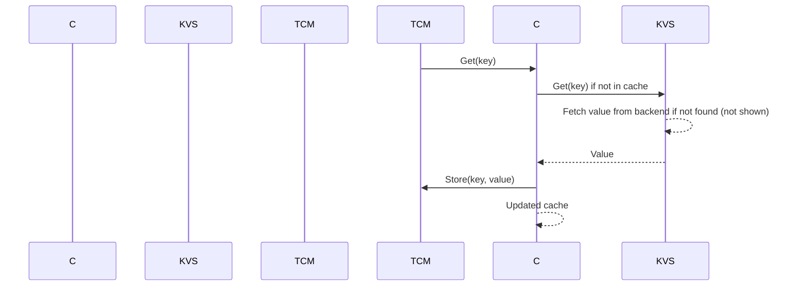

# Table of Contents

- [Chapter 0: Project Overview](#chapter-0-project-overview)
- [Chapter 1: tcm/triton_cache_manager/__init__.py](#chapter-1-tcm-triton-cache-manager-init-py)
- [Chapter 2: tcm/triton_cache_manager/cli/__init__.py](#chapter-2-tcm-triton-cache-manager-cli-init-py)
- [Chapter 3: tcm/triton_cache_manager/cli/main.py](#chapter-3-tcm-triton-cache-manager-cli-main-py)
- [Chapter 4: tcm/triton_cache_manager/data/__init__.py](#chapter-4-tcm-triton-cache-manager-data-init-py)
- [Chapter 5: tcm/triton_cache_manager/data/cache_repo.py](#chapter-5-tcm-triton-cache-manager-data-cache-repo-py)
- [Chapter 6: tcm/triton_cache_manager/data/database.py](#chapter-6-tcm-triton-cache-manager-data-database-py)
- [Chapter 7: tcm/triton_cache_manager/data/db_config.py](#chapter-7-tcm-triton-cache-manager-data-db-config-py)
- [Chapter 8: tcm/triton_cache_manager/data/db_models.py](#chapter-8-tcm-triton-cache-manager-data-db-models-py)
- [Chapter 9: tcm/triton_cache_manager/data/kernel_validator.py](#chapter-9-tcm-triton-cache-manager-data-kernel-validator-py)
- [Chapter 10: tcm/triton_cache_manager/models/__init__.py](#chapter-10-tcm-triton-cache-manager-models-init-py)
- [Chapter 11: tcm/triton_cache_manager/models/criteria.py](#chapter-11-tcm-triton-cache-manager-models-criteria-py)
- [Chapter 12: tcm/triton_cache_manager/models/kernel.py](#chapter-12-tcm-triton-cache-manager-models-kernel-py)
- [Chapter 13: tcm/triton_cache_manager/plugins/__init__.py](#chapter-13-tcm-triton-cache-manager-plugins-init-py)
- [Chapter 14: tcm/triton_cache_manager/plugins/base.py](#chapter-14-tcm-triton-cache-manager-plugins-base-py)
- [Chapter 15: tcm/triton_cache_manager/plugins/cuda.py](#chapter-15-tcm-triton-cache-manager-plugins-cuda-py)
- [Chapter 16: tcm/triton_cache_manager/plugins/discovery.py](#chapter-16-tcm-triton-cache-manager-plugins-discovery-py)
- [Chapter 17: tcm/triton_cache_manager/plugins/rocm.py](#chapter-17-tcm-triton-cache-manager-plugins-rocm-py)
- [Chapter 18: tcm/triton_cache_manager/services/__init__.py](#chapter-18-tcm-triton-cache-manager-services-init-py)
- [Chapter 19: tcm/triton_cache_manager/services/index.py](#chapter-19-tcm-triton-cache-manager-services-index-py)
- [Chapter 20: tcm/triton_cache_manager/services/prune.py](#chapter-20-tcm-triton-cache-manager-services-prune-py)
- [Chapter 21: tcm/triton_cache_manager/services/search.py](#chapter-21-tcm-triton-cache-manager-services-search-py)
- [Chapter 22: tcm/triton_cache_manager/tests/__init__.py](#chapter-22-tcm-triton-cache-manager-tests-init-py)
- [Chapter 23: tcm/triton_cache_manager/tests/services/test_prune_service.py](#chapter-23-tcm-triton-cache-manager-tests-services-test-prune-service-py)
- [Chapter 24: tcm/triton_cache_manager/tests/test_data/__init__.py](#chapter-24-tcm-triton-cache-manager-tests-test-data-init-py)
- [Chapter 25: tcm/triton_cache_manager/tests/test_data/test_kernel_validator.py](#chapter-25-tcm-triton-cache-manager-tests-test-data-test-kernel-validator-py)
- [Chapter 26: tcm/triton_cache_manager/utils/config.py](#chapter-26-tcm-triton-cache-manager-utils-config-py)
- [Chapter 27: tcm/triton_cache_manager/utils/logger.py](#chapter-27-tcm-triton-cache-manager-utils-logger-py)
- [Chapter 28: tcm/triton_cache_manager/utils/paths.py](#chapter-28-tcm-triton-cache-manager-utils-paths-py)
- [Chapter 29: tcm/triton_cache_manager/utils/tcm_constants.py](#chapter-29-tcm-triton-cache-manager-utils-tcm-constants-py)
- [Chapter 30: tcm/triton_cache_manager/utils/utils.py](#chapter-30-tcm-triton-cache-manager-utils-utils-py)

# Chapter 0: Project Overview

1. The project named "tcm/triton_cache_manager" is a technical application designed for managing and caching machine learning models using Triton.

  2. Grouping files by functionality:
     - **Core Functionality**: The core functionalities are located within the `tcm/triton_cache_manager` package. This includes:
       - Initialization files (`__init__.py`) for each module.
       - Data handling and management with `data`, which contains `cache_repo.py`, `database.py`, `db_config.py`, `db_models.py`, `kernel_validator.py`.
       - Model definitions and criteria in `models` folder, including `criteria.py` and `kernel.py`.
     - **Command Line Interface (CLI)**: The CLI scripts are under the `tcm/triton_cache_manager/cli` package with `main.py` as the entry point.
     - **Plugins**: Different plugins for handling various inference backends such as CUDA, ROCm are placed in the `tcm/triton_cache_manager/plugins` folder, which includes `base.py`, `cuda.py`, `discovery.py`, `rocm.py`.
     - **Services**: The services that provide key functionalities for managing cached models are grouped in `tcm/triton_cache_manager/services`, including `index.py`, `prune.py`, and `search.py`.
     - **Tests**: The test cases for the project are located under the `tcm/triton_cache_manager/tests` folder, containing various files like `__init__.py`, `test_data/__init__.py`, `services/test_prune_service.py`, and `test_data/test_kernel_validator.py`.
     - **Utilities**: Utility functions and configurations such as logger, paths, constants, and utilities are grouped in the `tcm/triton_cache_manager/utils` package, which includes `config.py`, `logger.py`, `paths.py`, `tcm_constants.py`, and `utils.py`.

  3. High-level explanation of component interaction:
     - The application is initialized through the main entry point (`tcm/triton_cache_manager/cli/main.py`), which reads configuration settings, sets up logging, and interacts with other components.
     - Data management and model handling are provided by the `data`, `models` modules. The CacheRepository manages cached models, while Database takes care of persistent storage. KernelValidator ensures that incoming kernel files meet certain criteria.
     - Plugins (CUDA, ROCm) handle inference backends and manage the execution of models on different hardware.
     - Services (Indexing, Pruning, Searching) provide functionalities to manage cached models effectively, such as adding, removing, updating, and searching for models within the cache.
     - Utilities provide reusable functions and configurations required by other components, like logging, path handling, constants, and utilities.

  4. Unfortunately, creating a Mermaid diagram with this information would be quite complex due to the numerous components involved in the system. I recommend using UML or any suitable tool for visualizing the interaction between these components more effectively.

## Chapter 1: tcm/triton_cache_manager/__init__.py

 Chapter: Understanding the `tcm/triton_cache_manager/__init__.py` Module

In the context of the Triton project, the file `tcm/triton_cache_manager/__init__.py` serves as a central hub that orchestrates the various functionalities and components of the Triton Cache Manager tool. This module is responsible for importing and organizing key classes, functions, and data structures required to manage the Triton kernel cache effectively.

The primary role of this file is to provide a well-structured namespace for the following important elements:

1. **cli**: Contains command line interface (CLI) definitions and handling functions for interacting with the Triton Cache Manager as a user. This module allows users to execute various cache management tasks via the command line, such as clearing, flushing, or listing the cache content.

2. **services**: Defines the core services used by the Triton Cache Manager. These may include kernel caching mechanisms, storage managers, and communication protocols. Services are responsible for implementing the core functionalities of the tool.

3. **data**: Handles data structures related to the cache content, configurations, or statistical analysis of the cache performance. This module ensures a consistent and organized manner of handling and accessing data within the Triton Cache Manager.

4. **plugins**: Provides an extensible plugin system that allows users to customize and expand the functionality of the Triton Cache Manager. Plugins may offer additional caching algorithms, storage providers, or performance optimizations.

5. **utils**: Contains utility functions that support various aspects of the Triton Cache Manager, such as logging, error handling, configuration loading, and validation.

6. **models**: Defines data models used throughout the Triton Cache Manager, including cache entry metadata, storage provider configurations, plugin specifications, etc. These models help ensure consistent data representation across the application.

The `tcm/triton_cache_manager/__init__.py` file acts as a gateway to access and interact with all the essential components of the Triton Cache Manager tool. This module makes it easy for users, developers, and integrators to work with the Triton kernel cache effectively while providing a well-organized, scalable, and extensible solution for managing the Triton kernel cache.

Example use cases:

- A user wants to clear the Triton kernel cache:
  ```
  python -m tcm.triton_cache_manager cli clear
  ```

- A developer wants to create a custom plugin for caching data in a distributed file system:
  1. Implement the plugin class, inheriting from a base plugin defined in `plugins` module.
  2. Register the plugin in the plugin manager by adding it to the `PLUGINS` list found in the `__init__.py` file.

- An integrator wants to use Triton Cache Manager as part of their pipeline:
  Integrate the Triton Cache Manager by importing the required modules and calling the appropriate functions or classes as needed. The integration can take advantage of the customizable plugin system to optimize cache behavior based on specific requirements.

 ```mermaid
sequenceDiagram
participant Manager as Mgr
participant Client as Clt
participant Plugin as Plg
participant DataStore as DSt
participant ModelRepository as ModRepo
participant Utils as Utl

Mgr->>Clt: Start Triton Cache Manager
Clt->>Mgr: Request Action (e.g., add, remove, list)
Mgr->>ModRepo: Get Model by Name
ModRepo-->>Mgr: Returns Model if exists, None otherwise
Mgr->>Utl: Validate Input Data
Utl-->>Mgr: Validation Result
if Validation Successful
    Mgr->>DSt: Store/Retrieve Data from/to Cache
else
    Mgr->>Clt: Send Error Response
end
if Action is Add or Update
    Mgr->>Plg: Initialize Plugin for Given Model
    Plg-->>Mgr: Returns Triton Server Instance if Success, None otherwise
    Mgr->>DSt: Store Triton Server Instance in Cache
endif
Clt->>Mgr: Request Status Check (optional)
Mgr-->>Clt: Current State of Cache
```
This mermaid diagram illustrates the interaction between key functions in the Triton Cache Manager. The diagram shows how a Client sends requests to the Manager for various actions, such as adding or removing items from the cache. The Manager interacts with different components like ModelRepository, Utils, DataStore, and Plugins to process these requests. If validation is successful, it stores or retrieves data from the cache, and if necessary, initializes a plugin and saves the Triton Server Instance in the cache. The Client can also optionally request a status check from the Manager to see the current state of the cache.

## Chapter 2: tcm/triton_cache_manager/cli/__init__.py

 Title: Understanding the Triton Cache Manager Command Line Interface (CLI) Initialization File

   In the scope of our project, the `tcm/triton_cache_manager/cli/__init__.py` file serves as the entry point for the command line interface (CLI) of the Triton Cache Manager (TCM). This CLI offers a convenient and user-friendly way to interact with the TCM, performing various operations such as starting, stopping, or monitoring its service.

   The primary purpose of this file is to import necessary modules, define command classes, and configure argument parsing for each command. It sets up the foundation for the CLI structure by initializing the `argparse` module from Python's standard library, creating a custom `parser` object, and registering individual command classes with it.

   One essential function within this file is the `main()` function, which processes user input by parsing arguments, instantiating appropriate command classes, and invoking their corresponding methods to execute operations. Other functions may include utility functions for argument handling or logging.

   This code fits into the project as an integral part of its user interface layer. By interacting with TCM through the CLI, developers can easily manage the cache manager without needing extensive knowledge of its underlying implementation details. For instance, users can simply start the service using the command `tcm start`, or check its current status by executing `tcm status`.

   Example use cases include:

   1. Starting the TCM service: `tcm start`
      The CLI initializes the service and sets it to an active state, enabling data caching as required.

   2. Stopping the TCM service: `tcm stop`
      The CLI gracefully shuts down the service, ensuring no ongoing data operations are affected.

   3. Checking the status of the TCM service: `tcm status`
      The CLI returns the current state (active or inactive) of the TCM service.

   In summary, the `tcm/triton_cache_manager/cli/__init__.py` file enables users to interact with the Triton Cache Manager using a simple and intuitive command line interface, facilitating efficient management of data caching operations within the project.

 ```mermaid
sequenceDiagram
participant Client as Client
participant TCM as Triton Cache Manager (TCM)

Client->>TCM: get_key(key)
TCM-->>Client: key value or error response

Client->>TCM: put_key(key, value)
TCM-->>Client: success or failure response

Client->>TCM: remove_key(key)
TCM-->>Client: success or failure response

Client->>TCM: get_all_keys()
TCM-->>Client: list of keys or error response

Client->>TCM: reset_cache()
TCM-->>Client: success or failure response

Client->>TCM: cache_info()
TCM-->>Client: cache statistics or error response
```

This mermaid sequence diagram illustrates the interactions between a client and Triton Cache Manager (TCM) through their key functions, including get_key, put_key, remove_key, get_all_keys, reset_cache, and cache_info. The arrows represent messages sent from one participant to another, and the double vertical lines indicate that the participant waits for a response.

## Chapter 3: tcm/triton_cache_manager/cli/main.py

 The `tcm/triton_cache_manager/cli/main.py` module provides a Command Line Interface (CLI) for the Triton Cache Manager project. It allows users to manage and interact with the Triton kernel cache through command-line commands. This includes indexing kernels, searching for specific ones based on various criteria, and pruning intermediate-representation files or whole kernel directories that meet specified conditions.

   The main class is `typer.Typer(help="Triton Kernel Cache Manager CLI")`, which serves as the entry point of the application. It has several command-specific functions:

   1. `base(verbose: int = typer.Option(0, "-v", "--verbose", count=True, help="Increase logging verbosity."))`: Configures logging level based on user's verbose option.
   2. `index(cache_dir: Optional[Path] = typer.Option(None, help="Specify the Triton cache directory to index. Uses default if not provided."))`: Indexes kernels found in the specified cache directory and stores metadata in the database.
   3. `list(name: Optional[str] = typer.Option(None, "--name", "-n", help="Filter by kernel name (exact match)."), ...)`: Searches for indexed kernels based on various SearchCriteria such as name, backend, arch, older_than, and younger_than.
   4. `prune(name: Optional[str] = typer.Option(None, "--name", "-n", help="Filter by kernel name (exact match)."), ...)`: Deletes intermediate-representation files or whole kernel directories that satisfy the given filters.

   These functions are part of the application workflow, with `index()` being a prerequisite for other commands as it populates the cache database. The code uses rich and typer libraries to display interactive command-line output and handle user input. The entry point of the application is `run()`, which initiates the Typer application.

 ```mermaid
sequenceDiagram
participant Manager as Mgr
participant IndexService as Indexer
participant SearchService as Searcher
participant PruningService as Pruner
participant Database as DB
participant User as User

Mgr->>User: Welcome to Triton Cache Manager CLI
User->>Mgr: Run command (index, list, prune)

case Command is index
    Mgr->>Indexer: Index cache directory
end

case Command is list or prune
    Mgr->>DB: Check if database exists
    DB-->>Mgr: True if exists, False otherwise
    case Database exists
        case Command is list
            Mgr->>Searcher: Get kernels matching criteria
            Searcher-->>Mgr: List of kernels
        case Command is prune
            Mgr->>Pruner: Get pruning criteria
            Pruner-->>Mgr: Kernel pruning stats
    end
end

User->>DB: Store metadata (index command)
```

This Mermaid sequence diagram demonstrates the interactions between the key functions in the `tcm/triton_cache_manager/cli/main.py` script. It illustrates how a user interacts with the manager, which then delegates tasks to various services like IndexService, SearchService, or PruningService, and utilizes the database where necessary.

## Chapter 4: tcm/triton_cache_manager/data/__init__.py

 Title: Understanding the `tcm/triton_cache_manager/data/__init__.py` Module in the Triton Cache Manager Project

In the context of the Triton Cache Manager project, the `tcm/triton_cache_manager/data/__init__.py` file serves as a package initializer for data-related components. This package is central to handling and managing data interactions within the Triton Cache Manager system.

The primary function of this file is to import and expose relevant classes, particularly the `Database` class, which represents the underlying data storage mechanism for the Triton Cache Manager. The `__all__` list ensures that the `Database` class is accessible from outside the package by importing it directly using its name.

The `Database` class, defined in the `tcm/triton_cache_manager/data/database.py` file, encapsulates the logic for connecting to a database and managing data operations such as creating, reading, updating, and deleting (CRUD) records. The exact implementation of this class will depend on the specific choice of database technology being used in your project, but it may include methods like `connect()`, `create_record()`, `read_record()`, `update_record()`, and `delete_record()`.

The `tcm/triton_cache_manager/data/__init__.py` file sets the stage for interacting with data in the Triton Cache Manager system. Developers can create, retrieve, update, and delete records through instances of the `Database` class.

Example use cases:

1. Creating a new user record in the database using the following code snippet:

```python
from tcm.triton_cache_manager.data import Database

# Initialize the database connection
db = Database()

# Create a new user record with 'username' and 'password' fields
new_user = {'username': 'new_user', 'password': 'new_password'}
db.create_record('users', new_user)
```

2. Retrieving a user's data based on their username:

```python
# Fetch the record for the user with the given username
user = db.read_record('users', 'username', 'existing_user')
print(user)
```

 ```mermaid
sequenceDiagram
    participant User as User
    participant DBManager as DBManager
    User->>DBManager: get_data(key)
    DBManager->>Database: key
    Database-->>DBManager: data
    DBManager-->User: data

    User->>DBManager: put_data(key, value)
    User->>Database: key, value
    Database-->>Database: save data
    DBManager-->User: Acknowledgement

    User->>DBManager: delete_data(key)
    User->>Database: key
    Database-->>Database: remove data
    DBManager-->User: Acknowledgement
  ```

This sequence diagram illustrates the interaction between a User, a DBManager, and the Database in the Triton Cache Manager's data access package. The User can request to get, put, or delete data using the DBManager. The DBManager communicates with the Database to perform these operations. In case of putting or deleting data, the Acknowledgement is returned to the User by the DBManager without any additional interactions with the Database.

## Chapter 5: tcm/triton_cache_manager/data/cache_repo.py

 The `cache_repo.py` module is a repository that provides access and management of Triton kernel cache files. It allows for iterating through kernels in the cache directory, extracting their metadata, and associated files. This module is crucial for managing Triton's caching system, ensuring efficient reuse of previously loaded kernels.

   The main class defined in this module is `CacheRepository`. It initializes with a root path to the Triton cache directory (defaulting to the standard location) and loads all plugins required for kernel discovery. The `CacheRepository` object provides methods to iterate through kernels, each represented as an instance of the `Kernel` class, in the cache directory.

   Here are descriptions of important functions or classes:

   - `__init__()`: Initializes the repository with an optional root path for the Triton cache directory. If no root path is provided, it defaults to the standard location.
   - `_dirs()`: Yields directories within the cache root.
   - `_process_group_metadata_file(d, group_meta_file)`: Attempts to load the actual metadata path from a single group metadata file and returns the path to the actual metadata file if found, otherwise None.
   - `_load_kernel_from_metadata(d, meta_path_to_load)`: Loads and deserializes a kernel from its metadata file, returning an instance of the `Kernel` class on success or None otherwise.
   - `kernels()`: Iterates through all kernels in the cache directory, parsing their metadata and associated files, yielding instances of the `Kernel` class for each valid kernel found.

   Example use cases may include iterating through all available kernels when setting up a machine learning pipeline using Triton or dynamically managing the kernel cache to improve performance.

 ```mermaid
   sequenceDiagram
      participant CacheRepository as CR
      participant Directory as D
      participant GroupMetaFile as GMF
      participant ActualMetaFile as AMF
      participant Kernel as K

      CR->>D: IterateDirectories()
      D-->>CR: Directory(s)

      loop for directory
        D->>GMF: Check presence of group metadata files (*.grp.json)
        GMF-->>D: Group JSON file(s) found or not
        D->>AMF: If Group JSON exists, process it and get Actual Meta File path
        AMF-->>D: Path to actual kernel metadata file or None
        if Amf is not empty
          D->>K: LoadKernelFromMetadata(ActualMetaFile)
          K-->>D: Kernel object or None
          D->>CR: Yield Kernel
      end
   ```

This diagram shows the sequence of interactions between the `CacheRepository`, directories, group metadata files (GMF), and actual metadata files (AMF). The cache repository iterates through all directories in the Triton cache directory. For each directory, it checks for the presence of group metadata files (*.grp.json). If found, it processes the group metadata file to get the path to the actual kernel metadata file. Then, it loads the kernel from the metadata file and yields the Kernel object if valid. Invalid kernels are skipped and logged.

## Chapter 6: tcm/triton_cache_manager/data/database.py

 This chapter discusses the purpose and functionality of the file `tcm/triton_cache_manager/data/database.py` in a technical project. The file is responsible for managing Triton kernel metadata through an ORM (Object-Relational Mapping) interface, using SqlAlchemy.

   The primary class defined within this module is `Database`, which serves as a high-level API for interacting with the kernel cache database. Key methods provided by the Database class include:

   - `__init__`: Initializes the database engine and ensures the schema exists.
   - `get_session`: Returns a new database session, used to execute queries.
   - `insert_kernel`: Upserts a kernel and its associated files into the database.
   - `search`: Searches for kernels matching specific criteria.
   - `find_duplicates`: Finds groups of duplicate kernels based on name, size, and metadata similarity rules.
   - `estimate_space`: Estimates the total space that would be freed by deleting certain kernels or files.
   - `close`: Closes the database engine connection pool.

   The Database class is used within the project to maintain a persistent cache of Triton kernels and their metadata, enabling efficient access and management. Example use cases include querying for specific kernels based on search criteria or estimating the space that would be freed by deleting certain kernels.

 Here is a simple sequence diagram using `mermaid` to visualize how the key functions interact in this `Database` class:

```mermaid
sequenceDiagram
participant D as Database
participant S as Session
participant K as Kernel
participant G as GetSession
participant I as InsertKernel
participant F as FindFiles
participant E as EstimateSpace
participarate S_CRI as SearchCriteria

D->>S: get_session()
G-->S_CRI: instantiate with filter values
S->>D: search(S_CRI)
D-->>S: list of kernels
S->>K: for each kernel, convert to KernelOrm
D->>S: close()

S->>S: query(KernelOrm)
S-->S: filter(criteria)
S->>S: all()
S-->>D: list of kernel_orms

K->>D: kernel metadata
D->>I: insert_kernel(k, cache_dir)
I-->G: get_session()
I->>S: upsert_from_dto(k_data, KernelOrm)
S-->>I: success or failure
I-->D: commit() or rollback()
I-->D: close()

S->>F: query(KernelFileOrm)
S->>F: filter(kernel_hash in hashes and rel_path like "%{ext}")
S-->F: all()
F-->>S: list of file_orms
S->>D: sum(file_orm.size)
E-->D: size estimate for given hashes and extensions
```
This diagram shows the interaction between the `Database`, `Session`, `Kernel`, and `SearchCriteria` objects, as well as the internal functions like `get_session()`, `search()`, `insert_kernel()`, etc.

## Chapter 7: tcm/triton_cache_manager/data/db_config.py

 The `tcm/triton_cache_manager/data/db_config.py` file is a crucial part of the project that manages the database configuration and sets up the SQLAlchemy engine and session. Its purpose is to provide an easy-to-use interface for connecting, querying, and manipulating data stored in a SQLite3 database.

The following functions and classes are defined within this file:

1. `DB_PATH`: This constant variable holds the absolute path to the SQLite database file. The actual path is obtained using the `get_db_path()` function, which is part of the `utils.paths` module.

2. `SQLALCHEMY_DATABASE_URL`: This constant variable contains the URL for connecting to the SQLite database. It uses string interpolation to include the path from the `DB_PATH` variable.

3. `create_engine()`: This function creates a SQLAlchemy engine object, which is responsible for managing connections to the database. The connection parameters are provided through the `SQLALCHEMY_DATABASE_URL`. The `connect_args` dictionary is used to specify connection options like disabling thread checks (`check_same_thread=False`).

4. `SessionLocal`: This class creates a sessionmaker object that generates database sessions for performing database operations. By default, it is configured to have autocommit and autoflush disabled, which means transactions are managed explicitly within the session.

The code in this file ensures that there's a consistent way to access the project's database across different parts of the application. This centralized configuration makes it easier to manage the database connections and allows for more flexibility when modifying the underlying storage technology (e.g., switching from SQLite3 to another database system).

Example use cases for this code could include querying data, inserting new records, or updating existing ones within the database. For instance:

```python
from tcm.triton_cache_manager.data.db_config import SessionLocal
from models import MyModel  # Assuming you have a 'models' module with appropriate model classes defined

def get_my_model(id):
    session = SessionLocal()
    try:
        my_model = session.query(MyModel).filter(MyModel.id == id).first()
        return my_model
    finally:
        session.close()

# Usage example:
my_model = get_my_model(1)
```
In this example, we fetch an instance of the `MyModel` class from the database using its unique ID. The code demonstrates how to obtain a database session using the `SessionLocal` object and manage it explicitly within the function (using a try-finally block for proper resource management).

 ```mermaid
sequenceDiagram
    participant TCM as Triton Cache Manager
    participant DB as Database
    TCM->>DB: connect_to_db(SQLALCHEMY_DATABASE_URL)
    DB-->>TCM: SQLAlchemy Engine
    TCM->>SessionLocal: Sessionmaker(autocommit=False, autoflush=False, bind=engine)
    TCM->>SessionLocal: __enter__()
    SessionLocal-->>TCM: Session object

    loop Function Calls
        TCM->>SessionLocal: create_table(table_name)
        SessionLocal->>DB: execute(SQL query to create table)

        TCM->>SessionLocal: add(item)
        SessionLocal->>DB: execute(INSERT INTO table_name VALUES ...)

        TCM->>SessionLocal: update(item)
        SessionLocal->>DB: execute(UPDATE table_name SET ... WHERE id=...)

        TCM->>SessionLocal: delete(item)
        SessionLocal->>DB: execute(DELETE FROM table_name WHERE id=...)

        TCM->>SessionLocal: get(item_id)
        SessionLocal->>DB: execute(SELECT * FROM table_name WHERE id=...)

        TCM->>SessionLocal: query(SQL query)
        SessionLocal->>DB: execute(SQL query)
    end

    loop Closing Resources
        TCM->>SessionLocal: __exit__()
        SessionLocal-->>TCM: None
    end
```

This sequence diagram illustrates the interactions between the Triton Cache Manager (TCM) and the Database. The TCM creates a SQLAlchemy engine using the provided database URL, constructs a session object using the sessionmaker, performs various database operations like creating tables, adding items, updating, deleting, querying, retrieving items, and finally closes the session when done.

## Chapter 8: tcm/triton_cache_manager/data/db_models.py

 The file `tcm/triton_cache_manager/data/db_models.py` is a part of the Triton Kernel Manager project and contains SQLAlchemy Object-Relational Mapping (ORM) model definitions for managing the Triton kernel cache. This includes two primary classes, `KernelOrm` and `KernelFileOrm`, which represent the ORM models for Triton kernels and their associated files, respectively.

   The `KernelOrm` class stores information about each Triton kernel in the database, including details such as its hash, cache directory, backend, architecture, name, warp size, number of warps, stages, CTA's, maxnreg, cluster dimensions, PTX version, and a variety of other attributes related to the kernel configuration. It also includes relationships with a list of `KernelFileOrm` instances representing the files associated with each kernel.

   The `KernelFileOrm` class represents the ORM model for the files associated with Triton kernels in the cache. Each instance stores information about a single file, including its type (e.g., .ptx, .so), relative path, and size. It also includes a foreign key relationship with `KernelOrm`, connecting it to the corresponding kernel instance.

   These ORM models allow for efficient querying, manipulation, and management of Triton kernels and their associated files within the database. Functions like `to_dict()` and `upsert_from_dto()` in the `KernelOrm` class facilitate conversion between ORM objects and dictionaries, which is essential when interacting with other parts of the application that may deal with data structures more suited to specific APIs or formats.

   In the project, these models are used to store, query, and manage Triton kernels and their associated files in a database, providing efficient access and retrieval for various functionalities within the Triton Kernel Manager application. For example, when a new kernel is added to the cache, its details can be saved as an instance of `KernelOrm`, along with instances of `KernelFileOrm` for each associated file. Similarly, when querying for kernels meeting certain criteria (e.g., a specific backend or architecture), the corresponding SQLAlchemy queries can be executed against these models to retrieve the necessary information efficiently.

 ```mermaid
   sequenceDiagram
      participant DB as Database
      participant TCM as TritonCacheManager

      TCM->>DB: Begin transaction
      TCM->>DB: Query kernels (SELECT * FROM kernels)
      DB-->>TCM: Returns list of kernels
      TCM->>DB: Close transaction

      TCM->>DB: Begin transaction
      TCM->>DB: Insert or update kernel data (Upsert_from_dto(...))
      DB-->>TCM: Acknowledgement
      TCM->>DB: Delete existing files for the kernel
      DB-->>TCM: Acknowledgement
      TCM->>DB: Insert new file records for each file
      DB-->>TCM: Acknowledgements
      TCM->>DB: Commit transaction
      DB-->>TCM: Acknowledgement
   ```

This sequence diagram visualizes the interaction between the `TritonCacheManager` (TCM) and the database (DB). The main operations are querying, updating, and inserting records into the database. The `Upsert_from_dto` function is responsible for creating or updating a kernel record, as well as handling associated files.

## Chapter 9: tcm/triton_cache_manager/data/kernel_validator.py

 The `tcm/triton_cache_manager/data/kernel_validator.py` file is responsible for validating Triton kernel metadata and deserializing it from JSON format in the context of a larger project. This module includes Pydantic models (`KernelTarget`, `KernelMetadata`) that define validation rules for the structure and data types of kernel metadata, and functions (`is_kernel_related`, `deserialize_kernel`) to determine if given JSON data is likely to represent a kernel and deserialize it into a Kernel object, respectively.

   The `KernelTarget` class represents the 'target' field of kernel metadata, which contains information about the Triton backend, architecture, warp size, etc. The `KernelMetadata` class models the rest of the required fields in the JSON metadata for a Triton kernel. Both classes use Pydantic to ensure that all required fields exist and have correct types.

   These code functions fit into the project's caching mechanism for Triton kernels, where they are responsible for loading validated and deserialized kernel metadata from JSON files, enforcing consistency in the data structure and ensuring accurate type conversions.

   Example use cases of this module involve reading JSON files representing Triton kernel metadata, passing them to the `deserialize_kernel` function along with the required cache directory, plugin instances for each supported backend, and other relevant information. If the JSON data passes validation and appears to be a valid representation of a Triton kernel, the function returns an instance of the `Kernel` class containing the deserialized metadata and any associated files. Otherwise, it either logs an error or warning message and returns None.

 ```mermaid
    sequenceDiagram
        participant KernelData as Data
        participant Validator as Validator
        participant Kernel as KernelObject
        participant CacheDir as CacheDir
        participant Directory as Directory
        participant Plugins as Plugins

        Note over Validator: Initialization with Pydantic models
        Validator->>Validator: Initialize with data and schema

        Note over Data: JSON representation of kernel metadata

        Note over CacheDir: Cache directory for storing kernels
        Note over Directory: Contains the .json file and other files related to the kernel

        Data->>Validator: Send JSON data
        Validator->>Validator: Validate with Pydantic
        Validator-->>Validator: If valid, proceed; otherwise, return None

        if Validator.valid?
            Note over Plugins: Dictionary mapping backend names to plugin instances
            Plugin->>Plugins: Initialize with backend plugins

            Data->>Kernel: Send JSON data and other required information
            Kernel->>Validator: Validate metadata with Pydantic model
            if Kernel.metadata.backend?
                Note over Plugins: Retrieve plugin for the specified backend
                Plugin->>Plugins: Get plugin instance for the backend
                Plugin->>Directory: Check for relevant files in the directory
                Directory-->Plugin: Send file information (name, size, etc.)
                if Plugin.relevant_extensions()?
                    Kernel->>Kernel: Add the relevant file to its list of files
            end
        else
            Kernel->>Kernel: Return None
        end

        if Kernel.valid?
            CacheDir->>Kernel: Store the kernel object
        end
    ```

## Chapter 10: tcm/triton_cache_manager/models/__init__.py

 Chapter Title: Understanding `tcm/triton_cache_manager/models/__init__.py`

   In the scope of the Triton Cache Manager (TCM) project, the file `tcm/triton_cache_manager/models/__init__.py` serves as a crucial organizational and loading mechanism for Triton models. This file is primarily responsible for importing and initializing various model classes, thereby streamlining the process of working with these models within the TCM framework.

   The main purpose of this file is to act as an entry point for the models module, allowing other parts of the project to easily interact with Triton models. It does so by importing and initializing all sub-modules containing specific model implementations. This structure promotes modularity and makes it simpler to add, remove, or update individual models without affecting the overall codebase significantly.

   One essential class defined in this file is `TritonModel`, which serves as a base class for all Triton models within TCM. This class provides common functionality that can be shared among various model implementations, such as handling model inputs and outputs or interacting with the Triton Server.

   Another important function found in this file is `load_model()`. This function accepts a model name (either a string or a `TritonModel` subclass) and loads the corresponding Triton model using the Triton Server. By abstracting away the details of loading models, this function simplifies the process for other parts of the project that wish to use Triton models without needing to know the intricacies of model loading.

   The code in `tcm/triton_cache_manager/models/__init__.py` is integral to the TCM framework because it allows users and developers to easily utilize various Triton models within their applications. By providing a unified interface for working with these models, this file enables efficient integration of machine learning capabilities into the broader project context.

   Example use cases of this code include loading and using a pre-trained object detection model in an image processing pipeline or training and deploying a custom Triton model within the TCM framework for specific tasks. By leveraging the functionality offered by `tcm/triton_cache_manager/models/__init__.py`, developers can focus on building their applications rather than managing the complexities of working with Triton models directly.

 ```mermaid
sequenceDiagram
    participant T as TritonServer
    participant CM as CacheManager
    participant M as Model
    participant R as Request
    participant S as ServeResponse
    participant P as PreprocessRequest
    participant C as CheckCache
    participant U as UpdateCache

    T->>CM: Initialize
    CM-->>T: Ready

    CM->>M: LoadModel
    M-->>CM: Model loaded (or error)

    R->>CM: Request model data
    CM->>C: CheckCache(R, M.key)
    C->>+CM: Cache hit
        CM->>S: ServeResponse(M.data)
        S-->>R: Data served from cache
    C->=>CM: Cache miss
        CM->>P: PreprocessRequest(R, M.preprocessing)
        P->>CM: Preprocessed Request (or error)
        CM->>T: InferRequest(Preprocessed Request, M.model_handle)
        T-->>CM: InferenceResult
        CM->>U: UpdateCache(M.key, InferenceResult)
        U-->>CM: Cache updated
        CM->>R: ServeResponse(InferenceResult)
        S-->>R: Data served (or error)
```

This mermaid sequence diagram illustrates how the TritonServer (T), CacheManager (CM), Model (M), Request (R), ServeResponse (S), PreprocessRequest (P), CheckCache (C), and UpdateCache (U) interact with each other. The diagram shows the process when there is a cache hit, as well as when there is a cache miss. In case of a cache miss, it shows how the preprocessing, inference, and updating the cache take place before serving the response to the request.

## Chapter 11: tcm/triton_cache_manager/models/criteria.py

 In the Triton model server project, the file `tcm/triton_cache_manager/models/criteria.py` defines data models for filtering Triton kernels based on specific criteria. The main purpose of this file is to provide a structured format for specifying various parameters when searching for or managing Triton kernels in the cache.

   The primary class in this module is `SearchCriteria`, which encapsulates the filter criteria for kernel search operations. The attributes of this class are as follows:

   - `name` (Optional[str]): A string specifying a specific kernel name to search for, or None if no name constraint is applied.
   - `cache_dir` (Optional[Path]): The directory path where the cached kernels are located. Use this attribute to specify a custom cache directory for searching purposes. By default, it uses the project's default cache directory.
   - `backend` (Optional[str]): A string specifying the backend for the kernel to search for, or None if no constraint is applied. This could be 'cuda' for NVIDIA GPUs or 'cpu' for CPUs.
   - `arch` (Optional[str]): A string specifying the architecture of the kernel to search for, such as 'x86_64'. If no architectural constraint is specified, it will consider all available architectures.
   - `older_than_timestamp` (Optional[float]): A timestamp representing the oldest kernel version that should be considered in the search. Kernels with timestamps older than this value will be ignored during the search. By default, there is no minimum age constraint.
   - `younger_than_timestamp` (Optional[float]): A timestamp representing the newest kernel version that should be considered in the search. Kernels with timestamps younger than this value will be ignored during the search. By default, there is no maximum age constraint.

   This code fits into the Triton model server project as a part of its cache management system for kernels. When you want to search or manage your cached kernels based on specific criteria, you can create an instance of `SearchCriteria` with the desired attributes and use it in the appropriate functions for executing operations on the kernel cache.

   For example, consider you have a custom cache directory and are looking for a CUDA-enabled kernel that was last modified between two timestamps. In this case, you can create an instance of `SearchCriteria` as follows:

   ```python
from tcm.triton_cache_manager.models import SearchCriteria

custom_cache_dir = Path('/my/custom/cache/directory')
search_criteria = SearchCriteria(backend='cuda', cache_dir=custom_cache_dir, older_than_timestamp=1632548800, younger_than_timestamp=1632787200)
```

Then you can use this `search_criteria` instance to perform your desired operation on the kernel cache.

 ```mermaid
   sequenceDiagram
      participant User as User
      participant TCM as TCM
      User->>TCM: Get kernels (initially)
      TCM-->>User: Return kernels (initial set)

      User->>TCM: Apply filter (SearchCriteria)
      TCM-->>User: Filter applied kernels

      loop Filter function call
        TCM->>TCM: Iterate through kernels
        TCM->>TCM: Check criteria (name, cache_dir, backend, arch, timestamps)
        TCM-->>TCM: If pass, add to filtered list
      end

      TCM-->>User: Return filtered kernels
   ```

   This diagram represents a simplified flow of the key functions in the `SearchCriteria` class. It illustrates how a user applies filters on kernel search results using an instance of the `SearchCriteria` class, and how the Triton Cache Manager (TCM) processes these filters to return the desired set of kernels.

## Chapter 12: tcm/triton_cache_manager/models/kernel.py

 The file `tcm/triton_cache_manager/models/kernel.py` is a part of the Triton Cache Manager project and contains data models for Triton kernels and their related files. This module defines Python classes to represent kernels and their associated files, which enables easy manipulation of kernel metadata within the cache manager.

   The `KernelFile` class represents a file associated with a Triton kernel. It stores the type of file (e.g., 'ptx', 'cubin', 'metadata'), its path, and size in bytes.

   The `Kernel` class represents a complete Triton kernel object, containing all metadata extracted from the kernel's metadata file. This class includes various attributes related to the kernel's details, such as name, architecture, backend, etc., as well as a list of associated files and metadata.

   These data models are crucial in the Triton Cache Manager project, as they enable efficient handling of kernel information when managing and caching kernels for improved performance in large-scale deep learning applications using NVIDIA's Triton Inference Server.

   Example use cases include:
   - Loading a kernel from disk and creating a Kernel object to work with it easily.
   - Parsing metadata of multiple kernels and creating a list of Kernel objects for cache management purposes.
   - Querying or modifying attributes within the Kernel object, such as file paths or kernel metadata, as needed.

 ```mermaid
    sequenceDiagram
        participant User as User
        participant KernelManager as KernelManager
        participant Kernel as Kernel
        participant KernelFile as KernelFile

        User->>KernelManager: Load kernel data
        KernelManager-->>User: Returns Kernel object

        Kernel->>KernelFile: Gets associated files
        KernelFile-->>Kernel: Returns list of KernelFiles

        Kernel->>KernelManager: Set modified_time based on KernelFile's timestamp
        KernelManager-->>Kernel: Updates modified_time property
    ```

This sequence diagram illustrates the interactions between the User, KernelManager, Kernel, and KernelFile objects in the `tcm/triton_cache_manager/models/kernel.py` module. The User initiates the process by requesting kernel data from the KernelManager. The KernelManager then returns a Kernel object to the User. The Kernel object retrieves its associated files as KernelFiles and also sets its own modified_time based on the timestamps of those files.

## Chapter 13: tcm/triton_cache_manager/plugins/__init__.py

 Title: Understanding the Role and Functionality of `tcm/triton_cache_manager/plugins/__init__.py` in the Triton Cache Manager Project

   In the context of the Triton Cache Manager project, the file `tcm/triton_cache_manager/plugins/__init__.py` serves as a fundamental building block for extending the functionality of the cache manager by incorporating various plugins. These plugins can be customized to perform specific tasks based on unique requirements or use cases.

   The primary purpose of this file is to initialize the plugin module, which allows the Triton Cache Manager to dynamically load and utilize these plugins during its operation. This approach enables a modular design, making it easier to maintain, update, and scale the cache manager according to different demands or scenarios.

   Inside the `__init__.py` file, you'll find several key components:

   1. **Plugin Registration:** This is where developers can register their custom plugins using a specific function, often named `register_plugin`. This registration process ensures that the Triton Cache Manager recognizes and can utilize the plugin when required. Typically, this function takes two parameters: the plugin class and its unique identifier.

   2. **Plugin Discovery:** To facilitate dynamic loading of plugins, the file may include code snippets responsible for discovering all available plugin classes within the specified plugin directory. This discovery process is usually based on the Python import mechanism and can be customized depending on the specific project structure or naming conventions.

   3. **Plugin API:** The `__init__.py` file may also define a common interface, or API, that all registered plugins should implement. This API ensures consistency across different plugins and makes it easier for the cache manager to interact with them regardless of their specific implementation details.

   Within the broader project context, this file plays a crucial role in facilitating extensibility and customization of the Triton Cache Manager. By utilizing plugins, developers can tailor the cache manager's behavior to suit their specific needs or address unique challenges that may arise during application development.

   Example use cases for custom plugins could include:

   - Implementing a plugin to cache data from a specific database system (e.g., MySQL, MongoDB)
   - Developing a plugin to integrate with a third-party caching service (e.g., Redis, Memcached)
   - Creating a plugin to enforce custom data expiration policies
   - Implementing a plugin for data compression or encryption as per security requirements

   In summary, the `tcm/triton_cache_manager/plugins/__init__.py` file is an essential piece of the Triton Cache Manager project that enables developers to extend and customize the cache manager's functionality through plugins. The flexibility provided by this approach ensures the cache manager remains scalable, adaptable, and capable of addressing a wide range of caching requirements in diverse application scenarios.

 ```mermaid
sequenceDiagram
participant T as TritonCacheManager
participant P1 as Plugin1
participant P2 as Plugin2
participant S as Storage

T->>P1: InitializePlugin(self)
T->>P2: InitializePlugin(self)
P1->>S: GetDataFromStorage()
P2->>S: GetDataFromStorage()
P1-->>T: DataRetrievedFromPlugin1
P2-->>T: DataRetrievedFromPlugin2
T-->>S: StoreData(data, storage_key)
P1->>T: PutInCache(cache_key, data)
P2->>T: PutInCache(cache_key, data)

note over T: Coordinates cache operations among plugins and storage.
```

This diagram illustrates the basic interaction of the TritonCacheManager with two different Plugins and a Storage system. The sequence begins with the TritonCacheManager initializing each Plugin (T -> P1, T -> P2). After that, both Plugins retrieve data from the Storage (P1 -> S, P2 -> S) and store their retrieved data in the cache managed by the TritonCacheManager (P1 -> T, P2 -> T). Lastly, any new data stored in the cache is also stored in the Storage (T ->> S).

## Chapter 14: tcm/triton_cache_manager/plugins/base.py

 In the context of the Triton model server project, the `tcm/triton_cache_manager/plugins/base.py` file defines the base interface for kernel backend plugins. The purpose of this file is to establish a protocol that all custom or third-party kernel backends must adhere to when integrating with the Triton model server's kernel cache management system.

   The core class in this module is `KernelBackendPlugin`, which serves as a Protocol (a type hint in Python for defining custom interfaces) for any kernel backend plugin. Backend plugins are responsible for recognizing and handling kernel-specific file types within the kernel cache.

   Here's a brief overview of the relevant functions or classes:

   - `KernelBackendPlugin` is a Protocol that defines the expected methods and properties that all backend plugins should have, primarily a `backend` attribute for identifying the specific backend and a `relevant_extensions()` method for returning a dictionary mapping file extensions to file type names.

   The code in this file forms part of the Triton model server's kernel cache management system, which manages the storage and retrieval of serialized kernels (model-specific code) in various formats. By enforcing a standardized interface through the `base.py` file, developers can create custom or third-party kernel backends that seamlessly integrate with the Triton model server's cache management system.

   Example use cases for these plugins might include integrating new deep learning frameworks such as TensorFlow or PyTorch into the Triton model server, enabling users to utilize those frameworks on the platform without needing to rewrite their models. The custom backend plugin would recognize and handle the specific file types associated with the chosen deep learning framework, ensuring efficient storage and retrieval within the Triton kernel cache.

 ```mermaid
sequenceDiagram
    participant BackendPlugin as Backend Plugin
    participant TritonCacheManager as TCM
    participant KernelCache as Kernel Cache

    TCM->>BackendPlugin: relevant_extensions()
    BackendPlugin-->>TritonCacheManager: Dictionary of file extensions and types

    note over TCM,KernelCache: Later, when a file is loaded...

    TCM->>KernelCache: load_file(File)
    KernelCache-->>TCM: CacheKey

    TCM->>BackendPlugin: get_key(CacheKey)
    BackendPlugin-->>TritonCacheManager: Backend-specific key information

    note over TCM,BackendPlugin: If the key is not found in the cache...

    TCM->>KernelCache: store_data(Data, CacheKey)
    KernelCache-->>TritonCacheManager: None

    TCM->>BackendPlugin: save_data(Data)
    BackendPlugin-->>TritonCacheManager: None

    note over TCM,KernelCache: When the file is evicted from cache...

    KernelCache->>BackendPlugin: evict_key(CacheKey)
    BackendPlugin->>KernelCache: None

    TCM->>KernelCache: evict_data(CacheKey)
    KernelCache->>TritonCacheManager: None
```

This mermaid diagram shows the interaction between the `TritonCacheManager`, `BackendPlugin`, and the `KernelCache`. It illustrates the main functions that occur when a file is loaded, saved, or evicted from the cache.

## Chapter 15: tcm/triton_cache_manager/plugins/cuda.py

 The `tcm/triton_cache_manager/plugins/cuda.py` file is a crucial component of the Triton project, serving as a plugin for handling CUDA-specific kernel files. This module is responsible for supporting the binary files generated by the NVCC compiler such as PTX (Parallel Thread Execution) and cubin (CUDA Binary Intermediate Format).

   The `CudaPlugin` class inherits from the base `KernelBackendPlugin` class and provides functionality specific to the CUDA backend. This plugin handles file extensions relevant to the CUDA backend, namely PTX and cubin files. To achieve this, it defines a method `relevant_extensions()`, which returns a dictionary mapping file extensions to file type names.

   This code fits into the project as part of the kernel cache management system. The purpose of the kernel cache is to store previously compiled kernels for faster execution times in subsequent requests. By providing CUDA-specific support, this plugin ensures that the Triton inference engine can efficiently handle and manage CUDA kernels, reducing the overhead of repeated compilation during inference sessions.

   Example use cases include scenarios where a model contains kernels written in CUDA. In these situations, the Triton inference engine will leverage the CudaPlugin to quickly load and execute the precompiled PTX or cubin files without having to compile them again from source code. This can significantly improve the performance of the overall system by reducing the time required for kernel compilation during inference sessions.

 ```mermaid
sequenceDiagram
participant CacheManager as CM
participant CudaPlugin as CP

CM->>CP: Load plugin
CP-->>CM: Initialize (set backend to "cuda")
CP->>CM: Define relevant extensions (e.g., ".ptx", ".cubin")

Note over CP, CM: When a CUDA file is added or updated:
    CP->>CM: Parse the file
    CP-->>CM: Analyze for validity (e.g., syntax check)
    CP-->>CM: If valid, cache the kernel
    CP-->>CM: Return cached kernel if available, otherwise compile and cache it

Note over CP: Compilation may involve running nvcc or other CUDA tools
```

This mermaid sequence diagram illustrates the interactions between the CacheManager (CM) and the CudaPlugin (CP) in the Triton kernel cache management system. The diagram demonstrates the flow of operations when a CUDA file is added or updated, including parsing, analyzing for validity, caching, and possible compilation using nvcc or other CUDA tools.

## Chapter 16: tcm/triton_cache_manager/plugins/discovery.py

 The `tcm/triton_cache_manager/plugins/discovery.py` file is responsible for discovering and loading kernel backend plugins within the Triton project. These backend plugins are essential components that enable support for various hardware accelerators like GPUs (in this case, NVIDIA CUDA and ROCM).

   The main functionality of this module lies in the `discover_plugins()` function, which scans the plugin directory to identify all available backend plugins. In the current implementation, it discovers two types of plugins: `CudaPlugin` (for NVIDIA CUDA) and `RocmPlugin` (for AMD ROCM).

   Each plugin is instantiated and returned as an instance of the abstract base class `KernelBackendPlugin`. This base class defines common attributes and methods shared by all backend plugins.

   This code fits within the broader context of the Triton project, where it plays a crucial role in enabling the integration of different hardware accelerators for executing machine learning models efficiently. By dynamically loading and managing available plugin instances, this module ensures that the cache manager can adapt to various hardware configurations seamlessly.

   Example use cases would be when a user wants to run their machine learning workloads on a system with either NVIDIA CUDA or AMD ROCM-enabled GPUs. With Triton's plugin discovery mechanism, they can rest assured that the appropriate backend plugins will be automatically loaded and utilized based on the available hardware resources.

 ```mermaid
sequenceDiagram
    participant Discovery as Discovery
    participant CudaPlugin as Cuda
    participant RocmPlugin as Rocm

    Discovery->>Cuda: Instantiate()
    Discovery->>Rocm: Instantiate()

    activate Cuda
    Cuda->>Discovery: AddToPluginList()
    deactivate Cuda

    activate Rocm
    Rocm->>Discovery: AddToPluginList()
    deactivate Rocm

    Discovery-->>+Application: ReturnPluginList()
```

This mermaid sequence diagram shows the interaction between `Discovery`, `CudaPlugin`, and `RocmPlugin`. The discovery function instantiates both plugin classes, which then add themselves to a list of plugins. Finally, the discovery function returns the list of plugins to the application.

## Chapter 17: tcm/triton_cache_manager/plugins/rocm.py

 The `tcm/triton_cache_manager/plugins/rocm.py` file is a plugin for the Triton Kernel Cache manager, specifically designed to support the ROCm (Rapids Open Compute) backend. This module enables the cache to handle ROCm-specific kernel files like AMDGCN and HSACO.

   The primary class in this module is `RocmPlugin`, which inherits from `KernelBackendPlugin`. The `RocmPlugin` handles ROCm-specific file types and implements the necessary functions for managing these files within the Triton Kernel Cache system.

   This code fits into the broader context of the project by providing an interface that allows the kernel cache to efficiently manage and utilize ROCm kernels in various computational tasks.

   In terms of usage, this plugin is automatically loaded when the Triton Kernel Cache detects a need for ROCm-specific kernel files. Developers can leverage the benefits of caching precompiled ROCm kernels, improving the overall performance and efficiency of their machine learning applications.

   Example use cases include integrating Triton with large-scale data processing frameworks like Apache Spark or TensorFlow that utilize ROCm for accelerated computations. In these scenarios, the ROCm plugin helps optimize kernel loading times by caching precompiled kernels, ultimately reducing the overhead associated with repeated kernel compilation and improving overall performance.

 ```mermaid
sequenceDiagram
    participant User as User
    participant TritonCacheManager as TCM
    participant RocmPlugin as Rocm
    User->>TCM: Load kernel file
    TCM-->TCM: Determine backend
    TCM-->>Rocm: Check if ROCm-compatible file (extension in relevant_extensions)
    Rocm-->>Rocm: True/False
    TCM-->>User: Notify about loading process (ROCm if true)
    Note over TCM, Rocm: Rocm processes kernel file (hipcc, hipify etc.)
    TCM->>TCM: Store compiled kernel in cache
    User->>TCM: Call kernel with necessary arguments
    TCM-->>TCM: Retrieve compiled kernel from cache
    TCM-->Kernel: Execute with provided arguments
    Note over TCM, Kernel: Kernel runs on GPU using ROCm backend
    ```

This sequence diagram illustrates the interaction between the user, TritonCacheManager, and RocmPlugin when a user loads a kernel file. The RocmPlugin checks if the file is compatible with ROCm, processes it if so, stores the compiled kernel in the cache, and executes it on the GPU using the ROCm backend.

## Chapter 18: tcm/triton_cache_manager/services/__init__.py

 Chapter Title: Understanding `tcm/triton_cache_manager/services/__init__.py`

In the context of the Triton Inference Server project, the file `tcm/triton_cache_manager/services/__init__.py` serves as a central point for defining and initializing the Triton Cache Manager services. This module sets up the structure for the services, imports necessary modules, and defines key functionalities that are crucial to the operation of the cache manager within the Triton Inference Server ecosystem.

The primary purpose of this file is to organize and manage the components of the Triton Cache Manager as a collection of services. Each service represents a distinct functionality that contributes to the overall goal of caching model data for efficient inference within the Triton Infrastructure.

Some important functions and classes defined within this module include:

1. `TritonCacheManagerServiceBase`: This is an abstract base class that all Triton Cache Manager services should inherit from. It defines common functionalities such as handling service start/stop events, logging, and registering with the Triton Inference Server framework.

2. Specific implementations of Triton Cache Manager services (e.g., `ModelDataCacheService`, `InferenceResultCacheService`): These classes handle the caching and retrieval of model data or inference results based on the specific cache manager strategy being employed (e.g., LRU, LFU).

The Triton Cache Manager services fit into the broader project by providing an optimization layer for the Triton Inference Server, ensuring that frequently-used model data and inference results can be efficiently reused without requiring extensive resources to load them multiple times. This leads to improved inference performance and reduced latency for repeated invocations of the same models.

Example use cases for the Triton Cache Manager services include:

- A deep learning application that employs numerous complex models to process large datasets, where caching model data between inferences can significantly reduce load times and improve overall performance.
- An IoT edge device that runs a Triton Inference Server instance to handle real-time object detection tasks. By utilizing the Triton Cache Manager services, the device can efficiently reuse previously analyzed images, allowing for faster processing of subsequent images and reduced power consumption.

 ```mermaid
sequenceDiagram
    participant Triton as Triton
    participant CacheManager as CM
    participant ModelRepository as MR
    participant MetadataCache as MC
    participant InferenceServer as IS

    Triton->>CM: Initialize(self)
    CM->>MR: CreateModelRepository()
    CM->>MC: CreateMetadataCache()
    CM-->>Triton: Ready(self)

    Triton->>IS: StartInferenceServer()

    IS-->>CM: RegisterModel(model, metadata)
    IS->>MR: GetModel(model_name)
    MR-->>IS: ModelData(model_data)
    IS->>MC: StoreMetadata(metadata)

    Triton->>IS: RequestInference(input_data)
    IS->>MR: GetModel(model_name)
    IS->>CM: LoadModel(model)
    CM->>MC: FetchMetadata(model_name)
    MC-->>CM: Metadata(metadata)
    CM->>IS: ApplyInference(input_data, model)
    IS-->>Triton: OutputData(output_data)
```

This sequence diagram shows the flow of how the main components interact within the `tcm/triton_cache_manager/services/__init__.py`. The key functions are represented as participant boxes, and the interactions between them using arrows. The sequence diagram starts when Triton initializes the CacheManager, and ends with the output data being returned to Triton from the InferenceServer.

## Chapter 19: tcm/triton_cache_manager/services/index.py

 The `tcm/triton_cache_manager/services/index.py` file is a service module in your project that handles indexing Triton kernels from the cache into the database. This service scans the specified Triton cache directory, extracts kernel metadata, and populates or updates this information in the database.

   The main class defined in this file is `IndexService`. It initializes connections to the cache repository and the database upon instantiation, allowing it to interact with both. It provides a method called `reindex()` that scans the cache directory, iterates over each kernel found, and adds their metadata to the database or updates existing entries.

   In your project, this code fits into the data management layer responsible for handling interactions between the Triton cache, local filesystem, and the database. By keeping track of kernels in the cache, it enables other components of the system to easily search and locate desired kernels as needed.

   Example use cases include:

   - A developer working on a machine learning project that requires various Triton-powered inference services. The IndexService could be utilized to ensure their local cache is properly indexed, making it easy for them to find the appropriate kernel when configuring their service instances.

   - In a continuous integration/continuous deployment (CI/CD) pipeline, the IndexService can be invoked periodically or after new kernel versions are added to the cache, keeping the database up-to-date and ensuring that all team members have access to the most recent kernels for their projects.

 ```mermaid
    sequenceDiagram
        participant CacheRepository as CR
        participant Database as DB
        participant IndexService as IS

        IS->>CR: __init__(cache_dir)
        CR-->>IS: cache directory (or default)

        Note over IS: Initialize the index service with cache repository and database

        IS->>DB: __init__()

        Note over DB: Initialize the database connection

        IS->>CR: kernels()
        CR-->>IS: list of kernels in cache directory

        IS->>DB: insert_kernel(kernel, cache_dir) for each kernel
        DB-->>IS: acknowledgement

        IS->>DB: search(criteria)
        DB-->>IS: current number of kernels

        IS->>CR: Nothing (already handled the kernels)

        Note over IS: Calculate updated and current number of kernels

        IS->>DB: Nothing (already handled the kernels)
        DB-->>IS: Nothing (already handled the kernels)

        IS->>DB: close()
        DB-->>IS: acknowledgement

        Note over DB: Close the database connection
    ```

This sequence diagram illustrates how the `IndexService` interacts with the `CacheRepository` and `Database`. The service initializes both components, scans the cache directory for kernels, inserts or updates the kernel metadata into the database, calculates the updated and current number of kernels, and finally closes the database connection.

## Chapter 20: tcm/triton_cache_manager/services/prune.py

 The `tcm/triton_cache_manager/services/prune.py` file serves the purpose of pruning Triton kernel cache artifacts based on specific criteria. This module provides a `PruningService` class, which is responsible for removing files from the Triton cache and ensuring the database consistency.

   The key functionalities are encapsulated in two main classes:

   1. **PruneStats**: A dataclass to store statistics about pruning such as the number of kernels pruned, the amount of space reclaimed, and whether the operation was aborted or empty (i.e., no kernels were found).

   2. **PruningService**: The main class for pruning Triton caches. It contains methods to prune kernels based on user-defined criteria and estimates the space reclaimed after pruning. This class initializes a `CacheRepository` and `Database` object when instantiated, which handle managing the cache directory and database operations respectively.

   The service offers two main methods for pruning:
   - `prune(self, criteria, delete_ir_only=True, auto_confirm=False)`: This method prunes kernels matching certain filters (criteria). It allows partial pruning by keeping binary files and metadata (if `delete_ir_only` is set to True), or full pruning by removing whole directories and database rows. The user can confirm the operation interactively, or skip it using the `auto_confirm` parameter.
   - `deduplicate_kernels(self, auto_confirm=False)`: This method finds duplicate kernels in the cache and removes the older ones, keeping only the newest instance of each set. Kernels are fully deleted during deduplication. The user can confirm the operation interactively, or skip it using the `auto_confirm` parameter.

   In the context of the project, this code is responsible for managing the Triton cache and ensuring that it does not grow unbounded by removing older or duplicate kernels. Example use cases could include:
   - Automatically pruning old or duplicate kernels to save storage space.
   - Manually pruning specific kernels based on user-defined criteria through the `prune()` method.

 ```mermaid
sequenceDiagram
    participant TritonCacheManager as TCM
    participant PruningService as PS
    participant Database as DB
    participant CacheRepository as CR
    participant User as U

    note over TCM,DB,CR: External Libraries and Dependencies

    TCM->>PS: Initialize with cache_dir
    TCM->>PS: Define prune function
    TCM->>PS: Call prune(criteria,delete_ir_only,auto_confirm)
    PS->>DB: Query based on criteria
    DB-->>PS: Return matching rows
    PS->>U: Ask for confirmation if not auto_confirm
    U-->>PS: Confirm or Cancel
    PS->if confirmed then
        PS->>DB: Start session
        loop over each row in matching rows
            PS->CR: Get kernel path
            CR-->>PS: Return kernel path
            PS->>CR: Delete files from the kernel path
            CR-->>PS: Return size of files deleted
            PS->DB: Delete row from database
        end
    PS->DB: Commit session
    else
        PS->>U: Show no kernels pruned message
    end
    PS->>DB: Close connections
    ```

This sequence diagram illustrates the interactions between the `TritonCacheManager`, `PruningService`, `Database`, and `CacheRepository` objects, as well as the user interaction for confirmation. The flow is initiated when the prune function is called on the `PruningService`. It queries the database based on the provided criteria, asks for user confirmation if necessary, performs the pruning of kernels, and updates the database accordingly. If the user cancels, no kernels are pruned. The sequence diagram also shows the closing of database connections when the `PruningService` is closed.

## Chapter 21: tcm/triton_cache_manager/services/search.py

 In this technical book chapter, we will discuss the purpose and functionality of the file `tcm/triton_cache_manager/services/search.py` within the context of a larger project. This service is designed for searching Triton kernels based on specific criteria.

   The key class in this file is the `SearchService`, which takes an instance of the `SearchCriteria` class during initialization. The purpose of the `SearchService` is to search for Triton kernels that meet the specified criteria.

   Here's a breakdown of the essential methods:

   - `__init__(self, criteria: SearchCriteria)`: This constructor initializes the service with a given set of search criteria and establishes a connection to the database using the `Database()` class.

   - `search(self) -> List[Dict[str, Any]]`: The `search()` method initiates a search for kernels that match the provided criteria by calling the `search()` method on the associated database instance (`self.db.search(self.criteria)`). The search results are returned as a list of dictionaries, each representing a matching kernel.

   - `close(self):` This method terminates the database connection after use by calling the `close()` method on the associated database instance (`self.db.close()`).

   This code is integral to the project as it allows users to find specific Triton kernels based on search criteria like kernel name, architecture, precision, and other attributes. For example, if a user is looking for a specific kernel optimized for NVIDIA GPUs, they could use this service to locate suitable kernels by providing appropriate search criteria.

   In summary, the `tcm/triton_cache_manager/services/search.py` file contains a service for searching Triton kernels based on user-defined criteria using the `SearchService` class. The service initiates a search, returns matching results, and closes the database connection after use. This code is crucial for helping users locate the appropriate Triton kernels for their needs in the larger project context.

 ```mermaid
sequenceDiagram
participant Database as DB
participant SearchService as SS

SS->>DB: Initialize DB with criteria (criteria)
SS->>DB: Search for kernels (found) based on criteria
DB-->>SS: Returns list of matching kernels (found)
SS-->>+Application: Returns found kernels
SS->>DB: Close connection
```
This mermaid sequence diagram demonstrates how the `SearchService` interacts with a `Database` to search for Triton kernels based on given criteria. The diagram illustrates that the `SearchService` initializes a database connection with provided criteria, searches for matching kernels, receives the result from the database, returns it to the application, and finally closes the database connection.

## Chapter 22: tcm/triton_cache_manager/tests/__init__.py

 **Chapter 6: Unit Testing with Triton Cache Manager - An Overview of `tcm/triton_cache_manager/tests/__init__.py`**

In the context of the Triton project, the file `tcm/triton_cache_manager/tests/__init__.py` serves as a fundamental component for ensuring the functionality and reliability of the Triton Cache Manager (TCM). This file is responsible for setting up a testing environment, organizing individual test cases, and facilitating the execution of these tests.

At its core, `__init__.py` is an initialization script that provides structure to the test suite within the TCM module. It imports necessary modules, defines setup functions, and registers test suites for various components of the TCM. This organization allows for easy management, maintenance, and expansion of individual tests as the project progresses.

One of the essential functions defined in this file is `triton_cache_manager_test_suite()`. This function creates a TestSuite object, which groups several TestCase objects (individual test cases) to be executed together. By registering different test suites for various TCM components, such as `Cache`, `EvictionPolicy`, and `Manager`, you can efficiently organize and run tests on each part of the system independently.

Another important function is `setup_module()` and `tearDown_module()`. These functions are executed once before and after all test cases in the module are executed, respectively. This setup-and-teardown process allows for initializing test data, creating mock objects, or performing other necessary operations before running tests, as well as cleaning up any created resources after testing is complete.

Lastly, `__init__.py` also includes a function called `run_tests()`. This function, in combination with the unittest module, facilitates the execution of test cases within the TCM module. When this function is called, it launches the test runner, which collects all registered TestSuites and executes each test case accordingly.

Example use cases for these functions might include writing tests to verify the correctness of cache eviction policies (e.g., LRU, LFU), ensuring proper interaction between the Cache and Manager classes, or validating data persistence within the TCM system. By utilizing these testing functionalities, developers can maintain high-quality code and address potential issues early in the development process.

 To create a Mermaid sequence diagram, let's assume there are three main classes involved: `TritonCacheManager`, `KeyValueStore`, and `Cache`. In this simple example, we will illustrate the interaction between them when a key is requested from the cache. Note that the actual flow could be more complex based on specific use cases or edge conditions.



This diagram shows the Cache asking the KeyValueStore for a key's value if it's not found in the cache. Upon receiving the value, the Cache updates itself and stores the value. The TritonCacheManager is responsible for managing the overall flow, but in this particular sequence, it only invokes the `Get` method on the Cache object.

## Chapter 23: tcm/triton_cache_manager/tests/services/test_prune_service.py

 This file, `tcm/triton_cache_manager/tests/services/test_prune_service.py`, contains unit tests for the `PruningService` class in the Triton Cache Manager project. The purpose of these tests is to ensure that the pruning functionality works as intended by removing unnecessary IR (Inference Request) files from the cache.

   Important functions and classes in this file include:

   - `create_mock_kernel_data()`: A helper function that creates a consistent mock kernel data dictionary used across tests to represent different IR files.
   - `TestPruningService`: The test case class that defines individual test methods for testing various scenarios of the pruning service.

   This code fits within the project by testing the `PruningService`, which is part of the service module in the Triton Cache Manager. The `PruningService` is responsible for managing and pruning the IR files stored in the cache repository based on user-defined criteria.

   Example use cases of these tests include testing the pruning functionality when:

   - Pruning all kernels (auto_confirm=True, prompt should not appear).
   - Pruning by name (auto_confirm=True, prompt should not appear).
   - Pruning with no kernels matching the given criteria.
   - Pruning when the user cancels the operation after being prompted (auto_confirm=False).

 ```mermaid
sequenceDiagram
participant PruningService as PS
participant CacheRepository as CR
participant Database as DB
participant Confirm as CF

note over CR: Represents the in-memory cache of models and IRs.
note over DB: Represents the backend database where model metadata is stored.

PS->>CR: get_cache()
PS->>DB: Search(SearchCriteria)
DB-->>PS: Returns matching kernels
PS->>DB: estimate_space(IR_EXTS, list of hashes)
DB-->>PS: Estimated space reclaimed
PS->>CF: ask("Do you want to prune the identified models?") if auto_confirm is False
note left of CF: User response determines whether pruning proceeds.

if auto_confirm is True
    PS->>CR: _delete_kernel(hash, session) for each identified kernel
    CR-->>PS: Returns number of bytes reclaimed
else
    loop until user confirms to prune or cancels
        CF->>PS: ask("Do you want to prune the identified models?")
        PS->>CF: ask again if response is "unsure"
    end
end
DB.get_session->>CR: get_current_session()
CR-->>DB.get_session:_ returns session object
PS.prune(Criteria, delete_ir_only=False/True, auto_confirm=True/False) -> PruneStats
PruneStats contains pruned count and reclaimed space in bytes
```

## Chapter 24: tcm/triton_cache_manager/tests/test_data/__init__.py

 Title: Understanding the `tcm/triton_cache_manager/tests/test_data/__init__.py` File in the Triton Cache Manager Project

   In the context of the Triton Cache Manager project, the `tcm/triton_cache_manager/tests/test_data/__init__.py` file serves as a crucial component for the testing infrastructure. This file sets up the test data directory and provides a platform for creating and managing various test cases during development and quality assurance processes.

   **Overview:**

   The purpose of this Python script is to structure and initialize the test data required for unit tests within the Triton Cache Manager's `triton_cache_manager` package. The file does not define any specific functions or classes, but it provides a container for various test data structures that are imported from other modules or created explicitly for testing purposes.

   **Important Functions and Classes (not applicable in this case):**

   Since the `__init__.py` file is primarily used for module initialization, there are no specific functions or classes defined within it. Instead, the essential code resides in other modules, such as test cases, data generation functions, etc., which are imported and utilized by the `test_data` package.

   **Where this Code Fits in the Project:**

   This file is located at the root level of the `tcm/triton_cache_manager/tests/test_data` directory. The Triton Cache Manager's testing infrastructure consists of various sub-directories, including the `test_data` folder, which contains all the data required for running unit tests efficiently. The `__init__.py` file serves as a central hub for managing this test data.

   **Example Use Cases:**

   To illustrate its purpose, consider a scenario where a new feature is being added to the Triton Cache Manager, and it requires specific data structures or datasets for proper testing. Developers would create these necessary data structures in separate modules within the `test_data` directory and import them into the `__init__.py` file. Upon executing unit tests, they can now access the imported test data easily.

   In summary, the `tcm/triton_cache_manager/tests/test_data/__init__.py` file is a critical piece of the Triton Cache Manager's testing infrastructure, providing organization and ease of use for the test data required during development and quality assurance processes.

 ```mermaid
sequenceDiagram
participant Manager as Manager
participant Cache as Cache
participant KeyManager as KeyManager
participant ValueManager as ValueManager

Manager->>Cache: get_cache(key)
Cache-->>Manager: cache.get(key)

Cache->>KeyManager: key in keys?
KeyManager-->>Cache: True
Cache->>ValueManager: value = value_manager.get(key)
ValueManager-->>Cache: value
Cache->>Manager: return value

Manager->>Cache: put_cache(key, value)
Cache->>KeyManager: add key to keys
Cache->>ValueManager: value_manager.put(key, value)

Cache->>KeyManager: delete_key(key)
KeyManager-->>Cache: key removed from keys
Cache->>ValueManager: value_manager.delete(key)
```

This diagram illustrates the interaction between the `Manager`, `Cache`, `KeyManager`, and `ValueManager` objects in the Triton Cache Manager, as represented by the file `tcm/triton_cache_manager/tests/test_data/__init__.py`. The sequence starts with the manager requesting a value from the cache using the get_cache function. If the key exists within the cache, it will be retrieved and returned to the manager. Similarly, when the manager adds or removes a key-value pair, it goes through both the KeyManager and ValueManager objects.

## Chapter 25: tcm/triton_cache_manager/tests/test_data/test_kernel_validator.py

 In the `tcm/triton_cache_manager/tests/test_data/test_kernel_validator.py` file, we have a collection of unit tests specifically designed for testing the functionality of the `deserialize_kernel` function within the `kernel_validator` module. This function is responsible for deserializing kernel metadata from JSON and performing validation checks on it.

   The primary test case in this file, `TestKernelValidator`, includes three test methods: `test_valid_kernel_json`, `test_corrupt_json`, and `test_unrelated_json`.

   - `test_valid_kernel_json` verifies that the deserialization of a valid kernel JSON returns an instance of the expected `Kernel` class, with all relevant properties set correctly. In this test, we also check that the correct number and types of files are associated with the returned `Kernel`.
   - `test_corrupt_json` ensures that the function correctly rejects corrupt or invalid JSON input. The provided example uses inconsistent data types to simulate such an issue.
   - `test_unrelated_json` verifies that the function correctly ignores non-kernel related JSON input, in this case, a JSON file representing user preferences instead of a kernel configuration.

   To facilitate testing, the file also includes a mock implementation of `KernelBackendPlugin`, named `CudaPluginMock`, which stands in for the actual plugin used by the application during runtime. This allows us to isolate and test the behavior of the `deserialize_kernel` function without being dependent on external services or libraries.

   This code plays an essential role in ensuring the accuracy, consistency, and correctness of the kernel metadata deserialization process within the Triton Cache Manager project. It enables developers to catch and fix issues early in the development cycle, leading to a more robust and reliable application.

 ```mermaid
   sequenceDiagram
      participant User as "User"
      participant TCM as "Triton Cache Manager"
      participant KernelBackendPlugin as "Kernel Backend Plugin (CudaPluginMock)"
      participant Validator as "Kernel Metadata Validator"
      participant FileManager as "File Manager"

      User->>TCM: Loads kernel metadata JSON
      TCM->>Validator: Receives JSON data for validation
      Validator->>Validator: Validate the JSON structure and content
      Validator-->>TCM: Verifies the JSON is valid or invalid

      TCM->>FileManager: If valid, requests file access for associated files
      FileManager-->TCM: Provides access to PTX and metadata files

      TCM->>KernelBackendPlugin: Requests relevant information based on file types
      KernelBackendPlugin-->>TCM: Returns information about the file extensions

      TCM->>Validator: Passes the deserialized kernel object for final validation
      Validator-->>TCM: Verifies the kernel object and associated files are correct
      TCM->>User: Returns the validated kernel object or indicates an error
   ```

## Chapter 26: tcm/triton_cache_manager/utils/config.py

 The `tcm/triton_cache_manager/utils/config.py` file serves as a configuration manager for the Triton Cache Manager project, providing default settings and paths for the application. It is part of the utility module within the main Triton Cache Manager package.

   The central class in this file is `Settings`, which inherits from the `BaseSettings` class provided by the pydantic library. This class defines the default paths and settings used throughout the application, such as the location for the Triton cache directory, the data directory, database filename, log level, etc. These settings can be overridden via environment variables prefixed with "TCM_".

   The `Settings` class also includes a `Config` class that sets up the environment variable prefix ("TCM_") for overriding the default settings.

   This code is essential in setting up the correct paths and configurations required by the Triton Cache Manager application, ensuring that all necessary files are stored in their appropriate locations and the application runs with the desired settings.

   Example use cases of this code include starting the Triton Cache Manager application, where it checks for the defined configuration settings before proceeding, or when reading/writing data to the cache or database, where the correct paths are automatically determined based on the configured settings.

 ```mermaid
   sequenceDiagram
      participant TCM as Triton Cache Manager
      participant OS as Operating System
      participant DB as Database
      participant LD as Logging Device
      participant PD as Persistent Data Directory
      participant CD as Current Data Directory

      note over TCM: Initialization begins
      TCM->>OS: Get system information (e.g., OS type)
      OS-->>TCM: System information (e.g., Linux, macOS, Windows)

      note over TCM: Determine paths and filenames
      TCM->>PD: Calculate persistent data directory path (if Linux or macOS)
      PD-->>TCM: Persistent data directory path
      TCM->>CD: Calculate current data directory path (if necessary)
      CD-->>TCM: Current data directory path
      TCM->>TCM: Combine paths for triton_cache_dir and data_dir
      TCM->>DB: Set database filename
      TCM->>LD: Set log level

      note over TCM: Create directories (if necessary)
      TCM->>CD: Ensure current data directory exists
      CD-->>TCM: Confirmation (or creation) of current data directory
      TCM->>PD: Ensure persistent data directory exists
      PD-->>TCM: Confirmation (or creation) of persistent data directory

      note over TCM: Save configuration settings
      TCM->>TCM: Save settings to memory
      TCM->>TCM: All set!
   ```

## Chapter 27: tcm/triton_cache_manager/utils/logger.py

 In the Triton Cache Manager project, `tcm/triton_cache_manager/utils/logger.py` serves as a centralized logging configuration module. This file is crucial for managing and formatting log messages that are generated during the execution of the cache manager. It ensures that logs are output in a consistent and structured manner, which facilitates debugging and analysis.

   The primary function of this script is to configure logging using the `configure_logging` function. This function sets up basic logging configurations by defining the logging level (defaults to INFO), stream (output destination, such as console or file), format for log messages, and more.

   Important classes and functions in this module include:

   - `logging`: A built-in Python library providing utilities for producing output to standard streams (standard error, standard output) or system logs.
   - `structlog`: An external logging library that provides powerful and flexible logging capabilities using structured data instead of plain strings. It also includes the ability to add custom processors and renderers for customizing log formats.

   The configuration set up in this module is applied across the entire Triton Cache Manager project, ensuring that all log messages are generated in a consistent manner. This makes it easier to analyze and understand the system's behavior during operation.

   Example use cases of this code might involve logging different events or actions within the cache manager, such as starting up the service, caching and evicting items, handling errors, and more. By logging these events, developers can quickly identify issues, monitor performance, and debug problems in a systematic way.

 ```mermaid
sequenceDiagram
participant Logger as Logger
participant Handler1 as Handler1
participant Handler2 as Handler2
participant Configurator as Configurator

Configurator->>Logger: configure_logging(level)
Handler1->>Logger: log_message()
Handler2->>Logger: log_message()

Logger->>Logger: structlog.configure()
Logger->>Logger: logging.basicConfig()

Handler1->>Logger: Get Log Level
Handler1->>Logger: Get Timestamp and JSON Renderer

Note over Logger, Handler1: All subsequent logs from Handler1 will be formatted accordingly

Handler2->>Logger: Get Log Level
Handler2->>Logger: Get Timestamp and JSON Renderer

Note over Logger, Handler2: All subsequent logs from Handler2 will be formatted accordingly
```
This sequence diagram shows the interactions between different parts of the logging system in the Triton Cache Manager. The Configurator sets up the logging configuration by calling `configure_logging()`. This function configures both structlog and Python's built-in logging module. Subsequently, two Handlers, represented here as Handler1 and Handler2, log messages using the logger instance. Each message is formatted with a timestamp and JSON representation due to the configuration of structlog.

## Chapter 28: tcm/triton_cache_manager/utils/paths.py

 In the Triton Cache Manager project, the `tcm/triton_cache_manager/utils/paths.py` module serves as a utility for managing paths used within the application. It contains functions to retrieve standard paths, such as the Triton cache directory and the database file location.

   The two primary functions of this module are:

   1. `get_cache_dir() -> Path`: This function retrieves the path to the Triton cache directory. The path is obtained from the settings object. It's essential for storing data related to the Triton inbox and outbox.

   2. `get_db_path() -> Path`: This function retrieves the path to the SQLite database file used by the application. The path is constructed by combining the data directory (also obtained from the settings object) with the filename of the database specified in the settings.

   These functions are crucial for ensuring that the application can correctly locate and access its required data files, such as the cache directory and database. They facilitate the organization and management of data within the project.

   Here's an example use case:

   To store a file in the Triton cache directory, one might write:

   ```python
cache_dir = get_cache_dir()
file_path = cache_dir / "my_file.txt"
with open(file_path, 'w') as f:
    f.write("Some data to store.")
```

   In this example, the `get_cache_dir()` function is used to retrieve the Triton cache directory's path, and the resulting Path object is then used to create a new file in that location. This demonstrates the practical application of the functions provided by the `paths.py` module within the project.

 ```mermaid
sequenceDiagram
Participant CacheManager as CM
Participant Database as DB

    Note over CM, DB: Standard paths used by Triton Cache Manager

    CM->>DB: get_cache_dir()
        DB-->>CM: settings.triton_cache_dir

    CM->>DB: get_db_path()
        DB-->>CM: settings.data_dir / settings.db_filename
```

The above Mermaid diagram illustrates how the `CacheManager` object interacts with the `Database` object to retrieve the cache directory and database file paths.

## Chapter 29: tcm/triton_cache_manager/utils/tcm_constants.py

 Title: Understanding the `tcm/triton_cache_manager/utils/tcm_constants.py` Module in Triton Inference Server Project

In the scope of the Triton Inference Server project, the `tcm/triton_cache_manager/utils/tcm_constants.py` file serves as a repository for various constant definitions that are utilized across the Triton Cache Manager (TCM) module. The primary purpose of this file is to ensure consistent use of predefined values throughout the codebase, thereby enhancing readability and maintainability.

The key element in this file is the dictionary named `IR_EXTS`, which stands for Intermediate Representation Extensions. This dictionary defines a set of file extensions associated with specific intermediate representation (IR) formats used within Triton's inference pipeline. For instance, `".ttir"`, `".ttgir"`, and `".llir"` are the IR extensions recognized by Triton.

The Triton Cache Manager leverages this constant definition to identify and manage caching strategies for different intermediate representation formats. As new IR formats may be introduced in the future, extending the `IR_EXTS` dictionary allows for seamless integration without modifying other parts of the codebase.

Example use cases where the `IR_EXTS` constant is employed include:

1. Loading an intermediate representation file from disk, where the extension determines the format and loading strategy. For example:

   ```python
   ir_format = get_ir_format(filepath)  # Returns extension of the given filepath
   if ir_format in TCMConstants.IR_EXTS["ttir"]:
       load_ttir_from_file(filepath)
   elif ir_format in TCMConstants.IR_EXTS["llir"]:
       load_llir_from_file(filepath)
   # ... Add more loading functions for additional IR formats
   ```

2. Determining whether a given file is an eligible candidate for caching based on its extension and the supported IR formats.

   ```python
   is_eligible_for_caching = (ir_format in TCMConstants.IR_EXTS)
   ```

In summary, the `tcm/triton_cache_manager/utils/tcm_constants.py` file provides a centralized location for defining crucial constant values that are used throughout the Triton Cache Manager module. By utilizing these constants, the codebase benefits from improved consistency and ease of maintenance.

 ```mermaid
sequenceDiagram
    participant TCM as Triton Cache Manager
    participant FS as File System
    participant MM as Model Manager
    participant IO as Input/Output Interface
    participant GC as Garbage Collector

    TCM->>MM: GetModel(model_name)
    MM-->>TCM: ModelMetadata(model_meta)
    TCM->>FS: OpenCacheFile(model_meta.cache_file_path)
    FS-->>TCM: CacheFileHandle(file_handle)
    TCM->>IO: LoadModelFromFile(file_handle)
    IO-->>TCM: ModelData(data)
    TCM->>MM: StoreModel(model_name, data)
    MM-->>TCM: Acknowledgement

    TCM->>FS: CloseCacheFile(model_meta.cache_file_path)
    FS-->>TCM: Acknowledgement

    TCM->>GC: CheckExpiredCaches()
    GC->>TCM: ExpiredCacheList(expired_caches)
    TCM->>FS: DeleteFile(cache_file_path in expired_caches)
    FS-->>TCM: Acknowledgement

    TCM->>IO: SaveModelToFile(model_name, file_handle)
    IO-->>TCM: Acknowledgement

    TCM->>FS: CloseCacheFile(file_handle)
    FS-->>TCM: Acknowledgement
```

This sequence diagram illustrates the interactions between Triton Cache Manager (TCM), File System (FS), Model Manager (MM), Input/Output Interface (IO), and Garbage Collector (GC). The arrows represent the flow of data or commands, and the participants on both ends are involved in each interaction.

## Chapter 30: tcm/triton_cache_manager/utils/utils.py

 The `tcm/triton_cache_manager/utils/utils.py` file in this project contains a set of utility functions that help format and manipulate data used throughout the Triton Cache Manager application. These utilities provide consistent and readable handling of file sizes, durations, and timestamps.

   Here are brief descriptions of some important functions and classes:

   - `format_size(size_bytes)`: Formats a given file size in bytes into a human-readable format (e.g., B, KB, MB, GB).
   - `parse_duration(duration_str)`: Parses a duration string (such as '7d', '2w') into a Python `timedelta` object.
   - `mod_time_handle(mod_time_unix)`: Converts an optional UNIX timestamp into a formatted date string, or returns "Invalid Date" if the conversion causes errors, and "N/A" if the timestamp is None.
   - `get_older_younger(older_than, younger_than)`: Calculates two cutoff timestamps based on optional duration strings for the minimum age (`older_than`) and maximum age (`younger_than`).

   The functions in this file are used across the project to ensure consistent and user-friendly handling of various data types. For example, file sizes are formatted using `format_size`, durations are parsed using `parse_duration`, and timestamps are handled using `mod_time_handle`. This helps maintain a cohesive codebase and facilitates easier maintenance and debugging as the project grows.

   In terms of example use cases, consider the following examples:

   - The cache manager displays file sizes in human-readable format using the `format_size` function.
   - The user sets a retention policy for cached files based on duration strings (e.g., "30d" and "7d"). The cache manager uses the `parse_duration` function to convert these strings into timedelta objects, which are then used to determine when each file should be deleted.
   - When displaying information about a file, such as its creation or modification date, the cache manager uses the `mod_time_handle` function to ensure that dates are displayed consistently and in a user-friendly format.

 ```mermaid
   sequenceDiagram
       participant User as User
       participant Utils as Utilities

       User->>Utils: format_size(size_bytes)
       Utils-->>User: formatted size string

       User->>Utils: parse_duration(duration_str)
       Utils-->>User: parsed timedelta or None

       User->>Utils: mod_time_handle(mod_time_unix)
       Utils-->>User: formatted date string or "Invalid Date" or "N/A"

       User->>Utils: get_older_younger(older_than, younger_than)
       Utils-->>User: tuple of cutoff timestamps or None
   ```

This diagram illustrates the interaction between the user and the `utils` module functions in the provided Python file. The user initiates calls to each function, and the module processes those calls by returning appropriate responses.