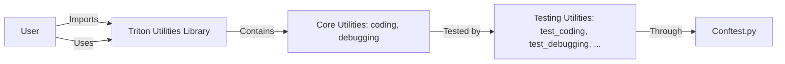

# Table of Contents

- [Chapter 0: Project Overview](#chapter-0-project-overview)
- [Chapter 1: triton_util/setup.py](#chapter-1-triton-util-setup-py)
- [Chapter 2: triton_util/tests/conftest.py](#chapter-2-triton-util-tests-conftest-py)
- [Chapter 3: triton_util/tests/test_coding.py](#chapter-3-triton-util-tests-test-coding-py)
- [Chapter 4: triton_util/tests/test_debugging.py](#chapter-4-triton-util-tests-test-debugging-py)
- [Chapter 5: triton_util/tests/test_loading.py](#chapter-5-triton-util-tests-test-loading-py)
- [Chapter 6: triton_util/triton_util/__init__.py](#chapter-6-triton-util-triton-util-init-py)
- [Chapter 7: triton_util/triton_util/coding.py](#chapter-7-triton-util-triton-util-coding-py)
- [Chapter 8: triton_util/triton_util/debugging.py](#chapter-8-triton-util-triton-util-debugging-py)

# Chapter 0: Project Overview

1. Overview: The project titled "Triton Utilities" is a technical book focused on providing comprehensive tools and solutions for Python developers working with machine learning and deep learning projects, particularly using the Triton. This book aims to help users understand, implement, and optimize their models efficiently.

  2. Grouping files by functionality:
     - Core Utilities: These are the main modules that contain the actual functionalities of the Triton Utilities library.
       - `triton_util/triton_util/__init__.py`: This file initializes the main package and provides an entry point for importing other modules.
       - `triton_util/triton_util/coding.py`: This module contains functions for coding, optimizing, and managing Python code used in machine learning projects.
       - `triton_util/triton_util/debugging.py`: This module provides debugging tools to help developers troubleshoot issues related to their machine learning models and TIS integrations.

     - Testing Utilities: These are the modules responsible for testing the functionalities of the main library.
       - `triton_util/tests/conftest.py`: This file contains setup code for running tests in the test suite.
       - `triton_util/tests/test_coding.py`, `triton_util/tests/test_debugging.py`, and `triton_util/tests/test_loading.py`: These files contain individual test cases for each of the functional modules in the library.

  3. Component Interaction: The user, working on a machine learning project, will use the Triton Utilities library by importing the necessary functions from the `triton_util/triton_util` package. They can write optimized code using the coding module and debug any issues that may arise with the help of the debugging module. To ensure the quality and functionality of these modules, they undergo testing with the test suite found in the `triton_util/tests` directory.

  4. Mermaid Diagram (simplified):



In this diagram, the user imports the Triton Utilities library (B), which contains two core utilities: coding and debugging. These core utilities are tested by the testing utilities, and the conftest.py file helps in setting up the test environment for these tests. The user can use the Triton Utilities functions while working on their machine learning projects.

## Chapter 1: triton_util/setup.py

 The `triton_util/setup.py` file serves as a setup script for the `triton-util` package within the larger project. It is responsible for managing the installation and distribution of the package, and it uses the Setuptools library to perform these tasks efficiently.

   Here's a breakdown of its important components:

   - `name`, `version`, `packages`, `install_requires`, `extras_require`: These variables define the name, version, packages included in the distribution, required dependencies, and optional development dependencies for `triton-util`.

   - `author`, `author_email`: These variables specify the author of the package along with their email address.

   - `description`, `long_description`, `long_description_content_type`: The description, long_description, and its content type provide a brief summary and detailed explanation of the purpose of the `triton-util` package.

   - `url`: This variable specifies the URL where the source code for the package can be found.

   - `classifiers`: This list defines various characteristics of the package, such as programming language support, license type, and operating system independence.

   - `python_requires`: The `python_requires` variable specifies that Python 3.12 or higher is required to use this package.

   In terms of where this code fits within the project, it is responsible for making sure the `triton-util` package can be easily installed and distributed as a part of the larger project. It works in conjunction with other setup scripts, such as those for the main project or other utility packages, to provide an integrated development environment (IDE).

   Example use cases include installing the `triton-util` package as a dependency for a Python project that leverages OpenAI Triton, or developing and testing new features within the `triton-util` package using the specified development dependencies like pytest, pylint, Torch, IPython. The setup script ensures that all prerequisites are met before moving forward with these tasks.

 ```mermaid
    sequenceDiagram
        participant User as User
        participant TritonUtil as TritonUtil
        participant Triton as Triton

        User->>TritonUtil: Import triton_util
        User->>TritonUtil: Call function (e.g., initialize_triton)
        TritonUtil-->Triton: Interact with Triton via provided interface (triton)
        Note over TritonUtil, Triton: If required packages/versions not met, raise exception
        TritonUtil-->>User: Return result or raise error
```

This mermaid diagram shows the basic interaction between a User, TritonUtil package, and the Triton library. The sequence starts with the user importing the triton_util package and calling one of its functions. The triton_util interacts directly with the Triton library using the provided `triton` interface. If any required packages or versions are not met, an exception is raised. The interaction ends with the triton_util returning a result to the user or raising an error.

## Chapter 2: triton_util/tests/conftest.py

 This chapter will delve into the purpose and functionality of the file `triton_util/tests/conftest.py` in the context of a project utilizing Triton, a GPU-accelerated computing framework for Machine Learning (ML) inference.

   `conftest.py` is a configuration file used by Pytest, a popular testing tool for Python, to set up test cases and fixtures. This particular configuration file provides a fixture for running tests with the Triton interpreter in both regular mode and interpreter mode.

   The main function in this file is `triton_interpret(request)`. This function takes care of switching between two modes: standard mode (TRITON_INTERPRET=0) and interpreter mode (TRITON_INTERPRET=1). By using the `pytest.fixture` decorator with the `scope='class'` and `params=['0', '1']`, this fixture will be executed once per test class, running tests both in regular mode and interpreter mode.

   This fixture sets the `TRITON_INTERPRET` environment variable to either "0" or "1", reloads the Triton modules, ensuring consistent behavior throughout each run of the test cases as modules may have different behaviors upon first import. After the test class is completed, it cleans up by removing the set environment variable.

   This code fits into the project testing suite, enabling developers to run tests in both regular mode and interpreter mode for a more comprehensive understanding of the Triton-based ML models' performance characteristics. The fixture is particularly useful when you want to ensure that your code works seamlessly under different configurations while utilizing Triton.

   Example use cases for this functionality might include verifying the correctness of the Triton model's input/output behavior in both modes, comparing the execution times between regular and interpreter mode for performance optimization purposes, or ensuring compatibility with specific hardware accelerators when using the interpreter mode.

 ```mermaid
   sequenceDiagram
      participant User as User
      participant Triton as Triton

      User->>Triton: Import triton and triton.language modules
      User->>Triton: Define pytest fixture for TRITON_INTERPRET
      User->>Triton: Parametrize the fixture with 0,1 values
      User<--Triton: Fixture object

      Note over User, Triton: Set TRITON_INTERPRET environment variable to requested param value

      User->>Triton: Reload triton and tl modules

      Note over User, Triton: Test the function with the given TRITON_INTERPRET value

      User<--Triton: Clean up TRITON_INTERPRET environment variable
   ```

This diagram shows that the user imports the `triton` and `triton.language` modules and defines a pytest fixture for `TRITON_INTERPRET`. The fixture is parametrized with two values (0 and 1). The user then sets the `TRITON_INTERPRET` environment variable to the requested value, reloads the Triton modules, runs some test function, and finally cleans up the environment variable.

## Chapter 3: triton_util/tests/test_coding.py

 The file `triton_util/tests/test_coding.py` is a test suite for the coding utilities implemented in the `triton_util` module. This test suite covers various functions and classes such as cdiv (ceiling division), offsets, masks, load, and store utilities.

   The primary purpose of these tests is to ensure the correctness of the coding utilities, which provide essential functionality for managing memory offsets, applying masks, loading and storing data in optimized ways, and performing ceiling division when necessary.

   Each test case focuses on a specific function or class:

   - `test_cdiv` tests the cdiv (ceiling division) function to verify its expected behavior with different input values.
   - Various tests for offsets, masks, load, and store utilities demonstrate their correctness in different scenarios such as 1D and 2D arrays, handling various numbers of chunks, and different input parameter configurations.

   These tests are essential for the overall functionality of the project as they help maintain the integrity of the coding utilities, ensuring that they work as intended and do not introduce any bugs or performance issues.

   Example use cases could include optimizing data processing tasks in deep learning applications using Triton's GPU acceleration, especially for large-scale datasets where efficient memory management is crucial for improving performance. The coding utilities provided in this library can help developers tackle such challenges by offering optimized and flexible solutions for managing memory offsets, masks, loads, and stores during data processing tasks.

 ```mermaid
    sequenceDiagram
        participant User as U
        participant TestCodingUtils as TCU
        User->>TCU: Run test_cdiv()
        Note over TCU: cdiv function is tested
        TCU-->>User: Assertion passed for test_cdiv()

        User->>TCU: Run test_offset_1d()
        Note over TCU: 1D offsets are tested
        TCU-->>User: Assertion passed for test_offset_1d()

        User->>TCU: Run test_offset_2d()
        Note over TCU: 2D offsets are tested
        TCU-->>User: Assertion passed for test_offset_2d()

        User->>TCU: Run test_mask_1d()
        Note over TCU: 1D masks are tested
        TCU-->>User: Assertion passed for test_mask_1d()

        User->>TCU: Run test_mask_2d()
        Note over TCU: 2D masks are tested
        TCU-->>User: Assertion passed for test_mask_2d()

        User->>TCU: Run test_load_1d()
        Note over TCU: 1D load function is tested
        TCU-->>User: Assertion passed for test_load_1d()

        User->>TCU: Run test_load_full_1d()
        Note over TCU: Full 1D load function is tested
        TCU-->>User: Assertion passed for test_load_full_1d()

        User->>TCU: Run test_load_2d()
        Note over TCU: 2D load function is tested
        TCU-->>User: Assertion passed for test_load_2d()

        User->>TCU: Run test_load_full_2d()
        Note over TCU: Full 2D load function is tested
        TCU-->>User: Assertion passed for test_load_full_2d()

        User->>TCU: Run test_store_1d()
        Note over TCU: 1D store function is tested
        TCU-->>User: Assertion passed for test_store_1d()

        User->>TCU: Run test_store_full_1d()
        Note over TCU: Full 1D store function is tested
        TCU-->>User: Assertion passed for test_store_full_1d()

        User->>TCU: Run test_store_2d()
        Note over TCU: 2D store function is tested
        TCU-->>User: Assertion passed for test_store_2d()

        User->>TCU: Run test_store_full_2d()
        Note over TCU: Full 2D store function is tested
        TCU-->>User: Assertion passed for test_store_full_2d()
   ```

## Chapter 4: triton_util/tests/test_debugging.py

 The file `triton_util/tests/test_debugging.py` is a testing module for debugging utilities within the Triton GPU kernels project. It aims to ensure that the debugging functions work as expected, providing developers with confidence in their code's correctness.

   The primary function of interest in this file is `test_debuggingUtils`, which contains several test cases for two important functions: `_test_pid_conds` and `assert_tensors_gpu_ready`.

   1. `_test_pid_conds` is a utility function that evaluates whether a given condition string is true for the current process id (PID). It takes a condition string and optionally an integer argument, which represents a value to compare against. The purpose of this function is to provide a consistent method for testing conditional statements based on the current PID within Triton kernels.

   2. `assert_tensors_gpu_ready` is another utility function that asserts that a given PyTorch tensor is ready for use on the GPU. This function ensures that the tensor has been moved to the GPU, is contiguous, and has no overlapping memory regions with other tensors. It raises an AssertionError if any of these conditions are not met.

   The `test_debuggingUtils` class contains several test cases for both functions, verifying their functionality under various scenarios. For example, the `test_test_pid_conds` method tests the edge cases and correct behavior of the `_test_pid_conds` function, while `test_assert_tensors_gpu_ready` checks whether the `assert_tensors_gpu_ready` function can correctly handle tensors on the CPU and GPU with different shapes and contiguity.

   This code fits into the broader Triton project by providing essential testing for debugging utilities, ensuring that developers' kernels operate as intended when running on GPU devices using the PyTorch tensor library. These tests are crucial in catching errors early during development and maintaining a high level of quality for the project.

 ```mermaid
   sequenceDiagram
      participant User as U
      participant Function test_test_pid_conds as F1
      participant Function test_assert_tensors_gpu_ready as F2
      participant Function test_offsets_from_base as F3
      participant Module triton_interpret as I

      U->>F1: Call test_test_pid_conds()
      F1-->U: Execution passes
      U->>F1: Call test_test_pid_conds('>0', 1, 1)
      F1-->U: Execution passes
      U->>F1: Call test_test_pid_conds('>0', 0, 1)
      F1-->U: Execution fails
      U->>F1: Call test_test_pid_conds('=0,=1', 0, 1, 0)
      F1-->U: Execution passes

      U->>F2: Call test_assert_tensors_gpu_ready()
      F2-->U: Initialization with gpu tensor (passes)

      note over F2, I: If triton_interpret = '1'
      I->>F2: Simulate interpreter setting
      end

      U->>F2: Call test_assert_tensors_gpu_ready(cpu tensor)
      F2-->U: Execution fails (AssertionError)

      U->>F3: Call test_offsets_from_base() with GPU tensors
      F3-->U: Execution passes, out contains [1, 2, 3, 4]
   ```

## Chapter 5: triton_util/tests/test_loading.py

 The `triton_util/tests/test_loading.py` file is a test module that verifies the correct loading of the Triton compiler and runtime, specifically when switching between interpreter mode (TRITON_INTERPRET=1) and just-in-time (JIT) compilation mode (TRITON_INTERPRET=0). This functionality is crucial for testing both interpreter-specific features and regular compiled functions in the Triton project.

   The module defines a single test class, `TestLoading`, which contains the following methods:

   - `test_interpreter_mode`: This method checks that the current TRITON_INTERPRET environment variable matches the expected mode (either 1 or 0). It also verifies that the Triton kernel function gets jitted into the appropriate type based on the selected mode. In other words, it ensures that the Triton library loads correctly in either interpreter or JIT compilation mode.

   This test file is essential for maintaining the integrity of the Triton project, as it verifies that the correct Triton runtime behavior is observed under various configurations. For instance, a developer may want to run tests using the interpreter mode to debug and profile their kernel functions interactively before deploying them in a production environment where JIT compilation would be more appropriate for performance reasons.

   In terms of example use cases, suppose a developer makes changes to the Triton library, and they need to ensure that these modifications do not affect the loading behavior of the interpreter or JIT modes. They can run this test module to verify that the correct functions get jitted into the expected types under both modes. If any issues are found, the developer can then address them before pushing their changes to the main branch or releasing a new version of the Triton library.

 ```mermaid
   sequenceDiagram
      participant User as User
      participant Triton as Triton

      User->>Triton: Import triton and tl modules
      User->>Triton: Define TestLoading class
      User->>Triton: Define test_interpreter_mode method within TestLoading class
      User->>Triton: Set up triton_interpret variable and some_kernel function with @triton.jit decorator
      User->>Triton: Check if TRITON_INTERPRET environment variable is set correctly
      User->>Triton: Determine the expected jit_fn_type based on triton_interpret
      User->>Triton: Assert that some_kernel instance is of the expected jit_fn_type
   ```

## Chapter 6: triton_util/triton_util/__init__.py

 Title: Triton-Util - A Utility Library for Streamlining Triton GPU Kernel Development

   Overview:
      `triton_util/triton_util/__init__.py` is the entry point of the Triton-Util library, a utility collection designed to simplify and accelerate the process of writing efficient Triton GPU kernels. This package provides high-level abstractions and helpers for common GPU data access patterns, reducing boilerplate code and the potential for errors.

   Key Functions & Classes:
      - `print_once`: A debugging function that will print its argument once per kernel invocation.
      - `breakpoint_if`: A debugging hook that pauses execution if a condition is met, useful for inspecting kernel behavior without disrupting the overall flow.
      - `load_2d`, `store_2d`: Helper functions for loading and storing data from GPU memory in a 2D format, minimizing repetitive index calculations.
      - Additional utility functions such as `chunking`, `masking`, `offset_computation`, and bulk load/store helpers.

   Fitting into the Project:
      The Triton-Util library sits alongside the native Triton codebase, providing an additional layer of abstraction for streamlined development of GPU kernels. Developers can choose to use as little or as much of the library as needed, allowing a progressive approach to adopting its features.

   Example Use Cases:
      - Instead of manually calculating and constructing offsets for loading data from GPU memory:
        ```python
        >>> offs0 = n0 * sz0 + tl.arange(0, sz0)
        >>> offs1 = n1 * sz1 + tl.arange(0, sz1)
        >>> offs = offs0[:, None] * stride0 + offs1[None, :] * stride1
        ```
      Use the `load_2d` function to accomplish the same goal:
        ```python
        >>> load_2d(ptr, sz0, sz1, n0, n1, max0, max1, stride0)
        ```

   For further details, examples, and community support, please visit our repository on GitHub (https://github.com/cuda-mode/triton-util) or join the Triton channel on our Discord server (https://discord.gg/cudamode).

   Author: Umer Hadil

 ```mermaid
   sequenceDiagram
      participant User as User
      participant TritonUtil as TritonUtil

      Note over User,TritonUtil: Use Triton-Util package to simplify writing GPU kernels

      User->>TritonUtil: Import debugging and coding utilities
      User->>TritonUtil: Call load_2d with required arguments
      TritonUtil-->>User: Performs necessary calculations behind the scenes
      TritonUtil-->>User: Loads data into GPU memory

      Alternate sequence:
      User->>TritonUtil: Import debugging and coding utilities
      User->>TritonUtil: Call other functions like print_once, breakpoint_if etc.
      TritonUtil-->>User: Provides convenience in debugging and error handling
   ```

## Chapter 7: triton_util/triton_util/coding.py

 In this chapter, we will delve into the purpose and functionality of the file `triton_util/triton_util/coding.py` in the Triton project. This file is a collection of utility functions for tasks such as offset calculation, masking, and load/store operations that are frequently used across various parts of the project.

   The primary functions in this file can be grouped into several categories:

   - Arithmetic Functions:
     - cdiv(a, b): Returns the ceiling division of a by b.

   - Offset Calculation Functions:
     - offset_1d(sz, n_prev_chunks=0): Computes the 1D offset based on chunk size and previous chunks.
     - offset_2d(offs0, offs1, stride0, stride1=1): Compute 2D offset using strides.

   - Mask Functions:
     - mask_1d(offs, max): Creates a 1D mask based on a max bound.
     - mask_2d(offs0, offs1, max0, max1): Creates a 2D mask using upper bounds for each axis.

   - Load Functions:
     - load_1d(ptr, sz, n, max, stride=1): Loads the nth chunk from a 1D vector defined by ptr into a new array.
     - load_full_1d(ptr, sz, stride=1): Loads the entire 1D block [0,...,sz-1] from a vector defined by ptr.
     - load_2d(ptr, sz0, sz1, n0, n1, max0, max1, stride0=None, stride1=1): Loads the (n0, n1)th chunk from a 2D matrix defined by ptr into a new array.
     - load_full_2d(ptr, sz0, sz1, stride0=None, stride1=1): Loads the entire 2D block [0,...,sz0-1] x [0,...,sz1-1] from a matrix defined by ptr.

   - Store Functions:
     - store_1d(vals, ptr, sz, n, max, stride=1): Stores a given set of values into the nth chunk of a 1D vector defined by ptr.
     - store_full_1d(vals, ptr, sz, stride=1): Stores a given set of values into the entire 1D vector defined by ptr.
     - store_2d(vals, ptr, sz0, sz1, n0, n1, max0, max1, stride0=None, stride1=1): Stores a given set of values into the (n0, n1)th chunk of a 2D matrix defined by ptr.
     - store_full_2d(vals, ptr, sz0, sz1, stride0=None, stride1=1): Stores a given set of values into the entire 2D matrix defined by ptr.

   These utility functions play a crucial role in various parts of the Triton project that involve operations on data structures such as vectors and matrices. For example, they can be used in image processing tasks to manage chunks of an image, or in linear algebra computations for efficient manipulation of large matrix blocks.

 ```mermaid
   sequenceDiagram
        participant T as Triton
        participant O1d as Offset_1d
        participant M1d as Mask_1d
        participant L1d as Load_1d
        participant S1d as Store_1d
        participant O2d as Offset_2d
        participant M2d as Mask_2d
        participant L2d as Load_2d
        participant S2d as Store_2d

        T->>O1d: Call offset_1d(sz, n_prev_chunks)
        O1d-->>T: Return offset_1d result
        Note over T, O1d: 1D Offset calculation function

        T->>M1d: Call mask_1d(offs, max)
        M1d-->>T: Return mask_1d result
        Note over T, M1d: 1D Mask creation function

        T->>L1d: Call load_1d(ptr, sz, n, max, stride=1)
        L1d->>M1d: Forward mask_1d argument
        M1d-->>L1d: Return mask_1d result
        L1d->>O1d: Forward offset_1d argument
        O1d-->>L1d: Return offset_1d result
        Note over T, L1d: 1D Load function for a specific chunk

        T->>S1d: Call store_1d(vals, ptr, sz, n, max, stride=1)
        S1d->>M1d: Forward mask_1d argument
        M1d-->>S1d: Return mask_1d result
        S1d->>O1d: Forward offset_1d argument
        O1d-->>S1d: Return offset_1d result
        Note over T, S1d: 1D Store function for a specific chunk

        T->>O2d: Call offset_2d(offs0, offs1, stride0, stride1=1)
        O2d-->>T: Return offset_2d result
        Note over T, O2d: 2D Offset calculation function

        T->>M2d: Call mask_2d(offs0, offs1, max0, max1)
        M2d-->>T: Return mask_2d result
        Note over T, M2d: 2D Mask creation function

        T->>L2d: Call load_2d(ptr, sz0, sz1, n0, n1, max0, max1, stride0=None, stride1=1)
        L2d->>M2d: Forward mask_2d argument
        M2d-->>L2d: Return mask_2d result
        L2d->>O2d: Forward offset_2d argument
        O2d-->>L2d: Return offset_2d result
        Note over T, L2d: 2D Load function for a specific chunk

        T->>S2d: Call store_2d(vals, ptr, sz0, sz1, n0, n1, max0, max1, stride0=None, stride1=1)
        S2d->>M2d: Forward mask_2d argument
        M2d-->>S2d: Return mask_2d result
        S2d->>O2d: Forward offset_2d argument
        O2d-->>S2d: Return offset_2d result
        Note over T, S2d: 2D Store function for a specific chunk
   ```

## Chapter 8: triton_util/triton_util/debugging.py

 The `triton_util/triton_util/debugging.py` file provides a set of utility functions for debugging Triton kernels. These utilities include conditional breakpoints and printing based on thread identifiers, as well as tensor readiness checks for both CUDA and interpreted environments.

   The primary function is `_test_pid_conds(conds, pid0=0, pid1=0, pid2=0)`, which tests if a given set of conditions (comma-separated) on thread identifiers are fulfilled. Conditions can be specified as numerical comparisons, such as '>=0', '<1', or '!=3'.

   The `triton.jit` decorator is used to mark the following functions as Triton kernels: `test_pid_conds(conds)`, `breakpoint_if(conds)`, `print_if(*txt, conds)`, `breakpoint_once()`, and `print_once(*txt)`. These functions perform the same tasks as their non-jit counterparts but within the kernel context.

   The function `assert_tensors_gpu_ready(*tensors)` checks that each input tensor is contiguous and located on the GPU (unless TRITON_INTERPRET environment variable is set to 1, indicating an interpreted execution environment).

   Finally, `offsets_from_base(ptrs, base_pointer)` calculates the offsets for which a list of pointers equals the base pointer plus the offsets. This function can be used when determining the relative positions of memory blocks managed by the kernel.

   These debugging utilities are intended to aid in the development and debugging of Triton kernels within a larger project that leverages the Triton framework for high-performance computing tasks on GPUs. Example use cases include setting breakpoints at specific conditions, printing messages only when certain threads match specified criteria, or ensuring tensor data is properly prepared before being passed to the kernel.

 ```mermaid
    sequenceDiagram
        participant User as User
        participant Function as Function
        participant Breakpoint_if as Breakpoint_if
        participant Print_if as Print_if
        participant Test_pid_conds as Test_pid_conds
        participant Assert_tensors_gpu_ready as Assert_tensors_gpu_read
        User->>Function: Call function
        Function->>Test_pid_conds: Call test_pid_conds(conds)
        Test_pid_conds-->>Function: Return True/False based on conds and pids
        Function->>Breakpoint_if: If true, call breakpoint_if(conds)
        Breakpoint_if-->User: Trigger breakpoint (IPython debugger)
        Function->>Print_if: If false, call print_if(*txt, conds)
        Print_if-->>User: Print the text if conditions are met
        User->>Function: Call assert_tensors_gpu_ready(*tensors)
        Function->>Assert_tensors_gpu_ready: Verify each tensor is contiguous and on GPU (unless TRITON_INTERPRET=1)
    ```
    This sequence diagram shows how the key functions interact in the `triton_util/triton_util/debugging.py` file. The user calls a function, which then checks certain conditions using `test_pid_conds`. If the condition is true, it triggers a breakpoint (using `breakpoint_if`) or prints a message (using `print_if`). The function also has an assertion for ensuring tensor readiness with `assert_tensors_gpu_ready`.