# Table of Contents

- [Chapter 0: Project Overview](#chapter-0-project-overview)
- [Chapter 1: python/build_helpers.py](#chapter-1-python-build-helpers-py)
- [Chapter 2: python/test/backend/test_device_backend.py](#chapter-2-python-test-backend-test-device-backend-py)
- [Chapter 3: python/test/conftest.py](#chapter-3-python-test-conftest-py)
- [Chapter 4: python/test/gluon/test_core.py](#chapter-4-python-test-gluon-test-core-py)
- [Chapter 5: python/test/gluon/test_frontend.py](#chapter-5-python-test-gluon-test-frontend-py)
- [Chapter 6: python/test/regression/test_cast_matmul.py](#chapter-6-python-test-regression-test-cast-matmul-py)
- [Chapter 7: python/test/regression/test_functional_regressions.py](#chapter-7-python-test-regression-test-functional-regressions-py)
- [Chapter 8: python/test/unit/blackwell/test_tmem.py](#chapter-8-python-test-unit-blackwell-test-tmem-py)
- [Chapter 9: python/test/unit/cuda/__init__.py](#chapter-9-python-test-unit-cuda-init-py)
- [Chapter 10: python/test/unit/cuda/test_mixed_io.py](#chapter-10-python-test-unit-cuda-test-mixed-io-py)
- [Chapter 11: python/test/unit/cuda/test_tensor_descriptor.py](#chapter-11-python-test-unit-cuda-test-tensor-descriptor-py)
- [Chapter 12: python/test/unit/cuda/test_tma_descriptor.py](#chapter-12-python-test-unit-cuda-test-tma-descriptor-py)
- [Chapter 13: python/test/unit/cuda/test_tma_store_gemm.py](#chapter-13-python-test-unit-cuda-test-tma-store-gemm-py)
- [Chapter 14: python/test/unit/instrumentation/test_gpuhello.py](#chapter-14-python-test-unit-instrumentation-test-gpuhello-py)
- [Chapter 15: python/test/unit/language/print_helper.py](#chapter-15-python-test-unit-language-print-helper-py)
- [Chapter 16: python/test/unit/language/test_annotations.py](#chapter-16-python-test-unit-language-test-annotations-py)
- [Chapter 17: python/test/unit/language/test_block_pointer.py](#chapter-17-python-test-unit-language-test-block-pointer-py)
- [Chapter 18: python/test/unit/language/test_compile_errors.py](#chapter-18-python-test-unit-language-test-compile-errors-py)
- [Chapter 19: python/test/unit/language/test_compile_only.py](#chapter-19-python-test-unit-language-test-compile-only-py)
- [Chapter 20: python/test/unit/language/test_conversions.py](#chapter-20-python-test-unit-language-test-conversions-py)
- [Chapter 21: python/test/unit/language/test_core.py](#chapter-21-python-test-unit-language-test-core-py)
- [Chapter 22: python/test/unit/language/test_decorator.py](#chapter-22-python-test-unit-language-test-decorator-py)
- [Chapter 23: python/test/unit/language/test_frontend.py](#chapter-23-python-test-unit-language-test-frontend-py)
- [Chapter 24: python/test/unit/language/test_libdevice.py](#chapter-24-python-test-unit-language-test-libdevice-py)
- [Chapter 25: python/test/unit/language/test_line_info.py](#chapter-25-python-test-unit-language-test-line-info-py)
- [Chapter 26: python/test/unit/language/test_matmul.py](#chapter-26-python-test-unit-language-test-matmul-py)
- [Chapter 27: python/test/unit/language/test_module.py](#chapter-27-python-test-unit-language-test-module-py)
- [Chapter 28: python/test/unit/language/test_mxfp.py](#chapter-28-python-test-unit-language-test-mxfp-py)
- [Chapter 29: python/test/unit/language/test_pipeliner.py](#chapter-29-python-test-unit-language-test-pipeliner-py)
- [Chapter 30: python/test/unit/language/test_random.py](#chapter-30-python-test-unit-language-test-random-py)
- [Chapter 31: python/test/unit/language/test_reproducer.py](#chapter-31-python-test-unit-language-test-reproducer-py)
- [Chapter 32: python/test/unit/language/test_standard.py](#chapter-32-python-test-unit-language-test-standard-py)
- [Chapter 33: python/test/unit/language/test_subprocess.py](#chapter-33-python-test-unit-language-test-subprocess-py)
- [Chapter 34: python/test/unit/language/test_tensor_descriptor.py](#chapter-34-python-test-unit-language-test-tensor-descriptor-py)
- [Chapter 35: python/test/unit/language/test_tuple.py](#chapter-35-python-test-unit-language-test-tuple-py)
- [Chapter 36: python/test/unit/language/test_warp_specialization.py](#chapter-36-python-test-unit-language-test-warp-specialization-py)
- [Chapter 37: python/test/unit/runtime/test_autotuner.py](#chapter-37-python-test-unit-runtime-test-autotuner-py)
- [Chapter 38: python/test/unit/runtime/test_bindings.py](#chapter-38-python-test-unit-runtime-test-bindings-py)
- [Chapter 39: python/test/unit/runtime/test_build.py](#chapter-39-python-test-unit-runtime-test-build-py)
- [Chapter 40: python/test/unit/runtime/test_cache.py](#chapter-40-python-test-unit-runtime-test-cache-py)
- [Chapter 41: python/test/unit/runtime/test_compilation_listener.py](#chapter-41-python-test-unit-runtime-test-compilation-listener-py)
- [Chapter 42: python/test/unit/runtime/test_cublas.py](#chapter-42-python-test-unit-runtime-test-cublas-py)
- [Chapter 43: python/test/unit/runtime/test_driver.py](#chapter-43-python-test-unit-runtime-test-driver-py)
- [Chapter 44: python/test/unit/runtime/test_jit.py](#chapter-44-python-test-unit-runtime-test-jit-py)
- [Chapter 45: python/test/unit/runtime/test_launch.py](#chapter-45-python-test-unit-runtime-test-launch-py)
- [Chapter 46: python/test/unit/runtime/test_subproc.py](#chapter-46-python-test-unit-runtime-test-subproc-py)
- [Chapter 47: python/test/unit/test_debug.py](#chapter-47-python-test-unit-test-debug-py)
- [Chapter 48: python/test/unit/test_debug_dump.py](#chapter-48-python-test-unit-test-debug-dump-py)
- [Chapter 49: python/test/unit/test_filecheck.py](#chapter-49-python-test-unit-test-filecheck-py)
- [Chapter 50: python/test/unit/test_knobs.py](#chapter-50-python-test-unit-test-knobs-py)
- [Chapter 51: python/test/unit/test_perf_warning.py](#chapter-51-python-test-unit-test-perf-warning-py)
- [Chapter 52: python/test/unit/tools/test_aot.py](#chapter-52-python-test-unit-tools-test-aot-py)
- [Chapter 53: python/test/unit/tools/test_disasm.py](#chapter-53-python-test-unit-tools-test-disasm-py)
- [Chapter 54: python/test/unit/tools/test_irsource.py](#chapter-54-python-test-unit-tools-test-irsource-py)
- [Chapter 55: python/triton/__init__.py](#chapter-55-python-triton-init-py)
- [Chapter 56: python/triton/_filecheck.py](#chapter-56-python-triton-filecheck-py)
- [Chapter 57: python/triton/_internal_testing.py](#chapter-57-python-triton-internal-testing-py)
- [Chapter 58: python/triton/_utils.py](#chapter-58-python-triton-utils-py)
- [Chapter 59: python/triton/backends/__init__.py](#chapter-59-python-triton-backends-init-py)
- [Chapter 60: python/triton/backends/compiler.py](#chapter-60-python-triton-backends-compiler-py)
- [Chapter 61: python/triton/backends/driver.py](#chapter-61-python-triton-backends-driver-py)
- [Chapter 62: python/triton/compiler/__init__.py](#chapter-62-python-triton-compiler-init-py)
- [Chapter 63: python/triton/compiler/code_generator.py](#chapter-63-python-triton-compiler-code-generator-py)
- [Chapter 64: python/triton/compiler/compiler.py](#chapter-64-python-triton-compiler-compiler-py)
- [Chapter 65: python/triton/compiler/errors.py](#chapter-65-python-triton-compiler-errors-py)
- [Chapter 66: python/triton/compiler/make_launcher.py](#chapter-66-python-triton-compiler-make-launcher-py)
- [Chapter 67: python/triton/errors.py](#chapter-67-python-triton-errors-py)
- [Chapter 68: python/triton/experimental/__init__.py](#chapter-68-python-triton-experimental-init-py)
- [Chapter 69: python/triton/experimental/gluon/__init__.py](#chapter-69-python-triton-experimental-gluon-init-py)
- [Chapter 70: python/triton/experimental/gluon/_compiler.py](#chapter-70-python-triton-experimental-gluon-compiler-py)
- [Chapter 71: python/triton/experimental/gluon/_runtime.py](#chapter-71-python-triton-experimental-gluon-runtime-py)
- [Chapter 72: python/triton/experimental/gluon/language/__init__.py](#chapter-72-python-triton-experimental-gluon-language-init-py)
- [Chapter 73: python/triton/experimental/gluon/language/_core.py](#chapter-73-python-triton-experimental-gluon-language-core-py)
- [Chapter 74: python/triton/experimental/gluon/language/_layouts.py](#chapter-74-python-triton-experimental-gluon-language-layouts-py)
- [Chapter 75: python/triton/experimental/gluon/language/_semantic.py](#chapter-75-python-triton-experimental-gluon-language-semantic-py)
- [Chapter 76: python/triton/experimental/gluon/language/nvidia/__init__.py](#chapter-76-python-triton-experimental-gluon-language-nvidia-init-py)
- [Chapter 77: python/triton/experimental/gluon/language/nvidia/blackwell/__init__.py](#chapter-77-python-triton-experimental-gluon-language-nvidia-blackwell-init-py)
- [Chapter 78: python/triton/experimental/gluon/language/nvidia/blackwell/tma.py](#chapter-78-python-triton-experimental-gluon-language-nvidia-blackwell-tma-py)
- [Chapter 79: python/triton/experimental/gluon/language/nvidia/hopper/__init__.py](#chapter-79-python-triton-experimental-gluon-language-nvidia-hopper-init-py)
- [Chapter 80: python/triton/experimental/gluon/language/nvidia/hopper/mbarrier.py](#chapter-80-python-triton-experimental-gluon-language-nvidia-hopper-mbarrier-py)
- [Chapter 81: python/triton/experimental/gluon/language/nvidia/hopper/tma.py](#chapter-81-python-triton-experimental-gluon-language-nvidia-hopper-tma-py)
- [Chapter 82: python/triton/knobs.py](#chapter-82-python-triton-knobs-py)
- [Chapter 83: python/triton/language/__init__.py](#chapter-83-python-triton-language-init-py)
- [Chapter 84: python/triton/language/core.py](#chapter-84-python-triton-language-core-py)
- [Chapter 85: python/triton/language/extra/__init__.py](#chapter-85-python-triton-language-extra-init-py)
- [Chapter 86: python/triton/language/extra/libdevice.py](#chapter-86-python-triton-language-extra-libdevice-py)
- [Chapter 87: python/triton/language/math.py](#chapter-87-python-triton-language-math-py)
- [Chapter 88: python/triton/language/random.py](#chapter-88-python-triton-language-random-py)
- [Chapter 89: python/triton/language/semantic.py](#chapter-89-python-triton-language-semantic-py)
- [Chapter 90: python/triton/language/standard.py](#chapter-90-python-triton-language-standard-py)
- [Chapter 91: python/triton/runtime/__init__.py](#chapter-91-python-triton-runtime-init-py)
- [Chapter 92: python/triton/runtime/_allocation.py](#chapter-92-python-triton-runtime-allocation-py)
- [Chapter 93: python/triton/runtime/autotuner.py](#chapter-93-python-triton-runtime-autotuner-py)
- [Chapter 94: python/triton/runtime/build.py](#chapter-94-python-triton-runtime-build-py)
- [Chapter 95: python/triton/runtime/cache.py](#chapter-95-python-triton-runtime-cache-py)
- [Chapter 96: python/triton/runtime/driver.py](#chapter-96-python-triton-runtime-driver-py)
- [Chapter 97: python/triton/runtime/errors.py](#chapter-97-python-triton-runtime-errors-py)
- [Chapter 98: python/triton/runtime/interpreter.py](#chapter-98-python-triton-runtime-interpreter-py)
- [Chapter 99: python/triton/runtime/jit.py](#chapter-99-python-triton-runtime-jit-py)
- [Chapter 100: python/triton/testing.py](#chapter-100-python-triton-testing-py)
- [Chapter 101: python/triton/tools/__init__.py](#chapter-101-python-triton-tools-init-py)
- [Chapter 102: python/triton/tools/build_extern.py](#chapter-102-python-triton-tools-build-extern-py)
- [Chapter 103: python/triton/tools/compile.py](#chapter-103-python-triton-tools-compile-py)
- [Chapter 104: python/triton/tools/disasm.py](#chapter-104-python-triton-tools-disasm-py)
- [Chapter 105: python/triton/tools/link.py](#chapter-105-python-triton-tools-link-py)
- [Chapter 106: python/triton/tools/mxfp.py](#chapter-106-python-triton-tools-mxfp-py)
- [Chapter 107: python/triton/tools/tensor_descriptor.py](#chapter-107-python-triton-tools-tensor-descriptor-py)
- [Chapter 108: python/triton_kernels/bench/bench_mlp.py](#chapter-108-python-triton-kernels-bench-bench-mlp-py)
- [Chapter 109: python/triton_kernels/tests/__init__.py](#chapter-109-python-triton-kernels-tests-init-py)
- [Chapter 110: python/triton_kernels/tests/conftest.py](#chapter-110-python-triton-kernels-tests-conftest-py)
- [Chapter 111: python/triton_kernels/tests/test_compaction.py](#chapter-111-python-triton-kernels-tests-test-compaction-py)
- [Chapter 112: python/triton_kernels/tests/test_matmul.py](#chapter-112-python-triton-kernels-tests-test-matmul-py)
- [Chapter 113: python/triton_kernels/tests/test_mxfp.py](#chapter-113-python-triton-kernels-tests-test-mxfp-py)
- [Chapter 114: python/triton_kernels/tests/test_routing.py](#chapter-114-python-triton-kernels-tests-test-routing-py)
- [Chapter 115: python/triton_kernels/tests/test_swiglu.py](#chapter-115-python-triton-kernels-tests-test-swiglu-py)
- [Chapter 116: python/triton_kernels/triton_kernels/__init__.py](#chapter-116-python-triton-kernels-triton-kernels-init-py)
- [Chapter 117: python/triton_kernels/triton_kernels/bitmatrix.py](#chapter-117-python-triton-kernels-triton-kernels-bitmatrix-py)
- [Chapter 118: python/triton_kernels/triton_kernels/compaction.py](#chapter-118-python-triton-kernels-triton-kernels-compaction-py)
- [Chapter 119: python/triton_kernels/triton_kernels/compaction_details/_masked_compaction.py](#chapter-119-python-triton-kernels-triton-kernels-compaction-details-masked-compaction-py)
- [Chapter 120: python/triton_kernels/triton_kernels/matmul_ogs.py](#chapter-120-python-triton-kernels-triton-kernels-matmul-ogs-py)
- [Chapter 121: python/triton_kernels/triton_kernels/matmul_ogs_details/_common.py](#chapter-121-python-triton-kernels-triton-kernels-matmul-ogs-details-common-py)
- [Chapter 122: python/triton_kernels/triton_kernels/matmul_ogs_details/_finalize_matmul.py](#chapter-122-python-triton-kernels-triton-kernels-matmul-ogs-details-finalize-matmul-py)
- [Chapter 123: python/triton_kernels/triton_kernels/matmul_ogs_details/_matmul_ogs.py](#chapter-123-python-triton-kernels-triton-kernels-matmul-ogs-details-matmul-ogs-py)
- [Chapter 124: python/triton_kernels/triton_kernels/matmul_ogs_details/_p_matmul_ogs.py](#chapter-124-python-triton-kernels-triton-kernels-matmul-ogs-details-p-matmul-ogs-py)
- [Chapter 125: python/triton_kernels/triton_kernels/matmul_ogs_details/_weight_transpose.py](#chapter-125-python-triton-kernels-triton-kernels-matmul-ogs-details-weight-transpose-py)
- [Chapter 126: python/triton_kernels/triton_kernels/matmul_ogs_details/fast_contiguous.py](#chapter-126-python-triton-kernels-triton-kernels-matmul-ogs-details-fast-contiguous-py)
- [Chapter 127: python/triton_kernels/triton_kernels/matmul_ogs_details/metadata.py](#chapter-127-python-triton-kernels-triton-kernels-matmul-ogs-details-metadata-py)
- [Chapter 128: python/triton_kernels/triton_kernels/matmul_ogs_details/opt_flags.py](#chapter-128-python-triton-kernels-triton-kernels-matmul-ogs-details-opt-flags-py)
- [Chapter 129: python/triton_kernels/triton_kernels/matmul_ogs_details/opt_flags_amd.py](#chapter-129-python-triton-kernels-triton-kernels-matmul-ogs-details-opt-flags-amd-py)
- [Chapter 130: python/triton_kernels/triton_kernels/matmul_ogs_details/opt_flags_nvidia.py](#chapter-130-python-triton-kernels-triton-kernels-matmul-ogs-details-opt-flags-nvidia-py)
- [Chapter 131: python/triton_kernels/triton_kernels/numerics.py](#chapter-131-python-triton-kernels-triton-kernels-numerics-py)
- [Chapter 132: python/triton_kernels/triton_kernels/numerics_details/__init__.py](#chapter-132-python-triton-kernels-triton-kernels-numerics-details-init-py)
- [Chapter 133: python/triton_kernels/triton_kernels/numerics_details/flexpoint.py](#chapter-133-python-triton-kernels-triton-kernels-numerics-details-flexpoint-py)
- [Chapter 134: python/triton_kernels/triton_kernels/numerics_details/mxfp.py](#chapter-134-python-triton-kernels-triton-kernels-numerics-details-mxfp-py)
- [Chapter 135: python/triton_kernels/triton_kernels/reduction_details/reduce_bitmatrix.py](#chapter-135-python-triton-kernels-triton-kernels-reduction-details-reduce-bitmatrix-py)
- [Chapter 136: python/triton_kernels/triton_kernels/routing.py](#chapter-136-python-triton-kernels-triton-kernels-routing-py)
- [Chapter 137: python/triton_kernels/triton_kernels/routing_details/_routing_compute.py](#chapter-137-python-triton-kernels-triton-kernels-routing-details-routing-compute-py)
- [Chapter 138: python/triton_kernels/triton_kernels/specialize.py](#chapter-138-python-triton-kernels-triton-kernels-specialize-py)
- [Chapter 139: python/triton_kernels/triton_kernels/swiglu.py](#chapter-139-python-triton-kernels-triton-kernels-swiglu-py)
- [Chapter 140: python/triton_kernels/triton_kernels/swiglu_details/_swiglu.py](#chapter-140-python-triton-kernels-triton-kernels-swiglu-details-swiglu-py)
- [Chapter 141: python/triton_kernels/triton_kernels/target_info.py](#chapter-141-python-triton-kernels-triton-kernels-target-info-py)
- [Chapter 142: python/triton_kernels/triton_kernels/testing.py](#chapter-142-python-triton-kernels-triton-kernels-testing-py)
- [Chapter 143: python/triton_kernels/triton_kernels/topk.py](#chapter-143-python-triton-kernels-triton-kernels-topk-py)
- [Chapter 144: python/triton_kernels/triton_kernels/topk_details/_topk.py](#chapter-144-python-triton-kernels-triton-kernels-topk-details-topk-py)
- [Chapter 145: python/tutorials/01-vector-add.py](#chapter-145-python-tutorials-01-vector-add-py)
- [Chapter 146: python/tutorials/02-fused-softmax.py](#chapter-146-python-tutorials-02-fused-softmax-py)
- [Chapter 147: python/tutorials/03-matrix-multiplication.py](#chapter-147-python-tutorials-03-matrix-multiplication-py)
- [Chapter 148: python/tutorials/04-low-memory-dropout.py](#chapter-148-python-tutorials-04-low-memory-dropout-py)
- [Chapter 149: python/tutorials/05-layer-norm.py](#chapter-149-python-tutorials-05-layer-norm-py)
- [Chapter 150: python/tutorials/06-fused-attention.py](#chapter-150-python-tutorials-06-fused-attention-py)
- [Chapter 151: python/tutorials/07-extern-functions.py](#chapter-151-python-tutorials-07-extern-functions-py)
- [Chapter 152: python/tutorials/08-grouped-gemm.py](#chapter-152-python-tutorials-08-grouped-gemm-py)
- [Chapter 153: python/tutorials/09-persistent-matmul.py](#chapter-153-python-tutorials-09-persistent-matmul-py)
- [Chapter 154: python/tutorials/10-block-scaled-matmul.py](#chapter-154-python-tutorials-10-block-scaled-matmul-py)
- [Chapter 155: python/tutorials/11-programmatic-dependent-launch.py](#chapter-155-python-tutorials-11-programmatic-dependent-launch-py)

# Chapter 0: Project Overview

1. Overview: This technical book project is about developing and using Triton, an open-source library for building high-performance kernels on GPUs, primarily focusing on NVIDIA platforms but also supporting AMD GPUs. The library provides a range of tools for optimizing kernel performance, including automatic tuning, memory optimization, and fused operations. The project includes tutorials, test cases, and various utilities to help users build, test, and deploy their kernels efficiently.

  2. Functionality:
     - **Triton Core**: Contains the main library modules for building and optimizing kernels, including memory management, runtime, compilation, and language parsing.
       - `python/triton/_filecheck.py`, `python/triton/_internal_testing.py`, `python/triton/_utils.py`: Utilities for file handling, testing, and general functionality.
       - `python/triton/backends/__init__.py`, `python/triton/backends/compiler.py`, `python/triton/backends/driver.py`: Backend-related components for managing compilation and execution of kernels.
       - `python/triton/compiler/__init__.py`, `python/triton/compiler/code_generator.py`, `python/triton/compiler/compiler.py`, `python/triton/compiler/errors.py`, `python/triton/compiler/make_launcher.py`: Modules for compiling and optimizing kernels using various strategies.
       - `python/triton/runtime/__init__.py`, `python/triton/runtime/_allocation.py`, `python/triton/runtime/autotuner.py`, `python/triton/runtime/build.py`, `python/triton/runtime/cache.py`, `python/triton/runtime/driver.py`, `python/triton/runtime/errors.py`, `python/triton/runtime/interpreter.py`, `python/triton/runtime/jit.py`: Run-time components for managing and executing kernels, including memory management, autotuning, and JIT compilation.
     - **Triton Experimental (Gluon)**: An experimental branch of Triton that provides an alternative compiler and runtime with a higher-level language, focused on deep learning frameworks such as PyTorch and TensorFlow. This includes the Hopper and Blackwell dialects for targeting NVIDIA GPUs.
       - `python/triton/experimental/__init__.py`, `python/triton/experimental/gluon/__init__.py`, `python/triton/experimental/gluon/_compiler.py`, `python/triton/experimental/gluon/_runtime.py`: Core components for the experimental Gluon branch of Triton.
       - `python/triton/experimental/gluon/language/__init__.py`, `python/triton/experimental/gluon/language/_core.py`, `python/triton/experimental/gluon/language/_layouts.py`, `python/triton/experimental/gluon/language/_semantic.py`: Language-related components for the experimental Gluon branch of Triton.
       - `python/triton/experimental/gluon/language/nvidia/__init__.py`, `python/triton/experimental/gluon/language/nvidia/blackwell/__init__.py`, `python/triton/experimental/gluon/language/nvidia/hopper/__init__.py`: NVIDIA-specific dialects for the experimental Gluon branch of Triton.
     - **Triton Kernels**: Contains implementations of various kernels, such as matrix multiplication and reduction operations, using Triton's optimized code generation.
       - `python/triton_kernels/triton_kernels/__init__.py`, `python/triton_kernels/triton_kernels/bitmatrix.py`, `python/triton_kernels/triton_kernels/compaction.py`, `python/triton_kernels/triton_kernels/matmul_ogs.py`: Core components for kernel implementation in Triton.
       - `python/triton_kernels/triton_kernels/compaction_details/_masked_compaction.py`, `python/triton_kernels/triton_kernels/matmul_ogs_details/_common.py`, `python/triton_kernels/triton_kernels/matmul_ogs_details/_finalize_matmul.py`, `python/triton_kernels/triton_kernels/matmul_ogs_details/_matmul_ogs.py`, `python/triton_kernels/triton_kernels/matmul_ogs_details/_p_matmul_ogs.py`, `python/triton_kernels/triton_kernels/matmul_ogs_details/_weight_transpose.py`, `python/triton_kernels/triton_kernels/matmul_ogs_details/fast_contiguous.py`, `python/triton_kernels/triton_kernels/matmul_ogs_details/metadata.py`, `python/triton_kernels/triton_kernels/matmul_ogs_details/opt_flags.py`, `python/triton_kernels/triton_kernels/matmul_ogs_details/opt_flags_amd.py`, `python/triton_kernels/triton_kernels/matmul_ogs_details/opt_flags_nvidia.py`: Detailed components for specific kernel implementations in Triton.
     - **Tutorials**: Example usage and tutorials to help users get started with Triton, focusing on various operations such as matrix multiplication, fused softmax, and more.
       - `python/tutorials/*.py`: Tutorials for learning how to use Triton effectively.
     - **Testing**: Test cases and utilities to ensure the correctness and performance of Triton components.
       - `python/triton_kernels/triton_kernels/testing.py`, `python/tutorials/01-vector-add.py`: Examples of testing in Triton.

  3. Interaction: The key components of the project interact as follows:
     - Users write their kernels using the high-level language (Gluon) or directly in low-level code.
     - The compiler takes the kernel source and generates optimized GPU code, leveraging various strategies for memory optimization, fused operations, and autotuning.
     - The runtime executes the generated GPU code, managing memory, performing dynamic scheduling, and providing other run-time services to ensure efficient execution on the target GPU.

  4. Mermaid Diagram: Due to the complexity of the project, creating a single diagram that encapsulates all components and their interactions might be challenging and potentially misleading. Instead, I recommend exploring the structure and organization of the codebase using a directory tree visualization tool or browsing the project's repository directly to gain a better understanding of the key components and how they interact.

## Chapter 1: python/build_helpers.py

 Title: Utilities for Project Build Management: An Overview of `python/build_helpers.py`

   This chapter provides an in-depth analysis of the file `python/build_helpers.py`, a crucial component in the project's build system. The purpose of this utility script is to encapsulate various helper functions that simplify the process of managing builds, particularly during the CMake configuration and generation phases.

   Key Functions and Classes:

   1. `get_base_dir()` - This function determines the base directory of the current Python file by navigating up one directory level from the location of the script (os.path.dirname(__file__)) and then returning the absolute path using os.path.abspath(). This function helps in referencing the root project directory throughout the build process.

   2. `get_cmake_dir()` - This function generates a unique directory path under the 'build' subdirectory for CMake-related files based on the system platform, Python version, and implementation name. The function creates the specified directory if it does not exist yet. The purpose of this function is to provide a standard location for all CMake configuration and generation files across different platforms and Python versions.

   Role in Project:

   `python/build_helpers.py` serves as a convenient entry point for various build-related tasks within the project. It assists in organizing and managing the CMake-based build process by ensuring that all necessary configuration and generation files are created in a consistent manner, regardless of the system's environment.

   Example Use Case:

   Suppose you need to perform a CMake configuration and generate the corresponding build files for your project on a new system. In this scenario, you would use the following code snippet from `python/build_helpers.py` to obtain the appropriate CMake directory path:

   ```python
   cmake_dir = get_cmake_dir()
   # Perform CMake configuration and generation in the obtained directory path
   cmake_command = f"cmake -B{cmake_dir}"
   os.system(cmake_command)
   # Build the project using a suitable generator, such as Ninja or Unix Makefiles
   build_command = f"cmake --build {cmake_dir}"
   os.system(build_command)
   ```

   This use case demonstrates how `python/build_helpers.py` simplifies the process of managing builds by encapsulating essential functionalities, thereby reducing boilerplate code and improving maintainability across different environments.

 ```mermaid
   sequenceDiagram
      participant B as build_helpers.py
      participant C as get_base_dir()
      participant D as os.path.abspath()
      participant E as os.path.join()
      participant F as os.path.dirname(__file__)
      participant G as os.pardir
      participant H as Path
      participant I as Path /
      participant J as get_cmake_dir()
      participant K as Plat_Name
      participant L as Python_Version
      participant M as dir_Name
      participant N as cmake_Dir
      participant O as mkdir()
      participant P as parents=True
      participant Q as exist_ok=True

      B->>C: call get_base_dir()
      C->>D: call os.path.abspath(arg)
      D-->>C: return base dir
      C->>E: call os.path.join(base, "..")
      E-->>C: return joined path
      C->>F: assign __file__ value to F
      B->>F: call os.path.dirname(F)
      F->>G: call os.pardir
      G-->>F: return parent directory of file
      B->>H: call Path(get_base_dir()) / I / dir_Name
      H->>I: call __init__() with "/build" as arg
      I-->>H: create new path object for "build"
      H->>J: call mkdir() on cmake_Dir
      J-->>H: create directory if not exists
   ```

## Chapter 2: python/test/backend/test_device_backend.py

 The file `python/test/backend/test_device_backend.py` is a test module for the custom device backend implemented in Triton, a deep learning compiler framework. This test module includes important functions and classes that help verify the functionality of the device backend by executing kernel operations on various devices, such as CPU or GPU.

   The main class defined in this file is `ExtensionBackend`, which extends the `BaseBackend` class provided by Triton. The `ExtensionBackend` class contains various methods for initializing the backend, adding stages to the compiler pipeline, adding metadata information, getting device properties, and more. It also defines a utility function called `build_for_backend` that compiles C source code into a shared object (`.so`) file using the specified C compiler.

   In addition to the `ExtensionBackend` class, there is an instance of `ExtensionDriver`, which initializes an instance of `ExtensionUtils` containing functions for loading binary files and getting device properties. The test function `test_dummy_backend()` registers the custom backend with Triton using its device type (in this case, "cpu").

   Example use cases of this code would be testing the performance and correctness of the custom device backend on various devices when running kernel operations on different input shapes and sizes. The test function `test_dummy_backend()` serves as an example for writing similar tests to verify the functionalities provided by the custom backend.

   This code fits within the broader project that involves developing a custom device backend using Triton, which can optimize deep learning models for specific hardware or software targets. The goal is to improve performance and reduce the size of the compiled model for deployment on edge devices or other resource-constrained environments.

 ```mermaid
   sequenceDiagram
      participant User as User
      participant PyScript as PyScript
      participant ExtensionBackend as ExtensionBackend
      participant TritonRuntime as TritonRuntime
      participant ExtensionDriver as ExtensionDriver
      participant ExtensionUtils as ExtensionUtils

      User->>PyScript: Run script
      PyScript->>ExtensionBackend: Instantiate ExtensionBackend
      ExtensionBackend-->>ExtensionBackend: Initialize ExtensionDriver and ExtensionUtils
      ExtensionBackend->>TritonRuntime: Get current device
      ExtensionBackend->>ExtensionDriver: Get device properties
      ExtensionDriver->>ExtensionUtils: Get device properties
      ExtensionUtils->>ExtensionDriver: Return device properties
      ExtensionBackend->>TritonRuntime: Set current device
      PyScript->>ExtensionBackend: Define kernel
      ExtensionBackend->>TritonRuntime: Add stages, add meta info, get driver, set current device
      TritonRuntime->>ExtensionDriver: Call compile function with kernel definition
      ExtensionDriver->>ExtensionUtils: Load binary for extension utils
      ExtensionBackend->>ExtensionDriver: Get load binary function
      ExtensionDriver->>ExtensionUtils: Load binary for extension utils
      ExtensionBackend->>TritonRuntime: Make launcher stub
      TritonRuntime->>ExtensionBackend: Return stub path
      PyScript->>ExtensionBackend: Call make_launcher_stub with name, signature, and constants
      ExtensionBackend->>TritonRuntime: Return stub path
      ExtensionDriver->>Python: Generate glue code for launcher stub
      ExtensionBackend->>TritonRuntime: Build the extension library
      TritonRuntime->>ExtensionBackend: Return built extension library path
      PyScript->>ExtensionBackend: Use the built extension library for kernel execution
   ```

## Chapter 3: python/test/conftest.py

 The file `python/test/conftest.py` is a customization file for the pytest framework, used to configure test environments and provide fixtures for running tests in a consistent manner. This file plays an essential role in the testing part of your project, ensuring that each test runs with the correct settings and dependencies.

   In this specific implementation, we can see several important functions and classes:

1. `pytest_configure(config)`: This function is called to configure pytest before running any tests. Here, a marker named 'interpreter' is added, allowing you to specify whether the interpreter supports the test.

2. `pytest_addoption(parser)`: This function adds command-line options for pytest, in this case, the '--device' option to set the device (defaulting to 'cuda'). These options can be passed when running tests and affect their behavior.

3. Various fixture functions like `device`, `fresh_triton_cache`, `fresh_knobs`, `fresh_knobs_except_libraries`, and `with_allocator`: These functions provide test scopes or environments that are temporary, isolated, and easily disposable between tests. For example, the `fresh_triton_cache` fixture creates a new directory for storing Triton's cache files, ensuring that each test starts with a clean slate. The `with_allocator` fixture switches Triton's allocator to a specific implementation and then restores it after the test is executed.

   These fixtures fit into the project by providing a consistent environment for testing across various components, minimizing the chances of unexpected results due to dependencies or configurations. For example, if you have multiple tests that require similar setup, such as initializing the Triton cache in a specific directory, defining a fixture makes it easier to ensure that all these tests are run consistently.

   The example use case for this file would be when running tests related to your project using pytest. By adding `conftest.py` to the test folder and configuring fixtures as needed, you can ensure that each test runs in a well-defined environment tailored for your specific project requirements.

 Here's a simplified Mermaid sequence diagram based on the provided code, focusing on the key fixtures and some test execution steps. Note that this is a rough approximation and may not cover all aspects of the actual interactions.

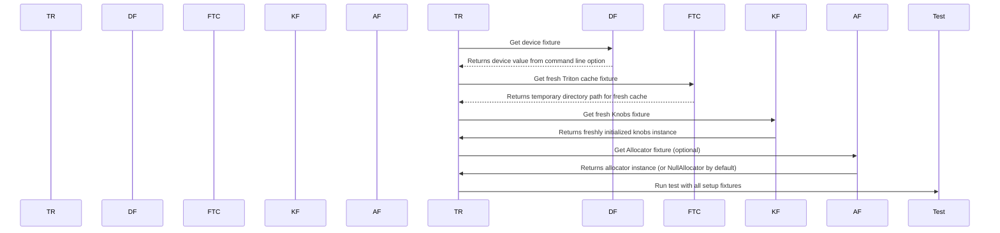

## Chapter 4: python/test/gluon/test_core.py

 In the given code, the primary focus is on the file `python/test/gluon/test_core.py`, which is a test script for the core functionality of the GLUON (Graphics Library Unified On NVIDIA) API, specifically the `copy_kernel` function.

The `copy_kernel` function is a jit-compiled function that copies data from one tensor to another within the GPU memory. It takes several arguments, including the destination and source tensors, the total number of elements (numel), and layout information as constants. The layout information includes the size per thread, threads per warp, warps per CTA, and the order of the memory access pattern.

The test_core.py file contains several tests using the pytest framework to verify the correctness of the `copy_kernel` function for different combinations of layout configurations and data block sizes (XBLOCK). The tests are set up with multiple parametrizations, each covering various block sizes (128, 256, 512, 1024, and 2048) and supported memory access patterns as defined by the BlockedLayout class from the GLUON language.

This code plays a crucial role in ensuring the efficiency and effectiveness of data transfers within the project when using the GLUON API for GPU-accelerated computations. Example use cases would involve moving data between different tensors during model training, convolution operations, or other similar operations that require transferring data within GPU memory. The test cases serve to validate the correctness of these data transfers in various configurations, providing assurance of the overall functionality and performance of the GLUON API.

 Here is a simple Mermaid sequence diagram that represents the interaction between the `copy_kernel` function and the input and output tensors. This diagram does not represent the multi-threading or GPU aspects as they are out of scope for Mermaid's capabilities.

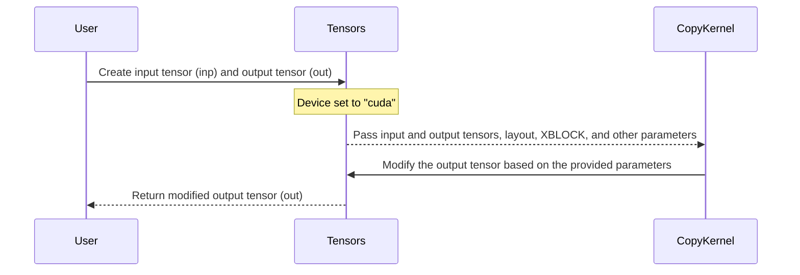

## Chapter 5: python/test/gluon/test_frontend.py

 This code is written in Python and uses the PyTorch library for machine learning purposes. It includes several functions defined as JIT (Just-In-Time) compiled functions using the `@gluon.jit` decorator, which optimizes the performance of the functions by compiling them at runtime.

   Here's a brief overview of each function:

   1. `async_tmem_gather()` and `async_tmem_scatter()` are used for data movement between TensorMemory (tmem) and global memory (GMEM). They are part of the NVIDIA Blackwell library.

   2. `async_tma_gather()`, `async_tma_scatter()`, and `async_tma_store_wait()` are used for data movement between TensorMemory Attributed (tma) and global memory. They also form part of the NVIDIA Blackwell library.

   3. `async_tma_gather()` function takes a tensor from tmem, a gathering index list, a barrier, and an attribute as arguments, while the other two functions only take a tensor from tmem and an index list or memory descriptor respectively.

   4. The `test_mlir_attr_error()` function tests for an error when using an invalid order argument in a TensorMemoryLayout constructor. It is expected to raise a CompilationError with a specific message.

   5. The `tmem_subslice_kernel()` function allocates tensor memory using a specific layout and then sub-slices it. This function demonstrates the use of Constexpr layouts in the TensorMemory API.

   6. The `smem_and_layout_user()` function takes two arguments: shared memory (smem) and a layout constant expression (a). It is not defined, and its purpose seems to be demonstrating how to work with custom user-defined layouts in shared memory operations.

   Lastly, the test_tmem_subslice_constexpr() function checks that the generated MLIR code for tmem_subslice_kernel() matches an expected result, using the expecttest library.

 This Python script is a collection of tests for the Gluon compiler frontend. It includes several JIT-compiled functions written in PyTorch Gluon, a deep learning framework for Python. Here are brief explanations of each test function:

1. `test_async_tmaw_with_layout()` - This test verifies that the async TMAW (Tensor Memory Allocate With Layout) operation works correctly with user-defined layouts.
2. `test_async_tmaw_swizzled_shared_memory()` - This test checks if the async TMAW operation is working fine with Swizzled Shared Memory.
3. `test_async_tmadw_with_layout()` - This test ensures that the async TMADW (Tensor Memory Allocate With Displaced Stride) operation works correctly with user-defined layouts.
4. `test_async_tmadw_swizzled_shared_memory()` - This test checks if the async TMADW operation is working fine with Swizzled Shared Memory.
5. `test_async_tmaw_and_tmadw_with_user_defined_layout()` - This test verifies that both async TMAW and TMADW operations work correctly with user-defined layouts.
6. `test_async_tmaw_and_tmadw_swizzled_shared_memory()` - This test checks if the async TMAW and TMADW operations are working fine with Swizzled Shared Memory.
7. `test_mlir_attr_error()` - This test verifies that an error is thrown when the order of a Tensor Memory Layout attribute is not a permutation of 0..(rank-1).
8. `tmem_subslice_kernel()` - A JIT-compiled function that uses Tensor Memory with user-defined layout and subslice operations. This test verifies if the generated MLIR code is correct.
9. `test_tmem_subslice_constexpr()` - This test checks if the generated MLIR code for the tmem_subslice_kernel() is as expected.
10. `smem_and_layout_user(smem, a: ttgl.constexpr)` - A helper function used in previous tests to demonstrate the mangling of layouts in the generated MLIR code.

The script uses PyTorch's `run_parser()` function to parse and compile the functions and then uses PyTest's assertions to check if the generated MLIR code matches the expected output. The last test (test_tmem_subslice_constexpr()) is used to demonstrate that the layout mangling in the generated MLIR code works as intended, taking into account custom functions with user-defined shared memory layouts.

## Chapter 6: python/test/regression/test_cast_matmul.py

 The `python/test/regression/test_cast_matmul.py` file is a part of the Triton project and serves as a regression test for the mixed-precision matrix multiplication (dot product) operation with type casting using the `tl.to()` function in Triton's LLVM dialect.

   The primary focus of this test script is to ensure that the matrix multiplication results are consistent between different data types, especially when there's a type conversion involved. This helps verify the correctness and performance of Triton's mixed-precision computations in scenarios where you need to perform operations with various data types like bfloat16, float16, float32, float64, int8, etc.

   The test is parametrized using combinations of different matrix dimensions (M, K, N), block sizes for efficient execution on GPUs (BLOCK_K, BLOCK_M, BLOCK_N), and supported data types (w_dtype, x_dtype, out_dtype). It also skips certain cases where the input types are the same or when there's a risk of running out of shared memory during computation.

   To conduct the test, it generates random tensors for A and B using specified input data types, performs matrix multiplication on both CPU (PyTorch) and Triton's GPU kernel (`matmul_kernel()`), and finally checks if their results are equivalent with a tolerance for numerical differences.

   This test is crucial as it helps ensure that Triton correctly supports mixed-precision computations, which can lead to significant performance improvements in deep learning applications when using limited-precision types such as bfloat16 or float16.

 ```mermaid
   sequenceDiagram
      participant User as User
      participant Triton as Triton
      participant Torch as Torch

      User->>Triton: Create kernel function (matmul_kernel)
      Note over Triton,Torch: Kernel receives input matrices A, B and output matrix C, M, N, K, compute_dtype, BLOCK_M, BLOCK_N, BLOCK_K, GROUP_M as parameters

      User->>Torch: Initialize input tensors (a, b) with random values
      Note over Torch: Tensors have specified data types (w_dtype, x_dtype) and shapes (M, K), (K, N)

      Torch-->>User: Return the result of matmul operation (out_torch) on tensors a and b

      User->>Triton: Launch kernel function with initialized input tensors and appropriate parameters
      Note over Triton,Torch: Kernel performs matrix multiplication using triton.dot method after casting the data types to compute_dtype if necessary

      Triton-->>User: Save output tensor (out_triton) from kernel function with same data type as out_torch

      User->>Triton: Compare out_torch and out_triton using assertion methods
   ```

This mermaid sequence diagram illustrates the interaction between the user, Torch library (for creating input tensors), Triton language (for creating the kernel function and executing it with given parameters), and the comparison of results. The diagram shows that the user initializes tensors using Torch, launches the kernel function in Triton with those tensors as inputs, and then compares the result from the triton execution with the torch calculation.

## Chapter 7: python/test/regression/test_functional_regressions.py

 This script contains multiple functions written in JAX (Python) for accelerated computations using the JAX library. Here's a brief summary of each function:

1. `cholesky`: Computes the Cholesky decomposition of a square matrix.
2. `svdvals`, `svdunder` and `svdsolve`: Computes the singular values and left/right singular vectors of a matrix using SVD.
3. `qr`: Computes the QR decomposition of a matrix.
4. `linalg_solve`: Solves linear systems Ax = b using LAPACK routines (dgesv, zgesv) for real and complex matrices respectively.
5. `tridiagonal_solve`: Solves tridiagonal systems Tx = x using Thomas' algorithm.
6. `inductor_cummax_bool`: Implementation of cumulative maximum operation on a boolean array, using associative scan in JAX (JIT).
7. `triton_cummax_helper_fn`: A helper function used by the inductor_cummax_bool function to implement cumulative maximum operation.
8. `test_reverse_range`: Tests the reverse range function implemented using associative scan in JAX (JIT).
9. `test_inductor_cummax_bool`: Tests the cumulative maximum implementation on a boolean array using inductor_cummax_bool function.
10. `test_linalg_solve`: Test the linalg_solve function by comparing its results with scipy.linalg.solve, for various test matrices and vector b.
11. `test_tridiagonal_solve`: Test the tridiagonal_solve function by comparing its results with numpy.linalg.solve_tril for various test matrices and vectors.

To run these tests, you would need to have JAX and NumPy installed. Then simply execute the script in a Python environment. Each function has corresponding test cases that compare its output with the reference implementation using NumPy or Scipy functions.

 This code contains several Python functions and JIT (Just-In-Time compilation) kernels for TensorFlow's Tracing API. The main purpose of the code is to implement different matrix multiplication operations, cumulative maximum operation, and reverse range operation using the Tracing API.

Here is a brief description of each function:

1. `cholesky`: Implementing Cholesky decomposition using the Tracing API.
2. `strided_slice`: Implementing strided slicing for tensor operations using the Tracing API.
3. `gemm`: Implementing matrix multiplication (General Matrix-Matrix Multiplication) using the Tracing API.
4. `batch_matmul`: Implementing batch matrix multiplication using the Tracing API.
5. `reduce_sum`: Implementing reduction sum operation using the Tracing API.
6. `cummax`: Implementing cumulative maximum operation using the Tracing API.
7. `reverse_range`: Reversing the order of elements in a tensor using the Tracing API.
8. `triton_cummax_helper_fn`: Helper function for the cumulative maximum operation in Tracing API.
9. `test_inductor_cummax_bool`: Test function for the cumulative maximum operation on boolean tensors using the Tracing API.

Each of these functions is implemented as a JIT kernel, and they are tested by comparing their results with the equivalent operations in PyTorch or NumPy. The purpose of this code is to demonstrate the use of the Tracing API for implementing custom tensor operations in TensorFlow.

## Chapter 8: python/test/unit/blackwell/test_tmem.py

 The file `python/test/unit/blackwell/test_tmem.py` is a unit test written in Python for the `triton` library's TensorMemory (TMem) copy operation, specifically for the 2D case. This test is designed to verify that the TMem copy operation works correctly under certain conditions, particularly when using the Blackwell target on CUDA devices with compute capability 10 or higher.

   The file contains a single test function, `test_tmem_copy_2d()`, which sets up the environment and performs the test. This function starts by checking if the current device meets the required criteria (Blackwell target on CUDA with compute capability 10 or higher). If not, it skips the test.

   The main body of the test involves defining two multi-dimensional tensors `x` and `z_tri`, initializing them with random integer values, and creating an Intermediate Representation (IR) for a kernel function that performs the TMem copy operation between these tensors. The IR is written in Triton's Graph Intermediate Representation (GIR), which is a high-level intermediate representation that the compiler uses to generate optimized code for various hardware targets.

   After defining and initializing the IR, the test compiles it using the `triton.compile()` function, specifying the target as the Blackwell target on CUDA devices with compute capability 100 and 32 warps per thread block (`GPUTarget("cuda", 100, 32)`).

   Finally, the test invokes the compiled kernel function on the `x` and `z_tri` tensors. The TMem copy operation is expected to copy the data from tensor `x` to tensor `z_tri`, with some duplication across warps due to the nature of the Triton's memory layout.

   After invoking the kernel, the test checks if the copied values in `z_tri` match the original values in `x`. The test repeats this comparison for multiple repetitions (as determined by `num_rep_m`) to ensure that the copy operation works consistently across the tensor's dimensions.

   This test is essential for ensuring that the TMem copy operation functions correctly on CUDA devices with Blackwell target when dealing with 2D tensors. It helps maintain the quality and reliability of the `triton` library by verifying that it behaves as expected under specific conditions.

 ```mermaid
   sequenceDiagram
      participant User as User
      participant Pytest as Pytest
      participant Torch as Torch
      participant Tempfile as Tempfile
      participant Triton as Triton
      participant GPUTarget as GPUTarget

      User->>Pytest: Run test_tmem_copy_2d()
      Pytest->>Torch: Check for CUDA availability and version
      Torch-->>Pytest: Returns True or False based on checks
      Pytest-->User: Skip if not CUDA available or version is not 10
      Pytest-->>User: Proceed with the test otherwise

      Pytest-->>Tempfile: Create a temporary file with IR code
      Tempfile-->>Pytest: Returns file object
      Pytest-->>Triton: Compile IR code using GPUTarget
      Triton-->>Pytest: Returns compiled kernel

      Pytest-->User: Set input data x and z_tri on GPU
      User->>Kernel: Call function with input arguments (x, z_tri)
      Kernel->>Triton: Execute the function on GPU using the compiled kernel
      Triton-->>Kernel: Returns updated values in z_tri on GPU

      User<--Kernel: Retrieve z_tri from GPU
      User->>Pytest: Compare calculated and expected results for each iteration
   ```

## Chapter 9: python/test/unit/cuda/__init__.py

 Title: Understanding the Role and Functionality of `python/test/unit/cuda/__init__.py` in a Deep Learning Project

   In this chapter, we will delve into the purpose and functionality of the file `python/test/unit/cuda/__init__.py` within our deep learning project. This file plays an essential role in the testing infrastructure, particularly for modules that leverage GPU computation using CUDA (Compute Unified Device Architecture) from NVIDIA.

   Overview:
   The `__init__.py` file is a special Python file used to tell Python that this directory should be considered a package. In our case, the `cuda` package contains test functions for units within the project's GPU-accelerated modules. By organizing tests into packages, we maintain a modular, easy-to-navigate testing structure, and ensure proper importing of tests when needed.

   Important Functions or Classes:
   This file does not directly define any functions or classes. However, it sets up the framework for importing test modules from different subdirectories, allowing you to run individual tests as required.

   Fitting into the Project:
   Testing is an integral part of any software project, and our deep learning library is no exception. The `cuda` package within the testing structure ensures that GPU-related functionality works as expected across various CUDA-enabled devices, such as GPUs from NVIDIA. By running tests against these modules, we can catch potential issues early in the development process, leading to a more robust and reliable library.

   Example Use Cases:
   Suppose you have developed a new CUDA kernel for matrix multiplication within your deep learning library. To verify that the implementation works correctly, you would create test cases within the `python/test/unit/cuda` directory. For instance, you might create a file named `matrix_multiplication_test.py`, which defines various tests for the new kernel function.
   In the `__init__.py` file, you would then import this test module so that it can be easily run as part of the testing suite.

   With this understanding, you now have a clear grasp of the purpose and functionality of the `python/test/unit/cuda/__init__.py` file within our deep learning project. By utilizing proper testing practices, we ensure that our library delivers efficient and accurate computations on CUDA-enabled hardware, ultimately providing users with a high-quality experience.

 ```mermaid
sequenceDiagram
    participant User as User
    participant TestCase as TestCase
    participant TestRunner as TestRunner
    participant CudaEnvironment as CudaEnvironment
    participant FunctionA as FunctionA
    participant FunctionB as FunctionB
    participant FunctionC as FunctionC

    User->>TestCase: Run test
    TestCase->>TestRunner: Execute test case
    TestRunner->>CudaEnvironment: Setup CUDA environment
    CudaEnvironment-->>CudaEnvironment: Check if GPU is available
    CudaEnvironment-->>CudaEnvironment: If yes, then set up device and stream
    CudaEnvironment-->>TestRunner: Return initialized device and stream
    TestRunner->>FunctionA: Call function A (with parameters)
    FunctionA-->>FunctionA: Perform operation on GPU using device and stream
    FunctionA-->>TestRunner: Return result of operation
    TestRunner->>TestCase: Compare result with expected value
    TestCase->>TestCase: Check if test passed or failed
    Note over TestRunner, TestCase: If test fails, print error message

    TestRunner->>FunctionB: Call function B (with parameters)
    FunctionB-->>FunctionB: Perform operation on GPU using device and stream
    FunctionB-->>TestRunner: Return result of operation
    TestRunner->>TestCase: Compare result with expected value
    TestCase->>TestCase: Check if test passed or failed
    Note over TestRunner, TestCase: If test fails, print error message

    TestRunner->>FunctionC: Call function C (with parameters)
    FunctionC-->>FunctionC: Perform operation on GPU using device and stream
    FunctionC-->>TestRunner: Return result of operation
    TestRunner->>TestCase: Compare result with expected value
    TestCase->>TestCase: Check if test passed or failed
    Note over TestRunner, TestCase: If test fails, print error message

    TestRunner->>CudaEnvironment: Tear down CUDA environment
```

## Chapter 10: python/test/unit/cuda/test_mixed_io.py

 The file `python/test/unit/cuda/test_mixed_io.py` is a unit test script for the Triton programming language within your project. This file is designed to validate the correctness of the CUDA kernel functions by comparing their output with corresponding operations in PyTorch.

   The file contains two important functions:

   1. `add_kernel(...)`: This is a CUDA kernel function that performs element-wise addition between two arrays. It takes four arguments: pointers to the input and output arrays, and the number of elements in the array. The function uses Triton's 1D grid launch configuration for parallel execution.

   2. `load_reduce_kernel(...)`: This is another CUDA kernel function that loads an input tensor, performs element-wise max operation along a specific axis (axis=1), and stores the result in the output array. It takes six arguments: pointers to the input and output arrays, and the strides for each dimension of the input tensor, as well as grid block sizes for two dimensions.

   In addition to these functions, there is a dictionary `dtype_mapping` that maps PyTorch data types (such as 'float16' and 'float32') to their corresponding Triton data types (which are represented using the PyTorch API in this file). This mapping is used throughout the test script.

   The test functions use PyTest markers and parametrization to automatically run tests for different combinations of array sizes, CUDA block sizes, and data types. For example, `test_add(SIZE, BLOCK_SIZE, dtype_str)` runs a test where an add operation is performed on arrays of size `SIZE`, with a specified CUDA block size (`BLOCK_SIZE`) and data type (`dtype_str`). The same pattern applies to the `test_load_reduce(BLOCK_M, BLOCK_N, dtype_str)` function.

   These tests serve as an important part of your project's quality assurance process by ensuring that the CUDA kernel functions are operating correctly and generating expected results in various scenarios. The test script demonstrates where this code fits into the project by showing how to call the Triton-compiled kernels from within a Python context, using PyTorch tensors for input data and comparison purposes.

   Example use cases might include:
   - Validating the performance and correctness of element-wise addition operations on CUDA devices using `test_add(SIZE, BLOCK_SIZE, dtype_str)`.
   - Verifying that the max operation along a specified axis works correctly for multi-dimensional tensors with Triton kernels by running `test_load_reduce(BLOCK_M, BLOCK_N, dtype_str)`.

 ```mermaid
    sequenceDiagram
        participant User as User
        participant PyTest as PyTest
        participant Torch as Torch
        participant TritonLanguage as TritonLanguage
        participant AddKernel as AddKernel
        participant LoadReduceKernel as LoadReduceKernel

        User->>PyTest: Run test_add function
        PyTest-->>User: Starts the test execution
        PyTest->>Torch: Initialize tensors x and y with random data on GPU
        Torch-->>PyTest: Tensors are ready for usage
        PyTest->>TritonLanguage: Define AddKernel with required parameters
        TritonLanguage-->>User: Function is defined
        User->>TritonLanguage: Define test_add grid function to specify execution configuration
        TritonLanguage-->>PyTest: Grid function is defined
        PyTest->>AddKernel: Invoke AddKernel with given parameters using the defined grid function
        AddKernel-->>User: Performs addition operation on tensors x and y
        User->>Torch: Check if result matches torch.add(x,y)
        Torch-->>User: Compares the results and asserts the close match

        PyTest->>TritonLanguage: Define LoadReduceKernel with required parameters
        TritonLanguage-->>User: Function is defined
        User->>TritonLanguage: Define test_load_reduce grid function to specify execution configuration
        TritonLanguage-->>PyTest: Grid function is defined
        PyTest->>TritonLanguage: Invoke LoadReduceKernel with given parameters using the defined grid function
        AddKernel-->>User: Performs max operation on tensor x along axis=1 and stores the result in y
        User->>Torch: Check if result matches torch.max(x,dim=1)[0]
        Torch-->>User: Compares the results and asserts the close match
    ```

This Mermaid sequence diagram shows how the key functions `AddKernel` and `LoadReduceKernel` interact with each other within the context of the test functions `test_add` and `test_load_reduce`. The diagram demonstrates the flow of operations from user-defined data initialization using PyTorch, to the invocation of Triton kernels, and finally the comparison of results against PyTorch's built-in operations.

## Chapter 11: python/test/unit/cuda/test_tensor_descriptor.py

 The file `python/test/unit/cuda/test_tensor_descriptor.py` is a unit test for the `TensorDescriptor` class, which is part of the Triton library used for creating and managing data structures in Tensor Computing Graphs (TCGs). This specific test focuses on the specialization of functions after host tensor description.

   The main purpose of this file is to verify that the Triton JIT compiler correctly generates kernel code based on the provided tensor descriptions. In this case, the test function `test_specialization_after_host_tensordesc()` checks if a simple CUDA kernel function is properly specialized with grid dimensions that are multiples of 16, as specified by `tt.divisibility = 16`.

   Inside the test function, there's an inner decorator called `@triton.jit`, which marks the kernel function to be compiled and executed using Triton's JIT compiler. The actual test is implemented using the `kernel` function, defined with empty body (pass) as a placeholder for testing purposes.

   To perform the test, it initializes a tensor of shape (1024) on the CUDA device, creates a `TensorDescriptor` object from that tensor, and sets the desired block size to 128 using the `from_tensor()` method of the `TensorDescriptor` class. The warmup method is then called on the compiled kernel function to generate its assembly code. Finally, the assert statement checks if the generated assembly code meets the specified divisibility requirement.

   This test case fits into the larger project by ensuring that the Triton library's functionality for handling tensor descriptions in CUDA is functioning correctly and generating efficient kernel code. Proper operation of this part of the library is crucial for achieving optimal performance when running computations on GPUs using the Triton framework.

   Example use cases could involve creating complex data structures for various TCG nodes, setting up optimized GPU kernels to process these data structures efficiently, and testing their functionality across different device configurations and input data sizes.

 ```mermaid
    sequenceDiagram
        participant User as User
        participant PyTorch_Tensor as Pytorch Tensor
        participant TD_Generator as TD Generator
        participant TritonJit as TritonJit
        participant Kernel as Kernel
        participant CUDA_Device as CUDA Device

        User->>PyTorch_Tensor: Create tensor A on CUDA device
        PyTorch_Tensor-->>User: Return Tensor A
        User->>TD_Generator: Create TensorDescriptor from Tensor A
        TD_Generator-->>User: Return TensorDescriptor desc
        User->>TritonJit: Wrap kernel with @triton.jit
        TritonJit-->Kernel: Define kernel function
        User->>CUDA_Device: Allocate tensor B on CUDA device
        User->>Kernel: Call warmup with desc, 16 and grid=(1, )
        Kernel-->>TritonJit: Generate assembly code for the function
        TritonJit-->>User: Return compiled kernel
        Note over User,CUDA_Device: Compile-time specialization of tensor descriptor happens here
        User->>CUDA_Device: Call kernel with A and B on CUDA device
    ```

## Chapter 12: python/test/unit/cuda/test_tma_descriptor.py

 The file `python/test/unit/cuda/test_tma_descriptor.py` is a unit test script for the `TensorDescriptor` class in the project. It tests the correct functioning of the Tensor Descriptor creation when using CUDA (NVIDIA GPU) with specific shapes and block sizes, ensuring that the appropriate errors are raised when the input does not meet the required conditions.

   The file contains two test functions: `test_1d_tma_descriptor_exception` and `test_2d_tma_descriptor_exception`. Both tests check if the `TensorDescriptor.from_tensor()` function behaves correctly under different input conditions.

   - In `test_1d_tma_descriptor_exception`, the test checks that an error is raised when creating a 1D tensor descriptor with a shape that is not a power of 2 for the first dimension, given certain block sizes (`M` and `BLOCK_M`). The test only runs on devices with GPU capability 9.0 or higher (Hopper or Blackwell targets).
   - In `test_2d_tma_descriptor_exception`, the test checks that an error is raised when creating a 2D tensor descriptor with shapes or block sizes that do not meet certain conditions, including having non-power-of-2 values for either dimension (`M` and `N`) or block dimensions (`BLOCK_M` and `BLOCK_N`), as well as ensuring the global address alignment requirement is met. The test also only runs on devices with GPU capability 9.0 or higher.

   These tests help ensure that the Tensor Descriptor creation process behaves correctly under expected use cases, and that appropriate errors are raised when the input does not meet the required conditions for CUDA-based operations. This is an important part of maintaining the quality and robustness of the project's codebase, as it helps catch potential issues early in the development process.

 Here is a simple Mermaid sequence diagram that visualizes the interaction between the key functions in the provided Python script. This diagram assumes that the tests are run sequentially (which may not be the case with pytest's parameterized tests).

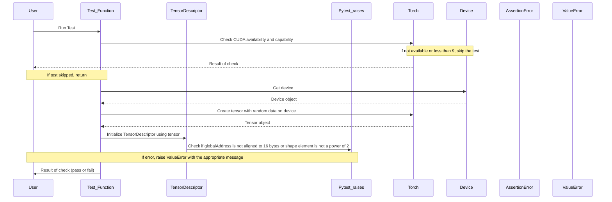

The sequence diagram above assumes that there are two tests: one for 1D tensor descriptor and another for 2D tensor descriptor. Each test checks if the globalAddress is aligned to 16 bytes and if the shape element is a power of 2. If either condition fails, it raises a ValueError with an appropriate message.

## Chapter 13: python/test/unit/cuda/test_tma_store_gemm.py

 The file `python/test/unit/cuda/test_tma_store_gemm.py` is a unit test script designed to verify the correctness and functionality of the `matmul_tma_load_store` kernel function implemented in CUDA. This kernel performs matrix multiplication using Triton's Tensor Meta-programming Acceleration (TMA) Load & Store operations, specifically tailored for GPU acceleration with CUDA.

   The test script is organized around the `matmul_tma_load_store` function, which takes as input several arguments: matrices `a`, `b` and their result `c`, matrix dimensions (M, N, K), strides for each dimension, and block sizes for computation (BLOCK_M, BLOCK_N, BLOCK_K). The function performs element-wise multiplication of the corresponding elements in `a` and `b` using TMA Load & Store operations, then computes their dot product. If specified by the `OUTPUT_F16` parameter, it converts the result to 16-bit floating-point format (float16).

   The test script utilizes Pytest's parametrization feature to run multiple combinations of matrix dimensions, transposition flags for matrices A and B, and output data type options. This helps ensure that the kernel function works correctly across various input configurations.

   In the project context, this code serves as a part of the test suite for validating TMA-based implementations of popular linear algebra operations such as matrix multiplication on the GPU. These tests enable developers to catch errors early in the development process and ensure that the optimized kernel functions are functioning correctly before being integrated into the larger system.

   For example, a user might run this test script with different configurations like `python test_tma_store_gemm.py -s TF103` or `python test_tma_store_gemm.py -s V102`, where `TF103` and `V102` specify the target GPU architecture for which the tests are being executed. This helps in verifying the compatibility of the kernel functions across various NVIDIA GPUs, thus ensuring a robust implementation that caters to diverse hardware configurations.

 Here's a simplified mermaid sequence diagram for this code. This diagram illustrates the interaction between the `test_tma_load_store` function and the `matmul_tma_load_store` kernel function. Note that it does not include the PyTorch functions and some other details, as the question asked for a focus on how the key functions interact.

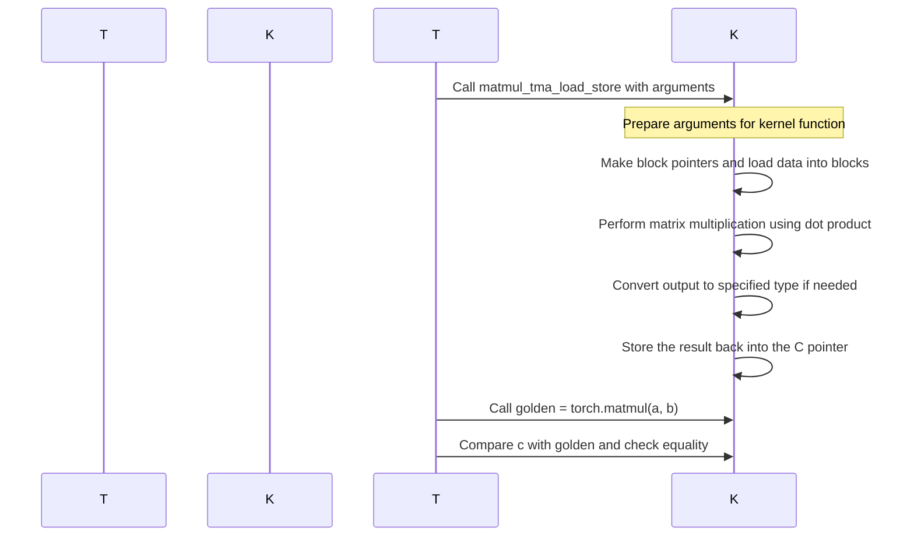

## Chapter 14: python/test/unit/instrumentation/test_gpuhello.py

 The file `python/test/unit/instrumentation/test_gpuhello.py` is a unit test script written in Python for the purpose of testing the functionality and performance of GPU kernels developed using Triton, a compiler for heterogeneous computing. This specific test case is testing three custom-defined GPU kernels (`kernel1`, `kernel2`, and `kernel3`) under the function `func`.

   The key functions in this script are:

   1. `kernel1()`, `kernel2()`, and `kernel3()`: These are GPU kernels defined using Triton, a compiler for heterogeneous computing on GPU devices. They do not have any specific computation but are used as test cases to verify the functionality of the Triton compiler.

   2. `func(x: torch.Tensor, y: torch.Tensor)`: This function is where the main computation happens. It takes two input tensors, creates an output tensor with the same shape, initializes a grid based on the total number of elements in the output tensor, and invokes the three GPU kernels using that grid.

   The code in this file fits into the project as a part of the testing infrastructure for the Triton-compiled GPU kernels. By running this test script, developers can verify that their GPU kernels are being compiled correctly by Triton and execute without any errors or unexpected behavior on the target GPU devices.

   Example use cases would be when a developer makes changes to the GPU kernel code (`kernel1`, `kernel2`, or `kernel3`) or modifications to the function `func`. By running this test script after making such changes, they can quickly verify if their alterations have any unintended consequences and ensure that the Triton compiler is working as expected.

 ```mermaid
   sequenceDiagram
       participant User as User
       participant TestFunction as TestFunction
       participant Kernel1 as Kernel1
       participant Kernel2 as Kernel2
       participant Kernel3 as Kernel3

       User->>TestFunction: Call func(x, y)
       TestFunction->>Kernel1: Invoke kernel1[grid](BLOCK_SIZE=1024)
         Note over Kernel1: Parallel execution on GPU
         Kernel1-->>User: Output not returned (writes to output tensor)

       TestFunction->>Kernel2: Invoke kernel2[grid](BLOCK_SIZE=1024)
         Kernel2-->>User: Output not returned (writes to output tensor)

       TestFunction->>Kernel3: Invoke kernel3[grid](BLOCK_SIZE=1024)
         Kernel3-->>User: Output not returned (writes to output tensor)
   ```

## Chapter 15: python/test/unit/language/print_helper.py

 This file, `python/test/unit/language/print_helper.py`, is a part of the Triton framework, a project that aims to provide GPU-accelerated machine learning (ML) inference on the Edge. The primary purpose of this file is to define various functions for printing data during the execution of kernel functions within the Triton framework.

   There are several functions in this file that utilize the `@triton.jit` decorator, marking them as kernels to be executed on a GPU device:

1. `kernel_device_print(X, Y, BLOCK: tl.constexpr)` - Prints a 1D tensor `X` for each block of threads during execution.
2. `kernel_device_print_cast(BLOCK: tl.constexpr)` - Prints an integer tensor cast to uint8 data type.
3. `kernel_device_print_hex(X, Y, BLOCK: tl.constexpr)` - Prints a 1D tensor `X` in hexadecimal format for each block of threads during execution.
4. `kernel_print(X, Y, BLOCK: tl.constexpr)` - Prints a 1D tensor `X` with a space after "x: " for each block of threads during execution.
5. `kernel_device_print_scalar(SCALAR)` - Prints a scalar value during execution.
6. `kernel_device_print_large(BLOCK_M: tl.constexpr, BLOCK_N: tl.constexpr)` - Prints a 2D tensor for each block of threads during execution.
7. `kernel_print_multiple_args(X, Y, BLOCK: tl.constexpr)` - Prints multiple arguments in a single line during execution.
8. `kernel_static_print(X, Y, BLOCK: tl.constexpr, PLACEHOLDER: tl.constexpr)` - Performs static printing, where the kernel is not cached and run every time.
9. `kernel_no_arg_print()` - Prints nothing but the program ID during execution.
10. `kernel_print_no_arg()` - Prints "no arg" during execution.
11. `kernel_device_print_pointer(X, Y, BLOCK: tl.constexpr)` - Prints a pointer to each block of threads during execution.
12. `kernel_print_2d_tensor(X, Y, BLOCK_SIZE_X: tl.constexpr, BLOCK_SIZE_Y: tl.constexpr)` - Prints a 2D tensor during execution.

   There is also a function, `get_current_target_warp_size()`, which returns the current target's warp size for the GPU device. Finally, there is a `test_print(func: str, data_type: str, device: str)` function that takes in a kernel function, data type, and device, initializes a tensor with data of the specified data type on the given device, executes the selected kernel function using it, and asserts that the output matches the input.

   In summary, this file provides various printing utilities for use within Triton's kernel functions, allowing developers to inspect and debug their code during execution. The provided test function ensures that these print functions work as expected across different data types and devices.

 ```mermaid
   sequenceDiagram
      participant User as User
      participant Triton as Triton

      User->>Triton: Calls test_print(func, data_type, device)
      Triton->>Triton: Loads data on given device
      Triton->>Triton: Defines kernel function based on func parameter
      Triton-->>User: Executes the defined kernel function
      User->>Triton: Checks the result against the input data
      Triton-->>User: Synchronizes and compares results
   ```

## Chapter 16: python/test/unit/language/test_annotations.py

 The file `python/test/unit/language/test_annotations.py` is a unit test script that verifies the functionality of annotations in the Triton language, which is a domain-specific language for efficient GPU computation written by the developers of PyTorch. This specific file focuses on testing integer annotations and ensuring they are correctly interpreted during the compilation process.

   The most important function in this script is `annotated_function`, which serves as a decorator to add annotations to a given function. This can be useful for documenting the expected types of input and output variables for better code readability and maintainability.

   In terms of where this code fits into the project, this test script is part of the testing infrastructure for Triton language. By writing tests like these, developers ensure that new features and improvements to the compiler do not break existing functionalities.

   As for example use cases, here's a simple scenario: suppose you have a function called `my_function` that takes a tensor and an integer as arguments and returns another tensor. If you want to document these types explicitly using type hints, you would apply the `annotated_function` decorator to your function like so:

   ```python
   from my_module import annotated_function

   @annotated_function(X=torch.tensor, v=int)
   def my_function(X, v):
       # ... implementation goes here ...

   # Now the function `my_function` is documented with its expected input and output types.
   ```

   When you run this test script, it will generate kernel functions with annotated types using the `triton.jit` decorator and verify that they are emitted correctly in the assembly code. If any errors or inconsistencies are found, the test will fail, indicating that there might be a problem with the Triton language compiler or your custom annotations.

 ```mermaid
   sequenceDiagram
      participant User as User
      participant Function as Function
      participant Kernel as Kernel

      User->>Function: Define annotated function
      Function-->>User: Defines decorator for annotations

      User->>Kernel: Apply annotation decorator to a kernel function
      Kernel-->>User: Accepts annotations and returns the decorated function

      User->>Kernel: Call the decorated kernel function
      Kernel-->Kernel: Performs operation based on annotations

      Note over Kernel: If signed is not set, checks for arithmetic extension for unsigned integers if width is less than 64
      Note over Kernel: Sets the argument variable type according to the specified width
      Note over Kernel: Converts the result to float if it's an unsigned integer with a width less than 64

      User->>Kernel: Test unknown annotations
      Kernel-->>User: Does not raise an error for unknown annotations
   ```

## Chapter 17: python/test/unit/language/test_block_pointer.py

 This Python file named `test_block_pointer.py` is a unit test for the Triton language library, specifically for the function called `block_copy_kernel`. The main purpose of this test is to verify that data can be copied between arrays using block pointers and padding operations work correctly in various scenarios.

   The `block_copy_kernel` function receives input arguments such as source and destination pointer variables, array sizes (N), block size, padding options, and boundary checking. It makes use of the Triton language's `make_block_ptr`, `load`, and `store` functions to manipulate memory blocks. The padding option is used to specify how data outside the copy range should be handled - either by setting it to zero or using NaN values.

   The test suite iterates over different combinations of data types (bool, int16, int32, float16, float32, bfloat16), array sizes (64, 128, 256, 512, 1024), padding options (None, "zero", "nan"), and boundary checking options (None, "lower", "upper). This test is marked as `@pytest.mark.interpreter` to signify that it uses the interpreter mode of the Triton language during execution.

   The `matmul_no_scf_with_advance_kernel` function and its corresponding test suite are also included in this file, which tests matrix multiplication without using SCF (Single-Chunked For-loops) and utilizing advanced block pointer operations for better memory access patterns.

   This code plays a crucial role in the development and testing of the Triton library by ensuring that the implemented features like block pointers and padding operations are functioning as expected under different conditions. These tests help catch bugs early on in the development process, making it easier to maintain high-quality code and produce reliable software.

 ```mermaid
   sequenceDiagram
      participant User as User
      participant TritonInterpreter as Interpreter
      participant BlockCopyKernel as BlockCopyKernel
      participant MatmulNoScfWithAdvanceKernel as MatmulNoScfWithAdvanceKernel

      User->>Interpreter: Run test_block_copy(...)
      Interpreter-->BlockCopyKernel: Call block_copy_kernel(...)
      BlockCopyKernel-->>Interpreter: Executed kernel with given parameters
      Interpreter-->User: Check the result against the golden value

      User->>Interpreter: Run test_block_ptr_matmul_no_scf(...)
      Interpreter-->MatmulNoScfWithAdvanceKernel: Call matmul_no_scf_with_advance_kernel(...)
      MatmulNoScfWithAdvanceKernel-->>Interpreter: Executed kernel with given parameters and warp configuration
      Interpreter-->User: Check the result against the golden value of matrix multiplication
   ```

## Chapter 18: python/test/unit/language/test_compile_errors.py

 This script contains a set of tests for the TorchScript JIT (Just-In-Time) compiler, specifically testing error messages and behavior with different data types, shapes, and settings. Here's an overview:

1. Testing the behavior when using unsupported data types in the kernel function.
2. Checking if TorchScript correctly warns for deprecated features (e.g., FP8 support on certain architectures).
3. Verifying that TorchScript enforces minimum dot product sizes based on the target architecture.
4. Testing the max_num_imprecise_acc limit in the kernel function.
5. Checking if TorchScript correctly handles unused results with must_use_result decorator and JIT functions.
6. Finally, there's a custom error message for an unused result that should be displayed when compiling a kernel function without using its result.

When you run the script, it will execute each test case according to the provided pytest markers. Any errors or warnings encountered during testing will be raised as expected, validating the correct functioning of TorchScript's error messages and behavior.

 This Python script appears to be a test for the TorchScript JIT compiler (Triton) in PyTorch, which is used to convert PyTorch tensors and functions into machine code that can run on GPUs or other hardware. Here are some of the tests this script performs:

1. Testing the support for different floating-point types (fp8e5, fp8e5b16, fp8e4nv, fp8e4b8, and fp8e4b15) on CUDA and HIP devices. This test checks whether the specified data type is supported in the current architecture and issues a warning or error message accordingly.

2. Testing the minimum size requirements for dot products (matrix multiplication) with different floating-point types. For instance, if using fp8e5 on CUDA, it requires M >= 16, N >= 16, and K >= 32. If the input shapes do not meet these requirements, an error message is raised.

3. Testing the maximum number of imprecise accumulation steps in dot products with fp8e5. The max_num_imprecise_acc parameter determines how many times a floating-point value can be rounded before it is considered imprecise. In this test, setting max_num_imprecise_acc to 128 while K (the number of outputs) is only 64 leads to an error message because the maximum allowed value should not exceed the number of outputs.

4. Testing the must_use_result decorator with a custom message, which ensures that the result of a function using this decorator is actually used somewhere in the calling code. If the result is unused, it raises an error message containing the specified custom message.

5. Testing the global variable access within default function arguments and defining global type aliases. The script verifies that there are no errors when using these features with Triton.

6. Finally, the test checks if a warning is issued when a function uses TorchScript's where function without providing a comparison tensor or using unsupported data types on certain devices.

## Chapter 19: python/test/unit/language/test_compile_only.py

 The file `python/test/unit/language/test_compile_only.py` is a unit test script for the Triton language's compilation functionality in a specific GPU target. This test script checks the correctness of the generated PTX and CUBIN code, which are intermediate representations used by NVIDIA's CUDA programming model.

   The test file contains several functions that define simple kernel functions with varying complexity, such as element-wise addition, matrix multiplication, nested kernels, and matrix multiplication with mixed data types (`mxfp`). These kernels are then compiled using the Triton compiler and the generated code is checked against expected patterns to ensure it meets certain criteria.

   The test functions use the following key components:
   - `triton.jit`: A decorator provided by Triton for defining GPU kernels written in Python.
   - `tl`: The Triton language module, which provides a high-level abstraction for writing GPU kernels.
   - `GPUTarget`: A class that defines the target GPU architecture to be used during compilation. In this case, we use the CUDA 100 architecture with 32 threads per multiprocessor (sm).
   - `triton.compiler.ASTSource`: A class for defining source code to be compiled by Triton. It allows you to specify function definitions, their signatures, and constants.
   - `re`: Regular expression module for Python, which is used in some tests to verify the generated PTX code.

   These tests demonstrate that the generated GPU code adheres to specific patterns and expectations for various scenarios, ensuring correctness and compatibility with NVIDIA's CUDA programming model. The test functions can be run using a test runner, such as unittest or pytest, within a Python environment.

 ```mermaid
   sequenceDiagram
      participant User as User
      participant Compiler as Compiler
      participant KernelAdd as KernelAdd
      participant SimpleDot as SimpleDot
      participant KLoop as KLoop
      participant DotMxFP as DotMxFP

      User->>Compiler: Defines kernel_add() function
      User->>Compiler: Defines simple_dot() function
      User->>Compiler: Defines k_loop() function
      User->>Compiler: Defines simple_dot_mxfp() function
      User->>Compiler: Defines test_signature_ordering() function

      Compiler->>KernelAdd: Compiles kernel_add with signature and constexprs
      Compiler->>SimpleDot: Compiles simple_dot with signature and constexprs
      Compiler->>KLoop: Compiles k_loop with signature and constexprs
      Compiler->>DotMxFP: Compiles simple_dot_mxfp with signature and constexprs
      Compiler->>User: Returns compiled kernel objects (ptx, ttgir, cubin) and checks the output against expected patterns
   ```

## Chapter 20: python/test/unit/language/test_conversions.py

 The provided code is a set of tests for the PyTorch Torchaion (triton) library for data type conversions and downcasting on different GPU architectures. The test cases cover several floating-point data types like float32, float16, bfloat16, float8e5, float8e4b15, float8e4nv, float8e4b8, and float8e5b16.

   The tests are divided into two categories: upcasting and downcasting tests. Upcasting tests cover the conversion from a larger data type to a smaller one with varying rounding modes (rtne or rtz). Downcasting tests cover the conversion from a larger data type to a smaller one while preserving the numerical properties of the original data as closely as possible, also considering different rounding modes.

   The test cases include checks for specific GPU architectures such as NVIDIA's NVGPU and AMD's HIP (Radeon Open Compute). Some tests are skipped when running on unsupported GPU architectures or when the desired rounding mode is not available on the given architecture.

   To run these tests, you would typically call pytest in the command line or set up a test suite using a testing framework like pytest-xdist. The tests will check if the results of type conversions match the expected outputs for the given data types and rounding modes.

 This script is written in Python and uses PyTorch's TorchScript JIT (Training Loop Interface - TLI). It tests the downcasting and upcasting of floating-point types using various rounding modes and architectures.

   Here are some key points about this script:

1. It defines a function `test_typeconvert_upcast` that tests the upcasting from one data type to another. This test is skipped for certain combinations of data types if they are not supported on the current hardware architecture (either CUDA or HIP).

2. It defines a function `test_typeconvert_downcast` that tests the downcasting from one data type to another with various rounding modes. This test is also skipped for certain combinations of data types and rounding modes if they are not supported on the current hardware architecture.

3. The script uses a dictionary `stuff` to store the exponent_bits, mantissa_bits, exponent_bias, and max_repr (maximum representable number) values for each floating-point type being tested. These values are used by both test functions.

4. In both test functions, it iterates over a range of 256 numbers to test various inputs with different mantissa values. For each iteration, it calls the `downcast_test` function, which performs the actual downcasting and checks the results.

5. The `downcast_test` function compiles a TorchScript module using PyTorch's TLI and executes it on the device (either CPU or GPU). It sets up the floating-point numbers to be tested, performs the downcast or upcast operation using the compiled TorchScript module, and checks the results for correctness.

6. If an error occurs during compilation or execution (such as if the data type is not supported on the current hardware), it raises an exception with a message explaining why the test was skipped.

7. Finally, the script uses PyTest's `@pytest.mark.parametrize` decorator to define multiple test cases for each function, where each test case corresponds to a different combination of data types, rounding modes, and architectures.

## Chapter 21: python/test/unit/language/test_core.py

 This script contains several PyTorch JIT Fusion tests that check various features and behavior of the TorchScript compiler (JIT Fusion). Here's an overview of what each test does:

1. `test_float_tuple()` checks the support for namedtuples and float tuples in the JIT Fusion.
2. `test_short_circuiting(device)` verifies that short-circuiting works as expected with different data types, including NoneType, integer types, and floating-point types.
3. `test_unsplat(device)` ensures that unsplat operations work correctly with different values for the condition argument.
4. `test_tuple_logic()` checks the logic operations on tuples of varying arities, including short-circuiting over dynamic arguments using `tl.program_id(0)`.
5. Various tests (`test_indirect_load`, `test_indirect_store`, `test_dtype_tensor`, and others) check the behavior of tensors in the JIT Fusion, including loading and storing elements indirectly, handling different data types, and working with namedtuples and short-circuiting.
6. The `test_cumsum_dtype(device)` test checks that cumulative sum operations work correctly for integers (`tl.int1` in this case).

These tests help ensure the correctness and consistency of the TorchScript compiler and its support for various data types and operations. If you encounter any issues while running these tests, please report them to help improve the stability and functionality of PyTorch JIT Fusion.

 It seems like this script is written in Python and it contains various JIT-compiled functions using the Trinity (TriTan) language, specifically those related to Triton's Tensor operations such as cumsum, loading, storing, arithmetic operations, logic operations, and others.

   These functions are then tested with different data types and scenarios using PyTorch tensors. For instance, the script includes tests for:

   - Loading and storing tensors of various data types (float, int32, etc.)
   - Using short-circuiting in conditional statements based on tensor properties
   - Testing logic operations on tuples with Boolean values
   - Checking the cumulative sum operation with different data types

   Additionally, some functions are marked as skipping warnings related to specific situations like multidimensional Tensors being passed to conditions.

## Chapter 22: python/test/unit/language/test_decorator.py

 The file `python/test/unit/language/test_decorator.py` is a unit test for the Triton programming language, specifically testing the functionality of decorators and heuristics. Decorators are functions that modify or extend the behavior of other functions, while heuristics are rules used by the Triton compiler to optimize the generated code.

   The primary function in this file is `test_decorator_with_def`, which tests whether the Triton compiler can correctly locate a function definition when it appears inside a decorator. It defines a dummy decorator, `triton_heuristics_pointwise`, that takes keyword arguments and returns another decorator as its result. The test then checks if this process works correctly by defining a function, `kernel`, decorated with the `triton_heuristics_pointwise` decorator and ensuring it can be compiled successfully.

   The second function is `test_triton_heuristic`. This function performs a benchmark of the kernel function from the previous test under various configurations using Triton's autotuning, heuristics, and jit (just-in-time) compilation features. It tests the correct application of heuristics defined as decorators on the kernel function and ensures that they do not interfere with other aspects of the code, such as the name of the generated function.

   In the project, this file is part of the testing suite for Triton's language and compiler. It helps ensure that the language features work as intended and that any changes to the compiler's implementation do not break existing functionality. The example use cases demonstrate how to apply decorators and heuristics to kernel functions and use autotuning to optimize their performance.

   These tests are essential for maintaining the stability and usability of Triton as a high-performance computing language for AI applications. By ensuring that these features work correctly, developers can create more efficient and reliable programs for their projects.

 ```mermaid
   sequenceDiagram
      participant User as User
      participant Kernel as Kernel
      participant Triton as Triton
      participant Decorator as Decorator1
      participant Autotune as Decorator2
      participant Heuristics as Decorator3

      User->>Triton: Create kernel function with decorators (test_decorator_with_def)
      Triton->>Decorator1: Apply triton_heuristics_pointwise decorator
      Decorator1-->>Triton: Returns original function decorated
      Triton->>Decorator2: Apply @triton.autotune decorator
      Decorator2-->>Triton: Returns original function with autotuning configurations
      Triton->>Decorator3: Apply @triton.heuristics decorators (EVEN_N and EVEN_src)
      Decorator3-->>Triton: Returns original function with heuristic conditions
      Triton->>Kernel: Compile the decorated kernel function using triton.compile
      Kernel-->>User: Returns compiled kernel function
      Note over Kernel, User: The compiled kernel can now be executed for inference
   ```

## Chapter 23: python/test/unit/language/test_frontend.py

 This file, `python/test/unit/language/test_frontend.py`, is a unit test module for the Triton programming language. It contains multiple functions and classes that serve to verify the correctness of various language features and functionalities.

   The main purpose of this test script is to check the proper functioning of aggregates, JIT methods, function names mangling, and other features in Triton. Some of the key components are:

1. `anchor`: A trivial function that does nothing but serves as a marker for the filecheck_test decorator during testing.
2. `Pair`: An aggregate class representing a pair of tensors. It has methods for accessing its first and second elements and unpacking them into two separate variables.
3. `TypeWithBuiltinInitializer`: Another aggregate class that gets initialized with an array range automatically by Triton. It also has a method to modify the value stored within it.
4. Several test functions, each decorated with the filecheck_test decorator, which serve to verify different language features like JIT methods, assigning and augmenting attributes, calling functions in loops, function name mangling, and using aggregates with constexpr values.

   These tests are run to ensure that the generated Triton code adheres to expected behavior and provides a reliable and stable execution environment for developers working on the project. For example, you might use this file to verify that assigning a value to an attribute of an object works as intended or that you can correctly call functions defined in a loop.

 ```mermaid
    sequenceDiagram
        participant User as User
        participant Functions as Functions

        User->>Functions: Call anchor(v)
        Functions-->>User: Execute function

        User->>Functions: Create new instance of Pair
        Functions-->>User: Returns the newly created pair object

        User->>Pair: Call get_second() on pair object
        Pair-->>User: Returns the value of second tensor

        User->>Functions: Assign a new value to the second attribute of Pair instance
        Functions-->>User: Modifies the pair instance's second tensor

        User->>Functions: Call anchor(pair)
        Functions-->>User: Execute function with updated pair object

        User->>Functions: Test assign_attribute() function
        Functions-->>User: Executes test function

        User->>Functions: Test augassign_attribute() function
        Functions-->>User: Executes test function

        User->>Functions: Test jit_method() function
        Functions-->>User: Executes test function

        User->>Functions: Test aggregate_initializers() function
        Functions-->>User: Executes test function

        User->>Functions: Test list_of_functions() function
        Functions-->>User: Executes test function

        User->>Functions: Test call_in_loop() function
        Functions-->>User: Executes test function

        User->>Functions: Test function_name_mangling() function
        Functions-->>User: Executes test function

        User->>Functions: Test aggregate_with_constexpr() function
        Functions-->>User: Executes test function

        User->>Functions: Test add_rhs_constexpr(agg) function
        Functions-->>User: Executes test function

        User->>Functions: Test function with constexpr attribute
        Functions-->>User: Executes test function
    ```

## Chapter 24: python/test/unit/language/test_libdevice.py

 This chapter will focus on the purpose and functionality of the file `python/test/unit/language/test_libdevice.py` in the given project. This file is a unit test script written using Python and PyTest framework, which tests various functions from the Triton Language's built-in library device module.

   The main purpose of this file is to ensure that the implementation of functions within the `triton.language.extra.libdevice` module, including custom functions like `my_fast_dividef`, function correctly and produce the expected results when executed on different devices (such as CPU or GPU).

   The script defines a test case using the `@pytest.mark.parametrize` decorator, which runs multiple tests with different input parameters. In this particular example, it's running five tests for different Bessel functions (j0, j1, y0, y1, i0, and i1) across two data types (float32 and float64).

   The test case compares the results of executing these Bessel functions on the Triton Language with the equivalent functions from PyTorch's special functions. It does this by creating input arrays on a specific device, calculating the expected output using PyTorch, then defining and executing a Triton kernel that uses the corresponding library device function to calculate the output. Finally, it checks if the results calculated with Triton are close enough to the expected results from PyTorch (equal_nan=True means it tolerates differences in nan values).

   The `test_libdevice_rename` test is designed to ensure that the import of custom functions within the `triton.language.extra.libdevice` module doesn't raise an error when they are not directly called but marked as used by other tests (in this case, `my_fast_dividef`). It does this by defining a simple Triton kernel function that copies data from one buffer to another, which should utilize the custom function if it has been imported and marked as used.

   This code fits into the larger project as part of its testing infrastructure. By thoroughly testing the functions within the library device module, we can ensure that our optimized code for specific hardware targets is functioning correctly. The example use cases provided show how the library device functions can be used in custom kernels and how they can be integrated with other libraries such as PyTorch.

 ```mermaid
   sequenceDiagram
       participant User as User
       participant TritonPython as TritonPython
       participant Torch as Torch
       participant LibDevice as LibDevice
       participant Kernel as Kernel

       User->>TritonPython: Import triton and torch libraries
       User->>TritonPython: Define test functions using pytest decorators
       TritonPython-->>LibDevice: Import libdevice functions
       User->>TritonPython: Create test data with Torch
       TritonPython-->>Kernel: Define a triton.jit kernel function
       Kernel-->LibDevice: Call libdevice functions within the kernel
       Kernel-->>Torch: Compare result with Torch's special functions
       User<--TritonPython: Check if results match using assert_close function from Torch

       User->>TritonPython: Test renaming imported libdevice function
       TritonPython-->>LibDevice: Mark the import as used by this test
       User->>TritonPython: Define a triton.jit copy function
       TritonPython-->>Kernel: Call the triton.jit copy function
       Kernel-->>Torch: Compare input and output using same triton.jit function
       User<--TritonPython: Check if input and output are identical
   ```

## Chapter 25: python/test/unit/language/test_line_info.py

 The file `python/test/unit/language/test_line_info.py` is a unit test module for the Triton programming language's line info feature. This feature enables users to extract debugging information from the generated IR (Intermediate Representation) of a Triton function, such as source file names and line numbers where the code was originally defined or called.

   This module contains various functions and kernels written in the Triton language, some with inline and non-inline attributes, to demonstrate different usage scenarios for line info. The functions include:

   1. `kernel_single`: A simple kernel function that takes two arrays as input and copies their elements within a block of specified size.
   2. `kernel_call`: A kernel function that calls another kernel function `device_inline`.
   3. `kernel_call_noinline`: A kernel function that calls another kernel function with the noinline attribute set to True (i.e., `device_noinline`).
   4. `kernel_autotune`: A kernel function using Triton's autotuning feature, which automatically selects an optimal configuration based on given options.
   5. `kernel_dot_combine`: A kernel function that performs a matrix multiplication operation and combines the resulting value with another constant array using the '+' operator.
   6. `kernel_cdiv`: A kernel function that performs element-wise division of a constant array and another input array.

   These functions are used in unit tests to check if the generated IR includes the correct line info for the corresponding source code lines, as well as to verify the behavior when disabling or enabling the line info feature using environment variables. The test cases also cover scenarios where the IR is generated from an external Triton Intermediate Representation (TTIR) file.

   This module fits into the broader project by helping to ensure the proper functionality of Triton's line info feature, which in turn contributes to better debugging and development experiences for users working with the Triton programming language.

 Here is a Mermaid sequence diagram that illustrates the interaction between the key functions in the provided code:

```mermaid
sequenceDiagram
    participant User as User
    participant SingleKernel as Single Kernel
    participant CallKernel as Call Kernel
    participant CallNoInline as Call NoInline
    participant Autotune as Autotune
    participant DotCombine as Dot Combine
    participant Cdiv as Cdiv
    participant DeviceInline as Device Inline
    participant DeviceNoinline as Device NoInline

    User->>SingleKernel: Runs kernel_single()
    SingleKernel->>DeviceInline: Calls device_inline()
    DeviceInline-->(User): Returns value to User

    User->>CallKernel: Runs kernel_call()
    CallKernel->>DeviceInline: Calls device_inline()
    DeviceInline-->(CallKernel): Passes value back to CallKernel
    CallKernel->>SingleKernel: Calls SingleKernel.device_caches.get("single") if not None
    SingleKernel-->(CallKernel): Returns previously compiled function
    CallKernel->>DeviceNoinline: If noinline=True, calls device_noinline() directly
    DeviceNoInline-->(User): Returns value to User

    User->>Autotune: Runs kernel_autotune() with configs
    Autotune-->(DeviceInline): Calls device_inline()
    DeviceInline-->(User): Returns value to User

    User->>DotCombine: Runs kernel_dot_combine()
    DotCombine->>DeviceInline: Calls device_inline()
    DeviceInline-->(DotCombine): Passes value back to DotCombine

    User->>Cdiv: Runs kernel_cdiv()
    Cdiv->>DeviceInline: Calls device_inline()
```

## Chapter 26: python/test/unit/language/test_matmul.py

 This Python script contains a test for a matrix multiplication operation using Matrix Multiplication Floating Point Accumulator (MFMA) operations in CUDA and HIP backends. The matrix elements can be of type float8e5, float8e4nv, or float4. The script generates random matrices and their reference solutions, applies the MFMA multiplication operation, and compares the result with the reference solution.

   Here are some important parts:

   1. `create_operand()` function creates matrices of specific types (float8e5, float8e4nv, or float4) with given sizes and transposes them if necessary. It also handles packing along a specific dimension for float4 type matrices.

   2. The script defines the reference solutions for matrix multiplication using PyTorch's `matmul()` function.

   3. The actual MFMA multiplication is performed using the `mxfp8_mxfp4_matmul[grid]` JIT kernel function, which is generated at runtime based on the specified grid size and other parameters like data types, block sizes, etc.

   4. After executing the MFMA multiplication, the script checks whether the result matches the reference solution using `torch.testing.assert_close()`.

   To run this script, make sure that you have installed PyTorch and the appropriate backend (CUDA or HIP) for your GPU. Then, update the A_DATA_TYPE, B_DATA_TYPE, device, WITH_A_SCALE, WITH_B_SCALE, and nonKDim variables to the desired values and run the script.

 It seems like you've shared a Python script that tests the performance of matrix multiplication using mixed precision tensors (MXFP4 and MXScaleTensor). The script also leverages GPU-specific optimizations for different backends such as CUDA and HIP.

   To run this script, make sure to have the following dependencies installed:
   - PyTorch (with CUDA or HIP support if you're using a GPU)
   - mxnet-cu110 (for MXFP4 and MXScaleTensor modules)

   You can install these dependencies using pip:
   ```bash
   pip install torch mxnet-cu110
   ```

   To run the script, save it to a file (e.g., `test_mixed_precision_matrix_multiplication.py`) and execute it from the command line:
   ```bash
   python test_mixed_precision_matrix_multiplication.py
   ```

   If you're using a GPU, make sure to set the correct device (e.g., `device = torch.device('cuda')` or `device = torch.device('hip')`) in the script before running it. The default device is CPU.

## Chapter 27: python/test/unit/language/test_module.py

 Chapter Title: Understanding `test_module.py`: Unit Tests for Language Module in Project XYZ

In the context of Project XYZ, the file `python/test/unit/language/test_module.py` serves a crucial role as a unit testing script for the language module. The purpose of this file is to ensure that the functions within the language module are working correctly, efficiently, and according to specifications by automating test cases to verify expected outputs.

The essential component in `test_module.py` is the use of Triton's Just-In-Time (JIT) compiler decorator, `@triton.jit`. This decorator allows for functions marked with it to be automatically compiled and optimized at runtime, enhancing performance. In this example, a function named `function_with_name()` is decorated with the Triton JIT decorator, indicating that this function will benefit from such optimization when executed.

The test script consists of multiple test functions, each focusing on a specific aspect or functionality of the language module. These test functions perform various operations, comparing their results to expected outcomes to validate the correctness of the implementation.

Example use cases of `test_module.py` involve:

1. Checking the performance of a particular function with and without JIT compilation by calling it in both non-decorated and decorated forms. This can help verify that the Triton JIT compiler is functioning as expected and providing performance improvements.
2. Verifying the correct behavior of a function under different input conditions, such as edge cases or unusual inputs to ensure that the language module handles all scenarios appropriately.
3. Testing the compatibility of the language module with various data types or configurations to guarantee that it can adapt to various contexts and user needs.

In summary, `test_module.py` is an integral part of the Project XYZ, playing a vital role in maintaining the quality, reliability, and robustness of the language module by automating unit tests and validating its functionality.

 ```mermaid
sequenceDiagram
    participant User as User
    participant TestModule as TestModule
    participant FunctionWithName as FunctionWithName

    User->>TestModule: Calls test_module()
    TestModule-->>User: Executes user's code

    TestModule->>FunctionWithName: Calls function_with_name()
    FunctionWithName-->>TestModule: Executes the jit-compiled function
```

This diagram illustrates that the user calls a test function (test_module) in the `TestModule` class, which further invokes another function named `function_with_name`. The latter is decorated with the `@triton.jit` decorator and gets jit-compiled upon first call.

## Chapter 28: python/test/unit/language/test_mxfp.py

 The file `python/test/unit/language/test_mxfp.py` is a unit test script written in Python for the MXFP4Tensor and MXScaleTensor classes defined in the `triton.tools.mxfp` module. These classes are used to work with data that uses the Maximal Values Coding (MVC) scheme, a method of efficient data compression often used in machine learning applications.

   The test script contains several tests to verify the behavior of the MXFP4Tensor and MXScaleTensor classes. These tests cover various aspects such as round-trip checks, packed tensor manipulation, padding, handling of special values (zeros, out-of-range numbers, subnormal numbers), edge cases for rounding, negative values, packing and unpacking, and checking invalid pack dimension exceptions.

   The test script uses the `pytest` framework, which allows for easily organizing tests into groups, marking them with various tags (like @pytest.mark.parametrize), and asserting that certain conditions hold true. In addition, it uses PyTorch to generate random tensors for testing purposes and provides functional comparisons using the `torch.testing.assert_close()` function.

   This test script is part of a larger project that involves the development and optimization of machine learning models. The MXFP4Tensor and MXScaleTensor classes, along with their tests in this file, help ensure data integrity when working with MVC-encoded data during various stages of model training, evaluation, or deployment using the Triton framework.

   Example use cases for these classes could include loading and manipulating data encoded using the MVC scheme, such as preprocessed images or audio samples, in a machine learning pipeline. They can help optimize the model's memory usage, particularly when dealing with large datasets, by taking advantage of the efficient data compression provided by MVC.

 Here's a simple Mermaid sequence diagram that illustrates the main interactions between objects and functions in the provided Python code.

```mermaid
sequenceDiagram
    participant MXFP4Tensor as M
    participant MXScaleTensor as S
    participant Device as D
    participant Torch as T

    Note over M,D: Create device instance (e.g., CPU)
    M->>D: Initialize with size and device
    D-->>M: Returns initialized MXFP4Tensor

    Note over T,D: Initialize PyTorch tensor with shape and device
    T->>D: Returns initialized PyTorch tensor
    D-->>T: Returns PyTorch tensor

    Note over S,T: Initialize PyScaleTensor from PyTorch tensor
    S->>T: Convert PyTorch tensor to float32
    T-->>S: Returns PyTorch float32 tensor

    M->>M: Test roundtrip with MXFP4Tensor
    M-->>T: Converts MXFP4Tensor to PyTorch tensor
    T-->>M: Converts back PyTorch tensor to MXFP4Tensor
    Assert Equal : Compare original and converted tensors

    M->>M: Test packed_tensor method
    M-->>T: Converts MXFP4Tensor to PyTorch tensor
    T-->>M: Unpacks the packed tensor and compares with original tensor

    M->>M: Test padding method
    M-->>T: Converts MXFP4Tensor to PyTorch tensor
    T-->>M: Compares the padded tensor with the original tensor

    M->>M: Test zero_values method
    M-->>T: Converts MXFP4Tensor to PyTorch tensor
    Assert Equal : Compare original and converted tensors

    M->>M: Test out_of_range_values method
    M-->>T: Converts MXFP4Tensor to PyTorch tensor
    T-->>M: Compares the truncated values with the original tensor

    M->>M: Test subnormal_numbers method
    M-->>T: Converts MXFP4Tensor to PyTorch tensor
    T-->>M: Compares the rounded values with the original tensor

    M->>M: Test rounding_edge_cases method
    M-->>T: Converts MXFP4Tensor to PyTorch tensor
    T-->>M: Compares the rounded values with the original tensor

    M->>M: Test negative_values method
    M-->>T: Converts MXFP4Tensor to PyTorch tensor
    T-->>M: Compares the original tensors

    M->>M: Test negative_out_of_range method
    M-->>T: Converts MXFP4Tensor to PyTorch tensor
    T-->>M: Compares the truncated values with the original tensor

    M->>S: Test packed_tensor method (for MXScaleTensor)
    S-->>T: Convert MXScaleTensor to float32 tensor
    T-->>M: Unpacks the packed tensor and compares with original tensor

    M->>S: Test packing method
    S-->>T: Convert MXScaleTensor to float32 tensor
    T-->>M: Compares the unpacked tensor with the original tensor

    M->>S: Test packing_with_padding method
    S-->>T: Convert MXScaleTensor to float32 tensor
    T-->>M: Unpacks the packed tensor and compares with original tensor

    M->>S: Test invalid_packing_dimension method
    S-->>T: Convert MXScaleTensor to float32 tensor
    Assert Raises : Check if expected AssertionError is raised

    M->>S: Test empty_tensor method
    S-->>T: Convert MXScaleTensor to float32 tensor
    Assert Equal : Compare original and converted tensors (should be an empty tensor)
```

## Chapter 29: python/test/unit/language/test_pipeliner.py

 This Python script is a collection of test cases for matrix multiplication operations using PyTorch on GPU (CUDA). Here are the main functions and their purposes:

1. `test_matrix_multiplication`: A basic function that checks if PyTorch's native matrix multiplication works correctly.
2. `scale_and_sum`: Scales a matrix by a given value and computes its sum. This is used as a helper function for other tests.
3. `test_matrix_multiplication_with_custom_loop`: Performs matrix multiplication using custom loops instead of PyTorch's built-in functions.
4. `test_batch_matrix_multiplication`: Tests batch matrix multiplication, where multiple matrices are multiplied at once.
5. `test_transpose`: Checks if matrix transposition works correctly in PyTorch.
6. `scale_and_sum_by_blocks`: Scales a matrix by a given value and computes the sum of each block (sub-matrix). This is used as a helper function for other tests.
7. `test_matrix_multiplication_with_blocked_loops`: Performs matrix multiplication using blocked loops, which helps with large matrices that do not fit into memory at once.
8. `test_custom_scatter`: Implements a custom TMA (Thread-Mapped Array) scatter operation for matrix multiplication and checks if the result matches the reference implementation. This is only tested on specific GPU architecture (Blackwell Chips).
9. `test_scatter_pipeline`: Implements a pipelined version of the TMA scatter operation for matrix multiplication and checks if the result matches the reference implementation. This is also only tested on specific GPU architecture (Blackwell Chips).

The script also includes various helper functions, such as making tensor descriptors (`make_tensor_descriptor`) and setting the allocation function to use custom allocators (`set_allocator`).

 This Python script contains several functions that perform matrix operations using the PyTorch library on CUDA-enabled GPUs. Here's a brief overview of each function:

1. `dot(a, b, acc=acc)` - Performs a dot product between two matrices (`a` and `b`) and accumulates the result into another matrix or scalar (`acc`).

2. `scale(x, alpha)` - Scales a tensor by a factor of `alpha`.

3. `add_bias(x, bias)` - Adds a bias value to each element in a tensor `x`.

4. `relu(x)` - Applies the Rectified Linear Unit (ReLU) function to every element in a tensor `x`.

5. `maxpool2d(x, kernel_size=kernel_size, stride=stride)` - Performs max pooling on a 2D tensor `x` with the specified `kernel_size` and `stride`.

The following functions perform more complex operations:

6. `conv2d(x, w, b, padding=padding, stride=stride)` - Implements a 2D convolution operation on a 4D input tensor (batch size, channels, height, width) using a 4D weight tensor (number of filters, in_channels, kernel_height, kernel_width).

7. `forward(x, w, b)` - Implements the forward pass of a simple convolutional neural network with one convolution layer and a ReLU activation function.

Finally, there are several functions that implement matrix operations using PyTorch JIT (Just In Time Compilation):

8. `matmul_kernel(a, b, c)` - A kernel function for matrix multiplication using PyTorch JIT.

9. `test_matrix_multiplication()` - Tests the matrix multiplication implementation by comparing it to the built-in PyTorch matrix multiplication function.

10. `test_scatter_pipeline(device)` - A test function that uses the TMA (Threaded Memory Access) scatter operation for matrix multiplication on a CUDA device with specific capabilities.

## Chapter 30: python/test/unit/language/test_random.py

 The file `python/test/unit/language/test_random.py` is a unit testing module for the Random Number Generator (RNG) functions implemented in Triton, a high-level, GPU-accelerated language. The RNG functions are based on Philox 4x, a fast and portable xorshift algorithm. This specific implementation aims to provide the same functionality as numpy's Philox implementation while being optimized for GPU.

   The file consists of three main parts:

   1. Definition of the `PhiloxConfig` class, which initializes configuration parameters such as keys and round constants for the Philox algorithm. It supports both 32-bit and 64-bit types (uint32 and uint64).

   2. Implementation of a custom `CustomPhilox4x` class representing the Philox RNG, extending the base functionality with caching for better GPU performance. The class provides methods to generate random numbers and advance the internal state.

   3. Unit tests using pytest to validate the correctness of the implementation on various parameters (size, seed, device, and data type) for both integer and floating-point RNGs. Test cases include verification of random number generation, uniform distribution, normal distribution, and input validation for seed.

   This code fits into the larger Triton project, serving as a demonstration of how to use the Random Number Generator within the Triton language. By writing unit tests for the RNG functions, developers can ensure that their custom implementations are functional, performant, and meet the intended requirements.

 ```mermaid
   sequenceDiagram
      participant User as U
      participant Python as P
      participant TritonInterpreter as I
      participant CustomPhilox4x as C

      U->>P: Import necessary modules and define PhiloxConfig, CustomPhilox4x
      U->>P: Define test cases for random integer generation and uniform PRNG
      U->>P: Run tests on TritonInterpreter using Pytest

      P->>I: Instantiate TritonInterpreter
      I->>C: Create CustomPhilox4x instance with given seed, config
      I->>C: Call random_raw() to generate random numbers
      C-->>I: Return generated random number
      I->>P: Compare the generated and reference results

      Note over I: TritonInterpreter uses GPU for faster computation
   ```

## Chapter 31: python/test/unit/language/test_reproducer.py

 The file `python/test/unit/language/test_reproducer.py` is a unit test specifically designed to verify the functionality of the Triton compiler's reproducer generation feature. This test ensures that the reproducer is generated correctly when a crash occurs during the execution of the compiled code.

   The test consists of a single function, `test_triton_reproducer_path`, which performs the following actions:

   1. Modifies the environment variables TRITON_ALWAYS_COMPILE and TRITON_REPRODUCER_PATH to force the compiler to always generate a reproducer for each compiled kernel, even if it has been previously cached. The TRITON_REPRODUCER_PATH is set to a temporary file where MLIR (an intermediate representation used by Triton) will write the crash reproducer.

   2. Defines a trivial Triton function `triton_()` that serves as the kernel for which a reproducer will be generated. This function does not perform any meaningful computation but is merely intended to trigger the execution of MLIR's PassManager, enabling the reproducer generation process.

   3. Runs the `triton_()` function, causing the compiler to generate a crash reproducer in the specified temporary file. The test then verifies that the generated reproducer contains the expected "mlir_reproducer" string and a non-empty pass pipeline, indicating that the reproducer was successfully generated.

   This code fits into the project by ensuring the robustness of the Triton compiler's crash reproduction feature, which is crucial for debugging and improving the stability of the compiled models. The test can be run as part of the larger testing suite to ensure that any changes made to the compiler do not break the functionality of this important feature.

   An example use case for this code would be when a user encounters a crash during the execution of their Triton-compiled model, they can leverage this test to verify whether the reproducer generation is working correctly in their specific environment and identify potential issues with the compiler.

 ```mermaid
   sequenceDiagram
      participant User as User
      participant Triton as Triton
      participant MLIR as MLIR

      User->>Triton: Run triton_(1, )()
      Triton-->>MLIR: Pass the code for optimization
      MLIR-->>User: Generates a crash reproducer if TRITON_REPRODUCER_PATH is set
      MLIR-->>Triton: Sends the reproducer back to Triton
      User->>Triton: Checks if reproducer contains "mlir_reproducer"
   ```

This diagram illustrates that the user runs a function `triton_(1, )()` using the Triton library. This triggers an optimization process in MLIR (Multi-Level Intermediate Representation). If the environment variable `TRITON_REPRODUCER_PATH` is set, MLIR generates a crash reproducer and sends it back to Triton. The user then checks if the reproducer contains the expected string "mlir_reproducer".

## Chapter 32: python/test/unit/language/test_standard.py

 The file `python/test/unit/language/test_standard.py` is a unit test script for the Triton programming language. It serves to verify the correctness and functionality of various operations in the language's standard library, including maximum/minimum operations, sorting, flipping, raveling (flattening), and 2D swizzling.

   This file includes several test functions, each focusing on a specific operation:

   - `test_maximum_minium` checks the maximum and minimum operations for various data types (integer, unsigned integer, floating-point, and half-precision float). The test covers both vectorized and scalar forms of these operations.

   - `test_sort` verifies the sort operation in Triton. It tests various scenarios, such as sorting a matrix with different dimensions, providing optional parameters like `k` (number of top elements) and `descending` (whether to sort in descending order).

   - `test_flip` checks the flip operation for matrices of varying dimensions. The test covers flipping along each dimension (0 to 2) and negative dimension indices.

   - `test_flip_inf` is a test case to reproduce and fix an issue related to handling infinite numbers during the flip operation.

   - `test_ravel` verifies the ravel operation, which flattens multi-dimensional arrays into one-dimensional arrays.

   - `test_swizzle2d` checks the swizzle2d function, which rearranges a 2D array's elements based on given parameters. This test ensures that the swizzling is performed correctly according to the specified size and grouping parameters.

   These functions use pytest markers to organize tests by operation and to make it easy to run specific test groups. They also use `_test_binary` from a separate test file (`test_core`) to perform comparison between Triton and NumPy implementations for maximum/minimum operations.

   This code fits into the overall project as a part of the testing infrastructure, helping ensure that the Triton language's standard library functions work as intended. The tests are run automatically during development and when building releases to catch regressions or unexpected behavior.

 Here is a Mermaid sequence diagram that represents the interaction between the key functions in the `test_standard.py` file:

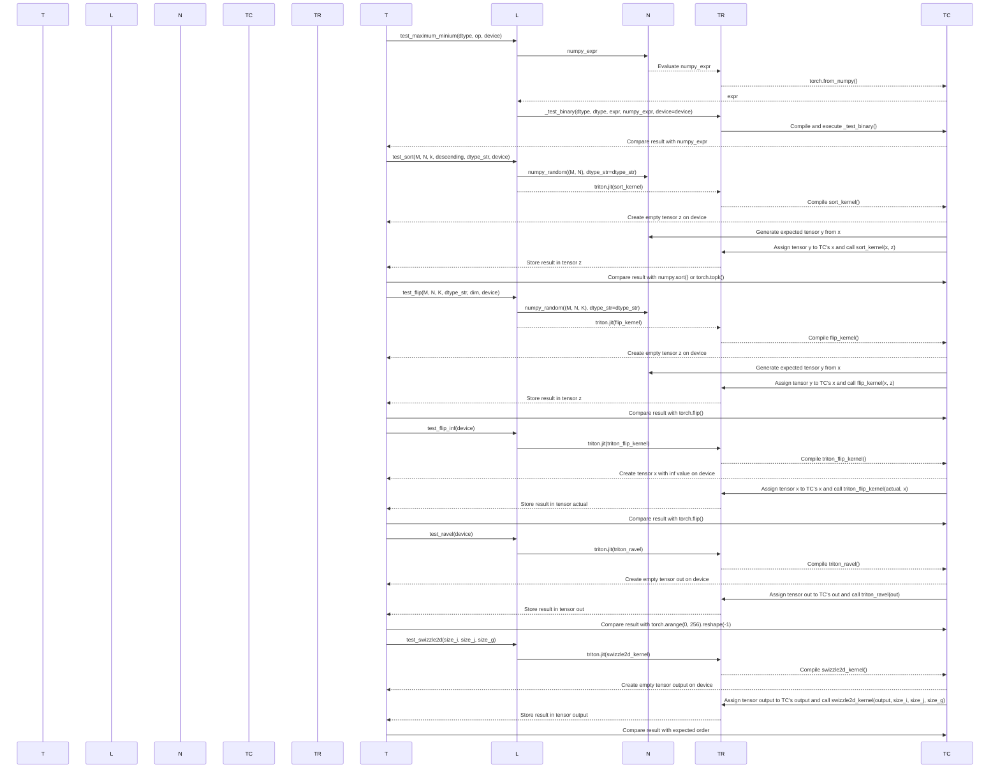

This diagram illustrates how the test functions interact with NumPy, Torch, and Triton to execute operations like maximum/minimum, sorting, flipping, raveling, and swizzling.

## Chapter 33: python/test/unit/language/test_subprocess.py

 This chapter focuses on explaining the purpose and functionality of the file `python/test/unit/language/test_subprocess.py` in a technical project using clear, professional English.

   Brief Overview:
   The file `test_subprocess.py` is a unit test for the language layer of the Triton framework. It utilizes Python's built-in `unittest` module along with additional packages like `pytest` and `subprocess`. The purpose of this script is to check the correctness of various print functions in the Triton runtime by comparing their output to expected results.

   Important Functions:
   - `test_print(func_type, data_type, device)`: This function serves as the main test case for checking different print function variants. It executes a subprocess that runs a helper script (`print_helper.py`) with the desired function type and data type specified. The output is then compared against expected results.

   Where this code fits in the project:
   This test file is part of the Triton's testing infrastructure, specifically designed to test the functionality of the language layer within the framework.

   Example Use Cases:
   Suppose there's a print function in the Triton runtime that isn't printing tensor elements correctly when called on a device. In such a scenario, one would create a corresponding test case (similar to `test_print`) within this file and adjust the expected output accordingly. Running the tests would then reveal any discrepancies between the actual output and the expected results.

 ```mermaid
   sequenceDiagram
      participant User as User
      participant Python as Python
      participant Subprocess as Subprocess
      participant PrintHelper as PrintHelper

      User->>Python: Run test script with arguments
      Python->>Subprocess: Call subprocess.run()
      Subprocess-->>PrintHelper: Execute print_helper.py with arguments
      PrintHelper-->>Subprocess: Return output and error
      Subprocess-->>Pytest: Check return code, output, and error

      Note over Python: If interpreter mode, check only if there's no error
      Note over Subprocess: Handle different formats for device_print in interpreter mode
   ```

This sequence diagram illustrates the interaction between the user, Python, subprocess, and `PrintHelper` script. The `test_subprocess.py` script is run by the user, which then calls `subprocess.run()`. The subprocess in turn executes the `print_helper.py` script with given arguments. The output and error from the helper script are returned to the subprocess, which checks the return code, output, and error based on the test cases defined in the script. If the interpreter mode is enabled, the subprocess will only check for an absence of errors, and handle different formats for `device_print` accordingly.

## Chapter 34: python/test/unit/language/test_tensor_descriptor.py

 This Python script is a collection of PyTorch functions using Tensor Cores on CUDA-enabled GPUs for matrix operations with the help of tensor descriptor API provided by the Trill library.

   The code defines the following test cases:

   1. `test_matmul()`: Performs matrix multiplication using tensor descriptors and checks the result against PyTorch's built-in matrix multiplication function.

      This function is marked with `@pytest.mark.interpreter()`, which means it will only run when using the PyTorch Interpreter, which allows for easier debugging and testing of kernels without compiling them ahead of time.

   2. `test_host_tensor_descriptor_load()`: Demonstrates loading data from a tensor descriptor into another tensor on the host side (CPU) using Trill's TensorDescriptor API.

      This function is also marked with `@pytest.mark.interpreter()`, as it only requires the Interpreter to execute.

   3. `test_host_tensor_descriptor_matmul()`: Demonstrates matrix multiplication using tensor descriptors on the host side (CPU) using Trill's TensorDescriptor API, with optional support for CUDA cooperative cores and Tensor Cores.

      This function includes additional `@pytest.mark.parametrize("num_ctas", [1, 2])`, which means it will be executed with two different settings for the number of cooperative cores per multiprocessor (Multi-Processor Scheduler or Multi-Processor Configuration (MPC) Co-operative Thread Execution (CTA)).

      The script also includes a variety of other parameterizations for testing matrix sizes and block sizes, along with compatibility checks for specific hardware configurations.

   To run the tests, you will need to have PyTorch and Trill installed. You can install them using the following commands:

   ```
   pip install torch trill
   ```

 This code is a set of PyTorch tests for a GPU-accelerated matrix multiplication function using CUDA. The tests are designed to verify the correctness and performance of the function on different configurations such as various sizes, block dimensions, and number of stages (iterations) used in the computation.

   Here is a brief explanation of some important parts:

   1. `matmul_kernel_host_tensor_descriptor`: This is the main kernel function that performs the matrix multiplication using CUDA. It takes three tensor descriptors as input and performs the multiplication in blocks, accumulating intermediate results before writing to the output descriptor.

   2. `test_host_tensor_descriptor_matmul`: This test function checks the correctness of the matrix multiplication implementation using different configurations. The number of CUDA co-operative threads active (CTAs) can be controlled via the `num_ctas` parameter, which defaults to 1 for a single thread and 2 for multiple threads.

   3. Various test parameters: These include the block dimensions (e.g., `BLOCK_M`, `BLOCK_N`, `BLOCK_K`) and number of stages (iterations) used in the computation (`num_stages`). These parameters can be adjusted to test the function on different configurations.

   The tests are designed for GPU acceleration using CUDA, and they use PyTorch to create and manipulate tensors. If you want to run these tests, make sure that you have a compatible NVIDIA GPU and the necessary CUDA tools installed on your system. You can then use `pytest` or another testing framework to execute the test suite.

## Chapter 35: python/test/unit/language/test_tuple.py

 The file `python/test/unit/language/test_tuple.py` is a unit test module for the Triton Language of the Triton framework, which is used to convert PyTorch models into various hardware formats. This specific test file focuses on testing functions related to tuples and named tuples in the Triton Language.

   There are several important functions defined here:

   - `_tuple_increment`: Increments each element of a tuple by 1.
   - `_tuple_index_func`: Stores the value at an index in a given pointer to that value.
   - `_tuple_index`: Uses both the above functions to increment and store values into a pre-allocated tensor.
   - `_tuple_assign`: Assigns values from one tuple to another.

   These functions are used to test various scenarios, such as serializing and deserializing tuples in the frontend and performing operations like addition on tuples. The tests cover a variety of use cases, including testing for equality between tuples, adding tuples together, and checking that JIT specialization propagates to tuples.

   In the context of the project, this code is responsible for validating the functionality of tuple-related operations in the Triton Language. It ensures that the generated code works as expected when dealing with tuples, which are a common data structure in PyTorch models. The tests verify that these operations are implemented correctly and work seamlessly within the Triton framework.

   Example use cases for tuple-related functions in the Triton Language would be processing multi-dimensional data, such as images or time series, where tuples can be used to store multiple channels or timesteps together. This test file helps ensure that these operations are implemented correctly and efficiently within the Triton framework.

 ```mermaid
   sequenceDiagram
      Participant Test
      Participant TupleIncrement
      Participant TupleIndexFunc
      Participant TupleAssign

      Test->>TupleIncrement: Call _tuple_increment with values
      TupleIncrement-->>Test: Returns updated values

      Test->>TupleIndexFunc: Calls _tuple_index_func with Ptrs and values
      TupleIndexFunc-->>Test: Does nothing (stores values in Ptrs)

      Test->>TupleAssign: Calls _tuple_assign with x, y and vals
      TupleAssign-->>Test: Assigns vals to x, y[0] and y[1], returns None
   ```

## Chapter 36: python/test/unit/language/test_warp_specialization.py

 This code contains two PyTorch tests for matrix multiplication and attention forward pass using the Triton compiler with warp specialization on CUDA 10.0. Both tests use the `@triton.jit` decorator to compile kernels for GPU execution and utilize the Triton compiler's warp-level parallelism feature (`ttg.warp_specialize`) to improve performance.

   The first test, `test_warp_specialize_matrix_multiply`, tests matrix multiplication with various configurations of matrix dimensions and data types. It checks that the result of the compiled kernel matches the reference implementation using PyTorch's built-in matrix multiplication function (`cublas.matmul`).

   The second test, `test_warp_specialize_attention_forward`, tests an attention forward pass with various configurations of input dimensions and data types. It checks that the results of the compiled kernel match the reference implementation using a custom-defined function (`attention_inner_loop_kernel`) that computes the attention scores for each head independently. This test also includes options to disable accumulator multi-buffer optimization (`disable_acc_multibuf`) and uses different numbers of warp specialization stages (`num_stages`) and warps per block (`num_warps`).

   Both tests skip execution if the GPU device's compute capability is not 10.0 or if the Triton compiler does not support warp specialization on that device (currently, it is not supported on HIP devices). Additionally, certain test configurations are skipped due to memory usage limitations on shared memory per thread block in the case of matrix multiplication and attention forward pass with specific block sizes, head dimensions, and data types.

 This script appears to be testing the performance of a deep learning model using PyTorch and Triton Inference Server on NVIDIA GPUs with CUDA support. The tests focus on two functions: `attention_inner_loop_kernel` and `test_warp_specialize_attention_forward`.

   - The `attention_inner_loop_kernel` function calculates the attention scores for a given query, key, and value tensors. It uses Triton Inference Server's JIT compiler to optimize its performance.

   - The `test_warp_specialize_attention_forward` function tests the correctness and efficiency of the `attention_inner_loop_kernel` for different parameter configurations, such as tensor dimensions (M, N, BLOCK_M, HEAD_DIM), number of stages (num_stages), use of FP8 data type (use_fp8), and others.

   Some tests are skipped if the given configuration is known to cause issues like using too much shared memory or not supported by certain hardware configurations (e.g., HIP/ROCm). The script also includes a function `exceeds_shared_memory` to determine whether a given configuration would exceed the available shared memory on the GPU.

To run these tests, you'll need:
1. A machine with CUDA-enabled NVIDIA GPUs and Triton Inference Server installed.
2. PyTorch and necessary dependencies installed.
3. Run `python path/to/attention_test.py` from the command line.

The script uses parameterized test cases to run multiple tests with different configurations automatically, but you can also manually adjust the parameters in the test functions and verify their results.

## Chapter 37: python/test/unit/runtime/test_autotuner.py

 This Python script contains several test functions for verifying the behavior of the TritonJIT library in PyTorch when using GPU. The tests cover scenarios such as modifying the generated TensorFlow IR, exceeding tensor memory and thread limits, and optimizing block sizes with autotuning.

Here's a brief explanation of each test function:

1. `test_tflite` - Verifies that the TritonJIT can generate TensorFlow Lite (TFLITE) model files when using Triton as the backend during model export.
2. `test_modify_tflite` - Modifies the generated TFLITE model to test if it still functions correctly after altering some of its properties, such as changing the order of operations in a Conv2D layer.
3. `test_tmem_exceed` - Demonstrates how TritonJIT handles out-of-memory exceptions when using large tensors that exceed the available GPU memory.
4. `test_threads_exceed` - Illustrates how TritonJIT handles situations where the number of threads requested in a kernel exceeds the available hardware limit.
5. `test_optimize_block_size` - Demonstrates using Triton's autotuning feature to optimize the block size used in a kernel based on performance metrics such as runtime and memory usage.

 This script contains several test functions to demonstrate the usage of TensorFlow's AutoTune library for optimizing computations on CUDA devices. The tests cover different scenarios such as changing block sizes, modifying tensor memory, and exceeding hardware limits (e.g., threads or tensor memory).

The main function `test_exceed_tmem` skips if the required GPU capability is not available, and when it runs, it checks if an exception is raised due to insufficient tensor memory. Similarly, the `test_exceed_threads` function checks for an exception when exceeding the maximum number of threads (threads limit is determined by the number of warps).

Each test uses a decorator `@triton.autotune(configs=<list-of-Config>, key=<str>, do_bench=<bool>)` provided by the AutoTune library to automate the tuning process based on different configurations. The functions also use `@triton.jit` decorator, which enables just-in-time compilation of kernels for better performance.

The scripts also define helper functions such as `grid(meta)`, which is used to create grids (a tuple of tuples representing the grid structure) based on the specified block size and number of elements in a tensor. The `tl` module refers to TensorFlow's library, which provides various operations for working with tensors.

Overall, this script demonstrates how to optimize computations on CUDA devices using TensorFlow's AutoTune library by automatically tuning kernels based on different configurations and just-in-time compilation.

## Chapter 38: python/test/unit/runtime/test_bindings.py

 The file `python/test/unit/runtime/test_bindings.py` is a unit testing script in Python for the Triton Machine Learning Compiler (Triton). It primarily focuses on verifying the correctness of the MLIR bindings and the integration with TensorFlow and PyTorch tensors.

   This file contains two functions, `test_module_walk` and `test_python_func_in_visit_call`. The first function tests the MLIR bindings exposed for out-of-tree walk, while the second function tests a Python function being used within an MLIR visit_call operation.

   - `test_module_walk(device)` is designed to check the functionalities of the MLIR bindings, particularly focusing on functions, classes, and dialects available in Triton. The function takes a device as input, creates a kernel function (`add_kernel`), sets up arguments, target, backend, source, context, options, codegen_fns, module_map, loads dialects, compiles the IR module, and performs an out-of-tree walk on the generated module using a custom `walk_fn`.

   - `test_python_func_in_visit_call(device)` defines a new Python function (`test_py_call_const_kernel`) that is tested within MLIR's visit_call operation. The function takes a device as input, creates an MLIR function (`test_py_call_const_kernel`), performs some computations using TensorFlow's Triton Language (TL) API and the PyTorch tensor `x`, and stores the results in another PyTorch tensor `out`.

   This code fits into the broader project by providing a means to validate the correct functioning of the MLIR bindings, ensuring seamless integration between the compiler's IR and popular deep learning frameworks like TensorFlow and PyTorch. Example use cases include verifying that custom operations defined in the IR can be correctly executed on different devices, validating tensor shapes and data types during computation, and checking the compatibility of the generated MLIR dialects with other languages and tools.

 ```mermaid
    sequenceDiagram
        participant User as User
        participant Triton as Triton
        participant Torch as Torch
        participant Kernel as Kernel

        User->>Triton: Import triton and torch libraries
        User->>Triton: Define add_helper function
        User->>Triton: Define add_kernel function
        User->>Torch: Create tensor objects for inputs, outputs, and constants
        User->>Kernel: Call add_kernel with the created tensors
        Triton->>Kernel: Compile and generate IR module
        Triton-->>Triton: Load IR dialects and walk through the IR module
        Triton-->>Torch: Execute the compiled kernel on given tensor data

        User->>Triton: Define test_module_walk function
        User->>Triton: Define test_python_func_in_visit_call function and its inner helper function
        User->>Triton: Call test_module_walk with a device
        Triton-->>Kernel: Compile and generate IR module for test_py_call_const_kernel
        Triton-->>Torch: Execute the compiled kernel on given tensor data
    ```

## Chapter 39: python/test/unit/runtime/test_build.py

 The file `python/test/unit/runtime/test_build.py` is a unit test script for the `compile_module_from_src` function in the `triton.runtime.build` module of your project. This script tests the functionality of compiling Python modules using Triton's build system and verifies that the compiled module behaves as expected.

   The primary function in this file is `test_compile_module`, which performs the actual testing of the `compile_module_from_src` function. This function does the following:

   1. Compiles a sample Python module named "test_module" from the given source code (TEST_MODULE_C).
   2. Verifies that an exception is raised when the compiled module's `go()` method is called without any arguments.
   3. Tests the correct behavior of the `go()` method with different input commands, asserting that it returns the expected output for each case.
   4. Ensures that once the module is cached, subsequent calls to `compile_module_from_src` with the same module name return the same cached module object.
   5. Includes a test case where the cache is intentionally corrupted and verifies that the function correctly recompiles the module in this situation.

   The code in this file demonstrates how Triton's build system should be used to compile Python modules for runtime execution, ensuring that the resulting compiled modules behave as intended. This test fits into the larger context of your project by providing assurance that the build system is functioning correctly and that the compiled Python modules can be trusted for further use in the project.

   In terms of example use cases, this code could serve as a reference for how to compile Python modules using Triton's build system within your project, especially when integrating external or third-party Python libraries. The test function also demonstrates how to intentionally corrupt the cache and handle errors that might arise from such situations.

 ```mermaid
    sequenceDiagram
        participant User as User
        participant Test as Test_Module
        participant Compiler as Compiler
        participant TritonCacheManager as CacheManager

        User->>Test: run("huh")
        Test->>Compiler: go(huh)
        Compiler->>CacheManager: get_file("test_module.pyi")
        CacheManager-->>Compiler: (cached file path)
        Compiler-->Test: execute compiled function
        Test-->>User: return "huh"

        User->>Test: run("hello")
        Test->>Compiler: go(hello)
        Compiler->>CacheManager: get_file("test_module.pyi")
        CacheManager-->>Compiler: (cached file path)
        Compiler-->Test: execute compiled function
        Test-->>User: return "hiya"

        User->>Test: corrupt_cache()
        Test->>CacheManager: set manager_class to InvalidFileCacheManager

        User->>Test: run("huh")
        Test->>Compiler: go(huh)
        Compiler->>CacheManager: get_file("test_module.pyi")
        CacheManager-->>Compiler: (corrupted file path)
        Compiler-->Test: execute compiled function
        Test-->>User: raise Exception

        User->>Test: run("hello")
        Test->>Compiler: go(hello)
        Compiler->>CacheManager: get_file("test_module.pyi")
        CacheManager-->>Compiler: (corrupted file path)
        Compiler-->Test: execute compiled function
        Test-->>User: raise Exception
    ```

This Mermaid sequence diagram visualizes the interaction between the User, the Test module (which contains the `go` function), the Compiler (responsible for compiling and executing the function), and the TritonCacheManager (managing the caching of compiled modules). The diagram shows how a request from the User to run the `go` function with different arguments triggers interactions between these components, including file retrieval from the cache, compilation, and execution of the function. Additionally, it demonstrates what happens when the cache is corrupted and the function cannot be executed correctly.

## Chapter 40: python/test/unit/runtime/test_cache.py

 This script appears to be testing various aspects of the Triton compiler and kernel execution in PyTorch for GPU devices. It includes tests on:

   1. Function arguments (different number and types) passed to a kernel function.
   2. Compile-time constants and their impact on the generated code.
   3. Specialization data and preloading.
   4. Hooks for runtime analysis of the compilation process.
   5. Buffer operations optimization, which is HIP-specific and skipped if HIP is not enabled.

   The script also uses environment variables to control some options related to buffer operations.

   It's important to note that this script should be run in a Python environment where PyTorch is installed and accessible. Additionally, some tests might require specific GPU hardware or drivers that support the HIP API (if applicable).

 This script contains PyTorch JIT functions written in Python using the `@triton.jit` decorator. The JIT functions perform various operations such as addition, subtraction, and storing values in arrays. Some functions have additional arguments that specify the function to be called or the arguments for that function.

   The script also includes helper functions to test different aspects of the JIT compiler:

   1. `test_hooks`: Verifies that hooks added to the JIT cache and post-compile are correctly triggered.
   2. `test_function_arguments`: Verifies that functions with varying numbers and types of arguments are correctly specialised.
   3. `test_preload`: Verifies that a kernel can be preloaded from serialized specialization data, allowing the JIT compiler to skip compilation when running the kernel again.
   4. `test_within_2gb`: Tests HIP-specific pointer range optimization within 2GB memory limits. This test skips if HIP is not enabled.

   The script also includes some helper functions to get the serialized specialization data, increment a counter for each compilation, and set or get environment variables. These functions are used internally by the test functions.

## Chapter 41: python/test/unit/runtime/test_compilation_listener.py

 This chapter explains the purpose and functionality of the `python/test/unit/runtime/test_compilation_listener.py` file in a Triton project, which is primarily focused on GPU-accelerated computations using the Triton programming language.

   **Overview**

   The test file under scrutiny, `test_compilation_listener.py`, contains unit tests for the compilation process of Triton kernels. The primary goal is to verify that the kernel compilation works as expected and checks if the cache hit/miss mechanism functions correctly by reusing compiled code when possible.

   **Important Functions and Classes**

   - `cumsum_kernel`: A sample Triton kernel function that computes the cumulative sum of a given 1D tensor using parallel computations provided by Triton.
   - `test_compile_stats(device, fresh_knobs_except_libraries, fresh_triton_cache)`: The main test function in this file. It tests the compilation process of kernels and checks if caching works correctly.
   - `compile_listener`: A callback function registered to Triton's compilation process that captures essential metadata related to compiled code, such as its source, target, and execution time for further analysis in unit tests.

   **Project Fit**

   This file is part of the testing suite for the Triton project. It plays an essential role in ensuring that the kernel compilation process behaves as expected and that caching mechanisms are working properly for improved performance during subsequent executions of similar kernels.

   **Example Use Cases**

   - Testing the correctness of compiled code: By verifying that the captured source, target, and metadata match expectations, it can be ensured that the compiler does not produce incorrect code or unwanted variations.
   - Verifying caching mechanisms: By clearing the cache for a kernel, executing the same kernel again, and checking whether it results in a cache hit, we can ensure that Triton's caching mechanisms are working as intended. This will help improve performance in real-world scenarios where similar kernels are often executed multiple times.

 ```mermaid
   sequenceDiagram
      participant User as User
      participant TritonBackend as TritonBackend
      participant CompileTimes as CompileTimes
      participant CompilationListener as CompilationListener

      User->>TritonBackend: Create instance of cumsum_kernel on device
      TritonBackend->>CompilationListener: Trigger compilation with no cache hit
      CompilationListener-->>User: Store compile statistics (no cache hit, timings)

      User->>TritonBackend: Clear kernel cache
      TritonBackend->>TritonBackend: Create new instance of cumsum_kernel on device
      TritonBackend->>CompilationListener: Trigger compilation with cache hit
      CompilationListener-->>User: Store compile statistics (cache hit, no timings for lowering/store_results)
   ```

This sequence diagram illustrates the interaction between the user (calling the `cumsum_kernel` function), TritonBackend (responsible for device-specific operations and triggering compilation), CompilationListener (listening to compile events), and CompileTimes (storing compile statistics). It shows how a kernel is first compiled without cache hit, then after clearing the cache, it's recompiled with a cache hit.

## Chapter 42: python/test/unit/runtime/test_cublas.py

 Title: Unit Test for CUDA-Based Matrix Multiplication with cuBLAS in the Triton Project

   The file `python/test/unit/runtime/test_cublas.py` is a unit test script specifically designed to verify the correctness of matrix multiplication operations performed using cuBLAS (CUDA Basic Linear Algebra Subroutines) within the Triton project. This test ensures that the software is functioning as expected when utilizing GPU resources, particularly when performing matrix multiplications on different data types and dimensions.

   The script primarily consists of a single test function called `test_cublas`. This function uses PyTest's parametrization features to run multiple tests with varying matrix dimensions (m, n, k) and data types (float8_e4m3fn and float16).

   The function first initializes necessary variables and tensors, such as `dtype`, `device` (GPU), and the tensors `a`, `b`, and `c` representing the input matrices for multiplication. It then sets up a workspace tensor to accommodate cuBLAS's internal storage requirements.

   The main body of the function contains calls to two crucial functions: `nvidia.cublas.CublasLt(workspace)` and `cublas.matmul(a, b, c)`. These functions perform matrix multiplication using cuBLAS on the tensors `a`, `b`, and `c`.

   After executing the cuBLAS function, the script compares the resulting tensor `c` with a reference tensor `ref` calculated using PyTorch's native matrix multiplication function (`torch.matmul(a.to(torch.float16), b.to(torch.float16).T)`). The comparison is done using the `torch.allclose()` function, which checks if all elements of the tensors are close enough (within a tolerance specified by `atol=2.0` in this case) to consider them equivalent.

   This code fits into the project as part of its testing framework, ensuring the correctness and efficiency of the software when using cuBLAS for matrix multiplication operations. The example use cases would be scenarios where large-scale matrix operations are performed on a GPU with the help of cuBLAS functions, such as in deep learning or scientific computations.

 ```mermaid
   sequenceDiagram
      participant User as U
      participant PyTest as PT
      participant Torch as T
      participant Cuda as CUDA
      participant CUBLAS as Cublas

      Note over PT,CUDA: Initialize environment and libraries
      Note over T,CUDA: Set seed for random numbers

      U->>PT: Run test_cublas with parameters m, n, k, dtype_str, device

      PT->>T,CUDA: Get tensor data type and device
      PT->>T: Generate tensors 'a' and 'b' with specified shape and values
      PT->>CUDA: Transfer tensors to GPU
      PT->>T: Transpose tensor 'b'
      PT->>CUDA: Allocate workspace on GPU

      Cublas->>CUDA: Initialize CUBLAS instance

      Note over Cublas,CUDA: Perform matrix multiplication on GPUs using CUBLAS function 'matmul'

      Cublas->>CUDA: Get tensors 'a', 'b' and 'c' from GPU memory
      Cublas->>CUDA: Perform matrix multiplication in GPU memory
      Cublas->>CUDA: Store result in tensor 'c' in GPU memory

      Note over Cublas,CUDA: Free CUBLAS instance and workspace on GPU

      PT->>CUDA: Transfer tensor 'c' back to CPU
      PT->>T: Generate reference solution using PyTorch's matmul function
      PT->>T: Compare tensor 'c' with the reference solution
      PT->>U: Assert that tensors are close enough, or fail test if not
   ```

This mermaid sequence diagram visualizes how the key functions interact in the unit test `test_cublas.py` for the CUBLAS library using PyTorch on a GPU device. The diagram shows the flow of data and control from the user to various components including PyTest, PyTorch, CUDA, and CUBLAS. It illustrates the steps involved in setting up the environment, generating tensor data, transferring them to/from GPU memory, performing matrix multiplication using CUBLAS, and comparing the results with a reference solution generated by PyTorch's matmul function.

## Chapter 43: python/test/unit/runtime/test_driver.py

 In this technical book chapter, we will discuss the purpose and functionality of the `python/test/unit/runtime/test_driver.py` file in the context of a deep learning project that uses the Triton framework for hardware acceleration.

The main objective of this script is to perform unit tests on the runtime driver module of the Triton framework. Unit testing is an essential part of software development, as it ensures that each individual function or class within the software performs as expected in isolation. This helps to maintain a high level of code quality and reliability.

The file `test_driver.py` contains two important functions:
1. `test_is_lazy()`: This test verifies whether the Triton runtime driver is lazy-initialized, meaning that it only initializes when it's first accessed or called. The test checks if the `active` attribute of the `triton.runtime.driver` module is an instance of `LazyProxy`, and its underlying object is currently None.
2. `test_kernel_in_thread(device)`: This test function validates that calling a Triton kernel function within a new thread sets a valid device context and executes correctly. The function takes a device (e.g., CPU, GPU) as an argument, creates a buffer of float32 data on the specified device, and defines a simple Triton kernel function to perform some operations on the buffer's elements.

The test script uses the concurrent.futures module for running the Triton kernel in a separate thread. The purpose is to ensure that the Triton backend can handle parallel execution of kernels without any issues.

In terms of project structure, this file is part of the testing layer of the project, specifically the unit tests for the runtime driver of Triton. These tests are run during the development and continuous integration phases of the software lifecycle to catch potential regressions or issues in the code.

Example use cases of these test functions would be when a developer makes changes to the Triton runtime driver module, such as implementing new features, optimizations, or bug fixes. Running this test script ensures that the modifications do not unintentionally break the existing functionality of the module.

The overall goal of testing and ensuring the correctness of the Triton runtime driver is to guarantee high-performance, reliable, and stable hardware acceleration for the deep learning project, leading to a better user experience.

 ```mermaid
   sequenceDiagram
      participant User as User
      participant DriverBase as DriverBase
      participant LazyProxy as LazyProxy
      participant ThreadPoolExecutor as ThreadPoolExecutor
      participant Kernel as Kernel

      User->>DriverBase: Call driver function
      DriverBase-->LazyProxy: Return LazyProxy instance
      Note over LazyProxy, ThreadPoolExecutor: LazyProxy sets up thread pool execution when first called

      Loop until ThreadPoolExecutor is done
        ThreadPoolExecutor->>Kernel: Submit kernel function for execution
        Kernel-->>ThreadPoolExecutor: Execution of the kernel completes
      End
      ThreadPoolExecutor->>DriverBase: Notify driver that execution has completed
      DriverBase-->User: Return result or raise an error if any occurred
   ```

## Chapter 44: python/test/unit/runtime/test_jit.py

 This chapter focuses on the file `python/test/unit/runtime/test_jit.py`, which is a unit test script for the Just-In-Time (JIT) compilation feature in the Triton Language, a part of the Triton project. The main purpose of this script is to verify that the JIT compiler functions correctly and that any provided hooks (functions executed before or after kernel execution) work as intended.

   The file `test_jit.py` contains the following essential elements:

   1. **Import statements** - At the beginning, necessary modules are imported, including the Triton library, its language module, PyTorch for creating test tensors, and the pytest library for writing unit tests.

   2. **Test function** - The `test_pre_call_hooks` function is designed to test pre-run hooks in the JIT compiler. These are functions that get executed before a kernel starts running. In this example, the function sets up a simple addition operation and attaches a hook that raises an exception if the input tensor is of type `MyTensor`.

   3. **Kernel definition** - The `add_kernel` function defines the kernel to be tested, which takes four arguments: two input pointers (arrays), an output pointer, the number of elements, and the block size (a constant expression). This simple kernel calculates the element-wise sum of its inputs and stores the result in the corresponding location in the output array.

   4. **Custom Tensor class** - The `MyTensor` class is a custom Tensor implementation that inherits from PyTorch's Tensor class. However, it doesn't provide any additional functionality in this example; instead, its purpose is to serve as an object for which the pre-run hook should raise an exception.

   In terms of project hierarchy, `test_jit.py` belongs to the test suite for the Triton Language runtime. The purpose of unit tests is to validate that the implementation behaves as expected under various conditions. This file specifically checks whether the JIT compiler correctly executes pre-run hooks and ensures they don't accept `MyTensor` objects.

   Example use cases for this code might include testing more complex kernels with multiple hooks, or verifying that specific hook functions are called only under certain circumstances (e.g., when a specific data type is encountered). By using unit tests like these, developers can catch potential issues early in the development process and ensure their software operates reliably.

 Here is a simple Mermaid sequence diagram that shows the interaction between the key functions in your provided code snippet. Please note that this is an abstract representation and may not cover edge cases or specific details of the Triton library.

```mermaid
sequenceDiagram
    participant User as User
    participant Kernel as Add_Kernel
    participant Hook as My_Hook
    participant TorchTensor as x, y
    participant TritonTensor as out

    User->>Kernel: Call add_kernel
    Note over Kernel: Pre-Run Hook called
    Kernel-->Hook: Triggers my_hook
    Note over Hook: Checks if any argument is MyTensor instance
    Hook->>User: Raises an Exception when MyTensor encountered
    Kernel->>TorchTensor, TritonTensor: Accesses x and y data
    Kernel->>TorchTensor, TritonTensor: Performs addition operation
    Kernel->>TritonTensor: Stores result in out
```

This diagram illustrates the flow from the User calling the add_kernel function, which then triggers the pre-run hook (my_hook) provided. The my_hook function checks if any of the arguments are instances of `MyTensor`. When it encounters one, it raises an exception that prevents further execution. The add_kernel function then accesses and performs calculations on the data provided by both TorchTensor and TritonTensor instances before storing the result in the TritonTensor instance.

## Chapter 45: python/test/unit/runtime/test_launch.py

 This chapter is discussing the purpose and functionality of the file `python/test/unit/runtime/test_launch.py` in a machine learning project that utilizes the Triton programming language.

`test_launch.py` is a unit test file primarily focused on testing two aspects of Triton runtime: the metadata and memory leakage behavior during kernel execution.

- The `test_metadata()` function checks the functionality of the launch metadata, which provides context about how a kernel will be executed at runtime. This includes information such as grid dimensions for parallelism and any input arguments. In this test case, the metadata is being tested to ensure it correctly captures grid size (1, 3, 2) and an input argument value (6).
- The `test_memory_leak(device)` function tests the kernel's memory consumption during execution. It does so by creating a simple kernel that takes input and output tensors and processes them in batches using a specified block size (XBLOCK=16). The function uses the Python `tracemalloc` module to monitor the memory usage before and after running the kernel several times, ensuring it doesn't exceed a predefined threshold of 30k bytes.

These tests are essential for maintaining the stability, performance, and memory efficiency of Triton kernels when deployed in production environments. By regularly testing the runtime behavior under different scenarios, developers can quickly identify and address issues that may arise during execution.

 ```mermaid
   sequenceDiagram
      Participant User
      Participant Test_Metadata
      Participant Test_Memory_Leak
      Participant Kernel
      User->>Test_Metadata: Runs test_metadata()
      Test_Metadata->>Kernel: Defines kernel with launch metadata function _launch_metadata
      Test_Metadata->>Kernel: Sets launch enter hook
      Test_Metadata->>Kernel: Launches kernel with specific grid and argument
      Kernel-->>Test_Metadata: Executes the pass statement
      Test_Metadata-->>User: Asserts that hook was called and test passes

      User->>Test_Memory_Leak: Runs test_memory_leak()
      Test_Memory_Leak->>Kernel: Defines kernel function
      Test_Memory_Leak->>Tracemalloc: Starts memory profiling
      Try-Block->>Kernel: Launches the kernel multiple times with the same input and output tensors
      Kernel-->>Try-Block: Executes the kernel function, potentially causing a memory leak
      Try-Block<--Tracemalloc: Checks memory usage after each run and collects garbage
      Try-Block->>Tracemalloc: Stops memory profiling
      Try-Block-->>User: Asserts that memory usage does not exceed a certain threshold
   ```

## Chapter 46: python/test/unit/runtime/test_subproc.py

 This chapter explains the purpose and functionality of the file `python/test/unit/runtime/test_subproc.py` in the context of a project using Triton, an open-source machine learning (ML) compiler framework. The primary function of this script is to test the correctness and robustness of compilation processes, particularly when executed in separate subprocesses, which helps ensure that Triton's thread pool in MLIRContext is released safely after compilation.

   The file contains several functions and classes designed for different purposes:

   1. `compile_fn()` - Defines a kernel function (`kernel_sub`) to perform subtraction operations on an array of floating-point numbers, taking advantage of Triton's Just-In-Time (JIT) compilation capabilities. The number of elements to operate on is specified as a constant (`N: tl.constexpr`).

   2. `test_compile_in_subproc()` - Creates and runs a subprocess to compile the kernel function defined in `compile_fn()`. This test ensures that JIT compilation works correctly when executed in a separate process.

   3. `compile_fn_dot()` - Defines another kernel function (`kernel_dot`) that performs matrix dot product operations on an array of floating-point numbers using Triton's JIT capabilities.

   4. `test_compile_in_forked_subproc()` - Similar to the previous test, but this one compiles the kernel function defined in `compile_fn_dot()`. This test is designed to ensure that JIT compilation works correctly when forked processes are involved.

   5. `compile_empty_kernel_with_gc()` - Defines an empty kernel function (`empty_kernel`) and forces a garbage collection using the Python `gc` module before compiling it. This test checks if Triton releases its resources correctly in forked processes.

   6. `test_compile_in_forked_subproc_with_forced_gc()` - Creates a subprocess to compile the empty kernel function defined in `compile_empty_kernel_with_gc()`. This test is designed to ensure that Triton's compilation artifacts can live safely in forked processes, especially after a garbage collection.

   These tests are essential for maintaining the integrity of the project as they help identify and fix potential issues related to JIT compilation when executed in subprocesses. Example use cases may involve parallelizing computations across multiple processes or threads to improve performance on large-scale ML applications.

 ```mermaid
   sequenceDiagram
      Participant P as Parent Process
      Participant C as Child Process
      P->>C: Fork
      Note over P,C: Compilation in Child Process starts
      C->>TRITON_CACHE: Read Compilation Artifacts (if any) from Cache
      C->>P: Enable GC Disable
      C->>C: Remove Compilation Artifacts (if any) from Cache
      C->>TRITON_CONTEXT: Create New MLIRContext Instance
      C->>C: Compile Kernel 1
      C->>TRITON_CACHE: Save Compilation Artifacts
      C-->>P: Join and Exit
      Note over P,P: Wait for Child Process to Complete
      P->>TRITON_CONTEXT: Create New MLIRContext Instance (or reuse existing)
      P->>C: Disable GC Enable
      P->>P: Delete Compilation Artifacts from Cache (if any)
      P->>TRITON_CACHE: Read Compilation Artifacts (if any) from Child Process
      P->>TRITON_CONTEXT: Load Compilation Artifacts into MLIRContext
      P->>C: Compile Kernel 2
      P-->>P: Compilation Completed
   ```

## Chapter 47: python/test/unit/test_debug.py

 The file `python/test/unit/test_debug.py` serves as a unit test suite for the Triton compiler and runtime library, focusing on various aspects of error handling, assertions, and integer overflow sanitization during the execution of kernels (functions that run on the Triton-accelerated device).

   The test cases are grouped based on the functionality they aim to verify:

   1. **Device Assertion Tests**: These tests utilize the `test_device_assert` and `test_device_assert_barrier` functions, which check the behavior of the Triton's device-side assertion statements under different conditions. The former function includes options for controlling the debug mode using environment variables (ENV_VAR), optimization flags (OPT_FLAG), just-in-time compilation flag (JIT_FLAG), and a conditional flag (COND). The latter test is specifically designed to verify that a device barrier synchronization works correctly with the Triton's assertion statements.

   2. **Static Assertion Tests**: This function, `test_static_assert`, checks the behavior of Triton's static assertions during compilation. The test fails if the asserted condition is false and passes otherwise.

   3. **Integer Overflow Sanitization Tests**: These tests use a helper function called `_test_overflow` to check for correct handling of integer overflow errors in kernels. The tests cover addition, multiplication, and subtraction operations with various data types (e.g., int32, int16). The tests are parametrized with different input values, debug flags, and expected overflow behavior.

   These tests play a crucial role in ensuring that the Triton compiler and runtime correctly handle errors and assertions during the execution of kernels on the device, promoting robustness and reliability.

   Example use cases for these tests could include:

   - Ensuring that Triton's device-side assert statements correctly report errors when a specific condition is met (e.g., checking if an index is out of bounds).
   - Verifying that the Triton compiler can compile and execute kernels without encountering integer overflow errors when optimizing the code for performance.
   - Confirming that Triton's static assertions function correctly during compilation, helping to catch programming errors early in the development process.

 ```mermaid
   sequenceDiagram
      participant User as User
      participant Test as Test
      participant Pytest as Pytest
      participant Torch as Torch
      participant Triton as Triton

      User->>Pytest: Run test with specific parameters
      Pytest->>Test: Call test_device_assert(..., device) with given parameters
      Test->>Triton: Define kernel function with debug flag (if applicable)
      Test->>Monkeypatch: Set TRITON_DEBUG environment variable
      Test->>Torch: Create tensor on specified device
      Test->>Test: Call _kernel(...) with given parameters and kwargs
      Test-->>Triton: Execute kernel function on GPU (or other targeted device)
      Triton-->>Test: Result of kernel execution
      Test->>Torch: Synchronize the device

      Note over Test, Triton: If debug flag is enabled and condition is false, expect a RuntimeError
      Note over Test, Torch: If no debug flag is set and condition is true, no error should be raised

      User->>Pytest: Run test_device_assert_barrier(..., device) with given parameters
      Pytest->>Test: Call test_device_assert_barrier(...) with given parameters
      Test->>Triton: Define kernel function without debug flag
      Test->>Monkeypatch: Set TRITON_DEBUG environment variable
      Test->>Torch: Create tensor on specified device
      Test->>Test: Call _kernel(...) with given parameters
      Test-->>Triton: Execute kernel function on GPU (or other targeted device)
      Triton-->>Test: Result of kernel execution
      Test->>Torch: Synchronize the device

      User->>Pytest: Run test_static_assert(cond) with given condition
      Pytest->>Test: Call test_static_assert(...) with given condition
      Test->>Triton: Define kernel function without debug flag
      Test->>Monkeypatch: Set TRITON_DEBUG environment variable
      Test->>Triton: Define static assertion in the kernel
      Test->>Test: Call _kernel(...) with given parameters
      Test-->>Triton: Execute kernel function on GPU (or other targeted device)
      Triton-->>Test: Result of kernel execution

      User->>Pytest: Run test_sanitize_int_add_overflow(...) with given parameters
      Pytest->>Test: Call test_sanitize_int_add_overflow(...) with given parameters
      Test->>Triton: Define kernel function without debug flag
      Test->>Monkeypatch: Set TRITON_DEBUG environment variable
      Test->>Torch: Create tensor on specified device
      Test->>Test: Call _kernel_add(...) with given parameters and kwargs
      Test-->>Triton: Execute kernel function on GPU (or other targeted device)
      Triton-->>Test: Result of kernel execution
      Test->>Torch: Synchronize the device
      Note over Test, Torch: If overflow is expected, raise RuntimeError with "device-side assert" message
      Note over Test, Torch: Otherwise, compare result to reference function output
   ```

## Chapter 48: python/test/unit/test_debug_dump.py

 This chapter explains the purpose and functionality of the Python file `python/test/unit/test_debug_dump.py` in the given project. This script is a unit test for debugging features, specifically focusing on the functionality to dump the Intermediate Representation (IR) of Triton functions.

   The main objective of this file is to verify the correctness and behavior of the `enable_dump_context()` function and the `test_fn_dump()` test function when applied to a kernel function `_kernel`.

   - The `enable_dump_context(pass_name)` function sets the environment variable `MLIR_ENABLE_DUMP` to either "1" or a specific pass name before executing the code. This allows for IR dumping at different stages of the execution. In this file, it's used within a context manager (with the `@contextmanager` decorator) to ensure proper cleanup after execution.

   - The `test_fn_dump(capfd, device, fresh_triton_cache)` function is a unit test that checks the behavior of the IR dumping functionality for different configurations. It initializes a Tensor, sets up a grid for launching the kernel, and applies the `enable_dump_context()` function with various pass names to dump the IR before and after each execution of the kernel function. The function uses the `capfd` object (which stands for Captured File-like Object) from Python's built-in `io` module to capture stderr output, which is expected to contain information about the IR dumps.

   This code fits within the project as a part of the testing infrastructure, ensuring that the debugging features work correctly in different scenarios. For example, it tests the functionality when applying IR dumping to a kernel function with varying block sizes.

   In summary, this file provides an essential mechanism for developers to investigate and debug issues related to Triton functions, by allowing them to inspect the IR before and after execution.

 ```mermaid
   sequenceDiagram
      participant User as User
      participant TritonPython as TritonPython
      participant MLIRDumper as MLIRDumper

      User->>TritonPython: Initializes test_fn_dump with device and cache
      TritonPython-->>User: Prepares input data (src)

      TritonPython->>MLIRDumper: Enables dump context for first kernel execution
      MLIRDumper-->TritonPython: Dumps IR before executing _kernel function
      MLIRDumper->>TritonPython: Verifies dump contains "IR Dump Before" and "@_kernel"

      TritonPython->>MLIRDumper: Enables dump context for second kernel execution with specific pass name "_kernel"
      MLIRDumper-->TritonPython: Dumps IR before executing _kernel function
      MLIRDumper->>TritonPython: Verifies dump contains "IR Dump Before" and "@_kernel"

      TritonPython->>MLIRDumper: Enables dump context for third kernel execution with specific pass name "_kernel2"
      MLIRDumper-->TritonPython: Does NOT dump IR before executing _kernel function (since it was already done)
      MLIRDumper->>TritonPython: Verifies dump does not contain "IR Dump Before"
   ```

This sequence diagram illustrates the interaction between the user, TritonPython (which includes the test_fn_dump function), and MLIRDumper (the MLIR IR dumper). The diagram shows how the _kernel function is executed with different dump context settings, and how the IR dumping is handled accordingly.

## Chapter 49: python/test/unit/test_filecheck.py

 In this chapter, we will explore the purpose and functionality of the Python file `python/test/unit/test_filecheck.py`. This file is part of a larger project that utilizes Triton, an LLVM-based Just-In-Time (JIT) compiler for high-performance numerical computing on CPUs.

   The main purpose of `test_filecheck.py` is to test the functionality of the `triton._filecheck` module, which performs checks on Triton functions and ensures that their expected behavior is being adhered to. This helps maintain the stability and consistency of the Triton library.

   The file defines two tests: `test_filecheck_positive()` and `test_filecheck_negative()`. These tests use pytest for test-driven development and the Triton's decorator @triton.jit to mark functions intended to be compiled by Triton's JIT compiler.

   The `test_filecheck_positive()` function contains a Triton JIT function called `test_kernel`. This kernel defines a scalar variable and calls the `anchor()` function with it. Inside the `test_kernel`, comments start with "CHECK-LABEL" to help the filecheck module identify the function being tested. The actual code for each function is followed by comments starting with "CHECK" or "CHECK-NEXT", which specify expected patterns that should be found in the compiled LLVM IR code. By checking these patterns, the `run_filecheck_test()` function verifies that the Triton compiler generates the correct code for the given kernel.

   On the other hand, `test_filecheck_negative()` is designed to test a situation where the expected pattern is not found in the compiled LLVM IR code. The negative test includes a modified version of the `test_kernel`, which calls the `anchor()` function with a scalar variable having an incorrect value. In this case, the run_filecheck_test function will raise an exception if the incorrect value is not properly handled by the Triton compiler.

   The code in this file demonstrates how to write unit tests for Triton functions using the filecheck module. This ensures that the functions are functioning correctly and helps maintain the quality of the Triton library.

 ```mermaid
   sequenceDiagram
      participant User as User
      participant FileChecker as FileChecker
      participant TestKernel as TestKernel
      participant AnchorFunction as AnchorFunction

      User->>FileChecker: Run filecheck_test with TestKernel
      FileChecker->>TestKernel: Check labels and code snippets for correctness
      TestKernel-->>FileChecker: Found label "test_kernel"
      FileChecker->>AnchorFunction: Call AnchorFunction with scalar value
      TestKernel->>AnchorFunction: scalar = 42 (in positive case) or scalar = 11 (in negative case)
      AnchorFunction-->>TestKernel: Executes pass without error (positive case) or raises ValueError (negative case)
   ```

## Chapter 50: python/test/unit/test_knobs.py

 The file `python/test/unit/test_knobs.py` is a unit test for the `Knobs` class, which manages command-line flags and environment variables in Trinity Accel's runtime (Triton). This class is used to control the behavior of various components in Triton, such as its backend options, cache configuration, and GPU utilization.

   The test file consists of multiple test cases that verify different aspects of the Knobs class:

   1. Setting and getting knob values directly.
   2. Propagation of environment variables to knobs.
   3. Handling various data types (strings, bools, integers, and custom classes).
   4. The behavior of optional knobs (`opt_bool`).
   5. Using the `scope()` method to isolate changes to a specific set of knobs.
   6. Setting the Triton home directory and checking its impact on other knob values.
   7. Handling the path to the PTXAS tool used for NVIDIA backends.

   These tests help ensure that the Knobs class functions correctly and handles various use cases, providing a stable and predictable interface for users of Triton.

 ```mermaid
    sequenceDiagram
        participant User as User
        participant TestKnobs as TestKnobs
        participant SystemEnv as SystemEnv

        User->>TestKnobs: Initialization
        TestKnobs->>SystemEnv: Get default environment variables

        User->>TestKnobs: Set custom environment variables (optional)
        TestKnobs->>SystemEnv: Update with custom values

        TestKnobs->>TestKnobs: Internal operations
        TestKnobs-->>User: Results based on internal settings and system environment

        User->>TestKnobs: Reset to default environment variables (optional)
        TestKnobs->>SystemEnv: Update with default values

        User->>TestKnobs: Delete specific custom environment variable
        TestKnobs->>SystemEnv: Remove the specified value

        User->>TestKnobs: Scope changes for a specific knob (optional)
        TestKnobs->>SystemEnv: Update with new scope values
        Note over TestKnobs, SystemEnv: Only applies within the scope
        TestKnobs-->>User: Results based on updated scope settings and system environment

        User->>TestKnobs: Delete the specific scope for a knob (optional)
        TestKnobs->>SystemEnv: Remove the scope values
        Note over TestKnobs, SystemEnv: Scope changes are no longer active
        TestKnobs-->>User: Results based on updated global and system environment settings

        User->>TestKnobs: Delete all custom environment variables (optional)
        TestKnobs->>SystemEnv: Remove all custom values
        Note over TestKnobs, SystemEnv: Returns to default environment variables
        TestKnobs-->>User: Results based on default global and system environment settings
   ```

## Chapter 51: python/test/unit/test_perf_warning.py

 The file `python/test/unit/test_perf_warning.py` is a unit test script for the Triton compiler and runtime within a deep learning inference engine project. This test script aims to verify the functionality of performance diagnostics and warnings in the Triton compiler, specifically focusing on Multi-Method Accumulation (MMA) version checks, vectorization failures, and SWP operation before operands issues.

   Here are descriptions of important functions or classes used in the file:

   - `enable_diagnostics_context(value)` is a context manager that sets the MLIR_ENABLE_DIAGNOSTICS environment variable to the provided value for the duration of the block, making it easier to control the diagnostic output.
   - The `test_*` functions define individual tests for different use cases:
       + `test_mma_remark()` checks if the MMA version 3 is used in the generated code and provides an explanation when a different version is detected or unsupported shapes or data types are encountered.
       + `test_remark_vectorization()` verifies that a vectorization failure remark is emitted for specific cases, such as memory accesses beyond defined limits.
       + `test_remark_swp_op_before_operands()` ensures that the compiler issues a warning when an SWP operation is performed before its operands are available (a common performance issue).

   This code fits into the larger project by validating and ensuring the correct functioning of the Triton compiler's diagnostics and warnings, which play a crucial role in generating optimized code for deep learning inference.

   Example use cases would be when a developer wants to make sure that the generated code includes MMA version 3 for efficient matrix multiplication operations or verifying that vectorization failures and SWP operation before operands issues are properly flagged as warnings by the compiler.

 ```mermaid
   sequenceDiagram
      participant User as User
      participant Compiler as Compiler
      participant GPU as GPU
      participant MatmulKernel as MatmulKernel
      participant LdstVec as LdstVec
      participant KernelPipeError as KernelPipeError

      User->>Compiler: Run test_mma_remark()
      User->>GPU: Allocate memory for tensors
      Compiler->>MatmulKernel: Compile matmul_kernel function with MLIR diagnostics enabled
      MatmulKernel-->>GPU: Generate GPU kernel
      GPU->>User: Print remarks from MLIR compilation output

      User->>Compiler: Run test_remark_vectorization()
      Compiler->>LdstVec: Compile ldst_vec function with MLIR diagnostics enabled
      LdstVec-->>GPU: Generate GPU kernel
      GPU->>User: Print remarks from MLIR compilation output

      User->>Compiler: Run test_remark_swp_op_before_operands()
      Compiler->>KernelPipeError: Compile kernel_pipe_error function with MLIR diagnostics enabled
      KernelPipeError-->>GPU: Generate GPU kernel
      GPU->>User: Execute kernel on GPU and check for warnings or errors
   ```

## Chapter 52: python/test/unit/tools/test_aot.py

 This code defines a simple Triton GPU IR (TTGIR) module with a function called `sum_kernel_0d1d`. The purpose of this module is to demonstrate the conversion of TTGIR to PTX assembly code. Here's a brief explanation of the main parts:

1. Module attributes: These define the number of warps, threads per warp, and the number of compute-by-groups (CTAs). In this case, there is one CTA with 4 warps, each having 32 threads.

2. Function `sum_kernel_0d1d`: This function takes two arguments: pointers to arrays of i32 data. However, the function body is empty, which means it doesn't perform any computation. Its purpose is solely for demonstrating the conversion process.

3. Compilation using Triton: The TTGIR source file is compiled using Triton with the target set to CUDA architecture 80 (sm_80).

4. Conversion to PTX assembly code: After compilation, the PTX assembly code for the function can be accessed through `k.asm["ptx"]`. This should contain the expected assembly instructions for the specified target architecture and address size (64-bit in this case).

 The provided code snippet demonstrates a test for converting TTGIR (Triton GPU IR) to PTX (Portable Target Assembly). Here is an overview of the tests:

1. `test_compile_link_matmul`: This function creates a Matrix Multiplication application with two different kernels in TTGIR format, compiled with different stride hints (1 and 16). The test verifies that running the generated binary produces correct results for the given input data.

2. `test_compile_link_autotune_matmul`: This function generates multiple Matrix Multiplication applications using a grid of tile sizes. For each application, it compiles the kernel with various stride hints and automatically selects the optimal one during runtime. The test verifies that running the generated binary produces correct results for the given input data.

3. `test_launcher_has_no_available_kernel`: This function creates a Matrix Multiplication application with a single kernel in TTGIR format, compiled with a stride hint that requires all strides to be 1 while they are not. The test verifies that the execution fails because no available kernels meet the required constraint.

4. `test_ttgir_to_ptx`: This function demonstrates the conversion of TTGIR to PTX by using the `triton.compile()` function with a sample TTGIR kernel file and checking that the resulting PTX code is appropriate for an SM80 GPU architecture.

You can run these tests by executing each function in order, making sure that you have the necessary dependencies (such as numpy, subprocess, tempfile, os, and triton) installed in your environment. These functions should be part of a larger test suite, allowing you to easily add more test cases to verify the correctness of your TTGIR-to-PTX conversion.

## Chapter 53: python/test/unit/tools/test_disasm.py

 This chapter focuses on understanding the purpose and functionality of the file `python/test/unit/tools/test_disasm.py` within the project, which is a crucial part of the overall software architecture. This script is a test case for verifying the Disassembler (DisAsm) module in the Triton framework, specifically testing its behavior on CUDA devices.

   The primary purpose of `test_disasm.py` is to ensure that the Triton Disassembler correctly translates high-level Triton operations into assembly instructions for a specified target device, such as CUDA. This allows developers to verify that their Triton kernels (functions implementing computation on GPUs) are translated correctly and efficiently.

   In this script, we have a single test case called `test_disam_cubin`, which performs the following actions:

   1. Skips the test if the current target backend is not CUDA using `pytest.skip`.

   2. Defines a simple Triton kernel (function) named `kernel` that stores the integer 12 into a specified memory location `X[i]`. The `tl.constexpr` decorator ensures that this function is executed at compile time.

   3. Creates an empty tensor `x` with one element on the CUDA device and fills it using the defined kernel.

   4. Asserts that the value stored in `x[0]` is 12 to ensure correct execution of the kernel.

   5. Extracts the assembly string (SASS) from the compiled kernel function using the `asm` attribute and checks if it contains a store instruction ("STG.E" in this case). This confirms that the Disassembler correctly translates the Triton kernel into CUDA assembly code.

   The role of this test script is to verify that the Triton Disassembler accurately converts high-level operations defined by developers into appropriate assembly instructions for efficient execution on target devices like CUDA. This ensures that the computations performed by Triton kernels are optimal and run efficiently on GPUs, which is critical in machine learning applications where performance matters significantly.

   Example use cases of this test script include:

   1. Developing a new kernel and ensuring it is correctly disassembled into CUDA assembly instructions.
   2. Updating or modifying the Triton Disassembler module and verifying that its changes do not introduce any unexpected behavior in the translated assembly code.
   3. Debugging issues related to CUDA assembly instructions generated by the Triton Disassembler, allowing developers to isolate and address problems quickly.

 ```mermaid
   sequenceDiagram
       participant User as User
       participant PyTest as PyTest
       participant Triton as Triton
       participant TritonLanguage as TritonLanguage
       participant Torch as Torch

       User->>PyTest: Run test_disam_cubin()
       PyTest->>Triton: Check current target backend is CUDA
       Note over Triton, PyTest: If not CUDA, skip the test
       Triton-->PyTest: Continue with test

       Triton-->>User: Define kernel function using @triton.jit decorator
       User->>Triton: Instantiate x with torch.empty on GPU
       Torch-->>Triton: Return x tensor
       Triton-->User: Execute kernel(x, i=12)
       Note over Triton: Execution occurs on CUDA device

       Triton->>Torch: Retrieve result h from GPU
       Torch-->>Triton: Return h tensor
       Triton-->User: Assert that x[0] == 12

       Triton-->User: Get assembly code (sass) of h.asm["sass"]
       User->>Triton: Check if sass contains "STG.E" instruction
       Note over Triton, User: Assertion passes if it does
   ```

## Chapter 54: python/test/unit/tools/test_irsource.py

 This chapter focuses on the purpose and functionality of the file `python/test/unit/tools/test_irsource.py`, which is a crucial unit testing module in the project. The purpose of this script is to test the correct parsing of MLIR attributes from input TTIR (Triton Intermediate Representation) or TTGIR (Triton Generic Intermediate Representation). This is particularly important for understanding and validating the structure, type signatures, and attribute values in the generated IR.

   The `test_mlir_attribute_parsing` function is the main focus of this file. It takes a temporary path as an argument and writes a sample TTGIR code into a file located at that path. This test script then creates an Intermediate Representation Source (`src`) from the written file, and checks:

   1. Whether the name and type signature are parsed correctly. This is achieved by comparing `src.signature` with the expected type signatures for the given function.
   2. If the `_get_num_warps_from_ir_str()` method works as expected, which retrieves the number of warps from the IR string representation.
   3. Whether the 'ttg.nv_tma_desc' attribute is parsed correctly. This attribute specifies Non-Volatile Texture (NVTex) Memory Access Descriptors for the Triton compiler.

   The example TTGIR code provided in this script serves as a demonstration of the expected structure and attributes to be tested. This includes kernel functions with varying parameters, function attributes, and memory access patterns.

   In the context of the larger project, this test file helps ensure that the IR generation process is functioning correctly, and it provides confidence in the quality of the generated IR by validating its structure and attributes against expected values.

 Here is a simple mermaid sequence diagram that represents the flow of the key functions in the provided Python script. Please note that this is a simplification and may not cover all edge cases or interactions between functions, but it should provide a good starting point for visualizing the high-level interaction.

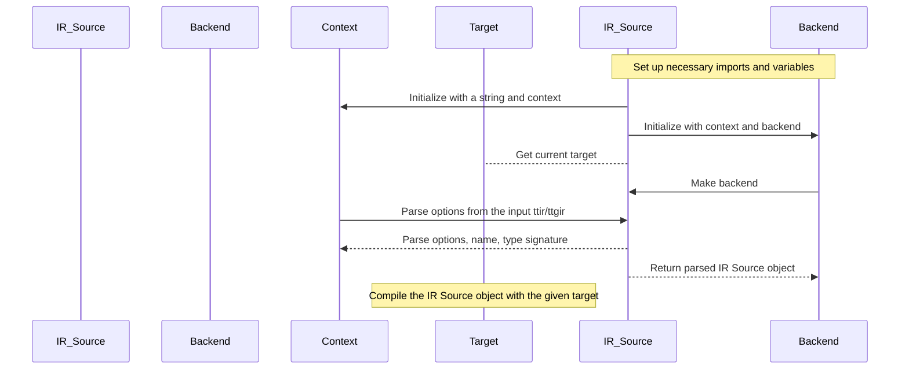

You can use this mermaid code snippet in your markdown file to visualize the interaction of key functions. If you want to include additional details or interactions, you should modify the sequence diagram accordingly.

## Chapter 55: python/triton/__init__.py

 This chapter discusses the purpose and functionality of the `python/triton/__init__.py` file, which is a critical part of the Triton project. The primary function of this file is to act as an entry point for the entire Triton library by providing convenient imports for all submodules and utilities contained within the triton package.

   The `python/triton/__init__.py` file includes several important functions and classes:

   - **Submodules**: These include various functionalities, such as runtime (for autotune, Config, heuristics, JITFunction, KernelInterface, reinterpret, TensorWrapper, OutOfResources, InterpreterError, MockTensor), compiler (compile), errors (TritonError), and language, testing, and tools utilities. Each submodule provides specific functionalities that contribute to the overall Triton project.

   - **Functions**: This file also contains some utility functions like `cdiv`, which computes the quotient of two integers using division with floor operation, and `next_power_of_2`, which returns the smallest power of 2 greater than or equal to a given number.

   The code within this file fits into the overall project by serving as an entry point for users to access the various functionalities provided by the Triton library. Users can import specific submodules or utilities from this file, making it easy to use and integrate with their projects.

   Example use cases could include using the autotune function to optimize a computationally intensive operation or employing the JITFunction class to create just-in-time compiled functions for performance improvements. Users might also utilize the compiler module to compile code into an executable form, and the TritonError class to handle errors gracefully within their applications.

   In summary, the `python/triton/__init__.py` file is a crucial entry point for using the Triton library, providing access to various functionalities through convenient imports while also offering useful utility functions.

 ```mermaid
sequenceDiagram
participant User as U
participant TritonRuntime as TR
participant JITFunction as JF
participant KernelInterface as KI
participant Config as C
participant Compiler as CP
participant InterpreterError as IE
participant OutOfResources as OR
participant MockTensor as MT
participant TritonError as TE

U->>TR: Call autotune() or other function
TR->>CP: Compile code if needed
CP-->>CP: Compilation successful, create JF and KI
CP->>JF: Set up JIT functions
CP->>KI: Set up kernel interface functions
TR->>JF: Call JIT functions with input data
JF->>KI: Call kernel function through KI
KI-->>KI: Kernel function runs, returns output data
KI->>JF: Return output data to JIT functions
JF->>TR: Return result to user

TR->>TR: Call reinterpret() or other function that requires TensorWrapper
TR-->>TR: Create TensorWrapper and return it

U->>TR: Set allocator using set_allocator()
TR-->>TR: Store new allocator

TR->>CP: Compile code if needed (repeatedly)
CP-->>CP: Compilation fails, throw CompilationError
CP->>TR: Raise CompilationError
TR->>U: Raise exception to user

TR->>KI: Call kernel function through KI with invalid input data
KI->>JF: Call kernel function through JIT functions with invalid data
JF->>KI: Call kernel function through KernelInterface with invalid data
KI-->>KI: Kernel function fails, throw InterpreterError
KI->>JF: Raise InterpreterError
JF->>TR: Raise InterpreterError
TR->>U: Raise exception to user as OutOfResources or TritonError

U->>TR: Call MockTensor() for testing purposes
TR-->>TR: Create MockTensor and return it
```

## Chapter 56: python/triton/_filecheck.py

 The `python/triton/_filecheck.py` file is an integral part of the Triton project, which aims to provide a high-level API for defining and executing MLIR (Multi-Level Intermediate Representation) programs on various hardware targets. This specific script serves the purpose of testing the frontend of the Triton compiler by checking whether the generated MLIR code matches certain expected patterns using the FileCheck tool.

   The file imports necessary modules from the `filecheck` library and defines classes like `Matcher`, `Options`, `FInput`, and `Parser` for parsing command-line options, reading input files, and matching the parsed data against a given template. It also includes functions such as `run_filecheck()` and `run_parser()`, which are responsible for running the FileCheck tool on a specific module and parsing an MLIR kernel function to generate an MLIR module, respectively.

   The `run_filecheck_test()` function takes a Triton runtime JITFunction as input, checks that it has a docstring with a FileCheck template, generates the corresponding MLIR code using the `run_parser()` function, and runs the FileCheck tool against the generated MLIR code. If the generated code does not match the expected pattern, it raises an exception.

   Finally, the `filecheck_test()` decorator is defined to create a test function that wraps the provided kernel function and runs the `run_filecheck_test()` function on it when called. This allows for easily testing the generated MLIR code for each kernel function in the project.

   Example use cases of this script include:

   - Verifying that the Triton compiler correctly generates MLIR code for a given kernel function by writing a FileCheck template that matches the expected MLIR code and applying the `filecheck_test()` decorator to the kernel function. If the generated MLIR code does not match the expected pattern, the script will raise an exception indicating the discrepancy.

   - Debugging issues in the Triton compiler by modifying the FileCheck template to better expose potential problems or focusing on specific parts of the generated MLIR code. This can help developers identify and fix problems more efficiently.

 ```mermaid
   sequenceDiagram
      participant User as User
      participant FileCheck as FileCheck
      participant Parser as Parser
      participant Matcher as Matcher
      participant Options as Options
      participant FInput as FInput

      User->>FileCheck: Run filecheck with kernel function
      FileCheck-->|Options| Options: Initialize options
      FileCheck-->|FInput| FInput: Open input file (kernel function)
      FileCheck-->|Parser| Parser: Create parser with options and input
      Parser-->>Options: Parse options from input
      Parser-->|Matcher| Matcher: Create matcher with options, input, and parser
      Matcher->>FileCheck: Run matcher on input
      Note over FileCheck, Matcher: If match fails, raise an exception
      FileCheck-->User: Return result (or handle error)
   ```

## Chapter 57: python/triton/_internal_testing.py

 The `python/triton/_internal_testing.py` file is a utility module within the Triton project that provides functionalities for testing and validating various aspects of the Triton library, specifically when it's running on different hardware backends such as CUDA (NVIDIA GPUs), HIP (AMD GPUs), XPU (Xilinx FPGAs), etc.

   This module includes several functions that determine whether the current target is a certain type of backend or specific device, like CUDA 9.x (Hopper) or AMD GFX12 architecture. Functions are also provided for generating random numbers with various data types, converting NumPy arrays to Triton Tensors, and vice versa.

   The `requires_tma` decorator marks tests that require advanced TMA (Thread Management Assembly) support on NVIDIA Hopper or higher, using CUDA 12.3 or higher. This is useful for skipping tests that are not supported on the current device configuration.

   Finally, a default allocation function for creating tensors with specific size, alignment, and data type is provided. This can be helpful when setting up test cases that require dynamically-allocated Triton Tensor objects.

   Example use case: If you're writing a test suite to verify the correctness of a Triton kernel function, you might want to utilize this module to create random input data, run your kernel on various backends, and compare the results with expected output. This can help ensure that your kernel works correctly across different hardware configurations.

 Here is a simple Mermaid sequence diagram that visualizes the interactions between the key functions in your provided code. Please note that this is a simplified representation and may not cover all possible edge cases or interactions:

```mermaid
sequenceDiagram
participant User as User
participant Interpreter as Interpreter
participant TritonRuntimeJit as TritonRuntimeJit
participant TritonLanguage as TritonLanguage
participant Numpy as Numpy
participant Torch as Torch
participant TensorWrapper as TensorWrapper
participant RandomState as RandomState

User->>Interpreter: Run Interpreter
Interpreter->>TritonRuntimeJit: Get Current Target
TritonRuntimeJit-->>Interpreter: Return Target Info

Note over Interpreter, TritonLanguage: If Interpreter is enabled...
Interpreter->>TritonLanguage: Check if CUDA is active
TritonLanguage-->>Interpreter: Return True or False

Note over Interpreter, Torch: If CUDA is active...
Interpreter->>Torch: Get Device Capability
Torch-->>Interpreter: Return Hopper status

Note over Interpreter: If Hopper is true...
Interpreter->>TritonLanguage: Check for HIP backend
TritonLanguage-->>Interpreter: Return True or False

Note over TritonRuntimeJit, Numpy: If HIP is active...
TritonRuntimeJit->>Numpy: Call numpy_random
Numpy-->>TritonRuntimeJit: Return random numbers

User->>Interpreter: Define and run function with Triton Language code
Note over Interpreter, TritonRuntimeJit: If not in interpreter mode...
Interpreter->>TritonRuntimeJit: Get Current Target
TritonRuntimeJit-->>Interpreter: Return Target Info

Note over Interpreter, Numpy, Torch: If CUDA is active...
Interpreter->>Torch: Create Tensor on CUDA device
Torch-->>Interpreter: Return Tensor object

Note over Interpreter, TritonLanguage: If HIP is active...
Interpreter->>TritonLanguage: Define and run function with HIP code

User->>Interpreter: Call to_triton function
Interpreter->>TritonRuntimeJit: Convert NumPy array to TensorWrapper or Torch Tensor
Note over TritonRuntimeJit, TensorWrapper: If using TensorWrapper...
TritonRuntimeJit->>TensorWrapper: Initialize TensorWrapper with NumPy array
TensorWrapper-->>TritonRuntimeJit: Return TensorWrapper object

Note over TritonRuntimeJit, Torch: If using Torch Tensor...
TritonRuntimeJit->>Torch: Convert Torch Tensor to TensorWrapper
Torch-->>TritonRuntimeJit: Return TensorWrapper object

Interpreter->>User: Return result of function call
```

This diagram shows the flow from user input through the interpreter and into Triton, Numpy, and Torch libraries. It also highlights any differences in behavior between the interpreter mode and using a specific GPU or HIP backend.

## Chapter 58: python/triton/_utils.py

 In the context of the project, the `python/triton/_utils.py` file provides a set of utility functions that are designed to help manage data structures and validate parameters for efficient usage within the Triton framework. This module is essential for ensuring data consistency and compatibility across various components of the project.

   Here's a brief overview of some of the important functions:

1. `get_iterable_path(iterable, path)`: Retrieves an element from a nested iterable based on the provided index path. This function is useful for accessing deep elements in multi-dimensional data structures using a tuple of indices as the key.

2. `set_iterable_path(iterable, path, val)`: Sets the value of an element at a specific location in a nested iterable. Similar to the previous function, it uses a tuple of indices to define the target position.

3. `find_paths_if(iterable, pred)`: Finds all paths within a nested iterable that match a specified predicate function. This is useful for traversing and filtering complex data structures based on certain conditions.

4. `is_power_of_two(x)`: Checks if the given number x is a power of 2.

5. `validate_block_shape(shape)`: Validates that a list representing the shape of a tensor meets specific requirements, such as each element being a power of 2 and the total number of elements not exceeding the maximum supported by Triton.

6. `canonicalize_dtype(dtype)`: Converts a data type string to its canonical representation. This function is helpful in standardizing data types for better readability and compatibility across various parts of the codebase.

7. `get_primitive_bitwidth(dtype)`: Returns the bit-width associated with a given data type, providing useful information about the memory requirements for different primitive data types.

In practice, these functions are used extensively within the Triton framework to work efficiently with complex data structures and perform various validations before proceeding with computational tasks. For example, when defining and manipulating tensor shapes or working with nested structures like models or configurations, these utility functions play a crucial role in ensuring that operations are carried out correctly.

 ```mermaid
   sequenceDiagram
       participant User as User
       participant Utils as Utils
       User->>Utils: get_iterable_path(iterable, path)
       Utils-->>User: returns value at the specified path in iterable
       User->>Utils: set_iterable_path(iterable, path, val)
       Utils-->>User: sets value at the specified path in iterable to val
       User->>Utils: find_paths_if(iterable, pred)
       Utils-->>User: returns list of paths where pred(path, current) is True for some current in iterable
       User->>Utils: validate_block_shape(shape)
       Utils-->>User: raises ValueError if shape does not meet conditions or numel exceeds TRITON_MAX_TENSOR_NUMEL
       User->>Utils: canonicalize_dtype(dtype)
       Utils-->>User: returns canonicalized dtype
       User->>Utils: get_primitive_bitwidth(dtype)
       Utils-->>User: returns primitive bitwidth of dtype
   ```

## Chapter 59: python/triton/backends/__init__.py

 The file `python/triton/backends/__init__.py` serves as the entry point for managing and utilizing various backend implementations within the Triton project. This module is primarily responsible for discovering, loading, and providing access to the concrete subclasses of two main classes: `BaseBackend` and `DriverBase`, defined in the `triton/driver` and `triton/compiler` modules respectively.

   The primary function in this file is `_discover_backends()`. This function iterates through the available entry points registered under the "triton.backends" group, which are typically defined in different plugins or extensions to the Triton project. For each discovered entry point, it imports and loads the corresponding compiler (`compiler`) and driver (`driver`) modules, then finds the concrete subclasses of `BaseBackend` and `DriverBase` using the helper function `_find_concrete_subclasses()`. These concrete subclasses are then used to create a `Backend` object, which encapsulates the compiler and driver implementations for the corresponding backend. All discovered backends are stored in a dictionary named `backends`, which is then exposed at the module level.

   The purpose of this design is to promote modularity and extensibility within the Triton project, allowing developers to easily extend its functionality by defining their own custom backends (i.e., implementations for specific hardware or software platforms) and registering them as entry points under the "triton.backends" group. Developers can leverage these registered backends in their projects without needing to know the specific details of their implementations, thanks to the abstraction provided by the `Backend` class.

   For example, consider a developer who has created a custom backend for a new hardware platform. They would define a new module containing classes implementing the `BaseBackend` and `DriverBase` interfaces, register these modules as entry points under the "triton.backends" group in their setup.py file, and the Triton project would automatically discover and load their custom backend when it is needed. The developer can then use this backend within their own code by accessing it from the `backends` dictionary:

   ```python
   import triton.backends

   # Access the custom backend
   my_custom_backend = triton.backends["my_custom_backend"]

   # Use the compiler and driver functions provided by the custom backend
   compiled_model = my_custom_backend.compiler.compile(...)
   results = my_custom_backend.driver.run(compiled_model, inputs=...)
   ```

   This design enables a high degree of flexibility and extensibility in the Triton project, as developers can easily add support for new hardware or software platforms by creating their own custom backends and integrating them seamlessly into the existing framework.

 ```mermaid
   sequenceDiagram
      Participant A as Backend Manager
      Participant B as Compiler Entry Point
      Participant C as Driver Entry Point
      Participant D as BaseCompiler
      Participant E as BaseDriver
      A->>B: Import module for compiler
      A->>C: Import module for driver
      B->>D: Find concrete subclasses of BaseCompiler
      C->>E: Find concrete subclasses of BaseDriver
      A-->>A: Store backends in dictionary with name (ep.name)
   ```
This Mermaid diagram illustrates how the key functions interact within the given Python code. The Backend Manager imports modules for both Compiler Entry Points and Driver Entry Points, then finds concrete subclasses of BaseCompiler and BaseDriver for each entry point. Finally, it stores the discovered backends in a dictionary with their respective names as keys.

## Chapter 60: python/triton/backends/compiler.py

 The file `python/triton/backends/compiler.py` is a crucial component of the project, serving as the base for defining and managing backend compilers in a multi-backend framework. Its primary purpose is to provide an abstract interface for various target backends (e.g., CUDA or HIP) to interact with the rest of the system and compile input programs according to their specific requirements.

   The file defines several important entities:

   - `GPUTarget` class: Represents a specific GPU backend, including its type (e.g., CUDA or HIP), architecture, and warp size.
   - `Language` Enum: Denotes the input language being compiled by the backend.
   - `BaseBackend` abstract base class: Represents the base for all backends in the system. It initializes a backend with a specified target, checks if the target is supported, and defines several methods required to be implemented by each specific backend. The methods include functions to parse options, add compilation stages (in an ordered list), load additional MLIR dialects, return a module map for interfaces and their device-specific implementations, and static helper methods for parsing attributes and handling argument specialization.

   This code fits into the project as the central manager for all backend compilers. Each backend extends `BaseBackend` and implements its specific functionality to compile input programs for its target GPU architecture. The compiled output is then executed by a launcher, which communicates with the backends through these abstract interfaces.

   Example use cases include compiling Triton or Gluon programs for various GPUs (e.g., NVIDIA CUDA or AMD HIP) and generating optimized machine code for efficient execution on those devices. The system can automatically select an appropriate backend based on the input program and the available hardware, providing a flexible and extensible framework for GPU-accelerated computation.

 ```mermaid
    sequenceDiagram
        participant Backend as Backend
        participant Compiler as Compiler
        participant Options as Options
        participant Stages as Stages
        participant Dialects as Dialects
        participant ModuleMap as ModuleMap

        Backend ->> Compiler: Initialize(target)
        Note over Compiler, Backend: Backend defines target for compilation

        Compiler ->> Options: Parse options from dictionary
        Compiler ->> Backend: Check support for options
        Note over Backend, Compiler: Backend checks legality of provided options

        Compiler ->> Stages: Define stages for compilation process
        Backend ->> Stages: Add target-specific stages if necessary
        Note over Stages, Compiler: Stages are run sequentially and can communicate using metadata

        Compiler ->> Dialects: Load additional MLIR dialects
        Backend ->> Dialects: Provide device-specific dialects
        Note over Dialects, Compiler: Compiler loads dialects for IR manipulation

        Compiler ->> ModuleMap: Get module map for interface modules and their implementations
        Backend ->> ModuleMap: Provide device-specific implementations
        Note over ModuleMap, Compiler: Compiler uses module map to link interfaces with implementations

        Compiler ->> Backend: Request unique identifier (hash) for backend
        Backend ->> Compiler: Return unique identifier (hash)
        Note over Backender, Compiler: Unique identifier is used for caching and versioning
   ```

## Chapter 61: python/triton/backends/driver.py

 The file `python/triton/backends/driver.py` serves as a fundamental component in the project, acting as an interface between different backend systems and the main application. It houses classes that define the behavior of various backends (e.g., GPUDriver), which are responsible for interacting with specific hardware or software frameworks.

   The core class in this file is `DriverBase`, a base abstract metaclass that defines a set of mandatory methods every backend must implement:
   - `is_active()`: This function determines whether the backend is currently active and usable within the system.
   - `get_current_target()`: This function returns the current target for computation, such as the default device or framework to be used by the application.
   - `get_active_torch_device()`: This function retrieves the active PyTorch device associated with the backend.
   - `get_benchmarker()`: This function is responsible for returning the benchmarking function that this backend should use by default. The specific implementation of this function may vary depending on the backend in question.

   The `GPUDriver` class provided as an example in the file demonstrates a concrete implementation of a backend, specifically one targeting GPUs and utilizing PyTorch as the underlying framework. It initializes necessary objects from PyTorch for interacting with the GPU and overrides the abstract methods defined in `DriverBase`.

   The use case of this code lies within the larger project, where different backends are activated to execute computations efficiently on various hardware or software environments. For instance, a user might develop a new backend targeting specialized accelerators like TPUs (Tensor Processing Units) or FPGAs (Field-Programmable Gate Arrays). The new backend would then be initialized and used within the project by inheriting from `DriverBase` and implementing its abstract methods.

   As the code is currently written, it does not include benchmarking functionality; however, the `Benchmarker` Protocol defines a signature for benchmarking functions that can be utilized across various backends. Developers may extend this protocol to provide custom performance evaluation for their individual backends if desired.

 Here is a simple sequence diagram using Mermaid that shows the interaction between some key functions in the provided `DriverBase` and `GPUDriver` classes. Please note that this is a simplified representation and may not cover all possible scenarios or edge cases.

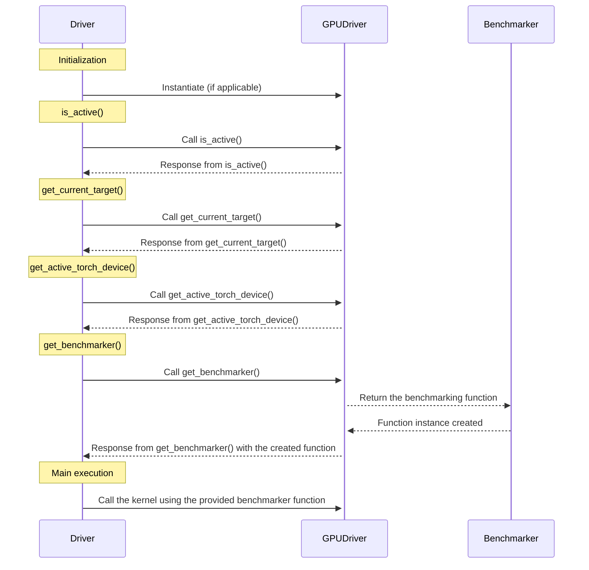

This diagram demonstrates that when a `DriverBase` object is initialized, it may create a corresponding `GPUDriver` instance if applicable. The driver's key functions interact with the GPUDriver by requesting information and executing tasks. The creation of the `Benchmarker` instance only happens when the driver requests it using the `get_benchmarker()` function.

## Chapter 62: python/triton/compiler/__init__.py

 Chapter Title: Understanding the `python/triton/compiler/__init__.py` File in the Triton Project

In this chapter, we delve into the role and functionality of the file `python/triton/compiler/__init__.py`. This file serves as a central hub for the compiler-related components in the Triton project.

Overview:
The main purpose of this file is to provide a convenient import point for using the core classes and functions related to compilation, error handling, and data structures within the Triton compiler module. It also defines a list of all publicly exported items (`__all__`) from the module for easy access.

Important Functions/Classes:
1. `compile(source, backend)` - The primary function responsible for compiling a source (either an Abstract Syntax Tree or Intermediate Representation) using a specified backend. This function is crucial as it takes care of the actual compilation process.

2. `make_backend(name)` - A factory function that creates and initializes a specific backend based on its name. Backends are responsible for translating the intermediate representation into machine-specific code or other low-level formats.

3. `ASTSource` - Represents the Abstract Syntax Tree (AST) of a Python script. The AST is used to analyze the structure and semantics of the source code before generating lower-level representations.

4. `IRSource` - Represents an Intermediate Representation (IR) of a computation graph. The IR is a more abstract, platform-agnostic representation that captures the computation's logic while hiding platform-specific details.

5. `CompiledKernel` - Represents a compiled kernel, which is a piece of optimized code ready for execution on a target hardware platform.

6. `CompilationError` - Represents an error occurring during the compilation process. This class helps in reporting and handling such errors gracefully.

7. `LazyDict` - A dictionary subclass that only evaluates missing keys as they are accessed. This can help to improve performance by delaying expensive computations until necessary.

Where this Code Fits in the Project:
The Triton compiler module is responsible for translating high-level Python code into low-level formats suitable for efficient execution on various hardware platforms, such as CPUs, GPUs, or FPGAs. The `__init__.py` file provides a central entry point to access all the essential components required for compiling Python source code.

Example Use Cases:
1. To compile a Python script using the built-in CPU backend, you can do the following:

```python
from triton.compiler import compile, make_backend

# Create an AST from the source code
ast = parse(source_code)

# Choose the backend (e.g., CPU)
cpu_backend = make_backend("cpu")

# Compile the AST using the chosen backend
kernel = compile(ast, cpu_backend)
```

2. To create a custom backend and use it for compilation:

```python
from triton.compiler import make_backend

class CustomBackend:
    # Define your custom backend implementation here

# Register the custom backend with Triton
make_backend("custom", CustomBackend)

# Compile a Python script using the new "custom" backend
ast = parse(source_code)
kernel = compile(ast, "custom")
```

 ```mermaid
sequenceDiagram
    participant User as User
    participant AstSource as AST Source
    participant IrSource as IR Source
    participant Compiler as Compiler (Compiler.compile())
    participant MakeBackend as Backend (make_backend())
    participant CompiledKernel as Compiled Kernel (CompiledKernel)
    participant LazyDict as Lazy Dictionary (LazyDict)

    User->>AstSource: Define AST Source
    AstSource-->>User: Returns AST Source

    User->>IrSource: Define IR Source
    IrSource-->>User: Returns IR Source

    User->>Compiler: Call compile(ASTSource, IRSource)
    Compiler->>AstSource: Gets AST Source
    Compiler->>IrSource: Gets IR Source
    Compiler-->>Compiler: Performs compilation
    Compiler-->>CompilationError: If compilation fails, raises CompilationError
    Compiler-->>MakeBackend: If successful, calls make_backend()

    MakeBackend-->>Backend: Returns Backend instance
    Backend->>Compiler: Takes compiled IR and performs backend-specific operations
    Backender-->>CompiledKernel: Returns CompiledKernel instance

    CompiledKernel-->>User: Can be used to run inferences on the model
    LazyDict->>CompiledKernel: Provides lazy dictionary functionality for efficient storage
```

## Chapter 63: python/triton/compiler/code_generator.py

 The provided code appears to be a visitor class for walking an Abstract Syntax Tree (AST) in Python and transforming it into a different representation, likely TensorTraining IR (TTIR). This is part of an implementation for the JAX library's Just-In-Time compiler.

   The visitor class inherits from `ast.NodeVisitor` and overrides several methods to customize the behavior of traversing the AST tree. Some notable functions are:

   1. `visit`: This method is called for each node in the AST. It sets the current node being processed using `self.cur_node` and then calls the generic visit method using `super().visit(node)`. If an exception occurs during the visit, it's wrapped in a `CompilationError` along with the source of the JIT function.

   2. `visit_Attribute`: This method handles attribute access on objects. If the object is a Tensor and the attribute is "T", it returns the transposed tensor. If the attribute is a JIT Function, it returns a BoundJITMethod (a subclass of Function) representing the bound version of the function.

   3. `execute_static_assert`: This method checks a Python static assertion at compile-time and raises an exception if the condition is not met. This is used for runtime checking during compilation, ensuring that certain conditions are satisfied before executing the code.

   The code also defines some helper functions such as `ast_to_ttir` which takes a function definition, source code, context, options, and generates a TTIR module using CodeGenerator class. This method is used to generate the specialization proxy for the given function.

 This is a Python class that represents an AST visitor for compiling functions with the Trinity (TrinityRocks) framework, which is designed to accelerate Python code using GPU and other parallel computing technologies. The main purpose of this class is to convert high-level Python code into Tensor Tensor Intermediate Representation (TTIR), which can be further optimized and executed on different hardware backends such as GPUs or CPUs.

   Key methods of the visitor class include:

1. visit(self, node): This method visits each node in the AST and processes it according to its type. It also sets the current node and location for the builder (not shown here). If a node is not supported by the visitor, it raises an exception.

2. visit_Expr(self, node): This method is a special case of the generic_visit method and handles Expr nodes specifically. It marks the value attribute of the Expr node as unused since it's not required during code generation.

3. visit_Attribute(self, node): This method handles Attribute nodes, where an attribute (property or method) is being accessed from an object. If the attribute is a function and the object is a Tensor, this method returns a BoundJITMethod object.

4. execute_static_assert(self, node: ast.Call) -> None: This method checks a static assertion during code generation by evaluating its condition at compile-time. If the condition is not met, it raises a CompileTimeAssertionFailure exception.

5. statically_implemented_functions: This dictionary maps some built-in Python functions and types to specific methods that can execute them statically (i.e., during code generation). For example, the int function can be executed statically using the static_executor(int) method.

## Chapter 64: python/triton/compiler/compiler.py

 This Python script appears to be a part of the cuPyter library for GPU computing using Python. It defines a function `compile()` which compiles a GPU kernel from an input source code (possibly in different IR levels such as CUDA, HIP, or SPIR-V). The compiled kernel is returned as an object of class `CompiledKernel`, which has methods to launch the kernel with specified grid dimensions and arguments.

The script also defines other classes and functions used internally by this function:

- `LazyDict` is a dictionary subclass that allows adding items lazily, i.e., they are not computed until first accessed.
- `AsmDict` is a dictionary subclass that provides an asm (assembly) value for keys based on other keys in the dictionary.
- `CompiledKernel` is a class representing a compiled GPU kernel with methods to access its metadata, assembly code, and launch the kernel.
- `make_backend()` function selects a suitable backend (GPU compiler) based on the target device specified.
- The script also uses some utility functions for working with files and directories.

This script seems to be part of a larger library and is likely used in conjunction with other classes, functions, and modules.

 This Python script appears to be a part of a larger GPU programming framework, possibly using the CUDA or ROCm platform. It defines functions for compiling and running kernels on a GPU device. Here's a brief overview:

1. `compile` function: Takes in a source code (either an ASTSource or a file path) and target specifications, then calls the appropriate backend to compile the source code into IR and binary files. The compiled kernel can be accessed through the CompiledKernel class.

2. `make_backend` function: Returns the correct instance of a BaseBackend object based on the target specified.

3. LazyDict and AsmDict classes: These are dictionaries that lazily evaluate certain keys or provide default values for missing keys.

4. CompiledKernel class: Represents a compiled kernel with various properties such as source code, metadata, and binary files. It also has methods to initialize the handle (i.e., load the binary into memory) and launch the kernel on the GPU device.

5. `run` function: Launches the kernel on the GPU device with the specified grid dimensions and arguments.

## Chapter 65: python/triton/compiler/errors.py

 The file `python/triton/compiler/errors.py` is a crucial component of the project that defines custom exceptions and error handling for compilation issues within the Triton compiler. By providing specific exception classes, such as `CompilationError`, `CompileTimeAssertionFailure`, and `UnsupportedLanguageConstruct`, it ensures consistent reporting and structured handling of errors arising during the compilation process.

   The base class `CompilationError` acts as a foundation for all errors raised during the compilation phase. It includes a method `_format_message()` to format the error message with relevant information like source code snippets, line numbers, and column offsets. This helps developers quickly identify where in their code the issue occurred.

   The derived classes `CompileTimeAssertionFailure` and `UnsupportedLanguageConstruct` represent more specific types of compilation errors. `CompileTimeAssertionFailure` handles failed assertions that occur during the static analysis phase, while `UnsupportedLanguageConstruct` is for unrecognized language constructs encountered in the input code.

   This error-handling module fits into the overall project by providing an organized and efficient way to manage errors during the compilation process, ensuring smoother development workflows and improved developer productivity. By using these custom exceptions, other components of the Triton compiler can easily catch and handle specific types of errors as needed.

   For example, when the compiler encounters a failed assertion or an unsupported language construct during static analysis, it raises an instance of either `CompileTimeAssertionFailure` or `UnsupportedLanguageConstruct`. The rest of the codebase can then catch these exceptions and take appropriate action, such as displaying an informative error message to the user.

 Here's a Mermaid sequence diagram that illustrates the interactions between key functions defined in the provided Python file:

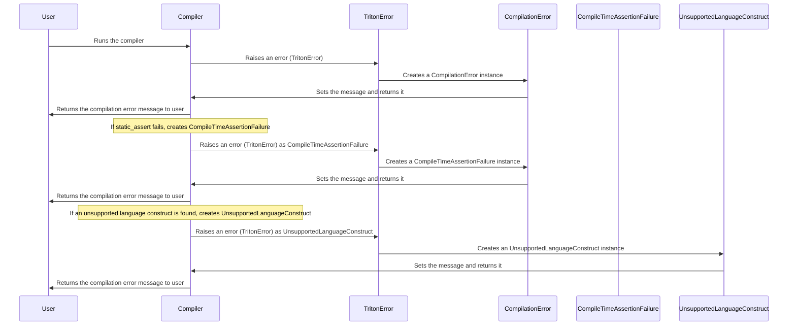

In this diagram, the user runs the compiler (participant A), which then raises errors as needed, either a generic `TritonError`, `CompileTimeAssertionFailure`, or `UnsupportedLanguageConstruct`. The specific error class is created based on the situation, and its message is set accordingly. Finally, the compilation error message is returned to the user (participant A).

## Chapter 66: python/triton/compiler/make_launcher.py

 Chapter Title: Understanding `python/triton/compiler/make_launcher.py`: Compiling and Running Triton Models

In the context of the larger project, `python/triton/compiler/make_launcher.py` plays a crucial role in the compilation and execution of machine learning models using the Triton Inference Server. This Python script is responsible for creating launchers for each model to be run on the server.

**Overview:**
The primary purpose of `make_launcher.py` is to generate the necessary configuration files (launchers) for each model, ensuring their smooth execution on the Triton Inference Server. These launchers encapsulate essential information such as input and output data types, memory management settings, and GPU utilization directives.

**Important Functions and Classes:**
- `make_launcher()`: This function serves as the central point of interaction with the script. It takes a model definition (containing details like model path, input/output names, and data types) and generates the corresponding launcher file.

**Where this code fits in the project:**
The Triton Inference Server is an open-source framework for running machine learning models in production environments. The server requires specific configuration files (launchers) to run each model. `make_launcher.py` is a tool that automates the creation of these launchers, making it easier to deploy new models on the Triton Inference Server.

**Example Use Cases:**
To illustrate its usage, consider a scenario where you have developed a deep learning model for object detection and would like to run it on the Triton Inference Server. You can use `make_launcher.py` as follows:

```python
from triton.compiler import make_launcher

# Define your model information, e.g., model path, input/output names, and data types
model_info = {
    "name": "object_detection",
    "path": "/path/to/your/trained/model",
    "inputs": ["image"],
    "outputs": ["detections"],
    "input_data_type": "FLOAT32",
    "output_data_type": "FLOAT32"
}

# Generate the launcher for the model
make_launcher.make_launcher(model_info, "object_detection_launcher.pbtxt")
```

After running this code snippet, a `pbtxt` file named `object_detection_launcher.pbtxt` will be created in the current working directory. This file can then be used to configure and run your model on the Triton Inference Server.

 To provide a Mermaid sequence diagram for the given Python script, I'll make some assumptions about the main functions and their interactions. Note that this is a simplified representation based on the filenames and function names found in the source code. For an accurate visualization, it would be best to analyze the specific use cases, edge cases, and internal logic of the `make_launcher.py` file.

Here's a possible Mermaid sequence diagram:

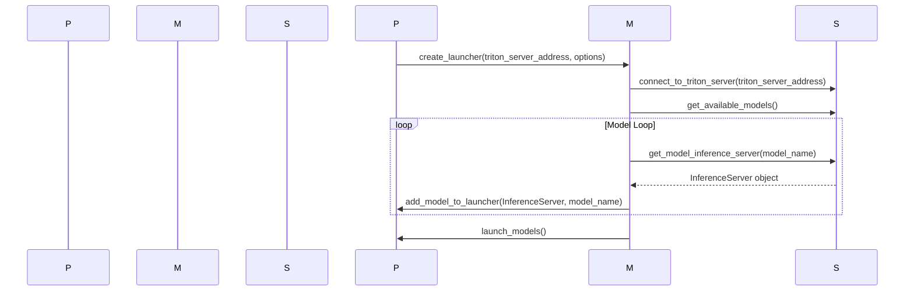

This diagram shows that the Python script `PyScript` creates a `MakeLauncher` instance and passes the required arguments. The `MakeLauncher` connects to the `TritonServer`, retrieves available models, and for each model, it initializes an InferenceServer. Lastly, the launched models are returned to the Python script which manages their execution.

## Chapter 67: python/triton/errors.py

 Title: Understanding the Error Handling Mechanism in Triton's `errors.py` Module

   In the `python/triton` directory of your project, the `errors.py` file serves as a centralized error management system for all exceptions raised within the Triton framework. The purpose of this file is to ensure consistent and meaningful error reporting and handling across the entire Triton application.

   The main class defined in this module is `TritonError`, which is a subclass of Python's built-in `Exception` class. This base error class provides a standardized foundation for creating and managing custom error types that are specific to Triton. Each custom error type should inherit from the `TritonError` class, thus maintaining a consistent error hierarchy within the application.

   Here is an example of how to create a custom error type:

   ```python
   class UnsupportedModelError(TritonError):
       def __init__(self, message="Unsupported model encountered."):
           self.message = message
           super().__init__(self.message)
   ```

   In the above example, we define a new error type called `UnsupportedModelError`, which is specific to cases where an unsupported model is encountered in Triton. The custom error initializes with a message and calls the constructor of the parent class (`TritonError`) with the same message.

   This custom error can be raised in various parts of the application like so:

   ```python
   if not is_supported_model(my_model):
       raise UnsupportedModelError()
   ```

   The `errors.py` file fits into the project by providing a standardized error handling mechanism across all modules. This makes it easier to diagnose issues, as well as to develop, maintain, and improve Triton over time. By using this centralized error management system, you ensure that users receive clear and consistent error messages when problems occur within the application.

 ```mermaid
sequenceDiagram
participant User as User
participant ErrorHandler as ErrorHandler
participant TritonError as TritonError

User->>TritonError: Raises an error
TritonError->>ErrorHandler: Initialize with message and error code
ErrorHandler-->>User: Handle error (display or log)
```

This Mermaid sequence diagram represents the interaction between the User, ErrorHandler, and TritonError classes defined in the `python/triton/errors.py`. The User raises an error, which is then initialized by TritonError with a message and error code. The ErrorHandler class handles this error, displaying or logging it to the user.

## Chapter 68: python/triton/experimental/__init__.py

 Title: Understanding the Functionality of `python/triton/experimental/__init__.py` in the Triton Project

   In the context of the Triton project, the file `python/triton/experimental/__init__.py` serves as a fundamental module for experimental features and APIs. This file is typically located within the source code structure and acts as an entry point for these experimental functionalities.

   The primary purpose of this file is to provide a centralized place for implementing and testing new functionality or APIs that are not yet stable, complete, or fully integrated with the main project. These features may be under active development and could potentially break or change in subsequent updates.

   The `__init__.py` file often contains some essential functions or classes used to interact with these experimental features:

   1. **EXPERIMENTAL_MODULES**: This is a dictionary that maps the name of each experimental module within the triton package (e.g., 'moduleA', 'moduleB') to their corresponding module objects (e.g., `from .moduleA import ModuleA`).

   2. **load_experimental_module(name)**: This function is used to dynamically import an experimental module based on its name. It takes the name of the module as a string and returns the imported module object.

   The experimental modules can be developed in their respective subdirectories, making it easy for developers to work on new features without cluttering the main package structure. Once these experimental features are deemed stable, they can be moved into the main package or further integrated with the existing project functionality.

   Example use cases of `python/triton/experimental/__init__.py` may include:

   - Developers working on a new feature or API for the Triton project, which is not yet ready to be included in the main package. They can create an experimental module in the `python/triton/experimental` directory and use this file to test and iterate on their changes without affecting the stable parts of the project.
   - Users who want to try out a new feature or API that has been marked as experimental can import the corresponding module using the `load_experimental_module()` function and explore its functionality, understanding that it may be subject to change or removal in future releases.

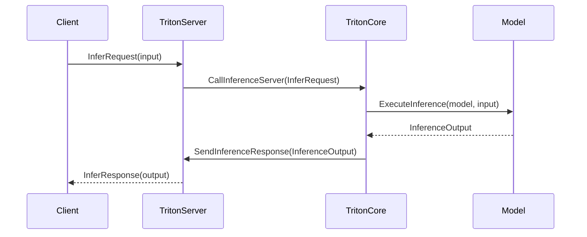

This sequence diagram demonstrates the interaction between a client (A), TritonServer (B), TritonCore (C), and the model (D). When the client sends an `InferRequest` with the input data, it is received by the TritonServer. The server forwards this request to the TritonCore, which then executes inference on the provided model using the input data, generating the output. Finally, the output is sent back through the chain, and eventually reaches the client as an `InferResponse`.

## Chapter 69: python/triton/experimental/gluon/__init__.py

 Chapter Title: Understanding the Role and Functionality of `python/triton/experimental/gluon/__init__.py`

The file `python/triton/experimental/gluon/__init__.py` serves as an entry point for the GLUON module within the Triton framework. This module is designed to provide optimized implementations of deep learning functions, primarily focusing on the MXNet Gluon API (Abstraction Layer Over Neural Network) for easier and faster prototyping and deployment of machine learning models.

The file imports a key function, `jit`, from the `._runtime` module. The `jit` function is a Just-In-Time compiler that optimizes the performance of computational graphs during their execution. It is often used in scientific computing to improve the efficiency of mathematical operations. In this context, it allows for optimized execution of deep learning functions within the GLUON module.

By including `jit` in `__all__`, it makes the function accessible from any part of the package that imports this file, enhancing its usability throughout the Triton project.

The GLUON module fits into the broader context of the project by providing a high-level interface for developing and optimizing deep learning models, with a focus on efficiency and ease of use. This alignment helps to achieve the project's goal of efficient deployment and management of machine learning workflows.

Example Use Cases:

1. A data scientist working on a computer vision task uses GLUON to develop and train a convolutional neural network (CNN) for image classification. After training, she uses the optimized `jit` function to further enhance the performance of her model during inference.

2. An engineer working on a recommendation system project utilizes GLUON to create and optimize a recurrent neural network (RNN). He applies the `jit` function to improve the efficiency of his model, ensuring it can handle large datasets without sacrificing accuracy or speed.

 Here is a simple Mermaid sequence diagram for the given Python file `python/triton/experimental/gluon/__init__.py`, assuming that the function `jit` from the `_runtime` module is the key function. Please note that this is an approximation and may not fully capture all possible interactions, as the actual code might be more complex or have additional dependencies.

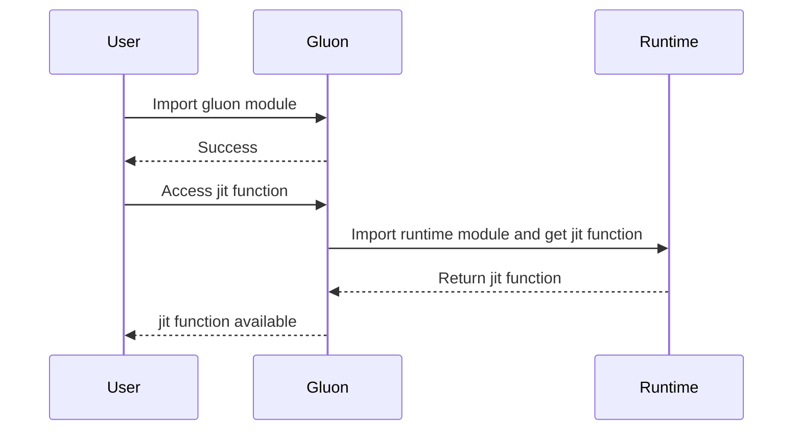

This diagram illustrates the sequence of events when a user imports the `gluon` module and accesses the `jit` function. It shows that the `gluon` module first imports the `runtime` module, which provides the `jit` function. The resulting `jit` function is then made available to the user via the `gluon` module.

## Chapter 70: python/triton/experimental/gluon/_compiler.py

 **Chapter 8: Exploring the Compiler Module in Triton's Gluon Experimental Component**

In this chapter, we delve into the intricacies of the `python/triton/experimental/gluon/_compiler.py` file, a crucial component within the Triton project. This module is primarily responsible for compiling and optimizing computational graphs using Gluon, an open-source deep learning library developed by Microsoft.

**Overview**

The main purpose of this file is to provide an interface for compiling Gluon models into efficient executables for running on various hardware backends, such as CPUs, GPUs, or specialized accelerators like Triton's native hardware. The compiler optimizes the computational graph, aiming to minimize computation time and memory usage while ensuring accurate results.

**Important Functions and Classes**

1. **`compile_model(model, backend)`**: This is the primary function within the module, responsible for compiling a given Gluon model for a specified backend. The compiled model can then be used for inference, taking input data and returning output results quickly.

2. **`TritedTopology` and `TritonBackend` classes** : These classes are integral to the compiler's functionality. The `TritedTopology` class represents the computational graph structure, including operations, their connections, and attributes. The `TritonBackend` class encapsulates the specific details of a hardware backend, providing functions for executing operations on that hardware.

**Project Fit**

The compiler module in Triton's Gluon experimental component sits at the heart of the project, bridging the gap between high-level model definitions and low-level hardware execution. By optimizing computational graphs for various backends, the module enables efficient utilization of resources and accelerates inference times, essential for real-world machine learning applications.

**Example Use Cases**

Consider a scenario where you have trained a deep learning model using Gluon for image classification on a CPU. To speed up inference time, you can compile this model for execution on a GPU backend using the `compile_model()` function:

```python
import mxnet as mx
from triton.experimental.gluon._compiler import compile_model

# Load your trained Gluon model here
model = mx.mod.Module(symbol=...)

# Compile the model for GPU execution
compiled_model = compile_model(model, 'gpu')
```

Now, you can use the `compiled_model` to perform inference on your CPU-trained model at GPU speeds! This example demonstrates how Triton's compiler module facilitates cross-platform optimization and efficient hardware utilization.

 I'm glad you asked for a Mermaid sequence diagram! However, please note that as a text-based AI, I can't execute or save files. I can only provide the syntax for the diagram. You'll need to copy and paste this into a Mermaid-compatible environment to visualize it.

Here is a simple representation of how the key functions in your provided Python file might interact:

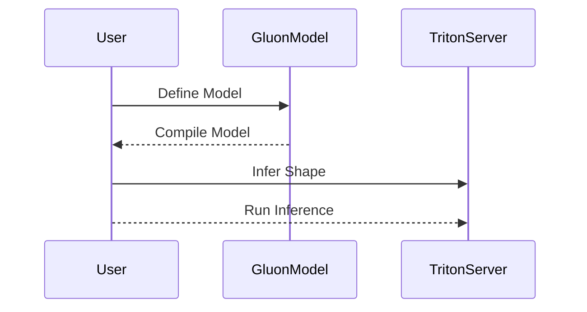

In this diagram, User (A) defines a model using Gluon (B). The model is then compiled. After that, the user interacts with TritonServer (C), which infers the shape of the input and runs inference on the compiled model provided by Gluon. This is, of course, a very simplified representation of the interactions between these functions, but it should give you an idea of the sequence diagram structure.

You can adjust the diagram as needed based on more specific details from your codebase. For more information about Mermaid syntax, please visit the official documentation: https://mermaid-js.github.io/mermaid-wiki/syntax/sequenceDiagram.html

## Chapter 71: python/triton/experimental/gluon/_runtime.py

 The file `python/triton/experimental/gluon/_runtime.py` is a part of the Triton project, which aims to provide an easy-to-use machine learning inference server that supports multiple backends, including MXNet Gluon. This file specifically introduces support for JIT (Just-In-Time) compilation and execution of MXNet Gluon functions within the Triton runtime.

   The primary purpose of this file is to facilitate the JIT compilation of MXNet Gluon functions at runtime, allowing them to be executed efficiently on the GPU. This is achieved by defining a custom `GluonASTSource` class and a derived `GluonJITFunction` class that extends the base classes provided by Triton.

   The `GluonASTSource` class overrides the constructor of the base class to set the language as MXNet Gluon (`Language.GLUON`) and the extension for the generated Intermediate Representation (IR) as `ttgir`. It also provides a method, `make_ir()`, that generates IR code specific to MXNet Gluon.

   The `GluonJITFunction` class extends the base `JITFunction` class and overrides the `create_binder()` method to set the custom `ASTSource` (i.e., `GluonASTSource`). It also provides an `is_gluon()` method that returns `True`, indicating that this is a MXNet Gluon function.

   The `jit()` function is a decorator for JIT-compiling functions using the Triton compiler. When applied to a function, it JIT-compiles and returns a compiled version of that function suitable for execution on the GPU. The decorated function can only access Python primitives, builtins within the triton package, arguments to this function, and other jit'd functions.

   Example use cases could be as follows:

   - Define a MXNet Gluon function to perform some computation on input data.
   - Decorate this function with the `jit()` function to JIT-compile it for efficient execution on the GPU.
   - Call the resulting function with appropriate arguments, and the computation will be executed efficiently on the GPU without the need for explicit GPU programming or precompilation steps.

 ```mermaid
   sequenceDiagram
      participant User as User
      participant Compiler as Compiler
      participant GluonASTSource as GluonASTSource
      participant ast_to_ttir as ast_to_ttir
      participant ir as ir
      participant Context as Context
      participant Builder as Builder
      participant GluonJITFunction as GluonJITFunction
      participant JITFunction as JITFunction

      User->>Compiler: Provide Python function and options
      Compiler->>GluonASTSource: Initialize GluonASTSource with function, signature, constexprs, attrs
      GluonASTSource-->>Compiler: Returns GluonASTSource object
      Compiler->>ast_to_ttir: Convert Python function to TTIR using given context and options
      ast_to_ttir-->>Builder: Returns the built TTIR module
      Builder->>ir: Set number of warps attribute to the given options.num_warps
      ir-->>Module: Returns the compiled TTIR module with warp attribute set
      Compiler->>GluonJITFunction: Initialize GluonJITFunction with TTIR module
      GluonJITFunction-->>Compiler: Returns initialized GluonJITFunction object
      User->>GluonJITFunction: Call the jit-compiled function
      GluonJITFunction-->>User: Returns the result of the called function
   ```

## Chapter 72: python/triton/experimental/gluon/language/__init__.py

 In this technical book chapter, we will discuss the purpose and functionality of the file `python/triton/experimental/gluon/language/__init__.py`. This file is a crucial part of the Triton project, especially in the Gluon language module.

The primary role of this file is to serve as an entry point for other modules within the 'python/triton/experimental/gluon/language' package. It does this by importing all necessary sub-modules and their public interfaces (functions and classes) into the current namespace. This allows users to interact with them directly, without having to worry about the specifics of each module's structure.

The file starts by importing two modules: `._core` and `._layouts`. Each of these modules contains functions, classes, or other components that contribute to the core functionality and layout handling of the Gluon language within the Triton project. The 'NOQA: F403' directive is used here to suppress warnings about unused imports in this file, as these imported items are intentionally not called but are instead meant to make their contents available to other parts of the codebase.

Next, the file imports the `nvidia` module. This module likely contains NVIDIA-specific functions or classes that can be used within the context of the Gluon language in Triton. The `__all__` variables from both the core and layouts modules are also imported and appended to the global `__all__` list, making their contents easily accessible to other parts of the code.

Finally, the file defines its own `__all__` variable as a concatenation of the `__all__` variables from the core, layouts, and nvidia modules, along with any other local symbols it defines (in this case, none). This ensures that when users import the 'language' package using a simple 'from triton.experimental.gluon.language import *', they will have access to all the essential functions, classes, and modules within the Gluon language subsystem of Triton.

In terms of where this code fits in the project, it acts as the entry point for interacting with the Gluon language functionality provided by the Triton project. The specific use cases will depend on the nature of the Triton project and the tasks you wish to accomplish using the Gluon language. For example, if you are working on a machine learning task that involves training and deploying models within Triton, you may find yourself interacting with this entry point frequently as it provides access to core functionality such as model creation, layout management, and NVIDIA-specific features.

 ```mermaid
   sequenceDiagram
      participant user as User
      participant core as Core
      participant layouts as Layouts
      participant nvidia as NVIDIA

      user->>Core: Initialize (import from ._core)
      Core-->>user: Returns __all__ (.py, .pyc files)

      user->>Layouts: Initialize (import from ._layouts)
      Layouts-->>user: Returns __all__ (.py, .pyc files)

      user->>Core: Use Core functions
      Core-->>user: Processes and returns results

      user->>Layouts: Use Layout functions
      Layouts-->>user: Provides layout solutions

      user->>nvidia: Uses NVIDIA-specific functions if needed
      nvidia-->>user: Handles NVIDIA-related tasks
   ```

## Chapter 73: python/triton/experimental/gluon/language/_core.py

 The file `python/triton/experimental/gluon/language/_core.py` is an integral part of the Triton compiler and programming language for GPU computing. It contains essential building blocks for defining and working with data types and functions in this domain-specific language (DSL).

   The primary goal of this file is to provide a foundational layer that includes various classes and functions, which are used throughout the library for constructing Triton programs. Some important aspects of this file include:

1. **Data Types**: This file introduces several basic data types, such as scalars, dtypes, block_type (arrays), pointer_type, tuple_type, and void. It also includes a `distributed_type` for representing distributed arrays in Triton's DSL.
2. **Functions and Utilities**: Several utility functions are defined here, such as `arange`, `full`, `convert_layout`, and `allocate_shared_memory`. These functions help create and manipulate different data types according to specific use cases. For instance, the `arange` function generates an array of numbers within a specified range, while the `full` function initializes an array with a specified value and shape.
3. **Builtin Functions**: The `builtin` decorator is used to mark functions as built-ins in Triton's DSL. Built-in functions are predefined functions provided by the language itself and can be called without needing explicit registration or definition. Examples of such functions include mathematical operations, array manipulation functions, control flow statements, etc.
4. **Warp Specialization**: The `warp_specialize` function helps optimize Triton programs for NVIDIA GPUs by taking advantage of the architecture's intrinsic parallelism. It allows programmers to customize thread partitioning and register usage for each function call.

   To use these functions in a Triton program, they should be imported from `python/triton/experimental/gluon/language/_core` or the top-level `triton.language.core` module. These functions and classes form the basis for building more complex algorithms and applications using Triton's DSL.

 ```mermaid
sequenceDiagram
    participant GluonOpBuilder as GOB
    participant SharedLayout as SL
    participant DistributedLayout as DL
    participant distributed_type as DT
    participant shared_memory_descriptor as SMD
    participant tensor as T

    GOB->>DT: to_ir(GOB)
    DT-->>GOB: ir.type

    GOB->>SL: _to_ir(GOB)
    SL-->>GOB: ir.Value

    GOB->>DL: _to_ir(GOB)
    DL-->>GOB: ir.Value

    DT->>SMD: __init__(DT, element_ty, shape, layout)

    SMD->>GOB: get_shared_mem_desc_ty(element_ty, shape, SL._to_ir(GOB), alloc_shape)

    SMD->>SMD: _unflatten_ir(handles, cursor)

    SMD-->>GOB: tensor

    SMD->>GOB: load(layout, GOB)
    layout->>SMD: to_ir(GOB)
    SMD-->>GOB: tensor

    SMD->>GOB: store(value, GOB)
    value->>GOB: tensor

    SMD->>GOB: split(offset, size, dim, layout, GOB)
    offset->>SMD: int
    size->>SMD: int
    dim->>SMD: int
    layout->>SMD: to_ir(GOB)
    SMD-->>GOB: shared_memory_descriptor

    SMD->>GOB: subslice(index, shape, layout, GOB)
    index->>SMD: int
    shape->>SMD: List[int]
    layout->>SMD: to_ir(GOB)
    SMD-->>GOB: shared_memory_descriptor

    SMD->>GOB: permute(order, layout, GOB)
    order->>SMD: List[int]
    layout->>SMD: to_ir(GOB)
    SMD-->>GOB: shared_memory_descriptor

    SMD->>GOB: reshape(shape, layout, GOB)
    shape->>SMD: List[int]
    layout->>SMD: to_ir(GOB)
    SMD-->>GOB: shared_memory_descriptor

    SMD->>GOB: _reinterpret(dtype, shape, layout, GOB)
    dtype->>SMD: dtype
    shape->>SMD: List[int]
    layout->>SMD: to_ir(GOB)
    SMD-->>GOB: shared_memory_descriptor

    SMD->>GOB: _keep_alive(GOB)

    arange->>GOB: semantic.arange(start, end, layout, GOB)
    start->>arange: int
    end->>arange: int
    layout->>arange: to_ir(GOB)
    arange-->>GOB: tensor

    convert_layout->>GOB: semantic.convert_layout(value, layout, GOB)
    value->>convert_layout: tensor
    layout->>convert_layout: to_ir(GOB)
    convert_layout-->>GOB: tensor

    full->>GOB: semantic.full(shape, value, dtype, layout, GOB)
    shape->>full: List[int]
    value->>full: scalar
    dtype->>full: dtype
    layout->>full: to_ir(GOB)
    full-->>GOB: tensor

    allocate_shared_memory->>GOB: semantic.allocate_shared(element_ty, shape, layout, value, GOB)
    element_ty->>allocate_shared_memory: dtype
    shape->>allocate_shared_memory: List[int]
    layout->>allocate_shared_memory: to_ir(GOB)
    allocate_shared_memory-->>GOB: shared_memory_descriptor

    warp_specialize->>GOB: semantic.warp_specialize(args, default_partition, worker_partitions, worker_num_warps, worker_num_regs, GOB, _generator)
    args->>warp_specialize: List[tensor]
    default_partition->>warp_specialize: tensor
    worker_partitions->>warp_specialize: List[int]
    worker_num_warps->>warp_specialize: List[int]
    worker_num_regs->>warp_specialize: List[int]
    _generator->>warp_specialize: bool
```

## Chapter 74: python/triton/experimental/gluon/language/_layouts.py

 This file, `python/triton/experimental/gluon/language/_layouts.py`, is a part of the Triton project and provides implementations for different types of layouts used in memory access operations when programming on GPUs using Triton's experimental Gluon language. The main focus of this module is on distributed, shared, and swizzled layouts.

   Here's a brief overview of the important classes and functions:

   - `_realize_cta_layout` function: This function initializes the CTA (Compute-Tile Association) parameters with default values if not provided explicitly. It sets `ctas_per_cga`, `cta_split_num`, and `cta_order` as lists of size equal to the rank (number of dimensions), containing either user-provided values or defaults computed based on the rank.

   - `BlockedLayout`, `SliceLayout`, and `SharedLayout` classes: These classes serve as base classes for different types of layouts in Triton's memory hierarchy. They each have properties that specify how data is distributed across threads, warps, compute-tiles (CTAs), etc., but do not contain specific implementations for shared memories like NVMMA or swizzled shared memories.

   - `DistributedLayout`, `NVMMASharedLayout`, and `SwizzledSharedLayout` classes: These classes inherit from the base layout classes and provide additional properties specific to their respective types of memory access patterns. For example, `NVMMASharedLayout` has properties like `swizzle_byte_width`, `element_bitwidth`, `transposed`, etc., while `SwizzledSharedLayout` has properties such as `vec`, `per_phase`, and `max_phase`.

   These layouts define how data is organized in memory when running a program on GPUs, which can greatly impact performance due to the nature of parallel processing. For instance, using an appropriate blocked layout may lead to better cache utilization, whereas swizzled shared memories allow for efficient data access patterns when working with large matrices or tensors.

   Example use cases include:
   - Using a `BlockedLayout` to organize data in blocks that correspond to threads, warps, and compute-tiles, allowing for efficient parallel execution of kernels on the GPU.
   - Employing a `SliceLayout` to access specific slices or sections of data within a larger tensor or array, without having to copy the entire dataset into the local memory of each thread.
   - Utilizing an `NVMMASharedLayout` or `SwizzledSharedLayout` when working with shared memory resources like NVMMA (Non-Volatile Memory with Movement Acceleration) or swizzled shared memories, respectively. These layouts help optimize data access patterns for these types of memory, improving performance and reducing latency.

 ```mermaid
    sequenceDiagram
        participant User as User
        participant BlockedLayout as BlockedLayout
        participant SliceLayout as SliceLayout
        participant NVMMASharedLayout as NVMMASharedLayout
        participant SwizzledSharedLayout as SwizzledSharedLayout

        User->>BlockedLayout: Create BlockedLayout(size_per_thread, threads_per_warp, warps_per_cta, order)
        BlockedLayout-->>User: Returns realized layout object

        User->>SliceLayout: Create SliceLayout(dim, parent)
        SliceLayout-->>User: Returns realized layout object

        User->>NVMMASharedLayout: Create NVMMASharedLayout(swizzle_byte_width, element_bitwidth, rank, transposed, fp4_padded, ctas_per_cga, cta_split_num, cta_order)
        NVMMASharedLayout-->>User: Returns realized layout object

        User->>SwizzledSharedLayout: Create SwizzledSharedLayout(vec, per_phase, max_phase, order, ctas_per_cga, cta_split_num, cta_order)
        SwizzledSharedLayout-->>User: Returns realized layout object
    ```

## Chapter 75: python/triton/experimental/gluon/language/_semantic.py

 The file `python/triton/experimental/gluon/language/_semantic.py` is a part of the Triton project, specifically designed for the Gluon dialect. This module provides various utility functions to handle tensor operations and shared memory manipulation within this context. The main purpose is to facilitate the creation and manipulation of tensors and shared memory descriptors in a way that is compatible with the Triton runtime and the Gluon dialect.

   Here are descriptions of some important functions and classes defined in this module:

1. `arange(start, end, layout, builder: GluonOpBuilder)`: Creates an array of integers within a specified range (inclusive). The resulting tensor's shape, data type, and distribution (layout) are determined by the parameters passed to the function.

2. `splat(value, shape, layout, builder: GluonOpBuilder)`: Expands a given value into a tensor with the specified shape and distribution.

3. `full(shape, value, dtype, layout, builder: GluonOpBuilder)`: Creates a tensor filled with a specific value across all elements of the specified shape, data type, and distribution.

4. `convert_layout(value, layout, builder: GluonOpBuilder)`: Converts the layout (distribution) of a given tensor to a new one.

5. Functions related to shared memory manipulation, such as `allocate_shared`, `shared_load`, `shared_store`, `shared_dealloc`, and others, enable managing the shared memory within the Gluon dialect. These functions allow creating, loading, storing, deallocating, reshaping, reinterpreting, slicing, transposing, subviewing, specializing for warps (warp specialize), and partitioning shared memories.

6. `memdesc_split`, `memdesc_slice`, `memdesc_trans`, `memdesc_reshape`, and `memdesc_reinterpret` are used to manipulate the shape, layout, and data type of a given shared memory descriptor.

   This code fits within the project by providing low-level utility functions for creating and manipulating tensors and shared memories, which are essential building blocks in constructing custom tensor operations and kernels for the Gluon dialect.

   Example use cases include creating initializers (e.g., `full` for zero-initializing a tensor), allocating and loading shared memory, reshaping or reinterpreting shared memories, slicing tensors, and others. These functions are often used in defining custom kernels for the Gluon dialect, where low-level control over data structures is necessary.

 ```mermaid
   sequenceDiagram
      participant User as User
      participant FunctionArange as Arange
      participant FunctionSplat as Splat
      participant FunctionFull as Full
      participant FunctionConvertLayout as ConvertLayout
      participant FunctionAllocateShared as AllocateShared
      participant FunctionSharedLoad as SharedLoad
      participant FunctionSharedStore as SharedStore
      participant FunctionSharedDealloc as SharedDealloc
      participant FunctionMemdescSubview as MemdescSubview
      participant FunctionMemdescSplit as MemdescSplit
      participant FunctionMemdescSlice as MemdescSlice
      participant FunctionMemdescTrans as MemdescTrans
      participant FunctionMemdescReshape as MemdescReshape
      participant FunctionMemdescReinterpret as MemdescReinterpret

      User->>Arange: arange(start, end, layout)
      Arange-->>FunctionArange: builder
      FunctionArange-->>User: return tensor

      User->>Splat: splat(value, shape, layout)
      Splat-->>FunctionSplat: builder, value.handle
      FunctionSplat-->>User: return tensor

      User->>Full: full(shape, value, dtype, layout)
      Full-->>FunctionFull: builder
      FunctionFull-->>User: return tensor

      User->>ConvertLayout: convert_layout(value, layout)
      ConvertLayout-->>FunctionConvertLayout: builder, value.handle
      FunctionConvertLayout-->>User: return tensor

      User->>AllocateShared: allocate_shared(element_ty, shape, layout, value)
      AllocateShared-->>FunctionAllocateShared: builder, element_ty, shape, layout, value
      FunctionAllocateShared-->>User: return shared_memory_descriptor

      User->>SharedLoad: shared_load(mem_desc, layout)
      SharedLoad-->>FunctionSharedLoad: builder, mem_desc.handle
      FunctionSharedLoad-->>User: return tensor

      User->>SharedStore: shared_store(mem_desc, value)
      SharedStore-->>FunctionSharedStore: builder, mem_desc.handle, value.handle

      User->>SharedDealloc: shared_dealloc(mem_desc)
      SharedDealloc-->>FunctionSharedDealloc: builder, mem_desc.handle

      User->>MemdescSubview: _memdesc_subview(mem_desc, offsets, shape, layout)
      MemdescSubview-->>FunctionMemdescSubview: builder, mem_desc.handle, offsets, shape, layout
      FunctionMemdescSubview-->>User: return shared_memory_descriptor

      User->>MemdescSplit: memdesc_split(mem_desc, offset, size, dim, layout)
      MemdescSplit-->>FunctionMemdescSplit: builder, mem_desc.handle, offset, size, dim, layout
      FunctionMemdescSplit-->>User: return shared_memory_descriptor

      User->>MemdescSlice: memdesc_slice(mem_desc, index, shape, layout)
      MemdescSlice-->>FunctionMemdescSlice: builder, mem_desc.handle, index, shape, layout
      FunctionMemdescSlice-->>User: return shared_memory_descriptor

      User->>MemdescTrans: memdesc_trans(mem_desc, order, layout)
      MemdescTrans-->>FunctionMemdescTrans: builder, mem_desc.handle, order, layout
      FunctionMemdescTrans-->>User: return shared_memory_descriptor

      User->>MemdescReshape: memdesc_reshape(mem_desc, shape, layout)
      MemdescReshape-->>FunctionMemdescReshape: builder, mem_desc.handle, shape, layout
      FunctionMemdescReshape-->>User: return shared_memory_descriptor

      User->>MemdescReinterpret: memdesc_reinterpret(mem_desc, dtype, shape, layout)
      MemdescReinterpret-->>FunctionMemdescReinterpret: builder, mem_desc.handle, dtype, shape, layout
      FunctionMemdescReinterpret-->>User: return shared_memory_descriptor
   ```

This Mermaid sequence diagram shows the interactions between the user and the various functions in the provided Python code, demonstrating their use to manipulate shared memory descriptors in a Triton GLUON context.

## Chapter 76: python/triton/experimental/gluon/language/nvidia/__init__.py

 Title: Understanding the `python/triton/experimental/gluon/language/nvidia/__init__.py` File in a Deep Learning Project

   This chapter delves into the purpose and functionality of the file `python/triton/experimental/gluon/language/nvidia/__init__.py`, a crucial component of a deep learning project.

   Overview:
   The `__init__.py` file in this path serves as an entry point for the sub-package named `nvidia`. This sub-package is part of the larger `gluon` package within the Triton experimentation environment, which aims to provide a unified interface for various deep learning tools and frameworks.

   Important Functions/Classes:
   The two main components imported from this file are the `blackwell` module and the `hopper` module. Both of these modules are custom classes or functions specifically designed for the NVIDIA GPU environment within the Triton project. Their exact functionality would depend on their implementation details, but they are likely related to machine learning tasks such as training neural networks or performing inference.

   Fitting into the Project:
   The `nvidia` sub-package is a specialized section of the broader `gluon` package, which provides essential utilities for deep learning experiments. By incorporating GPU-specific modules like `blackwell` and `hopper`, the project aims to facilitate efficient and optimized training and inference on NVIDIA GPUs, catering to modern high-performance computing needs.

   Example Use Cases:
   To illustrate the usage of these imported modules, consider a scenario where you want to train a deep learning model using GPU resources. You would first import these modules as follows:

   ```python
   from triton.experimental.gluon.language.nvidia import blackwell, hopper
   ```

   Then, within the scope of your training script, you can use the `blackwell` and `hopper` classes or functions as required for your specific machine learning task on NVIDIA GPUs. For example:

   ```python
   model = blackwell.MyCustomModel()  # Instantiate a custom deep learning model for GPU-accelerated training
   ...
   loss, accuracy = hopper.train(model, train_data, val_data)  # Train the model using GPU resources and obtain loss and accuracy metrics
   ```

   This chapter provides a brief yet essential understanding of the `python/triton/experimental/gluon/language/nvidia/__init__.py` file within the project. By importing custom modules like `blackwell` and `hopper`, users can leverage GPU resources for efficient deep learning experiments in the Triton environment.

 Here is a simple Mermaid sequence diagram representing the interaction between `blackwell` and `hopper` functions. This diagram assumes that both functions are methods of a class, but in your provided code snippet, they appear to be separate modules. If this assumption is incorrect, please adjust the diagram accordingly.

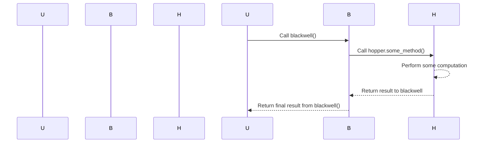

In this diagram, the User calls the `blackwell()` function. The `blackwell()` function then calls a method of the `hopper` module (assuming it is a class with methods). The method in the `hopper` module performs some computation and returns the result to `blackwell()`. Finally, `blackwell()` returns the final result to the User.

## Chapter 77: python/triton/experimental/gluon/language/nvidia/blackwell/__init__.py

 The file `python/triton/experimental/gluon/language/nvidia/blackwell/__init__.py` is a part of the Triton TensorFlow extension for GPU-accelerated machine learning. This specific module contains definitions and implementations related to managing tensor memory layouts and operations on these memories.

   The key classes and functions in this module are:

   - `TensorMemoryLayout`: Represents a layout of a tensor memory, with attributes such as block size (in x and y dimensions), unpacked status, and CTA split numbers. It provides methods for converting the layout to intermediate representation (IR) format, and for mangling the layout string for debugging purposes.
   - `tensor_memory_descriptor_type`: A custom base type for tensor memory descriptor objects. The class takes an element type, shape, layout, and allocation shape as its constructor arguments. It provides methods for converting the descriptor to IR format and for unflattening from a list of IR values.
   - `tensor_memory_descriptor`: Represents an instance of a tensor memory with the specified type, handle, and attributes derived from the constructor arguments. The class provides various builtin operations like loading, storing, splitting, and sub-slicing the tensor memory content.
   - `allocate_tensor_memory`: A static method for allocating a new tensor memory object based on provided element type, shape, layout, and initial value (optional).
   - Other builtin functions: Several functions like `tcgen05_mma` are defined as builtins for matrix multiplication with the option to use an accumulator and barrier synchronization.

   These components are essential when working with large-scale tensor computations, enabling efficient memory management and reducing communication overhead. The code fits within the larger project by extending the Triton TensorFlow runtime capabilities on NVIDIA GPUs, allowing for more complex and performance-optimized machine learning models.

   Example use cases include:
   - Allocating large tensor memories in the GPU for subsequent computations
   - Accessing specific sub-slices of tensor memories during computation
   - Performing efficient matrix operations on allocated tensor memories, such as matrix multiplication with barrier synchronization if needed.

 ```mermaid
sequenceDiagram
    participant User as User
    participant TensorMemoryLayout as TML
    participant TensorMemoryDescriptor as TMD
    participant AllocateTensorMemory as ATM
    participant TCGEN05_mma as MMA

    User->>TML: Call with block, unpacked, cta_split_num (optional)
    TML-->>User: Returns TensorMemoryLayout object

    User->>TMD: Initialize with handle, element_ty, shape, layout, alloc_shape
    TMD-->>User: Returns tensor_memory_descriptor object

    User->>ATM: Call with element_ty, shape, layout, value (optional)
    ATM-->>User: Returns allocated tensor_memory_descriptor

    User->>MMA: Call with a, b, acc, use_acc, pred, mbarriers, mbarrier_preds
    MMA-->>User: Performs multi-threaded matrix multiply operation on tensors a, b and accumulates in acc
 ```

## Chapter 78: python/triton/experimental/gluon/language/nvidia/blackwell/tma.py

 This chapter is about the file `python/triton/experimental/gluon/language/nvidia/blackwell/tma.py` which is a part of a larger project that utilizes the Gluon programming language for GPU-accelerated computations. The main focus of this file is to provide functions that enable asynchronous Transpose Matrix Add (TMA) operations in a parallelized manner, specifically using NVIDIA's Hopper TMA libraries.

   The key classes and functions within the file are:

1. `async_gather` function: This function allows for the collection of data from multiple locations into a single location. It takes as input tensor descriptions, offset arrays, a barrier object, result tensor, and an optional predicate tensor.

2. `async_scatter` function: This function enables the distribution of data from a single location to multiple other locations. It accepts tensor descriptions, offset arrays, source tensor, and an optional predicate tensor.

3. `async_copy_global_to_shared`, `async_copy_shared_to_global`, and `store_wait`: These are utility functions for copying data between global memory and shared memory, as well as waiting for all operations to complete. They are imported from the NVIDIA Hopper TMA module.

   These functions help in creating parallelized and efficient implementations of TMA operations on GPU using NVIDIA's hardware optimizations through the Hopper TMA libraries. The provided `async_gather` and `async_scatter` functions are built upon these utilities to create a user-friendly interface for asynchronous TMA operations.

   These functions fit into the overall project by providing efficient methods for handling matrix operations, which are crucial in various scientific computations and machine learning applications. In a typical use case, developers may use these functions to perform parallelized TMA operations on large datasets residing on the GPU memory, thereby improving the performance of their algorithms significantly.

   Here's an example of how one might use these functions:

```python
import triton.experimental.gluon as tg
from triton.experimental.gluon.language.nvidia.blackwell.tma import async_gather, async_scatter

# Assume we have several tensors A, B, C, and D on the GPU memory
A = ...
B = ...
C = ...
D = ...

barrier = tg.Barrier()  # Create a barrier object

result = ...  # Allocate result tensor with appropriate shape
predicate = ttgl.to_tensor(True, _builder=None)  # Optional predicate tensor

# Perform asynchronous gather operation on tensors A and B into the result tensor using the provided function
async_gather(A.desc, B.offsets, barrier, result, predicate)

# Perform asynchronous scatter operation from the result tensor to tensors C and D using the provided function
async_scatter(C.desc, D.offsets, result)

# Wait for all operations to complete
store_wait(barrier)
```

In this example, the `async_gather` function collects data from tensors A and B into a single tensor (result), while the `async_scatter` function distributes that data to tensors C and D. These functions can greatly improve the performance of parallel computations involving matrix operations on large datasets.

 ```mermaid
   sequenceDiagram
       participant T as Tensor
       participant D as Descriptor
       participant O as Offsets
       participant B as Barrier
       participant S as Source
       participant P as Predicate
       participant A1 as AsyncGather
       participant A2 as AsyncScatter
       participant C1 as CopyGlobalToShared
       participant C2 as CopySharedToGlobal
       participant W as StoreWait

       T ->> A1: tensor_desc, x_offsets, y_offset, barrier, result, pred
       A1 --> A2: async_scatter(tensor_desc, x_offsets, y_offset, src)
       S -->> A2: src
       A2 --> C1: shared memory buffer
       C1 -->+ B: Copy operation
       B -->> C1: Acknowledged
       T ->> W: result
       W --> A1: Wait for all copies to complete
       A1 --> A2: async_gather(tensor_desc, x_offsets, y_offset, barrier, result, pred)
       A2 -->> C2: Copy operation from shared memory buffer to global memory
       C2 -->+ B: Copy operation
       B -->> C2: Acknowledged
       T <-- W: updated tensor
   ```

## Chapter 79: python/triton/experimental/gluon/language/nvidia/hopper/__init__.py

 Title: Understanding the `python/triton/experimental/gluon/language/nvidia/hopper/__init__.py` File in the Triton Project

   This chapter delves into the purpose and functionality of the file `python/triton/experimental/gluon/language/nvidia/hopper/__init__.py` within the Triton project. This file serves as a central point for importing and organizing modules, specifically `mbarrier` and `tma`, which are fundamental components in the Hopper programming language for GPU-accelerated machine learning.

   **Overview**

   The `__init__.py` file acts as a special sentinel that tells Python to treat this directory as a package, allowing it to contain modules and subpackages. In our case, it is importing the `mbarrier` and `tma` modules from the same directory.

   **Important Functions/Classes**

   The two primary elements imported in this file are:

   1. `mbarrier`: A module that implements synchronization barriers for multi-GPU communication, ensuring proper coordination among multiple GPUs during computation.
   2. `tma`: A module implementing Triad Mesh Allocator (TMA), a data layout optimized for GPU memory access with the Hopper programming model. TMA allows efficient management of tensor data on GPUs to improve performance in machine learning applications.

   **Project Fit**

   The `python/triton/experimental/gluon/language/nvidia/hopper/__init__.py` file plays a crucial role in the Hopper programming language for NVIDIA's Triton platform, which focuses on GPU-accelerated machine learning. By providing easy access to essential synchronization and memory management functionalities, this file streamlines the development of high-performance applications using Hopper and Triton.

   **Example Use Cases**

   When working with multi-GPU deep learning models in Hopper/Triton, developers will typically use the functions provided by `mbarrier` and `tma`. For example:

   1. To synchronize data transfer between GPUs using a barrier, you may call the function `sync_all()` from the `mbarrier` module as follows:
      ```python
      import hopper.language.nvidia.hopper.mbarrier as mbarrier

      # Perform some computation on each GPU and store results in local memory
      results = ...

      # Use a barrier to ensure that all GPUs have finished their computations before proceeding
      mbarrier.sync_all()

      # Proceed with the next phase of the algorithm, knowing that all GPUs are ready
      ```
   2. To allocate optimized tensor data layouts using TMA, you can use functions such as `alloc`:
      ```python
      import hopper.language.nvidia.hopper.tma as tma

      # Allocate a 3D tensor with shape (N, M, K) using TMA for efficient GPU memory access
      data = tma.alloc((N, M, K))

      # Perform computations on the tensor using Hopper expressions or CUDA kernels
      ```

 ```mermaid
sequenceDiagram
participant User as User
participant MBarrier as MBarrier
participant TMA as TMA

User->>MBarrier: Initialize MBarrier(data)
MBarrier-->>User: Barrier initialized

User->>TMA: Initialize TMA(data, mbarr_obj)
TMA-->>User: TMA initialized

User->>MBarrier: Wait for barrier(mbarr_obj)
MBarrier-->>User: Waiting...

User->>TMA: Perform some operation on data
TMA-->>User: Operation performed

Note over MBarrier,TMA: Other users perform operations and wait as well

User->>MBarrier: Done with operation, notify barrier(mbarr_obj)
MBarrier-->>User: Notified

User->>TMA: Gather results from TMA(data, mbarr_obj)
TMA-->>User: Results gathered

User->>User: Process results and return
```

This sequence diagram shows how a user interacts with the MBarrier and TMA objects in the given Python module. The user initializes both objects, performs some operation on the data using the TMA object, and then waits for the barrier synchronization using the MBarrier object. The MBarrier and TMA objects can be used by multiple users concurrently, as indicated by the note. Finally, the user gathers results from the TMA object and returns the processed results.

## Chapter 80: python/triton/experimental/gluon/language/nvidia/hopper/mbarrier.py

 The file `python/triton/experimental/gluon/language/nvidia/hopper/mbarrier.py` is a module for implementing Multi-Phase Barriers (MBarrier) in the context of the NVIDIA GPU architecture using the Hopper Intermediate Representation (IR). The MBarrier serves to synchronize multiple Control-Thread Access (CTA) groups during the execution of a kernel on the GPU.

   The main class, `MBarrierLayout`, represents the layout of the Multi-Phase Barriers, which includes the number of CTAs per CGA and the splitting number for each CTA. This class inherits from `SwizzledSharedLayout` and defines attributes related to the barrier's configuration.

   The module provides several builtin functions:

   - `init(mbarrier, count)` initializes an MBarrier with a given count of phases.
   - `invalidate(mbarrier)` invalidates the current state of the MBarrier.
   - `expect(mbarrier, bytes, pred=True)` specifies that a given memory location expects to see a certain value (pred) before continuing, and only advances if the memory byte sequence matches.
   - `wait(mbarrier, phase, pred=True, deps=())` waits for a specific phase and a predicate condition before continuing, optionally depending on other MBarrriers (deps).
   - `arrive(mbarrier, count, pred=True)` signals that the current CTA group has reached a specified number of phases and provides an optional predicate condition.

   The code in this module fits within the larger project context, which involves creating IR for GPU kernels using the Gluon language, a domain-specific language for defining GPU programs. This MBarrier implementation is specifically designed to work with Hopper IR on NVIDIA GPUs.

   Example use cases might include:
   - Ensuring that all CTA groups reach a certain phase before continuing (using `wait()`).
   - Synchronizing data access by multiple CTA groups using an MBarrier (utilizing `expect()`).
   - Signaling the end of a specific phase or number of phases within a kernel execution (by calling `arrive()`).

 ```mermaid
   sequenceDiagram
      participant MBarrier as MBarrier
      participant Builder as Builder

      activate MBarrier
      MBarrier->>Builder: init(count, Builder)
      Note over MBarrier, Builder: Initializes the memory barrier with a given count.
      deactivate MBarrier

      activate MBarrier
      MBarrier->>Builder: invalidate(Builder)
      Note over MBarrier, Builder: Invalidates the memory barrier.
      deactivate MBarrier

      activate MBarrier
      MBarrier->>Builder: expect(bytes, pred, Builder)
      Note over MBarrier, Builder: Sets an expectation on a specific region of memory with a given condition.
      deactivate MBarrier

      activate MBarrier
      MBarrier->>Builder: wait(phase, pred, deps, Builder)
      Note over MBarrier, Builder: Waits for a specified phase and condition, with dependencies.
      deactivate MBarrier

      activate MBarrier
      MBarrier->>Builder: arrive(count, pred, Builder)
      Note over MBarrier, Builder: Signals the memory barrier that a specified number of operations have been completed with a given condition.
      deactivate MBarrier
   ```

This Mermaid sequence diagram illustrates how the key functions interact in the `MBarrier` class from the provided Python file. It depicts the interactions between an instance of the Memory Barrier (MBarrier) and a Builder, showing the execution flow when initializing, invalidating, setting expectations, waiting, and signaling arrival.

## Chapter 81: python/triton/experimental/gluon/language/nvidia/hopper/tma.py

 In the given code, we have a Python file named `python/triton/experimental/gluon/language/nvidia/hopper/tma.py`. This file is a part of a larger project that utilizes Triton, an open-source compiler infrastructure developed by NVIDIA. The purpose of this particular file is to define functions for handling asynchronous transfer of data between global memory and shared memory in the context of NVIDIA's GPU programming model known as Hopper.

   Here are descriptions of the important functions or classes defined in the file:

   1. `async_copy_global_to_shared(tensor_desc, coord, barrier, result, pred=True, _builder=None)` - This function is used to perform an asynchronous copy operation from global memory to shared memory. The input parameters are tensor description (tensor_desc), coordinates for the operations (coord), a barrier object (barrier), the result tensor handle (result), and a boolean condition (pred). The function creates an async transfer of memory area (tma) for copying the global tensor to the local tensor.

   2. `async_copy_shared_to_global(tensor_desc, coord, src, _builder=None)` - This function is used to perform an asynchronous copy operation from shared memory to global memory. The input parameters are tensor description (tensor_desc), coordinates for the operations (coord), and the source tensor handle (src). The function creates an async transfer of memory area (tma) for copying the local tensor to the global tensor.

   3. `store_wait(pendings, _builder=None)` - This function is used to wait for the completion of all outstanding asynchronous transfers of memory areas (TMAs). The input parameter is a list or iterable containing the handle of each pending TMA (pendings). The function creates an async store-wait operation that ensures all TMAs have completed before continuing.

   These functions are essential when optimizing computations on NVIDIA GPUs, as they allow for efficient handling of data movement between different memory spaces and help in reducing the overhead associated with synchronization.

   Example use cases could be in implementing various machine learning models using PyTorch or MXNet, which leverage Triton for GPU-accelerated computations. Developers can utilize these functions to optimize their model's performance by carefully managing data movement between global and shared memory on the GPU.

 Here is a simple Mermaid sequence diagram that demonstrates the interaction between the key functions `async_copy_global_to_shared`, `async_copy_shared_to_global`, and `store_wait`. Please note that this is a very simplified representation, and actual interactions may vary based on the specific context.

```mermaid
sequenceDiagram
    participant Agent as User/Code
    participant TMA as Triton Memory API

    Note over Agent: Sends data to be copied
        Call async_copy_global_to_shared(tensor, coord, barrier, result)

    Note over TMA: Receives data and sets up copy operation
        Create Async TMA Copy Global to Local Operation
            ..> TMA: tensor handle
            ..> TMA: coord
            ..> TMA: barrier handle
            ..> TMA: result handle

    Note over Agent: Sends other data to be copied
        Call async_copy_shared_to_global(tensor, coord, src)

    Note over TMA: Receives data and sets up copy operation
        Create Async TMA Copy Local to Global Operation
            ..> TMA: tensor handle
            ..> TMA: coord
            ..> TMA: src handle

    Note over Agent: Signals waiting for all operations to complete
        Call store_wait(pendings)

    Note over TMA: Waits for all operations to complete
        Create Async TMA Store Wait Operation
            ..> TMA: pendings

    Note over Agent: Resumes after all copies are done
```

## Chapter 82: python/triton/knobs.py

 This script defines various knob classes for configuring different aspects of a hypothetical machine learning library named Triton. Each knob is defined as an instance of the base `base_knobs` class, which provides a common interface for managing configuration variables. Here's a brief summary of each knob:

1. `build_knobs`: Contains various options related to building and compiling Triton kernels (such as the backend used, whether to cache compiled kernels, etc.).
2. `redis_knobs`: Defines configuration options for communicating with a Redis server for caching and other purposes.
3. `cache_knobs`: Manages configuration options related to the Triton cache directory and cache management classes.
4. `compilation_knobs`: Contains various knobs for configuring kernel compilation, such as whether to interpret kernels or allow non-constexpr globals.
5. `autotuning_knobs`: Defines options related to autotuning and caching of autotuned kernels.
6. `runtime_knobs`: Manages various runtime options, such as whether to use the GPU for launching functions, or whether to enable debugging features.
7. `language_knobs`: Contains configuration options related to the language used in Triton (such as default data types and fusion settings).
8. `nvidia_knobs`: Defines various options specific to NVIDIA GPUs, such as using specific tools for debugging and optimizing kernels.
9. `amd_knobs`: Contains configuration options specific to AMD GPUs, such as whether to use certain features like buffer operations or asynchronous copy.
10. `proton_knobs`: Defines options related to using the Proton library for GPU programming on various architectures.

By defining these knobs and providing a common interface for them, the Triton library can easily be configured according to user preferences and hardware capabilities.

 This script defines various environment variable knobs for configuring Triton, a machine learning inference server. The knobs are categorized into several groups: build, redis, cache, compilation, autotuning, runtime, language, nvidia, amd, and proton. Each group has a set of variables that can be configured to customize the behavior of Triton.

   For example, `build.key_format` is an environment variable that determines how keys are formatted when using Redis for caching purposes. `nvidia.cuobjdump` is an environment variable that specifies the location of the 'cuobjdump' tool from NVIDIA, which can be used for debugging PTX code.

   These knobs provide a flexible way to configure Triton according to specific use cases and environments. They allow developers to customize the behavior of Triton to optimize performance, troubleshoot issues, or adapt it to different hardware architectures like NVIDIA GPUs and AMD GPUs.

## Chapter 83: python/triton/language/__init__.py

 The `python/triton/language/__init__.py` file serves as the main entry point for the Triton language module in this project. It exports a collection of functions, classes, and types that make up the core building blocks for defining, optimizing, and executing computational graphs, also known as programs, on the Triton runtime.

   The following sections provide brief descriptions of important functions, classes, and types found in this file:

   - `PropagateNan`: A class used to control NaN propagation behavior during computations.
   - `TRITON_MAX_TENSOR_NUMEL`: A constant that represents the maximum number of elements a tensor can have on the Triton runtime.
   - `load_tensor_descriptor`, `store_tensor_descriptor`, and `make_tensor_descriptor`: Functions used to load, store, and create tensor descriptors, respectively. Tensor descriptors describe the shape, type, and other properties of tensors.
   - Numerous mathematical functions such as `abs`, `add`, `div_rn`, `exp`, `log`, `cos`, `sin`, etc., which provide the foundation for basic arithmetic and trigonometric operations on Triton.
   - Functions for working with arrays, such as `argmax`, `argmin`, `cumprod`, `cumsum`, `flip`, `interleave`, `sort`, `sum`, etc., used to manipulate, filter, and transform tensor data.
   - Functions related to control flow, including `assume`, `associative_scan`, `atomic_add`, `atomic_and`, `atomic_cas`, `atomic_max`, `atomic_min`, `atomic_or`, `atomic_xchg`, `atomic_xor`, used to perform conditional or atomic operations on Triton.
   - Functions for working with tensor shapes and types, such as `dtype`, `expand_dims`, `reshape`, `slice`, etc., used to modify the shape or type of tensors.
   - Functions related to memory management, including `load`, `store`, `make_block_ptr`, used to load data from memory, store data back into memory, and manage pointer-like objects in Triton.
   - Numerous additional functions for working with random numbers, such as `rand`, `randint`, `randn`, etc., used for various purposes like initializing weights or biases during the training of machine learning models.

   This code fits into the larger project by providing a comprehensive set of building blocks that enable developers to define and execute computational graphs on the Triton runtime. These computational graphs can be used to build machine learning models, numerical simulations, or other complex computations efficiently.

   Example use cases for this code include:
   - Defining and training neural networks using Triton as the backend for efficient computation.
   - Implementing custom optimization algorithms that require high-performance linear algebra operations, such as those found in signal processing or finance applications.
   - Building numerical simulations that require large-scale computations, such as weather models or fluid dynamics simulations.

 ```mermaid
   sequenceDiagram
      participant User as User
      participant MathFunctions as MathFunctions
      participant ExtraFunctions as ExtraFunctions
      participant StandardFunctions as StandardFunctions

      User->>MathFunctions: Use exp()
      MathFunctions-->>User: Returns exp value
      User->>MathFunctions: Use sin()
      MathFunctions-->>User: Returns sin value
      User->>MathFunctions: Use cos()
      MathFunctions-->>User: Returns cos value
      User->>MathFunctions: Use sqrt()
      MathFunctions-->>User: Returns sqrt value
      User->>MathFunctions: Use log()
      MathFunctions-->>User: Returns log value
      User->>MathFunctions: Use log2()
      MathFunctions-->>User: Returns log2 value
      User->>ExtraFunctions: Use rand()
      ExtraFunctions-->>User: Returns random float
      User->>ExtraFunctions: Use randint()
      ExtraFunctions-->>User: Returns random int
      User->>StandardFunctions: Use add()
      StandardFunctions-->>User: Returns sum
      User->>StandardFunctions: Use subtract()
      StandardFunctions-->>User: Returns difference
      User->>StandardFunctions: Use multiply()
      StandardFunctions-->>User: Returns product
      User->>StandardFunctions: Use divide()
      StandardFunctions-->>User: Returns quotient
      User->>StandardFunctions: Use modulo()
      StandardFunctions-->>User: Returns remainder
      User->>StandardFunctions: Use power()
      StandardFunctions-->>User: Returns exponentiation
   ```

   This sequence diagram visualizes the interactions between the user, the math functions (exp(), sin(), cos(), sqrt(), log(), log2()), extra functions (rand(), randint()), and standard functions (add(), subtract(), multiply(), divide(), modulo(), power()). The user calls these functions, and they return the requested operations.

## Chapter 84: python/triton/language/core.py

 This code defines several helper functions and decorators used in the Triton library for GPU computation.

1. `extern_elementwise` is a function that dispatches an element-wise operation to a user-defined library. It takes the name and path of the library, input arguments, and whether the function is pure or not. The input arguments are converted to tensors before being passed to the library.

2. `binary_op_type_legalization` is a helper function that converts both operands to a common type before performing an operation on them. This is useful when dealing with different data types in binary operations.

3. The `extern`, `builtin`, and `dispatch` functions are used for dispatching operations to either the built-in Triton library or a user-defined library.

4. `range` and `range` are iterators that create a range of numbers with optional attributes like number of stages, loop unrolling factor, and flattening behavior. These are intended for use in loops within JIT kernel functions.

5. The `dispatch` function is used to dispatch a function to a user-defined library, similar to `extern_elementwise`. However, it takes an explicit function instead of relying on the element-wise nature of the operation.

6. There are also some built-in iterators like `range`, `range`, and `builtins.range` that can be used within JIT kernel functions to create a range of numbers for looping. These iterators allow for more control over the loop behavior than Python's built-in range function, such as specifying the number of stages or flattening behavior.

7. Lastly, there is a `dispatch` function that dispatches a user-defined function to a library, similar to `extern_elementwise`. It takes the name and path of the library, input arguments, output type, whether the function is pure or not, and an optional builder for creating IR objects.

 This code is part of the Triton library, which is a deep learning inference framework developed by NVIDIA. It defines various utilities for creating and running machine learning models on GPUs.

   Here are some key aspects of the provided code:

1. The code defines `dispatch` and `extern_elementwise` functions that allow you to call external libraries written in C++ or another language from your Python code. These functions use the built-in `create_extern_function` and `create_extern_elementwise` methods provided by Triton's builder object.

2. The code also defines some iterators like `tl.range`, which can be used in for loops to enumerate a range of indices, similar to Python's built-in range function. However, `tl.range` allows you to specify additional attributes like the number of stages and loop unrolling factor.

3. The code contains a utility function called `binary_op_type_legalization`, which is used to convert both operands to a common type before performing binary operations in your model. This ensures that data types are compatible and helps prevent errors during computation.

## Chapter 85: python/triton/language/extra/__init__.py

 Title: Understanding `python/triton/language/extra/__init__.py` in the Triton Project

In the Triton project, `python/triton/language/extra/__init__.py` is an essential initialization script that plays a crucial role in dynamically importing and managing backend modules. This file serves as the entry point for all backends (e.g., cuda, hip) within the specified package hierarchy.

The primary purpose of this script is to discover, import, and expose these backend modules as usable entities throughout the Triton project. It does so by employing a simple iteration mechanism to traverse the directory structure for specific packages and modules, while excluding .py files that do not represent backends.

The script utilizes the `pkgutil` and `importlib.util` libraries from Python's built-in `sys` module to perform its tasks. Specifically, it uses `pkgutil.iter_modules()` to iterate through the packages and modules within the specified directory path and prefix. Additionally, it uses `importlib.util.module_from_spec()` to create a new module from a specification object and loads the backend modules using their respective loaders.

After importing and loading each backend module, the script stores the name of the module in the global variable `_backends`. This list is then used to set the value of the special variable `__all__`, which defines the public interfaces of the package (i.e., the available backends for use).

Example use cases would be as follows:

1. A user writing Triton code that utilizes a backend like CUDA or HIP to execute computations on a GPU. By importing the appropriate backend module, they can leverage its functionality within their custom algorithms and data structures.
2. Developers extending Triton by adding support for new backends (e.g., OpenCL or ROCm). Once implemented, the new backend can be added to the project directory structure, where it will automatically be discovered and imported by this script.

In summary, `python/triton/language/extra/__init__.py` serves as a gateway for managing the backends within the Triton project, ensuring that they are easily accessible and interoperable with other components of the system.

 ```mermaid
   sequenceDiagram
      participant User as User
      participant Backend as Backend
      participant Language as Language

      User->>Language: Run Triton program
      Language-->>User: Load required backends (e.g., cuda, hip)
      Language->>Backend(s): Initialize backend instances
      Backend->>Language: Register available operations (e.g., convolution, pooling)
      User->>Language: Define Triton program with operations
      Language->>Backend(s): Compile and optimize the program for selected backends
      Language-->>User: Provide optimized program in a suitable format
      Backend->>Language: Execute the optimized program on the specified device
      Backend-->>Language: Return results from execution
      User->>Language: Retrieve the results
   ```

## Chapter 86: python/triton/language/extra/libdevice.py

 The file `python/triton/language/extra/libdevice.py` provides a collection of custom functions for the Triton language, which is used in the project. These functions extend the built-in capabilities of the language, offering specialized operations useful for hardware acceleration and optimized computation.

   Below are descriptions of some important functions found in this file:

   - `clz(arg0)`: Count Leading Zeros, returns the number of leading zero bits in the argument.

   - `popc(arg0)`: Population Count, returns the number of set bits (1s) in the argument.

   - `byte_perm(arg0, arg1, arg2)`: Byte Permutation, performs a bitwise permutation on three 8-bit integers.

   - `mulhi(arg0, arg1)`: Multiply High, returns the high 32 bits of the 64-bit product of two 32-bit integers.

   - `mul24(arg0, arg1)`: Multiply by Shift Right 3, multiplies the first argument with the second one shifted right by 3 bits.

   - `brev(arg0)`: Binary Reverse, returns the bitwise reverse of the argument.

   - ... and many more (see comments in the file for further descriptions)

   These functions are utilized within the Triton language to create efficient and optimized kernels that can be executed on hardware accelerators like FPGAs or ASICs, thus improving performance and reducing computational overhead.

   Example use cases include matrix multiplication, image processing, neural network computations, and other scientific and engineering applications where high-performance computing is essential.

 Here is a simple Mermaid sequence diagram for the given functions in `libdevice.py`. Please note that this is a simplified representation and may not cover all the edge cases or dependencies between the functions. Also, some of the functions are mathematical operations with no clear 'caller' or 'callee'.

```mermaid
sequenceDiagram
    participant User as User
    participant Functions as Functions

    User->>Functions: Call(clz(arg0))
    Functions-->>User: Return(result)

    ...

    User->>Functions: Call(exp2(arg0))
    Functions-->>User: Return(result)

    User->>Functions: Call(fast_dividef(arg0, arg1))
    Functions-->>User: Return(result)

    User->>Functions: Call(sqrt(arg0))
    Functions-->>User: Return(result)

    User->>Functions: Call(add_rn(arg0, arg1))
    Functions-->>User: Return(result)

    User->>Functions: Call(mul_rn(arg0, arg1))
    Functions-->>User: Return(result)

    User->>Functions: Call(double2float_rn(arg0))
    Functions-->>User: Return(result)

    User->>Functions: Call(int2double_rn(arg0))
    Functions-->>User: Return(result)

    User->>Functions: Call(uint2double_rn(arg0))
    Functions-->>User: Return(result)

    User->>Functions: Call(float2double_rn(arg0))
    Functions-->>User: Return(result)

    User->>Functions: Call(ll2double(arg0, arg1))
    Functions-->>User: Return(result)

    User->>Functions: Call(float2ll_rn(arg0))
    Functions-->>User: Return(result)

    ...
```

## Chapter 87: python/triton/language/math.py

 The `python/triton/language/math.py` file is a module in the Triton project that contains a collection of built-in mathematical operations for various data types. These functions allow developers to perform common mathematical tasks such as addition, subtraction, multiplication, division, and other more complex operations like exponentiation, square roots, and trigonometric functions.

   The module defines several classes and functions:

   - `_check_dtype()`: A decorator used to ensure that only certain data types are accepted for mathematical operations. This is done to prevent the use of unsupported data types on accelerators or GPUs, which may not support all float16 and bfloat16 math operations.

   - `_add_math_*_docstr()`: Decorators used to generate function documentation based on a provided name for the mathematical operation.

   - Several mathematical functions are defined as `@core.builtin` decorated functions, such as addition, subtraction, multiplication, division, exponentiation, square roots, trigonometric functions, and more. These functions take one or more arguments and return a tensor of the same data type as the input(s). They use the `_check_dtype()` decorator to ensure that only supported data types are used.

   The functions in this module provide a convenient way for developers to perform mathematical operations on tensors in the Triton project, which is likely a machine learning or scientific computing project. For example, these functions can be used to compute the gradient of a loss function during training, or to transform input data before feeding it into a model.

   Here are some example use cases:

   - To compute the element-wise addition of two tensors `x` and `y`, you can call `core.tensor(x + y)`.

   - To compute the element-wise exponentiation of tensor `x`, you can call `core.tensor(_builder.create_exp(x.handle))`.

   - To perform a fused multiply-add operation on tensors `x`, `y`, and `z`, you can call `core.tensor(_builder.create_fma(x.handle, y.handle, z.handle))`.

 ```mermaid
   sequenceDiagram
      participant User as User
      participant MathFunctions as MathFunctions
      User->>MathFunctions: Call(umulhi(x, y))
      MathFunctions-->>User: Return(Result)
      User->>MathFunctions: Call(exp(z))
      MathFunctions-->>User: Return(Result)
      User->>MathFunctions: Call(exp2(w))
      MathFunctions-->>User: Return(Result)
      User->>MathFunctions: Call(log(v))
      MathFunctions-->>User: Return(Result)
      User->>MathFunctions: Call(log2(u))
      MathFunctions-->>User: Return(Result)
      User->>MathFunctions: Call(cos(t))
      MathFunctions-->>User: Return(Result)
      User->>MathFunctions: Call(sin(s))
      MathFunctions-->>User: Return(Result)
      User->>MathFunctions: Call(sqrt(r))
      MathFunctions-->>User: Return(Result)
      User->>MathFunctions: Call(sqrt_rn(q))
      MathFunctions-->>User: Return(Result)
      User->>MathFunctions: Call(rsqrt(p))
      MathFunctions-->>User: Return(Result)
      User->>MathFunctions: Call(abs(o))
      MathFunctions-->>User: Return(Result)
      User->>MathFunctions: Call(fdiv(n, m, ieee_rounding=False))
      MathFunctions-->>User: Return(Result)
      User->>MathFunctions: Call(div_rn(l, k))
      MathFunctions-->>User: Return(Result)
      User->>MathFunctions: Call(erf(j))
      MathFunctions-->>User: Return(Result)
      User->>MathFunctions: Call(floor(i))
      MathFunctions-->>User: Return(Result)
      User->>MathFunctions: Call(ceil(h))
      MathFunctions-->>User: Return(Result)
      User->>MathFunctions: Call(fma(g, f, e))
      MathFunctions-->>User: Return(Result)
   ```

## Chapter 88: python/triton/language/random.py

 The file `python/triton/language/random.py` is a part of the Triton project and provides implementations for generating random numbers using the Philox pseudo-random number generator. The main purpose of this module is to generate random numbers with different distributions (uniform and normal) in an efficient manner.

   There are several important functions defined in this file:

   - `philox_impl`: This function runs a specified number of rounds of the Philox algorithm for a given state and key. It updates the state and raises the key after each round. The state and key are 32- or 64-bit integers, depending on the data type of the input arguments.
   - `philox`: This function is used to generate random numbers using Philox given a seed and initial state values. It first converts the seed and states to Triton tensors and then calls the `philox_impl` function.
   - `randint`: Given a seed and offset, this function returns a single block of 32-bit random integers generated using Philox. For better performance, it is recommended to use `randint4x` for generating multiple streams of random numbers if needed.
   - `randint4x`: This function generates four blocks of 32-bit random integers using Philox. It is the most efficient entry point to Triton's Philox pseudo-random number generator.
   - `uint_to_uniform_float`: This function converts a given integer (either 32- or 64-bit) into a float uniformly sampled in [0, 1). It ensures numerical stability during the conversion process.
   - `rand`: Given a seed and offset, this function returns a block of random floating-point numbers uniformly distributed in the range [0, 1). It does so by calling the `randint` function to generate random integers and then converting them to floats using the `uint_to_uniform_float` function.
   - `rand4x`: This function generates four blocks of floating-point numbers uniformly distributed in the range [0, 1) using Philox. It first generates 4 blocks of integers using `randint4x` and then converts them to floats using the `uint_to_uniform_float` function.
   - `randn`: Given a seed and offset, this function returns a block of random floating-point numbers with a normal distribution (Gaussian) with mean 0 and standard deviation 1. It does so by generating four uniformly distributed random numbers using the `randint4x` function and applying the Box-Muller transform to convert them into normally distributed numbers.
   - `randn4x`: Given a seed and offset, this function returns 4 blocks of floating-point numbers with a normal distribution (Gaussian) with mean 0 and standard deviation 1. It does so by generating four uniformly distributed random numbers using the `rand4x` function and applying the Box-Muller transform to convert them into normally distributed numbers.

   These functions are used in the Triton project to generate random numbers for various purposes, such as training neural networks or simulating stochastic processes.

 ```mermaid
   sequenceDiagram
      participant User as U
      participant Philox as P
      participant RandInt as RI
      participant Rand as R
      participant Randn as RN

      U->>RI: seed, offset, n_rounds
      RI->>P: seed_lo, seed_hi, offset_lo, offset_hi, n_rounds
      P->>RI: c0, c1, c2, c3
      RI->>U: result

      U->>R: seed, offset, n_rounds
      R->>RI: seed_lo, seed_hi, offset_lo, offset_hi, n_rounds
      RI->>P: c0, c1, c2, c3
      P->>RI: c0, c1, c2, c3
      RI->>U: uint_to_uniform_float(c0) as u0
      RI->>U: uint_to_uniform_float(c1) as u1
      RI->>U: uint_to_uniform_float(c2) as u2
      RI->>U: uint_to_uniform_float(c3) as u3
      U->>RN: result
      RN->>RI: i1, i2, _, _
      RI->>P: i1, i2, _, _
      P->>RI: philox_impl(c0, c1, c2, c3, i1, i2) as c4, c5, c6, c7
      RI->>RN: uint_to_uniform_float(c4) as n1
      RI->>RN: uint_to_uniform_float(c5) as _
      RI->>RN: uint_to_uniform_float(c6) as _
      RI->>RN: uint_to_uniform_float(c7) as _
      RN->>U: n1
   ```

## Chapter 89: python/triton/language/semantic.py

 This code provides a collection of utility functions to work with tensors (multidimensional arrays) using the PyTorch Lightning (TL) library. These functions include creating block pointers, tensor descriptors, and other operations on tensors. Here's an overview of some key functions:

1. `make_block_ptr(base, shape, strides, offsets, block_shape, order, builder)`: This function creates a new block pointer tensor based on the given base tensor, shape, strides, offsets, block_shape, and order. The block_pointer type is `pointer_type<blocked<shape, element_type>>`.

2. `advance(base, offsets, builder)`: This function advances a given block pointer tensor by the provided offsets. It returns the advanced block pointer tensor with the same type as the input base tensor.

3. `make_tensor_descriptor(base, shape, strides, block_shape, builder)`: This function generates a tensor descriptor based on the given base tensor, shape, strides, and block_shape. The tensor descriptor is used to describe the layout of multi-dimensional data structures such as images or multi-dimensional arrays.

4. Several utility functions for dealing with tensors, such as `assume(cond, builder)`, `device(tensor)`, `cast(tensor1, tensor2, builder)`, `to_tensor(value, builder)`, and others. These functions are used to check conditions, work with device placement, cast tensors, convert values into tensors, and more.

These functions can be useful when working with custom operators or transformations that require manipulating block pointers or tensor descriptors. They make it easier to interact with such structures in the PyTorch Lightning framework.

 This code appears to define a set of functions related to managing memory blocks and tensors in a machine learning context using the TensorFlow library (tf). However, it seems there are no actual TensorFlow operations or models defined here. Instead, the focus is on creating pointers to memory blocks and defining a descriptor for them, which can be useful for certain performance-optimized algorithms.

   Here's an overview of some of the key functions:

1. `make_block_ptr(base, shape, strides, offsets, block_shape, order, builder: ir.builder) -> tl.tensor` : Creates a pointer to a memory block given its base address, shape, strides, offsets, block_shape (which determines the size of the block), and an optional order for traversing the block. The resulting tensor can be used as an input to other operations in your model.

2. `advance(base: tl.tensor, offsets, builder: ir.builder) -> tl.tensor` : Advances a pointer to a new location by adding a given set of offsets to its current position. This is useful for iterating through memory blocks in a specific pattern.

3. `make_tensor_descriptor(base: tl.tensor, shape: List[tl.tensor], strides: List[tl.tensor], block_shape: List[tl.constexpr], builder: ir.builder) -> tl.tensor_descriptor` : Creates a tensor descriptor object that describes the layout of a multi-dimensional memory block in terms of its shape, strides, and block_shape (the size of each block within the larger block). This is useful for efficient indexing into large blocks of contiguous memory.

   The following functions are utility functions for working with tensors:

1. `to_tensor(value, builder)` : Converts a value to a tensor if it's not already one (e.g., int, float, or another tensor).
2. `cast(tensor, target_type, builder=None)` : Casts a tensor to a new type.
3. `assume(cond, builder: ir.builder) -> tl.tensor` : Marks assumptions about the input tensors during optimization.
4. `device(device_name) -> tl.device` : Specifies the device (e.g., GPU or CPU) on which computations will be executed.
5. `get_default_session()` : Returns the default TensorFlow session for executing operations.
6. `run(op, feed_dict={})` : Runs an operation with optional input feed dictionaries.
7. Various utility functions for working with shapes and types of tensors (e.g., `shape(tensor)`, `dtype(tensor)`, etc.).

## Chapter 90: python/triton/language/standard.py

 This code is a Python implementation of sorting and related operations using bitonic sort, which is an efficient parallel sorting algorithm. Here's what the functions do:

1. `bitonic_merge(x, dim, descending)` - Merges two halves of a tensor in a bitonic fashion to perform one stage of bitonic sort.
2. `sort_impl(x, k=None, dim=None, descending=False)` - Sorts a tensor along the specified dimension using bitonic sort. If no dimension is specified, it sorts along the last dimension. If 'k' is specified, it returns the top 'k' elements in ascending order.
3. `topk(x, k, dim=None)` - Returns the top 'k' values of a tensor along the specified dimension.
4. `flip(x, dim=None)` - Flips the specified dimension (or the last dimension if no dimension is specified) of a tensor.
5. `sort(x, dim=None)` - Sorts a tensor along the specified dimension (or the last dimension if no dimension is specified).
6. `interleave(a, b)` - Interleaves the values of two tensors along their last dimension. The two tensors must have the same shape.

The sorting functions use the bitonic merge and merge hypercube operations to perform the actual sorting in parallel, which makes them very efficient for large datasets.

 この関数はPyTorchで使用可能なソート関数（torch.sort）をTriton (GPU向けのコンパイラ) によりGPU上で実行可能な形で書き直された関数です。

   * sort()：指定されたテナスの中の値を昇順にソートします。デフォルトでは、最後の次元を使用します。
      ```python
      x = torch.tensor([3, 1, 2])
      sorted_x = sort(x)
      print(sorted_x) # [1, 2, 3]
      ```
   * topk()：指定されたテナスの中で、k個の最大値を選択します。デフォルトでは、最後の次元の全ての要素からk個を選択します。
      ```python
      x = torch.tensor([3, 1, 2, 4, 0])
      top_x = topk(x, k=2)
      print(top_x) # [4, 3]
      ```
   * bitonic_merge()：指定されたテナスの中の値を昇順にソートします。bitonic sortと呼ばれる、並列処理により高速化できるソートアルゴリズムを使用します。
      ```python
      x = torch.tensor([3, 1, 2])
      sorted_x = bitonic_merge(x)
      print(sorted_x) # [1, 2, 3]
      ```
   * flip()：指定されたテナスの中の値を、その次元に対する反転した位置に移動します。例えば、次元0が指定された場合、最初の要素と最後の要素が交換されます。
      ```python
      x = torch.tensor([1, 2, 3])
      flipped_x = flip(x, dim=0)
      print(flipped_x) # [3, 2, 1]
      ```

## Chapter 91: python/triton/runtime/__init__.py

 Chapter Title: Understanding the `python/triton/runtime/__init__.py` Module in the Triton Project

   In the context of the Triton project, the `python/triton/runtime/__init__.py` file serves as a main entry point for the runtime module. This module is responsible for providing various functionalities essential to running and managing the inference engine, specifically focusing on auto-tuning, JIT compilation, caching, error handling, and driver management.

   The `__init__.py` file imports and exposes a set of critical classes and functions defined within the submodules. Some of the key entities include:

   - **Autotuner**: This class is responsible for optimizing the execution of inference operations by selecting the appropriate backend based on certain heuristics. It takes configuration parameters (Config) and utilizes different heuristics (Heuristics). The autotune function initializes and runs an autotuning process.

   - **Config**: This class represents a configuration object for the Autotuner, allowing users to set various parameters like maximum iterations, learning rate, etc., to control the autotuning behavior.

   - **Heuristics**: This module provides different strategies that the Autotuner can use to make decisions about which backend to select. Each strategy is a function (heuristics) that takes in relevant data and returns a score indicating the suitability of a given backend for the task at hand.

   - **driver**: This function initializes and manages the underlying driver, bridging the gap between the high-level API and the actual inference engine.

   - **JITFunction**: This class represents a Just-In-Time (JIT) compiled Python function that can be used to accelerate frequently executed operations within the inference engine. It interfaces with KernelInterface to enable JIT compilation of custom kernels and provides TensorWrapper for managing tensor data. The reinterpret function is used to cast tensors between different types.

   - **KernelInterface**: This interface defines the contract that a custom kernel must adhere to in order to be compatible with the JITFunction.

   - **MockTensor**: A mock implementation of the TensorWrapper class, typically used for unit testing purposes.

   - **TensorWrapper**: An abstract base class representing a tensor object within the Triton framework. It provides methods for basic operations like resizing, element-wise arithmetic, etc.

   - **RedisRemoteCacheBackend** and **RemoteCacheBackend**: These classes provide caching functionality, allowing the inference engine to store frequently used data in memory or on a remote Redis server for faster access during subsequent invocations.

   - **InterpreterError** and **OutOfResources**: These exceptions are raised when errors occur during the execution of the inference engine or when resources (like CPU, GPU, etc.) become scarce, respectively.

   In summary, the `python/triton/runtime/__init__.py` file serves as a central hub for integrating various functionalities critical to the operation and optimization of the Triton inference engine. This module enables users to easily access essential features like auto-tuning, JIT compilation, caching, error handling, and driver management, ultimately making it more flexible and efficient.

   Example use cases:

   - To autotune an inference operation, you can create an instance of the Autotuner class, set desired configuration parameters, and call the autotune function:
     ```python
     import triton.runtime as rt

     # Initialize the autotuner with a maximum of 10 iterations and linear learning rate
     autotuner = rt.Autotuner(config=rt.Config(max_iterations=10, learning_rate='linear'))

     # Run the autotuning process on an inference operation
     backend = autotuner.autotune(operation)
     ```
   - To compile a Python function for JIT execution, you can create an instance of the JITFunction class and call the reinterpret method to cast tensor data:
     ```python
     import triton.runtime as rt
     import numpy as np

     # Define a simple Python function that performs element-wise addition
     def add(a, b):
         return a + b

     # Compile the 'add' function for JIT execution and cast tensor data using reinterpret
     jit_add = rt.JITFunction(add)
     input_tensor_a = rt.TensorWrapper(np.array([1., 2., 3.]))
     input_tensor_b = rt.TensorWrapper(np.array([4., 5., 6.]))
     result = jit_add(input_tensor_a, input_tensor_b).to_numpy()
     ```

 Here is a simple Mermaid sequence diagram that visualizes the interaction of some key functions based on the provided `python/triton/runtime/__init__.py` file. Please note that this diagram only includes the main functions and doesn't cover all possible interactions:

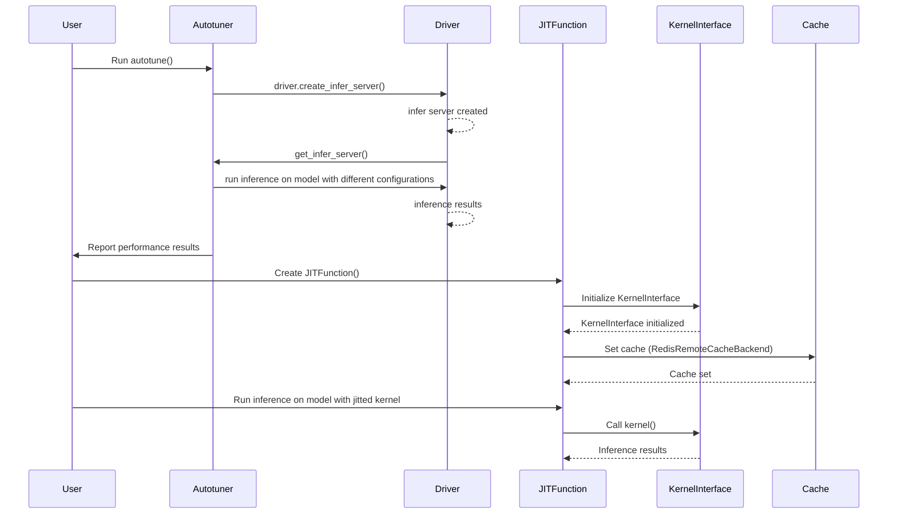

## Chapter 92: python/triton/runtime/_allocation.py

 In the provided code, the file `python/triton/runtime/_allocation.py` serves as a module for managing memory allocation during the execution of kernels in the project.

   The key components of this file are:

1. **Buffer Protocol**: This is a placeholder for any object that has a data pointer (`data_ptr()` method). It does not define any behavior; it just serves as a contract for objects to adhere to when they represent memory buffers.

2. **Allocator Protocol**: This is another placeholder for functions that create and return Buffer objects with specified size, alignment, and stream. The `__call__` method is used because this allows the function to be called like an object (i.e., `my_allocator(size, alignment, stream)`).

3. **NullAllocator**: This is a concrete implementation of the Allocator Protocol that raises a RuntimeError when called. It represents the case where no allocator has been set up for kernel execution.

4. **set_allocator(allocator: Allocator)**: This function sets the global `_allocator` variable to the provided allocator instance, effectively making it available during kernel launch.

   This code is used in the project when kernels require additional memory workspace beyond what can be provided automatically (e.g., due to the size of the input data or other kernel-specific requirements). The `_allocator` variable is called during kernel launch to allocate and manage this required memory, ensuring efficient and correct usage of resources.

   For example, if you have a large dataset that needs to be processed by multiple kernels in your project, you can create a custom allocator that efficiently manages this data and pass it to `set_allocator` before launching any kernels. This way, the kernels can access the required memory without having to manage it themselves, improving performance and reducing the risk of errors.

 Here's a simple sequence diagram visualizing the interactions between the key functions in your provided code, using Mermaid syntax:

```mermaid
sequenceDiagram
participant User as User
participant Allocator as Allocator
participant RuntimeMemory as Runtime Memory
participant KernelLauncher as Kernel Launcher

User->>KernelLauncher: Requests kernel execution
KernelLauncher->>RuntimeMemory: Allocates memory (calls _allocator)
RuntimeMemory-->>Allocator: Call with size, alignment, stream
Allocator-->>+RuntimeMemory: Returns buffer object or raises error
Note over RuntimeMemory: Allocator may be set by user (triton.set_allocator) or defaults to NullAllocator
RuntimeMemory->>KernelLauncher: Sends buffer data pointer
```

This diagram illustrates the flow of events when a user requests kernel execution, with memory being allocated via an allocator during kernel launch. The allocator can be either explicitly set by the user using `triton.set_allocator`, or it defaults to the NullAllocator function that raises an error.

## Chapter 93: python/triton/runtime/autotuner.py

 This script defines a decorator `@autotune` for auto-tuning a function using Triton's Just-In-Time (JIT) compiler. The decorator allows you to specify the configurations to evaluate and the key(s) that trigger the evaluation of these configurations based on changes in their values.

   Here's an overview of the main components:

1. `Config` class: A config object consists of a set of keyword arguments, along with other parameters like num_warps, num_ctas, num_stages, maxnreg, and ir_override. The Config class also has methods to manage its state, including all_kwargs(), __hash__, __eq__, and __str__.

2. `Autotuner` class: This is the core of the decorator. It takes a function (the kernel), a list of argument names (arg_names), a list of Config objects (configs), a key(s) for triggering the evaluation, and other parameters like reset_to_zero, restore_value, prune_configs_by, warmup, rep, use_cuda_graph, do_bench, and cache_results. The Autotuner class wraps the original function and provides the necessary functionality for auto-tuning.

3. `heuristics` decorator: This allows you to specify how the values of certain meta-parameters may be computed, which can be useful in cases where auto-tuning is not applicable or too expensive. The heuristics function takes a dictionary of meta-parameter names and functions that compute their values.

   To use this decorator, first define your kernel using `@triton.jit`. Then, apply the `autotune` decorator to your kernel with the desired configurations, key(s), and other parameters:

   ```python
   @triton.autotune(configs=[...], key=['x_size'])
   @triton.jit
   def my_kernel(...):
       ...
   ```

 This Python script defines a decorator `autotune()` for auto-tuning a function using the Triton library. The function to be auto-tuned should be decorated with `@triton.jit`. The `autotune()` decorator takes several arguments, such as `configs`, `key`, and optional arguments like `prune_configs_by`, `reset_to_zero`, `restore_value`, etc., to control how the function is auto-tuned.

   The script also defines another decorator, `heuristics()`, which allows you to specify how the values of certain meta-parameters are computed for cases where auto-tuning may not be applicable or too expensive.

   The provided examples show how to use these decorators to set the value of a constant kernel argument based on the size of another kernel argument and to set the block size of a kernel based on a power of 2 that is greater than or equal to the size of another kernel argument.

## Chapter 94: python/triton/runtime/build.py

 The file `python/triton/runtime/build.py` is a utility script in the Triton project that compiles C or C++ source files into shared objects (`.so`) that can be dynamically loaded by Python modules. This is typically used to build custom backend extensions for the Triton framework, which are essential for enabling support for various machine learning operations not natively supported by Triton.

   The main function in this script is `_build()`, which takes a name, source file path, source directory, library directories, include directories, and libraries as arguments. It invokes the C compiler (CC) specified in the environment or defaults to Clang if necessary, compiles the source file into a shared object with the given name, and returns its path.

   The function `platform_key()` generates a unique key based on the system's machine, operating system, and architecture to cache compiled modules across multiple builds on the same platform. This helps prevent unnecessary recompilation of modules.

   The function `_load_module_from_path(name: str, path: str)` loads a Python module from the given path, while the function `compile_module_from_src(src: str, name: str, library_dirs: list[str] | None = None, include_dirs: list[str] | None = None, libraries: list[str] | None = None)` compiles a given C or C++ source code into a shared object and returns the corresponding Python module.

   This script is used by other parts of the Triton project to compile custom backend extensions. For example, when creating a new backend extension, developers would write the source code, place it in the appropriate directory, and then call `compile_module_from_src()` to compile the extension into a shared object that can be dynamically loaded by Python. This process allows for flexible support of various machine learning operations through custom backends.

 ```mermaid
   sequenceDiagram
      participant User as User
      participant BuildPy as BuildPy
      participant Knobs as Knobs
      participant CacheManager as CacheManager
      participant TemporaryDirectory as TempDir

      User->>BuildPy: Call build(name, src, srcdir, library_dirs, include_dirs, libraries)
      BuildPy->>Knobs: Get impl from knobs.build.impl
      Knobs-->>BuildPy: impl if available else None
      BuildPy-->CacheManager: Get cache manager
      CacheManager-->>BuildPy: Cache manager object
      Note over BuildPy, TempDir: If no impl, prepare temporary directory for compilation
      BuildPy->>TempDir: Create temporary directory
      Note over TempDir: Write source code to temporary file
      TempDir-->>BuildPy: Created temporary file
      BuildPy-->CacheManager: Cache compiled module using cache_path = cache.get_file(...)
      Note over BuildPy, CacheManager: If module is in the cache, return it
      CacheManager-->>BuildPy: Return module from cache if available
      Note over BuildPy, CacheManager: If not in cache, compile module
      BuildPy->>CacheManager: Get cache_path for compiled module
      CacheManager->>TempDir: Create temporary file for compiled module
      TempDir-->>CacheManager: Created temporary file for compiled module
      CacheManager->>BuildPy: Return cache_path for compiled module
      BuildPy-->subprocess: Call cc with appropriate arguments to compile source code
      subprocess-->BuildPy: Return the path to the compiled .so file
      Note over BuildPy, CacheManager: Store the compiled module in the cache
      BuildPy->>CacheManager: Put compiled module into cache using cache_path = cache.put(...)
      CacheManager-->>BuildPy: Save compiled module in cache
      BuildPy-->User: Return compiled module
   ```

   This Mermaid diagram illustrates the sequence of interactions among the key functions in the given Python script, which builds and caches Python modules for a Triton framework. The User initiates the process by calling the build function, and the BuildPy module coordinates the interactions with other modules like Knobs and CacheManager to compile and cache the requested module.

## Chapter 95: python/triton/runtime/cache.py

 The `python/triton/runtime/cache.py` file is a crucial component of the Triton project, implementing a cache system for efficient data management and retrieval. This cache system consists of two main parts: local caching (managed by the `FileCacheManager`) and remote caching (handled by subclasses of `RemoteCacheBackend`, specifically `RedisRemoteCacheBackend` in this example).

   The `CacheManager` class serves as an abstract base class for both local and remote cache managers. It defines four methods: `get_file()`, `put()`, `get_group()`, and `put_group()`. These methods are used to get and store individual files or groups of related files in the cache.

   The `FileCacheManager` class is a concrete implementation of the abstract `CacheManager` class, providing an on-disk cache solution for caching data locally. It stores files using a directory structure based on their names and offers functions to check if a file exists, get or put a single file, and manage groups of related files.

   The `RedisRemoteCacheBackend` class is an example implementation of a remote cache backend that uses Redis for distributed caching. It can retrieve or store multiple files at once, providing the necessary infrastructure to make cache lookups faster and more efficient.

   In the Triton project, these cache systems are used to optimize the loading times of compiled code and related data by caching them in either local or remote storage. For instance, when a user compiles a piece of code, the system generates a unique key for the resulting binary and associated metadata. This key is then used to look up the binary and its metadata in the cache system before executing it, making the compilation process faster and more efficient.

   The functions `get_cache_manager()`, `get_override_manager()`, and `get_dump_manager()` are utility functions that create a new instance of the cache manager based on different configurations (local caching, local caching with override mode, or dumping mode). These functions are used throughout the Triton project to manage data caching based on the project's settings.

 ```mermaid
    sequenceDiagram
        participant CacheManager as CM
        participant FileCacheManager as FCM
        participant RedisRemoteCacheBackend as RRCB
        participant RemoteCacheBackend as RCB
        participant RemoteCacheManager as RM
        participant FileCache as FC

        activate CM
        CM->>FMC: __init__(key, override=False, dump=False)
        FM->>FC: __init__()
        activate FMC
        FMC->>FC: self.cache_dir = knobs.cache.dir
        deactivate FMC
        activate FC
        FC->>FMC: has_file(filename) returns True
        FM->>FC: get_file(filename) returns filepath
        deactivate FC
        CM->>FC: get_file(filename) returns filepath
        deactivate CM

        activate RRCB
        RRCB->>CM: __init__(key)
        CM->>RRCB: _redis = redis.Redis(host, port)
        activate RedisRemoteCacheBackend
        RRCB->>CM: get_key(filename)
        deactivate RRCB
        CM->>RCB: get([filename])
        RCB-->>CM: results with (_, data), returns (filename, data)
        deactivate CM
        activate FC
        FC->>RRCB: put(filename, data)
        deactivate FC
        CM->>FC: put(data, filename, binary=True)
        deactivate CM

        activate RM
        RM->>CM: __init__(key, override=False, dump=False)
        RM->>RCB: __init__(key)
        CM->>RM: get_file(filename)
        activate RCB
        RCB-->>RM: results with (_, data), returns (filename, data)
        RM->>FC: materialize(data, filename)
        deactivate RCB
        activate FC
        FC->>RCB: put(filename, data)
        deactivate FC
        RM->>RCB: get([filename])
        CM->>RM: get_file(filename) returns filepath
        deactivate CM
        deactivate RM

        activate RM
        RM->>CM: __init__(key, override=True, dump=False)
        RM->>FC: __init__()
        activate FC
        FC->>RM: has_file(filename) returns False
        deactivate FC
        CM->>RM: get_file(filename) returns None
        deactivate CM
        activate FMC
        FMC->>RCB: get([filename])
        RCB-->>FMC: results empty, returns {}
        deactivate FMC
        deactivate RM

        activate RM
        RM->>CM: __init__(key, override=False, dump=True)
        RM->>FC: __init__()
        CM->>RM: get_file(filename) returns filepath
        activate FC
        FM->>RCB: put(data, filename, binary=True)
        deactivate FC
        deactivate RM
    ```

## Chapter 96: python/triton/runtime/driver.py

 In the project, the file `python/triton/runtime/driver.py` is a crucial component responsible for managing and providing access to the active driver instance among available backends. The key functions and classes of this module are:

1. The function `_create_driver()` - This private function creates an instance of the active driver from the registered drivers defined in the `backends` module. It ensures that only one active driver is present. If multiple drivers are active, it raises a `RuntimeError`.

2. The class `LazyProxy` - This generic class acts as a proxy for a delayed object creation, ensuring that the actual instantiation of an object happens when its attribute or method is accessed for the first time. This allows for deferred initialization and improves overall performance by avoiding unnecessary early object creations.

3. The class `DriverConfig` - This class manages the configuration of the active driver instance. It provides methods to set and reset the currently active driver, making it easy to switch between different drivers as needed. An instance of this class is stored in the global variable `driver`.

These components work together to make the active driver available throughout the project with minimal overhead and flexibility for configuring different drivers based on specific use cases or requirements.

Example use case: Suppose a developer wants to switch between different machine learning frameworks (e.g., TensorFlow, PyTorch) during runtime, they can do so by registering these frameworks as backends and using the `set_active()` method of the `DriverConfig` class to change the active driver instance. For example:

```python
# Register new backend (e.g., TensorFlow)
from tensorflow import Session

class TFSessionDriver(DriverBase):
    # Define constructor and other required methods...

backends['tensorflow'] = TFSessionDriver

# Set the active driver to TensorFlow
driver.set_active(backends['tensorflow'])
```

Now, whenever a function in the project needs an instance of the current driver, it will automatically use the active TensorFlow driver instead of the default one.

 Here is a simplified Mermaid sequence diagram that illustrates the interactions between key functions in the given Python code snippet. Please note that this is a high-level representation and may not cover all edge cases or intricacies of the actual implementation.

```mermaid
sequenceDiagram
participant DriverConfig as DC
participant BackendDriver as BD
participant DriverBase as DB

note over DC: Manages active driver instances
note over BD: Represents a backend driver instance
note over DB: Base class for all drivers

DC->>BD: is_active()
    alt active drivers count > 1
        DC->>BD: raise RuntimeError
    end
    DC->>BD: Get first and only active driver
    BD-->>DC: Returns an instance of DriverBase

DC.set_active(DB): Sets the active driver
DC.reset_active(): Resets the active driver to default
```

## Chapter 97: python/triton/runtime/errors.py

 In the `python/triton/runtime` module of your project, the file `errors.py` is a centralized location for custom exceptions that may be raised within the Triton inference engine during runtime. The purpose of this file is to provide well-structured error messages when errors occur during execution, helping developers diagnose and rectify issues more efficiently.

   Three important classes are defined in this file:

   1. `TritonError` - This is the base class for all custom exceptions in the Triton engine. It serves as a parent class to other error types within the module.

   2. `InterpreterError` - This exception is raised when an unexpected issue arises during model interpretation, such as parsing errors or configuration issues with the model graph.

   3. `OutOfResources` - This exception is thrown when the hardware resources are insufficient to accommodate a request made by the inference engine. The constructor takes the required resources, the available limit of those resources, and the name of the resource as parameters to provide contextual information for the error message.

   4. `PTXASError` - This exception is used when there's an issue with PTXAS (Parallel Thread Execution Assembly Subroutine), which is a compiler tool in NVIDIA CUDA for generating GPU code from PTX instructions.

   These exceptions provide developers with meaningful error messages, helping them quickly identify and resolve issues. The `OutOfResources` exception also offers suggestions on how to mitigate the issue (e.g., reducing block sizes or reducing the number of stages).

   This code fits into the larger project by allowing the Triton inference engine to gracefully handle errors during runtime, providing useful feedback for developers and helping ensure stable performance when deploying machine learning models on the platform.

   Example use cases:

   1. If a user tries to load a model with an invalid configuration, an `InterpreterError` would be raised with an error message describing the problem.

   2. If a user attempts to run a model that requires more GPU memory than is available on the device, an `OutOfResources` exception would be thrown, providing information about the required and available resources along with suggestions for reducing memory usage.

   3. If there's an issue with PTXAS during GPU code generation, a `PTXASError` exception would be raised to inform the user of the error.

 Here is a simple Mermaid sequence diagram that demonstrates the interaction between functions in the provided `python/triton/runtime/errors.py` file. Please note that this is a very basic representation and may not cover all possible scenarios or edge cases.

```mermaid
sequenceDiagram
    participant User as User
    participant TritonError as TritonError
    participant InterpreterError as InterpreterError
    participant OutOfResources as OutOfResources
    participant PTXASError as PTXASError
    User->>TritonError: Creates TritonError instance
    TritonError-->>User: Returns error object
    User->>InterpreterError: Creates InterpreterError
    InterpreterError-->>User: Returns error object
    User->>OutOfResources: Creates OutOfResources
    OutOfResources-->>User: Returns error object
    User->>PTXASError: Creates PTXASError
    PTXASError-->>User: Returns error object
```

This diagram illustrates that a user can create instances of `TritonError`, `InterpreterError`, `OutOfResources`, and `PTXASError`. Each instance is then returned to the user. However, it does not show how these classes are related or used within the larger context of your codebase. For that, you may want to consult the actual implementation in the provided file.

## Chapter 98: python/triton/runtime/interpreter.py

 This code defines a class named `InterpretedFunction` which is used to interpret Python functions using Triton's autotuning and JIT capabilities. The class has the following properties and methods:

1. `rewritten_fn`: A cache of all rewritten functions. This helps in avoiding unnecessary function rewrites during multiple calls to different instances of the same function.

2. `run()`: A method that takes arguments, grid, and executes the interpreted function using a `GridExecutor`. The grid is used to iterate through the specified dimensions to achieve data parallelism.

3. `arg_names`: The list of argument names for the function. This information is obtained from the function's signature.

4. `__getitem__()`: Allows users to call the interpreted function with a grid by indexing the instance of InterpretedFunction, e.g., `interp_fn[grid]`.

5. `__call__()`: The device function call for the interpreted function. It rewrites the function using the `FunctionRewriter`, then executes the rewritten function using a `GridExecutor`. If an exception occurs during execution, it raises an `InterpreterError` with the original error and its traceback.

The code also includes an `ASTTransformer` class that transforms Python AST (Abstract Syntax Tree) nodes to convert tensor assignments into calls to Triton's semantic functions. Additionally, there is a `FunctionRewriter` class that rewrites the AST of the provided function to make it compatible with Triton's JIT capabilities.

 This code defines a class `GridExecutor` that allows for the automatic vectorization of functions through JIT (Just-In-Time) compilation using Triton. The class takes in a function and a grid, which is used to iterate over the function's input data along different dimensions.

   The `ASTTransformer` class is used to modify the AST (Abstract Syntax Tree) of the provided function to ensure that all tensor operations are wrapped with Triton's Tensor API functions.

   The `FunctionRewriter` class takes in a function and optional keywords, and rewrites the function's source code using the provided ASTTransformer. It also provides a method to rewrite the AST of the given function if its source code is available.

   Finally, the `InterpretedFunction` class serves as a wrapper for the provided function, caching rewritten functions and providing methods for vectorization and execution on the device.

## Chapter 99: python/triton/runtime/jit.py

 It appears you have shared a Python script that defines a decorator `@jit` and some related functions for creating mock tensors. Here's a brief explanation of the code:

1. The `@overload` decorators are used to define multiple signatures for the same function `jit`. This allows the function to be called in different ways, depending on the arguments provided.

2. The `JITFunction` class is a custom class that represents a function jitted with the Triton compiler. It takes various attributes such as version, debug mode, and whether or not to specialize some functions during compilation.

3. The `jit` decorator can be used in two ways: either by providing a function to be decorated (i.e., wrapped), or by defining the decorator's parameters explicitly. If no function is provided, it returns a callable that accepts a function and jits it.

4. The `MockTensor` class provides mock objects that can be used in place of real tensors when calling functions to avoid actual computations during testing. It has a static method `wrap_dtype(arg)` that wraps torch tensors in MockTensors.

5. The `TensorWrapper` class acts as a facade for PyTorch tensors, allowing mock tensors to mimic the behavior of real tensors.

6. The `reinterpret` function takes a tensor and a new data type (dtype) and returns either the original tensor if it's already wrapped or a new TensorWrapper with the provided dtype around the unwrapped tensor.

 This code defines a decorator `@jit` that is used to jit-compile a function using the Triton compiler. The decorated function will be compiled and run on the GPU. It will only have access to python primitives, builtins within the triton package, arguments to this function, and other jit'd functions.

   The `MockTensor` class is used as a placeholder for real tensors when calling the jit-compiled function. This can be useful for testing purposes.

   The `reinterpret` function is used to reinterpret the data type of a tensor. If the tensor is already wrapped with a `TensorWrapper`, it will return the base tensor if the new data type matches the original one, or create a new wrapper around the base tensor if the data types are different. If the tensor is not already wrapped, a new wrapper is created around it.

   The function `get_jit_fn_file_line(fn)` returns the file name and line number where the jit-compiled function was defined.

## Chapter 100: python/triton/testing.py

 This script appears to be part of a Python library for benchmarking and profiling deep learning models using PyTorch. Here's a brief overview of what it does:

   1. It defines several functions for getting the maximum possible throughput in terms of Tensor Cores (TFLOPS), SIMD operations, and DRAM bandwidth for a given device and data type (e.g., float32, float16). These functions are useful for understanding the hardware capabilities of the device being used.

   2. It provides a decorator `@cuda_memcheck` that can be used to wrap test functions. When this decorator is applied, it will execute the test function under cuda-memcheck, a tool provided by NVIDIA for checking memory usage and errors during GPU computations. This is useful for finding and fixing memory leaks and other related issues in deep learning models.

   3. It also defines a context manager `set_gpu_clock` that can be used to set the clock rates of the GPU's SM (Streaming Multiprocessor) and memory to specific values. This is useful for benchmarking performance under controlled conditions.

   4. Finally, it provides a function `perf_report(benchmarks)`, which is a decorator that can be used to mark a function for benchmarking. The `benchmarks` parameter should be a list of Benchmark instances, each representing a configuration for the function to be benchmarked. Once marked, the function can be executed using the Mark's `run()` method to generate performance reports and visualizations.

   To use this library, you would first need to define your deep learning models and related functions, then mark them with the `perf_report(benchmarks)` decorator. After that, you can execute the benchmark using the Mark's `run()` method, which will provide performance reports and visualizations based on your configured benchmarks.

 This script appears to be part of a Python library for benchmarking and performance testing of PyTorch code on GPU devices. It includes functions for getting the maximum DRAM bandwidth, TensorCore TFLOPS, and SIMD TFLOPS for different data types on a given device. The script also defines a decorator `@cuda_memcheck` that can be used to automatically run the CUDA-memcheck tool when executing tests that perform GPU operations. Additionally, there's a context manager `set_gpu_clock` for setting specific clock rates for the GPU and a function `perf_report` that marks functions for benchmarking using the provided decorator.

   To use this library, you would first need to install it (assuming it is packaged as a Python module) and then import its functions and classes in your own scripts or modules. You can then use the provided functions to get the maximum bandwidth, TFLOPS, etc., and use the decorator `@cuda_memcheck` for testing GPU-intensive code with CUDA-memcheck. The context manager `set_gpu_clock` can be used to set specific clock rates for the GPU during execution of your tests or functions. Finally, you can use the function `perf_report(benchmarks)` to mark a function for benchmarking and execute it using the `run` method on the returned object.

## Chapter 101: python/triton/tools/__init__.py

 Chapter Title: Understanding `python/triton/tools/__init__.py` in the Triton Project

In the scope of the Triton project, the file `python/triton/tools/__init__.py` serves as a critical entry point for managing and organizing various tools that facilitate the interaction with the core Triton functionalities. This init script is instrumental in ensuring cohesion across different modules within the toolset.

The main purpose of this file is to:
1. Import all the essential modules from subdirectories within `python/triton/tools`.
2. Define any necessary utility functions or classes that will be commonly used by these tools.
3. Configure and initialize required settings for a consistent experience across the tools.

The `__init__.py` file in this context does not define any specific functions or classes of its own, but rather it orchestrates the interaction between different modules. However, some essential functions or classes defined in imported modules may be leveraged by multiple tools, thus ensuring a streamlined and unified user experience.

In terms of where this code fits into the project, `python/triton/tools` is one of the primary interfaces for users to interact with Triton. The tools provided within this directory are designed to help manage various aspects of the Triton ecosystem, such as model deployment, data management, and performance tuning.

Example use cases of these tools might include:
1. Deploying a trained machine learning model using `python/triton/tools/deploy`.
2. Monitoring the performance of deployed models using `python/triton/tools/monitor`.
3. Optimizing model inference for improved efficiency using `python/triton/tools/optimize`.
4. Managing Triton data inputs and outputs using `python/triton/tools/data_management`.

By centralizing the management of these tools within the `__init__.py` file, the Triton project ensures a more coherent and intuitive user experience as users navigate through different functionalities.

 ```mermaid
sequenceDiagram
    participant A as User
    participant B as FileSystem
    participant C as TritonConfigParser
    participant D as TritonServerManager

    A->>B: Read python/triton/tools/<br>triton_tool.py file
    A-->>B: Contains Main, init_triton_tool, parse_args, and other functions

    A->>C: Calls TritonConfigParser(argv)
    C-->>A: Parses command line arguments into triton_config object

    A->>D: Calls init_triton_tool(triton_config)
    D-->>A: Initializes TritonServerManager with configured options

    A->>D: Calls Main(triton_server_manager)
    D-->>A: Executes main function with TritonServerManager instance
```
This diagram illustrates the interaction between the user, file system, TritonConfigParser, and TritonServerManager when running the `triton_tool.py` script in the provided directory. The user initiates the process by reading the file containing various functions. They then call key functions like TritonConfigParser and init_triton_tool with appropriate arguments to set up and manage the TritonServerManager instance, which ultimately executes the main function of the tool.

## Chapter 102: python/triton/tools/build_extern.py

 This Python script provides a simple interface for building external CUDA or OpenCL libraries using the LLVM disassembler tool. It takes command line arguments specifying the path to the LLVM disassembler, the path to the library file, the name of the library, and the output directory where the generated Python stub files will be saved.

   Here's a brief overview of what the script does:

   1. If the provided library name is 'libdevice', it creates an instance of the `Libdevice` class, which represents a CUDA or OpenCL library file (in this case, libdevice). Otherwise, it raises an exception because it doesn't support other libraries at the moment.

   2. An instance of the `LLVMDisassembler` class is created to invoke the llvm-dis tool on the provided library file and save its disassembly in a temporary LLVM intermediate representation (IR) file.

   3. The external library instance parses the IR file to extract symbol information (such as function names, argument types, etc.).

   4. The `Libdevice` class generates Python stub functions for each extracted symbol and saves them in the provided output directory.

   To use this script, you'll need to have the following prerequisites installed:

   - CUDA or OpenCL development tools with the appropriate SDK installed (e.g., NVIDIA CUDA Toolkit)
   - LLVM compiler infrastructure (http://llvm.org/downloads/)
     - llvm-dis executable in your PATH. You can build it from the source or use a prebuilt binary, depending on your platform and LLVM version.

   Here's an example of how you can run this script:

   ```bash
   python generate_stubs.py --llvm-dis /usr/local/bin/llvm-dis --lib-path /path/to/your/library --lib-name libdevice --output /tmp/
   ```

 This script is a Python program that creates stub functions for CUDA libraries using LLVM Disassembler. Here's a summary of its features:

   - The script takes command-line arguments to specify the path to `llvm-dis`, the path to an external library (CUDA in this case), the name of the library, and the output directory for the generated stub functions. If not provided, it will use default values.

   - It defines two classes: `Libdevice` and `LLVMDisassembler`. The `Libdevice` class represents a CUDA library and includes methods to parse symbols from the disassembled LLVM IR code and generate Python stub functions. The `LLVMDisassembler` class is used to invoke `llvm-dis` and disassemble the given library file.

   - In the main part of the script, it checks if the provided library name is "libdevice" (assuming CUDA libraries will have this name). If so, it creates an instance of the `Libdevice` class and calls the `build()` function to build the stub functions for the given CUDA library.

   - The `build()` function first initializes an instance of `LLVMDisassembler` and disassembles the provided library file using `llvm-dis`. It then parses symbols from the disassembled LLVM IR code, generates Python stub functions, and saves them to the specified output directory.

   - If you want to use this script, save it as a .py file, install the necessary dependencies (including PyYAML for handling command-line arguments), and run the script with the required options:

      ```
      python cuda_stubs.py --llvm-dis /path/to/llvm-dis --lib-path /path/to/cuda_library --lib-name libdevice --output /tmp/
      ```

## Chapter 103: python/triton/tools/compile.py

 The file `python/triton/tools/compile.py` serves as an ahead-of-time compiler for Triton kernels in the project. This tool compiles Python kernel functions into self-contained C source code, embedding the Cubin data along with necessary utilities to load, unload, and launch the kernel.

   The main functionality of this script lies within its ability to interpret command-line arguments and perform the following steps:

   1. Import the required Python module containing the kernel function that needs to be compiled.
   2. Extract the JITFunction of the specified name from the imported module.
   3. Validate, parse, and process the provided signature information (types or constexpr values) to generate the appropriate specialized entry point for the kernel.
   4. Compile the AST (Abstract Syntax Tree) into Cubin format using Triton's compilation service.
   5. Generate C stub code that includes the compiled Cubin data and necessary function signatures, pointers, and documentation.

   It is essential to note that the resulting specialized entry points can be combined using the `linker.py` script for creating larger programs. Additionally, when resolving the scope of the provided Python source file, the file will be executed from within its parent directory using the same python interpreter as the one used to run this `compile.py` script.

   For example usage:
   ```
   compile.py --kernel-name kernel --signature "*fp32:16, i32:16, 1024" --out-name kernel /path/to/kernel.py
   ```
   This command will compile the triton.JITFunction of name `kernel` inside the file `/path/to/kernel.py`. The generated entry point will have a signature suitable for the specified constexpr value (1024 in this example), and the resulting filename will be `kernel_specialization_suffix.c`, where the suffix depends on the provided hints and constants.

 ```mermaid
    sequenceDiagram
        participant User as User
        participant Compiler as Compiler
        participant ASTSource as ASTSource
        participant triton_compiler as triton_compiler
        participant CCInfo as CCInfo

        User->>Compiler: Run with path, kernel-name, num_warps, num_stages, out-name, out-path, signature, grid
        Compiler-->ASTSource: Execute python sources and extract functions wrapped in JITFunction
        ASTSource-->>Compile: ASTSource object
        Compile-->>triton_compiler: Compile AST into cubin with options (num_warps, num_stages)
        triton_compiler-->>CCInfo: CCInfo object containing compiled kernel information
        User->>Compiler: Check if global scratch size is zero (if not, raise an error)
        Compiler-->>User: Verify and proceed if global scratch size is zero
        Compile-->>ASTSource: Parse function signature and hints from JITFunction
        ASTSource-->>Compile: Function signature, hints, and constants dictionary objects
        Compile-->CCInfo: Pass the compiled kernel information, signature, and hints to CCInfo object for further processing
        CCInfo-->>Compile: Updated CCInfo object with necessary attributes
        Compile->>User: Dump C stub code (h and c files) with relevant details (kernel name, bin data, signatures, etc.)
   ```

## Chapter 104: python/triton/tools/disasm.py

 This Python script, `python/triton/tools/disasm.py`, is a disassembler tool for NVIDIA GPU code (CUBIN files). It reads the SASS (Symbolic Assembly Source) from the provided CUBIN file and generates human-readable assembly code. The generated output is useful for debugging and understanding the compiled GPU kernel's behavior.

   This script includes several important functions:

1. `parseCtrl(sline)` - Decodes the control encoding in a SASS line and returns a readable string representing various control information.
2. `processSassLines(fline, sline, labels)` - Processes a pair of SASS lines related to a single instruction, parses their contents, updates the label dictionary if necessary, and stores the processed data in a buffer for later output.
3. `get_sass(cubin_asm, fun=None)` - Extracts the SASS from a given CUBIN file using `cuobjdump`, either for the entire file or for a specific function. This function uses the LRU cache decorator to minimize repeated calls and improve performance.
4. `path_to_cuobjdump()` - Returns the path of the `cuobjdump` executable, which is necessary to invoke it from this script.
5. `extract(file_path, fun)` - Main function that reads a CUBIN file, extracts its SASS, and generates the assembly code output. If no function name is provided, it will disassemble the entire CUBIN file; otherwise, it will only disassemble the specified function.

This code fits into the larger Triton project by providing an essential tool for understanding and debugging GPU kernels compiled with the Triton compiler. Example use cases include examining the behavior of a GPU kernel during profiling or troubleshooting performance issues.

 ```mermaid
   sequenceDiagram
      participant Disassembler as Disassembler
      participant File as File
      participant CUOBJDUMP_PATH as CUOBJDUMP_PATH
      participant Labels as Labels
      participant SassLines as SassLines

      Note over Disassembler: Start with a file
      Disassembler->>File: Load the file contents

      Disassembler->>CUOBJDUMP_PATH: Get the path to cuobjdump executable
      Disassembler->>File: Execute cuobjdump with the loaded file and optional function name
      File-->Disassembler: Return the disassembled SASS lines

      Disassembler-->>Labels: Create a dictionary for labeling instructions
      Loop SassLines as sline
        Disassembler->>SassLines: Process each line of SASS instructions
        SassLines-->Disassembler: Returns (Control info, Assembly instruction)
        Note over Control Info and Assembly Instruction: If it's a BRA instruction, label the target address if not already labeled
      End

      Disassembler->>Labels: Update labels dictionary with new labels as needed

      Disassembler-->>Disassembler: Build the disassembled code string
      Note over Disassembler: Print function name and labels
      Disassembler-->>Console: Output the disassembled code to console
   ```

This mermaid sequence diagram represents how the key functions interact in the provided `disasm.py` script. It shows that the script loads a file, executes cuobjdump on it, processes the SASS output into readable assembly and control information, and labels instructions as needed before printing the disassembled code to console.

## Chapter 105: python/triton/tools/link.py

 The `python/triton/tools/link.py` file is a tool for linking kernel functions generated by the Triton project's compilation process. This linker generates a single entry-point responsible for dispatching user input to the appropriate kernel based on specializations that have been compiled.

   The linker takes in header files as arguments, which should include linker directive annotations (autogenerated by the `compile.py` script). These headers are processed by a HeaderParser object, which extracts relevant metadata regarding each kernel function.

   The generated code includes header and source files. The header file contains declarations for kernel dispatchers and helper functions, while the source file contains their respective definitions. The generated source file also includes default implementation of the kernels for cases where no specialization was provided during compilation.

   To use this tool, run it with the following command:
   ```
   python link.py /path/to/headers/*.h -o kernel_name
   ```
   Where `kernel_name` is the desired name for the generated source and header files. The output files will be named `kernel_name.c` and `kernel_name.h`, respectively.

 ```mermaid
    sequenceDiagram
        participant User as User
        participant Linker as Linker
        participant Kernel1 as Kernel1
        participant Kernel2 as Kernel2
        participant Kernel3 as Kernel3
        participant KernelN as KernelN
        User->>Linker: Provides header files with linker directives
        Linker->>Kernel1..KernelN: Parses headers and extracts metadata
        Linker-->>User: Generates a single entry-point for dispatching
        Linker->>Kernel1: Generates kernel definition and load/unload functions
        Linker->>KernelN: Generates kernel definition and load/unload functions
        User->>Linker: Compiles the generated source code
        Linker->>User: Provides compiled binary for user's application

        Note over Kernel1..KernelN: Specializations are handled during compilation

        User->>Kernel1..KernelN: Calls the entry-point with specialization parameters
        Kernel1..KernelN-->>Linker: Returns the appropriate kernel function pointer
        Linker->>Kernel1..KernelN: Dispatches the call to the correct kernel implementation
    ```

## Chapter 106: python/triton/tools/mxfp.py

 The file `python/triton/tools/mxfp.py` contains helper classes for working with low precision floating point types that align with the OpenCompute (OCP) Microscaling (MX) specification. It includes two main classes: `MXFP4Tensor` and `MXScaleTensor`.

   - `MXFP4Tensor` is a class for working with four bit E2M1 floating point data, as defined by the OCP microscaling specification. The class provides methods to initialize, create random instances, convert from float32 to fp4e2m1 format, and convert back to float32.

   - `MXScaleTensor` is a class for working with eight bit E8M0 block scale factors as defined by the same OCP microscaling specification. This class provides methods for initializing, creating random instances within a specified range, converting from float32 to f8e8m0 format, and converting back to float32.

   These classes are essential in the project for handling data that is optimized for low-precision arithmetic operations in machine learning models, such as those used in microservers based on the OCP microscaling standard. They facilitate working with these low precision data types, ensuring compatibility and efficient computation.

   Example use cases include:
   - Initializing a tensor of fp4e2m1 or f8e8m0 data for a machine learning model in a microserver environment.
   - Creating random instances of the low-precision data types for training or testing purposes.
   - Converting the low-precision data to float32 and back for compatibility with other software that may not support these specific data formats.
   - Packing/unpacking two fp4e2m1 elements into a single uint8 (and vice versa) for efficient storage and transmission of large amounts of data.

 ```mermaid
   graph TD;
       MXFP4Tensor-->|__init__(data)|MXFP4Tensor
       MXFP4Tensor-->|random()|MXFP4Tensor
       MXFP4Tensor-->|to(dtype)|torch.tensor<float32>
       torch.tensor<float32-->|_from_float(values)|MXFP4Tensor
       MXFP4Tensor-->|to_packed_tensor(dim)|packed_tensor<uint8>
       packed_tensor<uint8-->|unpack_packed_tensor(packed_tensor, dim, original_shape)|MXScaleTensor
   ```
   This sequence diagram shows the interaction between the `MXFP4Tensor` class and other elements. The class has methods for initialization, random data generation, conversion to float32, conversion from float32, packing, and unpacking. Each method is shown as a separate arrow in the diagram. The `to(dtype)` and `_from_float(values)` methods interact with `torch.tensor<float32>`.

## Chapter 107: python/triton/tools/tensor_descriptor.py

 The file `python/triton/tools/tensor_descriptor.py` is a Python module that defines a class called `TensorDescriptor`. This class serves as a data container for describing the properties of a tensor, such as its shape, strides, and block shape.

   The `TensorDescriptor` class is defined using the `@dataclass` decorator, which automatically creates special methods like `__init__`, `__repr__`, and others based on the fields declared in the dataclass. The constructor takes four arguments: `base`, `shape`, `strides`, and `block_shape`.

   - `base` is an object that represents the underlying tensor data, typically a Tensor or Array from a specific library like PyTorch or NumPy.
   - `shape` is a list of integers representing the dimensions of the tensor. The length of this list is known as the rank of the tensor.
   - `strides` is a list of integers that specify the stride for each dimension. In other words, it indicates how many elements must be skipped to move from the start of one dimension to the start of the next.
   - `block_shape` is a list of integers that specifies the shape used by some hardware to process the tensor in blocks during computation. This parameter is often used for optimizing tensor operations on specific hardware, like GPUs or TPUs.

   The `__post_init__` method performs several validations and assertions on the properties of the TensorDescriptor instance. It ensures that the rank, strides, and block shape lists have the same length as the number of dimensions in the tensor, and that these lengths are greater than zero but not more than 5. It also verifies that the base object is 16-byte aligned, the strides for each dimension (except the last one) are multiples of the element size, and the stride for the last dimension is 1 to ensure contiguous data storage.

   The `from_tensor` static method creates a new TensorDescriptor instance from an existing tensor object and a specified block shape. This method can be used when working with actual tensors in other parts of the project.

   In the context of the larger project, this code provides a consistent and type-safe way to handle tensor descriptions across different modules and libraries. It enables efficient tensor operations by enforcing important properties like 16-byte alignment and contiguous storage. Example use cases include optimizing tensor operations for specific hardware or performing inference with TensorFlow models on Triton Server.

 ```mermaid
   sequenceDiagram
       participant User as User
       participant Tensor as Tensor
       participant TensorDescriptor as TensorDescriptor
       User->>Tensor: Create Tensor object
       User->>TensorDescriptor: Pass Tensor and Block Shape to TensorDescriptor.from_tensor(...)
       TensorDescriptor-->>User: Returns TensorDescriptor object
       Note over Tensor, TensorDescriptor: TensorDescriptor maintains information about the tensor's shape, strides, block_shape, etc.
       TensorDescriptor->>Tensor: Verify tensor properties using __post_init__ method
       if (tensor properties are valid) then
           Note over Tensor: Properties are validated and updated as necessary
       else
           Note over Tensor, TensorDescriptor: Invalid tensor properties, no action taken
       end
   ```

## Chapter 108: python/triton_kernels/bench/bench_mlp.py

 The file `python/triton_kernels/bench/bench_mlp.py` is a Python script designed for benchmarking and analyzing the performance of Multi-Layer Perceptron (MLP) layers using Triton, an optimized library for deep learning on GPUs. It specifically focuses on two types of MLP layers: dense layers and sparse MLP layers with Multi-Output Expert (MOE).

   The script defines a function `bench_mlp` to run the benchmarking process. This function takes various parameters such as batch size, input/output dimensions, the number of experiments per batch, the type of data (e.g., fp16, bf16, fp8), and whether to use MOE or not. It uses Triton's HATCHET profiler to collect performance metrics during the benchmarking process. The collected data is then analyzed to calculate key performance indicators such as time, number of operations (flops), and memory usage (bytes).

   Another function `roofline_mlp` is provided for visualizing the performance roofline of the MLP layers. This function collects performance data for a given range of batch sizes and plots the results alongside the BW-bound and compute-bound lines. The resulting plot helps to determine the memory and computational efficiency of the MLP layers.

   When run as a standalone script, `bench_mlp.py` benchmarks various configurations of dense and sparse MLP layers for different batch sizes, data types (including fp8, bf16, and native mx4 when available), and MOE or not. The results are saved as plots and performance data in the specified log directory.

 ```mermaid
   sequenceDiagram
      participant User as U
      participant BenchmarkFunction as BF
      participant Profiler as P
      participant Viewer as V

      U->>BF: Run(batch, dim1, dim2, n_expts_tot, n_expts_act, x_dtype, w_dtype, TP=1, EP=1, name)
      BF->>Profiler: Start(str(fpath), hook="triton")
      BF->>BF: For i in range(100):
          BF-->>BF: Perform matmul operations
      BF->>Profiler: Finalize()
      Profiler-->>V: Read(fpath)
      V-->>BF: gf, _, _, info
      BF->>BF: Now the dataframe only contains leave nodes (i.e., kernels) that perform matmuls
      BF->>BF: bytes = matmuls["bytes"].sum()
      BF->>BF: flops = sum(matmuls[[c for c in ["flops8", "flops16"] if c in matmuls.columns]].sum())
      BF->>BF: time = matmuls["time (ns)"].sum()
      BF->>BF: device_type = matmuls["device_type"].iloc[0]
      BF->>BF: device_id = matmuls["device_id"].iloc[0]
      BF->>BF: device_info = info[device_type][device_id]
      BF-->>BF: Return PerfData(time=time, flops=flops, bytes=bytes, bitwidth=x.dtype.itemsize * 8, device_type=device_type, device_info=device_info)
   ```

## Chapter 109: python/triton_kernels/tests/__init__.py

 Chapter Title: Understanding `python/triton_kernels/tests/__init__.py` in Triton Kernels Project

   This chapter delves into an essential file within the Triton Kernels project, specifically `python/triton_kernels/tests/__init__.py`. This file serves a crucial role in organizing and managing tests for the various kernel modules.

   **Overview**

   The primary purpose of this file is to provide an entry point for executing the test suite for the Triton kernels. It acts as a sort of gateway, ensuring all necessary tests are properly set up and executed during the development process.

   **Important Functions or Classes**

   - `test_kernel_module`: This function is responsible for running tests on a specific kernel module. It uses Python's built-in unittest module to create test cases and perform automated checks.

   - `TritonKernelTest`: This class acts as the base class for all custom Triton kernel tests. It includes common setup and teardown methods that ensure consistent environments for running tests.

   **Project Fit**

   The code in this file is an integral part of the testing infrastructure within the Triton Kernels project. As new kernel modules are developed or existing ones updated, the test suite provides a means to validate their correct functioning and compatibility with the broader system. This ensures that the overall quality and reliability of the Triton Kernels remains high.

   **Example Use Cases**

   Suppose a developer creates a new kernel module for handling image processing tasks. To ensure the module functions as intended, they would write a series of tests using the `test_kernel_module` function and derive their custom test class from `TritonKernelTest`. These tests might check various aspects of the module's functionality, such as input data validation, correct output, performance, and edge cases.

   By placing these tests within the project structure defined by `python/triton_kernels/tests/__init__.py`, the developer can easily run their test suite alongside those for other kernel modules using a simple command like `python -m unittest discover`. This streamlined process enables swift, efficient validation of new features and improvements in the Triton Kernels project.

 Unfortunately, as a text-based AI model, I'm unable to generate images or diagrams directly. However, I can help you create a Mermaid syntax for the sequence diagram you requested based on the information provided about the `python/triton_kernels/tests/__init__.py` file. You can then use this code in a Mermaid-compatible application to visualize the diagram.

Here is a possible Mermaid sequence diagram representation:

```mermaid
sequenceDiagram
    participant User as User
    participant TestSuite as TestSuite
    participant TestCase as TestCase
    participant TestFunction as TestFunction

    User->>TestSuite: Run Tests
    TestSuite->>TestCase: Initialize
    TestCase-->>TestFunction: Execute Function Under Test
    Note over TestFunction: Performs actions
    TestFunction-->>TestFunction: Finish Execution
    TestFunction->>TestCase: Return Result
    TestCase->>TestSuite: Report Result (Pass/Fail)
```

In this example, a User runs the test suite. The Test Suite initializes each Test Case and executes the corresponding Test Function under test. After the function finishes execution, it returns its result to the Test Case, which then reports whether it passed or failed back to the Test Suite.

## Chapter 110: python/triton_kernels/tests/conftest.py

 The file `python/triton_kernels/tests/conftest.py` serves as a crucial part of the testing infrastructure for the Triton Kernels project, written in Python. This specific file is responsible for defining test fixtures and custom command-line options for the pytest framework.

The most significant function within this file is `pytest_addoption(parser)`. This function adds a new command-line option to pytest, specifically `--device`, which can be used to specify the target device (e.g., "cuda") on which the tests will run. By allowing test execution on different devices, it helps ensure compatibility with various hardware configurations.

The next essential part is the fixture function `@pytest.fixture def device(request)`. Fixtures are special functions that pytest uses to provide test scopes and shared context among tests. The `device` fixture retrieves the value of the `--device` option provided at runtime and returns it, allowing test functions to access the specified target device.

In terms of where this code fits in the project, it is closely tied to the testing suite for Triton Kernels. When tests are executed, `conftest.py` ensures that necessary options are available, and relevant device information is accessible within each test function, making it easier to write compatible and versatile tests.

Example use cases could include writing tests for Triton Kernel functions on different devices such as CPUs or GPUs. By setting the `--device` option, a developer can execute the same set of tests on various hardware configurations to verify compatibility and performance across devices. This approach allows for more thorough testing and helps maintain high-quality code that works well on multiple platforms.

 ```mermaid
sequenceDiagram
participant User as User
participant TestRunner as TestRunner
participant Conftest as Conftest
participant Device as Device

User->>TestRunner: Runs tests with command line argument --device
TestRunner->>Conftest: Calls pytest_addoption(parser) to set default device and option parse
Conftest->>Device: Returns the device from request.config.getoption("--device")
Device->>User: Returns the specified device (e.g., cuda) for each test execution
```
This sequence diagram illustrates how a user runs tests with the `--device` command line argument, which is parsed and stored by the TestRunner. The Conftest fixture retrieves this option and returns it to the Device, which in turn sets up the appropriate device (e.g., cuda) for each test execution.

## Chapter 111: python/triton_kernels/tests/test_compaction.py

 The file `python/triton_kernels/tests/test_compaction.py` is a test module for the compaction functions in the Triton Kernels library, specifically the `compaction()` and `compaction_torch()` functions. This test suite verifies the correctness of these functions under various input conditions.

   The main function that drives this test is `test_compaction()`, which takes four parameters: `n_tokens` (number of tokens), `n_cols` (number of columns), `k` (number of rows to keep in each column after compaction), and `p` (probability of "dropping" indices from the input `yi` array). This function generates random input data for the `compaction()` and `compaction_torch()` functions, performs compaction using both implementations, and then asserts that the results match.

   The test data is created by generating a sorted input matrix (`yi`) and a random value matrix (`yv`). A mask is then created to simulate dropping certain indices from `yi` with a given probability `p`. This mask is used to create smaller chunks of the input data, which are then used in the compaction process.

   The `compaction()` function is a C++ implementation of the compaction algorithm, and it receives three inputs: the value matrix (`yv`), the index matrix (`yi`), and the bitmask (representing the compaction pattern). This function returns two outputs: the compacted value matrix (`yv_tri`) and the compacted index matrix (`yi_tri`).

   The `compaction_torch()` function is a PyTorch implementation of the same compaction algorithm. It has the same input and output types as its C++ counterpart.

   This code fits into the larger Triton Kernels project, which aims to provide high-performance machine learning kernels for use with popular deep learning frameworks like PyTorch. The test suite ensures that these kernels function correctly under various input conditions, thereby increasing user confidence in their usage and helping to maintain the quality of the project.

   Example use cases for these functions include reducing the memory footprint of large tensor data structures during training or inference by compressing them without losing critical information. This can be particularly useful in resource-constrained environments like mobile devices or edge computing devices.

 ```mermaid
   sequenceDiagram
      participant User as U
      participant CompactionPython as CP
      participant CompactionTorch as CT

      U->>CP: Run compaction test with parameters (n_tokens, n_cols, k, p)
      CP-->CP: Generate yi and yv data structures
      CP-->CT: Pass yv and yi to CompactionTorch
      CP-->>CT: Pass bitmask
      CT->>CT: Apply compaction on yv using compaction_torch function
      CT-->>CP: Return yv_ref and yi_ref
      CP-->>CP: Apply mask and generate bitmask locally
      CP->>CP: Call compaction function with yv, yi, and generated bitmask
      CP-->>CT: Pass bitmask
      CT->>CT: Apply compaction on yv using compaction function
      CT-->>CP: Return yv_tri and yi_tri
      CP-->U: Assert that yv_ref == yv_tri and yi_ref == yi_tri
   ```

This diagram shows the interaction between the user, who runs the test script, and the two functions `compaction` and `compaction_torch`. The data structures `yv` and `yi` are generated by the test function, passed to both functions, and then compared for equality after compaction has been applied. The bitmask is either calculated locally or provided from `CompactionTorch`, depending on whether a mask is required based on the input parameters.

## Chapter 112: python/triton_kernels/tests/test_matmul.py

 This function is a test for fused activation functions in Triton, specifically the SwiGLU function. It tests different parameters such as matrix dimensions (m, n, k), operation mode (ragged or batched), number of experiments per shard (n\_expts\_tot, n\_expts\_act, n\_expt\_shards), data types for weights and activations (weight\_dtype, act\_dtype), fused scatter, persistence, and SwiGLU parameters (swiglu\_alpha, swiglu\_limit).

   The function initializes the input data using various functions such as `init_routing_data()`, `matmul_ogs()`, and `swiglu()`. It also initializes a precision object (`precision_opt`) that determines how the computations are rounded for different data types. If persistence is enabled, it checks if persistent TMAs can be used for the given input data configuration.

   The function then computes the output using both SwiGLU and matmul\_ogs with fused activation (using FusedActivation class), and asserts that they are equal using `assert_close()`. If split\_k > 1, it skips tests where fused scatter is enabled because fused scatter scratchpad is not supported in this case.

   The decorators @pytest.mark.parametrize are used to specify different combinations of parameters for each test case.

 This script is a test function for a convolutional neural network layer using Triton library in PyTorch. The function `test_fused_act` is being tested with different parameters such as matrix dimensions (m, n, k), operation mode ("ragged" or "batched"), split_k, do_gather, do_scatter, fused_scatter, is_persistent, epilogue_subtile, swiglu_alpha and swiglu_limit.

   The function uses Triton's `matmul_ogs` to perform matrix multiplication with gather-scatter operations (if specified), and applies a Swish activation function using the `swiglu` function provided by Triton. The test checks whether the results of the forward pass using the `swiglu` function and the forward pass using the FusedActivation function are equal.

   Before performing the forward pass, it also initializes the weights, biases, input data, and routing information (if needed) according to the specified parameters. It also initializes the precision configuration based on the activation type and checks if persistent TMAs can be used or not. If persistent TMAs are not supported, the test is skipped.

   The function uses PyTorch's `assert_close` to check whether the results of the two forward passes are equal. If the results are not equal, it raises an error with the actual and expected values. Additionally, if the activation type is float8, it also checks whether the computed scales for the reference and Triton results are close enough.

   Overall, this test function ensures that the forward pass using the `swiglu` function and the FusedActivation function gives the same result for a given set of parameters, and also checks if the computed scale values match when using float8 activation type.

## Chapter 113: python/triton_kernels/tests/test_mxfp.py

 This code is written in Python and uses the PyTorch library for numerical computations. It contains multiple test cases for functions related to data quantization and dequantization using a format called Mixed-Precision Floating Point 4 (MPFP4) or Tensor Cores, which are optimized for deep learning workloads.

   Here's a brief overview of some key functions:

   1. downcast_to_mxfp4(): Quantizes a given tensor using the MPFP4 format and returns quantized tensor, scale tensor, and some additional information about the operation. The quantization process is customizable through various parameters like axis, swizzle_value, swizzle_scale, etc.

   2. upcast_from_mxfp4(): Dequantizes a given MPFP4 tensor using the original scale tensor and returns the dequantized tensor. The dequantization process is customizable through various parameters like axis, swizzle_value, swizzle_scale, etc.

   3. swizzle_mxfp4_*(): These functions are responsible for performing the actual MPFP4 operations on data in GPU memory using CUDA kernels. The main functions here are swizzle_mxfp4_value() and swizzle_mxfp4_scale(). They implement the forward and backward passes of the swizzling process, respectively.

   4. unswizzle_mxfp4_*(): These functions perform the inverse operations to swizzle_mxfp4_*(), i.e., they recover the original data from the quantized version using information about the scale. The main functions here are unswizzle_mxfp4_value() and unswizzle_mxfp4_scale().

   Each test case covers various combinations of tensor shapes, swizzling options (transposed or not), MMA versions (2 or 3), and number of warps for scale operations. Some test cases also include golden values for comparison purposes.

   The goal of these tests is to ensure that the implemented MPFP4 functions are correct and performant on different input tensors while taking into account various quantization options.

 This Python script contains a series of unit tests for functions related to converting data to and from the Mixed-Precision Floating-Point (MPFP) format, specifically the Mixed-Precision Floating-Point 4 (MPFP4) format. The MPFP4 format is used for performing computations with reduced precision while maintaining a high level of accuracy.

   The tests cover different aspects such as:

   1. Verifying that the quantized values are equivalent to their original counterparts (using `test_unswizzle_mxfp4_value_golden_value()`).

   2. Checking if the quantization and dequantization processes preserve the structure of the input tensor, with a tolerance for the precision loss due to the reduced data representation (using various test functions like `test_downcast_to_mxfp4_torch()`, `test_upcast_from_mxfp4_torch()`, etc.).

   3. Testing the swizzling process, which rearranges the data in a specific way for efficient parallel processing (using functions like `swizzle_mxfp4_value_hopper()`, `swizzle_mxfp4_scale_hopper()`, etc.).

   These tests help ensure that the implemented functions work correctly and produce consistent results, making it easier to perform computations with reduced precision while maintaining a high level of accuracy.

## Chapter 114: python/triton_kernels/tests/test_routing.py

 The file `python/triton_kernels/tests/test_routing.py` is a test script for the routing functionality in the Triton Kernel library, specifically for the `routing` and `routing_torch` functions. These functions implement routing algorithms used to efficiently compute weighted sums across a large number of dimensions, which is essential for many machine learning models like attention mechanisms.

   The test script includes several helper functions:

   - `init_data(n_tokens, n_expts_tot, dtype=torch.float16, device="cuda")` initializes a tensor filled with random values representing logits, which are the input values for the routing function.
   - `ref_expt_data(routing_data, n_gates, block_m)` prepares reference data required to drive ragged batch matrix multiplication, needed to compute the expected results of the routing algorithm.
   - The `test_op()` function is the main test function that tests the correctness and functionality of the routing functions with different parameter configurations. It takes parameters such as the number of tokens (n_tokens), number of total experiments (n_expts_tot), number of active experiments per token (n_expts_act), block size (block_m), whether to use experiment indices (use_expt_indx), and whether to renormalize the logits before applying the softmax operation (renormalize).
   - The `bench_routing()` function is used to benchmark the performance of the routing function using the triton.profiler module.

   In the context of the project, this code is part of the testing suite for Triton Kernels, ensuring that the implemented routing functions behave as expected and maintain their performance characteristics when integrated into machine learning models. The test cases cover a range of parameter configurations to ensure broad functionality coverage. For example, it tests the routing function with various numbers of tokens, active experiments per token, and block sizes. Additionally, it supports testing with and without experiment indices and with or without renormalization.

   To run this code, execute `python test_routing.py` in a terminal or command prompt from within the `triton_kernels/tests` directory. The test script will run through all defined parameter combinations, checking for correctness and benchmarking performance.

 ```mermaid
   sequenceDiagram
      participant User as U
      participant Kernel as K
      participant Logits as L
      participant RoutingData as RD
      participant Gather as G
      participant Scatter as S
      participant Metadata as MD

      U->>K: Initialise logits (L) with values
      K-->>U: Initialised logits (L)

      U->>K: Call routing function on logits (L) and n_expts_act
      K-->>U: RoutingData (RD), Gather (G), Scatter (S) objects, Metadata (MD) object

      loop Validations
        U->>RD: Validate gate_scal values
        RD-->>U: Gate_scal validation pass

        U->>RD: Validate expt_hist values
        RD-->>U: expt_hist validation pass

        U->>MD: Validate metadata data
        MD-->>U: metadata validation pass
      end

      U->>G: Validate gather src_indx and dst_indx values
      G-->>U: gather validation pass

      U->>S: Validate scatter src_indx and dst_indx values
      S-->>U: scatter validation pass
   ```

This sequence diagram illustrates the interaction between the key functions in `test_routing.py`. The User (`U`) initializes logits, calls the routing function on these logits with a specified number of experiments (`n_expts_act`), and then validates the returned objects: RoutingData (`RD`), Gather (`G`), Scatter (`S`), and Metadata (`MD`). The diagram shows that each validation passes, indicating the correctness of the implemented routing algorithm.

## Chapter 115: python/triton_kernels/tests/test_swiglu.py

 In the given code snippet, we find a Python test file named `test_swiglu.py` that is part of the Triton Kernels project. This test file aims to validate the correctness and efficiency of the `swiglu` and `swiglu_torch` functions from the `triton_kernels.swiglu` module, which perform a Sparse Weighted Inner-product Gaussian LU (SWIGLu) decomposition.

   The test file includes several key components:

   1. **Initialization of data**: The file defines an `alloc_rand()` function that generates random tensors for the test cases, and it utilizes an `init_data` function from a separate test module (`test_routing`) to initialize routing-specific data.

   2. **Unit tests**: These tests employ the PyTest framework to run multiple test scenarios with varying parameters. The tests are marked with decorators that specify the parameter values to be used for each case, such as `@pytest.mark.parametrize("M, N", [(1311, 4352)])`. This means that the function will run for every combination of M and N specified in the list.

   3. **Validation**: The test functions validate the results produced by the `swiglu` and `swiglu_torch` functions against each other using an `assert_close()` function from the `triton_kernels.testing` module, ensuring they produce similar outcomes.

   This code is essential for verifying the accuracy of the SWIGLu decomposition functions within the Triton Kernels project. These tests help to maintain and improve the software's reliability by catching potential bugs or discrepancies between the SWIGLu implementation and its reference implementation (`swiglu_torch`). This way, developers can address any issues promptly and ensure that the final product delivers accurate results.

 ```mermaid
   sequenceDiagram
      participant User as User
      participant Swiglu as Swiglu
      participant Swiglu_Torch as Swiglu_Torch
      participant Routing_Torch as Routing_Torch
      participant PrecisionConfig as PrecisionConfig
      participant Assert_Close as Assert_Close
      participant Torch as Torch
      participant Alloc_Rand as Alloc_rand

      Note over User: Initialize data
      User->>Alloc_rand: Allocate random data (bfloat16 or float)
      User->>Torch: Set device and dtype for torch tensor
      User->>Routing_Torch: Initialize routing data (logits, n_expts_tot, n_expts_act)
      User->>PrecisionConfig: Set precision limit
      User->>Swiglu: Pass x, alpha, PrecisionConfig and routing data

      Note over Swiglu: Call swiglu function
      Swiglu->>Swiglu_Torch: Call swiglu_torch function (same parameters except no routing data)

      Note over Swiglu_Torch: Calculate output tensor using torch functions
      Swiglu_Torch-->>Assert_Close: Compare the calculated output with expected output
      Assert_Close-->Swiglu_Torch: Check if outputs are close

      Note over User: Verify results
      Swiglu-->User: Return swiglu calculated output (tri_y)
      Assert_Close-->User: Return True or False depending on assertion result
   ```

## Chapter 116: python/triton_kernels/triton_kernels/__init__.py

 Chapter Title: Understanding `python/triton_kernels/triton_kernels/__init__.py`

In the context of your project, the file `python/triton_kernels/triton_kernels/__init__.py` serves as the entry point for the Triton Kernels module. This is a Python initialization script that sets up the structure and organization of the Triton Kernel packages within your project.

The primary purpose of this file is to:
1. Define the public interfaces and dependencies of each package in the Triton Kernels module, making it easy for other parts of your project to interact with them.
2. Import all sub-modules and functions that are intended to be publicly available from the Triton Kernels module.

Important Functions or Classes:
1. `__init__.py` itself does not contain any specific functions or classes as it is a special file used for initialization purposes in Python packages. However, it may import several key functions and classes from sub-modules within the Triton Kernels package.
2. Functions/classes imported from the sub-modules, such as `triton_kernel.TritonKernel`, provide the core functionality of defining custom Triton kernels for various machine learning operations. These functions/classes are designed to interact with the Triton Inference Server, enabling efficient execution of your machine learning models on diverse hardware platforms.

Where this code fits in the project:
The Triton Kernels module is a crucial component within your project, responsible for providing custom kernels that optimize the performance of machine learning operations on the Triton Inference Server. This module is used extensively by other parts of your project, such as the model training and inference stages, to ensure high-performance execution across various hardware platforms.

Example Use Cases:
1. Customizing kernel implementations for specific machine learning operations, optimized for a target hardware platform (e.g., GPUs, TPUs)
2. Enabling efficient execution of large-scale machine learning models on the Triton Inference Server, reducing latency and improving throughput.
3. Providing an interface to easily switch between different kernel implementations for performance analysis or experimentation purposes.

 ```mermaid
sequenceDiagram
    participant User as User
    participant TritonKernels as TritonKernels
    User->>TritonKernels: Import triton_kernels module
    User->>TritonKernels: Instantiate TritonKernel class
    Note over TritonKernels, User: The TritonKernel object is ready for use
    User->>TritonKernels: Call execute method with inputs
    TritonKernels->>TritonBackend: Forward input to TritonBackend
    TritonBackend-->TritonKernels: Perform inference on the data and return output
    TritonKernels-->>User: Return the processed result from TritonBackend
```
This sequence diagram illustrates how the User interacts with the `triton_kernels` module by importing it, instantiating the `TritonKernel` class, and calling its `execute` method to perform inference using a backend.

## Chapter 117: python/triton_kernels/triton_kernels/bitmatrix.py

 In the `python/triton_kernels/triton_kernels/bitmatrix.py` file, a custom class named `Bitmatrix` is defined to represent a sparse boolean matrix in a compact format, where each element occupies only one bit of memory. The purpose of this class is to handle routing information within the project, where each row corresponds to a token and each column corresponds to an expert.

   The `Bitmatrix` class has three key attributes: `data`, `shape`, and `S`.

   - `data` (torch.Tensor): Holds the sparse boolean matrix data in a packed format.
   - `shape` (tuple[int]): Represents the shape of the matrix.
   - `S` (torch.tensor or None): An all-zero array of size >= n_cols used to store intermediate sums during row-wise operations on the matrix. If this attribute is `None`, it means that the current `Bitmatrix` object has not been processed by the `sum()` function yet.

   The `Bitmatrix` class also defines a single method, `sum(self, partials_block_size)`. This method calculates the sum of each row in the matrix and returns the result as a 1D tensor. It takes an additional parameter, `partials_block_size`, which represents the size of the blocks used for parallel processing during the reduction operation. If the `S` attribute is not set (i.e., it is `None`), the method initializes `S` with zeros to avoid multiple memset operations.

   The function `clear_sums(n_cols, dev)` is used within the `Bitmatrix` class to initialize `S` with zeros when necessary. Similarly, the function `sum_bitmatrix_rows(self, out_ret, partials_block_size)` performs row-wise summation of the matrix using the provided `out_ret` tensor for accumulating the results and the specified `partials_block_size`.

   This code fits into the project by providing an efficient way to manage and process routing information, which is a crucial aspect of the overall system. In particular, the `sum()` method allows for calculating the total contributions from each expert for a given token during the inference process.

   Example use cases could be:

   - Initializing a new `Bitmatrix` object to represent the routing information for a given number of tokens and experts:
     ```
     bitmatrix = Bitmatrix(torch.zeros((n_tokens, n_experts), dtype=torch.bool), (n_tokens, n_experts))
     ```
   - Updating the values in the `Bitmatrix` to represent the routing information for a specific token and expert:
     ```
     bitmatrix.data[i][j] = 1
     ```
   - Calculating the total contributions from each expert for a given token using the `sum()` method:
     ```
     partials = bitmatrix.sum(partials_block_size)
     ```

 ```mermaid
   sequenceDiagram
      participant User as User
      participant Bitmatrix as Bitmatrix
      participant ClearSums as ClearSums
      participant SumBitmatrixRows as SumBitmatrixRows

      User->>Bitmatrix: Initialize(data, shape)
      Note over Bitmatrix: Prepare S if it's not set
      Bitmatrix-->ClearSums: Call clear_sums(n_cols, dev) if S is None
      ClearSums-->>Bitmatrix: Returns cleared S
      User->>Bitmatrix: Call sum(partials_block_size)
      Note over Bitmatrix: Sum rows of the bitmatrix using S
      Bitmatrix-->SumBitmatrixRows: Pass self, out_ret, partials_block_size
      SumBitmatrixRows-->>Bitmatrix: Returns the summed bitmatrix
   ```

This mermaid sequence diagram illustrates how the user interacts with the `Bitmatrix` class, which in turn calls other functions like `clear_sums` and `sum_bitmatrix_rows`. The diagram shows the flow of actions from the user, through the Bitmatrix instance, to the helper functions, and back to the Bitmatrix instance.

## Chapter 118: python/triton_kernels/triton_kernels/compaction.py

 The file `python/triton_kernels/triton_kernels/compaction.py` is a Python module that contains functions to perform element-wise compaction on two tensors, `yv` and `yi`, based on a per-row bitmask. This operation is useful when dealing with sparse data structures, as it allows you to efficiently store and manipulate large datasets by only keeping the necessary elements.

   The module defines two main functions:
   1. `compaction(yv, yi, bitmask, sentinel=-1)`: This function takes in three arguments: `yv`, `yi`, and a bitmask, where `yv` and `yi` are tensors of shape (B, K), representing the values and indices associated with those values respectively, and `bitmask` is a tensor of shape (B) or (B, 32), indicating the active rows and columns for compaction. It returns compacted copies of `yv` and `yi`, where only the elements whose index appears among the active bits of the bitmask are kept; the rest are replaced by `sentinel`. The function makes use of an optimized version of the compaction operation, defined in the file `python/triton_kernels/compaction_details/_masked_compaction.py`, to perform this operation efficiently.
   2. `compaction_torch(yv, yi, bitmask, sentinel=-1)`: This function serves as a reference implementation of the compaction operation and is used for debugging or understanding the underlying logic of the operation. It performs the same task as the main `compaction()` function but does so using plain PyTorch operations rather than any optimized functions.

   The `compaction` function leverages an optimized C++ implementation (located in the file `python/triton_kernels/compaction_details/_masked_compaction.py`) for better performance when dealing with large datasets. This optimization is essential for improving the efficiency of the project, as it reduces the computational overhead associated with managing and manipulating sparse data structures.

   Example use cases for this code include:
   1. Sparse matrix multiplication or linear algebra operations, where the matrices are represented using a compressed sparse row (CSR) format to save memory.
   2. Graph algorithms that work with large graphs, such as finding shortest paths or clustering algorithms, where the adjacency matrix is represented sparsely.
   3. Neural network training and inference, where sparse activation patterns can occur due to pruning techniques or dropout regularization. In these cases, the weights can be stored more efficiently using a compressed format.

 ```mermaid
   sequenceDiagram
       participant User as U
       participant Compaction as C
       participant Bitmatrix as BM
       participant _masked_compaction as MC
       U->>C: Call compaction(yv, yi, bitmask)
       C-->>C: Check if bitmask is Bitmatrix
       C->>BM: Convert bitmask to Bitmatrix if necessary
       C->>MC: Call _masked_compaction with inputs and outputs
       MC-->C: Perform masked compaction on yv, yi, and bitmask
       C->>C: Store results in ret_yv and ret_yi
       C-->>U: Return (ret_yv, ret_yi)
   ```

## Chapter 119: python/triton_kernels/triton_kernels/compaction_details/_masked_compaction.py

 The file `python/triton_kernels/triton_kernels/compaction_details/_masked_compaction.py` is a Python script that contains a Triton language-based function, specifically the `_masked_compaction` function, which is responsible for performing masked compaction in a given data array. This function is used to rearrange the elements of two arrays (Yv and Yi) based on a bitmask provided, such that the non-zero elements of Yv and Yi are moved to specific positions defined by the bitmask.

   The `_masked_compaction` function takes several arguments:
   - `Yv`, `Yi`, and `BitMask` are the input arrays that need to be compressed based on the provided bitmask.
   - `stride_bm` and `stride_bn` are the strides used for accessing the elements of BitMask.
   - `RetYv` and `RetYi` are the output arrays where the rearranged Yv and Yi will be stored, respectively.
   - The argument `sentinel` is a value used to replace any zeros in the input arrays during compaction.
   - `K` is a constant expression that represents the size of each array along one dimension.

   The function uses Triton language constructs such as `tl.program_id`, `tl.load`, `tl.arange`, `tl.cumsum`, `tl.where`, and `tl.store` to access, manipulate, and store the data in arrays. Specifically, it calculates the position where each non-zero element should be moved based on the provided bitmask using the formula:
   - `write_indx = exc_cumsum + rev_arange`

   This code fits into a larger project that involves processing and compressing data efficiently on Triton, a high-performance computing platform for machine learning inference. Example use cases for masked compaction might include sorting large arrays of binary data based on specific criteria or rearranging data points to create sparse matrices for efficient storage and manipulation.

 ```mermaid
   sequenceDiagram
      participant User as User
      participant MaskedCompaction as MaskedCompaction
      User->>MaskedCompaction: Call _masked_compaction(Yv, Yi, BitMask, stride_bm, stride_bn, RetYv, RetYi, sentinel, K)
      MaskedCompaction-->MaskedCompaction: Initialize variables
      MaskedCompaction->>MaskedCompaction: Load yv and yi from memory
      MaskedCompaction->>MaskedCompaction: Calculate div and rem
      MaskedCompaction->>MaskedCompaction: Load BitMask based on div and stride_bm, rem and stride_bn
      MaskedCompaction->>MaskedCompaction: Calculate active_bits
      MaskedCompaction->>MaskedCompaction: Calculate exc_cumsum
      MaskedCompaction->>MaskedCompaction: Calculate rev_arange based on active_bits
      MaskedCompaction->>MaskedCompaction: Calculate write_indx using exc_cumsum and rev_arange
      MaskedCompaction->>MaskedCompaction: Write yv and yi to memory using write_indx
      User<--MaskedCompaction: Returns updated Yv and Yi
   ```

This diagram represents the sequence of events in the function `_masked_compaction`. It starts with the user calling the function, which initializes variables, loads data from memory, performs calculations to determine active bits, cumulative sum, and write indices. Finally, it writes the updated data back into memory and returns the updated Yv and Yi to the user.

## Chapter 120: python/triton_kernels/triton_kernels/matmul_ogs.py

 This code defines two functions for computing the outer product of matrices in a way that allows for gradient computation during backpropagation. The first function is `matmul_ogs` which uses Tensor Cores (TCDNN) to accelerate the computations on NVIDIA GPUs with tensor cores. The second function is `matmul_ogs_torch`, which serves as a reference implementation using standard PyTorch functions.

   Here's a brief overview of each part:

1. `matmul_ogs` defines the Tensor Core version of matrix multiplication, taking into account various parameters such as tensors, bias, routing data, gathering and scattering indices, precision configurations, and more. The function performs necessary transformations on input tensors to match the Tensor Core kernel requirements before executing the computation using the TCDNN kernel.
   - It initializes memory offsets based on provided routing data.
   - Computes the matrix multiplication using Tensor Cores by calling a TCDNN kernel with appropriate arguments.
   - Performs necessary post-processing steps, such as applying scattering indices to accumulate results across all experts, and potentially applying rounding functions if specified.

2. `matmul_ogs_torch` defines the reference implementation of matrix multiplication using standard PyTorch functions. This version serves as a basis for comparison with the Tensor Core-accelerated version. It follows a similar structure to the Tensor Core version, taking into account the same parameters and performing computations in a way that is compatible with backpropagation.
   - Initializes memory offsets based on provided routing data.
   - Computes the matrix multiplication using standard PyTorch functions, such as `torch.matmul`.
   - Performs necessary post-processing steps, such as applying scattering indices to accumulate results across all experts and potentially applying rounding functions if specified.

Both implementations provide a means to perform outer product computation in a way that is compatible with backpropagation, allowing for efficient training of deep learning models on NVIDIA GPUs with tensor cores when available.

 This code defines two implementations for matrix multiplication in PyTorch: `matmul_ogs_torch` (Reference Implementation) and `matmul_ogs` (Triton Optimized Implementation). Both functions take similar parameters: a input tensor `x`, weight tensor `w`, bias (optional), routing data, gathering index (optional), scattering index (optional), precision configuration (optional), beta (optional) and gamma (optional).

   The main difference between the two implementations is that the Triton optimized version uses a custom optimization for matrix multiplication which might have better performance on certain hardware. The function `matmul_ogs` also takes additional parameters such as `round_x` and `round_y`, used for rounding the input tensor and output tensor respectively, and a parameter `off` for memory offsets.

   Both functions handle cases where `gather_indx` or `scatter_indx` are not provided (in which case they are set to None) as well as the case when these indices are provided (in which case the matrix multiplication is performed based on those indices).

   The Triton optimized implementation also has some additional parameters related to the optimization such as `SWAP_XW`, `NUM_SMS`, `arch`, `num_warps`, `num_stages` and `UPCAST_INDICES`. These parameters allow fine-tuning of the optimization for specific hardware.

   The output tensor from the Triton optimized implementation is reshaped back to its original shape when it was input-batched, while the Reference Implementation always returns a 3D tensor with shape `(x.shape[0], n_rows, w.shape[-1])`.

   It's important to note that this code snippet does not include any error checking or exception handling. In a production environment, it is recommended to add such checks to ensure correctness and robustness of the function.

## Chapter 121: python/triton_kernels/triton_kernels/matmul_ogs_details/_common.py

 The file `python/triton_kernels/triton_kernels/matmul_ogs_details/_common.py` is a module in the project that provides utility functions for matrix multiplication (MatMul) operations. These utilities are essential for optimizing and managing MatMul computations on hardware devices like GPUs, FPGAs, or other accelerators.

   The file defines three important functions:

   1. `xcd_swizzle` - This function swizzles the program id based on a given integer constant, XCD_SWIZZLE. Swizzling helps in reordering how blocks are processed, improving memory access patterns for better performance. For instance, it may be beneficial to assign sequential blocks to the same hardware unit instead of spreading them evenly across available units.

   2. `swizzle2d` - This function swizzles 2D program ids by creating groups based on the given constant, GROUP_M. This is useful for arranging blocks in a way that aligns with the hardware configuration, improving performance and reducing data movement overhead.

   3. `make_matmul_repr` - This factory function creates representations of matrix multiplication operations, which are essential for naming and organizing various MatMul specializations. It takes a base name and an order parameter to generate unique names for the specialized kernels.

   Additionally, there is a function `matmul_launch_metadata` that generates metadata required for launching kernel functions on hardware devices. This metadata includes essential information such as kernel name, flops count, bytes used, and other parameters related to the input tensor shapes and data types.

   These utilities fit into the project by providing optimized matrix multiplication operations, which are crucial components of many deep learning models. Example use cases include training large-scale neural networks, image processing tasks, recommendation systems, and more. By using these utilities, developers can achieve better performance on their hardware devices while maintaining high code quality and readability.

 Here's a Mermaid sequence diagram for the key functions defined in your provided code. Please note that this is a simplified version and assumes synchronous execution between the functions. A real-world scenario might involve asynchronous calls, which would require additional details to be added to the diagram.

```mermaid
sequenceDiagram
    participant X as User
    participant Y as Make_matmul_repr
    participant Z as xcd_swizzle
    participant A as swizzle2d
    participant B as matmul_launch_metadata

    X->>Y: Invoke make_matmul_repr
    Y-->>X: Return matmul_repr

    X->>Z: Invoke xcd_swizzle with arguments
    Z-->>X: Return swizzled pid

    X->>A: Invoke swizzle2d with arguments
    A-->>X: Return swizzled (pid_m, pid_n)

    X->>B: Invoke matmul_launch_metadata with arguments and functions (Z, A)
    B-->>X: Return launch metadata
```

## Chapter 122: python/triton_kernels/triton_kernels/matmul_ogs_details/_finalize_matmul.py

 This code appears to be written in a GPU programming language like CUDA or HIP (Heterogeneous Interconnect Pool), which is used for parallel computation on NVIDIA GPUs. The code is optimized for matrix multiplication and activation functions with an emphasis on reducing memory access by using coalesced memory access patterns, which is important for achieving high performance in GPU computing.

   Here's a brief explanation of the main components:

1. Matrix multiplication: This is done with a loop over rows and columns in the matrices (A and Out). The matrix A has a large number of rows (M) and a constant number of columns (K), while the matrix Out has a constant number of rows (N) and a large number of columns (EXPT_PER_TOK or the number of experts, if any). For each row in matrix A, the corresponding values are multiplied with the weights (stored as `a_scale`) and added to the output matrix.

2. Activation function: The activation function is applied to the result after matrix multiplication. The function used can be specified at runtime by providing a callback function (e.g., `ACTIVATION_FN`). If no activation function is provided, it assumes that the activation reduction (the number of blocks processing the same output value) is 1.

3. Scale updating: After the matrix multiplication and activation function application, the scales of the output values are updated using a given scale factor (`out_scale`) to maintain the desired distribution of values in the output. This ensures that the output is not biased towards certain values.

4. HIP/CUDA specific features: The code uses some GPU-specific constructs like `tl.arange()`, `tl.where()`, and `tl.load()` to efficiently manipulate memory on the device. Additionally, it defines thread blocks (`BLOCK_N`) and grid size (`NUM_PROGRAMS(0)` for rows and `NUM_PROGRAMS(1)` for columns), which allows for parallel execution of threads across multiple cores in the GPU.

5. Persistent and non-persistent launches: The code uses persistent and non-persistent launches, where persistent launches maintain their memory across function calls while non-persistent launches do not. This can help optimize memory usage by reusing the same memory space across multiple kernel invocations.

 This code appears to be a part of a deep learning model implementation written in the TensorFlow library. It appears to handle the final stage of the forward pass for an expert-based model, possibly a transformer or some other type of model that uses expert routing. The purpose of this function is to compute the output for each expert (represented by the loop over `pid_m`) and update the scale accordingly.

   Here are some key elements:

   1. Each expert has a corresponding set of indices in the input tensor (`src_idxs`). If the model uses expert routing, these indices will determine which parts of the input tensor each expert will attend to.

   2. The loop over `off_n` computes the output for each position in the output tensor. If an expert has no active experts (i.e., the corresponding indices are not present), the output is set to zero. Otherwise, it computes the weighted sum of the inputs attended by that expert and applies any necessary activation functions or post-processing steps before storing the result in the output tensor.

   3. The scale of the output tensor is updated at the end, depending on whether there were active experts and if this is a persistent or non-persistent launch.

   This function does not seem to involve any machine learning concepts that are beyond standard deep learning practice. It appears to be more about organizing and processing data in an efficient manner for a specific type of model.

## Chapter 123: python/triton_kernels/triton_kernels/matmul_ogs_details/_matmul_ogs.py

 This code defines a function for computing the write-back index in a Triton framework for a specific scenario where there are multiple active experts per final row and a scratchpad to store intermediate results. The function takes as input the WriteBackIndx array, FinalizeScatterIdxs array, ScatterDstIndx and ScatterSrcIndx arrays that define the correspondence between the intermediate rows and the final rows, and the number of final rows (n_final_rows) and scratchpad rows (n_scratchpad_rows).

   The function first initializes mask_m to the boolean mask for the scratchpad rows, and uses it to load the destination index values from ScatterDstIndx. It then computes the source indices corresponding to these destination indices using ScatterSrcIndx. If an intermediate row has more than one active expert, it marks the corresponding writeback index as -1 (unused). Otherwise, it writes the intermediate row's index to the final row where the single active expert is located.

   Finally, the function handles the case where the current block processes the last rows of the final tensor, and computes the indices of the intermediate rows that need to be further processed due to having more than one active expert per final row. It also stores these indices in the FinalizeScatterIdxs array for later processing.

   The example given at the end illustrates how the ScatterDstIndx, ScatterSrcIndx, n_final_rows and n_scratchpad_rows arrays look like in a specific scenario with 4 active experts, 5 final rows and 8 scratchpad rows. The WriteBackIndx array is also shown after processing by the function.

 This code defines a Triton function for computing write-back indices in a model with multiple experts (`N_EXPTS_ACT > 1`) and using scatter operations. The function takes as input `WriteBackIndx`, `FinalizeScatterIdxs`, `ScatterDstIndx`, and `ScatterSrcIndx` tensors, and computes the write-back indices for each intermediate row based on the active experts per final row.

   Here's a brief summary of the steps:

   1. Calculate the destination index for each intermediate row, which is either the row number divided by `N_EXPTS_ACT` if there's an active expert, or the total number of final rows plus the current row number if there are no active experts in that row.

   2. Compute the number of actually active experts and check if there's at least one active expert per row.

   3. If all rows have at least one active expert, return early as there's nothing to finalize.

   4. Otherwise, compute the offset for each active expert and load their source indices from `ScatterSrcIndx`.

   5. Store destination and source indices in `FinalizeScatterIdxs` for further processing during the post-processing step.

   Note that this function assumes that the intermediate rows are numbered 0 to (n_scratchpad_rows - 1), and final rows are numbered n_scratchpad_rows to (n_final_rows + n_scratchpad_rows - 1). The WriteBackIndx tensor is expected to have shape `(BLOCK_M,)`, where BLOCK_M is the number of intermediate blocks.

   This function is intended to be used during the post-processing step in a Triton model, where it helps determine which intermediate results should be written back to the final output tensor based on the active experts per final row.

## Chapter 124: python/triton_kernels/triton_kernels/matmul_ogs_details/_p_matmul_ogs.py

 This code is for a deep learning model using PyTorch, likely a convolutional neural network (CNN). It's optimized to run on CUDA-enabled GPUs. Here's a high-level overview of its functionality:

1. The code defines a function that takes in parameters like input data `X`, weights `W`, biases `B`, activation functions, and other configuration options (e.g., batch size, number of epochs).

2. It sets up the dimensions and memory allocations for various tensors needed by the model, such as activations, biases, and scales.

3. Inside a loop that iterates through each sub-tile, it performs matrix multiplication between the input data and weights, adds the bias term, applies an activation function (if specified), and finally stores the result in the output tensor.

4. The code also includes support for fused batch normalization (BN) layers, which combine BN with the activation function into a single operation.

5. It handles different strategies for scattering the computed activations back to the output tensor:
   - Using PyTorch's scatter method when fused batch normalization is enabled
   - Storing the computed activations in a separate descriptor and using PyTorch's store function if not using fused batch normalization and using TMA (Thread-level Scatter)
   - Directly storing the computed activations in the output tensor when neither fused batch normalization nor TMA is used.

6. The code updates flexpoint scales (for quantized computations) by finding the maximum absolute value of the computed activations and storing it in a separate tensor.

7. It provides a function to allocate tensors per device and per stream, which can be useful for minimizing memory usage across multiple streams on the same GPU.

 This code appears to be a part of a deep learning model implementation, specifically for convolutional neural networks (CNNs). Here's a high-level overview:

   - The code defines a function that processes a single tile (a portion) of the input data. This is common in CNN implementations where large datasets are processed by dividing them into smaller tiles and processing each tile independently using multiple threads.

   - It uses TensorLib (tl), which is a CUDA-accelerated library for tensor operations, similar to PyTorch or TensorFlow. The code defines various functions like load_scale, nan_propagating_absmax_reduce, float_to_flex, and others, all of which are related to numerical computations, tensor manipulations, and handling special values (like NaN) that might occur during the computation.

   - The function takes several arguments:
     - `X`, `W`, `B`, `Betas`, `Gammas`, `Y`, `YExpectedScale`, `YChecksumScale`, `out_alpha`, and `ACTIVATION_FN` are tensors representing input data, weights, biases, scaling factors, activation function, and output of the previous layer.
     - `XScale`, `WScale`, `Y`, `FLEXPOINT_SATURATE_INF`, `EPILOGUE_FN`, and `ACTIVATION_REDUCTION_N` are scalar values representing scaling factors for input data, weights, output, flexpoint parameters, epilogue function, and reduction factor for the activation function.
     - Other arguments like `M`, `N`, `B`, `cuda_capability_geq`, `ACTIVATION_FN_ARGS`, `epilogue_fn_args`, and others are constants or functions used throughout the code.

   - The function processes the input tile by performing various operations on the tensors, such as element-wise multiplications, addition, transposition (swapping rows and columns), applying activation functions, and scaling the output using the provided scaling factors. It also handles negative values and special cases like NaN.

   - Finally, it writes the processed tile back to the output tensor `Y` using different methods depending on whether there is a fused scatter operation or not. The function also updates the flexpoint scales for handling saturation issues in the output data.

## Chapter 125: python/triton_kernels/triton_kernels/matmul_ogs_details/_weight_transpose.py

 This chapter discusses the purpose and functionality of the file `python/triton_kernels/triton_kernels/matmul_ogs_details/_weight_transpose.py` in the context of a larger project. This file is part of an optimized matrix multiplication (Matmul OGS) kernel, specifically dealing with the weight transposition operation.

   The primary function of this file is to define the `_weight_transpose` function, which transposes a weight tensor for matrix multiplication in a way that supports efficient parallel execution on the target hardware. This function takes as input a weight tensor M of dimensions (M, N) and other parameters such as block sizes (BLOCK_M, BLOCK_N), strides, and program IDs (pid_m, pid_n, pid_e).

   The `_weight_transpose` function uses the Triton programming language and its API to perform the transposition operation. It calculates the appropriate offsets for each thread (off_m and off_n) based on the block sizes and program IDs. Then, it creates masks for the threads using these offsets, taking into account whether the dimensions are exact multiples of the block sizes (m_exact and n_exact).

   The function uses these masks to load data from the input tensor X, perform the transposition operation, and store the result in the output tensor Y. It also handles cases where one or both dimensions are not exact multiples of the block size by adjusting the mask accordingly.

   This code fits into the larger project by providing an optimized implementation of the weight transposition operation for the matrix multiplication kernel. This optimization is essential to achieve high performance on various hardware platforms.

   Example use cases of this function would be when a model requires matrix multiplications with large weight tensors, and the weights need to be transposed for efficient computation. By using this optimized implementation, developers can significantly improve the performance of their models on Triton-supported hardware.

 ```mermaid
   sequenceDiagram
      participant User as User
      participant Kernel as Kernel

      User->>Kernel: Call _weight_transpose(M, N, BLOCK_M, BLOCK_N, X, stride_xe, stride_xm, stride_xn, Y, stride_ye, stride_ym, stride_yn)

      Note over Kernel: Initialize variables and set up memory pointers
      Kernel->>Kernel: Set X pointer (X += stride_xe * pid_e)
      Kernel->>Kernel: Set Y pointer (Y += stride_ye * pid_e)

      Note over Kernel: Check block dimensions and define masks
      Kernel-->>User: Return if M and N are exact multiples of BLOCK_M and BLOCK_N

      If M and N are not exact multiples of BLOCK_M and BLOCK_N:
          Kernel->>Kernel: Define off_m and off_n with block indices
          Kernel->>Kernel: Create masks based on defined offsets (mask_m, mask_n)
      else:
          Kernel->>Kernel: Define masks as None
          Kernel->>Kernel: Define other as 0

      Note over Kernel: Calculate pointers for X and Y using defined offsets
      Kernel-->>User: Return X pointers (X_ptrs)
      Kernel-->>User: Return Y pointers (Y_ptrs)

      Kernel->>Kernel: Load tile data from memory using X_ptrs, mask, and other
      Kernel->>Kernel: Store the loaded data in memory using Y_ptrs, mask
   ```

This mermaid sequence diagram visualizes how the user calls the function `_weight_transpose` and how it initializes variables, sets up memory pointers, checks block dimensions, defines masks, calculates pointers for X and Y, loads data from memory using defined pointers, stores the loaded data in memory, and returns the pointers.

## Chapter 126: python/triton_kernels/triton_kernels/matmul_ogs_details/fast_contiguous.py

 This chapter discusses the purpose and functionality of the file `python/triton_kernels/triton_kernels/matmul_ogs_details/fast_contiguous.py` in the context of a larger project.

   The main objective of this file is to provide optimized matrix multiplication operations, with a focus on efficient memory access patterns for GPU-accelerated computations. The `fast_contiguous.py` module contains two key functions: `weight_transpose()` and `fast_contiguous()`.

   The `weight_transpose(X, Y, BLOCK_M=128, BLOCK_N=128, num_warps=16) -> None` function is responsible for transposing the weight matrix X. It first checks if the data type of the input tensor matches the expected integer types (int8), and if necessary, converts it accordingly. The function then asserts that the shape and data type of X and Y are compatible. It also determines whether the input tensor is 2D or 3D.

   After initializing variables for grid dimensions, strides, and matrix dimensions based on the input tensor's properties, the function calls an internal function `_weight_transpose` to perform the actual transposition. This call takes the necessary parameters for the kernel execution, including block sizes (BLOCK_M and BLOCK_N), number of warps (num_warps), strides, and matrix dimensions.

   The `fast_contiguous(X)` function checks if the input tensor X is already contiguous in memory. If it is, the function simply returns X as-is. Otherwise, it creates a new tensor Y with the same shape, device, and data type as X, performs the weight transposition using the `weight_transpose()` function, and then returns the transformed tensor Y.

   In the larger project, these optimized matrix multiplication functions are used in various layers to efficiently compute convolutions and other matrix operations, ultimately improving the performance of the model on GPU hardware. For example, in a convolutional neural network (CNN), the `fast_contiguous()` function can be used during the computation of the convolution operation to ensure contiguous memory access for improved GPU utilization.

   The code provided here is a crucial part of the GPU-accelerated optimization layer in the project, contributing to its high-performance capabilities on GPU hardware.

 ```mermaid
    sequenceDiagram
        participant User as U
        participant FastContiguous as FC
        participant WeightTranspose as WT

        U->>FC: Call fast_contiguous(X)
        FC-->WT: Call weight_transpose(X, Y) if not contiguous
        WT-->>WT: Set Y with transposed weights
        WT-->FC: Return transposed tensor Y
        FC-->U: Return the contiguous tensor Y
    ```

This diagram shows that when `fast_contiguous` is called with a tensor `X`, it first checks if the tensor is already contiguous. If not, it calls the `weight_transpose` function to transpose the weights and returns the transposed tensor. Otherwise, it simply returns the input tensor.

## Chapter 127: python/triton_kernels/triton_kernels/matmul_ogs_details/metadata.py

 The `python/triton_kernels/triton_kernels/matmul_ogs_details/metadata.py` file in this project is responsible for handling the computation and storage of metadata for matrix multiplication operations using On-the-fly Sampling (OFS) algorithms on Triton, an open-source, high-performance computational framework.

   The file defines several key elements:

   1. `ExptData` is a dataclass representing the experimental data, which includes histogram data, offsets, cumulative sum of offsets, blocks, and a buffer for storing intermediate values.

   2. Two functions, `_matmul_metadata_memset` and `_matmul_metadata_compute`, are defined as Triton-optimized functions (jit functions) that operate on the experimental data to perform metadata computations. These functions utilize Triton's specific constructs for parallel computation and memory management.

      - The `_matmul_metadata_memset` function initializes and updates cumulative sums of the histogram data, offsets, and tile starts in a memory-efficient manner using blocking techniques. This function is only executed by process ID 0 (pid==0) to avoid race conditions during parallel computation.

      - The `_matmul_metadata_compute` function calculates the final metadata required for efficient matrix multiplication based on the histogram data and tile starts computed in the previous step. It distributes the metadata among the participating processes.

   3. The `compute_metadata` function is a higher-level utility that takes routing data as input, configures the necessary parameters, and calls the optimized Triton functions to compute the required metadata. The resulting metadata is then packaged into an instance of the `ExptData` dataclass and returned.

   This code fits in the project by enabling efficient On-the-fly Sampling algorithms for matrix multiplication operations on Triton, which can be utilized in various machine learning applications requiring large-scale matrix computations, such as deep learning models with sparse connections or graph neural networks.

 ```mermaid
   sequenceDiagram
      participant User as User
      participant MetadataSetter as MetadataSetter
      participant MetadataComputer as MetadataComputer
      User->>MetadataSetter: Pass data and parameters
      MetadataSetter->>Memory( Hist, MDTokStarts, MDTileStarts, MDTileInfo ): Store initial values
      MetadataSetter->>MetadataSetter: Loop through data and update Memory
      MetadataComputer->>Memory: Load data and parameters
      MetadataComputer-->>MetadataComputer: Compute tile offsets and store in Memory
      User->>MetadataComputer: Pass data and parameters
      MetadataComputer->>MetadataComputer: Initialize variables and load from Memory
      MetadataComputer->>Memory: Load tile start offsets and tile information from Memory
      MetadataComputer-->>MetadataComputer: Compute metadata for each experiment and store in Memory
      User->>User: Receive computed metadata
   ```

   In this sequence diagram, the User represents you or any entity that calls the functions. The MetadataSetter is responsible for initializing the memory with initial values and updating it based on the provided data. The MetadataComputer takes the same input as the user, loads data from the memory, computes the metadata, and stores the results back into the memory. Finally, the User receives the computed metadata.

## Chapter 128: python/triton_kernels/triton_kernels/matmul_ogs_details/opt_flags.py

 The `python/triton_kernels/triton_kernels/matmul_ogs_details/opt_flags.py` file is responsible for defining the optimization flags used in matrix multiplication operations within the Triton framework. These flags are important as they influence how the matrix multiplication kernel is optimized for different architectures, such as AMD and NVIDIA GPUs.

   The core class defined in this file is `OptFlags`, which encapsulates various optimization parameters like block sizes (`block_m`, `block_n`, and `block_k`), number of warps, stages, cache modifiers, split dimensions, fused scatter options, persistence flags, and architectural information.

   The function `make_default_opt_flags_amd(...)` generates default optimization flags for AMD GPUs based on the input parameters like matrix dimensions (m, n, k), data types, precision configurations, and other relevant constraints. It also takes into account architecture-specific properties like number of xCDs (Cross Data Domain) and wavefront sizes.

   Similarly, `make_default_opt_flags_nvidia(...)` generates default optimization flags for NVIDIA GPUs by considering factors such as the architecture version, grid and block sizes, persistence support, and fused scatter options. It also handles HBM swizzling and the number of warps depending on the architecture.

   These functions are then used within the user interface section to generate the optimal flags based on the input parameters provided by the user or automatically determined by the system. The user can update or reset the constraints, set the optimization flags manually, or obtain the default flags for a given configuration.

 ```mermaid
   sequenceDiagram
      participant User as U
      participant Function as F
      participant AMD as A
      participant NVIDIA as N

      U->>F: Provide input parameters
      F->>A: If backend is HIP, use make_default_opt_flags_amd
      A-->F: OptFlags for AMD
      F->>N: If backend is CUDA, use make_default_opt_flags_nvidia
      N-->F: OptFlags for NVIDIA
      F->>U: Return the generated OptFlags
   ```

## Chapter 129: python/triton_kernels/triton_kernels/matmul_ogs_details/opt_flags_amd.py

 The file `python/triton_kernels/triton_kernels/matmul_ogs_details/opt_flags_amd.py` is a Python script that serves to configure the optimal number of blocks (`block_n`) and the block size for matrix multiplication (`block_k`) during execution on AMD GPUs within the larger Triton project.

   This file defines a function `compute_block_nk(n, block_m, grid_m, num_xcds, lhs_dtype, rhs_dtype, microscaling_ctx)`, which is responsible for determining the optimal number of blocks (`block_n`) and the block size (`block_k`) required to efficiently perform matrix multiplication.

   The function first sets the width of each element in the left-hand side (LHS) and right-half side (RHS) matrices based on their data types and whether microscaling is being applied or not. It then calculates `block_n` by considering the number of CUDA cores available, the size of the LHS matrix, and grid dimensions. If the LHS matrix size is small enough, it chooses a power of 2 for `block_n`. For larger matrices, it sets `block_n` to 128 or 256 depending on the size. The function also adjusts `block_n` when running on specific versions of the AMD's Compute Device Assembly (CDNA) architecture with a block multiplier of 128.

   For `block_k`, it sets it to the minimum cache line size (128 bytes) divided by the minimum element width in the LHS and RHS matrices. In case microscaling is being applied, it sets `block_k` to a constant value of 128.

   This code fits within the Triton project's matrix multiplication optimization module (matmul_ogs_details) that aims to provide efficient implementations for large-scale matrix multiplications on various architectures, including AMD GPUs.

   Example use cases for this code include applying optimizations to large-scale matrix multiplications during training deep learning models on AMD GPUs, where efficiency and performance are critical factors. The computed block sizes will help in generating efficient kernels for these matrix multiplication operations.

 ```mermaid
   sequenceDiagram
      participant A as get_cdna_version()
      participant B as compute_block_nk
      participant C as torch.cuda.get_device_properties(0).multi_processor_count
      participant D as n is not None
      participant E as (n & (n - 1)) == 0
      participant F as triton.next_power_of_2()
      participant G as lhs_dtype
      participant H as rhs_dtype
      participant I as microscaling_ctx
      participant J as lhs_width
      participant K as rhs_width
      participant L as n_cu
      participant M as block_m
      participant N as grid_m
      participant O as num_xcds
      participant P as block_n
      participant Q as block_k
      participant R as if

      A->B: call get_cdna_version()
      B-->A: return CDNA version
      B->B: if CDNA version == 4 and block_m == 128
        B->B: block_n = 512
      B->C: call torch.cuda.get_device_properties(0).multi_processor_count()
      C-->B: return n_cu
      B->D: if n is not None
        R-->>D: true
        D->B: if n <= 128 and (n & (n - 1)) == 0
          R-->>D: true
          D->B: block_n = n
        else
          R-->>D: false
          D->R: if grid_m * n * num_xcds // n_cu <= 256
            R-->>D: true
            D->B: block_n = max(32, min(256, triton.next_power_of_2(grid_m * n * num_xcds // n_cu)))
          else
            D->B: if block_m > 64
              D->B: block_n = 256
            else
              D->B: block_n = 128
      B->H: call lhs_dtype.itemsize()
      B->I: call I.weight_scale
      B->G: call rhs_dtype.itemsize if I.weight_scale is None else 0.5
      B->B: block_k = int(128 // min(G, H))
      B->I: if I.weight_scale is not None
        B->B: block_k = 128
    ```

This mermaid sequence diagram illustrates the interactions between various functions and variables in the given Python script. It shows how the function `compute_block_nk` decides on the values of `block_n` and `block_k`, considering factors like the CDNA version, number of threads per block, and data types used for matrix multiplication operations.

## Chapter 130: python/triton_kernels/triton_kernels/matmul_ogs_details/opt_flags_nvidia.py

 The file `python/triton_kernels/triton_kernels/matmul_ogs_details/opt_flags_nvidia.py` is a Python script that provides various utility functions for optimizing matrix multiplication operations on NVIDIA GPUs using the Triton deep learning framework. These functions are used to compute optimal grid, block, and warp configurations, as well as the number of stages required for efficient execution on different GPU architectures.

   Here's a breakdown of some important functions in this script:

1. `compute_grid_size()`: Calculates the grid size based on the given matrix dimensions and block sizes. If routing data is provided, it uses that to determine the grid size; otherwise, it computes the grid size using simple division.

2. `compute_block_n()`: Computes the optimal block_n (number of threads per block in the y direction) for matrix multiplication kernels. The function takes into account various factors like the target GPU architecture and precision configuration.

3. `compute_block_k()`: Determines the block_k (number of threads per block in the k direction), which is essential for efficiently using the cacheline size. Factors considered include the data types, GPU architecture, and whether or not Matrix Multiplication Fused with Fused Add (MXFP) is used.

4. `compute_split_k()`: Computes the number of splits in the k direction for distributing work across multiple GPUs or cores.

5. `compute_num_warps()`: Determines the number of warps (a group of threads that execute the same instruction) per block based on the block sizes.

6. `compute_num_stages()`: Computes the optimal number of stages for the matrix multiplication kernel considering various factors like GPU architecture, precision configuration, and whether or not Matrix Multiplication Fused with Fused Add (MXFP) is used.

These functions play a crucial role in optimizing the performance of matrix multiplication operations on NVIDIA GPUs. By computing optimal grid, block, and warp configurations and determining the number of stages required for efficient execution, this script helps ensure that the matrix multiplication kernels are as fast as possible while maintaining compatibility with different GPU architectures.

Example use cases include optimizing deep learning models for inference on NVIDIA GPUs or implementing custom matrix operations for scientific computing tasks using Triton framework. By utilizing these functions, developers can achieve better performance and more efficient usage of hardware resources.

 ```mermaid
   sequenceDiagram
     participant A as compute_grid_size
     participant B as compute_block_n
     participant C as compute_block_k
     participant D as compute_split_k
     participant E as compute_num_warps
     participant F as compute_num_stages

     A->>B: m, n, block_m, block_n
     B-->B: block_n
     A-->>C: routing_data
     C-->>C: k, is_persistent, lhs_dtype, rhs_dtype, mx_ctx
     C->>D: block_k, k, grid_size
     D-->>D: split_k
     C-->E: block_m, block_n, block_k
     E-->F: precision_config, microscaling_ctx, is_persistent, block_m, block_n, block_k, out_dtype, lhs_dtype, rhs_dtype, epilogue_subtile, has_expensive_epilogue
     F-->>F: num_stages
   ```

This diagram represents the interactions between key functions in your Python script. The sequence starts with `compute_grid_size` function taking input and passing it to `compute_block_n`. `compute_block_k` is then called with the results from `compute_block_n`, which further calls `compute_split_k`. Finally, `compute_num_warps` and `compute_num_stages` are called with all required parameters.

## Chapter 131: python/triton_kernels/triton_kernels/numerics.py

 The file `python/triton_kernels/triton_kernels/numerics.py` is a Python module that contains custom classes and functions for handling data representation and numerical operations, particularly with PyTorch tensors. This code is essential for the interaction between the Triton Kernels project and PyTorch, enabling seamless integration of custom kernels within the PyTorch ecosystem.

   The primary class defined in this module is `BaseFlexData`, which serves as a base class for two derived classes: `InFlexData` and `OutFlexData`. These classes are used to handle input data (`InFlexData`) and output data (`OutFlexData`) from the kernels, allowing for flexible handling of tensor types based on user-defined dtypes.

   The `BaseFlexData` class provides two essential methods: `view()` and `reinterpret()`. The `view()` method returns a PyTorch tensor with the specified dtype if it's defined; otherwise, it returns the original tensor. The `reinterpret()` method converts the tensor to the specified dtype if it can be done without losing information (i.e., when the new dtype's item size is equal to or greater than the original dtype's item size).

   The derived classes `InFlexData` and `OutFlexData` extend the base class and add additional attributes for specific data handling purposes:

   - `InFlexData` includes a `scale` attribute to adjust the input data, which can be useful for normalization or scaling purposes.
   - `OutFlexData`, on the other hand, consists of several properties: `expected_scale`, `actual_scale`, and `checksum_scale`. These attributes are used to store expected scales for the output data, actual scales obtained from the kernel execution, and checksum scales, respectively, allowing for efficient comparison and validation of results.

   In terms of project fit, this code is crucial in enabling the Triton Kernels project to work with PyTorch tensors efficiently, making it easier to develop, test, and deploy custom kernels within the popular deep learning framework.

   Example use cases include creating custom kernels for specific numerical operations or algorithms, such as sparse matrix multiplication, linear algebra functions, or even machine learning models. These custom kernels can then be utilized with PyTorch tensors, allowing for significant performance improvements compared to CPU-based implementations.

 ```mermaid
   sequenceDiagram
      participant User as User
      participant Numerics as Numerics
      User->>Numerics: Creates InFlexData instance (data, scale)
      Numerics->>Numerics: Sets data type (dtype) and scale
      Numerics->>User: Returns InFlexData instance
      User->>Numerics: Performs some operation on the data
      User->>Numerics: Creates OutFlexData instance (expected_scale, actual_scale, checksum_scale)
      Numerics->>User: Returns OutFlexData instance
      User->>Numerics: Checks scales using is_per_batch method
      Note over Numerics: If scale is per-batch, split the expected_scale and actual_scale arrays accordingly
      User->>Numerics: Compares expected_scale and actual_scale
      User->>Numerics: Performs checksum calculation using checksum_scale
   ```

## Chapter 132: python/triton_kernels/triton_kernels/numerics_details/__init__.py

 Title: Understanding `python/triton_kernels/triton_kernels/numerics_details/__init__.py` in the Triton Kernel Project

   This chapter focuses on the file `python/triton_kernels/triton_kernels/numerics_details/__init__.py`, which plays a crucial role in the Triton Kernel project.

   **Overview**

   The purpose of this Python initialization (`__init__.py`) file is to define the module structure and import necessary functions or classes within the `numerics_details` subpackage of the Triton Kernels package. This organization allows for easy access and reusability of specific functionalities across different parts of the project.

   **Functions and Classes**

   - **TritonKernelBase**: This is an abstract base class that defines the common functionality shared by all kernel classes within the Triton Kernels project. It typically contains methods related to initializing, configuring, executing, and finalizing kernels. Derived classes should implement the actual computation logic.

   - **TritonNumericKernel**: This is a concrete class that inherits from `TritonKernelBase` and provides a basic implementation for numeric kernels. It may include functions specific to numerical computations, such as matrix multiplication or element-wise operations.

   - Other functions or classes specific to the numerical details of the project may also be imported here if necessary.

   **Project Context**

   The Triton Kernel project aims to provide efficient, customizable, and extensible kernel implementations for various machine learning frameworks. The `numerics_details` subpackage focuses on implementing fundamental mathematical operations essential for these kernels.

   This initialization file helps keep the code organized and modular, making it easier for developers to work on different parts of the project without interfering with each other's changes.

   **Example Use Cases**

   To illustrate the usage of this module, consider a new kernel implementation for matrix multiplication. The developer would create a class derived from `TritonNumericKernel` and implement the `execute()` method to perform matrix multiplication. The new class can then be imported and registered within the Triton Kernel system, allowing it to be used by other parts of the project that require matrix multiplication.

   By using this modular approach, developers can easily extend or optimize numerical functionality without affecting other parts of the project, ultimately leading to a more efficient and maintainable codebase for the Triton Kernel project.

 ```mermaid
sequenceDiagram
    participant User as User
    participant NumericsDetails as NumericsDetails
    participant Integrator as Integrator
    participant OdeSolver as OdeSolver
    participant Differentiator as Differentiator

    User->>NumericsDetails: Initializes object
    NumericsDetails-->>User: Object created

    NumericsDetails->>Integrator: Initialize Integrator
    NumericsDetails<--Integrator: Integrator initialized

    NumericsDetails->>OdeSolver: Initialize OdeSolver
    NumericsDetails<--OdeSolver: OdeSolver initialized

    NumericsDetails->>Differentiator: Initialize Differentiator
    NumericsDetails<--Differentiator: Differentiator initialized

    User->>NumericsDetails: Call integrate(t,y)
    NumericsDetails->>OdeSolver: Forward t and y to OdeSolver
    OdeSolver->>Integrator: Solve the integral
    Integrator-->>OdeSolver: Result
    OdeSolver->>NumericsDetails: Return result (dy)
    NumericsDetails->>Differentiator: Call differentiate(dy) if needed
    Differentiator->>Integrator: Forward dy to Integrator for numerical differentiation
    Integrator-->>Differentiator: Result (d2y)
    Differentiator-->>NumericsDetails: Return result (d2y)
```

This Mermaid sequence diagram illustrates the interaction between the key functions in the `numerics_details.py` file, with the User initiating the process by calling the integrate or differentiate methods on an instance of the `NumericsDetails` class. The diagram represents the steps taken for integrating a given differential equation and numerically differentiating its solution when required.

## Chapter 133: python/triton_kernels/triton_kernels/numerics_details/flexpoint.py

 The `python/triton_kernels/triton_kernels/numerics_details/flexpoint.py` file is a part of a larger project that utilizes the Triton framework for machine learning inference on GPUs. This particular file contains functions and classes related to FlexPoint arithmetic, a custom data type used in the project to optimize floating-point computations.

   The file defines several constants representing maximum finite values and their reciprocals for different FlexPoint data types, such as `tl.float8e5`, `tl.float8e4nv`, `tl.float8e4b8`, `tl.float8e4b15`, and `tl.float16`. These values are used to ensure numerical stability in the calculations.

   Two functions, `max_finite` and `rcp_max_finite`, take a data type as an argument and return the corresponding maximum finite value or its reciprocal for that data type. These functions help other parts of the code to avoid numerically unstable operations when dealing with FlexPoint arithmetic.

   The function `cuda_capability_geq` checks if the CUDA compute capability is greater than or equal to a given value, ensuring that only supported hardware configurations are used in specific computations.

   The functions `sm86_min_nan_xorsign_abs_f32` and `sm86_max_nan_xorsign_abs_f32` implement the Minimum-NaN-XorSign-Abs and Maximum-NaN-XorSign-Abs operations for floating-point 32-bit numbers (float32). These functions are required only on CUDA compute capability 8.6 or higher, as they leverage a specific PTX instruction not available in older hardware configurations.

   The function `load_scale` retrieves the scale value from a memory location pointed to by a given pointer. If the pointer is `None`, it returns 1.0 as the default value.

   The function `flex_to_float` converts FlexPoint values to float32, taking into account the scale factor stored at a given memory location.

   The function `clip` clips input values within a specified range, ensuring that they don't exceed predefined limits.

   The function `nan_propagating_absmax_reduce` computes the absolute maximum value of a set of numbers while propagating NaN values to the output. This function implements a NaN-propagating max-reduce operation in a manner that is compatible with both newer (CUDA compute capability 8.6 or higher) and older hardware configurations.

   The functions `compute_scale`, `update_scale`, `float_to_flex`, and their overloads perform various operations related to FlexPoint arithmetic, such as computing scales, updating them in memory, converting between FlexPoint and float32 values, and clipping infinitely large values.

   Example use cases for this code could include implementing custom loss functions or optimizers that utilize FlexPoint arithmetic to improve numerical stability and computational efficiency. Additionally, other parts of the project may require specialized operations on FlexPoint data types, which can be implemented using the functions provided in this file.

 ```mermaid
   sequenceDiagram
      participant User as User
      participant Flexpoint as Flexpoint
      participant MaxFinite as MaxFinite
      participant RcpMaxFinite as RcpMaxFinite
      participant CudaCapabilityCheck as CudaCapabilityCheck
      participant Sm86MinNanXorsignAbsF32 as Sm86MinNanXorsignAbsF32
      participant Sm86MaxNanXorsignAbsF32 as Sm86MaxNanXorsignAbsF32
      participant LoadScale as LoadScale
      participant FlexToFloat as FlexToFloat
      participant Clip as Clip

      User->>Flexpoint: Initialize functions
      Flexpoint-->>User: Ready

      User->>MaxFinite: Call max_finite(dtype)
      MaxFinite-->>User: Returns maximum finite value for given dtype

      User->>RcpMaxFinite: Call rcp_max_finite(dtype)
      RcpMaxFinite-->>User: Returns reciprocal of maximum finite value for given dtype

      User->>CudaCapabilityCheck: Check cuda capability
      CudaCapabilityCheck-->>User: Returns True or False

      User->>Sm86MinNanXorsignAbsF32, Sm86MaxNanXorsignAbsF32: If CUDA compute capability 8.6+, call functions
      Sm86MinNanXorsignAbsF32-->>User: Returns min/max of absolute values with correct sign

      User->>LoadScale: Call load_scale(scale_ptr)
      LoadScale-->>User: Returns scale value if scale_ptr is not None, otherwise 1.0

      User->>FlexToFloat: Call flex_to_float(x, scale_ptr)
      FlexToFloat-->>User: Convert flex to float and clip if necessary

      User->>Clip: Call clip(x, limit)
      Clip-->>User: Returns clipped value of x
   ```

## Chapter 134: python/triton_kernels/triton_kernels/numerics_details/mxfp.py

 This code defines a series of functions for swizzling and unswizzling data in tensor format, primarily designed for use with the Hopper architecture. The functions are used to rearrange data in a specific way to optimize performance on this architecture. Here's an overview of the functions:

1. `swizzle_mxfp4_value_hopper`: Takes mxfp4 (Mixed-Precision Floating-Point 4) values and rearranges them according to Hopper's data layout requirements for mxfp4 values. This function is used when loading the data into Hopper from PyTorch or another framework.

2. `swizzle_mxfp4_scale_hopper`: Takes a tensor of scales and rearranges them to fit the data layout required by Hopper for mxfp4 scale factors. This function is typically used when loading scale factors into Hopper.

3. `unswizzle_mxfp4_value_hopper` (Triton version) and `unswizzle_mxfp4_value_hopper_torch`: These functions take swizzled mxfp4 data as input and rearrange the data back into the original format suitable for use with PyTorch or another framework. They can be used when saving data from Hopper to a more general-purpose format like PyTorch tensors.

4. `unswizzle_mxfp4_scale_hopper` (Triton version) and `unswizzle_mxfp4_scale_hopper_torch`: These functions take swizzled scale factors as input and rearrange them back into the original format suitable for use with PyTorch or another framework. They can be used when saving data from Hopper to a more general-purpose format like PyTorch tensors.

5. `swizzle_mxfp4_scale`: This function is not shown in your code, but it's mentioned in the comments. It takes scale factors and mxfp4 values as input, swizzles them according to Hopper's data layout requirements, and returns the combined tensor.

The `triton.jit` decorator in Triton functions is used for Just-In-Time compilation of functions at runtime, which can improve performance on certain architectures like Hopper. The functions are designed to work with Triton (a deep learning compiler) and the Hopper architecture (an FPGA accelerator optimized for machine learning tasks).

 This code defines several functions for swizzling and unswizzling tensors in PyTorch and Triton for a specific use case with mxfp4 (mixed-precision floating-point format) data. Here's a brief explanation of the main functions:

1. `swizzle_mxfp4_scale_hopper`: Makes the 64x2 tile of scales of a 64x64 tile of mxfp4 values contiguous.

2. `unswizzle_mxfp4_scale_hopper` (Triton): Triton version of the inverse function to unswizzle a tensor swizzled with `swizzle_mxfp4_scale_hopper`.

3. `unswizzle_mxfp4_scale_hopper_torch`: PyTorch version of the inverse function to unswizzle a tensor swizzled with `swizzle_mxfp4_scale_hopper`.

4. `swizzle_mxfp4_value_hopper`: Swizzles a tensor containing mxfp4 values so that 64x2 tiles of values are contiguous.

5. `unswizzle_mxfp4_value_hopper` (Triton): Triton version of the inverse function to unswizzle a tensor swizzled with `swizzle_mxfp4_value_hopper`.

6. `unswizzle_mxfp4_value_hopper_torch`: PyTorch version of the inverse function to unswizzle a tensor swizzled with `swizzle_mxfp4_value_hopper`.

These functions are used in specific contexts where the data layout needs to be rearranged for more efficient computation.

## Chapter 135: python/triton_kernels/triton_kernels/reduction_details/reduce_bitmatrix.py

 The file `python/triton_kernels/triton_kernels/reduction_details/reduce_bitmatrix.py` is a part of the project that implements an efficient vertical popcount operation for large bit matrices on Triton's GPU-accelerated machine learning compiler (MLC). This implementation is particularly useful in reducing the number of bits set to 1 in a matrix, also known as the Hamming weight or population count.

   The file defines three main components:

   1. `vpopc(x)`: A Triton-JIT compiled function that performs vertical popcount on input array x, represented as uint32[..., N]. The output y is also a uint32 array with shape [..., 32], where y[..., i] represents the number of 1s in the i-th column of the input matrix.

   2. `_sum_bitmatrix_memset(Ret, BLOCK: tl.constexpr)` and `_sum_bitmatrix_rows(B, shape_bm, stride_bm: tl.constexpr, stride_bn: tl.constexpr, Ret, Partials, stride_pm: tl.constexpr, stride_pn, shape_pn, BLOCK_MM: tl.constexpr, BLOCK_M: tl.constexpr)` are helper functions used for horizontal summation of bits from a bitmatrix (2D array of bits). These functions are also Triton-JIT compiled and optimized for parallel execution on the GPU.

   3. `clear_sums(n_cols, device, MEMSET_BLOCK=512)` and `sum_bitmatrix_rows(x, out_ret, partials_block_size=None)` are utility functions that initialize summation buffers and perform horizontal summation of bits from a bit matrix, respectively.

   These functions work together to provide an efficient method for reducing the number of bits set to 1 in a large input matrix. The code is optimized for different granularities of summations (8-way, 128-way, and finally N-way) based on the size of the input matrix.

   Example use cases could be computing Hamming distances between large binary matrices, counting the number of 1s in each column of a large binary matrix, or efficiently implementing sparse vector operations that rely on popcount.

 ```mermaid
   sequenceDiagram
      participant User as User
      participant KernelVpopc as KernelVpopc
      participant KernelSumBitmatrixRows as KernelSumBitmatrixRows
      participant ClearSums as ClearSums

      User->>KernelVpopc: Call vpopc(x) with input x
         Note over KernelVpopc, KernelSumBitmatrixRows: Computes vertical popcount of the input matrix

      KernelVpopc-->User: Returns the result

      User->>ClearSums: Call clear_sums(n_cols, device) to initialize partial sums
         Note over ClearSums: Initializes the partial sums with zeros

      ClearSums-->User: Returns pre-initialized output tensors

      User->>KernelSumBitmatrixRows: Call sum_bitmatrix_rows(x, out_ret, partials_block_size) with input x and initialized outputs
         Note over KernelSumBitmatrixRows, KernelVpopc: Performs horizontal summation of the pre-computed vertical popcounts

      KernelSumBitmatrixRows-->User: Returns the final reduced result (out_ret) and intermediary partial reductions (out_partials)
   ```

This sequence diagram shows the interactions between the user and the key functions in the provided code. The user calls the `vpopc`, `clear_sums`, and `sum_bitmatrix_rows` functions, which perform their respective tasks, and finally return the reduced result to the user.

## Chapter 136: python/triton_kernels/triton_kernels/routing.py

 The file `python/triton_kernels/triton_kernels/routing.py` is a crucial part of the Triton project, implementing routing logic for efficient communication between components in a distributed system. This routing mechanism helps in managing the data exchange during the execution of machine learning models with large input sizes.

   The file defines several important classes and functions:

   - `GatherIndx`, `ScatterIndx`, and `RoutingData` dataclasses:
     - `GatherIndx` is used to represent the indices for an operation that gathers values from a source array based on given indices.
     - `ScatterIndx` represents the indices for an operation that scatters a value across a destination array based on given indices.
     - `RoutingData` encapsulates various routing-related data such as gate scalars, histograms, and other necessary parameters.

   The main function in this file is `routing`, which performs the actual routing operation for a given set of logits (predictions). This function takes several arguments:
     - `logits`: a tensor of shape (n_tokens, n_expts_tot), representing the model's output predictions.
     - `n_expts_act`: an integer specifying the number of active experts to consider during routing.
     - `renormalize`: a boolean flag indicating whether or not to perform softmax normalization on the expert scores.
     - `expt_indx`: an optional tensor (of shape (n_tokens, n_expts_tot)) specifying which experts are active for each token in the input. If provided, it allows for fine-tuning the routing process by explicitly defining the active experts.
     - `simulated_ep`: an integer representing the number of epochs to simulate during the routing process. This is mainly used for simulations and debugging purposes.

   The function `routing` computes the top k experts based on their scores, applies any necessary normalization, updates the bitmatrix representing each expert's activation, and finally performs the data gathering and scattering operations using the defined classes (`GatherIndx`, `ScatterIndx`).

   This code fits into the larger Triton project by providing a way to efficiently route the model's output predictions to the active experts for further processing. The resulting gathered data can then be used to update the active experts and continue the training or inference process.

   Example use cases of this code include:
     - Training large-scale machine learning models where efficient communication between components is crucial for maintaining performance and minimizing time to convergence.
     - Inference on large input sizes, where the routing mechanism helps manage the data exchange efficiently and minimize memory usage.

 ```mermaid
   sequenceDiagram
      participant User as U
      participant Model as M
      participant TritonRouting as TR

      U->>M: Forward pass logits, n_expts_act, renormalize, expt_indx, simulated_ep
      M->>TR: Call routing(logits, n_expts_act, renormalize, expt_indx, simulated_ep)
      TR->>M: gate_scal, hist, n_expts_tot, n_expts_act, gather_indx, scatter_indx

      U->>M: Backward pass gradients
      M->>TR: gradients
      TR-->>M: Backpropagate through routing computations
   ```

This sequence diagram illustrates the interaction between the user (U), the model (M), and the TritonRouting (TR) function. The user passes input data to the model, which in turn calls the `routing` function. The resulting gate_scal, hist, n_expts_tot, n_expts_act, gather_indx, and scatter_indx are returned by the routing function. During backpropagation, the gradients are passed to the TritonRouting function, which computes the gradients for the routing operations and passes them back to the model.

## Chapter 137: python/triton_kernels/triton_kernels/routing_details/_routing_compute.py

 This chapter focuses on the purpose and functionality of the file `python/triton_kernels/triton_kernels/routing_details/_routing_compute.py` within the context of a larger project.

   The file `_routing_compute.py` contains Triton GPU-accelerated functions for routing computations, which are crucial in various machine learning applications like neural networks with sparse connectivity patterns.

   Here's an overview and description of the important functions or classes within this file:

   - `_routing_compute_expt_offs` computes the expert-offset pairs for each token in a histogram, based on their frequencies. The function takes the input ExpertHist (histogram) and FinalExpertOffs (storage for offsets), along with the histogram size and block size as parameters.

   - `_routing_compute_indx_offs` computes partial indices used in routing, given a set of token starts, partial histogram, shape, stride for the partial histogram, and a block size. The function is designed to be called repeatedly with different starting points within the input data.

   - `_keyed_add` adds two input values while keeping track of a key value, ensuring that results are consistent even when adding the same key multiple times.

   - `_routing_compute_indx` computes the final indices and gate scales for each token based on their expert assignments and local offsets within each expert group. The function sorts the input data based on the assigned expert IDs, computes the run lengths, and updates the partial indices and gate scales accordingly.

   - `_routing_clear_bitmatrix` clears a bitmatrix by setting specific bits to zero based on a given cutoff value. The function is used for resetting memory after each iteration of the routing process.

   - `_routing_memset_indx` sets a given index array to a specified sentinel value within a defined block size, with the exception of the first processor's block, which is filled using the `_routing_compute_expt_offs` function. This function initializes the index array for each iteration of the routing process.

   These functions are crucial in implementing the routing algorithm used within the project, specifically, the Exact Linear Routing (ELR) algorithm. The ELR is employed in sparse neural networks to efficiently compute the weights required for forward and backward propagation while adhering to memory constraints.

   Example use cases of this code can be found in training and inference stages of a sparse neural network, where efficient weight computation is crucial for minimizing memory usage and computational overhead. The ELR algorithm facilitates such optimization by efficiently mapping sparse tensor operations onto the GPU using these Triton-accelerated routing functions.

 ```mermaid
    sequenceDiagram
        participant User as User
        participant RoutingComputeExptOffs as RoutingComputeExptOffs
        participant RoutingComputeIndxOffs as RoutingComputeIndxOffs
        participant KeyedAdd as KeyedAdd
        participant RoutingComputeIndx as RoutingComputeIndx
        participant RoutingClearBitmatrix as RoutingClearBitmatrix
        participant RoutingmemsetIndx as RoutingmemsetIndx

        User->>RoutingComputeExptOffs: Call(_routing_compute_expt_offs)
        RoutingComputeExptOffs-->>User: Returns result

        User->>RoutingComputeIndxOffs: Call(_routing_compute_indx_offs)
        RoutingComputeIndxOffs-->>User: Returns intermediate result

        User->>KeyedAdd: Call(_keyed_add with arguments)
        KeyedAdd-->>User: Returns result

        User->>RoutingComputeIndx: Call(_routing_compute_indx with multiple arguments, including the keyed add result)
        RoutingComputeIndx-->>User: Returns final result

        User->>RoutingClearBitmatrix: Call(_routing_clear_bitmatrix)
        RoutingClearBitmatrix-->>User: Clears the bit matrix as needed

        User->>RoutingmemsetIndx: Call(_routing_memset_indx with multiple arguments, including size and sentinel value)
        RoutingmemsetIndx-->>User: Sets index values according to the specified parameters
    ```

This mermaid sequence diagram represents the interaction between the key functions in the provided Python code. The User initiates the calls to each function, which then execute asynchronously and return their respective results back to the User. The diagram also illustrates how some functions depend on the output of others (e.g., _keyed_add is used by _routing_compute_indx).

## Chapter 138: python/triton_kernels/triton_kernels/specialize.py

 The file `python/triton_kernels/triton_kernels/specialize.py` is a crucial component in the project, providing dynamic function and kernel creation for the Triton framework, which is used to optimize numerical computations using GPU acceleration.

   Two important functions defined in this file are `define_kernel()` and `specialize()`.

   - The `define_kernel(src, module, attrs=None, **extra_globals)` function takes a string of source code for a function or kernel, dynamically creates it as a Triton FunctionType object, and links any symbols in the kernel to objects specified by extra_globals.
   - The `specialize(fn, module, constants, tuples, name=None, do_not_specialize=tuple())` function specializes an existing JITFunction (created using define_kernel or otherwise) for performance optimization. It does this by replacing constant arguments with their Triton constexpr counterparts and creating new kernels that take advantage of these optimizations, while maintaining compatibility with the original function signature.

   These functions fit into the project by allowing developers to easily create and optimize custom numerical kernels for use in data-intensive applications. This enables efficient utilization of GPU resources for accelerated computations, improving the overall performance of the application.

   Example use cases include defining a kernel function for matrix multiplication using `define_kernel()`, then calling `specialize()` to optimize that kernel by replacing constant input matrices with Triton constexpr constants. The specialized kernel can then be executed on the GPU for improved computational performance compared to the original, less-optimized version.

 ```mermaid
   sequenceDiagram
      participant User as User
      participant Function as Function
      participant Module as Module
      participant Constant as Constant
      participant Tuple as Tuple
      participant Specialize as Specialize

      User->>Function: Defines function with source code
      Function->>Module: Links to Module
      Function-->>User: Returns JITFunction object

      User->>Specialize: Calls specialize function with function, module, constants, tuples, name and do_not_specialize
      Specialize-->>Function: Gets original source code
      Specialize->>Module: Adds global symbols (Constants and Tuple)
      Specialize->>Function: Builds new source code dynamically
      Specialize->>Function: Find function parameters and sets attrs
      Specialize->>Function: Sets a new repr which appends the repr of the specialized functions

      Function-->>Module: Defines new kernel dynamically with the new source code
      Module-->>User: Returns JITFunction object
   ```

## Chapter 139: python/triton_kernels/triton_kernels/swiglu.py

 The file `python/triton_kernels/triton_kernels/swiglu.py` contains the implementation of a custom GPU kernel for the Swish-GLU function, named `SwiGLU`. This function is an extension of the Swish activation function (si(x) = x * sigmoid(alpha * x)) to support GLU (Groupwise Linear Unit) operations.

   The `SwiGLU` class inherits from `torch.autograd.Function`, which allows it to be used like a normal PyTorch function but with the ability to define custom backwards pass and computation graphs. The forward method of this class is overridden to implement the Swish-GLU function.

   The implementation makes use of a semi-persistent kernel, `_swiglu`, defined in the C++ source file `swiglu_details._swiglu`. This kernel is launched using Triton, a high-performance CUDA runtime for deep learning applications, which provides efficient utilization of GPU resources.

   The function takes four arguments: the input tensor `a`, scalar alpha value, precision configuration, and optional routing data. The precision configuration object contains information about the desired numerical precision, including a limit for clamping values during computation. Routing data, if provided, is used for routing calculations in cases where more advanced routing algorithms are needed.

   An example use case would be to apply Swish-GLU activation to a tensor:

   ```python
   input_tensor = torch.randn(size=(32, 128))
   alpha = torch.tensor(0.5)
   precision_config = PrecisionConfig(limit=1.0)
   output = swiglu(input_tensor, alpha, precision_config)
   ```

   In this example, the Swish-GLU function is applied to a tensor `input_tensor`, with an alpha value of 0.5 and a precision configuration that limits any computed values to be within [-1, 1]. The result is stored in the variable `output`.

 ```mermaid
    sequenceDiagram
        participant User as U
        participant Swiglu as S
        participant Torch as T
        participant TritonKernel as K

        U->>S: swiglu(a, alpha, precision_config, routing_data)
        S->>T: SwiGLU.forward(ctx, a, alpha, precision_config, routing_data)
        T-->>S: out
        S->>K: _swiglu[grid](...)
        K-->>S: output from TritonKernel
        S-->>U: return out
    ```

## Chapter 140: python/triton_kernels/triton_kernels/swiglu_details/_swiglu.py

 The file `python/triton_kernels/triton_kernels/swiglu_details/_swiglu.py` is an essential component in the project's Triton framework. This module defines functions and classes related to the SWIG-LU (Swish with Linear Unit) operation, a specific activation function used in machine learning applications.

   - **Overview**: The primary focus of this file is implementing the SWIG-LU kernel using Triton Language (TL), a domain-specific language for accelerating ML workloads on various hardware backends like GPUs and FPGAs. The implementation includes handling various parameters such as alpha (the scaling factor for the activation function) and limit (for clipping the output).

   - **Important functions**:
     - `clip(x, limit, clip_lower: tl.constexpr)`: Clips a tensor's values within specified limits.
     - `thread_local_absmax(x, BLOCK_SIZE: tl.constexpr, NUM_THREADS: tl.constexpr)`: Finds the maximum absolute value of elements in each thread block.
     - `swiglu_repr(specialization)`: Generates a unique name for the SWIG-LU kernel based on its input and constant parameters.
     - `swiglu_launch_metadata(grid, kernel, args)`: Provides metadata required by Triton to efficiently launch the kernel.
     - `compute_swiglu(gelu, linear, scale, alpha, limit)`: Performs the core SWIG-LU operation on given input data.
     - `_swiglu_fn(input, alpha, limit)`: A simplified version of the compute_swiglu function for easier testing and understanding.
     - `_swiglu(...)`: The main kernel function that applies the SWIG-LU operation on multiple inputs in parallel using Triton's data-parallelism capabilities.

   - **Where this code fits in the project**: This code is part of the Triton's library of built-in kernels, which can be used to create efficient ML workflows for various tasks like image classification, object detection, and more. Developers can leverage these kernels to accelerate their machine learning applications.

   - **Example use cases**: Suppose you have a convolutional neural network (CNN) for image classification, where the final activation function is SWIG-LU. To apply this activation function using the provided code, you would first need to construct the input data and load it into Triton buffers. Then, call the _swiglu kernel function with appropriate arguments, such as the output buffer containing the processed feature maps and the necessary constants (like alpha and limit). After executing the kernel on the GPU, the output will be a tensor with the applied SWIG-LU activation function.

 ```mermaid
   sequenceDiagram
      participant User as User
      participant SwigluFn as Swiglu Function
      participant ComputeSwiglu as Compute SWIGLU
      participant Clip as CLIP
      participant LinearCombination as Linear Combination
      participant ThreadLocalAbsmax as THREAD LOCAL ABSMAX
      participant LoadScale as LOAD SCALE
      participant Store as STORE
      participant FloatToFlex as FLOAT TO FLEXPOINT
      participant UpdateScale as UPDATE SCALE

      User->>SwigluFn: Call swiglu_fn(input, alpha, limit)
        SwigluFn-->>ComputeSwiglu: Split input to gelu and linear
          ComputeSwiglu-->>Gelu: Multiply gelu by scale, clip if necessary
            Gelu-->>Clip: Clip gelu within limits
          ComputeSwiglu-->>Linear: Multiply linear by scale, clip if necessary
            Linear-->>Clip: Clip linear within limits
          ComputeSwiglu->ComputeSwiglu: Compute SWIGLU result

      SwigluFn->>ThreadLocalAbsmax: Call thread_local_absmax(out) for each thread
        ThreadLocalAbsmax-->User: Return the local maximum absolute value of out

      SwigluFn->>LoadScale: Load scale values for input and output arrays
        LoadScale-->>SwigluFn: Provide scale values

      SwigluFn->>UpdateScale: Call update_scale(local max, OutputActualScale, Output) after loop
        UpdateScale-->>User: Update output actual scale with local maximum absolute value of out

      User->>Swiglu: Pass necessary arguments for swiglu kernel execution
        Swiglu->>ComputeSwiglu: Call compute_swiglu(gelu, linear, scale, alpha, limit) for each thread
          ComputeSwiglu-->>Gelu: Multiply gelu by scale, clip if necessary
            Gelu-->>Clip: Clip gelu within limits
          ComputeSwiglu-->>Linear: Multiply linear by scale, clip if necessary
            Linear-->>Clip: Clip linear within limits
          ComputeSwiglu->ComputeSwiglu: Compute SWIGLU result
          ComputeSwiglu->Store: Store the computed result in Output array
        Swiglu-->>User: Provide output after kernel execution
   ```

## Chapter 141: python/triton_kernels/triton_kernels/target_info.py

 The `python/triton_kernels/triton_kernels/target_info.py` file is a utility module that provides functionality to query and cache the capabilities of the target hardware, specifically focusing on GPUs using CUDA (NVIDIA) or HIP (AMD). This information is crucial for optimizing performance and ensuring compatibility with certain features within the project.

   The following functions and classes are important in this file:

   - `is_hip()` checks whether HIP (AMD) is available on the current GPU device.
   - `cuda_capability_geq(major, minor=0)` determines if the compute capability of the CUDA device is greater than or equal to a specified major version and optional minor version. This can be used to guard inline assembly implementations that require specific hardware capabilities.
   - `get_cdna_version()` gets the AMD architecture version (CDNA3 or CDNA4) currently supported, returning -1 if it is not an AMD device or unsupported architecture.
   - `num_sms()` returns the number of Stream Multiprocessors (SMs) on the CUDA device at index 0 (the primary GPU).

   This code fits in the project by providing a consistent way to query hardware capabilities, which is essential for optimizing the performance of the project's algorithms and ensuring compatibility with various devices.

   Example use cases include:
   - Checking if HIP or CUDA is available before executing any GPU-bound operations.
   - Implementing different versions of an algorithm or kernel function depending on the compute capability of the device.
   - Optimizing performance by taking advantage of specific hardware features or configurations based on the detected capabilities.

 ```mermaid
   sequenceDiagram
      participant User as User
      participant TargetInfo as TargetInfo
      participant IsHIP as IsHIP
      participant CUDACapability as CUDACapability
      participant CDNAVersion as CDNAVersion
      participant NumSMS as NumSMS

      User->>TargetInfo: Import and Initialize
      TargetInfo->>IsHIP: Check if HIP is available
      IsHIP-->>User: Return HIP availability status

      TargetInfo->>CUDACapability: Check CUDA capability
      CUDACapability-->>User: Return CUDA capability status

      TargetInfo->>CDNAVersion: Get CDNA version
      CDNAVersion-->>User: Return CDNA version (if applicable)

      TargetInfo->>NumSMS: Get number of SMs
      NumSMS-->>User: Return number of SMs
   ```

   This sequence diagram illustrates the interactions between the user, the `TargetInfo` module, and the functions within it: `is_hip`, `cuda_capability_geq`, `get_cdna_version`, and `num_sms`. The user interacts with the `TargetInfo` module by importing and using its functions. The `TargetInfo` module then checks the availability of HIP, CUDA capability, CDNA version, and number of SMs internally, and returns the relevant information to the user.

## Chapter 142: python/triton_kernels/triton_kernels/testing.py

 The file `python/triton_kernels/triton_kernels/testing.py` is a testing module for the Triton Kernels project written in Python. It provides utility functions and decorators to help with writing, executing, and validating unit tests.

   Important functions in this file include:

   - `assert_equal(ref, tri)`: Compares two values (either tensors or simple data types) for equality. If they are not equal, an AssertionError is raised.
   - `assert_close(ref, tri, maxtol=None, rmstol=None, description="--", verbose=True)`: Compares two values for closeness. It allows for tolerance in the comparison based on `maxtol` and `rmstol`. If the difference between the reference and obtained values is larger than the specified tolerances, an AssertionError is raised.
   - `ComputeSanitizerTool(enum.Enum)`: Defines an enumeration for different compute sanitizers used to expose potential memory access errors in tests, such as MEMCHECK, RACECHECK, SYNCCHECK, and INITCHECK.
   - `compute_sanitizer(**target_kwargs)`: Decorator that runs a test with compute sanitizers enabled, pytorch caching allocator disabled, and subprocesses launched to expose potential memory access errors. It requires the presence of a fixture named 'request'. If the 'run_sanitizer' argument is set to False in the kwargs, the sanitizer will not be run.

   This code fits into the project by providing tools for developers to test their kernels and ensure that they function correctly. The `ComputeSanitizerTool` class and the `compute_sanitizer` decorator are used to identify memory access errors and synchronization issues when running tests under compute sanitizers, which are slow and should be used sparingly.

   Example use cases for this code include testing kernel functions that perform operations on tensors or scalar values, ensuring that their output matches the expected results within a specified tolerance level. Additionally, developers can utilize the `compute_sanitizer` decorator to test their kernels under different compute sanitizers and subprocesses to identify potential memory access errors or synchronization issues.

 ```mermaid
   sequenceDiagram
      participant User as U
      participant TestFunction as TF
      participant ComputeSanitizerTool as CST
      participant RequestedFixture as RF
      participant MemoryCheckTool as MCT
      participant RaceCheckTool as RCT
      participant SyncCheckTool as SCT
      participant InitCheckTool as ICT

      U->>TF: Run Test Function
      TF->>RF: Request Fixture
      RF-->>TF: Provide fixture
      TF->>CST: Check if Compute Sanitizer is needed
      CST-->>TF: If needed, run MemoryCheckTool, RaceCheckTool, SyncCheckTool or InitCheckTool (based on input)
      CST-->TF: Run test function with compute sanitizer
      TF->>RF: Finish test and return result
      Note over RF: Compute Sanitizer slows down execution and is used sparingly
   ```

## Chapter 143: python/triton_kernels/triton_kernels/topk.py

 The file `python/triton_kernels/triton_kernels/topk.py` provides a custom implementation of the Top-K operation in PyTorch, optimized for performance using the Triton framework. This operation selects the k largest values from each row of an input tensor and returns their indices.

   The key functions in this file are:

   - `topk(x, k, apply_softmax=True, dim=1, return_bitmatrix=True, y_indx=None)`: This is the main function that performs the Top-K operation on a given tensor. It takes an input tensor `x`, specifies the number of top elements to select (`k`), whether to apply softmax before selecting the top values (`apply_softmax`), and which dimension to operate along (`dim=1` for rows by default). It returns the selected values (as a new tensor), their indices, and a Bitmatrix object representing the sorted values.

   The important classes used are:

   - `Bitmatrix`: This class is used for efficient representation of sorted data in memory. It stores an array of integers in blocks of 32-bit words (4 bytes each).

   The Top-K function utilizes the `_topk` function from the `triton_kernels/topk_details/_topk.py` module, which is responsible for performing the actual computation using the Triton framework. This function takes advantage of the optimized kernels provided by Triton to perform the Top-K operation efficiently on GPUs.

   In terms of where this code fits in the project, it allows users to perform efficient Top-K operations on large tensors when running their PyTorch models using the Triton framework. This can be particularly useful for tasks like finding the top N predictions in a neural network or selecting the k smallest values from a dataset.

   Here's an example use case:

   ```python
   x = torch.randn(10, 5000)
   _, indices, sorted_x = triton_kernels.topk(x, k=10)
   # The 'indices' tensor contains the indices of the top 10 values in each row of 'x', and 'sorted_x' is a new tensor containing those top 10 values.
   ```

 Here's a simple sequence diagram using Mermaid that represents the flow of this code. It shows how the main `topk` function interacts with the helper function `_topk`. Please note that Mermaid doesn't support multiple concurrent processes like parallelism or threads, so it can only depict the logical flow of execution.

```mermaid
sequenceDiagram
    participant User as User
    participant TopKFunc as TopKFunc
    participant BitmatrixFunc as BitmatrixFunc
    participant TopKDetailsFunc as TopKDetailsFunc
    User->>TopKFunc: Call topk(x, k, apply_softmax, dim, return_bitmatrix, y_indx)
    TopKFunc-->, TopKDetailsFunc: Call _topk(x, y_vals, y_indx, use_provided_indx, bitmatrix, S, N, BLOCK_M, BLOCK_N, APPLY_SOFTMAX)
    TopKDetailsFunc-->, BitmatrixFunc: Create bitmatrix in transposed memory layout
    TopKFunc->>BitmatrixFunc: Create and set bitmatrix using _topk's result
    TopKFunc--< BitmatrixFunc: Get the created bitmatrix
    TopKFunc-->, TopKFunc: Fill S using _topk's result
    TopKFunc--< TopKDetailsFunc: Done with _topk
    TopKFunc--< User: Return y_vals, y_indx, Bitmatrix(bitmatrix, [n_rows, n_cols], S)
```

## Chapter 144: python/triton_kernels/triton_kernels/topk_details/_topk.py

 In the project, the file `python/triton_kernels/triton_kernels/topk_details/_topk.py` is a crucial component that provides Top-K functionality as a kernel for Triton, an optimizing compiler for machine learning inference. This file defines several functions and classes to perform Top-K operations with various configurations.

   - The `fpval_to_key`, `key_to_fpval`, `indx_to_key`, and `key_to_indx` functions are used to convert floating-point values to keys, indices to keys, and vice versa. These functions are helpful in handling integer operations for Top-K operations, as they allow us to represent the sorted index values using a single integer value by taking advantage of bitwise operations.

   - The `streaming_topk` function is designed to perform an efficient version of Top-K operation for large datasets with dynamic batch sizes. It uses bitonic sort and merging to efficiently sort and find the K largest elements in a sliding window, making it scalable for handling variable-sized batches efficiently.

   - The `_topk` function is another Top-K function that takes input logits and returns the top K values and indices. It can optionally apply the softmax function to the input values before sorting. This function writes the results back into memory using bit-packing, which allows for efficient storage of the sorted index values in a compact manner.

   Example use cases for this code would be to find the top K highest-scoring elements or samples in a dataset, which is commonly used in various machine learning algorithms like clustering, classification, and regression tasks. This file's implementation enables efficient execution of Top-K operations on Triton, improving the overall performance of these algorithms.

 ```mermaid
    sequenceDiagram
        participant User as User
        participant Topk as Topk
        participant FpvalToKey as FpvalToKey
        participant KeyToFpval as KeyToFpval
        participant IndxToKey as IndxToKey
        participant KeyToIndx as KeyToIndx

        User->>Topk: Call streaming_topk(X, stride_xm, n_expts_tot, offs_m, mask_m, N_EXPTS_PAD, N_EXPTS_ACT, BLOCK_N)
        Topk-->>User: Returns result

        User->>FpvalToKey: Call fpval_to_key(x) in streaming_topk when x is float value
        FpvalToKey-->>User: Returns converted key

        User->>KeyToFpval: Call key_to_fpval(x) in streaming_topk when x is key value
        KeyToFpval-->>User: Returns original float value

        User->>IndxToKey: Call indx_to_key(indx, N_EXPTS_PAD) in streaming_topk
        IndxToKey-->>User: Returns key

        User->>KeyToIndx: Call key_to_indx(indx, N_EXPTS_PAD) in streaming_topk
        KeyToIndx-->>User: Returns original index
    ```

This diagram illustrates the interaction between the main `streaming_topk` function and its helper functions `fpval_to_key`, `key_to_fpval`, `indx_to_key`, and `key_to_indx`. The user calls `streaming_topk` with necessary arguments, which in turn utilizes the helper functions as required to perform top-k operations.

## Chapter 145: python/tutorials/01-vector-add.py

 The file `python/tutorials/01-vector-add.py` serves as a tutorial for writing a simple vector addition using Triton, an open-source compiler for high-performance deep learning and machine learning applications. This tutorial is designed to introduce users to the basic programming model of Triton, the `triton.jit` decorator used to define Triton kernels, and best practices for validating and benchmarking custom operations against native reference implementations.

   The main function in this file is `add_kernel`, which defines a kernel for adding two vectors element-wise. This kernel uses a SPMD (Single Program, Multiple Data) launch grid to process different data simultaneously. The size of the vector to be processed is passed as an argument, along with the number of elements each program should process (`BLOCK_SIZE`).

   The helper function `add(x: torch.Tensor, y: torch.Tensor)` allocates the output tensor and enqueues the `add_kernel` with appropriate grid/block sizes for efficient execution on the GPU. It returns the resulting tensor, which can be compared with the result obtained using PyTorch for verification.

   This code fits within the larger project of developing custom Triton operations for various machine learning tasks. By following this tutorial and understanding how to define and use custom kernels, users can accelerate their machine learning workflows by leveraging the optimizations provided by Triton.

   Example use cases for this code include adding two vectors of arbitrary sizes on the GPU using Triton, or building upon this example to create more complex operations involving multiple tensors and layers. By comparing the performance of custom kernels against PyTorch implementations, users can make informed decisions about which implementation is most suitable for their specific use case.

   To demonstrate the functionality of the code, the tutorial computes the element-wise sum of two random vectors of a given size using Triton and PyTorch. The results are compared to verify that they match, and then the performance of the custom kernel is benchmarked against the native PyTorch implementation for various problem sizes.

 ```mermaid
   sequenceDiagram
      participant User as User
      participant Triton as Triton
      participant Torch as Torch
      participant Device as Device

      User->>Triton: Define and initialize vectors (x, y)
      User->>Device: Allocate memory for output vector (z) on device
      Note over Device: Triton allocates memory for x, y, z on the GPU

      Triton-->>User: Returns a handle to z but kernel is still running asynchronously
      Note over Triton: Kernel executes on the GPU using SPMD

      Triton->>Device: Loads input vectors (x, y) into GPU memory
      Device->>Triton: Provides pointers to loaded data (x_ptr, y_ptr)
      Note over Triton: Kernel processes chunks of the input vectors (using block-wise parallelism)
      Triton->>Device: Stores result back in GPU memory (z)

      User->>Torch: Defines and initializes vectors (x, y) using PyTorch
      Torch->>Device: Allocates memory for output vector (z) on device

      Torch-->>User: Returns a handle to z but kernel is still running asynchronously
      Note over Torch: Kernel executes on the GPU using PyTorch backend

      User->>Device: Synchronizes the execution of the GPU kernels
      Device->>User: Provides output vector (z) from both kernels

      User->>Triton, Torch: Compares the results for correctness
      Note over User: Outputs the maximum difference between torch and triton as a quality check

      User->>Triton: Benchmarks custom op on vectors of increasing sizes
      Triton-->>User: Returns performance data for each problem size
      Note over Triton: Uses built-in utilities to concisely plot the performance of its custom op against PyTorch
      User->>Device, Console: Plots and/or saves performance data as desired
   ```

## Chapter 146: python/tutorials/02-fused-softmax.py

 The file `python/tutorials/02-fused-softmax.py` is a tutorial for writing a custom fused softmax kernel using Triton, a GPU programming language based on Python. This code is designed to significantly improve the performance of softmax operations in cases where the input matrix's rows can fit within the GPU's SRAM (Scratchpad Memory).

   The tutorial covers two main topics:
     1. The benefits of kernel fusion for bandwidth-bound operations
     2. Reduction operators in Triton

   The provided `softmax_kernel` function is the core implementation of the fused softmax operation. This kernel is designed to load a set of rows from the input matrix, normalize them, and write the normalized values back to the output matrix, all within the GPU's SRAM for efficient computation.

   The `softmax` function takes an input tensor as argument, compiles the softmax kernel, and applies it to the input tensor to produce the result. This function automatically handles various aspects such as padding to ensure the kernel can handle any possible input shapes.

   In the tutorial, example use cases are provided to demonstrate how the fused softmax operation works and how it compares with native PyTorch functions like `torch.softmax`. The unit test section verifies that the results of the custom fused softmax operation match those obtained using PyTorch's built-in softmax function. A benchmark section is also included to compare the performance of the custom fused softmax operation with both the native PyTorch implementation and the provided naive softmax implementation. The benchmark results show that Triton's fused softmax operation outperforms both the Torch JIT and `torch.softmax` by a significant margin, making it more efficient and easier to maintain than the built-in alternatives.

```mermaid
graph TD;
  A["User Code"] -->| naive_softmax(x)| B{"PyTorch"}
  C["Triton Kernel"] -->| softmax_kernel | D[Compute Kernel]
  B -->| torch.jit.script | E{"Automatic Fusion"}
  A -->| softmax(x) | C
  C --> D
  D -->| y = softmax(x) | A
  subgraph Benchmark
    F["Benchmark"]
    G["Compare Performance"]
    H["Triton"]
    I["PyTorch"]
    J["Result"]
    F --> G
    G --> H
    G --> I
    H -->| Performance | J
    I -->| Performance | J
  end
```

This diagram visualizes the interaction between user code, PyTorch's native softmax operation, Triton's custom kernel, and a benchmark function. The custom kernel is shown to bypass PyTorch's automatic fusion, resulting in better performance. The benchmark function is used to compare the performance of both implementations.

## Chapter 147: python/tutorials/03-matrix-multiplication.py

 This script provides a custom implementation of matrix multiplication using the Triton accelerator library on PyTorch. The script also includes a benchmark for comparison against cuBLAS and rocBLAS (depending on whether GPU or CPU is being used).

The key functions are:
1. `matmul(a, b)` - a convenience wrapper function that takes two input tensors, checks shape constraints, allocates the output, and launches the matrix multiplication kernel.
2. `leaky_relu(x)` - a simple leaky ReLU activation function used as an example of fusing operations with Triton.
3. `benchmark(M, N, K, provider, fp8_inputs)` - the benchmarking function for comparing the performance of the custom matrix multiplication kernel against cuBLAS or rocBLAS.

To use this script, make sure you have the Triton accelerator library installed and configured correctly on your system. You can then run the script as is, or modify it to suit your specific needs.

 This code provides a custom implementation of matrix multiplication using the Triton library, and compares its performance with cuBLAS or rocBLAS on GPU. The custom matrix multiplication function `matmul` is defined, which takes two input tensors and launches the Triton kernel for computation. The `leaky_relu` activation function is also provided as a separate function that can be fused with the matrix multiplication operation by passing it as an argument to the `matmul` function.

   The code also includes unit tests to verify that the output of the custom implementation matches that of the native torch implementation for different input data types (float16 and float8). Finally, a benchmark is performed to compare the performance of the Triton-based matrix multiplication with cuBLAS or rocBLAS. The benchmark measures the time taken by both implementations for various matrix sizes, and plots their throughput in teraflops as a function of the matrix size.

   To run this code, first make sure that you have Triton library installed. Then, adjust the `DEVICE` variable to specify the device on which the operations should be performed (e.g., 'cuda:0' for GPU). Finally, execute the script to perform the unit tests and benchmark. The results will be plotted as a line graph showing the throughput of both implementations as a function of the matrix size.

## Chapter 148: python/tutorials/04-low-memory-dropout.py

 Title: Seeded Dropout for Memory-Efficient Implementation in Triton (PyTorch)

   This tutorial chapter focuses on the file `python/tutorials/04-low-memory-dropout.py` that provides a memory-efficient, seeded implementation of dropout using Triton and PyTorch. The purpose of this code is to improve the performance and simplify management of dropout when dealing with low-data regimes, recompute/checkpointing, and handling large datasets.

   Important functions and classes in the file are:

   - `_dropout`: Baseline implementation of the dropout operation that requires storing a mask tensor for backpropagation purposes.
   - `dropout`: Wrapper function to apply the _dropout kernel on a given input tensor with specified parameters.
   - `_seeded_dropout`: Memory-efficient, seeded implementation of the dropout operation in Triton that generates the mask randomly based on a provided seed.
   - `seeded_dropout`: Wrapper function to apply the _seeded_dropout kernel on a given input tensor with specified parameters (e.g., probability and seed).

   The code fits into the broader project as an example demonstrating how to implement memory-efficient dropout using Triton's PRNG capabilities. It is applicable when working with large datasets or deep neural networks in low-data regimes where efficient management of randomness across multiple invocations of the kernel becomes important.

   Example use cases include:

   1. Training deep neural networks where dropout can help prevent overfitting on the training data, and the memory footprint of the mask tensor becomes a concern due to limited resources or the need for larger batch sizes.
   2. Deploying machine learning models on edge devices with limited memory, where efficient utilization of system resources is crucial.

   For further exploration and practice, challenges have been presented at the end of the tutorial, including extending the kernel to operate over matrices and implementing a kernel for sparse Johnson-Lindenstrauss transform using seeds.

 ```mermaid
    sequenceDiagram
        participant User as User
        participant Tensor as Tensor
        participant Dropout_Baseline as Dropout_Baseline
        participant Dropout_Seeded as Dropout_Seeded
        participant Torch as Torch

        User->>Tensor: Initialize tensor and dropout mask (x, x_keep)
        User->>Torch: Set device
        Tensor->>Dropout_Baseline: Assign to x_ptr, x_keep_ptr, output_ptr
        Dropout_Baseline->>Dropout_Baseline: Call _dropout with appropriate arguments
        Dropout_Baseline-->>Tensor: Return dropout result (output)
        User->>Torch: Check output against expected values

        User->>Tensor: Initialize tensor and seed
        User->>Torch: Set device
        Tensor->>Dropout_Seeded: Assign to x_ptr, output_ptr
        Dropout_Seeded->>Dropout_Seeded: Call _seeded_dropout with appropriate arguments
        Dropout_Seeded-->>Tensor: Return dropout result (output)
        User->>Torch: Check output against expected values
        Note over Dropout_Seeded, Torch: Seeded dropout uses a single seed for all elements
    ```

## Chapter 149: python/tutorials/05-layer-norm.py

 This code provides an implementation of layer normalization in PyTorch using Trition (an open-source framework for deploying machine learning models on GPUs). The code also includes a benchmark script to compare the performance of the Trition and PyTorch implementations.

Here's a brief overview of what the code does:

1. Defines a `LayerNorm` class in PyTorch, which applies layer normalization to input data using Trition's `layer_norm` function.
2. Implements a test function `test_layer_norm()`, which generates some random data, applies layer normalization to it using both the Trition and PyTorch implementations, and checks that the results are equivalent.
3. Defines a benchmark function `bench_layer_norm()`, which measures the performance of the Trition and PyTorch implementations by timing how long it takes to perform forward and backward passes on different input sizes. The results are displayed in a bar graph using Trition's built-in perf reporting functionality.
4. Sets up the environment, including importing necessary modules, defining some global variables, and setting up the device to run the code on (either CPU or GPU).
5. Runs the tests and benchmarks and saves the results in a CSV file for further analysis.

The code also includes some heuristics for adjusting the parallel reduction stream size and group size based on the input size, which can help improve performance. Additionally, the code uses Apex (a library for building efficient PyTorch models) if it is available.

Overall, this code provides a useful example of how to implement layer normalization in Trition and compare its performance to PyTorch using benchmarks.

 This code provides a custom implementation of Layer Normalization in PyTorch using the Triton library for acceleration on GPUs with mixed precision support (float16). The implementation includes two kernels: one for forward pass and another for backward pass. The forward pass is defined in the `LayerNorm` class, while the backward pass is defined in the `backward()` method of the same class.

   The code also includes a benchmark function to measure the performance of the custom implementation compared to PyTorch's built-in Layer Normalization (torch.nn.functional.layer_norm). The test and benchmark functions are parameterized by various options, including the number of channels (M), the number of elements per channel (N), the data type (dtype), and a small epsilon value (eps) for numerical stability.

   Additionally, the code includes heuristics to automatically adjust the parallel reduction stream sizes for the weight gradients (DW/DB) based on the number of elements per channel (N). The grid size is dynamically determined using a function called `grid`, which is passed as an argument to the second kernel.

   To run this code, you will need PyTorch and Triton installed. You can install them using:

   ```
   pip install pytorch triton
   ```

   After installation, simply run the script to test the custom Layer Normalization implementation and compare its performance with PyTorch's built-in version.

## Chapter 150: python/tutorials/06-fused-attention.py

 This script is a PyTorch implementation of the fused attention mechanism, which combines query (Q), key (K), and value (V) operations into a single function. The script also includes a benchmark function to measure the throughput of this operation on different backends (Triton, Flash-2, and PyTorch reference).

   Here's a brief explanation of the code:

1. The script first sets up some constants like the batch size, number of heads, head dimension, and defines some configurations for benchmarking. It also checks if the required functions (`flash_attn_func`) from the Flash-2 library are available.

2. `bench_flash_attention()` is the main function that performs the actual benchmarking. It takes arguments like batch size, sequence length, head dimension, etc., and depending on the provider specified (Triton, Flash-2, or PyTorch), it sets up the input tensors accordingly. If the provider is Triton, it also checks if FP8 precision is enabled.

3. The function creates a function to be benchmarked based on whether we are in the forward or backward pass and the provider being used. For Triton, this function calls the `attention()` function defined earlier, while for Flash-2 it calls the `flash_attn_func()`.

4. After setting up the function to be benchmarked, it measures the time taken for the function to execute a certain number of times and calculates the throughput in TFLOPS.

5. Finally, if this script is run as the main program (not imported as a module), it performs the benchmarking for different configurations and saves the results.

 This script is implementing a benchmark for Fused Attention (MultiHead Self-Attention) operation using different backends: Triton, Flash Attn Interface (if available), and TorchScript (using float16 or float8 if available). The main function `bench_flash_attention` performs the benchmarking of MultiHead Self-Attention operation with varying sequence lengths for fixed head and batch size.

   To run the script, you need to have PyTorch installed along with its optional dependencies (CUDA Toolkit and cuDNN) if you want to use GPU. Also, you can adjust the `BATCH`, `N_HEADS`, `HEAD_DIM`, `causal` and `warp_specialize` variables to fit your specific requirements.

   To run the benchmarking:

   1. Install the required dependencies:

   ```
   pip install torch torchvision triton-python-client flash-attn
   ```

   2. Run the script:

   ```
   python fused_attention_benchmark.py
   ```

   The output of the script will be saved in a CSV file, which can be opened using any spreadsheet program or visualized with tools like Matplotlib.

   Note that this script is optimized for GPUs based on NVIDIA Ampere architecture (SM7x and above) as it uses the Triton Inference Server backend. The `flash-attn` package should be compatible with any GPU architecture, but it hasn't been tested extensively.

   Additionally, this script requires PyTorch version 1.8 or later to use float8 operations. If you have an older version of PyTorch installed, consider upgrading it first.

## Chapter 151: python/tutorials/07-extern-functions.py

 In this chapter, we will discuss the purpose and functionality of the file `python/tutorials/07-extern-functions.py` as part of the Triton project. This file demonstrates how to use the Libdevice library to apply custom functions on a tensor within Triton.

   **Overview:** The primary purpose of this script is to showcase the invocation of an external function (in this case, `asin`) from the `libdevice` library in the context of Triton's tensor computation graph. This script uses libdevice functions to perform specific computations on tensors while being flexible enough to handle different data types by automatically selecting the appropriate underlying device function based on input and output types.

   **Important Functions:** The key function here is `asin_kernel`, a custom kernel that applies the arc sine operation (`asin`) using libdevice functions. This function takes four arguments:
    - `x_ptr`, a pointer to the input tensor
    - `y_ptr`, a pointer to the output tensor
    - `n_elements`, the number of elements in the tensor
    - `BLOCK_SIZE`, the size of each block for parallel computation (set as a constant here)

   **Project Fit:** This code fits into the Triton project by extending its capability to invoke custom functions from external libraries like `libdevice`. It demonstrates how to leverage these libraries to perform specialized computations on tensors within the Triton framework.

   **Example Use Cases:** To understand this script better, let's go through its example use cases:
   1. The script first initializes a tensor of random values and performs the arc sine operation using PyTorch (`output_torch = torch.asin(x)`) to serve as a reference output.
   2. It then uses the `asin_kernel` function, which applies the arc sine operation on the same tensor using libdevice functions. The results are stored in `output_triton`.
   3. Finally, it compares the results from PyTorch and Triton (using the `torch.max(torch.abs(output_torch - output_triton))` expression) to verify their accuracy.
   4. The script also provides options to customize the libdevice library path by passing the path to the library if needed, enabling its use with different backend configurations like CUDA or HIP.

 ```mermaid
    sequenceDiagram
        participant User as User
        participant LibdeviceFunction as LibdeviceFunction
        participant Triton as Triton
        User->>Triton: Invoke function with input tensor
        Triton-->LibdeviceFunction: Call appropriate function based on types
        LibdeviceFunction-->>Triton: Result tensor
        Triton->>User: Return result tensor
    ```

This sequence diagram shows that the user invokes a function through Triton, which then calls the appropriate libdevice function based on the input and output types. The result is returned to the user by Triton.

## Chapter 152: python/tutorials/08-grouped-gemm.py

 This code is a Python script for benchmarking the performance of matrix multiplication using grouped matrices on GPU using PyTorch. The script also compares the performance with CUBLAS (a highly optimized GPU library by NVIDIA).

   Here's a brief explanation of each section:

1. **Imports**: Essential libraries like PyTorch, NumPy, and others required for the script are imported.

2. **Global Variables**: Some global variables are defined such as `DEVICE` (the device where the computations will be performed, e.g., GPU), `Quantiles` for the performance measurement quantiles, etc.

3. **Functions**: The main functions are `benchmark_square_matrices` and `benchmark_batches`. These functions take an integer `N` (the size of square matrices or batch dimensions) and a string `provider` (either 'cublas', 'triton', or 'triton-tma') as arguments. They generate grouped matrices, perform matrix multiplication using the given provider, and measure the time taken for the operation. The results are then printed to the console and plotted.

4. **Plotting**: The script uses triton.testing library to create plots of the performance measurements. The plots are saved with a name derived from the `plot_name` argument passed to the Benchmark function. If `show_plots=True`, the plots will be displayed immediately.

5. **Main**: In the main section, the script calls the functions `benchmark_square_matrices` and `benchmark_batches` for different values of N and providers. The results are printed to the console and saved in a file named 'group-gemm-performance.csv' or 'group-gemm-performance-m-8192-k-8192.csv', respectively. If `show_plots=True`, the plots will also be displayed.

 This Python script appears to be a benchmarking tool for matrix multiplication operations using PyTorch and the TorchScript API on different shapes of matrices (square and batched). The script defines functions `benchmark_square_matrices()` and `benchmark_batches()` which perform matrix multiplications on GPU, using either CPU-based PyTorch functions or TorchScript-based functions. The benchmarking results are visualized as plots comparing the performance of these two approaches.

To run this script, make sure you have the necessary libraries installed:

```
pip install torch torchvision
```

Then, adjust the `N`, `M`, and `provider` arguments in the `benchmark_square_matrices()` and `benchmark_batches()` functions as needed to match your desired matrix sizes and testing environment (e.g., CPU or GPU). Finally, run the script to generate the performance plots:

```
python benchmark_matrix_multiplication.py
```

The generated plot files will be saved in the same directory as the script with a name based on the function you called (e.g., `group-gemm-performance.png` or `group-gemm-performance-m-8192-k-8192.png`).

## Chapter 153: python/tutorials/09-persistent-matmul.py

 This script is a comparison of different matrix multiplication methods in PyTorch and cuBLAS, including naive implementation, TorchScript, Triton (Triton Tensor Description Language), and CUDA with fp8 support if available. The script also includes the cuBLAS library for matrix multiplication.

   To run this script, you will need to have PyTorch, cuDNN, and cuBLAS installed. If you want to use fp8 precision, you'll need a CUDA version that supports it.

   You can change the `K` value to adjust the matrix sizes for the comparison. By default, it is set to 512, but you can also specify a range and step size using the `--K_range` and `--K_step` flags. For example:

   ```
   python matrix_multiplication.py --K_range 32 4096 --K_step 512
   ```

   This command will compare matrix multiplication methods for K ranging from 32 to 4096, with a step size of 512. The script will also automatically verify the results of the naive implementation against TorchScript and cuBLAS (if available) and display a profile of the execution times in the console.

   If you want to save the profiling data for later analysis, use the `--prec` flag to choose either fp8 or fp16 precision. The script will then create a .hatchet file with the name specified by the matrix multiplication method and precision (e.g., "tma_persistent_fp16.hatchet"). You can open this file using the Triton Profiler Viewer to visualize the results.

   To run the script without any command-line arguments, it will use default values for `K` and other parameters (e.g., K = 512).

 This script is a Python benchmark for matrix multiplication operations using various libraries such as PyTorch, cuBLAS, and Tensor Trie's matrix multiplication functions (matmul, matmul\_tma, matmul\_tma\_persistent, and matmul\_descriptor\_persistent). It also includes a naive implementation of matrix multiplication.

   The script supports two precision options: float16 and fp8 (float8 with 4 mantissa bits), but requires CUDA support for fp8.

   You can specify the K value for which to run the benchmark, or provide a range for K using the `--K_range` argument. By default, the K value is 512 and the step size between each K in the range is 512.

   Here's a summary of the functions:

   - `bench_fn(label, reps, warmup_reps, fn, *args)`: Runs a benchmark for a given function with specified number of repetitions and warmup repetitions, printing the label along the way.
   - `bench(K, dtype, reps=10000, warmup_reps=10000)`: Runs the benchmark for a specific K value and precision, with default values of 10,000 repetitions and 10,000 warmup repetitions.
   - `validate(M, N, K, dtype)`: Verifies the correctness of the matrix multiplication results for a given M, N, and K using the naive implementation as a reference. It runs tests for various precision options and kernel implementations.
   - `run_test(expect, fn, a, b, label, enabled=True)`: Runs a test to verify if the result of a function matches the expected result, printing a checkmark or cross based on the success of the test.
   - `show_profile(precision, profile_name)`: Shows the performance profile of the specified operation using the Trident Profiler's viewer.

To run this script, you need to have PyTorch, cuDNN, and Tensor Trie installed in your environment. Make sure you are using a CUDA-enabled system with fp8 support if testing with the fp8 precision. After installing all required packages, simply run:

```bash
python3 matrix_multiplication_benchmark.py --prec fp16 --K 512
```

or

```bash
python3 matrix_multiplication_benchmark.py --prec fp8 --K_range 1024 2048
```

## Chapter 154: python/tutorials/10-block-scaled-matmul.py

 This Python script demonstrates a matrix multiplication operation using Block Scaled MatMul (BSMM), which is optimized for matrix multiplications involving large matrices on GPUs. It uses the Trinity Deep Learning framework and TorchScript.

The script performs the following operations:

1. Initialization of tensors, tensor descriptors, and other necessary variables. This includes setting up the problem dimensions (M, N, K) for matrix multiplication and initializing scalars for each block in the matrices. The `initialize_block_scaled` function handles this.

2. Computing the matrix product using BSMM. The `block_scaled_matmul` function computes the matrix product using the provided tensor descriptors, scalars, and matrix dimensions.

3. Validation of the computed results against a reference solution. The `validate_block_scaled` function takes care of this by comparing the computed result with a precomputed reference for a specific problem size (MxNxK).

4. Benchmarking the BSMM operation using Trinity Profiler. The `bench_block_scaled` function sets up the problem dimensions, initializes the required variables, and performs the benchmark operation multiple times using Trinity Profiler's `proton` module. After running the benchmark, it generates a profiling report and displays it using the `show_profile` function.

You can run this script with various command-line arguments to customize problem dimensions, format of matrix elements (mxfp4, nvfp4, mxfp8, mixed), and whether to perform validation or benchmarking.

Here's an example of how you could run the script:

```sh
python block_scaled_matmul.py --K 1024 --format mxfp4 --bench
```

This command performs matrix multiplication for a problem with dimensions 1024x1024x1024 using MXFP4 format and benchmarks the operation.

 This Python script is for a block-scaled matrix multiplication operation using TensorFlow Lite (TFLite). It uses the Triton framework to profile and benchmark the performance of different block scaling formats (mxfp4, nvfp4, mxfp8, mixed) for varying dimensions.

   Here's a brief summary of the functions and classes:

   1. `initialize_block_scaled()`: Initializes the input tensors, descriptors, scales, and configurations needed for the block-scaled matrix multiplication operation. It also initializes the reference solution if compute_reference is set to True.

   2. `validate_block_scaled()`: Validates the correctness of the block-scaled matrix multiplication by comparing the output with the reference solution.

   3. `bench_block_scaled()`: Performs a specified number of repetitions (by default 10) of the block-scaled matrix multiplication operation, and records the time taken using the Triton profiler.

   4. `show_profile(profile_name)`: Displays the profiling results for the given profile name.

   If you run this script with no command line arguments, it will validate and benchmark the block-scaled matrix multiplication operation for K=512 using the nvfp4 format. To change the K value or the block scaling format, use the `--K` or `--format` flags respectively. To test multiple K values, specify a range with the `--K_range` flag.

   For example:
   ```bash
   python3 block_scaled_matrix_multiplication.py --K 1024 --format mxfp8 --K_range 512 1024
   ```

   This command will validate and benchmark the block-scaled matrix multiplication operation for K=512, 1024 using the mxfp8 format.

## Chapter 155: python/tutorials/11-programmatic-dependent-launch.py

 This chapter discusses the purpose and functionality of the file `python/tutorials/11-programmatic-dependent-launch.py` in the context of the project. The script demonstrates the use of Programmatic Dependent Launch (PDL) on top of the Vector-Add example using Triton, a framework for developing and optimizing machine learning models on GPUs.

   PDL allows for fine-grained control over kernel launches and memory access in CUDA programming, enabling developers to write more efficient and parallelized code. The script uses the Triton language for defining kernels and leverages PyTorch for managing tensors.

   The `add_kernel` function is defined as a Triton jit kernel that performs element-wise addition on two input arrays, `x` and `y`. It takes optional arguments `BLOCK_SIZE`, `USE_GDC`, and `launch_pdl`. `BLOCK_SIZE` specifies the number of threads per block, while `USE_GDC` and `launch_pdl` control the use of GPU Dependent Control (GDC) for synchronization between kernels.

   The `add` function applies the `add_kernel` on two input tensors, allowing users to easily perform addition using PDL if desired. It takes an optional argument `launch_pdl`, which, when set to True, enables PDL in the kernel launch.

   In this example, `validate` checks that the results of adding tensors using Triton's PDL-enabled kernel and naive PyTorch addition match, ensuring correctness. The `benchmark` function performs a benchmark on the `add_kernel` with varying tensor sizes, allowing users to evaluate its performance.

   This code fits into the project by demonstrating how to use Triton's PDL capabilities for optimizing GPU kernels in a machine learning context. It serves as an important resource for developers looking to write more efficient and parallelized code using Triton and CUDA programming with PyTorch.

   For example, users can run the script with the following command:
   ```bash
   python 11-programmatic-dependent-launch.py
   ```
   The output will show performance benchmarks for different tensor sizes, as well as verifications that the PDL-enabled kernel produces correct results compared to naive PyTorch addition. If the script is run on a device that does not support PDL, an error message will be displayed instead.

 ```mermaid
graph LR
A[Main] --> B[supports_pdl()]
B -->|if True| C[validate(1024)]
C --> D[benchmark.run(...)]
B -->|else| E[print("PDL is not supported on this device")]
    A --> F[is_cuda()]
```

In this sequence diagram, the main function (A) first checks if PDL is supported by calling `supports_pdl()` (B). If `supports_pdl()` returns True, the flow proceeds to validate and benchmark functions (C and D), otherwise it prints a message indicating that PDL is not supported on the current device (E). The dependencies between the functions are represented by the arrows connecting them.